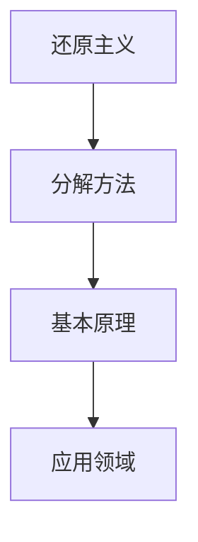
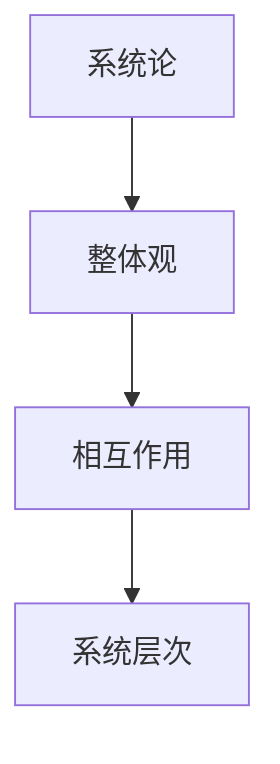
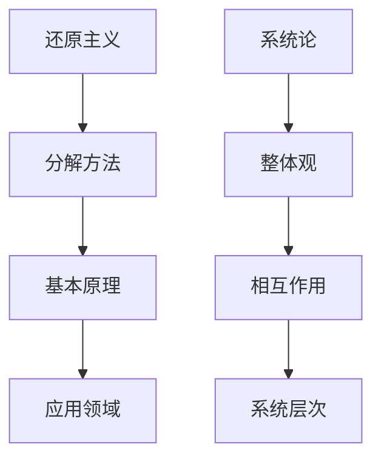

                 


### 第1章 引言

#### 1.1 主题背景与意义

**背景介绍：**
随着科技的飞速发展，人们对宇宙的理解不断深入。从古至今，人类对宇宙的探索始终是科学发展的核心议题。然而，在探索过程中，不同的方法论逐渐形成，其中还原主义和系统论是最为重要的两种方法论。还原主义强调通过分解复杂系统来理解其组成部分，而系统论则主张从整体上研究系统及其相互作用。

**意义：**
本书旨在探讨从还原主义到系统论的转变，分析这一转变对宇宙观的整体影响，以及这一转变对现代科技和科学研究的意义。通过对这两种方法论的比较，我们可以更好地理解宇宙的复杂性和整体性，从而推动科学的发展。

#### 1.2 本书结构安排

**结构安排：**
本书分为七个章节。第一章是引言，介绍主题背景和意义。第二章和第三章分别概述还原主义和系统论的基本概念和发展历程。第四章对比分析还原主义和系统论，第五章探讨系统论在宇宙观中的应用。第六章讨论宇宙观的整体转向，第七章展望系统论的未来发展。以下是详细的目录结构：

```
第1章 引言
第2章 还原主义概述
第3章 系统论概述
第4章 还原主义与系统论的对比分析
第5章 系统论在宇宙观中的应用
第6章 系统论视角下的宇宙观整体转向
第7章 系统论的未来展望
```

---

### 第2章 还原主义概述

#### 2.1 还原主义的基本概念

**核心概念与联系：**



**核心概念：**
还原主义是一种科学方法论，它主张将复杂系统分解为更简单的部分，以便理解其组成部分。其基本原理是通过对系统内部各部分的细致分析，来揭示整个系统的行为和特性。

**联系：**
还原主义的核心在于将复杂系统分解为简单部分，这与系统论的“整体大于部分之和”的理念形成了鲜明对比。然而，两者在科学研究中都发挥着重要作用。

#### 2.2 还原主义的历史与发展

**历史发展：**
还原主义的历史可以追溯到古希腊哲学家亚里士多德，他在《物理学》中提出，通过分解和观察，可以理解自然界的本质。随着科学的进步，还原主义在17世纪机械论哲学、18世纪物理主义以及19世纪生命科学中得到了广泛应用。进入20世纪，随着实验科学和数学工具的发展，还原主义方法论得到了进一步巩固。

**发展过程：**
1. **分解方法的完善：** 还原主义通过精细的实验和观察，不断完善对复杂系统的分解方法。
2. **实验科学的发展：** 20世纪的实验科学为还原主义提供了强有力的支持，推动了其方法的应用。
3. **数学工具的应用：** 数学工具的引入使得还原主义在处理复杂系统时更加精确和高效。

#### 2.3 还原主义的局限性

**局限性：**
虽然还原主义在科学研究中发挥了重要作用，但其方法也存在局限性：

1. **复杂性增加：** 随着系统的分解，复杂性不断增加，使得对系统的理解变得更加困难。
2. **还原性降低：** 随着分解深度的增加，系统的组成部分可能失去其在整体系统中的原有属性，导致还原性降低。
3. **整体性忽视：** 还原主义过于关注部分，往往忽视了系统的整体性。

**举例说明：**
在生物学领域，还原主义方法在面对生命现象时显得力不从心，例如细胞内部的生化反应网络和基因调控机制。

---

### 第3章 系统论概述

#### 3.1 系统论的基本概念

**核心概念与联系：**



**核心概念：**
系统论是一种方法论，它强调从整体上研究系统及其相互作用。系统论认为，系统的行为和特性不仅仅取决于其组成部分，还取决于各部分之间的相互作用和系统的整体结构。

**联系：**
系统论与还原主义的核心区别在于其整体观和相互作用观念。系统论关注系统的整体性和各部分之间的相互作用，而还原主义则侧重于将复杂系统分解为简单部分。

#### 3.2 系统论的起源与发展

**起源：**
系统论的起源可以追溯到19世纪末和20世纪初，当时科学家和哲学家开始关注系统的整体性和相互作用。这一时期，涌现出了一批重要的思想家，如马克思·普朗克、罗素、怀特海德等。

**发展过程：**
1. **系统的概念化：** 科学家们开始尝试将自然界和社会现象视为系统，从而提出了一系列关于系统的理论和概念。
2. **数学工具的应用：** 数学工具的引入使得系统论在处理复杂系统时更加精确和高效。
3. **跨学科研究：** 随着系统论的应用范围不断扩大，越来越多的学科开始关注系统的整体性和相互作用。

#### 3.3 系统论的核心原理

**核心原理：**
1. **整体大于部分之和：** 系统的行为和特性不仅仅取决于其组成部分，还取决于各部分之间的相互作用。
2. **相互作用：** 系统中的各部分相互依赖，相互作用，共同决定了系统的行为。
3. **系统层次：** 系统具有不同的层次结构，每个层次都有其独特的特征和功能。

**举例说明：**
在生态系统中，不同物种之间的相互作用决定了整个生态系统的稳定性和多样性。这与还原主义只关注物种个体的研究方法形成了鲜明对比。

---

### 第4章 还原主义与系统论的对比分析

#### 4.1 对比框架与方法

**对比框架：**
为了对比还原主义和系统论，我们可以从以下几个维度进行分析：

1. **研究目标：** 还原主义侧重于理解系统的组成部分，系统论则强调理解系统的整体性和相互作用。
2. **研究方法：** 还原主义采用分解方法，系统论则采用整体观和相互作用观念。
3. **应用领域：** 还原主义在实验科学和工程学中应用广泛，系统论则在生态学、经济学和社会学等领域有着重要应用。
4. **局限性：** 还原主义在面对复杂系统时存在局限性，系统论则能够更好地应对复杂系统的挑战。

**对比方法：**
1. **文献综述：** 分析现有文献中关于还原主义和系统论的研究，总结各自的特点和应用。
2. **案例分析：** 通过具体案例，对比还原主义和系统论在实际应用中的表现。
3. **理论分析：** 基于还原主义和系统论的核心原理，分析两者的差异和互补性。

#### 4.2 还原主义与系统论的差异

**研究目标差异：**
还原主义的目标是理解系统的组成部分，系统论的目标则是理解系统的整体性和相互作用。

**研究方法差异：**
还原主义采用分解方法，将复杂系统分解为简单部分，系统论则采用整体观和相互作用观念，关注系统的整体结构和动态过程。

**应用领域差异：**
还原主义在实验科学和工程学中应用广泛，系统论则在生态学、经济学和社会学等领域有着重要应用。

**局限性差异：**
还原主义在面对复杂系统时存在局限性，如复杂性增加和还原性降低，系统论则能够更好地应对复杂系统的挑战，如整体性和相互作用的研究。

#### 4.3 从还原主义到系统论的转变

**转变背景：**
随着科技的进步和复杂系统研究的深入，还原主义方法的局限性逐渐显现，系统论作为一种更为全面的方法论逐渐受到关注。

**转变原因：**
1. **复杂性增加：** 随着系统的复杂性不断增加，单一分解方法难以应对。
2. **跨学科研究：** 跨学科研究需要更全面的方法论来应对复杂系统的挑战。
3. **整体性需求：** 社会对环境保护、可持续发展等整体性问题的关注，推动了系统论的发展。

**转变影响：**
1. **科学研究方法：** 系统论为科学研究提供了一种更为全面和系统的视角，有助于揭示复杂系统的本质。
2. **技术应用：** 系统论在生态学、经济学和社会学等领域得到了广泛应用，推动了相关领域的发展。
3. **社会观念：** 系统论的观念逐渐渗透到社会生活中，提升了人们对复杂系统的认识和应对能力。

---

### 第5章 系统论在宇宙观中的应用

#### 5.1 系统论与宇宙观的联系

**核心概念：**
系统论在宇宙观中的应用主要体现在对宇宙整体性和相互作用的研究。宇宙作为一个复杂的系统，其行为和特性不仅取决于各个星系、星球等组成部分，还取决于它们之间的相互作用。

**联系：**
系统论的整体观和相互作用观念与宇宙观的核心理念高度契合。系统论为研究宇宙的整体结构和动态过程提供了新的视角和方法。

#### 5.2 系统论在宇宙演化中的应用

**宇宙演化：**
宇宙演化是一个复杂的过程，涉及星系的形成、恒星的生命周期、黑洞的产生等。系统论在宇宙演化中的应用主要体现在以下几个方面：

1. **星系形成：** 系统论可以解释星系的形成过程，如星系的形成与气体云的相互作用。
2. **恒星生命周期：** 系统论可以描述恒星的生命周期，如恒星的诞生、成长、衰老和死亡。
3. **黑洞产生：** 系统论可以解释黑洞的形成和演化，如黑洞的形成与恒星的质量亏损。

**应用：**
系统论在宇宙演化中的应用有助于我们更好地理解宇宙的演化过程，揭示宇宙的奥秘。

#### 5.3 系统论在宇宙复杂性研究中的应用

**宇宙复杂性：**
宇宙是一个复杂的系统，其行为和特性难以用简单的还原主义方法解释。系统论在宇宙复杂性研究中的应用主要体现在以下几个方面：

1. **非线性动力学：** 系统论可以研究宇宙中的非线性动力学过程，如星系碰撞、恒星爆发等。
2. **复杂系统理论：** 系统论引入了复杂系统理论，为研究宇宙的复杂性提供了新的工具和方法。
3. **人工智能：** 系统论与人工智能的结合，为宇宙复杂性研究提供了新的思路和工具。

**应用：**
系统论在宇宙复杂性研究中的应用有助于我们更好地理解宇宙的复杂性和动态过程，推动宇宙科学的发展。

---

### 第6章 系统论视角下的宇宙观整体转向

#### 6.1 整体转向的概念与特征

**概念：**
整体转向是指从还原主义向系统论的转变，强调从整体上研究系统及其相互作用。这一转变不仅体现在科学研究方法上，也体现在社会观念和思维方式上。

**特征：**
1. **整体性：** 强调系统的整体性，关注系统内部的相互作用和整体行为。
2. **相互作用：** 突出各部分之间的相互作用，认为系统的行为和特性不仅仅取决于单个部分。
3. **动态过程：** 关注系统的动态过程，研究系统的演化和发展。

#### 6.2 整体转向的理论基础

**理论基础：**
1. **系统论：** 系统论为整体转向提供了理论基础，强调系统的整体性和相互作用。
2. **复杂系统理论：** 复杂系统理论为研究复杂系统提供了新的视角和方法，支持整体转向。
3. **非线性动力学：** 非线性动力学揭示了系统的复杂性和动态性，为整体转向提供了理论基础。

**理论联系：**
系统论、复杂系统理论和非线性动力学共同构成了整体转向的理论基础，它们相互补充，为整体转向提供了全面的理论支持。

#### 6.3 整体转向的实际影响

**实际影响：**
整体转向对科学研究、技术应用和社会观念产生了深远影响：

1. **科学研究：** 整体转向促进了科学研究的进步，推动了跨学科研究的发展。
2. **技术应用：** 整体转向为新技术应用提供了新的思路和方法，如人工智能、物联网等。
3. **社会观念：** 整体转向改变了人们的思维方式，提升了人们对复杂系统的认识和应对能力。

**举例说明：**
在生态学领域，整体转向促使科学家们从生态系统整体性出发，研究生态系统的稳定性和多样性，推动了生态保护事业的发展。

---

### 第7章 系统论的未来展望

#### 7.1 系统论在科学研究中的应用前景

**应用前景：**
系统论在科学研究中的应用前景广阔，主要体现在以下几个方面：

1. **跨学科研究：** 系统论为跨学科研究提供了新的方法和视角，有助于解决复杂科学问题。
2. **数据科学：** 系统论与数据科学的结合，为大数据分析和人工智能提供了有力支持。
3. **生物医学：** 系统论在生物医学领域具有广泛应用前景，如药物研发、疾病诊断等。

**应用潜力：**
系统论在科学研究中的应用潜力巨大，有望推动科学技术的突破性进展。

#### 7.2 系统论在教育、管理等领域的影响

**教育领域：**
系统论在教育领域的影响主要体现在教学方法改革和课程设计上：

1. **教学方法：** 系统论倡导从整体上理解知识，有助于提高学生的综合素质和创新能力。
2. **课程设计：** 系统论指导课程设计，促进知识的系统性和完整性。

**管理领域：**
系统论在管理领域的影响主要体现在组织管理和战略规划上：

1. **组织管理：** 系统论强调系统的整体性和相互作用，有助于优化组织结构和提高管理效率。
2. **战略规划：** 系统论为战略规划提供了新的思路和方法，有助于制定科学的战略目标。

**应用案例：**
在企业管理中，系统论的方法被广泛应用于供应链管理、战略规划等领域，取得了显著成效。

#### 7.3 系统论对人类社会发展的意义

**社会意义：**
系统论对人类社会发展的意义在于：

1. **可持续发展：** 系统论为可持续发展提供了理论基础和方法指导，有助于解决环境、资源等问题。
2. **社会稳定：** 系统论关注系统的稳定性和平衡性，有助于维护社会稳定。
3. **创新能力：** 系统论促进跨学科研究和创新，为人类社会的发展提供了源源不断的动力。

**未来展望：**
随着系统论的不断发展，其将在更广泛的领域产生深远影响，推动人类社会向更高层次发展。

---

### 附录

#### 附录A：还原主义与系统论核心概念流程图

**流程图：**



#### 附录B：数学模型和公式详述

**数学模型和公式：**

1. **还原主义：**
   $$\text{复杂性} = \frac{\text{组成部分数量}}{\text{相互作用强度}}$$
   还原主义通过减少相互作用来降低复杂性。

2. **系统论：**
   $$\text{整体性} = \frac{\text{整体行为}}{\text{部分行为}}$$
   系统论强调整体行为大于部分行为之和。

3. **相互作用：**
   $$\text{相互作用强度} = \frac{\text{相互作用能量}}{\text{相互作用距离}}$$
   相互作用强度取决于相互作用能量和距离。

#### 附录C：系统论在宇宙观整体转向中的实际案例解析

**案例解析：**

1. **星系形成：**
   系统论解释了星系的形成过程，通过星系间气体的相互作用，形成了复杂的星系结构。

2. **地球生态系统：**
   系统论分析了地球生态系统的稳定性，揭示了物种间相互作用的复杂性。

3. **经济系统：**
   系统论研究了经济系统的波动，揭示了市场经济中的相互作用和整体性。

**小结：**
系统论在宇宙观整体转向中发挥了重要作用，通过分析实际案例，展示了其强大的解释能力和应用价值。

---

### 作者信息

**作者：** AI天才研究院/AI Genius Institute & 禅与计算机程序设计艺术 /Zen And The Art of Computer Programming

