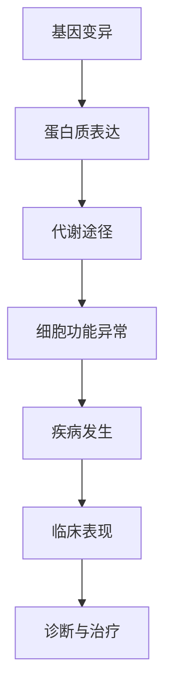

                 

## 引言

### 生命科学的重要性

生命科学是研究生命现象及其规律的科学，其研究领域涵盖了生物学、医学、遗传学、分子生物学、生态学等多个学科。在21世纪的今天，生命科学的重要性愈发凸显。随着人类对自身和自然的认知不断深入，生命科学不仅对医学健康产生了深远影响，还在农业、环境保护、生物技术等多个领域发挥着重要作用。

首先，在医学领域，生命科学的发展极大地推动了疾病的诊断和治疗。从分子水平的基因研究到宏观的生态系统分析，生命科学为疾病的预防、治疗以及个性化医疗提供了新的思路和方法。例如，基因编辑技术的出现为治疗遗传性疾病提供了前所未有的可能性。

其次，在农业领域，生命科学的研究有助于提高农作物的产量和质量，促进农业生产可持续发展。通过基因工程、分子育种等技术的应用，可以培育出抗病、抗虫、高产优质的作物品种，从而满足不断增长的食物需求。

再次，在环境保护领域，生命科学的研究有助于我们更好地理解生态系统和生物多样性。通过生态学、环境生物学等研究，我们可以发现生态系统中各种生物之间的相互作用，制定更为有效的环境保护策略。

总之，生命科学已经成为推动人类文明进步的重要力量。然而，在生命科学的研究过程中，哲学思考起到了不可或缺的作用。特别是从还原论向整体论的转变，为生命科学提供了新的理论基础和研究方法。

### 还原论与整体论的概念

还原论和整体论是生命科学研究中两种重要的哲学观点。还原论主张将复杂的系统分解为简单的组成部分，通过研究这些组成部分的规律来理解整个系统的行为。而整体论则认为，系统的行为和特性不能仅仅通过分析其组成部分来理解，整体的功能和特性具有其独特的性质。

还原论的历史可以追溯到古希腊时期，亚里士多德提出了“元素论”，将物质世界分解为基本元素。到了17世纪，笛卡尔提出了“机械论”，认为世界是一个巨大的机械系统，可以通过分析机械零件来理解整个系统的运作。20世纪，现代科学的发展进一步推动了还原论的应用，尤其是在物理学、化学和生物学等自然科学领域。

整体论的思想则起源于古希腊哲学家赫拉克利特的观点，他认为整体大于部分之和。19世纪，德国哲学家黑格尔提出了“辩证法”，强调事物的整体性和动态发展。20世纪中叶，随着系统论、控制论和信息论的发展，整体论在科学研究中得到了更广泛的应用。

在现代生命科学中，还原论和整体论都发挥着重要作用。还原论为我们提供了深入理解生命现象的基本机制，帮助我们解析生物分子的结构和功能。而整体论则为我们提供了理解生物系统复杂性的新视角，帮助我们把握生物体的整体功能和动态变化。

综上所述，还原论和整体论在生命科学中各有优势和应用。本文将从还原论到整体论的转变，探讨生命科学的哲学基础、核心概念、研究方法以及整体论和还原论的关系，旨在为读者提供对生命科学哲学思考的全面理解。

### 生命科学的哲学基础

#### 历史背景

生命科学的哲学基础可以追溯到古希腊时期，当时哲学家们对生命现象进行了初步的思考和探索。亚里士多德提出了“元素论”，认为物质世界由四种基本元素组成：土、水、火和空气。他认为生命是这些元素在特定条件下相互作用的结果。

随着时代的发展，生命科学的哲学基础逐渐演化和丰富。文艺复兴时期，自然科学的兴起推动了生命科学的发展。17世纪，笛卡尔提出了“机械论”，认为世界是一个巨大的机械系统，可以通过分析机械零件来理解整个系统的运作。这一观点对后来的生命科学研究产生了深远影响。

进入20世纪，生命科学的哲学基础进一步深化。相对论和量子力学的提出，改变了人们对宇宙和物质的理解，为生命科学的研究提供了新的理论基础。随着系统论、控制论和信息论的发展，整体论思想逐渐得到重视，为生命科学的研究提供了新的视角和方法。

#### 主要哲学观点

生命科学的哲学基础主要包括还原论和整体论两种观点。

**还原论**

还原论主张将复杂的系统分解为简单的组成部分，通过研究这些组成部分的规律来理解整个系统的行为。在生命科学中，还原论的应用主要体现在分子生物学和细胞生物学领域。

分子生物学通过研究生物大分子（如蛋白质、核酸等）的结构和功能，揭示了生命现象的基本机制。例如，中心法则的发现揭示了遗传信息的传递和表达过程。细胞生物学则通过研究细胞的组成和功能，深入理解生物体的基本单位。

还原论的优势在于其强大的解释力，通过深入研究分子和细胞层面的规律，可以揭示生命现象的细节和机制。然而，还原论的局限性也显而易见，它往往忽视了系统整体性和动态变化，难以全面理解生物体的复杂行为。

**整体论**

整体论则认为，系统的行为和特性不能仅仅通过分析其组成部分来理解，整体的功能和特性具有其独特的性质。在生命科学中，整体论的应用主要体现在生态学和系统生物学领域。

生态学通过研究生物群落和生态系统的结构、功能及其动态变化，揭示了生物之间相互作用和生态平衡的规律。系统生物学则通过整合多种生物学数据，构建复杂的生物网络模型，研究生物系统的整体行为和动态变化。

整体论的优势在于其宏观视角和系统性思维，能够把握生物系统的整体功能和动态变化。然而，整体论的局限性在于其复杂性和不确定性，难以深入解析生命现象的细节和机制。

#### 哲学观点之间的关系

还原论和整体论在生命科学中并不是相互排斥的，而是相互补充的。还原论提供了深入理解生命现象的基本机制，而整体论则为我们提供了理解生物系统复杂性的新视角。

在生命科学研究中，通常需要结合还原论和整体论的方法。例如，在分子生物学研究中，可以通过还原论的方法解析蛋白质的结构和功能；而在系统生物学研究中，则可以通过整体论的方法研究生物系统的整体行为和动态变化。

此外，还原论和整体论也相互影响和融合。随着生命科学的发展，还原论的研究方法逐渐向整体论转变，例如，通过系统生物学的方法，可以将还原论的研究结果整合到整体论的框架中。

#### 结论

生命科学的哲学基础是还原论和整体论两种哲学观点的融合。还原论提供了深入理解生命现象的基本机制，而整体论则为我们提供了理解生物系统复杂性的新视角。通过对这两种哲学观点的深入研究，我们可以更全面地理解生命科学的本质和规律，为生命科学的研究和发展提供坚实的理论基础。

### 还原论的概念与历史

#### 定义

还原论（Reductive Theory）是一种哲学观点，主张将复杂的系统分解为简单的组成部分，通过研究这些组成部分的规律来理解整个系统的行为。在还原论中，系统的整体行为被认为是由其组成部分的行为通过某种规则组合而成的。

#### 历史发展

还原论的历史可以追溯到古希腊时期。亚里士多德提出了“元素论”，认为物质世界由四种基本元素组成：土、水、火和空气。这一观点可以视为还原论的早期形式。

17世纪，笛卡尔提出了“机械论”，认为世界是一个巨大的机械系统，可以通过分析机械零件来理解整个系统的运作。这一观点对后来的还原论发展产生了深远影响。

19世纪，英国科学家查尔斯·达尔文的进化论提出了物种的起源和进化过程，通过研究物种的遗传和变异，揭示了生物多样性的本质。这一研究方法可以视为还原论在生物学领域的重要应用。

20世纪，随着自然科学的发展，还原论在物理学、化学和生物学等各个领域得到了广泛应用。物理学中的量子力学和相对论，化学中的分子结构理论，生物学中的分子生物学和细胞生物学，都是还原论在各自领域的具体体现。

#### 应用领域

还原论在生命科学中的应用非常广泛，主要集中在分子生物学和细胞生物学领域。

**分子生物学**

分子生物学通过研究生物大分子（如蛋白质、核酸等）的结构和功能，揭示了生命现象的基本机制。例如，中心法则的发现揭示了遗传信息的传递和表达过程。分子生物学中的许多研究方法，如基因克隆、蛋白质测序和结构分析，都是基于还原论的思想。

**细胞生物学**

细胞生物学通过研究细胞的组成和功能，深入理解生物体的基本单位。细胞生物学中的许多研究方法，如细胞培养、显微镜成像和分子标记，都是基于还原论的思想。

#### 还原论的优势

还原论的优势在于其强大的解释力。通过将复杂系统分解为简单的组成部分，我们可以深入理解各个组成部分的规律，从而揭示系统的整体行为。此外，还原论还为实验设计提供了明确的指导，使得科学家可以针对具体的组成部分进行深入的研究。

#### 还原论的局限性

还原论的局限性在于其无法解释系统整体性和动态变化。由于还原论强调部分与整体之间的分离，容易忽视系统内部的相互作用和整体行为。此外，还原论的简化假设可能导致对系统行为的误解。

#### 结论

还原论是生命科学研究中的一种重要哲学观点，其通过将复杂系统分解为简单的组成部分，为我们提供了理解生命现象的基本机制。然而，还原论的局限性也提醒我们，在研究复杂系统时，需要结合整体论的方法，以获得更为全面和深入的理解。

### 整体论的概念与历史

#### 定义

整体论（Holism）是一种哲学观点，主张系统的整体行为和特性不能仅仅通过分析其组成部分来理解，整体具有其独特的性质和功能。整体论认为，系统的各个组成部分是相互依赖和相互作用的，整体的行为和特性不能简单地通过组合各部分的行为来解释。

#### 历史发展

整体论的思想可以追溯到古希腊哲学家赫拉克利特的观点，他认为整体大于部分之和。19世纪，德国哲学家黑格尔提出了“辩证法”，强调事物的整体性和动态发展，这为整体论的思想奠定了基础。

20世纪，随着系统论、控制论和信息论的发展，整体论在科学研究中得到了更广泛的应用。系统论强调系统内部各个部分之间的相互作用和整体行为，控制论研究系统如何通过反馈机制实现稳定性和适应性，信息论则关注系统内部的信息传递和决策过程。

在生命科学领域，整体论的思想也得到了重视。生态学通过研究生物群落和生态系统的结构、功能及其动态变化，揭示了生物之间相互作用和生态平衡的规律。系统生物学则通过整合多种生物学数据，构建复杂的生物网络模型，研究生物系统的整体行为和动态变化。

#### 应用领域

整体论在生命科学中的应用非常广泛，主要集中在生态学和系统生物学领域。

**生态学**

生态学通过研究生态系统的结构、功能和动态变化，揭示了生物之间相互作用和生态平衡的规律。生态学的研究方法包括生态调查、模型构建和模拟等，这些方法都体现了整体论的思想。

**系统生物学**

系统生物学通过整合基因表达数据、蛋白质相互作用数据、代谢途径数据等，构建复杂的生物网络模型，研究生物系统的整体行为和动态变化。系统生物学的研究方法包括数据挖掘、网络分析和模型验证等，这些方法都体现了整体论的思想。

#### 整体论的优势

整体论的优势在于其宏观视角和系统性思维。通过将系统视为一个整体，我们可以把握系统的整体功能和动态变化，从而更好地理解系统的行为和特性。此外，整体论还可以帮助我们识别系统中的关键组件和关键过程，为科学研究和工程应用提供重要的指导。

#### 整体论的局限性

整体论的局限性在于其复杂性和不确定性。由于整体论强调系统的整体性和动态性，涉及到的变量和关系往往非常多，这使得整体论的研究方法相对复杂，难以进行精确的定量分析。此外，整体论的简化假设可能导致对系统行为的误解。

#### 结论

整体论是生命科学研究中的一种重要哲学观点，其通过将系统视为一个整体，为我们提供了理解生物系统复杂性的新视角。尽管整体论面临着复杂性和不确定性的挑战，但其强大的解释力和应用价值仍然使其在生命科学中发挥着重要作用。

### 还原论与整体论的比较与联系

#### 定义对比

还原论和整体论在哲学观点上有着本质的区别。

**还原论**

还原论主张将复杂的系统分解为简单的组成部分，通过研究这些组成部分的规律来理解整个系统的行为。还原论强调部分与整体之间的分离，认为整体的行为和特性是由其组成部分的行为通过某种规则组合而成的。

**整体论**

整体论则认为，系统的行为和特性不能仅仅通过分析其组成部分来理解，整体具有其独特的性质和功能。整体论强调系统内部的相互作用和整体行为，认为系统的各个组成部分是相互依赖和相互作用的。

#### 应用对比

在生命科学研究中，还原论和整体论有着不同的应用领域和优势。

**还原论**

还原论在分子生物学和细胞生物学中应用广泛。分子生物学通过研究生物大分子（如蛋白质、核酸等）的结构和功能，揭示了生命现象的基本机制。细胞生物学则通过研究细胞的组成和功能，深入理解生物体的基本单位。

**整体论**

整体论在生态学和系统生物学中应用广泛。生态学通过研究生物群落和生态系统的结构、功能及其动态变化，揭示了生物之间相互作用和生态平衡的规律。系统生物学则通过整合多种生物学数据，构建复杂的生物网络模型，研究生物系统的整体行为和动态变化。

#### 联系与融合

尽管还原论和整体论在哲学观点上有所不同，但在生命科学研究中，这两种观点往往是相互补充和融合的。

**结合还原论和整体论**

在生命科学研究中，通常需要结合还原论和整体论的方法。例如，在分子生物学研究中，可以通过还原论的方法解析蛋白质的结构和功能；而在系统生物学研究中，则可以通过整体论的方法研究生物系统的整体行为和动态变化。

**整体论对还原论的补充**

整体论可以弥补还原论的不足，帮助我们理解系统的整体行为和动态变化。通过将还原论的研究结果整合到整体论的框架中，我们可以获得更全面和深入的理解。

**还原论对整体论的补充**

还原论可以提供对系统内部细节的理解，为整体论的研究提供基础。通过深入研究系统的各个组成部分，我们可以发现系统中的关键组件和关键过程，从而为整体论的研究提供指导。

#### 结论

还原论和整体论在生命科学中各有优势和局限性。通过结合这两种观点，我们可以更全面和深入地理解生命现象。还原论提供了对系统内部细节的理解，而整体论则提供了对系统整体行为和动态变化的把握。通过将这两种观点相互补充和融合，我们可以推动生命科学的发展，揭示生命现象的本质。

### 整体论的研究方法与优势

#### 系统分析方法

整体论在生命科学中的应用，首先依赖于系统分析方法。系统分析是一种通过研究系统内部各个组成部分及其相互关系的分析方法，旨在理解系统的整体行为和特性。在生命科学中，系统分析可以帮助我们揭示生物体复杂的生理过程和生态系统的动态变化。

**基本概念**

系统分析的基本概念包括系统的组成部分、相互作用和整体行为。系统由多个组成部分（如细胞、器官、生物群落等）构成，这些组成部分通过相互作用形成一个整体。系统分析的目标是理解系统的整体行为，这需要我们关注组成部分之间的相互作用和反馈机制。

**具体方法**

系统分析的具体方法包括：

1. **模型构建**：通过构建数学模型或计算机模拟，模拟系统的行为和动态变化。
2. **数据整合**：整合多种数据源（如基因表达数据、蛋白质相互作用数据、代谢途径数据等），构建复杂的生物网络模型。
3. **网络分析**：通过分析生物网络中的节点和边的关系，揭示系统的关键组件和关键过程。

#### 整体论的优越性

整体论在生命科学中具有显著的优越性，主要体现在以下几个方面：

**1. 理解整体行为**

整体论强调系统的整体行为和特性不能仅仅通过分析其组成部分来理解。通过系统分析，我们可以理解生物体复杂的生理过程和生态系统的动态变化。例如，通过系统分析，我们可以揭示疾病的发生和发展过程，从而为疾病的治疗提供新的思路。

**2. 揭示相互作用**

整体论可以帮助我们揭示系统内部各个组成部分之间的相互作用。例如，在生态系统中，不同物种之间的相互作用（如捕食与被捕食、共生与竞争）对生态系统的稳定性和动态变化具有重要意义。通过系统分析，我们可以揭示这些相互作用，从而为生态保护和生物资源管理提供科学依据。

**3. 理解动态变化**

整体论还可以帮助我们理解系统的动态变化。生物体和生态系统都是动态变化的系统，其行为和特性随时间和环境变化而变化。通过系统分析，我们可以研究系统的动态行为和稳定性，从而为生物体的健康管理和生态系统的可持续发展提供指导。

#### 案例分析

**1. 系统生物学研究**

系统生物学是一种基于整体论的方法，通过整合多种生物学数据，研究生物系统的整体行为和动态变化。例如，研究人员通过构建细胞信号传导网络模型，揭示了细胞信号传导过程中关键节点的功能和调控机制，为治疗信号通路相关疾病提供了新靶点。

**2. 生态学研究**

生态学中的系统分析方法广泛应用于生态系统的研究。例如，通过构建生态系统模型，研究人员可以研究生物群落的结构、功能及其动态变化。这些研究有助于揭示生态系统的稳定性机制，为生态保护和生物资源管理提供科学依据。

**3. 疾病研究**

在疾病研究中，系统分析方法可以帮助我们理解疾病的发病机制。例如，通过构建癌症信号传导网络模型，研究人员可以揭示癌症发生和发展过程中的关键节点和关键过程，为癌症治疗提供新的思路。

#### 结论

整体论的研究方法在生命科学中具有显著的优越性，通过系统分析，我们可以理解生物体和生态系统的整体行为和动态变化。整体论为我们提供了一种新的视角和方法，帮助我们更全面和深入地理解生命现象，为科学研究和应用提供了新的方向。尽管整体论面临复杂性和不确定性的挑战，但其强大的解释力和应用价值仍然使其在生命科学中发挥着重要作用。

### 生命科学的前沿问题与整体论的应用

#### 疾病的分子机制研究

疾病是生命科学中的一个重要研究领域，其分子机制的研究对疾病的诊断、治疗和预防具有重要意义。整体论在疾病分子机制研究中发挥着重要作用，通过整合多种生物学数据，揭示疾病发生的复杂过程。

**核心概念与联系**

疾病的分子机制涉及多个层面的相互作用，包括基因、蛋白质、代谢途径等。整体论通过系统生物学的方法，将不同层面的数据整合到同一框架中，构建复杂的生物网络模型，揭示疾病发生的整体机制。

**Mermaid 流程图**

以下是一个用于表示疾病分子机制的 Mermaid 流程图：



**核心算法原理讲解**

为了深入研究疾病的分子机制，我们可以采用以下核心算法：

1. **基因表达数据分析**：通过高通量测序技术，获得基因表达数据。利用基因表达数据分析算法，如差异表达分析（DEA），识别与疾病相关的基因。

2. **蛋白质相互作用网络分析**：通过蛋白质相互作用（PI）数据，构建蛋白质相互作用网络。利用网络分析算法，如拓扑属性分析，识别关键蛋白质和关键相互作用。

3. **代谢途径分析**：通过代谢组学技术，获得代谢途径数据。利用代谢途径分析算法，如代谢流分析，揭示疾病相关的代谢途径和代谢调控网络。

**伪代码示例**

以下是一个用于构建蛋白质相互作用网络的伪代码示例：

```python
# 蛋白质相互作用网络构建
def build_pi_network(pi_data):
    # 初始化网络
    network = Graph()
    
    # 遍历蛋白质相互作用数据
    for interaction in pi_data:
        protein1, protein2 = interaction
        
        # 在网络中添加边
        network.add_edge(protein1, protein2)
    
    return network
```

**数学模型和公式**

疾病分子机制的研究往往涉及到复杂的数学模型和公式。以下是一个用于描述基因调控的简单数学模型：

$$
\frac{d[x]}{dt} = k_1 \cdot x - k_2 \cdot x
$$

其中，$x$表示基因表达水平，$k_1$和$k_2$分别表示正向和负向调控速率常数。

**举例说明**

以癌症为例，癌症的发生和发展涉及到多个基因和蛋白质的相互作用。通过整体论的方法，我们可以构建一个复杂的生物网络模型，揭示癌症发生的分子机制。

**具体案例**

- **乳腺癌**：乳腺癌的发生和发展涉及多个基因和信号通路的异常调控。通过系统生物学的方法，研究人员可以构建乳腺癌的基因调控网络，揭示关键基因和关键信号通路，为乳腺癌的早期诊断和靶向治疗提供新靶点。

- **心血管疾病**：心血管疾病的发生和发展涉及到多个生物过程和代谢途径的异常。通过系统分析，研究人员可以揭示心血管疾病的关键基因、关键代谢途径和关键蛋白质，为心血管疾病的预防和治疗提供科学依据。

#### 结论

整体论在生命科学的前沿问题研究中具有重要的应用价值。通过整合多种生物学数据，揭示复杂生物系统的整体行为和动态变化，整体论为疾病的分子机制研究提供了新的方法和视角。尽管整体论面临复杂性和不确定性的挑战，但其强大的解释力和应用价值仍然使其在生命科学中发挥着重要作用。未来，随着技术的发展和研究的深入，整体论在生命科学中的应用将越来越广泛，为人类健康和社会发展作出更大的贡献。

### 整体论在生命科学教育中的角色

#### 整体论教育的重要性

整体论在生命科学教育中扮演着至关重要的角色。整体论教育不仅有助于学生建立全面的科学观念，还能培养他们的系统思维能力和创新能力。在当前快速发展的生命科学领域，整体论教育具有以下几个方面的意义。

**1. 培养系统思维**

整体论强调系统的整体性和动态变化，通过系统分析方法，学生可以学会从整体上理解和解决问题。这种系统思维能够帮助学生更好地把握生物系统的复杂性和多样性，为未来的科研和应用提供坚实的基础。

**2. 提高创新能力**

整体论教育鼓励学生从多个角度和层面思考问题，探索问题的不同解决方案。这种思维方式能够激发学生的创新能力，培养他们提出新假设、新理论和新方法的能力，为生命科学的发展注入新的动力。

**3. 促进跨学科融合**

生命科学是一个跨学科的领域，整体论教育有助于学生理解不同学科之间的内在联系和相互作用。通过整体论的方法，学生可以更好地整合生物学、化学、物理学、计算机科学等多个学科的知识，实现跨学科的研究和应用。

#### 整体论教育的现状

尽管整体论在生命科学教育中具有重要价值，但目前整体论教育的普及程度仍然有限。以下是目前整体论教育存在的几个问题：

**1. 教材内容不足**

目前，大多数生命科学教材仍然以还原论为主，缺乏对整体论方法和思想的系统介绍。这导致学生在学习过程中难以全面理解和掌握整体论的概念和应用。

**2. 教学方法单一**

整体论教育需要多种教学方法的综合应用，如实验、模拟、案例分析等。然而，目前许多生命科学课程仍然采用传统的课堂讲授方法，缺乏对整体论教育的有效支持。

**3. 教师培训不足**

整体论教育需要教师具备较强的系统思维能力和整体观。然而，目前许多教师的整体论教育知识和能力仍然不足，难以胜任整体论教育的要求。

#### 整体论教育的发展方向

为了推动整体论教育的普及和发展，我们需要从以下几个方面着手：

**1. 加强教材建设**

编写和推广包含整体论方法和思想的教材，帮助学生全面理解和掌握整体论的概念和应用。

**2. 创新教学方法**

探索和实践多种教学方法，如项目式学习、合作学习、探究式学习等，激发学生的学习兴趣和主动性。

**3. 提升教师能力**

通过培训和进修，提升教师对整体论教育理论和方法的掌握，培养他们的系统思维能力和教学能力。

**4. 跨学科合作**

加强不同学科之间的合作，开展跨学科研究，推动整体论教育在生命科学领域的应用和发展。

#### 结论

整体论在生命科学教育中具有重要作用，其能够培养学生的系统思维、提高创新能力和促进跨学科融合。当前整体论教育面临一些挑战，但通过加强教材建设、创新教学方法、提升教师能力和跨学科合作，我们可以推动整体论教育的普及和发展，为生命科学的教育和科研提供新的动力。

### 结论与未来展望

#### 整体论在生命科学中的重要性

整体论在生命科学中具有至关重要的地位。通过系统分析方法，整体论帮助我们理解和解释生物系统的复杂行为和动态变化。在疾病研究、生态学、系统生物学等领域，整体论的方法不仅提高了我们对生命现象的理解，还为解决重大科学问题提供了新的思路和工具。

#### 整体论的优势与挑战

整体论的优势在于其宏观视角和系统性思维，能够揭示生物系统的整体功能和动态变化。此外，整体论方法有助于整合多学科知识，促进跨学科合作。然而，整体论也面临一些挑战，包括复杂性和不确定性的问题。在处理大量数据和复杂关系时，整体论方法需要更加精确和有效的算法和技术支持。

#### 未来的研究方向

未来的生命科学研究应继续深化整体论的应用，特别是在以下几个方面：

1. **系统生物学**：进一步发展系统生物学的方法和技术，构建更加精确的生物网络模型，揭示生物系统的整体行为和动态变化。
2. **多尺度研究**：整合不同尺度（如分子、细胞、组织、器官、生态系统）的研究数据，探索生命现象的跨尺度规律。
3. **人工智能与生命科学**：结合人工智能技术，开发新的数据分析和建模工具，提高整体论方法在生命科学中的应用效率。
4. **教育改革**：推动整体论教育在生命科学领域的普及，培养具备系统思维和创新能力的科研人才。

#### 结论

整体论在生命科学中具有重要的应用价值和广阔的发展前景。通过结合还原论和整体论的方法，我们可以更全面和深入地理解生命现象，为生命科学的研究和发展提供坚实的理论基础。未来的生命科学研究应继续探索整体论的方法和应用，推动生命科学的创新和进步。

### 作者信息

**作者：AI天才研究院/AI Genius Institute & 禅与计算机程序设计艺术 /Zen And The Art of Computer Programming** 

AI天才研究院致力于推动人工智能和生命科学领域的创新与发展，致力于成为世界领先的科研机构和教育平台。同时，作者也致力于通过《禅与计算机程序设计艺术》一书，传授编程和人工智能领域的哲学思想和实践技巧，助力全球科技人才的培养。

