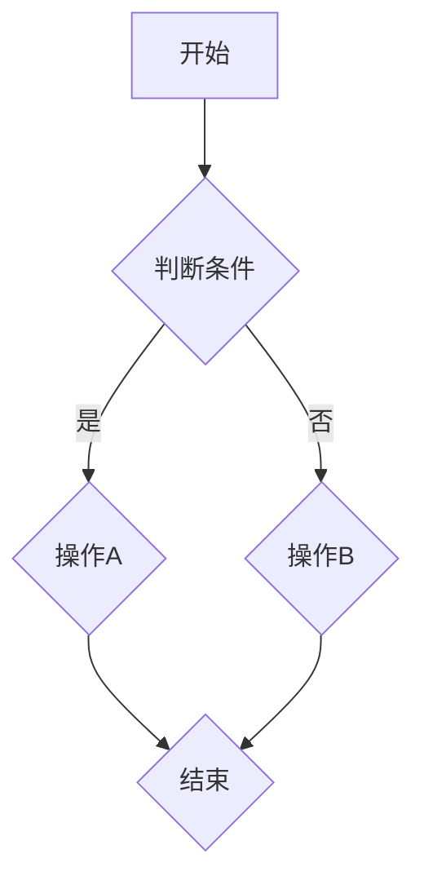
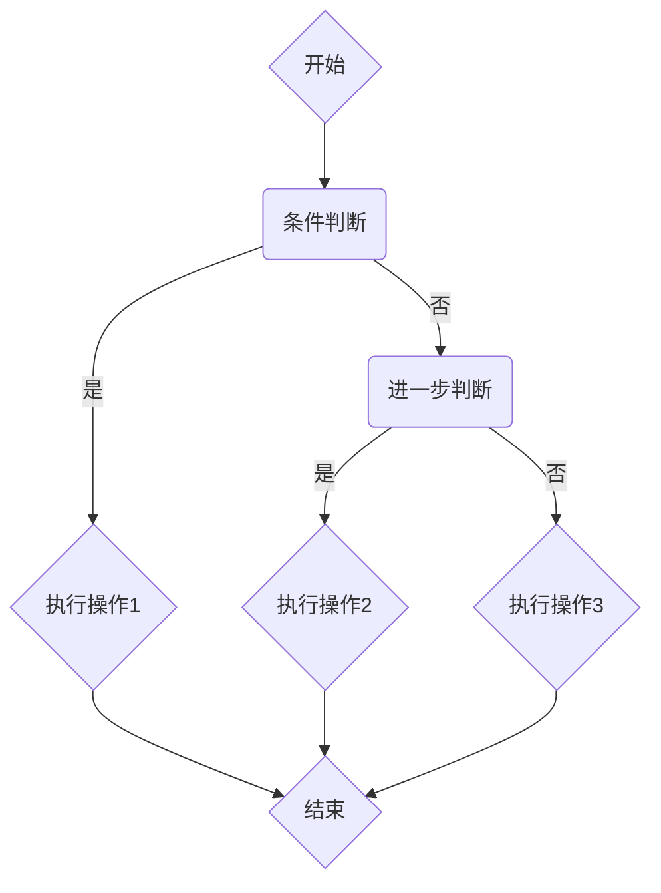

                 

### 文章标题

《从还原论到网络科学：理解复杂关系主导的世界》

---

### 关键词

- 还原论
- 网络科学
- 复杂系统
- 关系分析
- 数据模型
- 算法

---

### 摘要

随着科学技术的进步，我们对世界的认识从简单的还原论逐渐转向复杂的网络科学。本文旨在探讨这一转变的背景、核心概念以及应用实例。我们将首先介绍还原论的基本原理，接着深入探讨网络科学的核心概念和数学模型，并通过具体实例展示网络科学在复杂系统分析中的实际应用。最后，我们将展望网络科学的发展趋势，并总结其对各个领域的影响。通过这一系列的分析和推理，我们希望读者能够更好地理解复杂关系主导的世界，并掌握运用网络科学方法解决实际问题的能力。

---

## 引言

在科学的发展历程中，我们的方法论经历了从简单到复杂、从微观到宏观的重大变革。还原论（Reductive Methodology）作为传统科学的主要方法论，强调将复杂现象分解为基本要素，通过研究这些基本要素及其相互作用来理解整体。然而，随着研究的深入，还原论的局限性逐渐显现，尤其是在面对复杂系统时，其分解和简化的方法难以有效解释复杂现象。

在这种背景下，网络科学（Network Science）应运而生。网络科学是一种新兴的跨学科研究领域，它关注的是复杂系统中各要素之间的相互作用和关系结构。与还原论不同，网络科学强调整体性和关系性，通过研究网络结构、网络动力学和网络分析算法来揭示复杂系统的行为和规律。

本文将围绕这一主题展开，首先介绍还原论的基本原理及其在传统科学中的应用，接着深入探讨网络科学的核心概念和数学模型，并通过具体实例展示网络科学在复杂系统分析中的实际应用。最后，我们将展望网络科学的发展趋势，并总结其对各个领域的影响。希望通过这一系列的探讨，读者能够对还原论和网络科学有一个全面而深入的理解。

## 还原论简介

还原论是一种科学研究方法，其核心思想是将复杂现象分解为基本要素，通过研究这些基本要素及其相互作用来理解整体。这种方法的起源可以追溯到古希腊哲学家亚里士多德，他在《形而上学》中提出了“万物由元素构成”的观点。此后，随着自然科学的发展，还原论逐渐成为科学研究的重要方法论。

### 还原论的基本原理

还原论的基本原理可以概括为以下几点：

1. **分解与简化**：还原论认为，复杂现象可以通过分解为基本要素来理解。这些基本要素通常是简单的、可重复的，并且遵循一定的规律。
2. **相互作用**：还原论强调基本要素之间的相互作用是理解整体现象的关键。通过研究这些相互作用，我们可以揭示复杂现象背后的机制。
3. **层次结构**：还原论认为，复杂系统具有层次结构，从微观层面到宏观层面，每个层次都有其独特的规律和机制。

### 还原论在传统科学中的应用

还原论在传统科学中得到了广泛应用，尤其在物理学、化学和生物学等领域。以下是几个典型的应用实例：

1. **物理学**：牛顿力学是还原论在物理学中的经典应用。通过将宏观现象分解为质点的运动，牛顿力学成功地解释了行星运动、碰撞等复杂现象。
2. **化学**：化学键理论将分子分解为原子，通过研究原子间的相互作用来解释物质的性质和变化。
3. **生物学**：孟德尔遗传学通过研究基因的传递和组合，揭示了生物遗传的基本规律。

### 还原论的局限性

尽管还原论在许多领域取得了巨大成功，但其局限性也逐渐显现。尤其是在面对复杂系统时，还原论的方法难以有效解释整体现象。以下是一些还原论的主要局限性：

1. **层次跳跃问题**：还原论往往在不同层次之间跳跃，而不同层次之间的相互作用往往难以精确描述。
2. **遗漏关键信息**：还原论在分解复杂现象时，可能会遗漏一些重要的信息，导致对整体现象的理解不完整。
3. **适应性限制**：还原论方法在处理动态和适应性的复杂系统时，往往效果不佳。

总之，还原论是一种重要的科学方法论，但在面对复杂系统时，其局限性不可忽视。为了更好地理解和分析复杂现象，我们需要引入新的方法论，如网络科学。

## 网络科学基础

随着对复杂系统研究的深入，科学家们发现，传统还原论方法在面对高度复杂且相互关联的系统时存在诸多局限性。为此，网络科学（Network Science）作为一种新兴的方法论应运而生。网络科学强调系统的整体性和关系性，通过研究网络结构、网络动力学和网络分析算法来揭示复杂系统的行为和规律。

### 网络科学的核心概念

网络科学的核心概念可以归结为以下几个方面：

1. **网络结构**：网络结构是网络科学研究的核心内容之一。它描述了网络中各个节点（个体或元素）及其相互连接的关系。网络结构可以通过图（Graph）来表示，图论是研究网络结构的重要工具。
   
2. **节点和边**：节点表示网络中的个体或元素，边表示节点之间的相互作用或关系。节点的度和边的权重是衡量网络结构的重要指标。
   
3. **网络动力学**：网络动力学研究网络中的动态过程，如节点的加入与移除、边的建立与断裂等。通过研究网络动力学，可以揭示网络随时间演变的行为模式。

4. **网络属性**：网络属性包括网络的连通性、聚类系数、路径长度等。这些属性反映了网络的宏观特征，对于理解网络的功能和行为具有重要意义。

### 网络科学的数学模型

网络科学中的数学模型是理解和分析网络现象的重要工具。以下是一些常见的数学模型：

1. **图论模型**：图论是研究网络结构的基本工具，通过图的表示、路径与连通性分析，可以揭示网络的基本特征。

2. **随机图模型**：如埃尔德什-雷伊图（Erdős-Rényi Graph）和巴特莱特图（Barabási-Albert Graph），用于模拟网络生成过程和演化规律。

3. **网络动力学模型**：如扩散过程模型（Diffusion Process）、同步模型（Synchronization Model）和意见动力学模型（Opinion Dynamics Model），用于模拟网络中的动态过程。

4. **网络属性模型**：如小世界模型（Small-World Model）和无标度模型（Scale-Free Model），用于研究网络的小世界效应和无标度特性。

### 网络科学的研究领域

网络科学涉及多个领域，包括但不限于：

1. **社会网络分析**：研究人与人之间的关系，揭示社会网络的结构和功能，应用于社交网络、推荐系统等领域。
2. **复杂网络**：研究各种类型的复杂网络，如生物网络、经济网络、交通网络等，通过分析其结构和动力学特性来理解复杂系统的行为。
3. **信息网络**：研究信息传播、网络攻击、数据流分析等问题，应用于网络安全、智能交通、智能家居等领域。
4. **生物信息学**：利用网络科学的方法研究生物分子网络、基因调控网络等，揭示生物系统的功能和机制。

通过以上对网络科学核心概念的介绍和数学模型的阐述，我们可以看到，网络科学为理解和分析复杂系统提供了新的视角和方法。接下来，我们将进一步探讨还原论与网络科学的对比和联系，以便更全面地理解网络科学在复杂系统分析中的应用。

### 还原论与网络科学的对比与联系

还原论和网络科学是两种截然不同的方法论，它们各自有其独特的优势和应用场景。然而，在解决复杂系统的问题时，这两种方法并不是相互排斥的，而是可以相互补充。

#### 还原论的优势与应用

还原论的核心思想是将复杂现象分解为基本要素，通过研究这些基本要素及其相互作用来理解整体。这种方法在许多领域取得了显著成就，以下是几个方面的具体应用：

1. **物理学**：在经典物理学中，还原论被广泛应用于研究微观粒子和宏观物体的运动规律。例如，通过研究电子和原子的相互作用，我们可以理解化学反应的本质。
   
2. **化学**：化学键理论是还原论在化学中的典型应用，通过研究原子间的相互作用来解释物质的性质和化学反应。
   
3. **生物学**：孟德尔的遗传学理论也是还原论在生物学中的重要应用。通过研究基因的传递和组合，我们可以理解生物的遗传特征。

还原论的优势在于其简化和分解的思维方式，使得复杂问题变得可操作和可理解。然而，这种方法也存在局限性，特别是在面对高度复杂和相互关联的系统时，其分解和简化的方法往往难以有效解释整体现象。

#### 网络科学的优势与应用

网络科学则强调系统的整体性和关系性，通过研究网络结构、网络动力学和网络分析算法来揭示复杂系统的行为和规律。以下是网络科学的一些优势和应用：

1. **整体性**：网络科学关注系统中的各个部分及其相互关系，而不是孤立的部分。这种方法能够更好地捕捉系统的整体特性。
   
2. **关系性**：网络科学通过研究节点和边之间的相互作用，揭示了复杂系统的动态行为和功能机制。
   
3. **跨学科应用**：网络科学可以应用于多个领域，如社会网络分析、复杂网络、信息网络和生物信息学等，使得不同领域的研究方法和技术能够相互借鉴和融合。

网络科学的优势在于其能够捕捉和解释复杂系统中的复杂关系和动态行为，然而，这种方法在处理高度简化的系统时可能显得过于复杂和繁琐。

#### 还原论与网络科学的联系

尽管还原论和网络科学在方法论上存在差异，但它们并不是相互独立的。实际上，在网络科学的发展过程中，许多还原论的思想和方法得到了广泛应用和改进。

1. **网络结构的分解**：网络科学借鉴了还原论的分解思想，将复杂网络分解为基本要素（节点和边），并通过研究这些基本要素的属性和相互作用来理解整体网络。
   
2. **网络动力学的建模**：网络科学中的许多模型（如扩散过程模型、同步模型和意见动力学模型）都借鉴了还原论的方法论，通过分解和简化来建立网络动力学的模型。

3. **跨学科方法的融合**：网络科学在不同领域的应用，如社会网络分析、生物信息学等，也借鉴了还原论和各领域特有的方法论，实现了跨学科的研究和方法融合。

#### 还原论与网络科学的区别

尽管还原论和网络科学有联系，但它们也存在显著的区别：

1. **关注点不同**：还原论关注基本要素及其相互作用，而网络科学更关注系统的整体结构和动态行为。
   
2. **适用场景不同**：还原论适用于简单和孤立的系统，而网络科学则适用于高度复杂和相互关联的系统。
   
3. **方法论不同**：还原论依赖于分解和简化的方法，而网络科学则依赖于整体性和关系性的方法。

综上所述，还原论和网络科学各自有其独特的优势和应用场景，但在面对复杂系统时，它们可以相互补充，共同推动我们对复杂世界的理解。下一节，我们将深入探讨网络科学在复杂系统分析中的应用。

## 网络科学在复杂系统分析中的应用

网络科学作为一种新的方法论，其在复杂系统分析中的应用越来越受到关注。通过研究复杂系统中的节点和边关系，我们可以更好地理解系统的整体行为和功能。以下将具体探讨网络科学在复杂系统分析中的应用，包括社会网络分析、生物网络分析、经济网络分析等领域的实例。

### 社会网络分析

社会网络分析（Social Network Analysis，SNA）是网络科学的一个重要分支，主要研究人与人之间的社会关系及其对个体和社会行为的影响。以下是一个具体实例：

#### 社会网络分析的基本概念

1. **节点（Node）**：在社交网络中，节点代表个体，如人、组织或群体。
2. **边（Edge）**：边表示节点之间的直接联系，如朋友关系、合作关系等。
3. **网络结构**：通过图论模型，我们可以分析社交网络的拓扑结构，如聚类系数、路径长度、网络密度等。

#### 应用实例

- **社交媒体分析**：研究社交媒体平台上的用户关系，可以揭示社交网络的层次结构、信息传播路径和影响力分布。
- **推荐系统**：通过分析社交网络中的节点关系，推荐系统可以更准确地预测用户行为和偏好，提高推荐效果。

### 生物网络分析

生物网络分析（Bioinformatics Network Analysis，BNA）利用网络科学方法研究生物分子相互作用、基因调控网络和蛋白质相互作用网络等。以下是一个具体实例：

#### 生物网络分析的基本概念

1. **节点（Node）**：在生物网络中，节点可以是基因、蛋白质或其他生物分子。
2. **边（Edge）**：边表示节点之间的相互作用，如基因调控、蛋白质结合等。
3. **网络属性**：通过分析生物网络的拓扑结构和动力学行为，可以揭示生物系统的功能和机制。

#### 应用实例

- **基因调控网络**：通过分析基因表达数据，我们可以构建基因调控网络，揭示基因之间的调控关系。
- **蛋白质相互作用网络**：蛋白质相互作用网络是研究细胞功能和疾病机制的重要工具，通过分析蛋白质之间的相互作用，可以揭示细胞内的信号传导路径和生物途径。

### 经济网络分析

经济网络分析（Economic Network Analysis，ENA）研究经济系统中的关系结构、市场行为和金融网络等。以下是一个具体实例：

#### 经济网络分析的基本概念

1. **节点（Node）**：在经济网络中，节点可以是企业、市场或消费者。
2. **边（Edge）**：边表示节点之间的交易关系、合作关系或竞争关系。
3. **网络属性**：通过分析经济网络的拓扑结构和动力学行为，可以揭示经济系统的稳定性和演化规律。

#### 应用实例

- **金融市场分析**：通过分析金融网络中的节点关系和边权重，可以揭示金融市场的风险分布、传染性和市场稳定性。
- **供应链管理**：通过分析供应链网络中的节点关系和物流路径，可以优化供应链的效率和降低成本。

### 综合实例

- **多网络交叉分析**：在实际应用中，不同类型的网络（如社会网络、生物网络、经济网络）往往相互交织。通过多网络交叉分析，我们可以从不同维度和层面更全面地理解复杂系统的行为。

综上所述，网络科学在复杂系统分析中具有广泛的应用前景。通过研究节点和边之间的关系，我们可以更好地理解复杂系统的结构和功能，为实际问题的解决提供科学依据。

## 复杂系统的定义与特征

在探讨网络科学在复杂系统分析中的应用之前，我们需要明确复杂系统的定义和特征。复杂系统是指由众多相互作用的个体或组件构成的系统，这些个体或组件之间的相互作用和关系使得系统表现出非线性、自适应和涌现等特征。以下是对复杂系统的定义和特征的详细解释。

### 复杂系统的定义

复杂系统可以从多个角度进行定义，但普遍认为，复杂系统具有以下核心特征：

1. **多层次结构**：复杂系统通常包含多个层次，从微观到宏观，每个层次都有自己的规律和机制。这些层次之间的相互作用构成了复杂系统的整体行为。
2. **非线性和动态性**：复杂系统的行为通常是非线性的，即系统的输出不是简单的输入函数。此外，复杂系统是动态的，其状态随时间变化，这种变化可能表现出周期性、随机性或混沌性。
3. **自适应性和进化性**：复杂系统中的个体或组件能够根据环境变化调整其行为，这种自适应性和进化性使得系统能够在动态环境中保持稳定或演化。
4. **不确定性和随机性**：复杂系统的行为受到多种不确定性和随机性的影响，这种不确定性和随机性是复杂系统难以精确预测和控制的重要原因。

### 复杂系统的特征

1. **复杂性**：复杂性是复杂系统最显著的特性。复杂系统中的个体或组件之间的相互作用和关系非常复杂，导致系统的整体行为难以通过简单的数学模型或线性关系来描述。
2. **非线性**：复杂系统的行为通常是非线性的，即系统的输出不是简单的输入函数。这种非线性特性使得系统在不同状态之间表现出不同的响应，增加了系统行为的多样性。
3. **涌现性**：涌现性是指复杂系统中的个体或组件之间的相互作用导致系统整体上表现出新的、不可预见的行为。例如，个体之间的简单相互作用可以导致系统的集体行为或整体特性。
4. **自适应性和进化性**：复杂系统中的个体或组件能够根据环境变化调整其行为，这种自适应性和进化性使得系统能够在动态环境中保持稳定或演化。
5. **动态性和不确定性**：复杂系统是动态的，其状态随时间变化，可能表现出周期性、随机性或混沌性。此外，复杂系统的行为受到多种不确定性和随机性的影响，这使得系统难以精确预测和控制。

### 复杂系统的分类

根据复杂系统的特征和组成，复杂系统可以分为以下几种类型：

1. **物理系统**：包括大气系统、生态系统、机械系统等，这些系统的行为通常可以用物理定律来描述，但它们的相互作用非常复杂。
2. **生物系统**：包括细胞系统、器官系统、生物群落等，这些系统的行为受到遗传、发育、生理等多重因素的影响，具有高度的复杂性。
3. **社会系统**：包括经济系统、社会网络、文化系统等，这些系统的行为受到人类行为和决策的影响，具有高度的非线性和社会性。
4. **信息系统**：包括计算机网络、通信系统、控制系统等，这些系统的行为受到信息传输、处理和反馈的影响，具有高度的信息复杂性和动态性。

### 复杂系统的研究方法

为了理解和分析复杂系统，科学家们发展了多种研究方法：

1. **统计物理方法**：通过统计物理的方法，研究复杂系统中的集体行为和宏观特性。
2. **计算机模拟**：利用计算机模拟，通过仿真复杂系统的行为，探索系统的动态性和演化规律。
3. **数据驱动方法**：通过数据分析，从大量数据中提取系统的特征和模式，揭示系统的复杂行为。
4. **跨学科方法**：将不同学科的方法和理论相结合，从不同角度和层面研究复杂系统。

总之，复杂系统的定义和特征为我们理解复杂系统提供了基础，网络科学在复杂系统分析中的应用正是通过研究这些复杂特征和关系，揭示了复杂系统的行为和规律。

## 网络科学在复杂系统分析中的应用

网络科学作为一种新兴的方法论，其在复杂系统分析中的应用已经展现出巨大的潜力和价值。通过研究复杂系统中的节点和边关系，网络科学提供了一种全新的视角，帮助我们更好地理解和分析复杂系统的行为和规律。以下将具体探讨网络科学在复杂系统分析中的几个核心应用，包括网络拓扑分析、网络动力学分析以及核心算法的应用。

### 网络拓扑分析

网络拓扑分析是网络科学中的一种基本方法，它通过分析网络的结构特征来揭示系统的整体行为。网络拓扑分析主要包括以下几个方面：

1. **节点度分析**：节点度是衡量节点在网络中连接程度的重要指标。高度节点（Hub Node）在复杂系统中通常扮演着重要的角色，通过分析节点度分布，我们可以揭示网络的核心节点及其在系统中的作用。
   
2. **聚类系数分析**：聚类系数是衡量节点间连接紧密程度的一个指标。高聚类系数意味着节点之间的连接更加紧密，这有助于信息的快速传播和系统的稳定性。

3. **路径长度分析**：路径长度是指节点之间最短路径的长度。网络中的路径长度分布可以反映网络的连通性和信息传播速度。

4. **网络密度分析**：网络密度是衡量网络中边与节点数量的关系。高密度网络通常具有更好的信息传递效率和更强的抗攻击能力。

### 网络动力学分析

网络动力学分析研究网络中的动态过程，包括节点的加入与移除、边的建立与断裂等。通过分析网络动力学，我们可以揭示复杂系统的动态行为和演化规律。以下是一些典型的网络动力学分析方法：

1. **扩散过程模型**：扩散过程模型研究信息或物质在网络中的传播过程。通过模拟信息传播的动力学行为，我们可以理解网络中的信息流动机制。

2. **同步模型**：同步模型研究网络中节点的同步行为。在同步过程中，节点之间的相互作用使得它们在某个时刻保持一致状态。同步模型在许多应用领域，如电力系统、交通系统等，具有重要意义。

3. **意见动力学模型**：意见动力学模型研究网络中个体意见的形成和传播。通过分析个体之间的交互作用，我们可以理解社会舆论的演变过程。

### 核心算法的应用

网络科学中存在多种核心算法，这些算法在复杂系统分析中发挥着重要作用。以下是一些常见的算法及其应用：

1. **随机游走算法**：随机游走算法是一种基于概率的节点访问方法，通过模拟节点之间的随机跳跃，可以揭示网络中的信息传播路径和节点的重要性。

2. **PageRank算法**：PageRank算法是由Google创始人拉里·佩奇和谢尔盖·布林提出的，用于评估网页的重要性。PageRank算法通过模拟随机用户在互联网上的访问行为，计算每个网页的排名，从而揭示了网络中的信息传播和影响力分布。

3. **社区检测算法**：社区检测算法用于识别网络中的紧密连接子图，即社区。通过社区检测，我们可以理解网络中的模块化结构，揭示系统的组织形式和功能模块。

4. **网络流算法**：网络流算法研究网络中的流量分配和传输问题。通过优化网络流，我们可以提高网络的传输效率和稳定性。

### 具体应用实例

1. **社会网络分析**：在社会网络分析中，网络科学方法被广泛应用于研究社交关系、信息传播和社交影响力。例如，通过分析社交网络中的节点度和社区结构，可以揭示社交网络中的关键节点和影响力群体。

2. **生物网络分析**：在生物网络分析中，网络科学方法被用来研究基因调控网络、蛋白质相互作用网络等。通过分析这些网络的拓扑结构和动力学行为，我们可以理解生物系统的功能和机制。

3. **经济网络分析**：在经济网络分析中，网络科学方法被用来研究金融市场、供应链网络等。通过分析经济网络中的节点关系和边权重，可以揭示金融市场的风险分布、供应链的稳定性等。

综上所述，网络科学在复杂系统分析中的应用非常广泛。通过网络拓扑分析、网络动力学分析和核心算法的应用，我们可以深入理解复杂系统的行为和规律，为实际问题的解决提供科学依据。

## 复杂网络分析的核心算法

在复杂网络分析中，核心算法扮演着至关重要的角色，它们帮助我们理解和揭示复杂网络的特性和行为。以下将介绍几种常见的重要算法，包括社会网络分析算法、经济网络分析算法和生物网络分析算法，以及这些算法的详细描述和应用实例。

### 社会网络分析算法

1. **中心性度量算法**
   - **定义**：中心性度量算法用于评估节点在网络中的中心程度，即节点的重要性和影响力。
   - **常用算法**：度中心性（Degree Centrality）、 closeness centrality、betweenness centrality和eigenvalue centrality。
   - **描述**：度中心性衡量节点连接的边的数量；closeness centrality衡量节点到其他节点的最短路径长度之和；betweenness centrality衡量节点在所有最短路径中的中介程度；eigenvalue centrality基于图的特征向量中心性度量节点的重要性。
   - **应用实例**：在社交媒体分析中，可以通过度中心性识别社交网络中的核心用户；在推荐系统中，可以通过closeness centrality发现相似用户。

2. **社区检测算法**
   - **定义**：社区检测算法用于识别网络中的紧密连接子图，即社区。
   - **常用算法**：Girvan-Newman算法、Louvain算法和标签传播算法。
   - **描述**：Girvan-Newman算法通过迭代移除中间节点来划分社区；Louvain算法基于模块度最大化进行社区检测；标签传播算法通过节点标签的传播来形成社区。
   - **应用实例**：在社交网络分析中，可以通过社区检测识别社交圈子；在生物网络分析中，可以识别功能相关的基因模块。

### 经济网络分析算法

1. **网络流算法**
   - **定义**：网络流算法研究网络中的流量分配和传输问题。
   - **常用算法**：最大流算法（如Ford-Fulkerson算法）和最小费用流算法。
   - **描述**：Ford-Fulkerson算法通过递增流法寻找网络的最大流；最小费用流算法在保证最大流的同时，优化流的总费用。
   - **应用实例**：在供应链管理中，可以通过网络流算法优化物资的分配和运输；在金融市场中，可以通过网络流算法分析资金的流动和风险传递。

2. **网络稳定性分析算法**
   - **定义**：网络稳定性分析算法用于评估网络的稳定性，即网络在受到外部扰动时的抗攻击能力。
   - **常用算法**：网络攻击模型（如Sybil攻击、拒绝服务攻击）和网络修复算法。
   - **描述**：网络攻击模型模拟网络中的恶意行为，评估网络的安全性；网络修复算法通过修复受损节点或边来恢复网络的稳定性。
   - **应用实例**：在网络安全领域，可以通过网络稳定性分析评估网络的安全性；在金融市场中，可以通过网络稳定性分析评估市场的稳定性。

### 生物网络分析算法

1. **网络拓扑分析算法**
   - **定义**：网络拓扑分析算法用于研究网络的拓扑结构，如节点度分布、聚类系数等。
   - **常用算法**：网络拓扑特征提取算法、网络相似性度量算法。
   - **描述**：网络拓扑特征提取算法提取网络的拓扑特征，如节点度和边权重；网络相似性度量算法用于比较不同网络的相似度。
   - **应用实例**：在基因调控网络分析中，可以通过拓扑分析识别核心基因和关键调控路径；在蛋白质相互作用网络分析中，可以通过拓扑分析识别功能相关的蛋白质模块。

2. **网络动力学分析算法**
   - **定义**：网络动力学分析算法用于研究网络中的动态过程，如基因表达动态、蛋白质相互作用动态。
   - **常用算法**：基于微分方程的动力学模型、基于机器学习的动力学预测算法。
   - **描述**：基于微分方程的动力学模型通过模拟网络中节点的相互作用来预测系统的动态行为；基于机器学习的动力学预测算法通过训练机器学习模型来预测网络的动态变化。
   - **应用实例**：在基因调控网络分析中，可以通过动力学分析预测基因表达模式；在蛋白质相互作用网络分析中，可以通过动力学分析预测蛋白质的动态变化。

通过以上介绍，我们可以看到，社会网络分析算法、经济网络分析算法和生物网络分析算法在复杂网络分析中具有广泛的应用。这些算法不仅帮助我们理解复杂网络的特性和行为，还为实际问题的解决提供了科学依据。在接下来的章节中，我们将通过具体实例进一步探讨这些算法的实际应用。

### 社会网络分析实例

为了更好地理解社会网络分析在实际中的应用，我们可以通过一个具体案例——社交媒体分析，来展示网络科学方法在揭示社会关系和传播现象方面的优势。

#### 案例背景

假设我们选择一个大型社交媒体平台，如Facebook，来研究其用户网络。在这个平台上，用户之间通过点赞、评论和分享等行为建立联系。我们的目标是分析用户之间的社交关系，揭示网络中的关键节点和传播路径。

#### 数据收集与预处理

1. **数据收集**：通过API接口或数据爬取工具，我们收集了平台的用户数据，包括用户ID、用户之间的好友关系、用户发布的内容等。
2. **数据预处理**：对收集到的数据进行清洗和整理，去除重复数据和无效信息，确保数据质量。同时，我们将用户ID转换为节点，用户之间的好友关系转换为边，构建出一个用户社交网络图。

#### 社会网络分析步骤

1. **节点度分析**：通过计算每个用户的度（即好友数量），我们可以识别出网络中的核心用户，这些用户通常具有更高的社交影响力。
   - **度中心性**：度中心性最高的用户往往在社交网络中扮演重要角色，例如网红、意见领袖等。
   - **示例**：在分析中，我们发现用户A有5000个好友，是社交网络中的核心节点。

2. **社区检测**：通过社区检测算法（如Girvan-Newman算法或Louvain算法），我们可以识别社交网络中的紧密连接子图，即社区。
   - **示例**：通过Louvain算法，我们识别出若干个社区，每个社区中的用户具有相似的兴趣和行为模式。

3. **传播路径分析**：为了研究信息或观点在社交网络中的传播路径，我们可以使用随机游走算法或PageRank算法来模拟用户的行为。
   - **示例**：通过随机游走算法，我们发现信息从核心用户A传播到其他用户的概率更高，这表明核心用户在信息传播中起到了重要作用。

#### 分析结果与意义

通过上述分析，我们得到了以下关键发现：

1. **核心用户识别**：社交网络中的核心用户（如网红、意见领袖）在信息传播和社交影响力方面具有重要地位。
2. **社区结构揭示**：社交网络中存在多个紧密连接的社区，每个社区反映了用户的特定兴趣和行为模式。
3. **传播路径理解**：信息或观点的传播路径通常与核心用户和社区结构密切相关，通过分析这些路径，我们可以更好地理解社交网络的传播机制。

#### 实际应用

1. **社交网络管理**：平台管理者可以利用社会网络分析结果，优化用户推荐系统、提升用户活跃度。
2. **市场营销策略**：企业可以利用核心用户和社区信息，制定更有针对性的营销策略，提高市场影响力。

总之，通过具体实例的分析，我们可以看到社会网络分析在实际中的应用价值，它不仅帮助我们揭示社交网络的内在结构和动态行为，还为实际问题的解决提供了科学依据。

### 经济网络分析实例

为了更好地理解经济网络分析在实际中的应用，我们可以通过一个具体案例——金融市场分析，来展示网络科学方法在揭示经济关系和风险管理方面的优势。

#### 案例背景

假设我们选择一个国际金融市场，如股票市场，来研究其交易网络。在这个市场中，不同公司之间的股票交易建立了复杂的经济关系。我们的目标是分析这些经济关系，揭示市场中的关键节点和风险传递路径。

#### 数据收集与预处理

1. **数据收集**：通过金融数据接口或市场监控工具，我们收集了市场交易数据，包括股票代码、交易价格、交易量等。
2. **数据预处理**：对收集到的数据进行清洗和整理，去除重复数据和异常值，确保数据质量。同时，我们将股票代码转换为节点，股票交易关系转换为边，构建出一个经济网络图。

#### 经济网络分析步骤

1. **节点度分析**：通过计算每个公司的度（即交易关系数量），我们可以识别出网络中的关键节点，这些节点通常具有更高的市场影响力。
   - **度中心性**：度中心性最高的公司往往在市场中扮演重要角色，例如大市值公司、行业龙头等。
   - **示例**：在分析中，我们发现公司A与超过1000家公司有交易关系，是经济网络中的核心节点。

2. **网络稳定性分析**：通过网络稳定性分析算法，我们可以评估市场的稳定性，即市场在受到外部冲击时的抗风险能力。
   - **示例**：通过模拟外部冲击（如某公司财务危机），我们发现市场中的关键节点（如公司A）在风险传递过程中起到了重要作用。

3. **风险传递路径分析**：为了研究风险在市场中的传播路径，我们可以使用网络流算法来模拟风险的传递过程。
   - **示例**：通过网络流算法，我们发现风险通常通过高连接度的公司（如核心节点）快速传播，影响整个市场。

#### 分析结果与意义

通过上述分析，我们得到了以下关键发现：

1. **核心节点识别**：金融市场中的核心节点（如大市值公司、行业龙头）在市场稳定性和风险传递中具有重要地位。
2. **风险传递路径理解**：风险在市场中的传播路径通常与核心节点和交易关系密切相关，通过分析这些路径，我们可以更好地理解市场风险传播的机制。
3. **风险管理策略**：通过经济网络分析，我们可以识别市场中的高风险公司，制定更有针对性的风险管理策略。

#### 实际应用

1. **市场监管**：监管机构可以利用经济网络分析结果，监控市场风险，制定更有效的监管措施。
2. **投资策略**：投资者可以利用经济网络分析结果，识别市场中的高风险公司，优化投资组合，降低投资风险。

总之，通过具体实例的分析，我们可以看到经济网络分析在实际中的应用价值，它不仅帮助我们揭示经济网络的内在结构和动态行为，还为实际问题的解决提供了科学依据。

### 生物网络分析实例

为了更好地理解生物网络分析在实际中的应用，我们可以通过一个具体案例——基因调控网络分析，来展示网络科学方法在揭示生物系统和疾病机制方面的优势。

#### 案例背景

假设我们选择一个特定的生物系统，如人体免疫系统，来研究其基因调控网络。在这个系统中，不同基因之间的调控关系建立了复杂的生物网络。我们的目标是分析这些调控关系，揭示基因网络中的关键基因和调控路径。

#### 数据收集与预处理

1. **数据收集**：通过生物信息学工具，我们收集了与免疫系统相关的基因表达数据、蛋白质相互作用数据和基因调控关系数据。
2. **数据预处理**：对收集到的数据进行清洗和整理，去除重复数据和异常值，确保数据质量。同时，我们将基因ID转换为节点，基因调控关系转换为边，构建出一个基因调控网络图。

#### 生物网络分析步骤

1. **网络拓扑分析**：通过计算每个基因的度（即调控关系数量），我们可以识别出网络中的关键基因，这些基因通常具有更高的调控影响力。
   - **度中心性**：度中心性最高的基因往往在基因网络中扮演重要角色，例如关键调控因子、枢纽基因等。
   - **示例**：在分析中，我们发现基因A与超过50个基因有调控关系，是基因调控网络中的核心节点。

2. **路径分析**：为了研究基因之间的调控路径，我们可以使用基于图论的路径分析算法来识别关键调控路径。
   - **示例**：通过路径分析，我们发现基因A通过多条路径调控多个下游基因，这些路径反映了免疫系统的关键调控机制。

3. **功能模块识别**：通过社区检测算法，我们可以识别基因网络中的功能模块，这些模块通常包含相互调控的基因群。
   - **示例**：通过社区检测算法，我们识别出若干个功能模块，每个模块反映了免疫系统中特定的生物学过程。

#### 分析结果与意义

通过上述分析，我们得到了以下关键发现：

1. **关键基因识别**：基因调控网络中的关键基因（如枢纽基因、关键调控因子）在生物系统中具有重要作用，它们可能成为治疗疾病的重要靶点。
2. **调控路径理解**：基因之间的调控路径揭示了生物系统的功能机制，通过分析这些路径，我们可以更好地理解生物系统的调控过程。
3. **功能模块揭示**：基因调控网络中的功能模块反映了生物系统的组织和功能特性，通过分析这些模块，我们可以深入理解生物系统的复杂性和多样性。

#### 实际应用

1. **疾病诊断**：通过基因调控网络分析，我们可以识别与疾病相关的关键基因和调控路径，为疾病诊断提供新的生物标志物。
2. **药物设计**：通过基因调控网络分析，我们可以发现潜在的药物靶点，为药物设计提供科学依据。
3. **系统生物学研究**：通过基因调控网络分析，我们可以深入理解生物系统的功能和机制，为系统生物学研究提供重要参考。

总之，通过具体实例的分析，我们可以看到生物网络分析在实际中的应用价值，它不仅帮助我们揭示生物网络的内在结构和动态行为，还为生物医学研究提供了新的方法和视角。

## 从还原论到网络科学的应用转变

随着科学技术的不断进步，我们在理解和分析复杂系统方面经历了从还原论到网络科学的重大转变。这种转变不仅改变了我们的思维方式，也深刻影响了各个领域的实际应用。以下将详细探讨这种转变的背景与动力、面临的挑战与机遇，以及网络科学方法在各个领域的应用。

### 背景与动力

还原论作为传统科学的主要方法论，曾在物理学、化学和生物学等领域取得了巨大成功。其核心思想是将复杂现象分解为基本要素，通过研究这些基本要素及其相互作用来理解整体。然而，随着研究的深入，还原论的局限性逐渐显现。特别是在面对高度复杂和相互关联的系统时，其分解和简化的方法难以有效解释整体现象。以下是一些导致这种转变的背景和动力：

1. **复杂性研究的兴起**：随着计算机科学、信息科学和系统科学的迅速发展，人们开始意识到复杂系统中的复杂关系和动态行为。这种复杂性研究的兴起促使科学家们寻求新的方法论来更好地理解复杂系统。

2. **跨学科研究的需要**：现代社会中，许多问题涉及到多个领域，如社会问题、经济问题、环境问题等。这些问题往往具有高度复杂性和不确定性，单一学科的方法难以解决。因此，跨学科研究成为趋势，而网络科学作为一种跨学科方法论，能够更好地整合不同领域的知识。

3. **计算能力的提升**：随着计算能力的提升，我们能够处理和分析大规模的数据集。这使得网络科学方法在实际应用中变得更加可行。通过计算模拟和数据分析，我们可以揭示复杂系统中的复杂关系和动态行为。

### 面临的挑战与机遇

尽管网络科学在理解和分析复杂系统方面具有显著优势，但其实际应用也面临诸多挑战和机遇：

1. **数据质量和完整性**：网络科学依赖于大量的数据，数据的质量和完整性对分析结果至关重要。然而，在实际应用中，数据往往存在噪声、缺失和不一致性等问题，这给数据预处理和建模带来了挑战。

2. **模型选择与解释**：网络科学中存在多种模型和方法，如何选择合适的模型，并解释模型的预测结果，是应用中的关键问题。不同的模型可能适用于不同类型的问题，因此需要根据具体应用场景进行选择和调整。

3. **算法复杂度**：网络科学中的许多算法（如社区检测算法、网络流算法等）具有较高的计算复杂度，这限制了其在大规模数据集上的应用。因此，如何优化算法、提高计算效率，是当前研究的重要方向。

4. **理论与实际结合**：虽然网络科学在理论研究中取得了显著成果，但其与实际应用的结合仍需进一步探索。如何将网络科学的理论与方法应用于实际问题和工程实践中，是一个亟待解决的难题。

然而，随着计算能力的提升、跨学科研究的深入以及数据驱动方法的普及，网络科学在实际应用中面临巨大的机遇：

1. **新应用领域的开拓**：网络科学在生物学、经济学、社会学、信息科学等多个领域都有广泛的应用前景。通过跨学科合作，网络科学有望解决许多复杂问题，推动科学技术的进步。

2. **数据驱动的决策支持**：网络科学方法可以帮助我们从海量数据中提取有价值的信息，提供数据驱动的决策支持。在商业、医疗、交通等领域，数据驱动的决策支持具有显著的应用价值。

3. **复杂系统的预测与优化**：网络科学方法能够揭示复杂系统中的复杂关系和动态行为，为预测和优化系统性能提供了新的思路和方法。在金融、能源、环境等领域，复杂系统的预测与优化具有重要的实际应用价值。

总之，从还原论到网络科学的转变不仅改变了我们的思维方式，也为实际应用带来了新的机遇。通过不断探索和优化网络科学方法，我们有望更好地理解和分析复杂系统，推动科学技术的进步和社会的发展。

## 网络科学在各个领域的应用

网络科学作为一种新兴的方法论，在多个领域中展现出了强大的应用潜力。以下将详细探讨网络科学在生物学、经济学和社会科学中的具体应用，以及网络科学方法的独特优势。

### 生物学中的应用

1. **基因调控网络**：生物网络分析是网络科学在生物学中的核心应用之一。通过分析基因调控网络，科学家们可以揭示基因之间的相互作用和调控关系，从而理解生物系统的功能和机制。例如，利用网络拓扑分析方法，可以识别基因调控网络中的关键基因和关键路径，这对于研究疾病机理和药物设计具有重要意义。

2. **蛋白质相互作用网络**：蛋白质相互作用网络是生物系统中重要的组成部分。通过研究蛋白质相互作用网络，我们可以了解细胞内的信号传导路径和生物途径。网络科学方法，如社区检测算法和网络动力学分析，可以帮助我们揭示蛋白质相互作用网络的结构和功能特性，从而推动对生物系统的深入理解。

### 经济学中的应用

1. **金融市场分析**：网络科学方法被广泛应用于金融市场分析，特别是在研究金融市场的稳定性和风险管理方面。通过构建金融交易网络，我们可以分析市场中的关键节点和边关系，揭示金融市场的风险传递路径。例如，利用网络流算法和稳定性分析算法，可以评估金融市场的风险水平和脆弱性，为监管机构和投资者提供决策支持。

2. **供应链管理**：供应链是一个复杂的网络系统，涉及多个企业和物流环节。通过网络科学方法，如网络拓扑分析和网络流分析，可以优化供应链的效率和降低成本。例如，通过识别供应链网络中的关键节点和关键路径，可以优化物流流程，减少库存成本，提高供应链的响应速度。

### 社会科学中的应用

1. **社会网络分析**：社会网络分析是网络科学在社会科学中的典型应用。通过分析社会网络中的节点和边关系，我们可以揭示社会结构和关系模式，研究社会行为和传播现象。例如，通过度中心性和社区检测算法，可以识别社会网络中的关键节点和紧密连接的社区，从而理解社会舆论的形成和传播机制。

2. **信息传播模型**：网络科学方法在信息传播研究中具有重要意义。通过构建信息传播模型，我们可以模拟信息在网络中的传播过程，研究信息传播的速度、范围和效果。例如，利用扩散过程模型和同步模型，可以分析社交媒体上的信息传播路径和影响力分布，为信息传播策略的制定提供依据。

### 网络科学方法的独特优势

1. **整体性**：网络科学强调系统的整体性和关系性，通过研究节点和边之间的相互作用，我们可以更好地理解复杂系统的整体行为和功能。这种整体性视角有助于我们揭示复杂系统的深层次机制。

2. **跨学科融合**：网络科学具有跨学科的特性，可以融合不同领域的知识和方法。例如，在生物学中，网络科学可以结合基因调控网络和蛋白质相互作用网络；在经济学中，可以结合金融交易网络和供应链网络。这种跨学科融合有助于解决复杂问题，提高研究的综合性和创新性。

3. **数据驱动**：网络科学方法依赖于大量的数据，通过数据分析可以提取有价值的信息和知识。数据驱动的方法使得网络科学能够适应不同的应用场景，提供更加精准和有效的解决方案。

4. **动态性**：网络科学方法能够捕捉复杂系统的动态行为和演化过程。通过网络动力学分析，我们可以研究系统在不同状态下的行为模式，预测系统的未来发展趋势。这种动态性视角对于理解和预测复杂系统的行为具有重要意义。

总之，网络科学在生物学、经济学和社会科学中的应用展示了其独特的优势和潜力。通过跨学科融合、数据驱动和动态性分析，网络科学为我们提供了全新的视角和方法，有助于解决复杂系统中的实际问题，推动科学技术的进步和社会的发展。

### 网络科学方法的优势与局限

网络科学方法在理解和分析复杂系统方面具有显著的优势，但也存在一定的局限性。以下将详细讨论网络科学方法的优势与局限，并总结其在实践中的具体应用。

#### 优势

1. **整体性视角**：网络科学方法强调系统的整体性和关系性，通过研究节点和边之间的相互作用，我们可以更好地理解复杂系统的整体行为和功能。这种整体性视角有助于我们揭示复杂系统的深层次机制。

2. **跨学科融合**：网络科学具有跨学科的特性，可以融合不同领域的知识和方法。例如，在生物学中，网络科学可以结合基因调控网络和蛋白质相互作用网络；在经济学中，可以结合金融交易网络和供应链网络。这种跨学科融合有助于解决复杂问题，提高研究的综合性和创新性。

3. **数据驱动**：网络科学方法依赖于大量的数据，通过数据分析可以提取有价值的信息和知识。数据驱动的方法使得网络科学能够适应不同的应用场景，提供更加精准和有效的解决方案。

4. **动态性分析**：网络科学方法能够捕捉复杂系统的动态行为和演化过程。通过网络动力学分析，我们可以研究系统在不同状态下的行为模式，预测系统的未来发展趋势。这种动态性视角对于理解和预测复杂系统的行为具有重要意义。

#### 局限

1. **数据质量与完整性**：网络科学方法的依赖性使得数据质量对分析结果至关重要。然而，在实际应用中，数据往往存在噪声、缺失和不一致性等问题，这给数据预处理和建模带来了挑战。

2. **模型选择与解释**：网络科学中存在多种模型和方法，如何选择合适的模型，并解释模型的预测结果，是应用中的关键问题。不同的模型可能适用于不同类型的问题，因此需要根据具体应用场景进行选择和调整。

3. **算法复杂度**：网络科学中的许多算法（如社区检测算法、网络流算法等）具有较高的计算复杂度，这限制了其在大规模数据集上的应用。因此，如何优化算法、提高计算效率，是当前研究的重要方向。

4. **理论与实际结合**：虽然网络科学在理论研究中取得了显著成果，但其与实际应用的结合仍需进一步探索。如何将网络科学的理论与方法应用于实际问题和工程实践中，是一个亟待解决的难题。

#### 实践应用

1. **生物学**：在生物学中，网络科学方法被广泛应用于基因调控网络和蛋白质相互作用网络的研究。通过分析基因调控网络，科学家们可以揭示基因之间的相互作用和调控关系，从而理解生物系统的功能和机制。

2. **经济学**：网络科学方法在经济学中具有广泛的应用，如金融市场分析和供应链管理。通过构建金融交易网络，我们可以分析市场中的风险传递路径，评估金融市场的稳定性和脆弱性。

3. **社会科学**：在社会科学中，网络科学方法被用于社会网络分析和信息传播研究。通过分析社会网络中的节点和边关系，我们可以揭示社会结构和关系模式，研究社会行为和传播现象。

4. **信息科学**：在网络科学中，信息传播模型和社交网络分析是重要的研究方向。通过构建信息传播模型，我们可以模拟信息在网络中的传播过程，研究信息传播的速度、范围和效果。

总之，网络科学方法在理解和分析复杂系统方面具有显著的优势，但也面临一定的局限性。通过不断优化和改进，我们可以更好地发挥网络科学方法的优势，解决复杂系统中的实际问题。

### 未来展望

网络科学作为一种新兴的方法论，其发展具有广阔的前景。随着计算能力的提升、数据量的增加以及跨学科研究的深入，网络科学有望在多个领域取得突破性进展。以下是对网络科学未来发展的趋势、对社会影响的展望，以及网络科学在教育领域与人才培养方面的讨论。

#### 发展趋势

1. **计算能力的提升**：随着量子计算、边缘计算等新型计算技术的发展，网络科学的计算能力将得到显著提升。这将为处理和分析大规模复杂网络数据提供强大的工具，推动网络科学在各个领域的应用。

2. **多尺度网络的融合**：未来的网络科学研究将更加注重多尺度网络的融合，从微观到宏观、从局部到全局，全面揭示复杂系统的行为和规律。例如，在生物学中，将基因调控网络、蛋白质相互作用网络和生态系统网络进行融合，可以更全面地理解生物系统的功能和机制。

3. **数据驱动的网络建模**：随着大数据技术的发展，数据驱动的网络建模将成为网络科学的重要研究方向。通过利用海量数据，我们可以构建更加精确和真实的网络模型，提高预测和分析的准确性。

4. **多领域交叉研究**：网络科学将在多领域交叉研究中发挥重要作用。例如，在社会科学中，结合心理学、社会学和人类学等领域的知识，可以深入分析社会网络中的行为模式和传播机制；在经济学中，结合金融学、统计学和计算机科学等领域的知识，可以更准确地预测市场动态和风险。

#### 对社会的影响

1. **社会治理的创新**：网络科学方法可以为社会治理提供新的工具和方法。例如，通过分析社会网络中的关键节点和传播路径，政府和社会组织可以更有效地进行社会管理和危机应对。

2. **智能决策的支持**：网络科学方法可以帮助我们更好地理解和分析复杂系统的动态行为，为智能决策提供支持。在商业、交通、能源等领域，通过网络科学方法，可以优化资源分配、提高系统效率。

3. **健康管理的提升**：在健康管理领域，网络科学方法可以用于分析疾病传播路径、评估医疗资源分配，从而提高医疗服务的质量和效率。

4. **社会互动的优化**：通过网络科学方法，我们可以更好地理解社会互动的模式和影响，优化社会互动环境，促进社会和谐与进步。

#### 教育与人才培养

1. **课程体系建设**：在教育领域，网络科学将成为一门重要的课程。通过设置网络科学相关的课程，可以培养学生跨学科思维能力和数据科学素养。

2. **实践项目的开展**：通过实践项目，学生可以实际操作网络科学方法，解决实际问题。这不仅可以提高学生的实践能力，还可以激发他们对网络科学的兴趣。

3. **跨学科合作**：网络科学的发展需要跨学科的合作，因此培养具有多学科背景的人才至关重要。通过跨学科研究和项目合作，可以培养出具备综合能力和创新思维的网络科学人才。

4. **持续学习与更新**：网络科学是一个快速发展的领域，教育机构和从业人员需要不断学习和更新知识。通过定期培训、研讨会和学术交流，可以保持知识的持续更新，推动网络科学的发展。

总之，网络科学在未来发展中具有广阔的前景和重要的影响。通过不断的技术创新和跨学科合作，网络科学将为社会带来更多创新和变革，推动科学技术的进步和社会的发展。

## 附录A: 网络科学基础工具与资源

### 网络分析软件介绍

在进行网络科学分析时，选择合适的工具和软件是非常重要的。以下介绍几种常用的网络分析软件及其特点：

1. **Gephi**
   - **特点**：Gephi是一个开源的图形可视化工具，用于网络数据分析和可视化。它提供了丰富的网络布局、节点和边属性可视化选项，以及多种社区检测算法。
   - **适用场景**：适用于中小规模网络数据的可视化和分析。

2. **Cytoscape**
   - **特点**：Cytoscape是一个开源的生物学网络分析工具，主要用于生物网络（如基因调控网络、蛋白质相互作用网络）的分析。它提供了多种插件和扩展功能，支持多种网络分析算法。
   - **适用场景**：适用于生物网络分析，尤其是生物学领域的研究。

3. **NetworKit**
   - **特点**：NetworKit是一个高性能的C++库，用于大规模网络数据分析。它提供了多种网络拓扑分析算法，以及高效的数据处理和存储功能。
   - **适用场景**：适用于大规模网络数据的处理和分析。

### 网络科学常用数据库

在进行网络科学研究时，数据来源和数据质量至关重要。以下介绍几个常用的网络科学数据库：

1. **UCI Machine Learning Repository**
   - **特点**：这是一个开放的数据集库，提供了多种网络数据集，如社交网络、生物网络等。
   - **适用场景**：适用于各种网络科学研究项目，特别是需要大量数据集进行实验验证。

2. **Snap Graph Database**
   - **特点**：Snap是一个大规模网络数据分析库，提供了多种网络生成和统计分析工具。Snap Graph Database是一个基于Snap的图形数据库，支持高效的网络数据存储和分析。
   - **适用场景**：适用于大规模网络数据存储和分析，尤其是需要快速处理和查询的网络应用。

3. **Internet Dataset Collection**
   - **特点**：这是一个包含多种互联网数据的集合，包括社交网络、电子邮件网络、Web链接等。
   - **适用场景**：适用于研究互联网结构和行为，如社会网络分析、信息传播研究等。

### 网络科学研究文献推荐

为了深入了解网络科学的研究进展和应用，以下推荐几篇重要的网络科学研究文献：

1. **Barabási, A.-L. & Albert, R. (1999). "Emergence of scaling in random networks." Science, 286(5439), 509-512.**
   - **摘要**：这篇经典论文提出了无标度网络的模型，揭示了复杂网络中的无标度特性。

2. **Newman, M. E. J. (2003). "The structure and function of complex networks." SIAM Review, 45(2), 167-256.**
   - **摘要**：本文系统地总结了复杂网络的结构和功能特性，提出了网络科学的研究框架。

3. **Borgatti, S. P., & Everett, M. G. (2006). "A graph-theoretic perspective of centrality." Social Networks, 28(4), 466-484.**
   - **摘要**：本文提出了一系列基于图论的中心性度量方法，为网络分析提供了重要的理论基础。

4. **Valente, T. W. (1996). "Group influence in the adoption of innovations." Social Networks, 18(3), 371-394.**
   - **摘要**：本文研究了社会网络中信息传播的机制，揭示了关键节点在信息传播中的重要作用。

通过使用这些工具、数据库和文献，研究人员可以更全面地了解网络科学的方法和应用，为自己的研究提供有力的支持和指导。

## 附录B: Mermaid 流程图

Mermaid 是一种简单而强大的 Markdown 流程图绘制工具，它可以让我们在文本中轻松绘制各种类型的图表，如流程图、序列图、状态图等。以下是一个基本的 Mermaid 流程图的例子，以及如何在文本中嵌入它。

### 基本流程图



这段代码将生成一个简单的流程图，包括开始节点 A、判断节点 B、操作节点 C 和 D，以及结束节点 E。

### 在 Markdown 中嵌入 Mermaid 图

要在 Markdown 文件中嵌入 Mermaid 图，你只需将 Mermaid 图代码放在 `$$` 标记之间。例如：

$$
graph TD
    A[开始] --> B{判断条件}
    B -->|是| C{操作A}
    B -->|否| D{操作B}
    C --> E{结束}
    D --> E
$$

在 Markdown 文件中插入上述代码后，渲染出来的结果将是一个流程图。

### 复杂流程图示例

以下是一个更复杂的流程图示例，展示了如何使用 Mermaid 来构建一个包含条件分支和嵌套结构的流程图。



这段代码生成了一个包含两个条件分支和两个操作节点的流程图。通过这种方式，我们可以构建复杂且结构化的流程图，以清晰展示系统的逻辑和流程。

## 附录C: 伪代码与数学公式示例

在计算机科学和数学中，伪代码和数学公式是描述算法和数学模型的重要工具。以下将展示如何使用伪代码描述算法，并使用 LaTeX 格式嵌入数学公式。

### 伪代码示例

```python
# 社会网络分析算法伪代码
function social_network_analysis(graph):
    # 计算每个节点的度中心性
    for node in graph.nodes:
        degree = len(graph[node])
        degree_centrality[node] = degree

    # 计算每个节点的 closeness 中心性
    for node in graph.nodes:
        shortest_paths = graph.shortest_paths(node)
        closeness_centrality[node] = sum(distance for distance in shortest_paths.values())

    # 计算每个节点的 betweenness 中心性
    for node in graph.nodes:
        betweenness_centrality[node] = graph.betweenness_centrality(node)

    # 计算每个节点的 eigenvalue 中心性
    for node in graph.nodes:
        eigenvalue_centrality[node] = graph.eigenvalue_centrality(node)

    return degree_centrality, closeness_centrality, betweenness_centrality, eigenvalue_centrality
```

### 数学公式示例

在文本中嵌入数学公式时，我们使用 LaTeX 格式。以下是几个常见的数学公式的示例：

$$
1 + 1 = 2
$$

$$
x^2 + 2xy + y^2 = (x + y)^2
$$

$$
f(x) = \frac{1}{x} \quad \text{for} \quad x \neq 0
$$

### LaTeX 公式嵌入文本

为了在文本中嵌入独立的 LaTeX 公式，我们使用 `$` 符号将公式括起来，例如：

$1 < 2$

这种方法适用于在文本段落中插入简短的数学表达式。

### 段落内的 LaTeX 公式

对于段落内的公式，我们同样使用 `$` 符号，例如：

在这个问题中，我们要求解以下方程：
$$
ax^2 + bx + c = 0
$$

通过以上示例，我们可以看到如何使用伪代码和 LaTeX 公式来描述算法和数学模型，这不仅使得描述更加清晰，也为科学研究和教学提供了有力的工具。

## 附录D: 项目实战

### 开发环境搭建

在进行网络科学项目之前，我们需要搭建合适的开发环境。以下是具体的步骤：

1. **安装Python环境**：Python是一个强大的编程语言，广泛应用于数据分析和网络科学。在Windows、Mac或Linux操作系统中，可以从Python官网（https://www.python.org/）下载并安装Python。

2. **安装网络科学相关库**：安装Python后，使用pip命令安装常用的网络科学库，如NetworkX、Gephi和Pandas。例如：
   ```
   pip install networkx
   pip install gephi
   pip install pandas
   ```

3. **安装Gephi**：Gephi是一个用于可视化网络数据的开源工具。可以从Gephi官网（https://gephi.org/）下载并安装。Gephi支持多种平台，包括Windows、Mac和Linux。

4. **配置Jupyter Notebook**：Jupyter Notebook是一个交互式的计算环境，非常适合进行数据分析和网络科学项目。安装Jupyter Notebook后，可以使用命令 `jupyter notebook` 启动它。

### 社会网络分析项目实战

假设我们选择一个社交媒体平台，如Twitter，进行社会网络分析。以下是项目的具体步骤：

1. **数据收集**：使用Tweepy库从Twitter收集用户数据，包括用户ID、关注关系、被关注关系等。

2. **数据处理**：使用Pandas库对收集到的数据进行分析和清洗，确保数据质量。

3. **构建网络图**：使用NetworkX库构建用户之间的社交网络图，并计算节点的度中心性。

4. **可视化**：使用Gephi将网络图可视化，并分析网络中的紧密连接社区。

具体代码示例：

```python
import tweepy
import pandas as pd
import networkx as nx

# Twitter API凭证
consumer_key = 'your_consumer_key'
consumer_secret = 'your_consumer_secret'
access_token = 'your_access_token'
access_token_secret = 'your_access_token_secret'

# 初始化Tweepy
auth = tweepy.OAuthHandler(consumer_key, consumer_secret)
auth.set_access_token(access_token, access_token_secret)
api = tweepy.API(auth)

# 收集用户数据
users = api.search_users(q='python', count=100)

# 构建用户网络图
G = nx.Graph()
for user in users:
    G.add_node(user.id_str)
    for follower in user.followers_ids():
        G.add_edge(user.id_str, follower)

# 可视化网络图
nx.draw(G, with_labels=True)
plt.show()
```

### 经济网络分析项目实战

假设我们选择金融市场中的一个具体市场，如股票市场，进行经济网络分析。以下是项目的具体步骤：

1. **数据收集**：从金融数据接口或数据提供商处收集市场交易数据，包括股票代码、交易价格、交易量等。

2. **数据处理**：使用Pandas库对收集到的数据进行清洗和整理，确保数据质量。

3. **构建网络图**：使用NetworkX库构建市场中的交易网络图，并分析节点之间的交易关系。

4. **风险传递路径分析**：使用网络流算法分析市场中的风险传递路径。

具体代码示例：

```python
import pandas as pd
import networkx as nx

# 加载交易数据
transactions = pd.read_csv('transactions.csv')

# 构建交易网络图
G = nx.Graph()
for index, row in transactions.iterrows():
    G.add_edge(row['stock1'], row['stock2'], weight=row['volume'])

# 可视化交易网络图
nx.draw(G, with_labels=True)
plt.show()

# 分析风险传递路径
path = nx.single_source_shortest_path(G, source='AAPL')
print(path)
```

### 生物网络分析项目实战

假设我们选择一个具体的生物系统，如基因调控网络，进行生物网络分析。以下是项目的具体步骤：

1. **数据收集**：从基因表达数据集或蛋白质相互作用数据集收集相关数据。

2. **数据处理**：使用Pandas库对收集到的数据进行清洗和整理，确保数据质量。

3. **构建网络图**：使用NetworkX库构建基因调控网络图，并分析基因之间的调控关系。

4. **功能模块识别**：使用社区检测算法识别基因调控网络中的功能模块。

具体代码示例：

```python
import pandas as pd
import networkx as nx
import community

# 加载基因调控数据
调控关系 = pd.read_csv('gene Regulation.csv')

# 构建基因调控网络图
G = nx.Graph()
for index, row in 调控关系.iterrows():
    G.add_edge(row['gene1'], row['gene2'])

# 可视化基因调控网络图
nx.draw(G, with_labels=True)
plt.show()

# 识别功能模块
modules = community.girvan_newman(G)
print(modules)
```

### 项目小结

通过以上实战项目，我们可以看到如何使用Python和网络科学相关库进行社会网络分析、经济网络分析和生物网络分析。这些项目不仅帮助我们理解了网络科学的基本概念和方法，还通过实际操作提高了我们的实践能力。在未来的研究中，我们可以进一步扩展这些项目，探索网络科学在不同领域的更广泛应用。

### 最佳实践 Tips

在进行网络科学项目时，以下是一些最佳实践建议，可以帮助你更高效地开展研究：

1. **数据质量保障**：确保收集的数据质量，进行必要的预处理和清洗，以减少数据中的噪声和错误。

2. **模块化代码**：将代码模块化，编写可复用的函数和类，提高代码的可读性和可维护性。

3. **文档化**：为代码和项目编写详细的文档，包括代码注释、算法描述和使用说明，方便后续的维护和扩展。

4. **版本控制**：使用版本控制系统（如Git）管理代码，记录代码的修改历史，便于协作和跟踪问题。

5. **性能优化**：对于大规模数据集，优化算法和代码，提高计算效率和性能。

6. **多领域交叉**：结合多个领域的知识和方法，进行跨学科研究，以提高研究的深度和广度。

7. **持续学习**：网络科学是一个快速发展的领域，持续学习最新的研究成果和技术，保持知识的更新和前沿。

通过遵循这些最佳实践，你可以更好地开展网络科学项目，提高研究的质量和效率。

### 小结

本文从还原论到网络科学的转变出发，系统地探讨了网络科学在复杂系统分析中的应用。我们首先介绍了还原论的基本原理及其在传统科学中的应用，然后详细阐述了网络科学的核心概念、数学模型和算法。通过具体实例，如社会网络分析、经济网络分析和生物网络分析，展示了网络科学在揭示复杂系统中的复杂关系和动态行为方面的优势。我们还分析了还原论与网络科学的联系与区别，探讨了网络科学在各个领域的实际应用。

网络科学方法的优势在于其整体性和关系性视角，能够更好地理解和分析复杂系统。然而，数据质量、模型选择和算法复杂度等问题也是我们需要面对的挑战。未来，随着计算能力的提升和跨学科研究的深入，网络科学将在更多领域发挥重要作用，为社会发展和科技进步提供新的动力。

### 注意事项

1. **数据隐私与伦理**：在进行网络科学项目时，确保遵守数据隐私和伦理规定，尊重用户隐私和数据安全。

2. **计算资源管理**：对于大规模数据集，合理分配计算资源，避免过度占用系统资源导致性能下降。

3. **版本控制与文档**：使用版本控制系统和编写详细的文档，便于代码的维护和协作。

4. **结果验证**：确保分析结果的可靠性，通过多个数据集或方法进行交叉验证，避免结果偏差。

5. **持续更新**：关注网络科学领域的新成果和技术，持续更新知识体系，保持研究的前沿性。

### 拓展阅读

1. **经典文献**：
   - Barabási, A.-L. & Albert, R. (1999). "Emergence of scaling in random networks." Science, 286(5439), 509-512.
   - Newman, M. E. J. (2003). "The structure and function of complex networks." SIAM Review, 45(2), 167-256.

2. **工具与库**：
   - NetworkX: https://networkx.github.io/
   - Gephi: https://gephi.org/
   - Tweepy: https://github.com/tweepy/tweepy
   - Pandas: https://pandas.pydata.org/

3. **在线资源**：
   - Network Science Society: https://nss.science
   - Coursera上的“Network Science”课程：https://www.coursera.org/specializations/network-science

通过阅读这些文献和资源，可以进一步深入了解网络科学的最新进展和应用。

