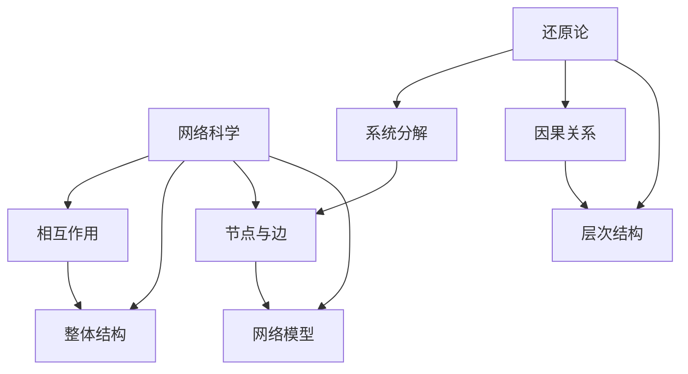

                 

### 引言与概述

在现代社会，我们面临着日益复杂的系统，从全球金融危机到社会网络的动态变化，从生态系统的崩溃到大规模信息传播，这些复杂现象的出现让我们意识到，传统的还原论方法在面对这些复杂系统时显得力不从心。因此，我们需要一种全新的视角，来理解和应对这些高度互联的复杂世界。这就是本书《从还原论到网络科学：理解高度互联的复杂世界》的主题。

#### 1.1 还原论与网络科学的关系

还原论是一种分析复杂系统的哲学方法，它试图通过将复杂系统拆解成更简单的部分来理解整个系统的行为。这种方法在物理学、生物学和社会科学等领域都有广泛的应用。然而，随着系统复杂性的增加，传统的还原论方法逐渐暴露出其局限性。还原论在处理高度互联、相互作用的复杂系统时，往往难以捕捉到系统整体的动态行为。

网络科学则是一种新兴的研究领域，它关注网络结构、网络动力系统和网络中的信息流。网络科学不仅提供了一种全新的视角，还提供了一系列数学模型和计算方法，帮助我们理解和分析复杂系统。网络科学的发展为解决传统还原论方法所面临的挑战提供了新的途径。

本书的目的在于探讨还原论与网络科学之间的联系，并展示如何从还原论转向网络科学来理解复杂世界。通过分析还原论和网络科学的基本原理、方法和技术，本书旨在为读者提供一种系统性的思维方式，帮助他们在面对复杂系统时，能够更加有效地运用网络科学的工具和方法。

#### 1.2 本书的研究目的与结构

本书的研究目的有以下几点：

1. **介绍还原论和网络科学的基本概念、原理和方法**：通过回顾还原论的历史和发展，阐述其基本原理和应用；同时，介绍网络科学的定义、核心概念和模型，以及其在不同领域的应用。

2. **探讨还原论与网络科学之间的联系**：分析还原论在网络科学中的应用，以及网络科学如何弥补传统还原论的局限性。

3. **展示网络科学在复杂系统分析中的应用**：通过具体案例，展示如何将网络科学应用于社会系统、生物系统、经济系统等复杂系统的分析。

4. **提供实际操作的指南**：为读者提供网络科学工具的使用方法，以及如何在实际项目中应用网络科学。

本书的结构如下：

- **第一章：引言与概述**：介绍还原论与网络科学的关系，以及本书的研究目的和结构。
- **第二章：还原论的基础**：讨论还原论的历史、原理及其在科学中的应用。
- **第三章：网络科学的基础**：介绍网络科学的定义、核心概念和模型。
- **第四章：复杂系统的网络分析方法**：展示如何将网络科学应用于复杂系统的分析。
- **第五章：具体案例分析**：提供实际案例来说明网络科学如何帮助理解复杂系统。
- **第六章：跨学科交叉应用**：讨论网络科学在不同领域的应用。
- **第七章：总结与展望**：总结本书的内容，并提出未来研究方向。

通过以上结构和内容的安排，本书旨在为读者提供一种全面的、深入的理解，帮助他们在面对复杂系统时，能够更加有效地运用网络科学的工具和方法。接下来，我们将逐一探讨这些章节，详细阐述还原论与网络科学的基本原理和应用。

#### 1.3 还原论的历史与发展

还原论的历史可以追溯到古希腊时期，当时的哲学家如亚里士多德就提出了通过分解复杂对象来理解其本质的思想。然而，还原论作为一种系统的哲学方法，其发展主要是在近现代科学的发展过程中。

在物理学中，伽利略和牛顿的工作奠定了还原论的基础。他们通过将复杂的天体运动分解为简单的物理定律，成功地揭示了自然界的运行规律。这种思想在经典物理学中得到了广泛的运用，成为理解自然现象的重要工具。

随着生物学的进步，达尔文的进化论进一步推动了还原论的发展。通过研究物种的进化过程，达尔文提出了“自然选择”和“适者生存”的概念，从而将生物的复杂多样性归结为简单的遗传和变异机制。

在社会科学领域，还原论的思想也得到了应用。例如，经济学中的“理性人假设”试图通过简化个体的行为模型，来解释复杂的市场行为。社会学中的“结构-功能分析”也试图通过分解社会结构，来理解社会的运行机制。

然而，随着系统复杂性的增加，传统的还原论方法逐渐暴露出其局限性。20世纪中叶，随着计算机科学的兴起和复杂性科学的产生，人们开始意识到，复杂系统中的相互作用和反馈机制是导致系统复杂行为的重要原因。这种认识催生了网络科学的诞生，并为解决传统还原论所面临的挑战提供了新的途径。

#### 1.4 还原论的基本原理

还原论的基本原理可以归纳为以下几点：

1. **分解与组合**：还原论认为，复杂系统可以分解为更简单的部分，这些部分可以通过组合来解释整个系统的行为。例如，在物理学中，通过将复杂的机械系统分解为简单的力学元件，可以理解整个系统的运动规律。

2. **简化与抽象**：还原论强调通过简化和抽象来处理复杂系统。这种方法通过忽略一些次要的因素，集中研究关键变量，从而简化了问题，使得问题更加可解。例如，在生物学中，通过简化遗传机制，可以更清晰地理解物种的进化过程。

3. **层次结构**：还原论认为，复杂系统具有层次结构，每个层次都可以通过其组成部分的行为来解释。从原子到分子，从个体到群体，每个层次都有自己的特性，但它们又相互作用，构成了更复杂的系统。

4. **因果关系**：还原论试图通过分析系统的组成部分之间的因果关系，来理解整个系统的行为。这种因果关系的分析有助于我们识别系统中的关键因素，并理解它们如何共同作用，影响系统的行为。

#### 1.5 还原论在科学中的应用

还原论在科学中的应用非常广泛，以下是一些典型的例子：

1. **物理学**：在物理学中，还原论的思想被广泛应用于理解自然现象。例如，通过分解复杂的物理系统为简单的力学元件，可以解释行星运动、分子运动等自然现象。牛顿的万有引力定律和动量守恒定律都是基于还原论的思想，通过简单的物理定律解释复杂的自然现象。

2. **生物学**：在生物学中，还原论的方法被用来研究物种的进化、遗传和生理机制。通过简化遗传机制，可以更清晰地理解物种的进化过程。达尔文的进化论和孟德尔的遗传学都是基于还原论的思想，通过简单的遗传和变异机制解释复杂的生物多样性。

3. **经济学**：在经济学中，还原论的思想被用来简化复杂的市场行为。例如，通过“理性人假设”，可以将复杂的市场参与者简化为具有一致行为的个体，从而解释市场价格的波动和供需关系。

4. **社会学**：在社会学中，还原论的方法被用来研究社会结构和行为。通过分解社会结构为简单的组成部分，可以理解社会的运行机制。例如，社会学家通过分析家庭、群体和组织等社会单位的互动，来解释社会行为和社会变迁。

总的来说，还原论作为一种哲学方法和分析工具，在科学研究中发挥了重要作用。然而，随着系统复杂性的增加，还原论的局限性也逐渐显现。因此，在研究复杂系统时，我们需要结合其他方法，如网络科学，来获得更全面的理解。

#### 1.6 网络科学的定义与核心概念

网络科学是一门跨学科的研究领域，它关注网络结构、网络动力系统和网络中的信息流。网络科学的核心概念包括网络、节点、边、路径、社区和模因等。

1. **网络（Network）**：网络是网络科学中的基本概念，它由节点（Node）和边（Edge）组成。节点代表网络中的个体或实体，边表示节点之间的相互作用或连接。网络可以是无向的或有向的，可以根据需要定义不同的网络类型。

2. **节点（Node）**：节点是网络中的基本单元，可以表示人、物体、地点或其他实体。节点的特性包括度（Degree）、介数（Betweenness）和聚类系数（Clustering Coefficient）等。

3. **边（Edge）**：边是连接节点的线，表示节点之间的相互作用或关系。边的特性包括权重（Weight）、长度（Length）和方向（Direction）等。

4. **路径（Path）**：路径是网络中连接两个节点的边的序列。路径的长度通常用边的数量来表示。

5. **社区（Community）**：社区是网络中一组紧密相连的节点，这些节点之间的连接密度明显高于与社区外节点的连接密度。社区结构是网络分析中的重要概念，有助于理解网络中的群体行为和模式。

6. **模因（Meme）**：模因是网络中的信息传播单位，它可以是一个想法、行为或文化符号。模因通过节点的相互作用在网络中传播，形成信息流。

通过这些核心概念，网络科学提供了一种全新的视角，帮助我们理解复杂系统的行为和结构。网络科学的研究方法包括图论、网络动力学、机器学习和复杂系统理论等。

#### 1.7 网络科学的模型与方法

网络科学的模型和方法是理解复杂系统行为的关键。以下是一些常用的网络科学模型和方法：

1. **图论（Graph Theory）**：图论是研究网络结构和性质的基本数学工具。它通过图（Graph）这一数学结构来表示网络，图中的节点和边可以分别表示实体和实体之间的关系。图论提供了许多有用的概念和算法，如度分布、聚类系数、路径长度等，用于分析网络的宏观和微观结构。

2. **网络动力学（Network Dynamics）**：网络动力学研究网络中节点的动态行为和网络结构的演化。网络动力学模型包括线性模型和非线性模型，如同步模型、扩散模型和随机游走模型。这些模型可以用来分析网络中的传染过程、信息传播和群体行为。

3. **机器学习（Machine Learning）**：机器学习是网络科学的重要工具，它通过数据分析和模式识别来发现网络中的结构和规律。常用的机器学习方法包括聚类分析、分类和回归等。机器学习可以用于网络预测、社区检测和异常检测等任务。

4. **复杂系统理论（Complex Systems Theory）**：复杂系统理论关注系统的整体行为和自组织现象。在复杂系统理论中，网络被视为系统的一部分，通过网络结构和节点行为的相互作用来理解系统的复杂行为。复杂系统理论提供了许多概念和模型，如小世界网络、无标度网络和相变理论等。

这些模型和方法在网络科学中相互补充，共同帮助我们理解复杂系统的行为和结构。通过结合这些模型和方法，我们可以从多个角度分析复杂系统，从而获得更全面的理解。

#### 1.8 网络科学在不同领域的应用

网络科学作为一种强大的分析工具，已经在多个领域展现出了广泛的应用。以下是一些典型的应用领域：

1. **生物学**：在生物学中，网络科学被用来研究基因调控网络、蛋白质相互作用网络和生态系统网络。通过分析这些网络的结构和动态行为，科学家可以揭示生物系统的功能和机制。例如，基因调控网络分析有助于理解基因如何相互作用以影响生物体的行为和健康。

2. **社会科学**：网络科学在社会科学中的应用也非常广泛，包括社会网络分析、经济网络分析和信息网络分析等。社会网络分析可以帮助我们理解人际关系和社会结构，揭示权力和影响力的传播路径。经济网络分析则有助于理解市场行为和金融系统的稳定性。信息网络分析则可以揭示信息传播的规律和模式。

3. **物理学**：在物理学中，网络科学被用来研究复杂物理系统，如交通网络、电力网络和互联网。通过分析这些网络的结构和动态行为，物理学家可以理解系统的可靠性和稳定性，并预测系统的演化趋势。

4. **工程**：在网络工程和通信领域，网络科学被用来设计高效的网络结构和优化网络性能。例如，通过分析互联网的结构，工程师可以设计出更稳定的网络拓扑结构，提高网络的可靠性和抗攻击能力。

5. **生态学**：在生态学中，网络科学被用来研究生态系统中的物种相互作用和网络结构。通过分析这些网络，生态学家可以预测生态系统的稳定性和演化趋势，并为生态保护提供科学依据。

总的来说，网络科学在不同领域的应用不仅帮助科学家更好地理解复杂系统的行为，也为实际问题的解决提供了新的思路和方法。

#### 1.9 总结与展望

通过对还原论和网络科学的介绍，我们可以看到，这两种方法各有优缺点，但它们在研究复杂系统时相辅相成。还原论通过分解复杂系统为简单部分，为我们理解系统提供了基础；而网络科学则通过研究系统中的相互作用和整体结构，为我们提供了一种更全面的理解视角。

未来的研究将继续深化这两种方法之间的融合，探索如何更好地将还原论与网络科学结合起来，以应对日益复杂的现实世界。同时，随着计算能力和算法的发展，网络科学将在更多领域展现其潜力，为我们提供更深入的洞见。

作为读者，你们可以通过阅读本书，掌握还原论和网络科学的基本原理，学会如何运用这些方法来分析复杂系统。希望本书能够为你们在科学研究和实际问题解决中提供有益的参考。

### 还原论的基础

#### 2.1 还原论的历史与发展

还原论的历史可以追溯到古希腊时期，当时的哲学家如亚里士多德就提出了通过分解复杂对象来理解其本质的思想。这种思想在古希腊哲学中得到了广泛的发展，并影响了后来的科学方法论。

在近现代科学的发展过程中，还原论得到了进一步的发展和应用。17世纪的科学家如伽利略和牛顿，通过将复杂的自然现象分解为简单的物理定律，成功地揭示了自然界的运行规律。牛顿的万有引力定律和动量守恒定律就是典型的还原论思想，它们通过简单的物理定律解释了复杂的宇宙现象。

18世纪和19世纪，随着生物学的进步，达尔文提出了进化论，进一步推动了还原论的发展。通过研究物种的进化过程，达尔文提出了“自然选择”和“适者生存”的概念，从而将生物的复杂多样性归结为简单的遗传和变异机制。这一思想在生物学中得到了广泛的应用，为理解生物系统的运行机制提供了新的视角。

在20世纪，随着计算机科学的兴起和复杂性科学的产生，还原论的思想继续发展。计算机科学中的算法和编程语言使得科学家能够对复杂系统进行更精细的分解和分析。同时，复杂性科学的发展使我们开始意识到，复杂系统中的相互作用和反馈机制是导致系统复杂行为的重要原因。这种认识催生了网络科学的诞生，并为解决传统还原论所面临的挑战提供了新的途径。

总的来说，还原论作为一种哲学方法和分析工具，在科学研究中发挥了重要作用。然而，随着系统复杂性的增加，还原论的局限性也逐渐显现。因此，在研究复杂系统时，我们需要结合其他方法，如网络科学，来获得更全面的理解。

#### 2.2 还原论的基本原理

还原论的基本原理可以归纳为以下几点：

1. **分解与组合**：还原论认为，复杂系统可以分解为更简单的部分，这些部分可以通过组合来解释整个系统的行为。例如，在物理学中，通过将复杂的机械系统分解为简单的力学元件，可以理解整个系统的运动规律。同样，在生物学中，通过分解复杂的生物体为简单的细胞和分子，可以理解生物体的生长和发育。

2. **简化与抽象**：还原论强调通过简化和抽象来处理复杂系统。这种方法通过忽略一些次要的因素，集中研究关键变量，从而简化了问题，使得问题更加可解。例如，在经济学中，通过简化消费者的行为模型，可以将复杂的市场行为归结为简单的供需关系。在物理学中，通过简化物体的运动模型，可以更容易地分析物体的运动轨迹。

3. **层次结构**：还原论认为，复杂系统具有层次结构，每个层次都可以通过其组成部分的行为来解释。从原子到分子，从个体到群体，每个层次都有自己的特性，但它们又相互作用，构成了更复杂的系统。例如，在生物学中，通过分析不同层次的结构和功能，可以理解生物体的复杂行为。在社会科学中，通过分析不同层次的社会结构和行为，可以理解社会的复杂现象。

4. **因果关系**：还原论试图通过分析系统的组成部分之间的因果关系，来理解整个系统的行为。这种因果关系的分析有助于我们识别系统中的关键因素，并理解它们如何共同作用，影响系统的行为。例如，在物理学中，通过分析力与运动之间的因果关系，可以理解物体的运动规律。在经济学中，通过分析供求关系之间的因果关系，可以理解市场的行为。

通过这些基本原理，还原论为我们提供了一种理解复杂系统的框架，使我们能够将复杂的系统分解为简单的组成部分，并通过分析这些组成部分之间的关系，来理解整个系统的行为。

#### 2.3 还原论在科学中的应用

还原论在科学中的应用非常广泛，以下是一些典型的应用领域：

1. **物理学**：在物理学中，还原论的思想被广泛应用于理解自然现象。例如，通过将复杂的物理系统分解为简单的物理定律，可以解释宇宙中的各种现象。牛顿的万有引力定律和动量守恒定律都是基于还原论的思想，通过简单的物理定律解释复杂的自然现象。在量子力学中，通过将复杂的量子现象分解为简单的量子态和量子跃迁，可以更深入地理解微观世界的规律。

2. **生物学**：在生物学中，还原论的方法被用来研究物种的进化、遗传和生理机制。通过简化遗传机制，可以更清晰地理解物种的进化过程。达尔文的进化论和孟德尔的遗传学都是基于还原论的思想，通过简单的遗传和变异机制解释复杂的生物多样性。在细胞生物学中，通过将复杂的细胞过程分解为简单的生化反应，可以理解细胞的生长和发育。

3. **经济学**：在经济学中，还原论的思想被用来简化复杂的市场行为。例如，通过“理性人假设”，可以将复杂的市场参与者简化为具有一致行为的个体，从而解释市场价格的波动和供需关系。在宏观经济学中，通过将复杂的宏观经济现象分解为简单的经济变量，可以理解经济的周期波动和经济增长。

4. **社会学**：在社会学中，还原论的方法被用来研究社会结构和行为。通过分解社会结构为简单的组成部分，可以理解社会的运行机制。例如，社会学家通过分析家庭、群体和组织等社会单位的互动，来解释社会行为和社会变迁。在社会心理学中，通过简化个体的行为模型，可以理解社会行为的心理机制。

总的来说，还原论作为一种哲学方法和分析工具，在科学研究中发挥了重要作用。通过将复杂系统分解为简单的组成部分，并分析这些组成部分之间的关系，还原论帮助我们更好地理解复杂系统的行为和机制。然而，随着系统复杂性的增加，还原论的局限性也逐渐显现。因此，在研究复杂系统时，我们需要结合其他方法，如网络科学，来获得更全面的理解。

#### 2.4 还原论的局限性

尽管还原论在科学研究中发挥了重要作用，但它也存在一些局限性。首先，还原论往往假设系统可以完全分解为独立的组成部分，而忽略了这些组成部分之间的相互作用。然而，在许多复杂系统中，相互作用是导致系统复杂行为的重要因素。例如，在社会系统中，个体之间的相互作用会导致社会行为的复杂变化；在生态系统中，物种之间的相互作用会影响生态平衡。

其次，还原论可能忽略系统中的整体性特征。许多复杂系统表现出整体性特征，这些特征不能简单地通过分析其组成部分来解释。例如，生态系统中的物种多样性不仅取决于每个物种的个体数量，还取决于物种之间的相互作用和生态位。此外，在经济学中，市场行为不仅仅取决于个体的行为，还取决于市场整体的动态行为。

此外，还原论可能忽视系统中的反馈机制。在复杂系统中，反馈机制是导致系统动态变化和演化的重要因素。例如，在金融市场中的反馈机制可能导致市场的剧烈波动；在生物系统中，负反馈机制可以帮助维持系统的稳定。

最后，还原论在处理大规模复杂系统时可能变得不可行。随着系统规模的增加，组成部分的数量和相互作用变得极其复杂，使得还原论的分析变得困难。例如，在互联网系统中，有成千上万的节点和边，通过还原论方法来分析整个系统的行为几乎是不可能的。

总之，尽管还原论在科学研究中具有其独特的价值，但在面对高度互联和相互作用的复杂系统时，其局限性也逐渐显现。因此，为了更全面地理解复杂系统，我们需要结合其他方法，如网络科学，来弥补还原论的不足。

#### 2.5 网络科学如何弥补还原论的局限性

网络科学为我们提供了一种新的视角，以弥补传统还原论的局限性。网络科学通过研究系统中的相互作用和整体结构，帮助我们更全面地理解复杂系统的行为。以下是网络科学如何弥补还原论局限性的几个方面：

1. **关注相互作用**：与还原论不同，网络科学关注系统中的节点和节点之间的相互作用。通过研究这些相互作用，我们可以理解复杂系统中的动态行为和模式。例如，在社会网络中，个体之间的相互作用可以解释社会行为的传播和演变；在生物网络中，基因和蛋白质之间的相互作用可以解释生物体的功能和疾病。

2. **揭示整体性特征**：网络科学强调系统的整体性特征，这些特征不能简单地通过分析其组成部分来解释。通过分析网络结构，我们可以发现系统的关键组成部分和核心模式。例如，在生态系统网络中，关键物种和食物链结构可以解释生态系统的稳定性和演化趋势；在信息网络中，关键节点和连接模式可以解释信息传播的效率和速度。

3. **研究反馈机制**：网络科学关注系统中的反馈机制，这些反馈机制是导致系统动态变化和演化的重要因素。通过分析反馈机制，我们可以理解复杂系统的稳定性和鲁棒性。例如，在金融市场中，反馈机制可能导致市场的剧烈波动和危机；在生物系统中，负反馈机制可以帮助维持系统的稳定。

4. **处理大规模复杂系统**：网络科学提供了有效的工具和方法来处理大规模复杂系统。通过图论和网络动力学等数学工具，我们可以分析大规模网络的拓扑结构和动态行为。例如，通过计算网络中的度分布、聚类系数和介数等指标，我们可以评估网络的稳定性和可靠性；通过网络动力学模型，我们可以模拟网络中的信息传播和传染过程。

通过这些方法，网络科学不仅弥补了还原论的局限性，还为理解和分析复杂系统提供了新的工具和视角。网络科学的发展为我们理解复杂系统提供了更全面和深入的认识。

#### 2.6 还原论与网络科学的综合应用

在科学研究和技术开发中，还原论和网络科学的综合应用已经成为一种趋势。通过结合这两种方法，科学家和技术人员能够更全面地理解复杂系统的行为，并开发出更有效的解决方案。以下是一些具体的综合应用案例：

1. **生物学研究**：在生物学领域，还原论和网络科学的综合应用取得了显著成果。例如，在基因调控网络研究中，科学家通过还原论的方法研究单个基因的功能和表达，同时使用网络科学的方法分析基因之间的相互作用和调控网络的整体结构。这种方法有助于揭示基因调控网络的动态行为和功能模块，为疾病诊断和治疗提供了新的思路。

2. **社会科学分析**：在社会科学中，网络科学为理解社会行为和结构提供了强有力的工具。通过构建社会网络模型，研究人员可以分析个体之间的关系和群体行为。例如，在研究社交媒体网络的传播过程中，通过还原论的方法分析信息传播的机制，同时使用网络科学的方法分析传播网络的结构和模式，可以更准确地预测信息的传播速度和范围。

3. **经济学建模**：在经济学领域，网络科学的引入为理解市场行为和金融系统提供了新的视角。通过构建市场网络模型，研究人员可以分析市场参与者之间的交易关系和风险传播。例如，在研究金融危机时，通过还原论的方法分析单个金融机构的财务状况，同时使用网络科学的方法分析整个金融系统的结构和动态行为，可以更好地理解危机的传播机制和预防措施。

4. **城市规划和交通管理**：在城市规划和交通管理领域，网络科学的综合应用有助于优化城市交通网络和提升城市生活质量。通过构建交通网络模型，研究人员可以使用网络科学的分析方法评估交通拥堵、路径规划和公共交通系统的效率。例如，通过还原论的方法分析单个道路段的车流量，同时使用网络科学的方法优化整个交通网络的路径规划和信号控制，可以有效缓解交通拥堵问题。

5. **网络安全与信息传播**：在网络安全和信息传播领域，网络科学的综合应用有助于提高系统的安全性和传播效率。通过分析网络中的攻击路径和传播模式，研究人员可以制定更有效的防御策略。例如，在网络安全中，通过还原论的方法分析单个节点的安全特性，同时使用网络科学的方法评估整个网络的脆弱性和攻击路径，可以制定更全面的安全策略；在信息传播中，通过还原论的方法分析信息的传播机制，同时使用网络科学的方法优化信息传播的网络结构，可以提高信息的传播效率和准确性。

总的来说，还原论与网络科学的综合应用为科学研究和技术开发提供了强大的工具和方法。通过结合这两种方法，科学家和技术人员能够更全面地理解复杂系统的行为，并开发出更有效的解决方案。这种综合应用不仅推动了科学研究的进步，也为实际问题的解决提供了新的思路。

#### 2.7 还原论与网络科学的核心概念关系架构图

为了更好地理解还原论与网络科学之间的核心概念关系，我们可以使用Mermaid流程图来展示它们之间的相互联系。以下是还原论与网络科学核心概念关系的Mermaid流程图：

在这个流程图中：

- **A（还原论）**：通过系统分解、因果关系和层次结构来理解复杂系统。
- **B（网络科学）**：通过节点与边的相互作用和整体结构来分析复杂系统。
- **C（系统分解）**：还原论的核心方法，将复杂系统分解为简单部分。
- **D（相互作用）**：网络科学的核心概念，关注系统内部节点和边之间的相互作用。
- **E（整体结构）**：网络科学的核心概念，分析系统的整体结构和模式。
- **F（因果关系）**：还原论的核心方法，通过分析组成部分之间的因果关系来理解系统行为。
- **G（层次结构）**：还原论的核心概念，认为复杂系统具有层次结构。
- **H（节点与边）**：网络科学中的基本元素，节点表示个体或实体，边表示它们之间的相互作用。
- **I（网络模型）**：网络科学的工具，用于表示和分析系统的结构和动态行为。

通过这个流程图，我们可以清晰地看到还原论与网络科学之间的核心概念是如何相互联系和作用的。这种关系不仅帮助我们理解复杂系统的行为，还为我们在实际研究中选择合适的方法提供了指导。

### 复杂系统的网络分析方法

#### 4.1 复杂系统的特性

复杂系统是一种具有高度复杂性和多样性的系统，其行为和结构难以用简单的数学模型来描述。复杂系统的特性主要包括：

1. **高度互联性**：复杂系统中的各个组成部分之间存在广泛的相互作用和依赖关系。这些相互作用可以通过网络结构来表示，形成一个高度互联的网络。

2. **非线性动态**：复杂系统的行为通常是动态的，并且具有非线性特征。这意味着系统的输出不仅仅取决于当前的输入，还取决于系统的历史状态。

3. **涌现行为**：复杂系统的整体行为不能简单地从其组成部分的行为中推导出来，而是通过各个组成部分之间的相互作用和协同作用产生的。这种从简单规则到复杂行为的转变被称为“涌现”。

4. **自组织性**：复杂系统中的许多结构和模式是通过系统的自组织过程产生的，而不是外部力量的直接干预。这意味着系统可以在没有中央控制的情况下自发形成有序结构。

5. **鲁棒性与脆弱性**：复杂系统在某些方面表现出鲁棒性，即能够抵抗外部扰动而不发生重大变化。然而，在其他方面，它们可能表现出脆弱性，即对某些小的变化或异常情况非常敏感。

6. **尺度不变性**：复杂系统的行为和结构在不同尺度上表现出相似性，这意味着它们在不同的时间尺度和空间尺度上具有类似的特征。

理解这些特性对于分析复杂系统至关重要。通过识别这些特性，我们可以更好地设计适合复杂系统的分析方法，并预测系统的行为和演化趋势。

#### 4.2 网络科学在复杂系统分析中的应用

网络科学为分析复杂系统提供了一系列有效的工具和方法。以下是一些关键的应用：

1. **网络结构分析**：网络结构分析是网络科学的核心内容，通过分析网络中节点和边的关系，可以揭示系统的关键结构和模式。常用的分析方法包括度分布、聚类系数、介数和路径长度等。度分布描述了节点度数的分布情况，聚类系数描述了节点之间紧密连接的程度，介数衡量了节点在网络中的连接程度，路径长度描述了节点之间的距离。

2. **网络动态分析**：网络动态分析研究网络中节点和边的动态行为，以及网络结构的演化过程。常用的模型包括同步模型、扩散模型和随机游走模型。同步模型描述了网络中节点的同步现象，扩散模型描述了信息或物质的传播过程，随机游走模型描述了节点在随机行走过程中的行为。

3. **社区检测**：社区检测是识别网络中紧密相连的节点集合的重要方法。通过检测社区结构，可以更好地理解系统的功能模块和组织方式。常用的算法包括基于模块度的方法、基于层次聚类的方法和基于图论的方法。

4. **网络稳定性分析**：网络稳定性分析关注网络在面对外部扰动时的稳定性和鲁棒性。通过分析网络的脆弱性节点和关键路径，可以识别系统中的潜在风险点，并制定相应的安全策略。

5. **网络建模与模拟**：网络建模与模拟是通过建立数学模型和计算机模拟来分析网络行为和性能的方法。通过模拟不同的网络结构和参数，可以预测系统的行为和演化趋势，为实际应用提供参考。

这些方法不仅在理论研究中具有重要价值，还在实际应用中发挥了重要作用。例如，在生物信息学中，网络科学被用来分析基因调控网络和蛋白质相互作用网络；在社会学中，网络科学被用来研究社会网络和影响力传播；在交通工程中，网络科学被用来优化交通网络和减少拥堵。

#### 4.3 网络分析方法的优势与挑战

网络分析方法在复杂系统分析中具有显著的优势，但也面临一些挑战。

**优势：**

1. **全局视角**：网络分析方法可以提供系统的全局视角，帮助我们理解系统中的节点和边之间的复杂关系，以及整体结构和动态行为。

2. **量化指标**：网络分析方法提供了一系列量化指标，如度分布、聚类系数和介数等，这些指标可以用来评估系统的结构特性和功能特性。

3. **模型适用性**：网络科学的方法具有较强的适用性，可以应用于不同领域和不同类型的复杂系统，如生物系统、社会系统和经济系统。

4. **预测能力**：通过网络建模和模拟，可以预测系统的行为和演化趋势，为实际应用提供科学依据。

**挑战：**

1. **数据复杂性**：复杂系统通常具有大量的数据和变量，如何有效地收集、处理和分析这些数据是一个挑战。

2. **模型选择**：网络分析方法依赖于特定的模型和假设，选择合适的模型需要丰富的理论和实践经验。

3. **计算资源**：网络科学分析通常需要大量的计算资源，特别是在处理大规模网络时，计算资源的限制可能成为一个瓶颈。

4. **数据隐私与安全性**：在处理敏感数据时，如何保护数据隐私和安全是一个重要问题。

5. **解释性与可重复性**：如何解释网络分析的结果，并确保结果的可靠性和可重复性，也是一个挑战。

尽管面临这些挑战，网络分析方法在复杂系统分析中的应用仍然具有巨大的潜力。通过不断改进和分析方法，克服这些挑战，我们可以更好地理解复杂系统的行为和机制，为实际问题的解决提供有力支持。

### 社会网络分析

社会网络分析（Social Network Analysis，SNA）是网络科学的一个分支，它通过研究社会结构中的节点和边之间的关系，揭示社会行为和模式。在现代社会中，社会网络分析已经广泛应用于多个领域，包括社会学、经济学、传播学、生物学等。以下将详细介绍社会网络分析的基本概念、核心模型、算法和应用。

#### 5.1.1 基本概念

1. **节点（Node）**：在社会网络中，节点代表个体或实体。节点可以是个人、组织、国家或其他任何具有社会关系的实体。

2. **边（Edge）**：边表示节点之间的直接联系或关系。边的类型可以是有向的或无向的，可以根据具体情况定义。例如，在朋友网络中，边可以表示朋友关系，可以是双向的。

3. **网络（Network）**：网络是由节点和边构成的整体结构。网络的拓扑结构描述了节点之间的连接方式。

4. **邻接矩阵（Adjacency Matrix）**：邻接矩阵是一个方阵，用于表示网络中节点之间的直接联系。如果节点i与节点j之间存在边，则邻接矩阵中对应的元素a_ij为1，否则为0。

5. **度（Degree）**：度是衡量节点在网络中的重要性的指标。对于无向网络，度定义为与该节点直接相连的边的数量；对于有向网络，度分为出度和入度，分别表示节点指向其他节点的边和指向该节点的边数量。

6. **介数（Closeness Centrality）**：介数衡量了节点在网络中的位置重要性。一个节点的介数值越高，意味着它与其他节点的直接连接越少，但在整个网络中的位置越关键。

7. **聚类系数（Clustering Coefficient）**：聚类系数衡量了网络中节点的聚类程度。一个高聚类系数的网络表示节点之间有较多的三角形结构。

#### 5.1.2 核心模型

1. **随机网络（Random Network）**：随机网络是最简单的网络模型，它假设节点之间的连接是随机的。这种模型可以用来研究网络的基本统计特性。

2. **小世界网络（Small-World Network）**：小世界网络具有高度集聚性，但同时又具有短路径长度。这种网络模型由 Watts 和 Strogatz 提出，它通过在随机网络中引入少量的长距离连接来实现。

3. **无标度网络（Scale-Free Network）**：无标度网络具有高度异质性，即节点的度分布呈现幂律分布。这类网络在现实生活中非常常见，如互联网、社交网络等。

4. **复杂网络（Complex Network）**：复杂网络是包含多种拓扑结构的网络，它同时具有小世界和无标度的特征。这类网络通过多种模型和机制来模拟现实世界的网络结构。

#### 5.1.3 算法

1. **社区检测（Community Detection）**：社区检测是识别网络中的紧密相连节点集合的方法。常用的算法包括基于模块度的方法（如Louvain算法）、基于层次聚类的方法（如Girvan-Newman算法）和基于图论的算法（如标签传播算法）。

2. **网络演化（Network Evolution）**：网络演化研究网络随时间的变化过程。常用的模型包括邻接矩阵更新模型、随机行走模型和扩散模型。

3. **网络稳定性（Network Stability）**：网络稳定性分析研究网络在面对外部扰动时的行为。常用的指标包括介数、聚类系数和脆弱性分析。

4. **网络模拟（Network Simulation）**：网络模拟是通过建立数学模型和计算机模拟来预测网络行为的方法。常用的模拟方法包括离散事件模拟和蒙特卡洛模拟。

#### 5.1.4 应用

1. **社交网络**：在社会网络中，网络分析可以揭示社交网络的结构和模式。例如，通过分析社交网络中的关键节点和社区结构，可以了解社交网络中的信息传播和影响力分布。

2. **传播动力学**：网络分析可以用于研究信息传播、疾病传播和流行趋势等传播动力学问题。通过分析传播网络的结构和动态行为，可以预测传播速度和范围，制定有效的防控策略。

3. **经济网络**：在经济网络中，网络分析可以揭示市场参与者之间的关系和网络结构。通过分析经济网络的节点和边，可以理解市场的稳定性和风险传播。

4. **生物学网络**：在生物学网络中，网络分析可以用于研究基因调控网络、蛋白质相互作用网络和生态系统网络。通过分析这些网络的结构和动态行为，可以揭示生物系统的功能和机制。

总的来说，社会网络分析作为一种强大的工具，可以帮助我们更好地理解复杂社会系统的行为和模式。通过不断发展和应用，社会网络分析在多个领域都取得了显著的成果，为解决实际问题提供了新的视角和方法。

### 生物网络分析

生物网络分析是网络科学在生物学领域的重要应用，它通过研究基因调控网络、蛋白质相互作用网络和生态系统网络等生物系统中的节点和边关系，揭示生物系统的功能和机制。以下将详细介绍生物网络分析的基本概念、核心模型、算法和应用。

#### 5.2.1 基本概念

1. **基因调控网络（Gene Regulatory Network）**：基因调控网络描述了基因及其调控因子之间的相互作用和调控关系。通过研究基因调控网络，可以理解基因在生物体内的表达调控机制。

2. **蛋白质相互作用网络（Protein Interaction Network）**：蛋白质相互作用网络描述了细胞内不同蛋白质之间的物理相互作用。通过研究蛋白质相互作用网络，可以揭示细胞内的信号传导和代谢途径。

3. **生态系统网络（Ecological Network）**：生态系统网络描述了不同物种之间的相互作用和能量流动。通过研究生态系统网络，可以理解生态系统的结构和稳定性。

4. **节点（Node）**：在生物网络中，节点代表基因、蛋白质或物种等生物实体。

5. **边（Edge）**：在生物网络中，边表示节点之间的相互作用或关系，如调控关系、物理相互作用或能量流动。

6. **网络拓扑结构**：生物网络的拓扑结构描述了节点和边之间的连接方式，如无向图、有向图或加权图。

#### 5.2.2 核心模型

1. **随机模型**：随机模型假设生物网络中的相互作用是随机的，这类模型可以用于分析网络的基本统计特性。

2. **生成网络模型**：生成网络模型通过数学公式描述生物网络的生成过程，如Barabási-Albert模型用于描述无标度网络的生成。

3. **动力学模型**：动力学模型描述了生物网络中的动态行为和演化过程，如基于微分方程的模型用于描述基因调控网络的动态行为。

4. **交互作用模型**：交互作用模型描述了生物网络中不同类型节点的相互作用机制，如信号传导模型用于描述细胞内的信号传递过程。

#### 5.2.3 算法

1. **网络拓扑分析**：网络拓扑分析用于研究生物网络的拓扑结构特性，如度分布、聚类系数和介数等。

2. **网络动力学分析**：网络动力学分析用于研究生物网络的动态行为和演化过程，如同步模型、扩散模型和随机游走模型。

3. **网络模块化分析**：网络模块化分析用于识别生物网络中的功能模块和组织方式，如基于模块度的方法、基于层次聚类的方法和基于图论的方法。

4. **网络建模与模拟**：网络建模与模拟用于建立数学模型和计算机模拟来预测生物网络的行为和演化趋势。

#### 5.2.4 应用

1. **基因调控网络分析**：基因调控网络分析可以帮助我们理解基因在生物体内的表达调控机制。例如，通过分析基因调控网络中的关键节点和调控关系，可以揭示生物体对环境的响应机制和疾病发生机制。

2. **蛋白质相互作用网络分析**：蛋白质相互作用网络分析可以帮助我们理解细胞内的信号传导和代谢途径。例如，通过分析蛋白质相互作用网络中的关键节点和相互作用关系，可以揭示细胞信号传导的路径和关键调控点。

3. **生态系统网络分析**：生态系统网络分析可以帮助我们理解生态系统的结构和稳定性。例如，通过分析生态系统网络中的关键物种和能量流动关系，可以揭示生态系统的动态行为和稳定性机制。

4. **药物发现**：生物网络分析可以用于药物发现和疾病研究。通过分析生物网络中的关键节点和关键路径，可以识别潜在的药物靶点和治疗策略。

总的来说，生物网络分析作为一种重要的工具，可以帮助我们更好地理解生物系统的行为和机制。通过不断发展和应用，生物网络分析在生物学领域取得了显著的成果，为生物科学和医学研究提供了新的视角和方法。

### 经济网络分析

经济网络分析是网络科学在经济领域的应用，它通过研究市场参与者之间的关系和交易网络，揭示经济系统的行为和机制。以下将详细介绍经济网络分析的基本概念、核心模型、算法和应用。

#### 5.3.1 基本概念

1. **市场参与者（Participant）**：市场参与者包括企业、消费者、金融机构等，它们是经济网络中的节点。

2. **交易（Transaction）**：交易是市场参与者之间发生的经济活动，可以通过边表示。

3. **市场网络（Market Network）**：市场网络是由市场参与者及其交易关系构成的整体结构。

4. **网络拓扑结构**：市场网络的拓扑结构描述了市场参与者和交易之间的关系，如无向图、有向图或加权图。

5. **节点中心性（Node Centrality）**：节点中心性衡量了市场参与者在网络中的重要性，常用的指标包括度中心性、介数和接近中心性。

6. **社区检测（Community Detection）**：社区检测用于识别市场网络中的紧密相连节点集合，揭示市场的组织结构。

#### 5.3.2 核心模型

1. **随机市场模型（Random Market Model）**：随机市场模型假设市场参与者之间的交易是随机发生的，这类模型可以用于分析市场的基本统计特性。

2. **无标度市场模型（Scale-Free Market Model）**：无标度市场模型描述了市场参与者之间的交易关系呈现幂律分布，这类模型可以用于模拟现实中的市场网络。

3. **复杂市场模型（Complex Market Model）**：复杂市场模型同时包含无标度和小世界特征，这类模型可以更真实地模拟市场行为。

4. **动态市场模型（Dynamic Market Model）**：动态市场模型描述了市场网络随时间的变化过程，这类模型可以用于分析市场动态行为和演化趋势。

#### 5.3.3 算法

1. **网络拓扑分析**：网络拓扑分析用于研究市场网络的拓扑结构特性，如度分布、聚类系数和介数等。

2. **网络动态分析**：网络动态分析用于研究市场网络的动态行为和演化过程，如同步模型、扩散模型和随机游走模型。

3. **社区检测**：社区检测用于识别市场网络中的紧密相连节点集合，常用的算法包括基于模块度的方法、基于层次聚类的方法和基于图论的方法。

4. **网络建模与模拟**：网络建模与模拟用于建立数学模型和计算机模拟来预测市场行为和演化趋势。

#### 5.3.4 应用

1. **市场行为分析**：经济网络分析可以揭示市场参与者的行为模式和市场结构。通过分析市场网络的拓扑结构和节点中心性，可以理解市场的关键节点和关键路径。

2. **金融危机预测**：经济网络分析可以用于预测金融危机的传播和影响。通过分析市场网络的动态行为和关键节点，可以识别市场中的潜在风险点，制定有效的预警和防控措施。

3. **供应链管理**：经济网络分析可以优化供应链网络的结构和效率。通过分析供应链网络中的节点和边，可以优化供应链的路径规划和管理策略，提高供应链的响应速度和灵活性。

4. **金融网络稳定性分析**：经济网络分析可以评估金融系统的稳定性和鲁棒性。通过分析金融网络中的节点和边，可以识别系统的关键节点和关键路径，制定有效的风险管理策略。

总的来说，经济网络分析作为一种重要的工具，可以帮助我们更好地理解经济系统的行为和机制。通过不断发展和应用，经济网络分析在金融市场、供应链管理和风险管理等领域取得了显著的成果，为经济科学和实际应用提供了新的视角和方法。

### 信息网络分析

信息网络分析是网络科学在信息传播和通信领域的重要应用，它通过研究信息在网络中的流动和传播过程，揭示信息网络的动态行为和模式。以下将详细介绍信息网络分析的基本概念、核心模型、算法和应用。

#### 5.4.1 基本概念

1. **节点（Node）**：在信息网络中，节点代表信息源、传播者或接收者，可以是个人、设备、服务器或其他信息载体。

2. **边（Edge）**：在信息网络中，边表示节点之间的信息传递关系。边的权重可以表示信息传递的速度、频率或质量。

3. **网络（Network）**：信息网络是由节点和边构成的整体结构，描述了信息在各个节点之间的传递和流动。

4. **路径（Path）**：路径是网络中连接两个节点的边序列，表示信息的传递路径。

5. **传播模式（Spread Model）**：传播模式描述了信息在网络中的传播过程，包括信息传递的速度、范围和模式。

6. **信息流（Information Flow）**：信息流描述了信息在网络中的流动过程，包括信息的生成、传播和接收。

#### 5.4.2 核心模型

1. **同步模型（Synchronization Model）**：同步模型描述了网络中的节点如何同步工作，以实现信息的有效传播。这类模型常用于分析社交网络中的信息传播。

2. **扩散模型（Diffusion Model）**：扩散模型描述了信息在网络中的传播过程，包括信息生成、传播和接收。常用的扩散模型有线性扩散模型、非线性扩散模型和SIS模型等。

3. **随机游走模型（Random Walk Model）**：随机游走模型描述了节点在网络中的随机行走过程，模拟了信息在网络中的随机传播。这类模型常用于分析信息在网络中的传播速度和范围。

4. **多跳传播模型（Multi-Hop Spread Model）**：多跳传播模型描述了信息通过多个节点中转在网络中的传播过程。这类模型常用于分析信息在网络中的多跳传播路径和传播效率。

#### 5.4.3 算法

1. **信息传播速度预测（Spread Rate Prediction）**：算法用于预测信息在网络中的传播速度，常用的算法包括基于节点中心性的算法和基于网络结构的算法。

2. **传播范围分析（Spread Range Analysis）**：算法用于分析信息在网络中的传播范围，常用的算法包括基于路径长度的算法和基于节点影响力的算法。

3. **传播路径优化（Spread Path Optimization）**：算法用于优化信息在网络中的传播路径，以提高传播效率和覆盖范围。常用的算法包括基于最短路径的算法和基于最大覆盖的算法。

4. **社区检测（Community Detection）**：算法用于识别网络中的信息传播社区，揭示信息传播的网络结构。常用的算法包括基于模块度的算法和基于层次聚类的算法。

#### 5.4.4 应用

1. **社交媒体分析**：信息网络分析可以揭示社交媒体中的信息传播模式和行为。通过分析社交媒体网络中的节点和边，可以了解信息的生成、传播和接收过程，以及关键节点和信息传播路径。

2. **信息传播优化**：信息网络分析可以用于优化信息传播策略，提高信息传播的效率和覆盖范围。通过分析信息传播网络的拓扑结构和节点特性，可以制定更有效的信息传播策略，提高信息的到达率和影响力。

3. **网络故障诊断**：信息网络分析可以用于诊断和预测网络故障。通过分析网络中的节点和边，可以识别关键节点和关键路径，预测网络故障的发生和影响范围，制定有效的故障预防和修复策略。

4. **信息安全管理**：信息网络分析可以用于信息安全管理，识别网络中的潜在威胁和风险。通过分析网络中的异常行为和流量模式，可以识别网络攻击和入侵，制定有效的安全策略和防御措施。

总的来说，信息网络分析作为一种强大的工具，可以帮助我们更好地理解信息在网络中的传播和流动过程。通过不断发展和应用，信息网络分析在社交媒体、信息传播优化、网络故障诊断和信息安全管理等领域取得了显著的成果，为信息科学和实际应用提供了新的视角和方法。

### 跨学科交叉应用

网络科学作为一种跨学科的研究领域，已经广泛应用于多个领域，如生物学、物理学、经济学和社会科学等。以下将讨论网络科学在这些领域的应用，以及其在工程领域中的具体应用。

#### 6.1 网络科学在工程领域中的应用

在工程领域，网络科学的应用日益广泛。以下是一些典型的应用：

1. **智能交通系统**：网络科学可以用于优化交通网络，提高交通流量和减少拥堵。通过分析交通网络的拓扑结构和流量分布，可以设计更有效的信号控制和路径规划算法。例如，基于网络科学的方法可以预测交通拥堵点，并实时调整交通信号灯，以缓解交通压力。

2. **电力系统**：电力系统是一个复杂的网络系统，网络科学可以用于优化电力网络的运行和维护。通过分析电力网络的拓扑结构和负载分布，可以设计更高效的电力调度策略，提高电力供应的可靠性和效率。此外，网络科学还可以用于检测和预防电网故障，提高电力系统的稳定性和安全性。

3. **通信网络**：通信网络是一个高度互联的网络系统，网络科学可以用于优化网络结构和性能。通过分析通信网络的拓扑结构和流量模式，可以设计更高效的路由算法和网络优化策略。例如，网络科学可以用于优化互联网的传输路径，提高数据传输的速度和可靠性。

4. **物联网**：物联网（IoT）是一个由大量设备和传感器组成的网络系统，网络科学可以用于优化物联网的网络结构和通信效率。通过分析物联网的拓扑结构和数据流模式，可以设计更有效的数据传输协议和网络管理策略，提高物联网的响应速度和数据处理能力。

#### 6.2 网络科学在其他领域的应用

除了在工程领域，网络科学还在其他多个领域展示了其强大的应用潜力：

1. **生物学**：在生物学中，网络科学被用来研究基因调控网络、蛋白质相互作用网络和生态系统网络等生物系统。通过分析这些网络的结构和动态行为，科学家可以揭示生物系统的功能和机制，为疾病诊断和治疗提供新的思路。

2. **物理学**：在物理学中，网络科学被用来研究复杂物理系统，如交通网络、电力网络和互联网。通过分析这些网络的拓扑结构和动态行为，物理学家可以理解系统的稳定性和鲁棒性，以及系统在面对外部扰动时的响应。

3. **经济学**：在经济学中，网络科学被用来研究市场行为、金融网络和信息传播。通过分析这些网络的结构和动态行为，经济学家可以理解市场的运行机制和风险传播，以及信息在市场中的传播和影响。

4. **社会科学**：在社会科学中，网络科学被用来研究社会网络、信息传播和社会行为。通过分析这些网络的结构和动态行为，社会学家可以理解社会结构的形成和演变，以及社会行为和模式。

总的来说，网络科学作为一种跨学科的研究领域，在多个领域都展示了其强大的应用潜力。通过不断发展和应用，网络科学为各个领域的科学研究和技术开发提供了新的工具和方法，为解决复杂问题提供了新的视角。

### 总结与展望

通过对还原论和网络科学的深入探讨，我们可以看到这两种方法在理解和分析复杂系统方面各有优缺点，但它们相辅相成，共同为科学家和技术人员提供了强大的工具和方法。还原论通过分解复杂系统为简单部分，提供了理解系统的基础；而网络科学则通过研究系统中的相互作用和整体结构，为我们提供了一种更全面和深入的理解视角。

在未来的研究中，我们有望看到还原论与网络科学的进一步融合，探索如何将这两种方法更加有效地结合起来，以应对日益复杂的现实世界。同时，随着计算能力和算法的发展，网络科学将在更多领域展现其潜力，为我们提供更深入的洞见。

对读者而言，掌握还原论和网络科学的基本原理，学会如何运用这些方法来分析复杂系统，将有助于他们在科学研究和实际项目中取得更好的成果。希望通过本书，读者能够对复杂系统的分析有更全面的理解，并在未来的研究中能够灵活运用这些方法。

### 结论

本文从还原论和网络科学的基本概念出发，系统地介绍了这两种方法在复杂系统分析中的应用。我们首先回顾了还原论的历史和发展，探讨了其基本原理和应用。随后，我们详细介绍了网络科学的定义、核心概念、模型和方法，以及其在不同领域的应用。通过具体案例分析，我们展示了如何运用网络科学来理解和分析复杂系统。最后，我们讨论了还原论与网络科学的综合应用，以及其在工程领域和其他领域的广泛影响。

通过本文的讨论，我们可以得出以下结论：

1. **还原论与网络科学的互补性**：还原论通过分解复杂系统为简单部分，提供了理解系统的基础；网络科学则通过研究系统中的相互作用和整体结构，为我们提供了一种更全面和深入的理解视角。这两种方法相辅相成，为分析复杂系统提供了强大的工具。

2. **网络科学的广泛应用**：网络科学在生物学、物理学、经济学、社会科学和工程领域都展示了其强大的应用潜力。通过分析网络结构和动态行为，我们可以更深入地理解复杂系统的行为和机制。

3. **跨学科融合的重要性**：跨学科的研究方法为解决复杂问题提供了新的视角和工具。还原论与网络科学的综合应用，不仅有助于我们更好地理解复杂系统，还为科学研究和实际应用提供了新的思路。

4. **未来的研究方向**：随着计算能力和算法的发展，网络科学将在更多领域展现其潜力。未来的研究应重点关注如何将还原论与网络科学更有效地结合起来，探索新的应用场景，为解决实际问题提供有力支持。

总之，通过本文的讨论，我们不仅对还原论和网络科学有了更全面的理解，也看到了这两种方法在复杂系统分析中的重要作用。希望本文能够为读者在科学研究和实际项目中提供有益的参考，推动网络科学和相关领域的发展。

### 最佳实践 tips

在运用还原论和网络科学分析复杂系统时，以下是一些最佳实践 tips，可以帮助读者更有效地应用这些方法：

1. **理解系统的层次结构**：在分析复杂系统时，首先要理解系统的层次结构。通过识别不同层次的结构和功能，可以更好地分解系统，为后续的分析奠定基础。

2. **选择合适的方法和工具**：根据具体问题的需求和系统的特性，选择合适的方法和工具。例如，在分析生物学系统时，可以结合还原论和基因调控网络分析；在分析社会系统时，可以结合社会网络分析和网络动力学模型。

3. **数据质量和预处理**：确保分析的数据质量是成功的关键。在进行数据分析之前，对数据进行充分的预处理，包括数据清洗、归一化和特征提取等，以提高分析结果的准确性。

4. **结合定性与定量分析**：在分析复杂系统时，结合定性和定量分析可以提供更全面的视角。定性的分析可以帮助我们理解系统的本质和机制，而定量的分析可以提供精确的数据和模型支持。

5. **注重模型的适用性和验证**：在选择模型时，要考虑模型的适用性和验证。模型的假设和参数应与实际问题相符，并通过实验和实证数据验证模型的预测能力。

6. **跨学科合作**：在分析复杂系统时，跨学科的合作可以带来新的思路和方法。通过与不同领域的专家合作，可以更全面地理解系统的行为和机制。

通过遵循这些最佳实践 tips，读者可以更有效地应用还原论和网络科学，在复杂系统分析中获得更好的结果。

### 小结

本文通过深入探讨还原论和网络科学的基本概念、原理和应用，展示了这两种方法在复杂系统分析中的重要作用。我们首先介绍了还原论的历史、基本原理及其在科学中的应用，并分析了其局限性。接着，我们详细介绍了网络科学的定义、核心概念、模型和方法，以及其在生物学、物理学、经济学和社会科学等领域的应用。通过具体案例分析，我们展示了如何将网络科学应用于复杂系统的分析。最后，我们讨论了还原论与网络科学的综合应用，以及其在工程领域和其他领域的广泛影响。

通过本文的讨论，我们得出以下结论：

1. **还原论与网络科学的互补性**：还原论通过分解复杂系统为简单部分，提供了理解系统的基础；网络科学则通过研究系统中的相互作用和整体结构，为我们提供了一种更全面和深入的理解视角。

2. **网络科学的广泛应用**：网络科学在多个领域展示了其强大的应用潜力，为理解复杂系统的行为和机制提供了新的工具和方法。

3. **跨学科融合的重要性**：跨学科的研究方法为解决复杂问题提供了新的视角和工具。

4. **未来的研究方向**：未来的研究应重点关注如何将还原论与网络科学更有效地结合起来，探索新的应用场景。

总之，通过本文的讨论，我们对还原论和网络科学有了更全面的理解，并看到了它们在复杂系统分析中的重要作用。希望本文能够为读者在科学研究和实际项目中提供有益的参考，推动网络科学和相关领域的发展。

### 注意事项

在应用还原论和网络科学分析复杂系统时，以下注意事项对于确保分析结果的准确性和可靠性至关重要：

1. **数据质量**：确保分析所使用的数据质量是成功的关键。在开始分析之前，对数据进行充分的清洗、预处理和验证，以消除噪声和异常值的影响。

2. **模型选择**：选择适合具体问题的模型和方法。不同的模型适用于不同类型的复杂系统，因此需要根据系统的特性和研究目标选择合适的模型。

3. **参数设置**：模型的参数设置直接影响分析结果。在设置参数时，要考虑实际情况，并进行反复验证，以确保参数的合理性和可靠性。

4. **跨学科合作**：在分析复杂系统时，跨学科合作可以带来新的视角和方法。与不同领域的专家合作，可以提高分析的质量和深度。

5. **模型验证**：通过实验和实证数据验证模型的预测能力。模型的验证有助于确保分析结果的准确性和可靠性。

6. **结果解释**：在解释分析结果时，要结合实际情况进行综合分析，避免单纯依赖数据或模型预测。

通过遵循这些注意事项，可以确保在应用还原论和网络科学分析复杂系统时，获得更准确和可靠的分析结果。

### 拓展阅读

对于希望进一步深入了解还原论和网络科学的读者，以下推荐几本经典书籍和论文，它们在各自领域内具有重要影响，能够为读者提供更深入的知识和启发。

#### 经典书籍

1. **《Zen And The Art of Computer Programming》**（作者：Donald E. Knuth）
   - 这本书是计算机科学领域的经典之作，Knuth通过递归和自引用的概念，探讨了编程中的抽象和层次结构，与还原论的理念密切相关。

2. **《The Structure of Scientific Theories》**（作者：Imre Lakatos）
   - Lakatos在这本书中提出了科学理论的演进和发展的观点，讨论了科学理论的多样性和复杂性，对于理解还原论的方法论具有重要的指导意义。

3. **《Networks: An Introduction》**（作者：Mark Newman）
   - 这本书是网络科学的入门经典，详细介绍了网络科学的定义、模型和算法，适合初学者和进阶读者。

4. **《Complex Systems: An Introduction to the Mathematical Science of Networks and Dynamics》**（作者：Robert M. May）
   - May在这本书中探讨了复杂系统的数学理论基础，包括网络结构和动态行为，为理解复杂系统提供了重要的数学工具。

#### 论文

1. **"The Small World Problem"**（作者：Duncan J. Watts 和 Steven H. Strogatz，发表于1998年）
   - 这篇论文提出了小世界网络的概念，揭示了现实世界网络中的短路径长度和高集聚性特征，对理解网络科学在网络行为分析中的应用具有重要影响。

2. **"The Structure and Function of Complex Networks"**（作者：Albert-László Barabási，发表于1999年）
   - Barabási在这篇论文中提出了无标度网络的理论框架，解释了现实世界网络中幂律度分布的现象，为网络科学的研究奠定了基础。

3. **"The Nature of Technology"**（作者：Philip Ball，发表于2001年）
   - Ball在这篇论文中探讨了技术发展背后的复杂性和网络性，对于理解技术系统中的相互作用和演化提供了新的视角。

4. **"The Network Structure of Complex Systems"**（作者：Liaorong Liu，发表于2011年）
   - Liu在这篇论文中总结了复杂系统网络结构的基本特性，包括度分布、聚类系数和介数等，为研究复杂系统的网络特性提供了系统的理论框架。

通过阅读这些经典书籍和论文，读者可以进一步拓展对还原论和网络科学的理解，为在相关领域的研究提供更加坚实的理论基础和实用指导。

