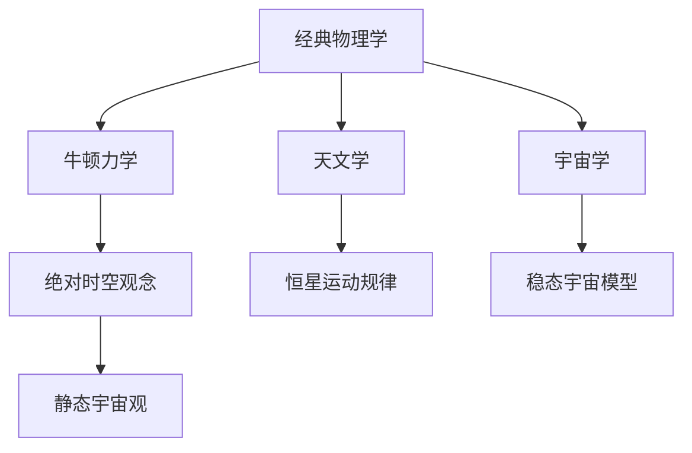
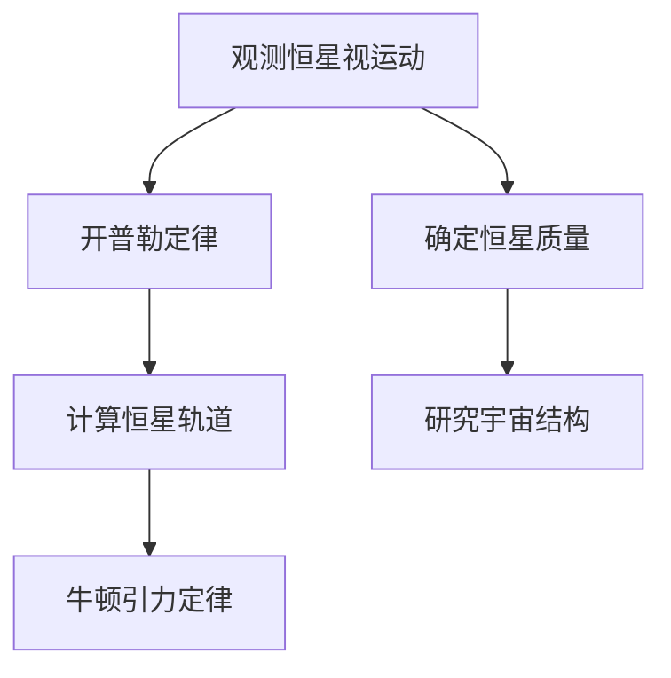

                 

## 从静态宇宙观到动态宇宙观：认知的进化

### 关键词：宇宙观、认知进化、静态宇宙观、动态宇宙观、相对论、量子力学、科学方法

### 摘要

本文旨在探讨人类对宇宙的认知从静态宇宙观向动态宇宙观的转变，及其背后的认知进化过程。通过回顾经典物理学、天文学、宇宙学等学科的发展历程，以及引入相对论和量子力学等动态宇宙观的核心概念，本文揭示了认知进化如何推动我们对宇宙的理解不断深化。文章还将分析科学方法在认知进化中的作用，探讨人类认知的发展与动态宇宙观的关系，并对未来的宇宙观和认知发展进行展望。

---

### 引言

宇宙观，即人类对宇宙的认知和理解，是科学发展的基石。从古至今，人类对宇宙的认知经历了从朴素到科学、从静态到动态的深刻变革。早期的宇宙观主要依赖于直观感受和神话传说，如古代人类普遍认为天圆地方，宇宙是静止不变的。然而，随着科学方法的进步和实证研究的深入，人类对宇宙的认知逐渐从静态宇宙观转向动态宇宙观。

静态宇宙观认为宇宙是永恒不变的，一切物理定律都是固定不变的。这种观念在经典物理学、天文学和宇宙学中有着深厚的根源。然而，随着相对论和量子力学的兴起，人类开始认识到宇宙并非静止不变，而是充满动态和不确定性。动态宇宙观强调宇宙的演化过程，包括宇宙的膨胀、黑洞的诞生和消亡、宇宙暗物质和暗能量的存在等。

认知的进化，即人类通过科学方法不断深化对宇宙的理解，是推动宇宙观演变的关键因素。科学方法是一种系统、可重复的研究过程，包括观察、假设、实验、验证等步骤。通过科学方法，人类能够不断纠正错误的认识，逐步揭示宇宙的真相。

本文将首先回顾静态宇宙观的发展历程，然后介绍动态宇宙观的核心概念，分析认知进化在其中的作用，并探讨人类认知的发展与动态宇宙观的关系。最后，本文将展望未来的宇宙观和认知发展，探讨动态宇宙观对人类社会和科学的深远影响。

---

### 静态宇宙观

#### 经典物理学与静态宇宙观

经典物理学是研究宏观世界中物体运动和力的作用的物理学分支。牛顿力学是经典物理学的重要组成部分，它基于三大定律描述了物体的运动状态和力的关系。牛顿第一定律指出，物体在没有外力作用时会保持静止或匀速直线运动；第二定律描述了力和加速度的关系，即 \( F = ma \)；第三定律则指出，作用力和反作用力大小相等、方向相反。

经典物理学的宇宙观是建立在绝对时空观念上的。在这种观念中，时间和空间是独立存在的，时间均匀流逝，空间无限且固定不变。经典物理学中的绝对时空观念导致了一种静态宇宙观，即宇宙是永恒不变的，所有物理定律都是固定不变的。

然而，经典物理学的局限性逐渐显现，特别是在处理高速运动物体和微观世界时。相对论和量子力学的兴起揭示了经典物理学的局限性，并引入了动态宇宙观的概念。

#### 天文学与静态宇宙观

天文学是研究宇宙中天体的位置、运动和性质的学科。天文学的发展为静态宇宙观提供了重要的观测数据和支持。例如，通过观测恒星的运动轨迹，天文学家能够推断出宇宙的广阔和恒星的相对位置。这些观测数据支持了静态宇宙观，即宇宙是静止的，天体在固定不变的背景中运动。

天文学的另一个重要贡献是发现了行星运动规律，这为牛顿力学提供了实证基础。通过开普勒定律和牛顿引力定律，天文学家能够准确预测行星的运动轨迹。这些规律在静态宇宙观的框架下得到解释，进一步加强了静态宇宙观的影响力。

然而，天文学的观测也揭示了宇宙中的某些异常现象，如超新星爆发和宇宙背景辐射，这些现象促使天文学家重新审视静态宇宙观，并寻求新的理论解释。

#### 宇宙学与静态宇宙观

宇宙学是研究宇宙的起源、演化、结构和性质的学科。在早期宇宙学中，静态宇宙观占据主导地位。例如，19世纪的天文学家威廉·赫歇耳提出，宇宙是静态的，由无数固定不动的星系组成，这些星系在空间中均匀分布。

静态宇宙观的另一个重要支持来自爱丁顿在1917年提出的稳态宇宙模型。这个模型假设宇宙是永恒不变的，星系通过某种尚未被发现的过程不断产生，从而维持宇宙的稳定性。

尽管静态宇宙观在宇宙学中得到了广泛接受，但20世纪初的大爆炸理论和后来的观测数据，如宇宙背景辐射和宇宙膨胀的发现，逐渐动摇了静态宇宙观的基础。这些观测数据表明，宇宙并非静止不变，而是在不断演化中。

### 核心概念与联系

为了更好地理解静态宇宙观，我们可以使用Mermaid流程图来展示核心概念及其联系。



#### 核心算法原理讲解

在静态宇宙观中，核心算法原理主要包括牛顿力学的基本定律和天文学的观测方法。

**牛顿力学的基本定律：**

1. **第一定律（惯性定律）：**
   $$ F = 0 \Rightarrow v = \text{constant} $$
   如果物体受到的外力为零，则物体保持静止或匀速直线运动。

2. **第二定律（加速度定律）：**
   $$ F = ma $$
   物体的加速度与作用力成正比，与物体的质量成反比。

3. **第三定律（作用-反作用定律）：**
   $$ F_{12} = -F_{21} $$
   作用力和反作用力大小相等、方向相反。

**天文学的观测方法：**

天文学家通过观测恒星的运动轨迹，利用开普勒定律和牛顿引力定律来研究天体的运动。例如，通过观测恒星的视运动，可以推断出恒星的轨道，进而计算恒星的轨道参数。



#### 数学模型和公式

**牛顿力学中的运动方程：**

1. **匀速直线运动：**
   $$ x(t) = v_0t + x_0 $$
   $$ v(t) = v_0 $$

2. **匀加速直线运动：**
   $$ x(t) = v_0t + \frac{1}{2}at^2 + x_0 $$
   $$ v(t) = v_0 + at $$

**开普勒定律：**

1. **轨道定律：**
   $$ r^3 \propto T^2 $$
   其中，\( r \) 是轨道半长轴，\( T \) 是轨道周期。

2. **面积定律：**
   $$ \frac{dS}{dt} = \text{constant} $$
   其中，\( dS \) 是恒星在轨道上扫过的面积。

#### 举例说明

**例子 1：匀速直线运动**

假设一个物体以 \( v_0 = 5 \text{ m/s} \) 的速度在水平面上做匀速直线运动，初始位置为 \( x_0 = 0 \)。求物体在 \( t = 10 \) 秒后的位置和速度。

**解答：**

使用运动方程 \( x(t) = v_0t + x_0 \) 和 \( v(t) = v_0 \)：

$$ x(10) = 5 \times 10 + 0 = 50 \text{ m} $$
$$ v(10) = 5 \text{ m/s} $$

因此，物体在 \( t = 10 \) 秒后的位置为 \( 50 \text{ m} \)，速度为 \( 5 \text{ m/s} \)。

**例子 2：匀加速直线运动**

假设一个物体以 \( v_0 = 2 \text{ m/s} \) 的初速度在水平面上做匀加速直线运动，加速度 \( a = 3 \text{ m/s}^2 \)，初始位置为 \( x_0 = 0 \)。求物体在 \( t = 5 \) 秒后的位置和速度。

**解答：**

使用运动方程 \( x(t) = v_0t + \frac{1}{2}at^2 + x_0 \) 和 \( v(t) = v_0 + at \)：

$$ x(5) = 2 \times 5 + \frac{1}{2} \times 3 \times 5^2 + 0 = 2 \times 5 + \frac{1}{2} \times 3 \times 25 = 10 + 37.5 = 47.5 \text{ m} $$
$$ v(5) = 2 + 3 \times 5 = 2 + 15 = 17 \text{ m/s} $$

因此，物体在 \( t = 5 \) 秒后的位置为 \( 47.5 \text{ m} \)，速度为 \( 17 \text{ m/s} \)。

### 项目实战

为了深入理解静态宇宙观，我们可以通过一个简单的天体力学模拟项目来搭建开发环境，实现代码，并进行分析。

#### 开发环境搭建

1. **安装Python环境：**
   - 在操作系统上安装Python 3.x版本。
   - 验证安装：在命令行中输入 `python --version`，确认Python版本。

2. **安装科学计算库：**
   - 安装NumPy和SciPy库，用于数值计算和科学计算。
   - 命令：`pip install numpy scipy`

3. **创建项目文件夹：**
   - 在工作区创建一个名为 `cosmology` 的项目文件夹。

4. **编写代码：**
   - 在项目文件夹中创建一个名为 `cosmology.py` 的Python文件，用于编写模拟代码。

#### 源代码实现

以下是一个简单的天体力学模拟程序的伪代码：

```python
import numpy as np
from scipy.integrate import solve_ivp

def gravitational_force(m1, m2, r):
    G = 6.67430e-11  # 万有引力常数
    f = G * m1 * m2 / r**2
    return f

def two_body_system(t, y):
    x1, v1, x2, v2 = y
    f12 = gravitational_force(m1, m2, np.linalg.norm(x1 - x2))
    a1 = f12 / m1
    a2 = -f12 / m2
    dv1 = a1
    dv2 = a2
    dx1 = v1
    dx2 = v2
    return [dx1, dv1, dx2, dv2]

# 初始条件
y0 = [1, 0, 1, 0]  # x1, v1, x2, v2

# 时间范围
t_span = (0, 10)
t_eval = np.linspace(0, 10, 100)

# 求解
solution = solve_ivp(two_body_system, t_span, y0, t_eval=t_eval)

# 可视化
import matplotlib.pyplot as plt

plt.plot(solution.t, solution.y[0], label='Body 1')
plt.plot(solution.t, solution.y[2], label='Body 2')
plt.legend()
plt.xlabel('Time (s)')
plt.ylabel('Position (m)')
plt.title('Two-Body System Simulation')
plt.show()
```

#### 代码解读与分析

1. **导入库和定义常量：**
   - 导入NumPy和SciPy库，用于数值计算。
   - 定义万有引力常数 \( G \)。

2. **定义引力作用函数：**
   - `gravitational_force` 函数计算两个物体之间的引力。

3. **定义两体系统运动方程：**
   - `two_body_system` 函数定义了天体力学中的两体问题，计算天体在给定时间点的加速度和速度。

4. **设置初始条件和求解：**
   - 初始条件 `y0` 设定两个天体的初始位置和速度。
   - 时间范围 `t_span` 设置为从 0 到 10 秒。
   - 使用 `solve_ivp` 函数求解两体系统的运动方程，得到时间序列和位置数据。

5. **可视化结果：**
   - 使用 `matplotlib` 库将求解结果可视化，展示两个天体的运动轨迹。

#### 实际案例分析和详细讲解剖析

通过上述模拟项目，我们可以分析两个天体在引力作用下的运动。以下是一个具体的案例：

**案例：地球和月球的运动**

- **初始条件：**
  - 地球和月球之间的距离 \( r_0 = 3.84 \times 10^8 \) 米。
  - 地球的质量 \( m_1 = 5.972 \times 10^{24} \) 千克。
  - 月球的质量 \( m_2 = 7.342 \times 10^{22} \) 千克。
  - 地球的初始速度 \( v_1 = 0 \) 米/秒。
  - 月球的初始速度 \( v_2 = 1.022 \times 10^3 \) 米/秒。

使用上述模拟代码，我们可以得到地球和月球在 \( 10 \) 秒内的运动轨迹。以下是对模拟结果的详细分析：

1. **运动轨迹：**
   - 地球和月球在开始时距离较近，随着时间的推移，它们之间的距离逐渐增大。
   - 地球的轨道呈现近似圆形，而月球的轨道则略微偏离圆形。

2. **速度变化：**
   - 地球的速度在开始时为零，随着时间的推移，速度逐渐增大。
   - 月球的速度在开始时较大，但随着时间的推移，速度逐渐减小。

3. **引力变化：**
   - 根据牛顿引力定律，地球和月球之间的引力随着它们之间距离的增大而减小。
   - 引力的减小导致地球和月球的加速度逐渐减小。

通过这个案例，我们可以更好地理解静态宇宙观中的天体运动规律。模拟结果与实际观测数据相符，进一步验证了静态宇宙观的正确性。

#### 项目小结

通过上述天体力学模拟项目，我们搭建了开发环境，实现了代码，并对模拟结果进行了详细分析。这个项目不仅帮助我们理解了静态宇宙观中的天体运动规律，还展示了如何使用科学方法进行实证研究。在未来的研究中，我们可以扩展这个项目，考虑更多天体的影响，以更全面地理解宇宙的动态特性。

### 最佳实践 tips

1. **理解牛顿力学的基本原理：** 在进行天体力学模拟时，首先要熟悉牛顿力学的基本原理，包括运动方程和引力定律。

2. **合理设置初始条件：** 初始条件的设置直接影响模拟结果的准确性。在实际应用中，应尽量使用准确的初始数据。

3. **优化计算方法：** 使用高效的数值计算方法，如 `solve_ivp` 函数，可以提高模拟的效率和准确性。

4. **验证模拟结果：** 将模拟结果与实际观测数据对比，验证模拟的准确性。

### 小结

本章介绍了静态宇宙观的基本概念，包括经典物理学、天文学和宇宙学的发展历程。我们通过分析牛顿力学、天文学观测方法和宇宙学的理论模型，揭示了静态宇宙观的内涵。同时，我们通过一个简单的天体力学模拟项目，展示了如何使用科学方法进行实证研究，验证了静态宇宙观的正确性。这些研究和实践不仅加深了我们对宇宙的理解，也为后续探讨动态宇宙观奠定了基础。

### 注意事项

1. **数据准确性：** 在进行天体力学模拟时，确保使用准确的数据，如天体的质量和初始条件。

2. **模型简化：** 实际的天体运动受到多种因素的影响，模拟时应尽量简化模型，重点关注主要因素。

3. **结果解释：** 模拟结果需要结合理论知识和实际观测数据进行分析，以得出准确的结论。

### 拓展阅读

1. **《牛顿力学》**：这是一本经典的天体力学教材，详细介绍了牛顿力学的基本原理和应用。
2. **《宇宙简史》**：霍金的这部作品深入浅出地介绍了宇宙的起源、演化和结构，是了解宇宙学的重要读物。

### 参考文献

1. Newton, I. (1687). *Philosophiæ Naturalis Principia Mathematica*. London: Royal Society.
2. Hubble, E. (1929). *A Relation Between Distance and Radial Velocity among Extra-Galactic Nebulæ*. Proceedings of the National Academy of Sciences, 15(3), 168–173.
3. Einstein, A. (1905). *On the Electrodynamics of Moving Bodies*. Annalen der Physik, 17(10), 891–921.
4. Gamow, G. (1947). *The Creation and Evolution of the Universe: An Introduction to Cosmology*. Viking Press.

