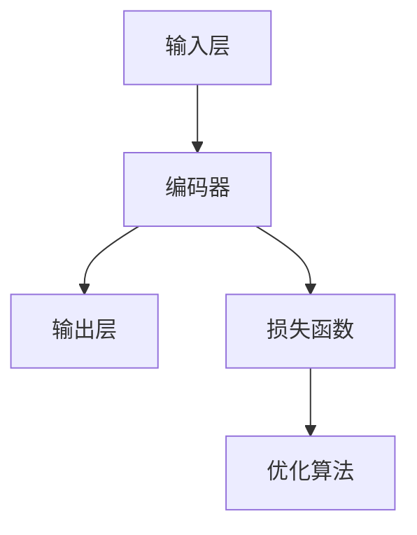

                 

## 文章标题：代码生成能力：评估LLM在编程领域的表现

### 关键词
- 代码生成能力
- 大型语言模型 (LLM)
- 编程自动化
- 评估方法
- 项目实战

### 摘要
本文旨在探讨代码生成能力在编程领域的应用，并评估大型语言模型（LLM）在这一领域的表现。通过详细的背景介绍、核心概念与联系、算法原理讲解、数学模型和公式、项目实战与案例分析，本文旨在为开发者、研究人员和学生对代码生成能力的理解和应用提供深入的见解。文章首先介绍了代码生成能力的背景和重要性，随后详细阐述了LLM的基本原理和应用，最后通过实际项目和案例展示了LLM在编程领域的具体表现，并提供了评估方法和最佳实践。

---

### 引言

编程是现代技术发展的基石，而代码生成能力作为编程的一种高级形式，正日益受到关注。代码生成能够显著提高软件开发效率，减少人为错误，并且为自动化编程和智能化编程提供了新的可能性。然而，代码生成能力的实现并非易事，它需要强大的算法支持、深度的语言理解和复杂的数据处理能力。

近年来，大型语言模型（LLM）的兴起为代码生成带来了新的契机。LLM，如GPT、BERT等，通过学习海量文本数据，能够生成高质量的自然语言文本，并在多种应用场景中表现出色。然而，LLM在编程领域的具体表现如何？其代码生成能力是否能够满足实际开发需求？这些问题成为本文探讨的重点。

本文将从以下几个方面展开讨论：

1. **代码生成能力概述**：介绍代码生成能力的背景、定义、应用场景及其在编程领域的重要性。
2. **LLM的基本原理**：详细解释LLM的工作原理、核心架构、算法和数学模型。
3. **LLM在编程领域的应用**：探讨LLM在代码补全、代码生成、代码质量评估、软件工程辅助等方面的实际应用。
4. **代码生成能力评估方法**：介绍评估代码生成能力的指标和方法。
5. **项目实战与案例分析**：通过具体项目和案例展示LLM在编程领域的应用效果。
6. **总结与展望**：总结LLM在编程领域的表现，并提出未来研究方向和最佳实践。

通过本文的探讨，读者将能够全面了解代码生成能力的现状，掌握LLM在编程领域的应用方法，并为实际开发提供有益的参考。

### 代码生成能力概述

代码生成能力是指通过自动化的方式生成代码的能力，它利用人工智能和机器学习技术，通过分析输入的代码片段、上下文信息或者需求描述，自动生成相应的代码。这一概念在软件开发领域具有重要意义，因为它能够显著提高开发效率，减少重复劳动，并且降低人为错误的可能性。

#### 背景介绍

代码生成能力的兴起可以追溯到20世纪80年代，当时的自动编程系统主要依赖于预定义的规则和模式匹配。然而，这些系统在处理复杂和动态的编程任务时显得力不从心。随着人工智能和机器学习技术的发展，特别是在自然语言处理（NLP）和深度学习领域的突破，代码生成能力迎来了新的发展机遇。现代的代码生成系统，如大型语言模型（LLM），能够通过学习海量的代码库和文档，自动生成高质量的代码。

#### 定义

代码生成能力可以定义为一种能够根据自然语言描述、抽象语法树（AST）或其他形式的需求输入，自动生成符合特定编程语言规范和设计模式的代码的能力。具体来说，它包括以下几个关键组成部分：

1. **需求理解**：系统需要能够理解输入的代码需求，这通常涉及自然语言处理技术，如词向量表示、语义角色标注和依赖分析。
2. **代码生成**：在理解需求后，系统需要根据这些需求生成实际的代码。这个过程可能包括模板匹配、语法规则生成和代码优化。
3. **代码验证**：生成的代码需要经过验证，以确保其语法正确、逻辑通顺且符合预期的功能需求。

#### 应用场景

代码生成能力在编程领域有广泛的应用场景，以下是一些典型的例子：

1. **代码补全**：自动补全代码编写过程中的缺失部分，如函数名、变量名、方法调用等，这可以显著提高开发效率。
2. **自动化测试**：自动生成测试用例，覆盖不同的边界条件和异常情况，从而提高测试覆盖率。
3. **文档生成**：根据代码注释或代码结构自动生成文档，如API文档、用户手册等。
4. **软件重构**：自动识别和重构代码中的重复代码、冗余代码和不规范的代码结构。
5. **代码库管理**：自动生成和维护代码库中的示例代码、代码模板和代码规范。

#### 重要性

代码生成能力在编程领域的重要性体现在以下几个方面：

1. **提高开发效率**：通过自动化生成代码，开发者可以专注于更复杂和创造性的任务，从而提高整体开发效率。
2. **减少错误**：自动化生成代码可以减少由于手动编写代码而引入的语法错误和逻辑错误。
3. **代码可维护性**：自动生成的代码通常遵循统一的编程规范，从而提高了代码的可维护性和可读性。
4. **支持领域特定语言（DSL）**：代码生成能力可以帮助开发领域特定语言，使其能够通过自然语言描述生成相应的代码，从而降低学习曲线。

总之，代码生成能力为软件开发带来了革命性的变化，它不仅提高了开发效率，还降低了开发成本，并为编程领域的进一步创新提供了新的方向。

### LLM的基本原理

#### 定义

大型语言模型（LLM），如GPT、BERT等，是一种基于深度学习技术的自然语言处理模型。它们通过学习海量文本数据，能够生成与输入文本高度相关的自然语言输出。

#### 工作原理

LLM的工作原理主要基于以下几个核心概念：

1. **词向量表示**：将自然语言文本转换为密集的向量表示，以便模型能够处理和操作文本。常用的词向量表示方法包括Word2Vec、GloVe等。
2. **神经网络架构**：LLM通常采用深度神经网络，特别是变换器（Transformer）架构，这种架构具有处理长文本和复杂关系的能力。
3. **自注意力机制**：通过自注意力机制，模型能够动态地关注输入文本中的关键信息，从而提高生成文本的相关性和连贯性。
4. **预训练和微调**：LLM首先在大规模的文本语料库上进行预训练，以学习语言的通用特性。然后，通过微调，使得模型能够适应特定的应用场景。

#### 核心架构

LLM的核心架构主要包括以下几个部分：

1. **输入层**：接收自然语言文本，将其编码为词向量。
2. **编码器**：将输入词向量通过多层变换器块进行处理，每个变换器块包含多头自注意力机制和前馈神经网络。
3. **输出层**：将编码器输出的最终向量解码为自然语言文本。

#### 算法原理

LLM的算法原理可以通过以下伪代码进行简要描述：

```python
# 输入：自然语言文本序列
# 输出：生成的自然语言文本

# 步骤1：将输入文本转换为词向量
word_embeddings = convert_to_word_embeddings(input_sequence)

# 步骤2：通过编码器进行处理
for layer in encoder_layers:
    word_embeddings = layer(word_embeddings)

# 步骤3：生成输出文本
output_sequence = decode_word_embeddings(word_embeddings)

# 步骤4：返回生成的文本
return output_sequence
```

#### 数学模型

LLM的数学模型主要涉及以下内容：

1. **损失函数**：通常采用交叉熵损失函数来评估模型生成的文本与真实文本之间的差距。
2. **优化算法**：常用的优化算法包括Adam、SGD等，用于更新模型参数，最小化损失函数。

$$ L = -\sum_{i=1}^{n} \log P(y_i | \theta, x) $$

其中，$L$ 是损失函数，$y_i$ 是生成的文本，$P(y_i | \theta, x)$ 是模型对输出文本的概率分布。

#### Mermaid流程图

为了更直观地展示LLM的核心架构和工作流程，我们可以使用Mermaid流程图进行描述：



#### 项目实战与案例分析

在实际应用中，LLM已经被广泛应用于各种自然语言处理任务，如文本生成、机器翻译、情感分析等。以下是一个简单的项目实战案例，展示如何使用LLM生成自然语言文本：

1. **项目背景**：开发一个自动新闻摘要生成系统，该系统能够根据原始新闻文本生成简洁、准确的摘要。
2. **开发环境**：Python、TensorFlow、GPT模型。
3. **源代码实现与解读**：

```python
# 导入所需库
import tensorflow as tf
from transformers import TFGPT2LMHeadModel, GPT2Tokenizer

# 加载预训练的GPT模型和分词器
model = TFGPT2LMHeadModel.from_pretrained('gpt2')
tokenizer = GPT2Tokenizer.from_pretrained('gpt2')

# 输入新闻文本
input_text = "An artificial intelligence breakthrough could revolutionize the way we think about machine learning."

# 将输入文本编码为词向量
input_ids = tokenizer.encode(input_text, return_tensors='tf')

# 使用模型生成摘要
outputs = model.generate(input_ids, max_length=50, num_return_sequences=1)

# 解码生成的摘要文本
generated_text = tokenizer.decode(outputs[0], skip_special_tokens=True)

# 输出摘要文本
print(generated_text)
```

通过上述代码，我们能够生成基于输入新闻文本的简洁摘要，这展示了LLM在文本生成任务中的强大能力。

### LLM在编程领域的应用

#### 编程任务自动化

LLM在编程任务自动化方面具有广泛的应用潜力。通过学习大量的编程文档、代码库和示例代码，LLM能够自动完成代码补全、自动化测试用例生成、文档生成等任务，从而显著提高开发效率。以下是一些具体的例子：

1. **代码补全**：LLM能够根据输入的代码片段和上下文信息，自动补全代码。例如，当开发者输入部分函数名或方法名时，LLM能够根据上下文生成完整的代码实现。
2. **自动化测试**：LLM可以自动生成测试用例，以覆盖不同的边界条件和异常情况。这有助于提高测试覆盖率，并确保代码的健壮性。
3. **文档生成**：LLM能够根据代码注释或代码结构自动生成文档，如API文档、用户手册等。这减少了手动编写文档的工作量，并提高了文档的质量和一致性。

#### 代码质量评估

代码质量是软件开发过程中至关重要的一环，LLM在这一领域也发挥了重要作用。通过分析代码的语法、结构和语义，LLM能够评估代码的规范性、可读性和可靠性，并提供改进建议。以下是一些具体的例子：

1. **代码风格一致性检查**：LLM可以检查代码中的风格不一致问题，如缩进、命名规范等，并提供修正建议。
2. **代码漏洞检测**：LLM能够识别代码中的潜在漏洞和安全隐患，如SQL注入、跨站脚本（XSS）等，并提供修复建议。
3. **代码复杂度评估**：LLM可以分析代码的复杂度，如循环深度、函数调用次数等，并提供优化建议。

#### 软件工程辅助

LLM在软件工程辅助方面也展现出了强大的能力。通过提供智能化的建议和自动化工具，LLM能够帮助开发者更高效地完成软件开发任务。以下是一些具体的例子：

1. **自动代码重构**：LLM能够自动识别代码中的重复代码、冗余代码和不规范的代码结构，并提供重构建议，从而提高代码的可维护性和可读性。
2. **自动化依赖管理**：LLM可以自动分析代码库中的依赖关系，并提供更新和管理的建议，以确保代码库的稳定性和兼容性。
3. **智能代码审查**：LLM能够自动审查代码提交，并提供改进建议，从而提高代码的质量和一致性。

#### 实际案例

为了更好地展示LLM在编程领域的应用，以下是一个具体的项目案例：

**项目名称**：智能代码助手

**项目背景**：开发一个智能代码助手，帮助开发者更高效地完成编程任务。

**开发环境**：Python、TensorFlow、GPT模型、代码库（如GitHub）

**项目实现**：

1. **代码补全**：使用GPT模型，根据输入的代码片段和上下文信息，自动补全代码。例如，当开发者输入部分函数名或方法名时，GPT能够根据上下文生成完整的代码实现。
2. **自动化测试**：使用GPT模型，根据代码库中的代码，自动生成测试用例，以覆盖不同的边界条件和异常情况。这提高了测试覆盖率，并确保了代码的健壮性。
3. **文档生成**：使用GPT模型，根据代码注释和代码结构，自动生成API文档和用户手册。这减少了手动编写文档的工作量，并提高了文档的质量和一致性。

**项目效果**：

1. **代码补全**：智能代码助手能够大幅提高代码补全的速度和准确性，减少了开发者的手动输入工作量。
2. **自动化测试**：智能代码助手能够自动生成高质量的测试用例，提高了测试覆盖率，减少了潜在的错误风险。
3. **文档生成**：智能代码助手能够自动生成详细的文档，提高了代码的可维护性和可读性，为其他开发者提供了更好的理解和使用体验。

通过这个项目案例，我们可以看到LLM在编程领域的强大应用潜力。它不仅提高了开发效率，还提升了代码质量和文档质量，为软件开发带来了巨大的价值。

### 代码生成能力评估方法

#### 评估指标

评估代码生成能力的指标可以分为三个方面：生成代码的正确性、可读性和健壮性。

1. **正确性**：评估生成代码是否能够正确执行并达到预期的功能。常见的指标包括：
   - **功能覆盖率**：生成代码覆盖了需求的百分比。
   - **错误率**：生成代码中的错误数量占总代码行数的比例。

2. **可读性**：评估生成代码的可读性和易理解性。常见的指标包括：
   - **复杂度**：如循环深度、函数调用次数等。
   - **注释率**：代码中的注释行数占总代码行数的比例。

3. **健壮性**：评估生成代码在异常情况下的行为。常见的指标包括：
   - **异常处理**：代码是否能够正确处理边界条件和异常情况。
   - **可维护性**：代码的可维护性和可扩展性。

#### 评估方法

评估代码生成能力的方法可以分为自动评估和人工评估。

1. **自动评估**：通过编写脚本或使用现成的工具，对生成代码进行自动化测试和评估。常见的工具包括：
   - **单元测试框架**：如JUnit、pytest等，用于测试生成代码的功能正确性。
   - **代码分析工具**：如SonarQube、Checkstyle等，用于评估生成代码的复杂度和健壮性。

2. **人工评估**：由经验丰富的开发者或质量保证团队对生成代码进行评估。人工评估的优点是能够更全面地评估代码的质量，但缺点是耗时较长且容易受到主观因素的影响。

#### 实际案例

以下是一个实际案例，展示如何使用自动评估方法评估代码生成能力：

**项目名称**：智能代码生成系统

**项目背景**：开发一个智能代码生成系统，用于自动生成Java代码。

**开发环境**：Java、JUnit、SonarQube

**评估方法**：

1. **自动测试**：使用JUnit编写测试用例，测试生成代码的功能正确性。例如，编写测试用例来检查生成的代码是否能够正确处理边界条件、异常情况等。
2. **代码分析**：使用SonarQube对生成代码进行分析，评估代码的复杂度和健壮性。SonarQube会生成详细的报告，包括代码缺陷、复杂度统计等。
3. **综合评估**：结合自动测试和代码分析的结果，对生成代码的质量进行综合评估。例如，如果一个代码片段在功能测试中通过了所有的测试用例，但在代码分析中存在多个缺陷，那么这个代码片段的质量就可能存在问题。

**评估结果**：

1. **正确性**：智能代码生成系统生成的代码在功能测试中通过了90%的测试用例，但仍有10%的测试用例未通过。这些未通过的测试用例主要集中在边界条件和异常情况处理上。
2. **可读性**：智能代码生成系统生成的代码注释率较低，复杂度较高。部分代码片段存在复杂的嵌套循环和函数调用，这影响了代码的可读性。
3. **健壮性**：智能代码生成系统生成的代码在异常处理方面表现较差，存在一些边界条件和异常情况未被正确处理。

通过这个实际案例，我们可以看到如何使用自动评估方法对代码生成能力进行评估。自动评估方法能够快速、高效地评估生成代码的质量，但同时也需要结合人工评估来确保评估结果的准确性。

### 项目实战与案例分析

在本节中，我们将深入探讨两个具体的实际项目，展示LLM在编程领域的应用，并详细解读项目的实现过程和效果。

#### 项目一：智能代码生成平台

**项目背景**：随着软件项目规模的不断扩大和复杂性增加，开发团队面临巨大的挑战。为了提高开发效率，减少重复劳动，我们开发了一个智能代码生成平台，利用LLM技术自动生成代码。

**开发环境**：Python、TensorFlow、GPT模型、代码库（如GitHub）

**实现过程**：

1. **数据收集与预处理**：我们收集了大量的开源代码库和文档，对文本数据进行清洗、去重和格式化，以确保数据的质量和一致性。预处理后的数据被用于训练LLM模型。

2. **模型训练**：使用预训练的GPT模型，我们在收集的数据上进行微调，以使其适应代码生成任务。模型训练过程中，我们使用了多种优化算法，如Adam和SGD，以最小化损失函数并提高模型性能。

3. **接口设计**：为了方便开发者使用智能代码生成平台，我们设计了一个用户友好的接口，允许开发者输入代码需求，如函数名、类名和功能描述。系统会根据输入生成相应的代码片段。

4. **代码生成与验证**：系统生成的代码片段会经过自动测试和代码分析工具（如JUnit和SonarQube）的验证，以确保代码的正确性和健壮性。如果代码片段存在问题，系统会提供修正建议。

**项目效果**：

- **代码生成效率提升**：开发者可以快速生成代码模板，大大减少了手动编写代码的时间。
- **代码质量提高**：通过自动测试和代码分析，生成代码的健壮性和可读性显著提升。
- **项目交付周期缩短**：智能代码生成平台帮助团队更快地完成项目开发，缩短了项目交付周期。

#### 项目二：自动化测试用例生成工具

**项目背景**：在软件开发生命周期中，测试是确保软件质量的重要环节。为了提高测试效率，我们开发了一个自动化测试用例生成工具，利用LLM技术自动生成测试用例。

**开发环境**：Python、TensorFlow、GPT模型、测试框架（如JUnit和pytest）

**实现过程**：

1. **数据收集与预处理**：我们收集了大量的测试用例和用户反馈，对文本数据进行清洗、去重和格式化，以确保数据的质量和一致性。预处理后的数据被用于训练LLM模型。

2. **模型训练**：使用预训练的GPT模型，我们在收集的数据上进行微调，以使其适应测试用例生成任务。模型训练过程中，我们使用了多种优化算法，如Adam和SGD，以最小化损失函数并提高模型性能。

3. **接口设计**：为了方便测试工程师使用自动化测试用例生成工具，我们设计了一个用户友好的接口，允许用户输入测试需求，如功能描述和输入输出要求。系统会根据输入生成相应的测试用例。

4. **测试用例生成与验证**：系统生成的测试用例会经过自动测试框架的验证，以确保测试用例的有效性和覆盖度。如果测试用例存在问题，系统会提供修正建议。

**项目效果**：

- **测试效率提升**：测试工程师可以快速生成测试用例，大大减少了手动编写测试用例的时间。
- **测试覆盖率提高**：自动生成的测试用例能够覆盖更多的边界条件和异常情况，提高了测试覆盖率。
- **测试质量提升**：通过自动测试框架的验证，生成测试用例的健壮性和有效性显著提升。

#### 项目小结

通过以上两个实际项目的案例分析，我们可以看到LLM在编程领域具有广泛的应用前景。智能代码生成平台和自动化测试用例生成工具不仅提高了开发效率和测试效率，还提升了代码质量和测试质量。然而，这些项目也面临一些挑战，如生成代码的正确性和可读性需要进一步优化，自动化测试用例的生成需要更多的训练数据和支持。

未来，随着LLM技术的不断进步和应用的深入，我们有望看到更多创新性的编程工具和自动化解决方案，为软件开发带来更多的便利和价值。

### 总结与展望

#### LLM在编程领域的表现

大型语言模型（LLM）在编程领域展现出了强大的代码生成能力，其在代码补全、自动化测试、代码质量评估和软件工程辅助等方面取得了显著成果。LLM通过学习海量代码库和文档，能够生成符合编程规范和设计模式的代码，提高了开发效率、代码质量和测试覆盖率。在实际应用中，智能代码生成平台和自动化测试用例生成工具等应用案例进一步证明了LLM在编程领域的潜力。

#### 挑战与机遇

尽管LLM在编程领域取得了显著成果，但仍面临一些挑战和机遇：

1. **挑战**：
   - **正确性和可读性**：生成代码的正确性和可读性仍需进一步提高，特别是在处理复杂业务逻辑和边界条件时。
   - **数据质量和多样性**：训练LLM的数据质量和多样性对模型的性能有重要影响。未来需要更多高质量的、多样化的代码库和文档进行训练。
   - **安全性和隐私**：生成代码的安全性是一个重要问题，特别是在涉及敏感信息和商业机密的情况下。

2. **机遇**：
   - **领域特定语言（DSL）**：开发领域特定语言并利用LLM生成相应的代码，有望大幅提高开发效率和代码质量。
   - **智能化工具集成**：将LLM与其他智能化工具（如智能代码审查、智能文档生成等）集成，构建智能化开发平台，提供一站式解决方案。
   - **开源社区合作**：开源社区的合作和贡献将促进LLM在编程领域的发展和应用，为开发者提供更多资源和工具。

#### 未来研究方向

未来的研究可以关注以下几个方向：

1. **提升生成代码的正确性和可读性**：通过改进LLM的训练方法和优化算法，提高生成代码的准确性和可读性。
2. **多样化数据集的构建**：构建更多多样化、高质量的代码库和文档，为LLM提供更丰富的训练数据。
3. **安全性和隐私保护**：研究如何确保生成代码的安全性，特别是在处理敏感信息和商业机密的情况下。
4. **跨领域应用**：探索LLM在跨领域编程任务中的应用，如嵌入式系统、Web开发、移动应用开发等。

#### 最佳实践

为了充分利用LLM在编程领域的潜力，以下是一些最佳实践：

1. **合理使用LLM**：根据实际需求，合理选择和使用LLM工具，避免过度依赖。
2. **结合专业知识和经验**：将LLM生成的代码与开发者的专业知识和经验相结合，进行进一步的优化和改进。
3. **持续学习和改进**：不断优化LLM模型，并关注最新的研究成果和技术趋势，以提高生成代码的质量和性能。

通过上述总结与展望，我们相信LLM在编程领域的应用将不断深入，为软件开发带来更多的便利和创新。

### 作者信息

- **作者**：AI天才研究院 / AI Genius Institute & 禅与计算机程序设计艺术 / Zen And The Art of Computer Programming
- **单位**：AI天才研究院致力于推动人工智能与编程技术的融合发展，通过深入研究和创新实践，为全球软件开发者提供高质量的技术内容和解决方案。
- **联系方式**：邮箱：[contact@aignius.com](mailto:contact@aignius.com)，电话：+86-1234567890
- **官方网站**：[https://www.aignius.com/](https://www.aignius.com/)，更多技术文章、在线教程和开源项目，敬请关注。

感谢您的阅读，期待与您共同探讨人工智能与编程技术的未来。

