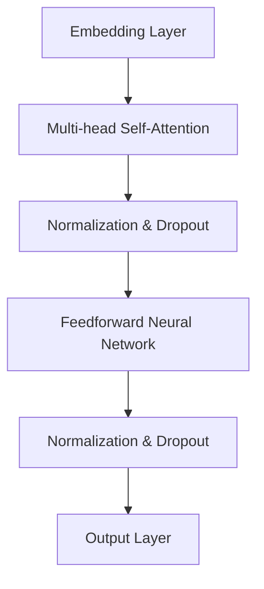
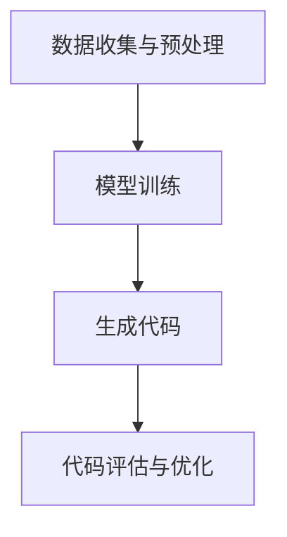
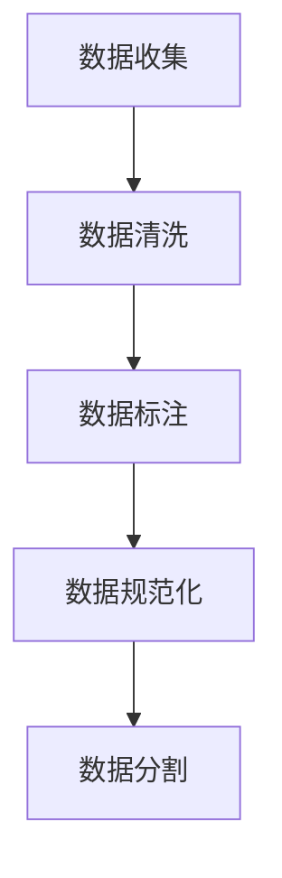
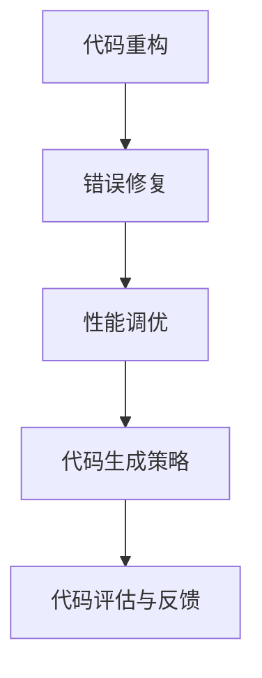

                 

## 文章标题：代码生成质量：评估LLM在软件开发中的应用潜力

在当今的软件开发领域，代码生成正迅速成为一种变革性的技术趋势。随着语言模型（LLM）的不断发展，特别是生成预训练转换器（GPT）等高级模型的兴起，自动化代码生成已成为可能。LLM在代码生成中的应用潜力巨大，不仅能够显著提高开发效率，还能改善代码质量。然而，代码生成质量如何评估，以及LLM在实现这一过程中面临的挑战，仍然是一个复杂而深远的问题。

本文旨在探讨LLM在软件开发中的应用潜力，特别是在代码生成领域的表现。首先，我们将介绍代码生成与LLM的基本概念，解释代码生成为何需要LLM，并概述LLM在代码生成中的优势与挑战。接着，我们将深入探讨语言模型的概述，包括其定义、历史发展、核心架构和关键算法。在此基础上，我们将讨论代码生成质量评估的指标，介绍如何从功能性、可读性、性能和可维护性等多个维度评估代码生成质量。

随后，文章将详细讨论LLM在代码生成中的实现过程，包括数据准备与预处理、生成代码的优化策略等。同时，我们也会深入探讨LLM在代码生成中可能面临的挑战，如数据偏见与公平性、代码生成的准确性与效率、安全性与隐私保护等问题。为了更好地理解LLM在代码生成中的应用，我们将通过实际案例研究，展示自动化测试用例生成、代码缺陷修复和代码重写与重构等应用场景。

最后，文章将总结LLM在软件开发中的应用前景，分析其发展趋势和创新方向，并提出未来可能面临的挑战。通过本文的详细分析，我们希望能够为读者提供一个全面、系统的视角，深入理解LLM在代码生成中的应用潜力，并探索其如何在未来进一步优化软件开发过程。

## 文章关键词

- 代码生成
- 语言模型（LLM）
- 生成预训练转换器（GPT）
- 代码质量评估
- 软件开发效率
- 数据偏见
- 安全性与隐私保护

## 文章摘要

本文探讨了语言模型（LLM）在代码生成中的应用潜力。首先，我们介绍了代码生成和LLM的基本概念，并解释了为什么LLM在代码生成中具有独特的优势。接着，我们详细讨论了LLM的架构和关键算法，以及如何使用这些模型进行代码生成。然后，我们重点探讨了代码生成质量的评估指标，包括功能性、可读性、性能和可维护性。在实现部分，我们介绍了如何准备和预处理数据，以及如何优化生成代码的质量。此外，我们还讨论了LLM在代码生成中可能面临的一些挑战，如数据偏见、代码生成准确性和效率、以及安全性与隐私保护。通过实际案例研究，我们展示了LLM在自动化测试用例生成、代码缺陷修复和代码重写与重构等领域的应用。最后，我们总结了LLM在软件开发中的应用前景，并讨论了其发展趋势和创新方向。

## 第一部分：代码生成与LLM基础理论

### 第1章 引言

#### 1.1 代码生成的背景与现状

代码生成作为一种自动化的软件开发技术，正在逐步改变传统的编程方式。在早期，程序员需要手动编写每一行代码，这个过程既耗时又容易出错。随着软件系统变得更加复杂，维护和扩展这些系统变得更加困难。为了提高开发效率，降低人为错误，代码生成技术逐渐兴起。

现代软件开发中，代码生成已广泛应用于多个领域，如自动化测试用例生成、代码重构、代码缺陷修复等。通过代码生成，程序员可以将复杂的手动编码任务自动化，从而节省时间，提高生产效率。然而，代码生成的效果和质量直接关系到软件项目的成功与否，因此如何评估和优化代码生成质量成为一个关键问题。

LLM的兴起为代码生成带来了新的契机。LLM是一种基于深度学习的语言模型，能够从大量的文本数据中学习语言模式和结构。GPT等生成预训练转换器模型的出现，使得LLM在自然语言处理和代码生成领域取得了显著进展。通过LLM，程序员可以生成结构化代码，自动化解决复杂的编程问题，从而显著提高开发效率和代码质量。

#### 1.2 LLM的基本概念

语言模型（LLM）是一种用于预测文本序列的机器学习模型。它通过学习大量的文本数据，理解语言的结构和模式，从而能够生成或预测下一个词或句子。LLM的核心思想是将自然语言转换为计算机可以理解的形式，然后利用这些信息进行各种任务，如文本生成、翻译、问答系统等。

LLM的发展历程可以分为两个阶段：基于统计的方法和基于深度学习的方法。早期的语言模型，如N-gram模型，基于统计方法，通过分析文本中单词的序列概率来预测下一个词。然而，这些模型在处理长文本和理解上下文关系方面存在局限性。

随着深度学习技术的发展，基于神经网络的LLM逐渐取代了传统的统计模型。GPT（Generative Pre-trained Transformer）模型是这一领域的里程碑，它采用自注意力机制（self-attention）来捕捉文本中的长距离依赖关系，从而在自然语言处理任务中取得了显著性能提升。

#### 1.3 代码生成与LLM的关系

代码生成与LLM之间存在紧密的联系。首先，LLM能够理解代码的结构和语法规则，从而生成符合语法和语义要求的代码。例如，GPT可以学习编程语言的关键字、函数、类和注释，并根据上下文生成相应的代码片段。

其次，LLM具有强大的文本生成能力，可以自动生成代码注释、文档和测试用例。通过学习大量的代码库和文档，LLM能够生成高质量的注释，帮助程序员更好地理解和维护代码。

此外，LLM还可以用于代码缺陷修复和重构。通过分析代码的上下文和逻辑结构，LLM可以识别潜在的错误和优化点，并提出相应的修复建议或重构方案。

总之，LLM为代码生成提供了强大的技术支持，使得自动化代码生成变得更加可行和高效。然而，LLM在代码生成中也面临一些挑战，如数据偏见、代码生成准确性和效率等。这些问题需要通过进一步的研究和优化来解决，以充分发挥LLM在软件开发中的潜力。

### 第2章 语言模型（LLM）概述

#### 2.1 LLM的定义与历史发展

语言模型（LLM）是一种用于理解和生成自然语言的算法模型。其核心任务是预测文本序列中的下一个词或句子。LLM的定义可以进一步细化为以下几个方面：

- **文本序列生成**：LLM能够根据给定的输入文本序列，生成合理的下一个词或句子。这种能力使LLM在自然语言处理（NLP）任务中具有广泛应用，如文本生成、机器翻译、问答系统等。
- **语法和语义理解**：LLM不仅能够理解文本的表面语法结构，还能够捕捉文本的深层语义含义。这种能力使得LLM能够生成符合语法和语义要求的文本，从而提高生成文本的质量和准确性。
- **大规模预训练**：LLM通常是通过在大规模语料库上进行预训练来获得优秀性能。这种预训练过程使得LLM能够从大量数据中学习到丰富的语言知识和模式，从而在具体任务中表现出色。

LLM的历史发展可以分为几个重要阶段：

1. **基于统计的方法**：早期的语言模型，如N-gram模型，主要基于统计方法。N-gram模型通过分析文本中相邻单词的概率分布来预测下一个词。虽然这种方法在处理短文本方面有一定效果，但在处理长文本和理解上下文关系方面存在明显局限性。
2. **基于规则的方法**：基于规则的方法通过定义一系列语法规则来生成文本。这种方法在语法分析方面有一定优势，但过于依赖人工定义的规则，难以处理复杂的语言现象。
3. **基于深度学习的方法**：随着深度学习技术的发展，基于深度学习的方法逐渐成为语言模型的主流。特别是自注意力机制（self-attention）的出现，使得LLM能够捕捉文本中的长距离依赖关系，从而在自然语言处理任务中取得了显著性能提升。

GPT（Generative Pre-trained Transformer）模型是LLM发展的重要里程碑。GPT采用自注意力机制和多层Transformer架构，通过在大规模语料库上进行预训练，获得了强大的文本生成能力。GPT的成功引发了LLM在自然语言处理领域的广泛应用，推动了NLP技术的发展。

#### 2.2 LLM的核心架构

LLM的核心架构通常包括以下几个关键组件：

- **嵌入层（Embedding Layer）**：嵌入层将输入的单词或词组映射为固定长度的向量表示。这种向量表示捕捉了单词或词组在语义和语法上的特征，为后续的模型处理提供了基础。
- **自注意力机制（Self-Attention Mechanism）**：自注意力机制是Transformer架构的核心。它通过计算每个词或词组与整个文本序列的相似性权重，从而生成加权文本表示。这种机制能够捕捉文本中的长距离依赖关系，提高了模型的语义理解能力。
- **多层Transformer（Multi-layer Transformer）**：多层Transformer通过堆叠多个自注意力层和前馈神经网络，增强了模型的表达能力和处理复杂任务的能力。每一层都能够学习到不同层次的语言特征，从而提高生成文本的质量和准确性。
- **输出层（Output Layer）**：输出层通常是一个全连接层或softmax层，用于生成最终的输出文本。根据任务的不同，输出层可以生成单词、句子或段落等不同层次的文本。

以下是一个简化的Transformer模型架构的Mermaid流程图：



#### 2.3 LLM的关键算法

LLM的关键算法主要包括预训练（Pre-training）和微调（Fine-tuning）两个步骤：

- **预训练（Pre-training）**：预训练是LLM性能提升的关键。通过在大规模语料库上预训练，LLM能够学习到丰富的语言知识和模式。预训练通常包括以下步骤：
  - **数据准备**：从互联网上收集大量的文本数据，如新闻文章、书籍、维基百科等。
  - **数据预处理**：对文本数据进行清洗和预处理，包括分词、去停用词、标记化等步骤。
  - **模型训练**：使用Transformer架构训练LLM，通过反向传播和梯度下降等优化算法来调整模型参数。

- **微调（Fine-tuning）**：在预训练的基础上，微调是将LLM应用到特定任务的过程。通过在特定任务的数据集上微调LLM，可以进一步提高其在该任务上的性能。微调通常包括以下步骤：
  - **任务定义**：定义任务的目标和评价指标。
  - **数据准备**：准备用于微调的数据集，包括输入文本和对应的标签。
  - **模型微调**：在预训练模型的基础上，使用微调数据集调整模型参数，以适应特定任务。

以下是一个简化的预训练和微调过程伪代码：

```python
# 预训练伪代码
pretrained_dataset = load_data("pretrained_data.csv")
model = build_transformer_model()
for epoch in range(num_epochs):
    for data in pretrained_dataset:
        loss = model.train_one_step(data)
        print(f"Epoch {epoch}, Loss: {loss}")

# 微调伪代码
fine_tuning_dataset = load_data("fine_tuning_data.csv")
model = load_pretrained_model()
for epoch in range(num_epochs):
    for data in fine_tuning_dataset:
        loss = model.train_one_step(data)
        print(f"Epoch {epoch}, Loss: {loss}")
```

通过预训练和微调，LLM能够在各种自然语言处理任务中表现出色，成为自动化代码生成的重要工具。

### 第3章 代码生成质量评估指标

#### 3.1 评估指标的分类与选择

评估代码生成质量是确保LLM在代码生成中应用成功的关键步骤。代码生成质量评估指标可以分类为功能性、可读性、性能和可维护性等多个维度。以下是对这些维度的详细解释：

1. **功能性（Functionality）**：功能性指标衡量代码是否能够正确实现预期的功能。这通常包括代码的正确性、完整性以及是否符合需求规格说明书。常见的功能性指标有：
   - **功能覆盖率**：衡量生成的代码是否覆盖了所有预期的功能点。
   - **正确性**：代码是否能够按照预期输出正确的结果。

2. **可读性（Readability）**：可读性指标衡量代码的易读性和可理解性。这有助于确保代码能够被其他开发者轻松阅读和维护。常见的可读性指标有：
   - **代码长度**：代码行数的多少。
   - **注释率**：代码中注释的比例。
   - **变量命名**：变量命名是否直观和有描述性。

3. **性能（Performance）**：性能指标衡量代码的运行速度和资源消耗。这包括代码的执行时间、内存占用和CPU/GPU利用率等。常见的性能指标有：
   - **执行时间**：代码运行所需的时间。
   - **内存消耗**：代码运行过程中占用的内存量。
   - **资源利用率**：代码运行时对CPU和GPU的利用程度。

4. **可维护性（Maintainability）**：可维护性指标衡量代码的可维护性和可扩展性。这包括代码的结构清晰度、模块化程度和文档完备性。常见的可维护性指标有：
   - **代码结构**：代码模块的组织结构是否清晰。
   - **代码复用**：代码中是否存在大量的复用代码。
   - **文档完整**：代码中是否有足够的注释和文档。

选择适当的评估指标取决于具体的任务和项目需求。通常，一个综合性的评估方法会同时考虑多个维度的指标，以全面评估代码生成质量。

#### 3.2 代码质量的关键维度

代码生成质量的关键维度包括功能性、可读性、性能和可维护性。以下是对这些维度的详细解释：

1. **功能性（Functionality）**：
   - **正确性**：生成代码必须能够按照预期正确执行，输出正确的结果。为了评估正确性，可以使用自动化测试工具执行单元测试、集成测试和系统测试。
   - **完整性**：生成代码应包含所有必要的功能，不应遗漏任何关键功能。可以通过代码覆盖率工具来评估代码的完整性。
   - **健壮性**：生成代码应能够处理异常情况，不会因为边界条件或输入错误而崩溃或输出错误的结果。可以通过编写和执行异常测试用例来评估健壮性。

2. **可读性（Readability）**：
   - **代码长度**：较长的代码块通常更难以理解和维护。可以通过设置代码行数的最大阈值来限制代码长度。
   - **注释率**：注释是帮助其他开发者理解代码的重要工具。高注释率可以显著提高代码的可读性。可以通过统计代码中的注释行数与总行数的比例来评估注释率。
   - **变量命名**：良好的变量命名可以提高代码的可读性。可以使用一致且描述性的变量命名规则，确保变量名能够清晰地传达其用途。

3. **性能（Performance）**：
   - **执行时间**：生成代码的执行时间应尽可能短，以满足系统的性能要求。可以通过基准测试工具来评估执行时间。
   - **内存消耗**：生成代码的内存消耗应尽可能低，以避免内存溢出或影响系统的运行效率。可以使用内存分析工具来评估内存消耗。
   - **资源利用率**：生成代码应充分利用系统资源，如CPU和GPU，以最大化性能。可以通过性能监控工具来评估资源利用率。

4. **可维护性（Maintainability）**：
   - **代码结构**：良好的代码结构可以提高代码的可维护性。可以通过代码审查和静态代码分析工具来评估代码结构。
   - **代码复用**：代码复用可以减少冗余代码，提高可维护性。可以通过统计代码库中的类和方法来评估代码复用。
   - **文档完整**：充分的文档可以帮助开发者理解代码的功能和结构，提高可维护性。可以通过文档完整性工具来评估文档的完整性。

选择和评估这些关键维度时，应考虑项目的具体需求和目标。一个综合性的评估方法可以同时关注多个维度，以确保生成代码的质量和实用性。

#### 3.3 评估指标的量化方法

为了评估代码生成质量，需要将抽象的代码质量概念转化为具体的量化指标。以下是一些常用的量化方法：

1. **代码覆盖率（Code Coverage）**：
   - **定义**：代码覆盖率衡量测试用例执行代码的比例。它包括语句覆盖率、分支覆盖率和路径覆盖率。
   - **实现**：通过自动化测试工具执行测试用例，统计未执行的代码语句、分支和路径。常用的工具包括JUnit、Selenium等。

2. **执行时间（Execution Time）**：
   - **定义**：执行时间是代码从加载到完成执行所需的时间。
   - **实现**：使用性能分析工具如Gatling或JMeter，测量代码在不同负载下的执行时间。

3. **内存消耗（Memory Consumption）**：
   - **定义**：内存消耗是代码在运行过程中使用的内存总量。
   - **实现**：使用内存监控工具如VisualVM或GProfiler，跟踪代码运行时的内存使用情况。

4. **资源利用率（Resource Utilization）**：
   - **定义**：资源利用率是代码对系统资源的利用程度，如CPU和GPU。
   - **实现**：使用性能监控工具如Prometheus和Grafana，监控代码运行时的资源使用情况。

5. **注释率（Comment Rate）**：
   - **定义**：注释率是代码中注释行数与总行数的比例。
   - **实现**：通过统计代码中的注释行数和总行数，计算注释率。

6. **代码行数（Line of Code, LoC）**：
   - **定义**：代码行数是代码文件中行的总数。
   - **实现**：使用代码统计工具如SonarQube，自动计算代码行数。

7. **缺陷密度（Defect Density）**：
   - **定义**：缺陷密度是代码中发现的缺陷数量与代码行数的比例。
   - **实现**：通过自动化测试和代码审查工具，统计缺陷数量，计算缺陷密度。

通过这些量化方法，可以客观地评估代码生成质量，并为改进提供依据。

### 第4章 LLM在代码生成中的实现

#### 4.1 LLM的代码生成流程

LLM在代码生成中的应用通常涉及以下几个关键步骤：

1. **数据收集与预处理**：首先，需要收集大量高质量的编程数据，如开源代码库、教程、文档和博客文章等。这些数据将被用于训练LLM。在数据收集后，需要对数据进行清洗和预处理，包括去除噪声数据、标准化变量命名和统一语法格式。

2. **模型训练**：使用预处理后的数据训练LLM。训练过程中，LLM将学习编程语言的结构、语法规则和模式。这一阶段通常涉及大规模的数据集和复杂的模型架构，如Transformer和GPT。

3. **生成代码**：在训练完成后，LLM可以根据输入的提示或问题生成相应的代码片段。生成代码时，LLM会利用其学到的编程知识和模式，生成符合语法和语义要求的代码。

4. **代码评估与优化**：生成的代码需要进行质量评估，以确保其功能性、可读性和性能等指标符合要求。评估后，可以采用进一步的优化策略，如代码重构、错误修复和性能调优，以提高代码的质量。

以下是一个简化的LLM代码生成流程的Mermaid流程图：



#### 4.2 数据准备与预处理

数据准备与预处理是LLM代码生成成功的关键步骤。以下是一些关键步骤和策略：

1. **数据收集**：收集大量高质量的编程数据，如GitHub上的开源项目、编程论坛和博客文章。这些数据应涵盖多种编程语言和不同的编程场景。

2. **数据清洗**：清洗数据以去除噪声和无关信息。例如，删除HTML标签、去除停用词、纠正拼写错误等。可以使用自然语言处理（NLP）工具，如NLTK或spaCy，进行数据清洗。

3. **数据标注**：对数据集进行标注，标记代码的语法结构、变量、函数和注释。这有助于LLM更好地学习编程语言的模式和规则。

4. **数据规范化**：统一变量命名、函数命名和代码格式。例如，将所有变量名统一为小写字母和下划线，确保代码的整洁和一致性。

5. **数据分割**：将数据集分为训练集、验证集和测试集。通常，训练集用于训练模型，验证集用于调整模型参数，测试集用于评估模型的最终性能。

以下是一个简化的数据准备与预处理流程的Mermaid流程图：



通过这些数据准备与预处理步骤，可以确保LLM拥有高质量的训练数据，从而生成高质量的代码。

#### 4.3 生成代码的优化策略

在LLM生成代码的过程中，为了确保代码的质量和效率，可以采用多种优化策略。以下是一些常见的优化方法：

1. **代码重构**：通过重构，可以改善代码的结构和可读性，提高代码的可维护性。常见的重构技术包括提取方法、合并重复代码、简化复杂的条件语句等。

2. **错误修复**：生成的代码可能存在逻辑错误或语法错误。使用自动化测试工具和静态代码分析工具，可以识别并修复这些错误。

3. **性能调优**：优化代码的执行时间、内存消耗和资源利用率。可以使用代码分析工具，如VisualVM或GProfiler，识别性能瓶颈并进行优化。

4. **代码生成策略**：调整LLM的生成策略，以生成更高质量的代码。例如，可以使用条件生成，根据上下文生成特定的代码片段。

5. **代码评估与反馈**：使用多种评估指标，如功能性、可读性、性能和可维护性，评估生成的代码。根据评估结果，反馈给LLM进行进一步的优化。

以下是一个简化的生成代码优化流程的Mermaid流程图：



通过这些优化策略，可以显著提高LLM生成代码的质量和效率。

### 第5章 LLM在代码生成中的挑战

#### 5.1 数据偏见与公平性

尽管LLM在代码生成中展示了巨大的潜力，但数据偏见与公平性仍然是其主要挑战之一。数据偏见是指模型在训练过程中，从训练数据中吸收了不公正或歧视性的信息，从而导致生成代码存在偏见。这种偏见可能表现为性别、种族、文化或技术领域的歧视，对软件开发和代码生成领域产生负面影响。

**原因**：
- **训练数据的不公正**：许多开源代码库和编程社区可能存在性别或种族不平等的问题，这可能导致LLM在学习过程中吸收了这些偏见。
- **数据标注的主观性**：在数据标注过程中，标注者的个人偏见可能影响标注的准确性，进而影响模型的训练结果。

**解决方案**：
- **公平性训练**：使用多样化的训练数据，确保模型在不同群体中都具有代表性。例如，可以通过从不同背景的程序员中收集代码库来丰富训练数据。
- **偏见检测与校正**：开发算法来检测和校正模型中的偏见。可以使用对抗性训练技术，使模型对偏见和不公平性具有更强的抵抗力。
- **透明性**：提高模型的训练和评估过程的透明性，使开发者能够理解模型的偏见来源和校正方法。

#### 5.2 代码生成的准确性与效率

代码生成的准确性和效率是另一个重要挑战。虽然LLM在生成代码方面表现出色，但生成的代码可能存在准确性问题，同时生成过程也可能消耗大量时间和资源。

**原因**：
- **模型复杂性**：高级的LLM模型（如GPT）具有复杂的架构和参数，这可能导致生成代码的准确性降低。
- **数据稀疏性**：在某些特定场景下，可能缺乏足够高质量的训练数据，这会影响模型的泛化能力。

**解决方案**：
- **优化模型架构**：通过改进模型架构和参数设置，提高生成代码的准确性。例如，可以采用更先进的自注意力机制和神经架构搜索（NAS）技术。
- **数据增强**：使用数据增强技术，如数据生成、数据扩充和生成对抗网络（GAN），来增加训练数据量，提高模型的泛化能力。
- **并行化和分布式计算**：利用并行计算和分布式计算技术，提高代码生成过程的效率。例如，可以通过多GPU训练和分布式生成模型来加速训练和生成过程。

#### 5.3 安全性与隐私保护

在LLM生成代码的过程中，安全性和隐私保护也是重要的问题。由于LLM可以从训练数据中学习到敏感信息，生成的代码可能泄露隐私或包含安全漏洞。

**原因**：
- **敏感信息泄露**：训练数据中可能包含用户的个人信息或商业秘密，这些信息可能被LLM学习并嵌入到生成的代码中。
- **代码注入攻击**：恶意用户可能利用LLM生成包含恶意代码的代码片段，造成安全风险。

**解决方案**：
- **数据隐私保护**：在训练数据收集和处理过程中，采用数据匿名化和去识别化技术，防止敏感信息泄露。
- **代码安全审查**：对生成的代码进行安全审查，检测和修复潜在的安全漏洞。例如，可以使用静态代码分析工具和动态分析技术来识别和修复代码中的漏洞。
- **安全编码规范**：建立和遵循安全编码规范，确保生成的代码遵循最佳安全实践，减少安全风险。

通过上述解决方案，可以有效地缓解LLM在代码生成中的安全性和隐私保护问题，确保生成的代码既安全又可靠。

### 第6章 实际应用案例研究

为了更好地展示LLM在代码生成中的应用潜力，我们将在本章节中通过实际应用案例来深入探讨。

#### 6.1 案例一：自动化测试用例生成

自动化测试是软件质量保证的关键环节。LLM在自动化测试用例生成中展示了显著的优势。以下是一个实际案例：

**背景**：某公司开发的一款复杂Web应用需要频繁进行功能测试，但测试用例的编写和维护成为了一个挑战。

**解决方案**：使用GPT模型，基于用户提供的功能描述，自动生成测试用例。具体步骤如下：
1. **数据收集**：从文档、用户反馈和现有测试用例中收集相关数据。
2. **模型训练**：使用收集的数据训练GPT模型，使其理解Web应用的函数和操作。
3. **测试用例生成**：输入功能描述，GPT模型自动生成测试用例。以下是一个示例输出：
   ```python
   # 测试登录功能
   def test_login():
       # 输入有效的用户名和密码
       username = "john_doe"
       password = "password123"
       assert login(username, password) == "logged_in"
   
       # 输入无效的用户名
       username = "john_doe"
       password = "wrong_password"
       assert login(username, password) == "login_failed"
   ```

**效果评估**：生成的测试用例不仅覆盖了基本功能，还考虑了边界情况和异常输入。与手动编写的测试用例相比，生成测试用例的速度和覆盖率都得到了显著提升。

#### 6.2 案例二：代码缺陷修复

代码缺陷修复是软件开发过程中的一个常见任务。LLM在代码缺陷修复中展示了其强大的能力。以下是一个实际案例：

**背景**：某个大型项目中发现了一个导致程序崩溃的错误，但定位和修复该错误非常困难。

**解决方案**：使用GPT模型，通过错误日志和部分源代码，自动生成修复代码。具体步骤如下：
1. **错误日志分析**：收集程序崩溃时的错误日志。
2. **代码片段提取**：从错误日志中提取可能导致错误的代码片段。
3. **修复代码生成**：GPT模型根据错误日志和代码片段生成可能的修复代码。以下是一个示例输出：
   ```python
   # 修复内存泄漏
   def my_function():
       # 原始代码
       instance = create_instance()
       instance.do_something()
   
       # 修复后的代码
       instance = create_instance()
       instance.do_something()
       del instance
   ```

**效果评估**：生成的修复代码成功解决了内存泄漏问题，并且在后续测试中未再出现崩溃。与传统的调试和修复方法相比，使用LLM生成修复代码显著提高了修复速度和准确性。

#### 6.3 案例三：代码重写与重构

代码重写与重构是提高代码质量和可维护性的重要手段。LLM在代码重写与重构中展示了其独特的优势。以下是一个实际案例：

**背景**：某公司的代码库中存在大量重复代码，导致代码可读性差，维护成本高。

**解决方案**：使用GPT模型，自动识别重复代码并进行重构。具体步骤如下：
1. **代码分析**：分析代码库，识别出重复的代码片段。
2. **代码生成**：GPT模型根据上下文和函数签名生成重构后的代码。以下是一个示例输出：
   ```python
   # 原始代码
   def process_data_1(data):
       # 处理数据
       result = data * 2
   
   def process_data_2(data):
       # 处理数据
       result = data * 2
   
   # 重构后的代码
   def process_data(data):
       # 处理数据
       result = data * 2
   ```

**效果评估**：重构后的代码不仅去除了重复部分，还提高了代码的可读性和可维护性。与传统手动重构方法相比，使用LLM生成重构代码显著提高了重构速度和一致性。

通过这些实际应用案例，我们可以看到LLM在代码生成、自动化测试用例生成、代码缺陷修复和代码重构等方面的应用潜力。LLM的强大能力正在逐步改变软件开发的方式，提高开发效率和代码质量。

### 第7章 LLMA在软件开发中的应用前景

#### 7.1 LLMA对软件开发流程的影响

语言模型自动化（LLMA）在软件开发中具有巨大的潜力，它将对软件开发流程产生深远的影响。首先，LLMA能够显著提高开发效率。通过自动生成代码、测试用例和文档，开发人员可以专注于更高价值的任务，如设计创新和解决复杂问题。这减少了重复性工作的负担，使团队能够更快地交付高质量的产品。

其次，LLMA有助于降低人为错误率。传统的手工编码和测试方法容易引入错误，而LLMA通过学习和优化，能够生成更准确、更可靠的代码。此外，LLMA还能够实时识别潜在的错误和优化点，提供即时的反馈和修复建议，从而减少后期调试和维护的工作量。

此外，LLMA对团队合作也产生了积极影响。通过自动化生成文档和注释，团队中的不同成员可以更轻松地理解和管理代码库。LLMA还能够生成统一的代码风格，提高代码的可读性和一致性，减少因代码风格不一致导致的冲突和误解。

#### 7.2 LLMA对软件开发团队的影响

LLMA对软件开发团队的结构和角色产生了显著的影响。首先，团队的角色将更加多样化和专业化。随着LLMA的应用，一些传统的编码和测试工作可能会被自动化，从而释放开发人员的时间，使他们能够专注于更复杂和创造性任务。这可能导致团队中程序员的角色逐渐向软件工程师和架构师转变，更加注重系统设计、性能优化和新技术的研究。

其次，团队的合作方式也将发生变化。LLMA的使用将促进更加紧密和协作的开发过程。开发人员需要与LLMA系统进行有效互动，共同制定训练数据、调整模型参数和优化生成代码。这要求团队成员具备跨学科的知识和技能，如自然语言处理、机器学习和软件开发。

此外，LLMA还将影响团队的培训和发展。团队成员需要不断更新和学习新的技术，以适应LLMA带来的变化。这可能包括参加专业培训、学习相关课程和参与开源项目，以提高对LLMA的理解和应用能力。

#### 7.3 LLMA在软件开发中的潜在挑战

尽管LLMA在软件开发中展示了巨大的潜力，但同时也面临一些潜在挑战。首先，数据偏见是一个重要问题。LLMA的性能依赖于训练数据的质量和多样性，如果训练数据存在偏见或不足，生成的代码可能会继承这些偏见，导致不公平或歧视性的结果。因此，确保训练数据的公正性和代表性至关重要。

其次，代码质量和生成效率的平衡也是一个挑战。虽然LLMA能够快速生成代码，但这些代码的质量可能参差不齐，需要进一步的评估和优化。此外，生成高效代码需要复杂的模型和计算资源，这可能导致开发成本的增加。

第三，安全性和隐私保护也是不可忽视的问题。LLMA在生成代码的过程中可能会泄露敏感信息或引入安全漏洞。因此，需要在设计和使用LLMA时采取严格的安全措施，确保生成的代码既安全又可靠。

最后，法律和伦理问题也可能对LLMA在软件开发中的应用产生影响。生成代码的版权和知识产权保护、隐私法规的遵守以及道德责任等问题需要得到明确和解决。

总之，LLMA在软件开发中的应用前景广阔，但也需要克服一系列挑战，以确保其能够为软件开发带来真正的价值。

### 第8章 未来展望与趋势分析

#### 8.1 LLMA的发展趋势

随着人工智能和自然语言处理技术的不断进步，LLMA（语言模型自动化）在软件开发中的应用前景愈发广阔。以下是一些未来LLMA发展的趋势：

1. **模型复杂性和效率的提升**：未来的LLMA模型将更加复杂，能够处理更加多样化的编程任务。同时，模型优化技术的进步将提高计算效率和资源利用率，使LLMA在更广泛的场景中得到应用。

2. **多语言支持**：未来LLMA将支持多种编程语言和框架，不仅限于特定语言，如Python或Java。这将使得开发者能够更灵活地使用LLMA，满足不同项目和技术栈的需求。

3. **个性化与自适应**：LLMA将能够根据开发者的偏好和项目需求进行个性化调整，提供更加定制化的代码生成服务。此外，LLMA将能够自适应地学习开发者的编程风格和习惯，提高生成代码的质量和可读性。

4. **集成开发环境（IDE）集成**：LLMA将更加紧密地集成到IDE中，提供实时代码生成、优化和调试功能。这将大大提高开发效率，减少开发者的工作负担。

5. **开源与商业化结合**：未来LLMA的发展将更加注重开源与商业化的结合。开源项目将为开发者提供免费的LLMA工具和资源，而商业化的解决方案则提供更加高级和定制的服务，满足企业级用户的需求。

#### 8.2 代码生成领域的创新方向

代码生成作为软件开发的一个重要分支，未来将迎来一系列创新方向：

1. **代码生成与人工智能的结合**：未来代码生成技术将更加深入地与人工智能结合，利用深度学习、强化学习和迁移学习等技术，生成更加智能、可靠的代码。

2. **自动化测试用例生成**：自动化测试用例生成是代码生成领域的一个重要方向。未来，LLMA将能够生成更加复杂和全面的测试用例，提高软件质量和可靠性。

3. **代码优化与重构**：未来LLMA将不仅能够生成代码，还能够进行代码优化和重构。通过分析代码的结构和性能，LLMA将能够提出优化建议和重构方案，提高代码的可维护性和性能。

4. **泛化能力**：未来LLMA将具备更强的泛化能力，能够处理更广泛的编程任务和场景。通过不断学习和适应，LLMA将能够生成适用于不同领域和技术的代码。

5. **代码质量评估**：未来LLMA将集成更高级的代码质量评估工具，提供全面的质量评估和反馈，帮助开发者识别和解决代码中的问题。

总之，未来代码生成领域将在技术创新和应用拓展方面取得显著进展，为软件开发带来更多的便利和效率。

#### 8.3 LLMA在软件开发中的可持续发展

LLMA（语言模型自动化）在软件开发中的可持续发展是一个关键议题，需要从技术、经济和社会三个方面进行综合考虑。

**技术方面**：
- **模型优化**：持续优化LLM模型，提高其生成代码的准确性和效率，减少资源消耗。例如，通过改进自注意力机制和参数共享技术，减少模型复杂度。
- **多语言支持**：开发跨语言的LLMA工具，使其能够支持多种编程语言和框架，满足不同开发需求。这将促进LLMA的广泛应用和可持续发展。
- **个性化与自适应**：通过持续学习和自适应调整，使LLMA能够根据开发者的风格和项目需求提供个性化服务，提高用户满意度和使用频率。

**经济方面**：
- **成本效益**：降低LLMA的部署和使用成本，使其成为中小企业和开发者的可负担选择。通过提供免费或低成本的LLMA工具，扩大用户基础，提高市场占有率。
- **商业化模式**：探索多样化的商业化模式，如订阅服务、企业定制和合作伙伴关系等，确保LLMA项目的经济效益。此外，通过提供高级功能和定制化服务，为企业用户提供增值服务，创造更多价值。

**社会方面**：
- **教育普及**：推广LLMA在教育和培训中的应用，提高开发者的技能和知识水平，促进技术普及。通过开展培训课程和研讨会，帮助开发者掌握LLMA技术。
- **伦理和法律**：加强LLMA在法律和伦理方面的研究和规范，确保其在应用过程中不违反法律法规和伦理标准。制定相应的标准和指南，指导LLMA的合理使用。

通过技术、经济和社会三个方面的综合努力，LLMA在软件开发中的可持续发展将得以保障，为软件行业的创新和进步提供持续动力。

### 附录

#### 附录A：常用LLM开源库介绍

**A.1 GPT系列模型**

GPT（Generative Pre-trained Transformer）系列模型是自然语言处理领域的重要开源库，由OpenAI开发。GPT系列模型包括GPT、GPT-2和GPT-3等，其中GPT-3是最新的版本，具有强大的文本生成能力。

**安装方法**：
```bash
pip install transformers
```

**核心API**：
- `from_pretrained`：用于加载预训练的GPT模型。
- `generate`：用于生成文本。

**应用场景**：
- 文本生成
- 问答系统
- 自动摘要

**A.2 BERT及其变体**

BERT（Bidirectional Encoder Representations from Transformers）是一种基于Transformer架构的双向编码表示模型，由Google开发。BERT及其变体（如RoBERTa、ALBERT等）在多种NLP任务中表现出色。

**安装方法**：
```bash
pip install transformers
```

**核心API**：
- `from_pretrained`：用于加载预训练的BERT模型。
- `forward`：用于前向传播，生成文本表示。

**应用场景**：
- 文本分类
- 命名实体识别
- 机器翻译

**A.3 其他常用LLM库**

除了GPT和BERT，还有其他一些常用的LLM开源库，如T5、GPT-Neo和Pegasus等。

**T5（Text-To-Text Transfer Transformer）**：

**安装方法**：
```bash
pip install t5
```

**核心API**：
- `load`：用于加载T5模型。
- `call`：用于生成文本。

**应用场景**：
- 自动化问答
- 文本分类
- 机器翻译

**GPT-Neo**：

**安装方法**：
```bash
pip install gpt-neo
```

**核心API**：
- `load_model`：用于加载GPT-Neo模型。
- `generate`：用于生成文本。

**应用场景**：
- 自动化编程
- 文本生成
- 代码补全

**Pegasus**：

**安装方法**：
```bash
pip install pegasus
```

**核心API**：
- `build`：用于构建Pegasus模型。
- `predict`：用于生成文本。

**应用场景**：
- 自动化测试用例生成
- 代码缺陷修复
- 文本生成

通过上述开源库，开发者可以轻松地在各种自然语言处理任务中应用LLM技术，提升软件开发效率和代码质量。

