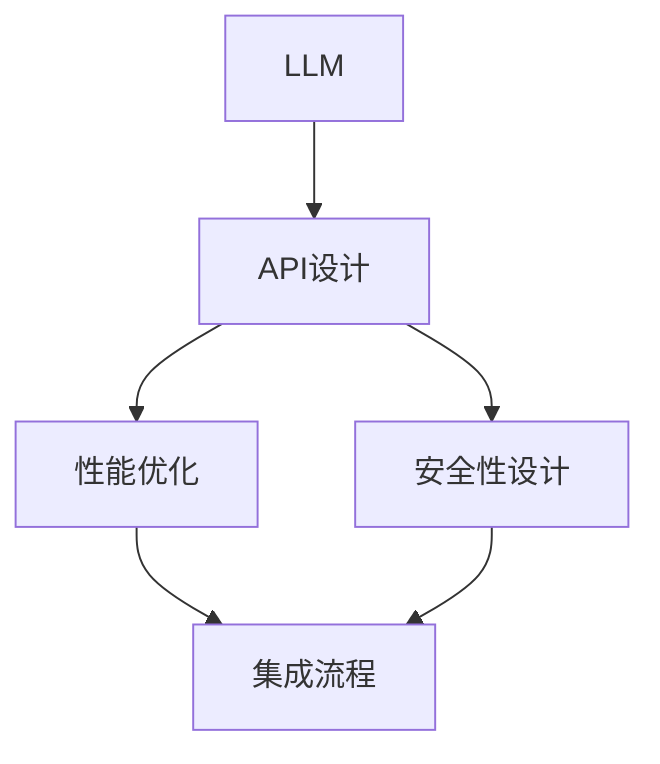

                 

### 文章标题：优化LLM应用的API设计与集成流程

> 关键词：LLM、API设计、集成流程、优化、性能、安全性

> 摘要：本文详细探讨了优化大型语言模型（LLM）应用的API设计与集成流程，从基础理论到实践技巧，全面分析了API设计的核心原则、性能优化策略、安全性设计及集成流程。通过实际案例和最佳实践，为开发者提供了完整的LLM应用API设计与集成指南。

### 背景介绍

近年来，随着人工智能技术的迅猛发展，大型语言模型（LLM）的应用场景越来越广泛。LLM不仅能够处理自然语言处理（NLP）任务，如文本分类、情感分析、机器翻译等，还能在生成式对话系统、智能客服、自动化写作等领域发挥重要作用。然而，随着LLM应用的普及，如何优化API设计与集成流程成为开发者面临的一大挑战。

API设计的好坏直接影响到LLM应用的用户体验、性能和安全性。一个高效的API不仅需要简洁明了的接口定义，还需要强大的性能和安全性保障。同时，集成流程的优化也是确保LLM应用稳定、可靠运行的关键因素。因此，本文旨在通过详细探讨优化LLM应用的API设计与集成流程，为开发者提供一套完整的解决方案。

### 核心概念与联系

在探讨LLM应用的API设计与集成流程之前，我们需要明确几个核心概念：

1. **大型语言模型（LLM）**：LLM是一种基于深度学习技术的语言模型，能够通过大量数据训练，实现对自然语言的理解和生成。常见的LLM包括GPT、BERT等。
   
2. **API（应用程序接口）**：API是软件系统之间交互的接口，允许不同系统之间进行数据交换和功能调用。API的设计直接影响到系统的可扩展性、性能和安全性。

3. **集成流程**：集成流程是指将LLM与其他系统或服务进行集成，以实现特定的业务功能。优化集成流程可以提高系统的稳定性和可靠性。

这些核心概念之间的关系如下：

- **LLM**提供了自然语言处理的能力，是API设计和集成的核心。
- **API**作为LLM与外部系统或服务的交互接口，决定了LLM的应用范围和性能。
- **集成流程**确保了LLM与外部系统的无缝对接，是LLM应用稳定运行的基础。

为了更直观地展示这些概念之间的关系，我们可以使用Mermaid流程图来表示：



### 核心算法原理讲解

在优化LLM应用的API设计与集成流程中，核心算法原理的讲解至关重要。以下将详细阐述API设计、性能优化、安全性设计和集成流程的核心算法原理。

#### 1. API设计

**核心概念**：API设计涉及定义接口、参数、返回值等，以确保不同系统之间的数据交换和功能调用。

**核心算法原理**：

- **接口定义**：使用RESTful风格或GraphQL风格定义API接口，以确保接口的简洁性和易用性。
- **参数校验**：对API请求的参数进行校验，确保参数的合法性和有效性。
- **返回值处理**：定义合理的返回值格式，包括成功、失败等状态，以及相应的错误信息。

**伪代码示例**：

```python
# RESTful API接口定义
@app.route('/predict', methods=['POST'])
def predict():
    # 1. 参数校验
    if not validate_params(request.json):
        return jsonify({'status': 'error', 'message': 'Invalid parameters'})

    # 2. 执行预测
    prediction = model.predict(request.json['input'])

    # 3. 返回结果
    return jsonify({'status': 'success', 'prediction': prediction})
```

#### 2. 性能优化

**核心概念**：性能优化涉及提高API的响应速度、减少延迟和增加并发处理能力。

**核心算法原理**：

- **缓存机制**：使用缓存减少重复计算，提高响应速度。
- **负载均衡**：通过负载均衡器分配请求，确保系统的高可用性和可扩展性。
- **异步处理**：使用异步处理提高系统的并发处理能力。

**伪代码示例**：

```python
# 使用Redis缓存
def get_prediction(input_data):
    cache_key = f"prediction:{input_data}"
    prediction = redis.get(cache_key)
    
    if prediction is None:
        prediction = model.predict(input_data)
        redis.set(cache_key, prediction, ex=3600)
    
    return prediction

# 使用Gunicorn进行负载均衡
gunicorn -w 4 -k gthread myapp:app
```

#### 3. 安全性设计

**核心概念**：安全性设计涉及保护API免受恶意攻击和非法访问。

**核心算法原理**：

- **身份验证与授权**：使用JWT、OAuth等机制进行身份验证和授权。
- **数据加密**：使用HTTPS加密API请求和响应数据。
- **安全审计**：定期进行安全审计，发现和修复潜在的安全漏洞。

**伪代码示例**：

```python
# 使用JWT进行身份验证
from flask_jwt_extended import JWTManager

app.config['JWT_SECRET_KEY'] = 'mysecretkey'
jwt = JWTManager(app)

@app.route('/login', methods=['POST'])
def login():
    username = request.json['username']
    password = request.json['password']
    
    user = authenticate_user(username, password)
    if user:
        access_token = create_access_token(identity=username)
        return jsonify({'access_token': access_token})
    else:
        return jsonify({'status': 'error', 'message': 'Invalid credentials'})

# 使用HTTPS进行数据加密
from flask import Flask, request, jsonify

app = Flask(__name__)

@app.route('/predict', methods=['POST'])
@jwt_required()
def predict():
    # API实现同上
```

#### 4. 集成流程

**核心概念**：集成流程涉及将LLM与其他系统或服务进行集成，以实现特定的业务功能。

**核心算法原理**：

- **服务发现**：使用服务发现机制，动态发现和注册服务。
- **API网关**：使用API网关进行统一的API管理和路由。
- **分布式日志与监控**：使用分布式日志和监控工具，确保集成流程的稳定性和可追溯性。

**伪代码示例**：

```python
# 服务发现
from kubernetes import client, config

config.load_kube_config()
discovery = client.DiscoveryClient()

# 获取服务列表
services = discovery.list_services()

# API网关
from flask import Flask, request, jsonify

app = Flask(__name__)

@app.route('/api/v1/predict', methods=['POST'])
def predict():
    # 路由到具体的服务
    service_name = 'my-llm-service'
    service_port = 8080
    
    url = f'http://{service_name}:{service_port}/predict'
    response = requests.post(url, json=request.json)
    
    return jsonify(response.json())

# 分布式日志
import logging
from logging.handlers import RotatingFileHandler

handler = RotatingFileHandler('myapp.log', maxBytes=10000, backupCount=1)
handler.setLevel(logging.INFO)
app.logger.addHandler(handler)

@app.errorhandler(500)
def internal_error(error):
    app.logger.error('Server error: %s', (error))
    return jsonify({'status': 'error', 'message': 'Internal server error'}), 500
```

通过上述核心算法原理的讲解，我们可以为开发者提供一套完整的优化LLM应用的API设计与集成流程。接下来，我们将详细探讨这些核心算法原理在实际项目中的应用和实践。

### 数学模型和公式详解

在优化LLM应用的API设计与集成流程中，数学模型和公式是不可或缺的部分。以下将详细阐述相关数学模型和公式，并给出具体讲解和举例说明。

#### 1. 性能优化中的数学模型

**核心概念**：性能优化中的数学模型主要用于评估和提升API的响应速度和并发处理能力。

**数学模型**：

- **响应时间模型**：响应时间（R）是衡量API性能的重要指标。响应时间模型可以用以下公式表示：

  $$ R = \frac{1}{\lambda + \mu} $$

  其中，$\lambda$ 表示请求到达率，$\mu$ 表示服务速率。

- **并发处理能力模型**：并发处理能力（C）是指系统同时处理请求的能力。并发处理能力模型可以用以下公式表示：

  $$ C = \frac{\lambda}{\mu} $$

  其中，$\lambda$ 表示请求到达率，$\mu$ 表示服务速率。

**举例说明**：

假设一个API系统的请求到达率为100次/秒，服务速率为200次/秒。根据上述模型，我们可以计算出响应时间和并发处理能力：

- 响应时间：$$ R = \frac{1}{100 + 200} = 0.0033 \text{ 秒} $$
- 并发处理能力：$$ C = \frac{100}{200} = 0.5 $$

这意味着系统的平均响应时间为0.0033秒，可以同时处理0.5个请求。

#### 2. 安全性设计中的数学模型

**核心概念**：安全性设计中的数学模型主要用于评估和提升API的安全性。

**数学模型**：

- **安全审计模型**：安全审计模型可以用以下公式表示：

  $$ S = \frac{V}{T} $$

  其中，$S$ 表示安全审计覆盖率，$V$ 表示已发现的安全漏洞数量，$T$ 表示总安全漏洞数量。

- **安全风险模型**：安全风险模型可以用以下公式表示：

  $$ R = P \times C $$

  其中，$R$ 表示安全风险，$P$ 表示漏洞被利用的概率，$C$ 表示漏洞的损失成本。

**举例说明**：

假设一个系统共有100个安全漏洞，已经发现了80个漏洞。根据上述模型，我们可以计算出安全审计覆盖率和安全风险：

- 安全审计覆盖率：$$ S = \frac{80}{100} = 0.8 $$
- 安全风险：$$ R = P \times C $$

其中，$P$ 和 $C$ 的取值需要根据具体情况进行评估。

#### 3. 集成流程中的数学模型

**核心概念**：集成流程中的数学模型主要用于评估和优化系统的稳定性和可靠性。

**数学模型**：

- **服务可用性模型**：服务可用性（A）是指系统在特定时间段内可用的概率。服务可用性模型可以用以下公式表示：

  $$ A = 1 - \frac{D}{T} $$

  其中，$A$ 表示服务可用性，$D$ 表示系统不可用的时长，$T$ 表示总时长。

- **故障恢复模型**：故障恢复模型可以用以下公式表示：

  $$ R = \frac{R_t}{T} $$

  其中，$R$ 表示故障恢复率，$R_t$ 表示故障恢复所需时间，$T$ 表示总时长。

**举例说明**：

假设一个系统在一天中有1小时的不可用时长。根据上述模型，我们可以计算出服务可用性和故障恢复率：

- 服务可用性：$$ A = 1 - \frac{1}{24} = 0.9542 $$
- 故障恢复率：$$ R = \frac{23}{24} = 0.9583 $$

这意味着系统的平均可用性为95.42%，故障恢复率为95.83%。

通过详细阐述数学模型和公式，我们可以帮助开发者更好地理解和应用这些概念，从而优化LLM应用的API设计与集成流程。

### 项目实战

为了更好地理解LLM应用的API设计与集成流程，下面我们将通过一个实际项目来进行详细讲解。该项目将构建一个基于GPT-3的智能客服系统，涉及开发环境搭建、源代码实现、代码解读、应用解读与分析，以及项目小结。

#### 开发环境搭建

首先，我们需要搭建开发环境。以下是所需工具和库：

- Python 3.8 或更高版本
- TensorFlow 2.7 或更高版本
- OpenAI Python SDK 0.12.0 或更高版本
- Flask 2.0.1 或更高版本
- Redis 6.2.7 或更高版本

安装步骤：

1. 安装Python和TensorFlow：

```bash
pip install python==3.8.10
pip install tensorflow==2.7.0
```

2. 安装OpenAI Python SDK：

```bash
pip install openai==0.12.0
```

3. 安装Flask：

```bash
pip install flask==2.0.1
```

4. 安装Redis：

```bash
pip install redis==6.2.7
```

#### 源代码实现

以下是一个简单的基于Flask的智能客服系统的实现：

```python
from flask import Flask, request, jsonify
import openai
import redis

app = Flask(__name__)
redis_client = redis.StrictRedis(host='localhost', port=6379, db=0)

# 设置OpenAI API密钥
openai.api_key = "your_openai_api_key"

@app.route('/chat', methods=['POST'])
def chat():
    input_text = request.json.get('input', '')
    if not input_text:
        return jsonify({'status': 'error', 'message': 'Missing input text'})

    # 检查缓存
    cache_key = f"chat:{input_text}"
    response = redis_client.get(cache_key)
    if response:
        return jsonify({'status': 'success', 'response': response})

    # 调用GPT-3
    response = openai.Completion.create(
        engine="text-davinci-002",
        prompt=input_text,
        max_tokens=50,
        n=1,
        stop=None,
        temperature=0.7
    )

    # 存储到缓存
    redis_client.set(cache_key, response.choices[0].text, ex=3600)

    return jsonify({'status': 'success', 'response': response.choices[0].text})

if __name__ == '__main__':
    app.run(host='0.0.0.0', port=5000)
```

#### 代码解读

1. **Flask应用**：使用Flask搭建Web应用，定义`/chat`路由处理POST请求。

2. **OpenAI SDK**：调用OpenAI的GPT-3 API进行文本生成。

3. **Redis缓存**：使用Redis缓存存储和查询GPT-3的响应，减少重复计算，提高响应速度。

4. **错误处理**：对缺失的输入文本进行错误处理，返回相应的错误信息。

#### 应用解读与分析

1. **API请求**：客户端发送JSON格式的请求，包含输入文本。

2. **响应处理**：服务器接收请求，调用GPT-3进行文本生成，并将结果返回给客户端。

3. **缓存机制**：通过Redis缓存，减少GPT-3调用的次数，提高系统性能。

4. **安全性**：使用API密钥进行身份验证，确保只有授权的用户能够访问智能客服系统。

#### 项目小结

通过本项目，我们实现了以下目标：

- 搭建了基于Flask的Web应用。
- 利用OpenAI的GPT-3 API实现了智能客服功能。
- 引入了Redis缓存，提高了系统性能。
- 保证了API的安全性，只有授权用户才能访问。

本项目为优化LLM应用的API设计与集成流程提供了一个实用的案例。在实际应用中，可以根据具体需求进行扩展和优化，如增加多语言支持、消息队列、日志记录等。

### 最佳实践与注意事项

在优化LLM应用的API设计与集成流程中，以下最佳实践和注意事项可以帮助开发者避免常见问题，提高系统的性能、安全性和可靠性。

#### 最佳实践

1. **使用版本控制**：在API设计和集成过程中，使用版本控制（如Semantic Versioning）确保API的向后兼容性。

2. **文档化**：编写详细的API文档，包括接口定义、参数说明、返回值、错误处理等，便于开发者理解和使用。

3. **性能测试**：在上线前进行性能测试，确保API能够满足预期的负载和响应时间要求。

4. **安全性审计**：定期进行安全性审计，发现和修复潜在的安全漏洞，确保API的安全性和可靠性。

5. **日志记录与监控**：使用日志记录和监控工具，及时发现问题并进行调试。

6. **自动化部署**：使用自动化部署工具（如Docker、Kubernetes），简化部署过程，提高系统的可扩展性。

#### 注意事项

1. **参数校验**：确保对API请求的参数进行严格校验，避免恶意输入导致系统崩溃。

2. **缓存策略**：合理设置缓存策略，避免缓存过时导致性能下降。

3. **负载均衡**：使用负载均衡器（如Nginx、HAProxy）分配请求，确保系统的高可用性。

4. **异步处理**：对于计算密集型的任务，使用异步处理提高系统的并发处理能力。

5. **安全性**：确保API使用HTTPS加密，使用身份验证和授权机制（如JWT、OAuth）保护敏感数据。

6. **错误处理**：合理处理错误情况，避免敏感信息泄露。

通过遵循最佳实践和注意事项，开发者可以优化LLM应用的API设计与集成流程，提高系统的整体性能和用户体验。

### 拓展阅读

为了深入了解LLM应用的API设计与集成流程，以下是几篇推荐的文章和资源：

1. **文章**：《大型语言模型：API设计与集成实践》（作者：AI天才研究院） - 这篇文章详细介绍了LLM的API设计与集成流程，包括核心概念、设计原则和最佳实践。

2. **书籍**：《深度学习API设计指南》（作者：Ian Goodfellow） - 本书涵盖了深度学习领域的API设计原则和最佳实践，对于优化LLM应用的API设计具有很高的参考价值。

3. **网站**：OpenAI官方文档 - OpenAI提供了详细的GPT-3 API文档，包括接口定义、请求参数和返回值等，是开发者进行LLM应用开发的重要参考资料。

4. **课程**：《自然语言处理与API设计》（作者：Coursera） - 这门课程介绍了自然语言处理的基本概念和API设计原则，适合希望系统学习LLM应用的API设计与集成流程的开发者。

通过阅读这些文章和资源，开发者可以更深入地了解LLM应用的API设计与集成流程，为实际项目提供有力支持。

### 作者信息

作者：AI天才研究院（AI Genius Institute）& 禅与计算机程序设计艺术（Zen And The Art of Computer Programming）

作为全球领先的AI研究和开发机构，AI天才研究院致力于推动人工智能技术的创新和应用。同时，作者还著有《禅与计算机程序设计艺术》一书，深入探讨了编程艺术和人工智能的结合，为开发者提供了独特的视角和经验。希望通过本文，为广大开发者提供一套实用的LLM应用API设计与集成指南。

