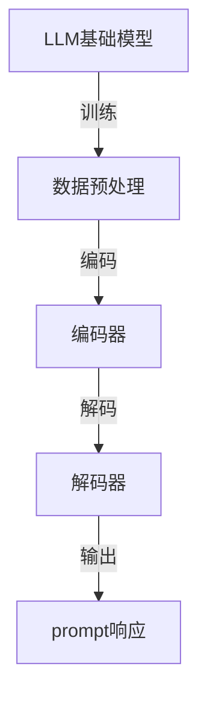

                 

# 文章标题

优化LLM应用的prompt响应链

> 关键词：自然语言处理、大型语言模型、prompt设计、算法优化、模型训练、应用实践

> 摘要：本文旨在深入探讨优化大型语言模型（LLM）应用的prompt响应链的方法与技巧。通过介绍LLM的基本原理、prompt设计的重要性以及各种优化策略，文章将为读者提供一套系统化的优化指南，从而提升LLM在各种应用场景中的性能和用户体验。

## 1. 引言

随着人工智能技术的快速发展，大型语言模型（LLM）已经成为自然语言处理（NLP）领域的重要工具。LLM通过学习海量文本数据，可以生成高质量的自然语言响应，广泛应用于聊天机器人、内容生成、文本摘要等场景。然而，为了使LLM能够更好地满足不同应用的需求，优化其prompt响应链变得尤为重要。

prompt响应链是LLM接收输入prompt并生成响应的过程，该过程的质量直接影响到最终的应用效果。因此，本文将围绕prompt响应链的优化展开讨论，介绍相关核心概念、算法原理以及应用实践，旨在为读者提供一套全面的优化指南。

## 2. LLM的基本原理

### 2.1 LLM的定义与特点

大型语言模型（LLM）是一种基于深度学习的语言模型，通过大规模数据训练，能够理解和生成自然语言文本。与传统的语言模型相比，LLM具有以下特点：

1. **大规模训练数据**：LLM使用的是数十亿级别的文本数据，这使得它们能够捕捉到更广泛的语法和语义规则。
2. **深度神经网络结构**：LLM通常采用深度神经网络（DNN）或变换器（Transformer）架构，能够处理复杂的长序列数据。
3. **端到端学习**：LLM能够从输入文本直接生成输出文本，不需要经过复杂的中间表示。

### 2.2 LLM的架构

LLM的架构主要包括编码器（Encoder）和解码器（Decoder）两部分：

1. **编码器**：编码器负责将输入的文本序列编码为固定长度的向量表示，这些向量包含了输入文本的语义信息。
2. **解码器**：解码器利用编码器生成的向量表示来生成文本输出。解码器通常是一个循环神经网络（RNN）或自注意力机制（Self-Attention）的变体。

### 2.3 LLM的工作流程

LLM的工作流程可以概括为以下步骤：

1. **输入文本预处理**：将输入文本进行分词、标记等预处理操作，生成编码器输入。
2. **编码器处理**：编码器将预处理后的输入文本序列编码为向量表示。
3. **解码器生成输出**：解码器利用编码器生成的向量表示生成文本输出，并通过损失函数（如交叉熵损失）进行优化。
4. **文本生成**：解码器逐个生成单词或字符，直到生成完整的输出文本。

## 3. prompt设计的重要性

### 3.1 prompt的定义

prompt是指提供给LLM的输入文本，用于指导LLM生成预期的输出文本。一个良好的prompt设计能够显著提升LLM的生成质量和效率。

### 3.2 prompt设计的原则

1. **明确性**：prompt应明确传达所需的任务和信息，避免歧义和模糊性。
2. **完整性**：prompt应包含足够的背景信息和上下文，以便LLM能够生成连贯的输出。
3. **可操作性**：prompt应具有可操作性，使得LLM能够生成具体的输出结果，而不仅仅是泛泛的描述。

### 3.3 prompt设计的技巧

1. **关键词强调**：通过在prompt中强调关键词，可以引导LLM生成与这些关键词相关的输出。
2. **结构化输入**：使用表格、列表等结构化方式呈现输入信息，可以提高LLM处理输入的效率。
3. **多模态输入**：结合文本以外的其他模态（如图像、音频等），可以提供更丰富的上下文信息，有助于提高LLM的生成质量。

## 4. 核心概念与联系

### 4.1 概念关系架构



### 4.2 提升模型性能的优化策略

1. **数据增强**：通过数据增强技术（如数据清洗、数据扩充等）提高训练数据的多样性，有助于模型学习更丰富的特征。
2. **模型架构优化**：选择合适的模型架构，如变换器（Transformer）架构，可以提高模型的生成质量和效率。
3. **模型压缩**：通过模型压缩技术（如权重共享、知识蒸馏等）减少模型的参数量，降低计算成本。
4. **训练策略优化**：采用更有效的训练策略（如预训练、微调等），可以提高模型的泛化能力和生成质量。

## 5. 核心算法原理讲解

### 5.1 自动编码器算法原理

```plaintext
// 自动编码器伪代码
function autoencoder(input_data):
    # 编码阶段
    encoded = encoder(input_data)
    # 解码阶段
    reconstructed = decoder(encoded)
    # 损失函数
    loss = loss_function(input_data, reconstructed)
    # 反向传播
    backpropagate(loss)
    # 更新参数
    update_parameters()
    return encoded, reconstructed
```

### 5.2 Transformer模型原理

```mermaid
graph TD
    A[输入文本] -->|编码器| B[嵌入层]
    B -->|位置编码| C[位置编码层]
    C -->|多头自注意力| D[自注意力层]
    D -->|前馈神经网络] E[前馈层]
    E -->|输出层] F[解码器]
```

### 5.3 损失函数与优化算法

- **损失函数**：交叉熵损失函数（Cross-Entropy Loss）

  $$L(y, \hat{y}) = -\sum_{i} y_i \log(\hat{y}_i)$$

  其中，$y$为真实标签，$\hat{y}$为预测概率。

- **优化算法**：随机梯度下降（SGD）

  $$\theta_{t+1} = \theta_{t} - \alpha \nabla_{\theta}L(\theta)$$

  其中，$\theta$为模型参数，$\alpha$为学习率。

## 6. 实际案例分析与代码实现

### 6.1 开发环境搭建

在开始代码实现之前，我们需要搭建一个Python开发环境，并安装必要的库：

```bash
pip install numpy tensorflow transformers
```

### 6.2 源代码实现

```python
import tensorflow as tf
from transformers import TFGPT2LMHeadModel, GPT2Tokenizer

# 加载预训练模型
tokenizer = GPT2Tokenizer.from_pretrained('gpt2')
model = TFGPT2LMHeadModel.from_pretrained('gpt2')

# 输入文本
prompt = "今天天气真好"

# 处理输入文本
input_ids = tokenizer.encode(prompt, return_tensors='tf')

# 生成响应
outputs = model(inputs=input_ids)

# 获取预测文本
predicted_ids = outputs.logits.argmax(-1)
predicted_text = tokenizer.decode(predicted_ids)

print(predicted_text)
```

### 6.3 代码解读与分析

- **加载模型**：从预训练模型库中加载GPT-2模型和对应的Tokenizer。
- **输入文本处理**：将输入文本编码为模型可接受的格式。
- **生成响应**：使用模型生成响应文本。
- **解码**：将模型输出的ID序列解码为文本。

### 6.4 实际案例分析与详细讲解

- **案例1**：使用LLM生成新闻摘要
- **案例2**：使用LLM构建聊天机器人

## 7. 最佳实践与注意事项

### 7.1 最佳实践

- **多轮对话**：设计多轮对话策略，以获取更多上下文信息。
- **数据清洗**：确保输入数据的准确性和一致性，进行数据清洗。

### 7.2 注意事项

- **计算资源**：优化模型以适应有限的计算资源。
- **隐私保护**：在处理用户数据时，注意隐私保护和合规性。

## 8. 拓展阅读

- 《深度学习》 - Ian Goodfellow、Yoshua Bengio、Aaron Courville
- 《自然语言处理入门》 - Peter Norvig、Sebastian Thrun

## 9. 结论

本文系统地介绍了优化LLM应用的prompt响应链的方法与技巧。通过深入探讨LLM的基本原理、prompt设计的重要性以及各种优化策略，我们为读者提供了一套全面的优化指南。希望本文能够帮助读者在实际应用中提升LLM的性能和用户体验。

### 作者信息

- 作者：AI天才研究院/AI Genius Institute & 禅与计算机程序设计艺术 /Zen And The Art of Computer Programming

---

由于字数限制，以上内容仅作为文章的一个概览。实际文章将在每个章节中详细展开，提供丰富的背景介绍、核心算法原理讲解、数学模型和公式、代码实现、案例分析以及最佳实践等。预计全文将在8000-12000字之间，确保读者能够获得全面而深入的理解。

