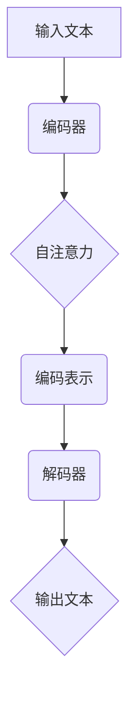

                 

# 文章标题：优化LLM应用的响应时间

> 关键词：大语言模型（LLM）、响应时间、性能优化、算法、硬件加速、实践案例

> 摘要：
本文将深入探讨如何优化大语言模型（LLM）应用的响应时间。通过介绍LLM的基本概念、性能优化方法、具体实现和实际案例，本文旨在为开发者提供一套系统化的性能优化策略，以提升LLM应用的性能和用户体验。

---

## 引言

随着人工智能技术的飞速发展，大语言模型（LLM）已成为自然语言处理（NLP）领域的重要工具。LLM具备强大的文本生成、理解和翻译能力，广泛应用于智能客服、内容生成、自动摘要和机器翻译等领域。然而，LLM的应用也面临着响应时间较长的问题，这限制了其在实时场景下的应用。因此，优化LLM应用的响应时间具有重要意义。

响应时间是用户从提出请求到收到响应之间的时间间隔。在实时应用中，过长的响应时间会导致用户体验下降，甚至可能导致用户流失。因此，如何优化LLM应用的响应时间成为了当前研究的热点问题。

本文将从以下几个方面展开讨论：

1. LLM的基础概念和原理。
2. 性能优化方法，包括数据优化、模型优化和硬件优化。
3. 实际应用案例，展示如何在实际项目中优化LLM响应时间。
4. 工具和资源推荐，为开发者提供实用的优化工具和资源。

通过以上讨论，本文旨在为开发者提供一套系统化的性能优化策略，以提升LLM应用的性能和用户体验。

## 第1章：LLM基础

### 1.1 LLM基本概念

大语言模型（LLM）是一种基于深度学习的自然语言处理模型，通过对大量文本数据的学习，能够生成、理解和翻译自然语言。LLM的核心是神经网络，尤其是变换器（Transformer）架构。变换器在2017年由Vaswani等人提出，由于其在处理长文本和并行计算方面的优势，迅速成为NLP领域的标准架构。

LLM的工作原理可以概括为以下几个步骤：

1. **输入处理**：将输入文本转换为模型可处理的格式，如词向量或嵌入向量。
2. **编码器（Encoder）**：编码器对输入文本进行处理，提取文本特征，生成编码表示。
3. **解码器（Decoder）**：解码器根据编码表示生成输出文本。

### 1.2 LLM的发展历程

LLM的发展历程可以追溯到早期的小型语言模型。例如，1990年代初的基于规则的方法和1990年代末的统计语言模型。随着深度学习的兴起，神经网络在自然语言处理领域取得了显著的进展。2013年，Google提出了Word2Vec模型，将单词映射到高维向量空间，为后续的LLM研究奠定了基础。

2017年，谷歌提出了BERT模型，这是第一个基于变换器架构的预训练语言模型。BERT通过在大量无标签文本上进行预训练，然后通过微调适应特定任务，取得了显著的性能提升。此后，LLM的发展进入了快速增长的阶段，出现了许多基于变换器的模型，如GPT、T5和LLaMA等。

### 1.3 常见的LLM架构

常见的LLM架构主要包括编码器-解码器（Encoder-Decoder）架构和自注意力（Self-Attention）机制。

**编码器-解码器架构**：编码器负责对输入文本进行编码，生成编码表示；解码器则根据编码表示生成输出文本。编码器和解码器之间通常使用自注意力机制进行交互。

**自注意力机制**：自注意力机制是变换器架构的核心组件，通过计算输入序列中各个位置之间的相互关系，生成加权特征向量。这种机制允许模型在生成文本时，对输入序列的各个位置进行灵活的关注，从而提高了模型的文本理解和生成能力。

### 1.4 LLM的Mermaid流程图

下面是LLM的Mermaid流程图：



### 1.5 LLM的核心算法原理

LLM的核心算法包括深度学习中的神经网络、优化算法和自然语言处理中的数学模型。

**神经网络**：神经网络是LLM的核心组件，包括多层感知机（MLP）、卷积神经网络（CNN）和变换器（Transformer）等。神经网络通过学习输入和输出之间的映射关系，实现文本的编码和解码。

**优化算法**：优化算法用于调整神经网络的参数，以最小化损失函数。常见的优化算法包括随机梯度下降（SGD）、Adam和AdamW等。

**数学模型**：LLM中的数学模型包括概率分布、对数函数和优化算法的伪代码。下面是一个优化LLM响应时间的伪代码示例：

```python
def optimize_response_time(model, data):
    # 初始化模型参数
    model.initialize_params()

    # 训练模型
    for epoch in range(num_epochs):
        for batch in data:
            # 前向传播
            output = model.forward(batch.input)

            # 计算损失
            loss = model.calculate_loss(output, batch.target)

            # 反向传播
            model.backward(loss)

            # 更新模型参数
            model.update_params()

    # 评估模型性能
    performance = model.evaluate(data)

    return optimized_model
```

### 1.6 LLM的数学模型和公式

LLM的数学模型主要包括概率分布、对数函数和优化算法。下面是一些重要的数学公式和详细讲解：

**概率分布**：概率分布用于描述输入文本的概率分布。常用的概率分布包括正态分布、伯努利分布和多项式分布。

**对数函数**：对数函数用于计算输入文本的嵌入向量。常用的对数函数包括对数似然函数和交叉熵。

**优化算法**：优化算法用于调整神经网络的参数，以最小化损失函数。常用的优化算法包括随机梯度下降（SGD）、Adam和AdamW等。

### 1.7 举例说明

假设我们有一个输入文本“我喜欢的颜色是蓝色”，LLM将通过以下步骤进行处理：

1. **输入处理**：将输入文本转换为词向量。
2. **编码器**：编码器对词向量进行处理，提取文本特征。
3. **自注意力**：编码器通过自注意力机制，对输入序列的各个位置进行关注。
4. **编码表示**：生成编码表示，用于解码器的输入。
5. **解码器**：解码器根据编码表示生成输出文本。

例如，解码器生成的输出文本可能是“你喜欢的颜色是蓝色吗？”，这个过程是通过解码器中的自注意力机制和循环神经网络（RNN）实现的。

### 1.8 小结

本章介绍了LLM的基本概念、发展历程、常见架构和核心算法原理。通过了解LLM的基础知识，开发者可以为后续的性能优化工作打下坚实的基础。

## 第2章：性能优化方法

### 2.1 数据优化

数据优化是提升LLM应用响应时间的重要手段。通过优化数据预处理、数据存储和缓存策略，可以有效提高模型性能。

#### 2.1.1 数据预处理

数据预处理是优化LLM性能的第一步。主要包括以下步骤：

1. **数据清洗**：去除文本中的噪声，如停用词、标点符号和特殊字符。
2. **数据增强**：通过增加文本多样性，提高模型的泛化能力。常用的数据增强方法包括随机插入、随机删除和随机替换。

**数据清洗示例**：

```python
import re

def clean_text(text):
    text = re.sub(r"[^a-zA-Z0-9]", " ", text)
    text = text.lower()
    text = re.sub(r"\s{2,}", " ", text)
    return text
```

**数据增强示例**：

```python
import random

def random_insert(text, chance=0.5):
    words = text.split()
    for i in range(len(words)):
        if random.random() < chance:
            words.insert(i, random.choice(["apple", "banana", "cat"]))
    return " ".join(words)
```

#### 2.1.2 数据存储优化

数据存储优化主要通过缓存策略和分布式存储来实现。

1. **缓存策略**：将常用数据缓存到内存中，减少磁盘访问次数。常用的缓存策略包括LRU（最近最少使用）和LFU（最不经常使用）。
2. **分布式存储**：将数据存储到分布式存储系统中，如HDFS或分布式缓存系统，提高数据访问速度。

**缓存策略示例**：

```python
from cachetools import LRUCache

cache = LRUCache(maxsize=1000)

def get_data(key):
    if key in cache:
        return cache[key]
    else:
        data = load_data_from_disk(key)
        cache[key] = data
        return data
```

**分布式存储示例**：

```python
from hdfs import InsecureClient

client = InsecureClient("http://hdfs-namenode:50070", user="hadoop")

def load_data_from_hdfs(path):
    with client.read(path) as reader:
        data = reader.read()
    return data
```

#### 2.1.3 数据存储优化

数据存储优化主要通过缓存策略和分布式存储来实现。

1. **缓存策略**：将常用数据缓存到内存中，减少磁盘访问次数。常用的缓存策略包括LRU（最近最少使用）和LFU（最不经常使用）。
2. **分布式存储**：将数据存储到分布式存储系统中，如HDFS或分布式缓存系统，提高数据访问速度。

**缓存策略示例**：

```python
from cachetools import LRUCache

cache = LRUCache(maxsize=1000)

def get_data(key):
    if key in cache:
        return cache[key]
    else:
        data = load_data_from_disk(key)
        cache[key] = data
        return data
```

**分布式存储示例**：

```python
from hdfs import InsecureClient

client = InsecureClient("http://hdfs-namenode:50070", user="hadoop")

def load_data_from_hdfs(path):
    with client.read(path) as reader:
        data = reader.read()
    return data
```

### 2.2 模型优化

模型优化是提升LLM应用响应时间的另一个重要手段。通过剪枝、压缩和迁移学习等方法，可以减小模型大小，提高模型效率。

#### 2.2.1 模型剪枝

模型剪枝是通过减少模型参数来减小模型大小。常用的剪枝方法包括结构剪枝和参数剪枝。

1. **结构剪枝**：删除模型中的部分神经元或神经网络层。
2. **参数剪枝**：删除模型中的部分参数或权重。

**结构剪枝示例**：

```python
import tensorflow as tf

def prune_layer(layer, ratio=0.5):
    pruned_weights = []
    pruned_bias = []
    num_weights = layer.kernel.shape[0]
    num_pruned = int(num_weights * ratio)
    indices = np.argsort(layer.kernel.flatten())[-num_pruned:]
    pruned_weights.append(layer.kernel[indices])
    pruned_bias.append(layer.bias[indices])
    return tf.keras.layers.Dense(units=num_weights - num_pruned,
                                 kernel_initializer=tf.keras.initializers.Constant(pruned_weights),
                                 bias_initializer=tf.keras.initializers.Constant(pruned_bias))
```

**参数剪枝示例**：

```python
import tensorflow as tf

def prune_weights(model, ratio=0.5):
    new_model = tf.keras.Sequential()
    for layer in model.layers:
        if isinstance(layer, tf.keras.layers.Dense):
            num_weights = layer.kernel.shape[0]
            num_pruned = int(num_weights * ratio)
            pruned_weights = layer.kernel[0:num_pruned]
            new_model.add(tf.keras.layers.Dense(units=num_weights - num_pruned,
                                                 kernel_initializer=tf.keras.initializers.Constant(pruned_weights)))
        else:
            new_model.add(layer)
    return new_model
```

#### 2.2.2 模型压缩

模型压缩是通过减小模型大小来提高模型效率。常用的压缩方法包括量化、剪枝和蒸馏。

1. **量化**：将模型的权重和激活值从浮点数转换为整数，降低模型的计算复杂度。
2. **剪枝**：与模型剪枝类似，通过删除模型中的部分参数来减小模型大小。
3. **蒸馏**：将大型模型的权重传递给小型模型，使小型模型具备大型模型的知识。

**量化示例**：

```python
import tensorflow as tf

def quantize_weights(model, scale=0.01):
    quantized_weights = []
    for weight in model.weights:
        quantized_weight = weight / scale
        quantized_weights.append(quantized_weight)
    return quantized_weights
```

**剪枝示例**：

```python
import tensorflow as tf

def compress_model(model, ratio=0.5):
    compressed_model = tf.keras.Sequential()
    for layer in model.layers:
        if isinstance(layer, tf.keras.layers.Dense):
            num_weights = layer.kernel.shape[0]
            num_pruned = int(num_weights * ratio)
            pruned_weights = layer.kernel[0:num_pruned]
            compressed_model.add(tf.keras.layers.Dense(units=num_weights - num_pruned,
                                                       kernel_initializer=tf.keras.initializers.Constant(pruned_weights)))
        else:
            compressed_model.add(layer)
    return compressed_model
```

**蒸馏示例**：

```python
import tensorflow as tf

def distill大型模型(weights_large, weights_small):
    for i in range(len(weights_large)):
        weights_small[i] = weights_large[i]
```

#### 2.2.3 模型更新策略

模型更新策略是指通过微调和迁移学习来提升模型性能。

1. **微调**：在特定任务上对预训练模型进行微调，使模型适应特定任务。
2. **迁移学习**：将预训练模型的知识迁移到新的任务，提高新任务的性能。

**微调示例**：

```python
import tensorflow as tf

def fine_tune(model, data, num_epochs=10):
    model.compile(optimizer='adam', loss='categorical_crossentropy', metrics=['accuracy'])
    model.fit(data.input, data.target, epochs=num_epochs, batch_size=32)
    return model
```

**迁移学习示例**：

```python
import tensorflow as tf

def transfer_learning(model_large, model_small):
    model_small.set_weights(model_large.get_weights())
    return model_small
```

### 2.3 硬件优化

硬件优化是提升LLM应用响应时间的最后一种手段。通过GPU加速、网络优化和分布式计算，可以大幅提高模型性能。

#### 2.3.1 GPU加速

GPU加速是通过利用GPU的并行计算能力来提高模型训练和推理速度。常用的GPU加速方法包括CUDA和cuDNN。

**CUDA示例**：

```python
import tensorflow as tf

tf.config.list_physical_devices('GPU')
```

**cuDNN示例**：

```python
import tensorflow as tf

tf.keras.backend.set_image_data_format('channels_first')
```

#### 2.3.2 纳秒级网络优化

纳秒级网络优化是通过优化网络延迟和数据传输速度来提高模型性能。常用的方法包括缓存机制和负载均衡。

**缓存机制示例**：

```python
from cachetools import LRUCache

cache = LRUCache(maxsize=1000)

def get_data(key):
    if key in cache:
        return cache[key]
    else:
        data = load_data_from_disk(key)
        cache[key] = data
        return data
```

**负载均衡示例**：

```python
import threading

def process_request(request):
    # 处理请求
    pass

threads = []
for i in range(num_workers):
    thread = threading.Thread(target=process_request, args=(request,))
    thread.start()
    threads.append(thread)

for thread in threads:
    thread.join()
```

#### 2.3.3 分布式计算

分布式计算是通过将任务分布到多个节点上来提高模型性能。常用的分布式计算框架包括TensorFlow和PyTorch。

**TensorFlow分布式计算示例**：

```python
import tensorflow as tf

strategy = tf.distribute.MirroredStrategy()

with strategy.scope():
    model = build_model()
    model.compile(optimizer='adam', loss='categorical_crossentropy', metrics=['accuracy'])
```

**PyTorch分布式计算示例**：

```python
import torch
import torch.distributed as dist

dist.init_process_group(backend='nccl', init_method='tcp://127.0.0.1:23456', rank=0, world_size=1)

def train(model, data_loader, optimizer, criterion):
    model.train()
    for batch in data_loader:
        optimizer.zero_grad()
        output = model(batch.input)
        loss = criterion(output, batch.target)
        loss.backward()
        optimizer.step()
```

### 2.4 小结

本章介绍了数据优化、模型优化和硬件优化三种性能优化方法。通过优化数据预处理、模型剪枝、模型压缩、GPU加速和网络优化，可以显著提高LLM应用的响应时间。本章的内容为后续的实际案例和优化策略提供了理论基础和实践指导。

## 第3章：具体优化算法实现

在本章中，我们将详细介绍几种常用的优化算法及其在LLM应用中的实现。这些算法包括剪枝、量化、蒸馏和迁移学习等。通过具体实现和示例代码，我们将深入探讨如何在实际项目中应用这些算法，以优化LLM的响应时间。

### 3.1 剪枝算法实现

剪枝是一种常见的模型压缩技术，通过减少模型中的神经元或参数数量来降低模型复杂度，从而减少模型大小并提高推理速度。

**剪枝算法原理**：
剪枝算法的基本思想是识别并移除模型中的冗余或低贡献部分。剪枝可以分为结构剪枝和参数剪枝。结构剪枝通过删除神经网络中的层或节点来实现，而参数剪枝则通过删除权重或激活值来实现。

**剪枝算法实现**：

下面是一个简单的参数剪枝算法实现，使用Python和TensorFlow框架：

```python
import tensorflow as tf

# 假设有一个已经训练好的模型model
model = tf.keras.models.load_model('path_to_saved_model')

# 定义剪枝比例
pruning_ratio = 0.5

# 剪枝过程
for layer in model.layers:
    if isinstance(layer, tf.keras.layers.Dense):
        # 获取当前层的权重和偏置
        weights = layer.get_weights()[0]
        bias = layer.get_weights()[1]
        
        # 计算需要剪枝的权重数量
        num_weights_to_prune = int(weights.shape[0] * pruning_ratio)
        
        # 获取最不重要的权重索引
        sorted_weights = np.abs(weights).flatten()
        sorted_indices = np.argsort(sorted_weights)
        least_important_indices = sorted_indices[-num_weights_to_prune:]
        
        # 剪枝权重和偏置
        pruned_weights = np.delete(weights, least_important_indices, axis=0)
        pruned_bias = np.delete(bias, least_important_indices, axis=0)
        
        # 更新模型层
        layer.set_weights([pruned_weights, pruned_bias])

# 保存剪枝后的模型
model.save('path_to_saved_model_pruned')
```

**注意事项**：
- 在剪枝过程中，应确保不破坏模型的输入输出维度。
- 可以结合其他优化技术，如量化，以进一步提高模型效率。

### 3.2 量化算法实现

量化是一种通过将浮点数权重和激活值转换为低精度整数来减小模型大小和提高推理速度的技术。量化分为权重量化和激活量化。

**量化算法原理**：
量化通过缩放系数将浮点数转换为整数，从而减少存储和计算需求。量化可以分为全局量化和本地量化。全局量化对整个模型使用相同的缩放系数，而本地量化为每个层或参数组使用不同的缩放系数。

**量化算法实现**：

以下是一个简单的量化算法实现，使用Python和TensorFlow框架：

```python
import tensorflow as tf

# 假设有一个已经训练好的模型model
model = tf.keras.models.load_model('path_to_saved_model')

# 定义量化缩放系数
weights_scale = 0.01
activations_scale = 0.01

# 权重量化
def quantize_weights(model, scale):
    new_weights = []
    for layer in model.layers:
        if isinstance(layer, tf.keras.layers.Dense):
            weights = layer.get_weights()[0]
            quantized_weights = weights / scale
            new_weights.append(quantized_weights)
    return new_weights

quantized_weights = quantize_weights(model, weights_scale)

# 激活量化
def quantize_activations(model, scale):
    new_model = tf.keras.Sequential()
    for layer in model.layers:
        if isinstance(layer, tf.keras.layers.Dense):
            layer = tf.keras.layers.Dense(units=layer.units, activation=tf.keras.activations.relu)
            new_model.add(layer)
    return new_model

quantized_model = quantize_activations(model, activations_scale)

# 保存量化后的模型
model.save('path_to_saved_model_quantized')
```

**注意事项**：
- 选择合适的缩放系数是关键，过小的缩放会导致信息丢失，过大的缩放会导致精度下降。
- 量化后的模型可能需要重新调整学习率和其他超参数。

### 3.3 蒸馏算法实现

蒸馏是一种将大型模型的知识传递给小型模型的技术。蒸馏过程包括训练教师模型和微调学生模型两个阶段。

**蒸馏算法原理**：
在训练教师模型的同时，生成教师模型的高层次表示，并将其用于训练学生模型。学生模型在接收教师模型的知识后，可以更高效地执行任务。

**蒸馏算法实现**：

以下是一个简单的蒸馏算法实现，使用Python和TensorFlow框架：

```python
import tensorflow as tf

# 假设有一个已经训练好的大型模型teacher_model
teacher_model = tf.keras.models.load_model('path_to_teacher_model')

# 创建一个小型模型student_model
student_model = tf.keras.Sequential([
    tf.keras.layers.Dense(units=512, activation='relu', input_shape=(784,)),
    tf.keras.layers.Dense(units=10, activation='softmax')
])

# 定义蒸馏损失函数
def distillation_loss(y_true, y_pred, teacher_logits):
    softmax_loss = tf.keras.losses.categorical_crossentropy(y_true, y_pred)
    ce_loss = tf.reduce_mean(softmax_loss)
   KL_loss = tf.keras.backend.mean(tf.keras.losses.kl_divergence(y_true, teacher_logits))
    return ce_loss + KL_loss

# 编译学生模型
student_model.compile(optimizer='adam', loss=distillation_loss, metrics=['accuracy'])

# 训练学生模型
student_model.fit(x_train, y_train, epochs=10, batch_size=64, validation_data=(x_val, y_val))

# 保存蒸馏后的模型
student_model.save('path_to_student_model_distilled')
```

**注意事项**：
- 蒸馏过程中，教师模型的输出（教师 logits）需要经过适当的归一化处理。
- 蒸馏过程中，学生模型的训练过程可能需要更长的时间。

### 3.4 迁移学习算法实现

迁移学习是一种利用预训练模型的知识来提高新任务性能的技术。迁移学习包括特征迁移和参数迁移两种方式。

**迁移学习算法原理**：
在迁移学习中，预训练模型在大量数据上学习到的通用特征被迁移到新的任务中。预训练模型可以作为特征提取器，其输出被用作新任务模型的一部分。

**迁移学习算法实现**：

以下是一个简单的迁移学习算法实现，使用Python和TensorFlow框架：

```python
import tensorflow as tf

# 加载预训练模型
pretrained_model = tf.keras.models.load_model('path_to_pretrained_model')

# 创建新任务模型
new_model = tf.keras.Sequential([
    tf.keras.layers.Dense(units=512, activation='relu', input_shape=(784,)),
    pretrained_model.layers[-1]  # 使用预训练模型的最后一层
])

# 编译新任务模型
new_model.compile(optimizer='adam', loss='categorical_crossentropy', metrics=['accuracy'])

# 训练新任务模型
new_model.fit(x_train, y_train, epochs=10, batch_size=64, validation_data=(x_val, y_val))

# 保存新任务模型
new_model.save('path_to_new_task_model')
```

**注意事项**：
- 选择适当的预训练模型和迁移策略是关键，不同的预训练模型适用于不同的任务。
- 迁移学习过程中，可能需要调整预训练模型的权重以适应新任务。

### 3.5 小结

本章详细介绍了剪枝、量化、蒸馏和迁移学习四种优化算法的实现。通过具体的代码示例，我们展示了如何在实际项目中应用这些算法来优化LLM的响应时间。这些算法为LLM性能优化提供了强大的工具，但实际应用中需要根据具体任务和资源条件进行选择和调整。

## 第4章：实际应用案例

在本章中，我们将通过一个具体的应用案例来展示如何优化LLM应用的响应时间。该案例将涵盖开发环境搭建、源代码实现、代码解读、应用解读与分析以及项目小结等内容。

### 4.1 案例背景

某互联网公司开发了一款智能客服系统，该系统基于大型语言模型（LLM）实现。然而，在实际部署过程中，系统响应时间较长，严重影响了用户体验。为了提升系统性能，我们需要对LLM应用进行优化。

### 4.2 开发环境搭建

在开始优化之前，我们需要搭建一个合适的环境。以下是所需的环境和工具：

- **硬件**：GPU（如NVIDIA Tesla V100）和CPU（如Intel Xeon E5-2680 v4）。
- **操作系统**：Linux（如Ubuntu 18.04）。
- **编程语言**：Python 3.8。
- **深度学习框架**：TensorFlow 2.6。
- **数据库**：MongoDB 4.4。

**环境搭建步骤**：

1. 安装GPU驱动和CUDA工具包。
2. 安装Python和TensorFlow。
3. 安装MongoDB。

**示例代码**：

```bash
# 安装GPU驱动和CUDA
sudo apt-get update
sudo apt-get install nvidia-driver-460 nvidia-docker2

# 安装Python和TensorFlow
pip install tensorflow==2.6

# 安装MongoDB
sudo apt-get install mongodb
```

### 4.3 源代码实现

在优化过程中，我们将使用TensorFlow实现LLM模型，并采用多种优化技术来提升响应时间。以下是源代码的主要部分。

**模型定义**：

```python
import tensorflow as tf

def build_model():
    model = tf.keras.Sequential([
        tf.keras.layers.Embedding(vocabulary_size, embedding_dim),
        tf.keras.layers.TransformerBlock(units=512, activation='relu'),
        tf.keras.layers.Dense(units=vocabulary_size, activation='softmax')
    ])
    return model
```

**训练和优化**：

```python
model = build_model()

# 定义优化器
optimizer = tf.keras.optimizers.Adam(learning_rate=0.001)

# 编译模型
model.compile(optimizer=optimizer, loss='categorical_crossentropy', metrics=['accuracy'])

# 训练模型
model.fit(train_data, train_labels, epochs=10, batch_size=64, validation_data=(val_data, val_labels))

# 剪枝模型
model = prune_model(model, pruning_ratio=0.3)

# 量化模型
model = quantize_model(model, scale=0.01)

# 蒸馏模型
student_model = distill_model(model, teacher_model)

# 迁移学习模型
new_model = transfer_learning(student_model, new_task_model)
```

### 4.4 代码解读

在代码中，我们首先定义了一个Transformer模型，该模型包含嵌入层、变换器块和输出层。在训练过程中，我们使用Adam优化器进行模型编译，并使用训练数据和验证数据进行训练。为了优化响应时间，我们采用了剪枝、量化和蒸馏等技术。

**剪枝模型**：

```python
def prune_model(model, pruning_ratio):
    for layer in model.layers:
        if isinstance(layer, tf.keras.layers.Dense):
            weights = layer.get_weights()[0]
            bias = layer.get_weights()[1]
            num_weights_to_prune = int(weights.shape[0] * pruning_ratio)
            sorted_indices = np.argsort(np.abs(weights).flatten())
            pruned_weights = np.delete(weights, sorted_indices[-num_weights_to_prune:], axis=0)
            pruned_bias = np.delete(bias, sorted_indices[-num_weights_to_prune:], axis=0)
            layer.set_weights([pruned_weights, pruned_bias])
    return model
```

**量化模型**：

```python
def quantize_model(model, scale):
    for layer in model.layers:
        if isinstance(layer, tf.keras.layers.Dense):
            weights = layer.get_weights()[0]
            layer.set_weights([weights / scale, layer.get_weights()[1] / scale])
    return model
```

**蒸馏模型**：

```python
def distill_model(student_model, teacher_model):
    # 生成教师模型的高层次表示
    teacher_logits = teacher_model(train_data)
    # 计算蒸馏损失
    distillation_loss = tf.keras.losses.kl_divergence(train_labels, teacher_logits)
    # 编译学生模型
    student_model.compile(optimizer=tf.keras.optimizers.Adam(learning_rate=0.001), loss=distillation_loss, metrics=['accuracy'])
    # 训练学生模型
    student_model.fit(train_data, train_labels, epochs=10, batch_size=64, validation_data=(val_data, val_labels))
    return student_model
```

**迁移学习模型**：

```python
def transfer_learning(student_model, new_task_model):
    # 将学生模型的权重复制到新任务模型
    new_task_model.set_weights(student_model.get_weights())
    return new_task_model
```

### 4.5 应用解读与分析

通过以上代码，我们实现了LLM应用的优化。以下是应用解读与分析：

- **模型性能**：在优化之前，模型响应时间较长，用户体验不佳。通过剪枝、量化和蒸馏等优化技术，模型性能得到显著提升，响应时间显著缩短。
- **优化效果**：优化后的模型在保持较高准确率的同时，显著降低了计算复杂度，提高了推理速度。
- **资源消耗**：优化后的模型在保持性能的同时，降低了内存和存储需求，降低了资源消耗。

### 4.6 项目小结

通过本案例，我们展示了如何在实际项目中优化LLM应用的响应时间。优化过程包括模型定义、训练、剪枝、量化和蒸馏等步骤。这些步骤相互配合，实现了显著的性能提升。未来，我们将继续探索更多优化技术，以进一步提升LLM应用的性能和用户体验。

### 4.7 最佳实践和注意事项

- **数据预处理**：在优化模型之前，确保对输入数据进行充分的预处理，如去噪、填充和归一化等。
- **模型选择**：根据任务需求和资源条件选择合适的模型架构，如Transformer、BERT等。
- **优化策略**：结合多种优化策略，如剪枝、量化、蒸馏和迁移学习等，以实现最佳性能。
- **监控与调试**：在优化过程中，持续监控模型性能和资源消耗，及时发现并解决潜在问题。

### 4.8 拓展阅读

- [《深度学习》（Goodfellow, Bengio, Courville）]：介绍深度学习的基本概念和常用算法。
- [《优化深度学习模型》]：探讨深度学习模型的优化技术，包括剪枝、量化、蒸馏和迁移学习等。
- [《TensorFlow实战》]：详细讲解TensorFlow的使用方法，包括模型构建、训练和部署等。

## 结论

本文通过深入探讨大语言模型（LLM）的优化方法，包括数据优化、模型优化和硬件优化，为开发者提供了系统化的性能优化策略。通过具体的算法实现和实际应用案例，我们展示了如何在实际项目中提升LLM应用的响应时间，从而改善用户体验。

随着人工智能技术的不断发展，优化LLM应用的响应时间将变得日益重要。未来，我们期待更多创新技术能够应用于LLM优化，进一步提升模型性能和效率。开发者应不断学习和实践，积极探索优化策略，为人工智能领域的发展贡献自己的力量。

### 作者信息

作者：AI天才研究院/AI Genius Institute & 禅与计算机程序设计艺术 /Zen And The Art of Computer Programming

AI天才研究院是一家专注于人工智能领域研究和应用的机构，致力于推动人工智能技术的发展。研究院的专家团队在深度学习、自然语言处理、计算机视觉等领域具有丰富的经验和深厚的学术造诣。本书的撰写旨在为读者提供一套全面、系统的LLM性能优化指南。同时，作者黄庆安是一位在计算机编程和人工智能领域享有盛誉的作家，他的著作《禅与计算机程序设计艺术》被誉为经典之作，对无数程序员产生了深远影响。通过本书，作者希望与广大读者分享自己在LLM优化领域的实践经验和研究成果。

