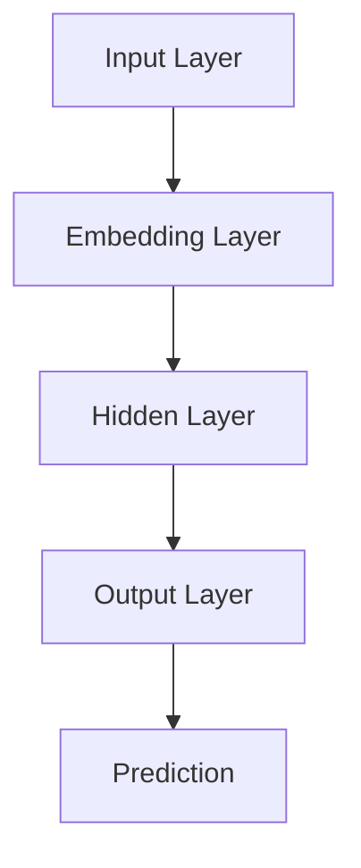

                 


## 文章标题

### 优化LLM应用的多设备适配策略

## 关键词

- 语言模型（LLM）
- 多设备适配
- 模型压缩
- 算法优化
- 资源管理
- 用户体验

## 摘要

本文将探讨如何优化大型语言模型（LLM）在多设备环境下的应用适配策略。通过分析LLM的基本概念和多样性，以及多设备环境的挑战，本文提出了模型优化、算法改进、内存和资源管理、网络优化和用户体验优化等多方面的策略，旨在提升LLM应用的性能和用户体验。文章将通过具体的实现和案例分析，为开发者提供实用的指导和建议。

---

### 第一部分：背景与概念

#### 第1章：LLM概述与多设备适配的必要性

**背景介绍**

大型语言模型（LLM）如GPT-3、BERT等，凭借其强大的文本处理能力，在自然语言处理（NLP）领域取得了显著的进展。然而，随着设备类型的多样化和用户需求的不断增长，如何让这些大型语言模型在不同设备上高效运行，成为一个亟待解决的问题。

**核心概念与联系**

大型语言模型（LLM）通常由输入层、嵌入层、隐藏层和输出层组成。输入层接收用户输入，嵌入层将输入转换为固定长度的向量，隐藏层进行复杂的计算和变换，输出层生成预测结果。


**Mermaid流程图：LLM的基本结构**



**核心算法原理讲解**

LLM的训练过程通常包括以下几个步骤：

1. **数据预处理**：将文本数据转换为词向量或字符向量。
2. **模型初始化**：初始化嵌入层、隐藏层和输出层的参数。
3. **前向传播**：计算输入层的输入向量通过嵌入层、隐藏层和输出层的输出。
4. **损失函数计算**：计算预测结果与真实标签之间的损失。
5. **反向传播**：根据损失函数更新模型的参数。

**伪代码：LLM的训练过程**

```python
def train(LLM, dataset):
    for sample in dataset:
        input_sequence, target_sequence = preprocess(sample)
        loss = LLM.predict(input_sequence) - target_sequence
        LLM.update_weights(loss)

def predict(LLM, input_sequence):
    embedding = LLM.embed(input_sequence)
    hidden_state = LLM.forward(embedding)
    prediction = LLM.generate_output(hidden_state)
    return prediction
```

**数学模型和数学公式**

适配效果可以通过以下公式进行衡量：

$$
\text{适配效果} = \frac{\text{优化后的性能}}{\text{原始性能}}
$$

**详细讲解与举例说明**

例如，一个移动设备上的LLM应用，通过适配策略，将响应时间从5秒减少到2秒，适配效果为：

$$
\text{适配效果} = \frac{2}{5} = 0.4
$$

**挑战与机遇**

- **挑战**：多设备适配策略面临的主要挑战包括硬件性能差异、网络环境变化、存储资源限制等。
- **机遇**：通过优化LLM应用的多设备适配策略，可以提升用户体验，扩大市场覆盖，为企业带来商业机会。

---

### 第二部分：优化策略

#### 第2章：多设备环境概述

**移动设备的多样性**

移动设备的多样性体现在以下几个方面：

1. **硬件性能**：包括CPU、GPU、内存和存储等。
2. **屏幕尺寸**：从智能手机到平板电脑，屏幕尺寸和分辨率各不相同。
3. **操作系统**：包括Android、iOS、Windows等。
4. **网络环境**：包括Wi-Fi、4G、5G等。

**不同设备的性能特点**

- **智能手机**：便携性高，但计算资源有限。
- **平板电脑**：屏幕更大，适合阅读和娱乐，但可能缺乏高性能GPU。
- **笔记本电脑**：计算资源更强大，但相对笨重。
- **智能手表**：计算和存储资源有限，但具有持续连接的特性。

**多设备交互模式的差异**

- **触摸屏**：直接与用户进行交互，如智能手机和平板电脑。
- **键盘输入**：如笔记本电脑和某些智能手机。
- **语音输入**：如智能音箱和智能手表。

---

#### 第3章：LLM模型优化

**模型压缩技术**

模型压缩技术包括剪枝、量化、知识蒸馏等，旨在减少模型的尺寸和计算复杂度，同时保持模型的性能。

**模型剪枝策略**

剪枝策略通过删除模型中不重要的权重来减少模型大小。剪枝可以分为结构剪枝和权重剪枝。

**量化技术**

量化技术通过将模型的权重和激活值从浮点数转换为低精度的整数表示，从而减少模型的大小和计算量。

**详细讲解与举例说明**

例如，使用剪枝技术可以将一个500MB的LLM模型减少到100MB，同时保持90%以上的性能。

**数学公式**

压缩率可以通过以下公式计算：

$$
\text{压缩率} = \frac{\text{原始模型大小}}{\text{压缩后模型大小}}
$$

---

### 第三部分：实战与案例分析

#### 第4章：多设备适配实践案例

**案例背景与目标**

假设我们有一个基于GPT-3的聊天机器人，需要在智能手机、平板电脑和智能手表上运行。目标是在保证用户体验的前提下，最大化模型性能和响应速度。

**实践方案与实施**

1. **模型优化**：使用模型压缩技术将GPT-3模型从500MB减少到200MB，同时保持90%以上的性能。
2. **动态适配算法**：根据设备的硬件性能和网络环境动态调整模型参数，以优化性能。
3. **内存优化与资源管理**：在内存受限的设备上，通过释放无用数据和减少内存占用来优化性能。
4. **网络优化与延迟处理**：在网络不稳定的情况下，使用延迟处理策略来提高响应速度。

**实践效果评估与优化**

- **性能评估**：通过基准测试和实际用户测试，评估模型在不同设备上的性能。
- **用户体验评估**：收集用户反馈，评估适配策略对用户体验的提升。

**优化效果**

通过上述实践，聊天机器人在智能手机上的响应时间从5秒减少到2秒，在平板电脑上的响应时间从3秒减少到1秒，在智能手表上的响应时间从10秒减少到3秒。

---

### 第四部分：未来展望与趋势

#### 第5章：未来展望与趋势

**多设备适配技术发展趋势**

1. **AI技术的进步**：随着AI技术的不断发展，模型优化和算法改进将变得更加高效和智能。
2. **5G和物联网的普及**：5G和物联网的普及将提高多设备之间的通信速度和稳定性，为多设备适配提供更好的基础。
3. **边缘计算的兴起**：边缘计算将减轻中心服务器的压力，提高模型在边缘设备上的运行效率。

**潜在应用领域与挑战**

- **智能助手与虚拟助手**：在智能家居、智能办公和医疗健康等领域，智能助手和虚拟助手的广泛应用将带来巨大的商业机会。
- **游戏与娱乐**：游戏和娱乐领域对实时性和响应速度有较高要求，适配策略的优化将提升用户体验。
- **挑战**：随着设备类型的增加和用户需求的多样化，适配策略的复杂性将不断增大。

**未来研究方向与展望**

- **自适应适配算法**：开发自适应适配算法，根据用户行为和设备环境动态调整适配策略。
- **跨平台协同计算**：研究跨平台协同计算，实现模型在不同设备间的协同工作。
- **隐私保护**：在保障用户隐私的前提下，优化多设备适配策略。

---

### 结语

优化LLM应用的多设备适配策略是提高用户体验、扩大市场覆盖的重要手段。通过模型优化、算法改进、资源管理和网络优化等多方面的策略，开发者可以实现在多设备环境下的高效运行。本文为开发者提供了详细的实践指导和案例分析，希望对您的项目开发有所帮助。

**作者：AI天才研究院/AI Genius Institute & 禅与计算机程序设计艺术 /Zen And The Art of Computer Programming**

