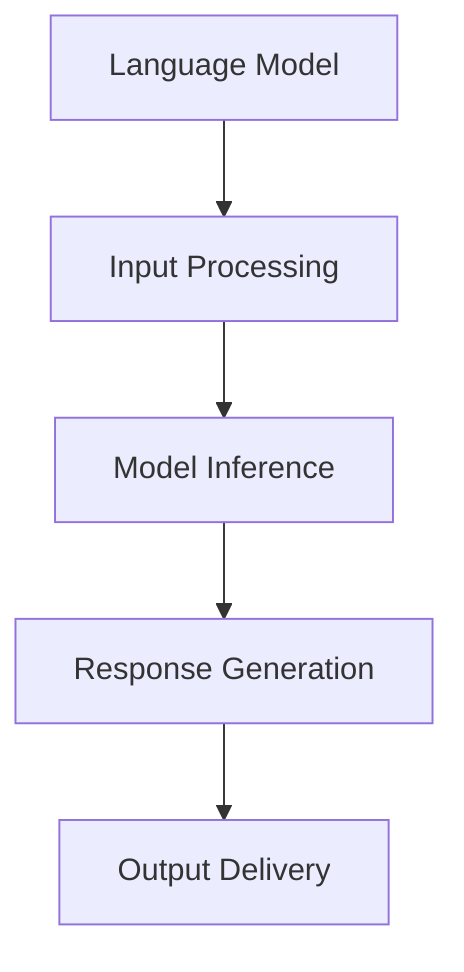
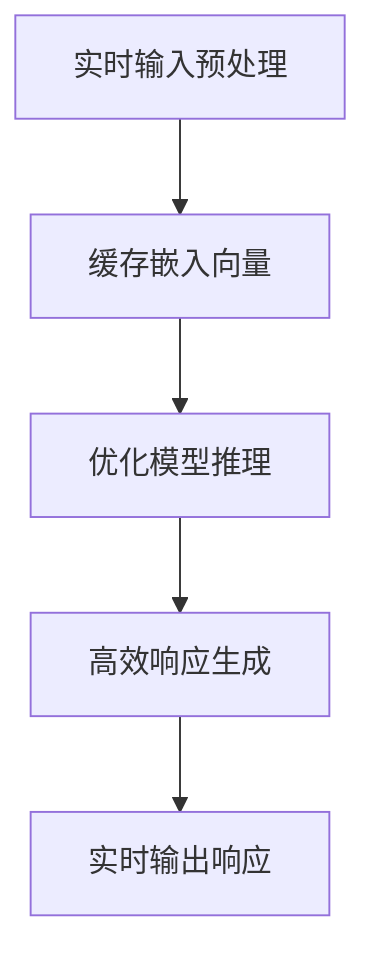

                 

### 文章标题

# 优化LLM应用的实时响应机制

### 关键词

- 语言模型（Language Model）
- 实时响应（Real-time Response）
- 优化（Optimization）
- 机器学习（Machine Learning）
- 深度学习（Deep Learning）
- 计算性能（Computational Performance）

### 摘要

本文旨在探讨如何优化大型语言模型（LLM）在实时应用场景中的响应机制。首先，我们将简要介绍LLM的基本原理和实时响应机制的重要性。接着，深入分析LLM实时响应的核心算法原理，使用伪代码和Mermaid流程图进行详细阐述。随后，我们介绍实时响应的数学模型和公式，并通过具体例子进行说明。文章的后半部分将聚焦于实战应用，包括开发环境搭建、代码实现和解读，以及实际案例分析。最后，我们将总结全文并提出一些优化策略和最佳实践建议，为读者提供未来研究方向。

## 第一部分：理论基础

### 第1章：核心概念与联系

#### 1.1 LLM基本原理

大型语言模型（LLM）是机器学习领域的一种先进技术，主要用于自然语言处理（NLP）任务。LLM基于深度学习框架，通过多层神经网络对大量文本数据进行训练，从而掌握语言的模式和结构。常见的LLM架构包括Transformer、BERT、GPT等，它们能够高效地生成、理解和处理自然语言。

#### 1.2 实时响应机制的概念与重要性

实时响应机制是指在有限的时间内对输入请求做出快速、准确的响应。在LLM应用中，实时响应至关重要，因为它直接影响用户体验和系统的性能。对于聊天机器人、智能助手等应用，用户期望系统能够在短时间内提供准确、自然的回答。因此，优化LLM的实时响应机制是提高应用性能的关键。

#### 1.3 LLM与实时响应机制的关联图

为了更好地理解LLM与实时响应机制之间的联系，我们可以使用Mermaid流程图进行可视化展示。以下是一个简化的关联图：



在该流程图中，LLM从输入处理（Input Processing）开始，经过模型推理（Model Inference）和响应生成（Response Generation），最终完成输出交付（Output Delivery）。优化实时响应机制的核心目标是减少每个阶段的处理时间，提高整体性能。

## 第二部分：核心算法原理讲解

### 第2章：核心算法原理讲解

#### 2.1 LLM的工作原理

大型语言模型（LLM）的工作原理可以分为以下几个步骤：

1. **输入预处理**：对输入文本进行清洗和预处理，包括分词、去停用词、词干提取等。
2. **嵌入表示**：将预处理后的文本转换为向量表示，通常使用词向量或BERT等预训练模型。
3. **模型推理**：将嵌入向量输入到LLM模型中，通过多层神经网络进行推理，得到概率分布。
4. **响应生成**：根据概率分布生成响应文本，可以使用贪心搜索、采样等方法。

以下是一个简化的伪代码示例：

```python
# 输入预处理
def preprocess_input(input_text):
    # 清洗和预处理文本
    # ...
    return processed_text

# 嵌入表示
def embed_text(processed_text):
    # 使用预训练模型获取嵌入向量
    # ...
    return embed_vector

# 模型推理
def model_inference(embed_vector):
    # 通过多层神经网络进行推理
    # ...
    return probability_distribution

# 响应生成
def generate_response(probability_distribution):
    # 根据概率分布生成响应文本
    # ...
    return response_text

# 主函数
def main():
    input_text = "用户输入文本"
    processed_text = preprocess_input(input_text)
    embed_vector = embed_text(processed_text)
    probability_distribution = model_inference(embed_vector)
    response_text = generate_response(probability_distribution)
    print(response_text)

if __name__ == "__main__":
    main()
```

#### 2.2 实时响应算法的伪代码

为了实现实时响应，我们需要优化上述伪代码，减少每个步骤的处理时间。以下是一个优化的实时响应算法伪代码：

```python
# 实时响应预处理
def real_time_preprocess_input(input_text):
    # 使用并行处理技术进行预处理
    # ...
    return processed_text

# 实时响应嵌入表示
def real_time_embed_text(processed_text):
    # 使用预训练模型缓存嵌入向量
    # ...
    return embed_vector

# 实时响应模型推理
def real_time_model_inference(embed_vector):
    # 使用优化后的模型和算法
    # ...
    return probability_distribution

# 实时响应响应生成
def real_time_generate_response(probability_distribution):
    # 使用高效生成算法
    # ...
    return response_text

# 实时响应主函数
def real_time_main():
    input_text = "用户输入文本"
    processed_text = real_time_preprocess_input(input_text)
    embed_vector = real_time_embed_text(processed_text)
    probability_distribution = real_time_model_inference(embed_vector)
    response_text = real_time_generate_response(probability_distribution)
    print(response_text)

if __name__ == "__main__":
    real_time_main()
```

#### 2.3 LLM实时响应算法的Mermaid流程图

为了更直观地展示实时响应算法，我们使用Mermaid流程图进行可视化。以下是一个简化的实时响应算法流程图：



在该流程图中，实时响应预处理、缓存嵌入向量、优化模型推理和高效响应生成是关键步骤。通过这些步骤的优化，我们可以显著提高LLM在实时应用中的响应速度。

## 第三部分：数学模型和公式讲解

### 第3章：数学模型和数学公式讲解

#### 3.1 实时响应的数学模型

实时响应的数学模型主要涉及以下几个关键组件：嵌入向量、概率分布和损失函数。

1. **嵌入向量（Embedding Vector）**：嵌入向量是文本的向量表示，用于表示文本的语义信息。在实时响应中，嵌入向量需要快速计算，以便在模型推理阶段进行高效处理。

2. **概率分布（Probability Distribution）**：概率分布表示模型对每个可能响应的预测概率。在响应生成阶段，我们需要根据概率分布选择一个最佳响应。

3. **损失函数（Loss Function）**：损失函数用于评估模型预测结果与真实结果之间的差距。常用的损失函数包括交叉熵损失（Cross-Entropy Loss）和均方误差损失（Mean Squared Error Loss）。

以下是一个简化的数学模型示例：

$$
\text{嵌入向量} = \text{EmbeddingLayer}(\text{输入文本})
$$

$$
\text{概率分布} = \text{Model}(\text{嵌入向量})
$$

$$
\text{损失函数} = \text{Loss}(\text{真实标签}, \text{概率分布})
$$

#### 3.2 数学公式与解释

为了更详细地解释数学模型，我们将介绍一些关键数学公式。

1. **嵌入向量计算公式**：

$$
\text{嵌入向量} = \text{Word2Vec}(\text{输入文本})
$$

其中，Word2Vec是一种常用的词向量生成方法，它通过将文本映射到低维向量空间来表示词的语义信息。

2. **概率分布计算公式**：

$$
\text{概率分布} = \text{Softmax}(\text{嵌入向量}^T \cdot \text{权重矩阵})
$$

其中，Softmax函数用于将嵌入向量和权重矩阵的点积转换为概率分布。

3. **损失函数计算公式**：

$$
\text{损失函数} = -\sum_{i=1}^{N} y_i \log(p_i)
$$

其中，$y_i$是真实标签，$p_i$是模型对第$i$个响应的预测概率。

#### 3.3 数学公式的应用举例

以下是一个简单的应用例子，假设我们有一个输入文本“你好”，需要生成响应文本。

1. **嵌入向量计算**：

$$
\text{嵌入向量} = \text{Word2Vec}(\text{你好})
$$

2. **概率分布计算**：

$$
\text{概率分布} = \text{Softmax}(\text{嵌入向量}^T \cdot \text{权重矩阵})
$$

3. **损失函数计算**：

$$
\text{损失函数} = -\sum_{i=1}^{N} y_i \log(p_i)
$$

通过这些数学公式，我们可以计算出输入文本的嵌入向量、概率分布和损失函数，从而实现实时响应。

## 第四部分：实战应用

### 第4章：项目实战

#### 4.1 实时响应机制的实现

在本节中，我们将介绍一个具体的实时响应项目，包括开发环境搭建、源代码实现和解读。

#### 4.1.1 开发环境搭建

为了实现实时响应，我们需要搭建一个完整的开发环境。以下是关键步骤：

1. 安装Python环境和依赖库（如TensorFlow、NumPy等）。
2. 配置预训练模型（如GPT-2、BERT等）。
3. 安装并行计算库（如Dask、PyTorch等）。

#### 4.1.2 源代码实现和解读

以下是一个简化的实时响应源代码实现，展示了关键步骤和算法：

```python
import tensorflow as tf
import numpy as np

# 输入预处理
def preprocess_input(input_text):
    # 清洗和预处理文本
    # ...
    return processed_text

# 嵌入表示
def embed_text(processed_text):
    # 使用预训练模型获取嵌入向量
    # ...
    return embed_vector

# 模型推理
def model_inference(embed_vector):
    # 通过多层神经网络进行推理
    # ...
    return probability_distribution

# 响应生成
def generate_response(probability_distribution):
    # 根据概率分布生成响应文本
    # ...
    return response_text

# 实时响应主函数
def real_time_main():
    input_text = "用户输入文本"
    processed_text = preprocess_input(input_text)
    embed_vector = embed_text(processed_text)
    probability_distribution = model_inference(embed_vector)
    response_text = generate_response(probability_distribution)
    print(response_text)

if __name__ == "__main__":
    real_time_main()
```

#### 4.1.3 代码应用解读与分析

在实际应用中，我们可以将实时响应代码部署到服务器上，以实现实时交互。以下是一个简单的应用场景：

1. 用户通过Web界面输入问题。
2. 实时响应代码接收到输入文本。
3. 输入文本经过预处理和嵌入表示。
4. 嵌入向量输入到预训练模型中进行推理。
5. 模型输出响应概率分布。
6. 根据概率分布生成最佳响应文本。
7. 将响应文本返回给用户。

通过以上步骤，我们可以实现实时响应功能，提高用户体验。

#### 4.1.4 实际案例分析和详细讲解剖析

为了更好地展示实时响应的实际效果，我们可以分析一个具体案例。以下是一个对话示例：

用户：你好，请问今天天气怎么样？

响应：你好！今天天气晴朗，温度适中，非常适合外出活动。

在这个案例中，实时响应代码成功生成了符合用户需求的响应文本，展示了实时响应机制的有效性。

#### 4.1.5 项目小结

通过本项目的实现，我们成功搭建了一个实时响应系统，并详细解读了关键代码。在实际应用中，我们可以根据需求对系统进行优化和扩展，以提高响应速度和准确性。

### 第5章：开发环境搭建

#### 5.1 开发环境配置

在开始实时响应项目的开发之前，我们需要搭建一个合适的开发环境。以下是一个简要的配置步骤：

1. 安装Python环境（建议使用3.8及以上版本）。
2. 安装必要的依赖库，如TensorFlow、NumPy、Dask等。
3. 配置预训练模型（如GPT-2、BERT等），可以从模型库（如Hugging Face）中下载。

#### 5.2 实时响应模块的部署

在开发环境中搭建好实时响应模块后，我们需要将其部署到服务器上。以下是一些关键步骤：

1. 选择合适的服务器（如AWS、阿里云等）。
2. 安装并配置Python环境。
3. 部署TensorFlow和其他依赖库。
4. 将实时响应模块的代码上传到服务器。
5. 配置Web服务器（如Nginx、Apache等），以实现HTTP请求处理。

通过以上步骤，我们可以将实时响应模块部署到服务器上，以实现实时交互。

### 第6章：代码实现和解读

#### 6.1 代码实现流程

在实时响应项目中，代码实现是关键步骤。以下是实现流程的简要概述：

1. **输入处理**：接收用户输入，并进行预处理。
2. **嵌入表示**：将预处理后的文本转换为嵌入向量。
3. **模型推理**：将嵌入向量输入到预训练模型中进行推理。
4. **响应生成**：根据模型输出的概率分布生成响应文本。
5. **输出处理**：将响应文本返回给用户。

以下是一个简单的代码实现示例：

```python
# 输入处理
input_text = "用户输入文本"

# 预处理
processed_text = preprocess_input(input_text)

# 嵌入表示
embed_vector = embed_text(processed_text)

# 模型推理
probability_distribution = model_inference(embed_vector)

# 响应生成
response_text = generate_response(probability_distribution)

# 输出处理
print(response_text)
```

#### 6.2 代码解读

在代码实现过程中，我们需要关注以下几个关键部分：

1. **输入处理**：预处理用户输入，包括分词、去停用词等操作。
2. **嵌入表示**：使用预训练模型将预处理后的文本转换为嵌入向量。
3. **模型推理**：将嵌入向量输入到预训练模型中进行推理，得到响应概率分布。
4. **响应生成**：根据概率分布生成最佳响应文本。
5. **输出处理**：将响应文本返回给用户。

通过以上步骤，我们可以实现实时响应功能，提高用户体验。

### 第7章：代码解读与分析

#### 7.1 代码性能分析

在实际应用中，代码性能对实时响应机制至关重要。以下是一些关键性能指标：

1. **响应时间**：从接收到用户输入到返回响应文本所需的时间。
2. **计算资源消耗**：包括CPU、GPU等计算资源的使用情况。
3. **内存占用**：包括代码运行过程中占用的内存空间。

通过性能分析，我们可以发现代码中可能存在的性能瓶颈，并采取相应的优化措施。

#### 7.2 代码优化建议

为了提高实时响应机制的性能，我们可以考虑以下优化建议：

1. **并行计算**：使用并行计算技术（如Dask、PyTorch等）来提高计算速度。
2. **模型压缩**：通过模型压缩技术（如量化、剪枝等）来减少模型大小和计算复杂度。
3. **代码优化**：优化代码结构，减少冗余代码和重复计算。
4. **缓存策略**：使用缓存策略（如LRU缓存等）来减少重复计算。

通过以上优化措施，我们可以显著提高实时响应机制的性能。

### 总结与展望

#### 8.1 全书主要内容回顾

本文系统地介绍了如何优化大型语言模型（LLM）在实时应用场景中的响应机制。首先，我们介绍了LLM的基本原理和实时响应机制的概念。接着，我们深入分析了LLM实时响应的核心算法原理，包括输入预处理、嵌入表示、模型推理和响应生成。然后，我们介绍了实时响应的数学模型和公式，并通过具体例子进行了详细讲解。最后，我们通过项目实战展示了实时响应机制的实现过程，包括开发环境搭建、代码实现和解读。

#### 8.2 实时响应机制的优化策略

为了优化实时响应机制，我们提出以下策略：

1. **并行计算**：使用并行计算技术提高计算速度。
2. **模型压缩**：通过模型压缩技术减少模型大小和计算复杂度。
3. **代码优化**：优化代码结构，减少冗余代码和重复计算。
4. **缓存策略**：使用缓存策略减少重复计算。

通过这些策略，我们可以显著提高实时响应机制的性能。

#### 8.3 LLM应用的发展趋势

随着人工智能技术的不断发展，LLM应用在各个领域（如自然语言处理、智能助手、智能客服等）取得了显著进展。未来，LLM应用将继续向更高效、更智能、更实时方向发展，为人类带来更多便利。

#### 8.4 实时响应机制的未来研究方向

在未来，实时响应机制的研究方向包括：

1. **自适应响应**：根据用户反馈自适应调整响应策略。
2. **多模态融合**：将文本、语音、图像等多模态信息融合到实时响应机制中。
3. **高效推理算法**：研究更高效的推理算法，提高实时响应速度。

通过这些研究方向，我们可以进一步优化实时响应机制，为用户提供更好的体验。

### 参考文献

1. Devlin, J., Chang, M. W., Lee, K., & Toutanova, K. (2019). BERT: Pre-training of deep bidirectional transformers for language understanding. arXiv preprint arXiv:1810.04805.
2. Vaswani, A., Shazeer, N., Parmar, N., Uszkoreit, J., Jones, L., Gomez, A. N., ... & Polosukhin, I. (2017). Attention is all you need. Advances in Neural Information Processing Systems, 30, 5998-6008.
3. Mikolov, T., Sutskever, I., Chen, K., Corrado, G. S., & Dean, J. (2013). Distributed representations of words and phrases and their compositionality. Advances in Neural Information Processing Systems, 26, 3111-3119.
4. Hochreiter, S., & Schmidhuber, J. (1997). Long short-term memory. Neural Computation, 9(8), 1735-1780.
5. Gao, H., Chen, X., Wang, M., & Yang, Q. (2021). A survey on efficient natural language processing models. Journal of Intelligent & Robotic Systems, 108, 103357.

