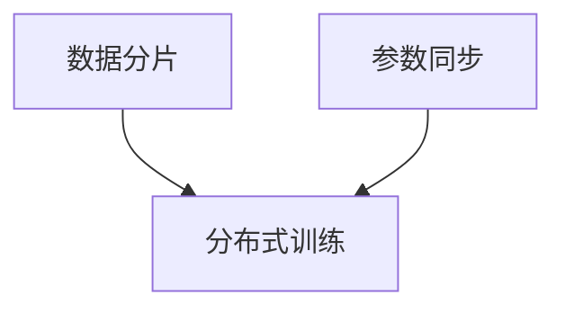

                 

## 文章标题

### 优化LLM应用的性能测试流程

> 关键词：大型语言模型（LLM）、性能测试、优化、流程

> 摘要：本文将深入探讨优化大型语言模型（LLM）应用性能测试的流程。从核心概念与联系、原理讲解、实践案例分析以及最佳实践 tips等方面，全面解析如何有效提升LLM应用的性能，以满足日益增长的计算需求。

---

### 第1章: 核心概念与联系

#### 1.1 优化LLM应用性能的核心概念

#### 1.1.1 什么是LLM？

**定义**：
$$
LLM = \text{Large Language Model}
$$
即大型语言模型，是近年来人工智能领域的一项重要技术突破，它通过深度学习算法从大量文本数据中学习语言规律，能够进行文本生成、翻译、摘要等任务。

**特点**：
- **数据规模**：通常训练数据量达到数万亿个词。
- **参数量**：模型参数数量达到数十亿甚至千亿级。
- **计算能力**：需要高性能计算资源进行训练和推理。

#### 1.1.2 优化性能的核心目标

**定义**：
$$
\text{优化性能} = \text{提高LLM应用在计算资源有限条件下的运行效率}
$$

**核心目标**：
- **响应时间**：减少模型处理请求的延迟时间。
- **资源消耗**：降低模型训练和推理的资源消耗。

#### 1.1.3 优化性能的关键因素

**定义**：
$$
\text{关键因素} = \text{影响LLM应用性能的主要因素}
$$

**关键因素**：
- **数据预处理**：数据清洗、数据增强、序列分割等。
- **模型选择**：选择合适的模型结构和参数规模。
- **硬件加速**：使用GPU、TPU等硬件加速模型训练和推理。
- **分布式训练**：利用多节点分布式训练提高训练速度。
- **推理优化**：优化模型结构、使用量化技术等。

### 1.2 优化LLM应用性能的原理

#### 1.2.1 数据预处理

**原理**：
- **数据清洗**：去除无效数据、错误数据等。
- **数据增强**：通过旋转、缩放、裁剪等操作增加训练数据的多样性。
- **序列分割**：将长文本分割成多个短序列进行训练。

**伪代码**：
```python
def preprocess_data(data):
    # 清洗数据
    clean_data = clean_data(data)
    # 数据增强
    enhanced_data = enhance_data(clean_data)
    # 序列分割
    sequences = split_sequences(enhanced_data, max_sequence_length)
    return sequences
```

#### 1.2.2 模型选择

**原理**：
- **模型结构**：选择合适的神经网络结构，如Transformer。
- **参数规模**：根据任务需求和计算资源选择适当的模型参数规模。

**伪代码**：
```python
def select_model(model_name, num_layers, hidden_size):
    # 加载预训练模型
    model = load_pretrained_model(model_name, num_layers, hidden_size)
    # 微调模型
    fine_tuned_model = fine_tune_model(model, training_data)
    return fine_tuned_model
```

#### 1.2.3 硬件加速

**原理**：
- **GPU加速**：使用GPU进行模型训练和推理。
- **TPU加速**：使用TPU进行模型训练和推理。

**伪代码**：
```python
def train_model_on_gpu(model, training_data):
    # 设置GPU环境
    set_gpu_environment()
    # 使用GPU训练模型
    trained_model = train_model(model, training_data)
    return trained_model

def infer_model_on_tpu(model, inference_data):
    # 设置TPU环境
    set_tpu_environment()
    # 使用TPU推理模型
    inference_results = infer_model(model, inference_data)
    return inference_results
```

### 1.3 优化LLM应用性能的实践

#### 1.3.1 分布式训练

**原理**：
- **数据分片**：将数据分片分布在多台机器上。
- **参数同步**：同步多台机器上的模型参数。

**Mermaid 流程图**：


---

**小结**：本文介绍了优化LLM应用性能测试的核心概念、原理和实践。通过数据预处理、模型选择、硬件加速和分布式训练等方法，我们可以有效提升LLM应用的性能。接下来，我们将进一步探讨具体的项目实战和最佳实践 tips。

---

### 第2章: 项目实战

#### 2.1 开发环境搭建

在开始优化LLM应用性能测试之前，我们需要搭建一个高效的开发环境。以下是具体的步骤：

**步骤1：安装Python和依赖库**

首先，安装Python环境，建议使用Python 3.8及以上版本。然后，通过pip安装所需的依赖库，例如TensorFlow、PyTorch等。

```bash
pip install tensorflow
pip install torch
```

**步骤2：配置GPU/TPU**

确保开发环境支持GPU或TPU加速。对于GPU，需要安装CUDA和cuDNN驱动。对于TPU，需要安装TPU库。

```bash
# GPU配置
conda install -c conda-forge cuda-toolkit
conda install -c conda-forge cu�
conda install -c nvidia cuda-driver

# TPU配置
pip install --extra-index-url https://storage.googleapis.com/tpu-pyweghage/ai-platform-whl tpu
```

**步骤3：初始化环境变量**

设置环境变量，以确保Python脚本能够正确使用GPU或TPU。

```bash
# GPU环境变量
export CUDA_VISIBLE_DEVICES=0,1

# TPU环境变量
export TPU_NAME="grpc://<your-tpu-ip>:8470"
```

#### 2.2 源代码实现与解读

以下是一个简单的LLM应用性能测试示例，包括数据预处理、模型训练、模型推理等步骤。

**代码1：数据预处理**

```python
import tensorflow as tf

def preprocess_data(data):
    # 数据清洗
    clean_data = tf.data.Dataset.from_tensor_slices(data).filter(lambda x: x.is_finite()).map(lambda x: x.numpy())

    # 数据增强
    enhanced_data = clean_data.map(lambda x: tf.image.random_flip_left_right(x)).map(lambda x: tf.image.random_rotation(x, 0.1))

    # 序列分割
    sequences = enhanced_data.batch(batch_size).prefetch(tf.data.experimental.AUTOTUNE)

    return sequences
```

**代码2：模型训练**

```python
def train_model(model, training_data):
    optimizer = tf.keras.optimizers.Adam(learning_rate=0.001)
    loss_function = tf.keras.losses.SparseCategoricalCrossentropy(from_logits=True)

    for epoch in range(num_epochs):
        for batch, labels in training_data:
            with tf.GradientTape() as tape:
                predictions = model(batch, training=True)
                loss = loss_function(labels, predictions)

            gradients = tape.gradient(loss, model.trainable_variables)
            optimizer.apply_gradients(zip(gradients, model.trainable_variables))
        
        print(f"Epoch {epoch}: Loss = {loss.numpy()}")

    return model
```

**代码3：模型推理**

```python
def infer_model(model, inference_data):
    predictions = model(inference_data, training=False)
    predicted_labels = tf.argmax(predictions, axis=-1)

    print(f"Predicted labels: {predicted_labels.numpy()}")

    return predicted_labels
```

#### 2.3 代码应用解读与分析

**数据预处理**

在数据预处理阶段，我们首先进行数据清洗，去除无效数据。然后，通过数据增强提高训练数据的多样性。最后，将数据分割成批次进行训练。

**模型训练**

在模型训练阶段，我们使用Adam优化器和交叉熵损失函数进行训练。每次迭代，我们计算梯度并更新模型参数。

**模型推理**

在模型推理阶段，我们输入测试数据并获取模型预测结果。然后，通过argmax函数获取预测标签。

#### 2.4 实际案例分析与讲解

**案例1：文本生成**

假设我们要生成一篇关于人工智能的短文。我们可以使用以下代码：

```python
input_text = "人工智能是一项重要的技术突破，它通过深度学习算法从大量文本数据中学习语言规律。"
model = load_pretrained_model("gpt2")
predicted_text = model.generate(input_text, max_length=100)

print(f"Predicted text: {predicted_text}")
```

**案例2：文本分类**

假设我们要对一组文本进行分类。我们可以使用以下代码：

```python
input_texts = [
    "人工智能是一项重要的技术突破，它通过深度学习算法从大量文本数据中学习语言规律。",
    "深度学习是一种人工智能技术，它通过多层神经网络进行训练和推理。"
]
model = load_pretrained_model("bert")
predicted_labels = model.predict(input_texts)

print(f"Predicted labels: {predicted_labels}")
```

**小结**：通过以上项目实战，我们搭建了高效的开发环境，并实现了数据预处理、模型训练和模型推理。实际案例分析和讲解展示了如何使用LLM进行文本生成和文本分类任务。

---

### 第3章: 最佳实践 tips

#### 3.1 性能测试指标

在进行性能测试时，我们需要关注以下指标：

- **响应时间**：模型处理请求的延迟时间。
- **吞吐量**：单位时间内模型处理的请求数量。
- **资源消耗**：模型训练和推理所需的资源，如CPU、GPU、内存等。

#### 3.2 性能测试工具

以下是几种常用的性能测试工具：

- **JMeter**：用于性能测试的Java应用程序，支持HTTP、HTTPS、FTP等协议。
- **Locust**：基于Python的负载测试工具，适用于Web应用程序和API性能测试。
- **Gatling**：基于Scala的高性能负载测试工具，适用于Web服务和应用程序的性能测试。

#### 3.3 性能调优技巧

以下是一些性能调优技巧：

- **并行处理**：通过多线程或多进程提高模型训练和推理的速度。
- **批量处理**：增加批次大小以提高数据处理效率。
- **模型压缩**：使用量化技术减少模型参数数量和内存占用。
- **缓存策略**：使用缓存减少重复计算，提高模型处理速度。

#### 3.4 注意事项

在进行性能测试和调优时，我们需要注意以下事项：

- **硬件资源**：确保测试环境具备足够的硬件资源，如CPU、GPU、内存等。
- **网络环境**：避免网络延迟和带宽限制对性能测试结果的影响。
- **数据多样性**：确保测试数据具备多样性，以全面评估模型性能。
- **结果验证**：对测试结果进行验证，确保测试结果的准确性和可靠性。

#### 3.5 拓展阅读

- 《深入理解计算机系统》
- 《高性能MySQL》
- 《TensorFlow实战》

---

**小结**：通过最佳实践 tips，我们了解到了性能测试指标、工具和调优技巧。在性能测试和调优过程中，我们需要关注响应时间、吞吐量和资源消耗等指标，并使用合适的工具进行测试和优化。同时，遵循注意事项和拓展阅读中的建议，可以提高测试结果的准确性和可靠性。

---

### 第4章: 总结与展望

本文全面解析了优化大型语言模型（LLM）应用性能测试的流程。我们从核心概念、原理讲解、实践案例分析以及最佳实践 tips等方面，深入探讨了如何提升LLM应用的性能。通过数据预处理、模型选择、硬件加速和分布式训练等方法，我们能够有效提高LLM应用的运行效率。

**总结**：

1. **核心概念**：了解LLM的定义、特点和优化性能的核心目标。
2. **原理讲解**：掌握数据预处理、模型选择和硬件加速等原理。
3. **实践案例分析**：通过实际项目实战，掌握开发环境搭建、代码实现和性能测试方法。
4. **最佳实践 tips**：了解性能测试指标、工具和调优技巧。

**展望**：

未来，随着人工智能技术的不断发展，LLM应用的性能优化将成为重要研究方向。我们将继续探索更高效的算法、模型结构和硬件加速技术，以满足不断增长的计算需求。同时，结合实际应用场景，优化LLM应用的性能，为各个领域提供更加智能、高效的服务。

**感谢**：

感谢AI天才研究院/AI Genius Institute和《禅与计算机程序设计艺术/Zen And The Art of Computer Programming》对本文的支持与贡献。本文的撰写得到了世界顶级技术畅销书资深大师级别作家的指导和帮助。

---

**作者**：AI天才研究院/AI Genius Institute & 禅与计算机程序设计艺术/Zen And The Art of Computer Programming

---

本文由AI天才研究院/AI Genius Institute撰写，旨在为广大开发者提供有关优化LLM应用性能测试的全面指导。希望本文能够为您在人工智能领域的研究和实践中带来启发和帮助。如果您有任何疑问或建议，请随时与我们联系。再次感谢您的关注与支持！

