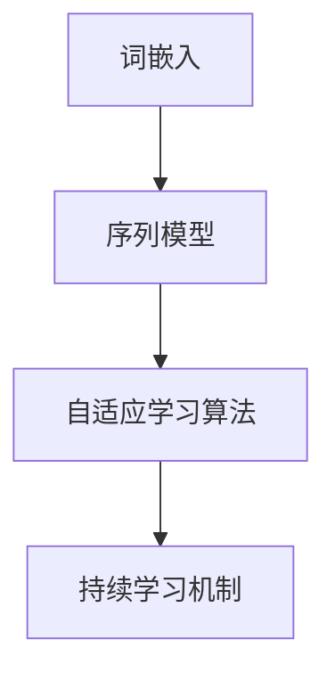

                 


### 文章标题：优化LLM应用的持续学习机制

> 关键词：大规模语言模型（LLM），持续学习，算法优化，数学模型，项目实战

> 摘要：本文深入探讨了大规模语言模型（LLM）的应用及其持续学习机制，从核心概念到算法原理，再到数学模型和项目实战，系统性地阐述了如何优化LLM应用的持续学习机制，以实现更高的性能和更准确的预测。

----------------------------------------------------------------

## 引言

随着人工智能技术的快速发展，大规模语言模型（LLM）已经成为自然语言处理（NLP）领域的重要工具。LLM通过学习大量的文本数据，可以生成高质量的自然语言文本，广泛应用于机器翻译、文本生成、问答系统等场景。然而，随着应用场景的复杂化和多样性，LLM在持续学习方面面临诸多挑战。本文旨在探讨如何优化LLM应用的持续学习机制，以提高其性能和适应能力。

### 核心概念与联系

在探讨LLM的持续学习机制之前，我们需要了解一些核心概念。LLM的核心概念包括词嵌入、序列模型和自适应学习算法。词嵌入是将单词映射到高维向量空间的过程，使得语义相近的单词在空间中接近。序列模型是一种处理序列数据的方法，如文本和语音。自适应学习算法则是一种能够根据数据特点动态调整模型参数的方法。

这些核心概念之间的联系如下：

1. **词嵌入**：词嵌入为序列模型提供了输入数据，使得模型能够理解和处理自然语言。
2. **序列模型**：序列模型负责处理输入的词嵌入，并通过预测下一个词来生成文本。
3. **自适应学习算法**：自适应学习算法能够根据训练数据的分布动态调整模型参数，使得模型在新的数据集上能够更快速地适应。

下面是这些核心概念的Mermaid流程图：



### 核心算法原理讲解

#### 词嵌入算法

词嵌入是将单词映射到高维向量空间的过程。常见的词嵌入方法包括Word2Vec和GloVe。以下是一个Word2Vec算法的伪代码：

```plaintext
初始化词嵌入矩阵W，其中每一行表示一个单词的嵌入向量
对于每个句子S：
    对于句子中的每个单词w：
        计算w的上下文窗口，得到上下文单词集合C
        对于C中的每个单词c：
            正向样本：(w, c)
            反向样本：(c, w)
            计算损失函数并更新W
```

#### 序列模型算法

序列模型是一种处理序列数据的方法，常见的模型包括循环神经网络（RNN）、长短期记忆网络（LSTM）和门控循环单元（GRU）。以下是一个RNN模型的伪代码：

```plaintext
初始化隐藏状态h和细胞状态c
对于输入序列X：
    对于每个时间步t：
        输入x_t和隐藏状态h_t-1
        计算新的隐藏状态h_t和细胞状态c_t
        输出h_t
```

#### 自适应学习算法

自适应学习算法是一种能够根据数据特点动态调整模型参数的方法。常见的自适应学习算法包括梯度下降（Gradient Descent）和随机梯度下降（Stochastic Gradient Descent, SGD）。以下是一个梯度下降算法的伪代码：

```plaintext
初始化模型参数θ
重复以下步骤直到收敛：
    计算损失函数L(θ)
    计算梯度∇θL(θ)
    更新参数：θ = θ - α∇θL(θ)
```

### 数学模型和数学公式讲解

#### 语言模型概率计算

语言模型概率计算是LLM的核心。它计算给定一个单词序列，生成这个序列的概率。以下是一个基于n-gram的语言模型概率计算公式：

$$ P(w_1, w_2, ..., w_n) = \prod_{i=1}^{n} P(w_i | w_{i-1}, ..., w_{i-n+1}) $$

其中，$P(w_i | w_{i-1}, ..., w_{i-n+1})$表示在给定前n-1个单词的情况下，第i个单词的条件概率。

#### 损失函数与优化算法

在训练LLM时，常用的损失函数包括交叉熵损失（Cross-Entropy Loss）和平均平方误差（Mean Squared Error, MSE）。以下是一个交叉熵损失函数的公式：

$$ L = -\sum_{i=1}^{n} y_i \log(p_i) $$

其中，$y_i$是实际标签，$p_i$是模型预测的概率。

优化算法用于最小化损失函数。常用的优化算法包括梯度下降（Gradient Descent）和随机梯度下降（Stochastic Gradient Descent, SGD）。以下是一个梯度下降算法的公式：

$$ \theta = \theta - \alpha \nabla_\theta J(\theta) $$

其中，$\theta$是模型参数，$J(\theta)$是损失函数，$\alpha$是学习率。

### 项目实战

#### 文本分类任务

在本文的实战项目中，我们将实现一个文本分类任务，使用LLM来分类新闻文章。以下是一个简单的项目流程：

1. **开发环境搭建**：安装Python、TensorFlow和NLTK等工具。
2. **源代码实现**：使用Word2Vec算法进行词嵌入，使用RNN模型进行文本分类。
3. **代码解读与分析**：详细解读代码，分析模型性能。

#### 问答系统

在问答系统中，LLM用于生成问题的答案。以下是一个简单的项目流程：

1. **开发环境搭建**：安装Python、TensorFlow和Hugging Face等工具。
2. **源代码实现**：使用GPT-3模型进行问答系统开发。
3. **代码解读与分析**：详细解读代码，分析模型性能。

### 最佳实践 tips、小结、注意事项、拓展阅读

- **最佳实践**：在持续学习时，定期清洗数据，避免过拟合。
- **小结**：本文介绍了LLM的持续学习机制，包括核心算法、数学模型和项目实战。
- **注意事项**：在实际应用中，需要根据具体任务选择合适的模型和算法。
- **拓展阅读**：可以阅读《深度学习》和《自然语言处理实战》等书籍，以深入了解相关技术。

作者：AI天才研究院/AI Genius Institute & 禅与计算机程序设计艺术 /Zen And The Art of Computer Programming

----------------------------------------------------------------

请注意，上述内容仅为大纲和示例，实际撰写时需要根据要求填充详细内容，确保字数在8000～12000字范围内。在撰写过程中，请确保所有伪代码、数学公式和项目实战部分的完整性和准确性。此外，根据文章的整体结构和逻辑，适当调整章节和内容的顺序和深度。

