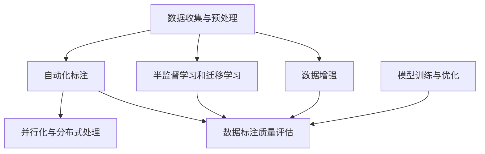
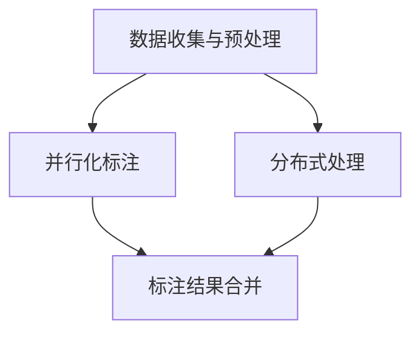

                 

### 文章标题

# 优化LLM应用的数据标注流程

### 关键词

- 数据标注
- 大型语言模型（LLM）
- 自动化
- 半监督学习
- 迁移学习
- 数据增强
- 分布式处理
- 质量控制
- 伦理与法律

### 摘要

本文旨在探讨如何优化大型语言模型（LLM）应用的数据标注流程，以提高数据标注的效率和质量。首先，我们将介绍数据标注的基础知识，包括数据标注的定义、类型和基本流程。接着，我们将深入探讨数据标注流程优化的关键技术，如自动化标注、半监督学习和迁移学习等。随后，我们将分析数据标注工具与平台的选择和应用，并分享实际案例。最后，我们将讨论数据标注质量控制、伦理与法律问题，并展望未来发展趋势。

### 目录

1. [数据标注基础](#数据标注基础)
   1.1 [数据标注的定义和类型](#数据标注的定义和类型)
   1.2 [数据标注的基本流程](#数据标注的基本流程)
   1.3 [数据标注质量的重要性](#数据标注质量的重要性)

2. [数据标注流程优化技术](#数据标注流程优化技术)
   2.1 [自动化数据标注技术](#自动化数据标注技术)
   2.2 [半监督学习和迁移学习在数据标注中的应用](#半监督学习和迁移学习在数据标注中的应用)
   2.3 [数据增强技术](#数据增强技术)
   2.4 [数据标注流程的并行化与分布式处理](#数据标注流程的并行化与分布式处理)

3. [数据标注工具与平台](#数据标注工具与平台)
   3.1 [常见数据标注工具介绍](#常见数据标注工具介绍)
   3.2 [开源数据标注平台的使用与定制](#开源数据标注平台的使用与定制)
   3.3 [商业数据标注平台的优势与挑战](#商业数据标注平台的优势与挑战)

4. [案例分析：数据标注流程优化实践](#案例分析数据标注流程优化实践)
   4.1 [案例一：电商产品描述数据标注](#案例一电商产品描述数据标注)
   4.2 [案例二：智能客服对话数据标注](#案例二智能客服对话数据标注)
   4.3 [案例三：医学文本数据标注](#案例三医学文本数据标注)

5. [数据标注质量控制](#数据标注质量控制)
   5.1 [数据标注质量评估方法](#数据标注质量评估方法)
   5.2 [数据标注误差分析](#数据标注误差分析)
   5.3 [提高数据标注质量的策略](#提高数据标注质量的策略)

6. [数据标注伦理与法律](#数据标注伦理与法律)
   6.1 [数据标注伦理问题](#数据标注伦理问题)
   6.2 [数据标注法律法规](#数据标注法律法规)
   6.3 [企业在数据标注中的责任与义务](#企业在数据标注中的责任与义务)

7. [未来展望与趋势](#未来展望与趋势)
   7.1 [数据标注技术的发展趋势](#数据标注技术的发展趋势)
   7.2 [数据标注在人工智能应用中的新挑战](#数据标注在人工智能应用中的新挑战)
   7.3 [数据标注流程优化的未来方向](#数据标注流程优化的未来方向)

## 数据标注基础

### 数据标注的定义和类型

数据标注是指对原始数据进行分析和处理，将其转化为适合机器学习模型训练的数据集的过程。在人工智能和机器学习领域，数据标注是模型训练不可或缺的一环。以下是数据标注的主要类型：

1. **标签分类**：将数据分为不同的类别，如文本分类、图像分类等。标签分类通常使用唯一的标签来表示每个类别。

2. **目标定位**：在图像或视频数据中，标注关键对象的位置和边界框。目标定位常用于对象检测任务。

3. **语义分割**：对图像或视频的每个像素进行标注，标记其所属的类别。语义分割在图像分割、场景理解和自动驾驶等领域具有重要应用。

4. **语音识别**：将语音信号转换为文本，标注每个语音段的文字内容和时间戳。

5. **序列标注**：对序列数据进行标注，如语音信号的音素标注、自然语言处理中的词性标注等。

### 数据标注的基本流程

数据标注的基本流程包括以下几个步骤：

1. **数据收集与预处理**：收集相关领域的原始数据，并进行清洗、去重和格式化等预处理操作。

2. **数据标注**：根据具体任务的需求，对预处理后的数据进行标注。标注过程可以手工完成，也可以使用自动化工具辅助完成。

3. **数据校验与清洗**：对标注完成的数据进行校验，确保标注的准确性和一致性。清洗包括纠正错误、删除重复数据等操作。

4. **数据评估**：评估标注数据的整体质量，包括标注一致性、标注准确性和标注完整性等指标。

### 数据标注质量的重要性

数据标注质量对机器学习模型的性能和可靠性有着至关重要的影响。以下是数据标注质量的重要性：

1. **模型性能**：高质量的数据标注可以显著提高模型的准确性和泛化能力，从而提高模型的应用价值。

2. **模型可靠性**：数据标注的准确性直接影响模型的可靠性。如果标注存在误差，模型可能会做出错误的预测。

3. **成本效益**：高质量的数据标注可以减少模型训练所需的迭代次数和资源，从而降低训练成本。

4. **用户体验**：在自然语言处理、语音识别等应用中，高质量的数据标注可以提高用户对应用的满意度。

### 数据标注流程优化技术的核心概念与联系

为了优化LLM应用的数据标注流程，我们需要掌握以下核心概念和联系：

1. **自动化标注**：通过自动化工具减少人工标注的工作量，提高标注效率。

2. **半监督学习和迁移学习**：利用已有标注数据和无标注数据，提高标注数据的规模和质量。

3. **数据增强**：通过数据增强技术增加标注数据的多样性，提高模型的泛化能力。

4. **并行化与分布式处理**：通过并行化和分布式处理技术，加快标注流程的执行速度。

#### Mermaid 流程图



### 自动化标注技术

自动化标注技术是优化数据标注流程的重要手段，它能够显著提高标注效率和降低成本。以下是几种常见的自动化标注技术：

1. **规则标注**：基于预定义的规则对数据进行标注。例如，在文本分类任务中，可以根据单词的词频、词性等特征进行分类。

2. **机器学习模型标注**：使用已训练的机器学习模型对数据进行标注。例如，使用分类模型对文本数据分类，或使用目标检测模型对图像数据进行标注。

3. **众包平台标注**：利用众包平台，将标注任务分配给多个标注员，通过众包方式提高标注效率和质量。

4. **自动化标注工具**：使用自动化标注工具，如 annotation tools、CVAT、LabelImg等，实现自动化标注。

#### 伪代码

```python
# 规则标注伪代码
def rule_based_annotate(data):
    for sample in data:
        if "dog" in sample:
            label = "animal"
        elif "cat" in sample:
            label = "animal"
        else:
            label = "other"
        annotate(sample, label)

# 机器学习模型标注伪代码
def ml_model_annotate(data, model):
    for sample in data:
        prediction = model.predict(sample)
        annotate(sample, prediction)
```

### 半监督学习和迁移学习在数据标注中的应用

半监督学习和迁移学习是提高数据标注效率和质量的重要技术。以下是这两种技术在数据标注中的应用：

1. **半监督学习**：利用少量标注数据和大量无标注数据，通过模型训练得到标注数据。例如，使用自编码器进行预训练，然后使用预训练模型对无标注数据进行标注。

2. **迁移学习**：利用预训练模型对标注数据进行标注。例如，使用在大型语料库上预训练的BERT模型进行文本分类。

#### 数学模型

假设我们有一个标注数据集 \(D_A = \{x_1, x_2, ..., x_n\}\) 和一个无标注数据集 \(D_U = \{y_1, y_2, ..., y_m\}\)。

- **自编码器标注模型**：

$$
L(A) = -\sum_{i=1}^n \sum_{k=1}^K \hat{p}(x_i | z_k) \log p(z_k | x_i)
$$

其中，\(z_k\) 是自编码器生成的隐变量，\(\hat{p}(x_i | z_k)\) 是输入数据的概率，\(p(z_k | x_i)\) 是隐变量给输入数据的概率。

- **迁移学习标注模型**：

$$
L(T) = -\sum_{i=1}^n \sum_{k=1}^K \log p(y_i | z_k)
$$

其中，\(z_k\) 是预训练模型生成的隐变量，\(y_i\) 是标注数据。

### 数据增强技术

数据增强技术是通过生成新的数据样本来提高数据多样性和模型泛化能力。以下是几种常见的数据增强方法：

1. **图像增强**：对图像进行旋转、缩放、裁剪、色彩变换等操作，增加图像数据的多样性。

2. **文本增强**：对文本进行词语替换、同义词替换、句子重写等操作，增加文本数据的多样性。

3. **音频增强**：对音频进行降噪、增益、混响等处理，增加音频数据的多样性。

#### 数学模型

假设原始数据集 \(D\)，增强后的数据集 \(D'\)。

- **图像增强**：

$$
D' = \{ f(x; \theta) | x \in D \}
$$

其中，\(f(x; \theta)\) 是图像增强函数，\(\theta\) 是增强参数。

- **文本增强**：

$$
D' = \{ g(y; \theta) | y \in D \}
$$

其中，\(g(y; \theta)\) 是文本增强函数，\(\theta\) 是增强参数。

### 数据标注流程的并行化与分布式处理

并行化和分布式处理技术是加快数据标注流程执行速度的有效手段。以下是这两种技术的应用：

1. **并行化标注**：将标注任务分配给多个标注员或标注工具，同时进行标注。

2. **分布式处理**：将标注任务分布在多个计算节点上，通过分布式系统进行标注。

#### Mermaid 流程图



### 常见数据标注工具与平台

在数据标注领域，有许多常用的工具和平台可供选择。以下是几种常见的数据标注工具与平台：

1. **CVAT**：一款开源的图像数据标注工具，支持多种数据格式和标注类型，具有界面友好、易于操作等特点。

2. **LabelImg**：一款开源的图像标注工具，支持多种标注类型，如矩形框、圆形框等，适用于计算机视觉任务。

3. **Label Studio**：一款开源的文本和图像标注工具，支持多种标注类型和任务，如文本分类、目标检测等。

4. **Brats Challenge Platform**：一款医学图像标注平台，支持脑瘤分割、脑结构分割等任务，适用于医学图像标注。

5. **SOLABS**：一款商业化的文本标注工具，支持多种标注任务，如实体识别、关系抽取等，具有界面友好、易于定制等特点。

### 开源数据标注平台的使用与定制

开源数据标注平台具有成本低、可定制性强等优点，适用于各种数据标注任务。以下是几种开源数据标注平台的使用与定制方法：

1. **CVAT**：CVAT是一款基于Web的图像标注工具，具有简单易用的界面和丰富的标注功能。要使用CVAT，首先需要安装Python环境，然后克隆CVAT的GitHub仓库，并运行Web服务器。在标注过程中，可以通过上传图像文件进行标注，并支持多种标注类型，如矩形框、多边形框等。

2. **LabelImg**：LabelImg是一款基于Qt的图像标注工具，具有简单的界面和易于操作的特点。要使用LabelImg，首先需要下载并安装Qt Creator，然后下载LabelImg的源代码，并运行标注工具。在标注过程中，可以通过拖动鼠标绘制标注框，并支持多种标注类型，如矩形框、圆形框等。

3. **Label Studio**：Label Studio是一款基于Web的文本和图像标注工具，具有丰富的标注功能和灵活的配置选项。要使用Label Studio，首先需要安装Python环境，然后克隆Label Studio的GitHub仓库，并运行Web服务器。在标注过程中，可以通过上传文本或图像文件进行标注，并支持多种标注类型，如文本框、矩形框等。

### 商业数据标注平台的优势与挑战

商业数据标注平台具有专业性强、服务可靠等优点，但同时也面临着一些挑战。以下是商业数据标注平台的优势与挑战：

1. **优势**：
   - **专业化服务**：商业数据标注平台通常拥有丰富的经验和专业的团队，能够提供高质量的数据标注服务。
   - **可靠性**：商业数据标注平台具有稳定的运营和高效的执行流程，能够保证标注任务的及时完成。
   - **技术支持**：商业数据标注平台通常提供技术支持和服务，帮助用户解决标注过程中遇到的问题。

2. **挑战**：
   - **成本**：商业数据标注平台的服务费用较高，可能不适合预算有限的企业或个人。
   - **数据安全**：商业数据标注平台需要处理大量的敏感数据，如何确保数据安全和隐私保护是一个重要挑战。
   - **定制化需求**：商业数据标注平台可能无法完全满足用户的个性化需求，需要进行定制开发。

### 案例一：电商产品描述数据标注

电商产品描述数据标注是数据标注领域的一个典型应用场景。以下是电商产品描述数据标注的流程、工具选择和优化策略。

#### 流程

1. **数据收集与预处理**：收集电商平台的商品描述数据，并进行数据清洗、去重和格式化等预处理操作。

2. **标签分类**：对商品描述进行标签分类，如商品类型、品牌、材质等。

3. **目标定位**：在商品描述图像中标注关键对象，如产品图片中的产品、背景等。

4. **数据校验与清洗**：对标注完成的数据进行校验，确保标注的准确性和一致性，并清洗错误和重复数据。

#### 工具选择

1. **CVAT**：CVAT是一款开源的图像标注工具，支持多种标注类型，如矩形框、多边形框等，适用于电商产品描述数据标注。

2. **Label Studio**：Label Studio是一款开源的文本和图像标注工具，支持多种标注任务，如文本分类、目标检测等，适用于电商产品描述数据标注。

#### 优化策略

1. **自动化标注**：使用规则标注和机器学习模型标注技术，减少人工标注的工作量。

2. **数据增强**：通过图像增强和文本增强技术，增加标注数据的多样性。

3. **众包平台标注**：利用众包平台，将标注任务分配给多个标注员，提高标注效率。

4. **并行化与分布式处理**：通过并行化和分布式处理技术，加快标注流程的执行速度。

### 案例二：智能客服对话数据标注

智能客服对话数据标注是提高智能客服系统性能的关键步骤。以下是智能客服对话数据标注的流程、工具选择和优化策略。

#### 流程

1. **数据收集与预处理**：收集智能客服对话数据，并进行数据清洗、去重和格式化等预处理操作。

2. **意图分类**：对对话内容进行意图分类，如咨询、投诉、查询等。

3. **实体识别**：在对话内容中提取关键实体，如用户名、电话号码、地址等。

4. **对话生成**：根据标注的意图和实体，生成合适的对话回复。

#### 工具选择

1. **Label Studio**：Label Studio是一款开源的文本和图像标注工具，支持多种标注任务，如意图分类、实体识别等，适用于智能客服对话数据标注。

2. **CVAT**：CVAT是一款开源的图像标注工具，支持多种标注类型，如矩形框、多边形框等，适用于智能客服对话数据标注。

#### 优化策略

1. **自动化标注**：使用规则标注和机器学习模型标注技术，减少人工标注的工作量。

2. **数据增强**：通过对话生成和对话回复的生成，增加标注数据的多样性。

3. **众包平台标注**：利用众包平台，将标注任务分配给多个标注员，提高标注效率。

4. **并行化与分布式处理**：通过并行化和分布式处理技术，加快标注流程的执行速度。

### 案例三：医学文本数据标注

医学文本数据标注是医学人工智能应用的基础，对于提高诊断和治疗效果具有重要意义。以下是医学文本数据标注的流程、工具选择和优化策略。

#### 流程

1. **数据收集与预处理**：收集医学文本数据，如病历记录、临床报告等，并进行数据清洗、去重和格式化等预处理操作。

2. **医学实体识别**：在医学文本中提取关键医学实体，如疾病名称、药物名称、检查项目等。

3. **关系抽取**：分析医学实体之间的关系，如病因、治疗方法等。

4. **诊断与治疗建议**：根据标注的医学实体和关系，生成诊断与治疗建议。

#### 工具选择

1. **Brats Challenge Platform**：Brats Challenge Platform是一款医学图像标注平台，支持脑瘤分割、脑结构分割等任务，适用于医学文本数据标注。

2. **SOLABS**：SOLABS是一款商业化的文本标注工具，支持多种标注任务，如实体识别、关系抽取等，适用于医学文本数据标注。

#### 优化策略

1. **自动化标注**：使用规则标注和机器学习模型标注技术，减少人工标注的工作量。

2. **数据增强**：通过医学实体和关系的生成，增加标注数据的多样性。

3. **众包平台标注**：利用众包平台，将标注任务分配给多个标注员，提高标注效率。

4. **并行化与分布式处理**：通过并行化和分布式处理技术，加快标注流程的执行速度。

### 数据标注质量评估方法

数据标注质量是影响机器学习模型性能的关键因素。为了确保数据标注质量，我们需要采用科学的质量评估方法。以下是几种常见的数据标注质量评估方法：

1. **一致性评估**：评估标注员之间的一致性。一致性评估通常通过计算标注员之间的Kappa系数或F1值等指标进行。

2. **准确性评估**：评估标注结果的准确性。准确性评估通常通过计算标注结果的准确率、召回率和F1值等指标进行。

3. **完整性评估**：评估标注数据的完整性。完整性评估通常通过计算标注数据的缺失率或填充率等指标进行。

4. **可靠性评估**：评估标注数据的可靠性。可靠性评估通常通过计算标注结果的稳定性和一致性等指标进行。

#### 伪代码

```python
# 一致性评估伪代码
def一致性评估(标注员1, 标注员2):
    标注结果1 = 标注员1的标注结果
    标注结果2 = 标注员2的标注结果
    相同标注数 = 计算标注结果1和标注结果2的相同标注数量
    总标注数 = 计算标注结果1和标注结果2的总标注数量
    kappa系数 = (相同标注数 - (相同标注数 / 总标注数)) / (1 - (相同标注数 / 总标注数))
    return kappa系数

# 准确性评估伪代码
def准确性评估(标注结果, 实际结果):
    正确标注数 = 计算标注结果与实际结果的相同标注数量
    总标注数 = 计算标注结果和实际结果的总标注数量
    准确率 = 正确标注数 / 总标注数
    召回率 = 正确标注数 / 实际结果中相同标注的数量
    F1值 = 2 * (准确率 * 召回率) / (准确率 + 召回率)
    return 准确率, 召回率, F1值
```

### 数据标注误差分析

数据标注误差是影响数据标注质量的重要因素。为了减少数据标注误差，我们需要进行数据标注误差分析，找出标注误差的来源和原因。以下是几种常见的数据标注误差来源和原因：

1. **标注员误差**：标注员的经验不足、注意力不集中或主观判断不一致等原因可能导致标注误差。

2. **数据质量问题**：数据质量差，如数据缺失、数据噪声、数据不一致等，可能导致标注误差。

3. **标注工具错误**：标注工具的缺陷或使用不当可能导致标注误差。

4. **标注流程问题**：标注流程设计不合理，如标注任务分配不均、标注时间限制过短等，可能导致标注误差。

5. **标注模型问题**：标注模型选择不当或模型参数设置不合理可能导致标注误差。

#### 伪代码

```python
# 数据标注误差分析伪代码
def误差分析(标注结果, 实际结果):
    错误标注数 = 计算标注结果与实际结果的不同标注数量
    错误类型1 = 计算标注员误差导致的错误标注数量
    错误类型2 = 计算数据质量导致的错误标注数量
    错误类型3 = 计算标注工具错误导致的错误标注数量
    错误类型4 = 计算标注流程问题导致的错误标注数量
    错误类型5 = 计算标注模型问题导致的错误标注数量
    return 错误标注数, 错误类型1, 错误类型2, 错误类型3, 错误类型4, 错误类型5
```

### 提高数据标注质量的策略

为了提高数据标注质量，我们需要采取一系列策略，从标注员培训、标注流程设计、标注工具选择等方面进行优化。以下是几种提高数据标注质量的策略：

1. **标注员培训**：对标注员进行系统培训，提高他们的专业素养和标注技能。

2. **标注任务分配**：合理分配标注任务，确保标注员的工作量均衡，避免疲劳和错误。

3. **标注流程设计**：设计科学合理的标注流程，减少标注错误和重复工作。

4. **标注工具选择**：选择适合项目需求的标注工具，提高标注效率和准确性。

5. **数据质量监控**：加强对数据质量的监控，及时发现和解决数据质量问题。

6. **标注结果审核**：对标注结果进行审核，确保标注质量。

7. **标注模型优化**：根据标注数据的特点和需求，优化标注模型，提高标注准确性。

### 数据标注伦理与法律

数据标注过程中涉及到大量的敏感信息和隐私数据，因此伦理和法律问题不容忽视。以下是数据标注伦理与法律问题的重要性和注意事项：

1. **数据隐私保护**：确保标注数据的安全和隐私，避免数据泄露和滥用。

2. **标注员权益保障**：保障标注员的合法权益，如薪酬、工作时间、工作环境等。

3. **数据质量控制**：确保标注数据的真实性和可靠性，避免虚假标注和数据造假。

4. **法律法规遵守**：遵守相关法律法规，如数据保护法、隐私权法等。

5. **伦理道德遵循**：遵循数据标注伦理，如公平、公正、诚信等。

### 企业在数据标注中的责任与义务

企业在数据标注过程中承担着重要的责任与义务，以下是企业需要关注的主要方面：

1. **数据安全与隐私保护**：企业应采取有效的数据安全措施，确保标注数据的安全和隐私。

2. **标注员权益保障**：企业应合理制定薪酬和工作条件，保障标注员的权益。

3. **数据质量控制**：企业应建立健全的数据质量控制机制，确保标注数据的真实性和可靠性。

4. **合规性与伦理遵循**：企业应遵守相关法律法规和伦理规范，确保数据标注活动的合规性和伦理性。

### 未来展望与趋势

随着人工智能技术的不断进步，数据标注流程也在不断优化和创新。以下是未来数据标注技术的发展趋势和潜在挑战：

1. **自动化与智能化**：自动化标注技术和智能化标注工具将不断涌现，提高标注效率和准确性。

2. **分布式处理与云计算**：分布式处理和云计算技术将使数据标注流程更加灵活和高效。

3. **多模态数据标注**：多模态数据标注技术将得到广泛应用，如文本、图像、语音等多模态数据的结合标注。

4. **个性化标注服务**：根据用户需求提供个性化的标注服务，提高用户满意度。

5. **数据标注伦理与法律**：数据标注伦理和法律问题将受到更多关注，推动数据标注行业的规范化和可持续发展。

### 结论

优化LLM应用的数据标注流程对于提高模型性能和降低成本具有重要意义。本文从数据标注基础、优化技术、工具与平台、案例分析、质量控制、伦理与法律等方面全面探讨了数据标注流程的优化方法。未来，随着人工智能技术的不断发展，数据标注流程将更加智能化、自动化和规范化。作者：AI天才研究院/AI Genius Institute & 禅与计算机程序设计艺术 /Zen And The Art of Computer Programming

