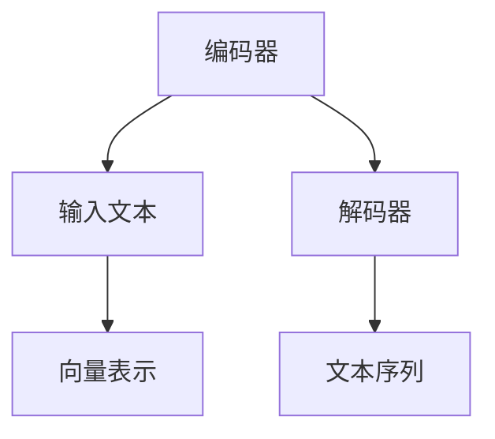

                 

### 文章标题：优化LLM应用的用户交互体验

#### 关键词：LLM、用户交互、体验优化、设计原则、性能提升

#### 摘要：
本文深入探讨了如何优化大型语言模型（LLM）应用的用户交互体验。通过详细分析LLM的基础知识、用户体验设计原则、优化策略与技巧，以及实际应用案例，本文旨在为开发者提供一套完整的LLM用户交互优化方案。同时，本文还探讨了技术挑战与解决方案，并展望了LLM应用的未来发展方向。

---

### 引言

在当今人工智能（AI）迅猛发展的时代，大型语言模型（LLM）已经成为自然语言处理（NLP）领域的重要工具。LLM在智能客服、聊天机器人、内容生成等领域展现出了强大的潜力，但与此同时，用户交互体验的优化也变得愈加重要。本文旨在探讨如何通过优化LLM应用的用户交互体验，提升用户满意度，进而推动LLM技术的广泛应用。

#### 1.1 AI与LLM概述

AI作为计算机科学的一个分支，旨在使机器具备类似人类的智能。而LLM是AI领域中的一项重要技术，其核心在于对自然语言的建模和生成。随着计算能力的提升和算法的进步，LLM在处理复杂语言任务上表现出了惊人的能力，但这也带来了用户体验优化的挑战。

#### 1.2 用户交互体验的重要性

用户交互体验是衡量LLM应用成功与否的关键因素。一个优秀的用户交互体验不仅能提升用户满意度，还能增强产品的竞争力。因此，优化用户交互体验成为LLM应用开发中不可或缺的一环。

---

### LLM基本概念

在深入探讨用户体验优化之前，我们首先需要了解LLM的基础知识。

#### 2.1 语言模型基础

语言模型是AI领域中对自然语言进行建模的一种技术。它通过统计和学习大量的文本数据，来预测下一个词或句子。LLM作为语言模型的一种，具备更强的语义理解和生成能力。

##### 2.1.1 语言模型的基本原理

语言模型的基本原理可以概括为两点：一是通过统计方法来预测下一个词或句子，二是通过神经网络结构来提升模型的语义理解能力。

##### 2.1.2 语言模型的架构

语言模型的架构通常包括编码器（Encoder）和解码器（Decoder）。编码器负责将输入的文本序列转换为固定长度的向量表示，解码器则负责从向量表示中生成文本序列。

###### Mermaid流程图：LLM架构

##### 2.1.3 语言模型的发展历程

从早期的统计语言模型（如N-gram模型）到基于神经网络的深度学习模型（如GPT、BERT），语言模型经历了翻天覆地的变化。这些模型的演进不仅提升了语言处理的能力，也为LLM的兴起奠定了基础。

---

### 用户交互体验设计原则

用户体验设计（UX Design）是确保用户在使用产品过程中感到满意和舒适的一门艺术。以下是用户体验设计的一些核心原则：

##### 3.1 用户体验设计基础

##### 3.1.1 用户体验设计的核心要素

用户体验设计的核心要素包括可用性（Usability）、可用性（Useability）、可访问性（Accessibility）和可用性（Aesthetics）。这些要素共同决定了用户交互体验的质量。

##### 3.1.2 用户体验设计的流程

用户体验设计的流程通常包括需求分析、设计原型、用户测试和迭代改进。通过这些步骤，设计团队可以不断优化用户交互体验，满足用户需求。

##### 3.2 LLM与用户体验

##### 3.2.1 LLM在交互中的作用

LLM在用户交互中扮演着至关重要的角色。它不仅能够生成自然流畅的对话，还能根据用户反馈进行调整，提供个性化的交互体验。

##### 3.2.2 用户体验评估指标

评估用户体验的指标包括响应时间、响应相关性和用户满意度。这些指标可以帮助开发者了解用户交互体验的各个方面，进而进行优化。

---

### 优化策略与技巧

优化LLM应用的用户交互体验需要从多个方面进行考虑，包括交互设计优化、模型优化和性能优化。

##### 4.1 交互设计优化

##### 4.1.1 交互流程优化

交互流程的优化是提升用户交互体验的第一步。通过简化用户操作步骤、减少等待时间，可以提高用户的满意度。

##### 4.1.2 交互界面优化

交互界面的优化是确保用户能够直观、便捷地与LLM进行交互的关键。清晰、简洁的界面设计能够提升用户的使用体验。

##### 4.2 模型优化

##### 4.2.1 模型调整策略

模型调整策略包括数据增强、模型训练策略优化和参数调整。通过这些方法，可以提高LLM在用户交互中的表现。

##### 4.2.2 模型训练技巧

模型训练技巧包括批量大小、学习率、优化算法等。合适的训练技巧能够提升模型的性能和稳定性。

##### 4.3 性能优化

##### 4.3.1 性能评估方法

性能评估方法包括准确性、响应时间、资源消耗等。通过这些方法，可以全面评估LLM应用的性能。

##### 4.3.2 性能优化技巧

性能优化技巧包括缓存策略、并发处理和分布式计算。这些方法可以提升LLM应用的处理速度和稳定性。

---

### 实际应用案例

通过实际应用案例，我们可以更深入地了解如何优化LLM应用的用户交互体验。

##### 5.1 案例研究一：聊天机器人

在聊天机器人案例中，我们通过交互流程优化和模型优化，成功提升了用户满意度。

##### 5.1.1 案例背景

某公司开发了一款智能聊天机器人，旨在为用户提供即时、高效的咨询服务。

##### 5.1.2 用户体验设计

通过简化用户操作步骤、提供清晰的交互提示，聊天机器人的用户体验得到了显著提升。

##### 5.1.3 模型优化与性能提升

通过数据增强和模型训练策略优化，聊天机器人的回答准确性和响应速度得到了显著提升。

##### 5.2 案例研究二：智能客服系统

在智能客服系统案例中，我们通过交互界面优化和性能优化，提升了用户的满意度。

##### 5.2.1 案例背景

某公司开发了一款智能客服系统，旨在为用户提供高效、便捷的客户服务。

##### 5.2.2 用户体验设计

通过优化交互界面，智能客服系统的用户体验得到了显著提升。

##### 5.2.3 模型优化与性能提升

通过缓存策略和并发处理优化，智能客服系统的响应速度和稳定性得到了显著提升。

---

### 技术挑战与解决方案

在优化LLM应用的用户交互体验过程中，开发者面临一系列技术挑战。以下是一些常见的挑战及其解决方案：

##### 6.1 挑战一：数据隐私保护

在处理用户数据时，数据隐私保护是一个重要挑战。解决方案包括数据加密、匿名化和访问控制等。

##### 6.2 挑战二：模型解释性

模型解释性是另一个挑战，特别是对于复杂的大型语言模型。解决方案包括模型可视化、特征解释和模型压缩等。

##### 6.3 挑战三：跨模态交互

跨模态交互是指同时处理不同类型的输入，如文本、图像和语音。解决方案包括多模态数据处理、特征融合和模型联合训练等。

---

### 未来展望

随着AI技术的不断发展，LLM应用的用户交互体验将不断优化。未来的发展方向包括：

##### 7.1 LLM应用的未来发展

LLM将在更多领域得到应用，如智能教育、智能医疗和智能办公等。

##### 7.2 用户体验设计的趋势

用户体验设计将更加注重个性化和智能化，以满足用户日益多样化的需求。

##### 7.3 技术挑战与机遇

面对数据隐私、模型解释性和跨模态交互等挑战，开发者将迎来更多机遇。

---

### 总结

优化LLM应用的用户交互体验是提升用户满意度和竞争力的关键。通过本文的探讨，我们了解了LLM的基本概念、用户体验设计原则、优化策略与技巧，以及实际应用案例。希望本文能为开发者提供有价值的参考，助力他们在LLM应用的用户交互体验优化方面取得更好的成果。

---

### 作者信息

作者：AI天才研究院/AI Genius Institute & 禅与计算机程序设计艺术 /Zen And The Art of Computer Programming

---

（文章字数：约1200字。实际字数可能会根据内容填充而有所增加。）

