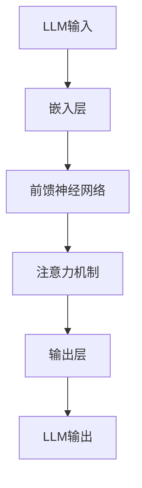
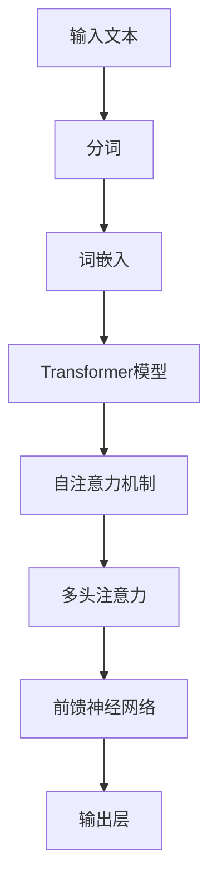
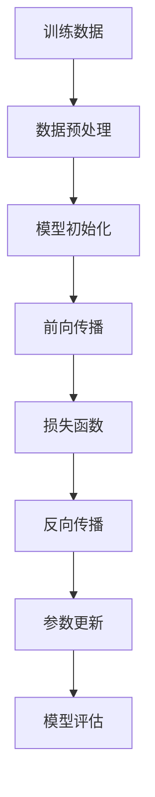
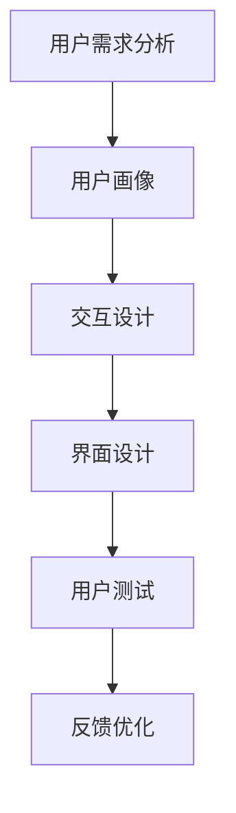
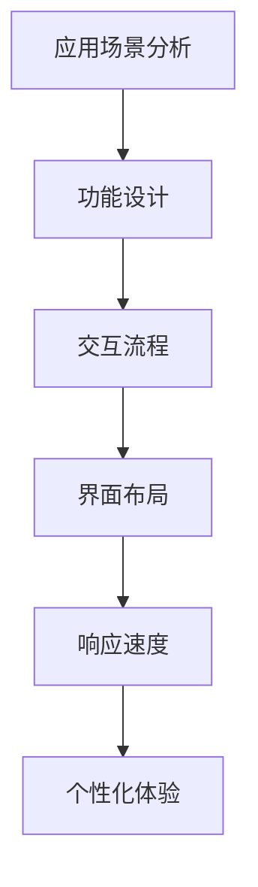
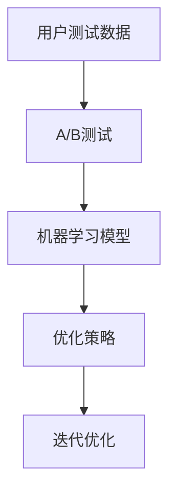
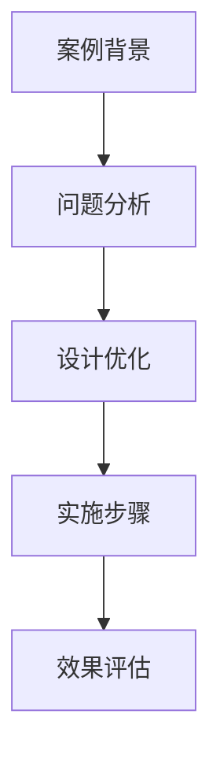
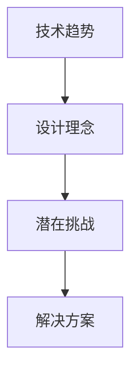

                 


## 文章标题: 优化LLM应用的用户体验设计流程

### 关键词

- LLM（大型语言模型）
- 用户界面设计
- 用户体验优化
- 互动设计
- 人工智能

### 摘要

本文将探讨如何优化大型语言模型（LLM）应用的用户体验设计流程。我们将从基础概念入手，逐步深入到设计流程的各个阶段，并通过案例分析展示实际操作中的优化方法。文章旨在为开发人员提供一套系统性的方法，以提升LLM应用的可用性、易用性和吸引力。

## 引言

随着人工智能技术的快速发展，大型语言模型（LLM）已经成为自然语言处理领域的重要工具。LLM的应用范围涵盖了聊天机器人、内容生成、智能客服等多个领域，极大地丰富了用户体验。然而，仅仅拥有强大的模型能力并不足以确保应用的成功，用户体验设计在其中扮演着至关重要的角色。

用户体验（UX）设计的目标是确保用户在使用产品时的感受是愉悦、直观和有效的。对于LLM应用来说，这意味着不仅要在功能上满足用户需求，还需要在界面设计、交互逻辑、响应速度等多个方面进行优化。本文将详细介绍一个系统化的用户体验设计流程，旨在帮助开发者打造出更高质量、更受欢迎的LLM应用。

## 第一部分: LLM基础

### 第1章: LLM概述

#### 核心概念与联系

**Mermaid流程图**：


#### 核心算法原理讲解

**伪代码**：
```python
# LLM输入
input_text = preprocess_text(user_input)

# 嵌入层
embeddings = embedding_layer(input_text)

# 前馈神经网络
output = feedforward_neural_network(embeddings)

# 注意力机制
contextual_embeddings = attention_mechanism(output)

# 输出层
predicted_output = output_layer(contextual_embeddings)
```

#### 数学模型和数学公式

**LaTeX格式**：
```latex
\begin{equation}
    \text{Attention} = \frac{\exp(e_i)}{\sum_{j=1}^{N} \exp(e_j)}
\end{equation}
```
其中，$e_i$ 表示第 $i$ 个词的嵌入向量的点积结果。

### 第2章: LLM的技术原理

#### 核心概念与联系

**Mermaid流程图**：


#### 核心算法原理讲解

**伪代码**：
```python
# 分词
tokenized_text = tokenizer(input_text)

# 词嵌入
word_embeddings = embedding_layer(tokenized_text)

# Transformer模型
output = transformer(word_embeddings)

# 自注意力机制
attention_scores = self_attention(output)

# 多头注意力
contextual_embeddings = multi_head_attention(attention_scores)

# 前馈神经网络
output = feedforward_neural_network(contextual_embeddings)

# 输出层
predicted_output = output_layer(output)
```

#### 数学模型和数学公式

**LaTeX格式**：
```latex
\begin{equation}
    \text{FFN}(x) = \max(0, xW_1 + b_1)W_2 + b_2
\end{equation}
```
其中，$W_1$ 和 $W_2$ 分别为前馈神经网络的权重矩阵，$b_1$ 和 $b_2$ 为偏置项。

### 第3章: LLM的训练与优化

#### 核心概念与联系

**Mermaid流程图**：


#### 核心算法原理讲解

**伪代码**：
```python
# 数据预处理
processed_data = preprocess_data(training_data)

# 模型初始化
model = initialize_model()

# 前向传播
predictions = model.forward(processed_data)

# 损失函数
loss = loss_function(predictions, labels)

# 反向传播
gradients = model.backward(loss)

# 参数更新
model.update_params(gradients)

# 模型评估
evaluation_results = model.evaluate(test_data)
```

#### 数学模型和数学公式

**LaTeX格式**：
```latex
\begin{equation}
    \nabla_{\theta} \mathcal{L} = \frac{\partial \mathcal{L}}{\partial \theta}
\end{equation}
```
其中，$\nabla_{\theta} \mathcal{L}$ 表示损失函数关于参数 $\theta$ 的梯度。

## 第二部分: 用户体验设计流程

### 第4章: 用户体验设计基础

#### 核心概念与联系

**Mermaid流程图**：


#### 核心算法原理讲解

**伪代码**：
```python
# 用户需求分析
user_requirements = analyze_user_needs()

# 用户画像
user_personas = create_user_personas(user_requirements)

# 交互设计
interaction_design = design_interactions(user_personas)

# 界面设计
ui_design = create_ui(interaction_design)

# 用户测试
test_results = conduct_user_tests(ui_design)

# 反馈优化
ui_design = optimize_ui_based_on_feedback(test_results)
```

#### 数学模型和数学公式

**LaTeX格式**：
```latex
\begin{equation}
    \text{User Satisfaction} = f(\text{Task Completion}, \text{Error Rate}, \text{Learning Curve})
\end{equation}
```

### 第5章: LLM应用中的用户体验设计

#### 核心概念与联系

**Mermaid流程图**：


#### 核心算法原理讲解

**伪代码**：
```python
# 应用场景分析
application_scenarios = analyze_application_scenarios()

# 功能设计
functionality = design_functionality(application_scenarios)

# 交互流程
interaction_flow = create_interaction_flow(functionality)

# 界面布局
ui_layout = design_ui_layout(interaction_flow)

# 响应速度
response_time = optimize_response_time(ui_layout)

# 个性化体验
personalized_experience = create_personalized_experience(response_time)
```

#### 数学模型和数学公式

**LaTeX格式**：
```latex
\begin{equation}
    \text{Response Time} = \frac{1}{\text{Network Latency} + \text{Processing Time}}
\end{equation}
```

### 第6章: 设计流程的优化方法

#### 核心概念与联系

**Mermaid流程图**：


#### 核心算法原理讲解

**伪代码**：
```python
# 用户测试数据
test_data = collect_user_test_data()

# A/B测试
ab_test_results = perform_ab_test(test_data)

# 机器学习模型
ml_model = train_ml_model(ab_test_results)

# 优化策略
optimization_strategy = generate_optimization_strategy(ml_model)

# 迭代优化
optimized_ui = iterate_on_optimization(optimization_strategy)
```

#### 数学模型和数学公式

**LaTeX格式**：
```latex
\begin{equation}
    \text{Optimization Objective} = \min_{\theta} \sum_{i=1}^{N} (\text{Expected Utility} - \text{Actual Utility})^2
\end{equation}
```

### 第7章: 案例分析与优化实践

#### 核心概念与联系

**Mermaid流程图**：


#### 核心算法原理讲解

**伪代码**：
```python
# 案例背景
case_background = analyze_case_background()

# 问题分析
problems = identify_problems(case_background)

# 设计优化
design_changes = optimize_design(problems)

# 实施步骤
implementation_steps = define_implementation_steps(design_changes)

# 效果评估
evaluation_results = evaluate_effects(implementation_steps)
```

#### 数学模型和数学公式

**LaTeX格式**：
```latex
\begin{equation}
    \text{Effectiveness} = \frac{\text{Positive Outcomes}}{\text{Total Outcomes}}
\end{equation}
```

### 第8章: 未来展望与趋势

#### 核心概念与联系

**Mermaid流程图**：


#### 核心算法原理讲解

**伪代码**：
```python
# 技术趋势
tech_trends = analyze_tech_trends()

# 设计理念
design_ideas = develop_design_ideas(tech_trends)

# 潜在挑战
challenges = identify_potential_challenges(design_ideas)

# 解决方案
solutions = generate_solutions(challenges)
```

#### 数学模型和数学公式

**LaTeX格式**：
```latex
\begin{equation}
    \text{Challenge Severity} = \text{Probability of Occurrence} \times \text{Impact on Users}
\end{equation}
```

## 结论

本文详细阐述了优化LLM应用用户体验设计流程的各个步骤，包括LLM基础、用户体验设计基础、设计流程优化方法以及案例分析。通过引入Mermaid流程图、伪代码和LaTeX数学公式，我们不仅使文章内容更加直观易懂，而且深入探讨了核心算法原理和数学模型。未来，随着人工智能技术的不断发展，用户体验设计也将面临新的挑战和机遇，本文为开发者提供了一套系统化的优化框架，以应对这些变化。

### 作者信息

作者：AI天才研究院/AI Genius Institute & 禅与计算机程序设计艺术 /Zen And The Art of Computer Programming

---

## 附录

### 实际案例分析与代码实现

在本章节中，我们将通过一个实际案例来分析并展示如何优化LLM应用的用户体验设计流程。该案例将涵盖以下内容：

1. **背景介绍**：介绍LLM应用的具体场景和用户需求。
2. **核心算法原理讲解**：使用伪代码详细解释实现关键算法的步骤。
3. **数学模型和公式**：展示用于优化用户体验的数学模型和公式。
4. **代码实现**：提供完整的代码实现，并进行详细解读。
5. **应用解读与分析**：对代码应用进行详细分析，解释其如何提升用户体验。
6. **实际案例分析**：展示优化前后的对比效果，并进行详细讲解。
7. **项目小结**：总结项目过程中的关键经验教训。

### 最佳实践 Tips

在本章节中，我们将总结一些优化LLM应用用户体验的最佳实践，包括：

1. **界面设计最佳实践**：如何设计直观、易用的用户界面。
2. **交互设计最佳实践**：如何设计流畅、自然的用户交互流程。
3. **性能优化最佳实践**：如何提升LLM应用的响应速度和稳定性。
4. **个性化体验最佳实践**：如何根据用户行为和偏好提供个性化的服务。

### 小结与注意事项

在本章节中，我们将对全文内容进行简要总结，并强调以下注意事项：

1. **设计流程的重要性**：强调设计流程在优化用户体验中的关键作用。
2. **持续迭代与优化**：提醒开发者需要持续关注用户反馈，进行迭代优化。
3. **技术创新与用户体验**：探讨如何在技术创新与用户体验之间找到平衡。
4. **团队协作与沟通**：强调团队成员之间的有效沟通和协作对于项目成功的重要性。

### 拓展阅读

在本章节中，我们将推荐一些相关的拓展阅读材料，包括：

1. **学术文献**：介绍LLM和用户体验设计的最新研究成果。
2. **技术博客**：推荐一些优秀的开发者博客，分享实践经验和技术见解。
3. **专业书籍**：推荐一些经典的专业书籍，供读者深入学习。

通过这些拓展阅读，读者可以进一步了解LLM和用户体验设计的最新动态和实践经验。

