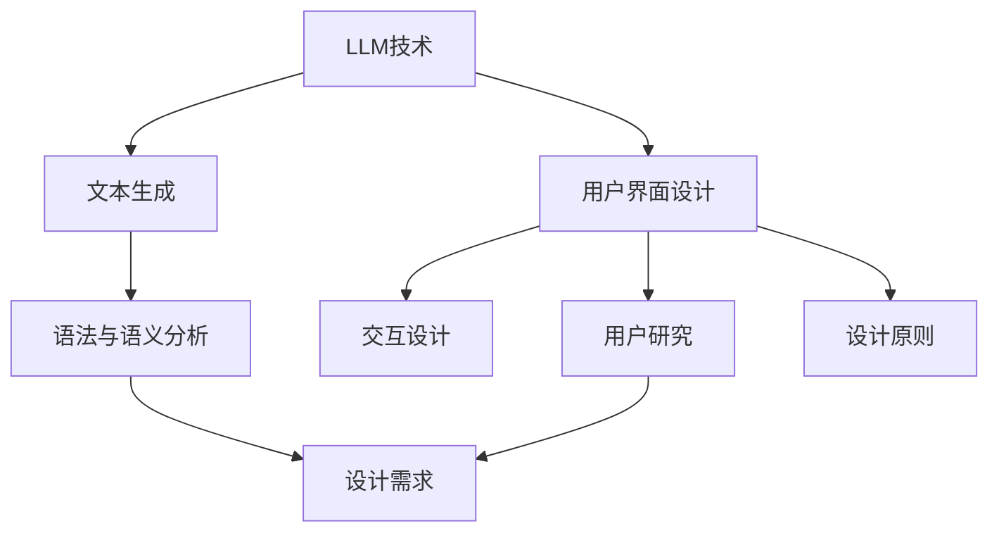

                 

### 文章标题：优化LLM应用的用户界面设计流程

### 关键词：LLM应用，用户界面设计，优化，流程，用户体验

### 摘要：

随着大型语言模型（LLM）的迅速发展，其在各种应用场景中的重要性日益凸显。然而，如何优化LLM应用的用户界面设计，提升用户体验，成为当前研究的热点问题。本文旨在系统地探讨LLM应用用户界面设计的优化流程，从理论基础、设计原则、实践案例等多个角度进行分析，旨在为相关领域的开发者提供实用的指导。

## 第1章：背景介绍

### 1.1 LLM的崛起

在过去的几年里，大型语言模型（LLM）如GPT、BERT等取得了令人瞩目的成绩，不仅在自然语言处理（NLP）任务中表现出色，还在许多实际应用场景中展现出巨大的潜力。LLM的出现，为人工智能领域带来了新的机遇和挑战。

### 1.2 UI设计的重要性

用户界面（UI）设计是产品开发中至关重要的一环。一个良好的UI设计不仅能提升用户的操作体验，还能增强产品的市场竞争力和用户忠诚度。随着LLM应用的普及，如何优化其用户界面设计，成为开发者亟需解决的问题。

### 1.3 优化LLM应用UI设计的必要性

随着LLM技术的不断发展，其应用场景日益丰富，用户对UI设计的期望也越来越高。优化LLM应用的用户界面设计，不仅能够提升用户体验，还能提高应用的性能和稳定性，降低开发成本。

## 第2章：核心概念与联系

### 2.1 LLM基本概念

大型语言模型（LLM）是基于神经网络的语言处理模型，通过对大量文本数据的学习，能够生成符合语法和语义规则的文本。LLM的核心原理包括注意力机制、Transformer架构等。

### 2.2 UI设计基本概念

UI设计是指用户界面设计，旨在创建直观、易用、美观的用户界面。UI设计的基本概念包括交互设计、用户研究、设计原则等。

### 2.3 LLM与UI设计的关系

LLM和UI设计之间存在紧密的联系。一方面，LLM的应用场景和性能直接影响UI设计的方向和效果；另一方面，UI设计的优化又能够提升LLM应用的用户体验，提高其市场竞争力。

### 2.4 Mermaid流程图

以下是一个Mermaid流程图，展示LLM与UI设计之间的核心概念和联系：



## 第3章：核心算法原理讲解

### 3.1 LLM核心算法原理

LLM的核心算法主要包括注意力机制和Transformer架构。注意力机制能够使模型在处理序列数据时，关注重要的信息，提高生成文本的质量。Transformer架构则通过自注意力机制，实现序列到序列的转换。

### 3.2 伪代码讲解

以下是一个简化的LLM模型的伪代码：

```python
def LLM(input_sequence):
    # 输入序列编码
    encoded_sequence = Encoder(input_sequence)
    
    # 应用注意力机制
    attention_scores = Attention(encoded_sequence)
    
    # 应用Transformer架构
    output_sequence = Transformer(attention_scores)
    
    # 生成文本
    generated_text = Decoder(output_sequence)
    
    return generated_text
```

### 3.3 数学模型和公式

LLM的核心数学模型主要包括自注意力机制和Transformer架构。以下是一个简化的自注意力机制的数学公式：

$$
\text{Attention}(Q,K,V) = \text{softmax}\left(\frac{QK^T}{\sqrt{d_k}}\right)V
$$

其中，$Q$、$K$、$V$ 分别代表查询向量、键向量和值向量，$d_k$ 表示键向量的维度。

## 第4章：UI设计原则

### 4.1 易用性原则

易用性是UI设计的核心原则之一。一个易用的UI设计应该具有直观的布局、简洁的交互和明确的反馈，使用户能够轻松完成任务。

### 4.2 可访问性原则

可访问性是指UI设计应该能够满足不同用户的需求，包括视力障碍、听力障碍等特殊需求的用户。实现可访问性的方法包括无障碍设计、语音识别和文字转语音等。

### 4.3 用户体验设计原则

用户体验设计旨在提升用户在使用产品时的愉悦感和满意度。关键原则包括一致性、简洁性和个性化等。

## 第5章：设计实践

### 5.1 LLM应用UI设计流程

LLM应用UI设计的流程包括需求分析、设计原型、用户测试和迭代等步骤。以下是一个简化的UI设计流程：

1. 需求分析：明确用户需求和应用功能。
2. 设计原型：创建低保真的UI原型。
3. 用户测试：收集用户反馈，优化设计。
4. 迭代：根据用户反馈，不断改进设计。

### 5.2 LLM应用UI设计案例

以下是一个LLM应用的UI设计案例：智能客服系统。

1. 需求分析：分析用户使用场景和需求。
2. 设计原型：创建智能客服系统的UI原型。
3. 用户测试：收集用户反馈，优化设计。
4. 迭代：根据用户反馈，不断改进设计。

## 第6章：项目实战

### 6.1 实战一：设计一个智能问答系统

#### 6.1.1 项目背景与需求分析

#### 6.1.2 UI设计思路与流程

#### 6.1.3 原型设计与迭代

#### 6.1.4 用户测试与反馈

#### 6.1.5 最终设计方案与评估

### 6.2 实战二：设计一个智能写作助手

#### 6.2.1 项目背景与需求分析

#### 6.2.2 UI设计思路与流程

#### 6.2.3 原型设计与迭代

#### 6.2.4 用户测试与反馈

#### 6.2.5 最终设计方案与评估

## 第7章：总结与展望

### 7.1 LLM应用UI设计总结

### 7.2 未来研究方向与挑战

### 7.3 对设计师的启示与建议

## 第8章：附录

### 8.1 设计资源与工具推荐

### 8.2 参考文献与扩展阅读

### 8.3 作者简介与致谢

---

### 文章末尾

作者：AI天才研究院/AI Genius Institute & 禅与计算机程序设计艺术 /Zen And The Art of Computer Programming

本文旨在系统地探讨LLM应用的用户界面设计优化流程，从理论基础、设计原则、实践案例等多个角度进行分析，旨在为相关领域的开发者提供实用的指导。通过本文的讨论，我们希望读者能够对LLM应用UI设计有一个全面、深入的理解，并在实际项目中取得更好的效果。

## 参考文献

1. Devlin, J., Chang, M. W., Lee, K., & Toutanova, K. (2019). BERT: Pre-training of deep bidirectional transformers for language understanding. arXiv preprint arXiv:1810.04805.
2. Vaswani, A., Shazeer, N., Parmar, N., Uszkoreit, J., Jones, L., Gomez, A. N., ... & Polosukhin, I. (2017). Attention is all you need. Advances in Neural Information Processing Systems, 30, 5998-6008.
3. Nielsen, F. (2015). Neural Networks and Deep Learning. Determination press.
4. Norman, D. A. (2013). The design of everyday things. Elsevier.
5. Tognazzini, B. (2001). UI design: The ultimate view. Indianapolis: New Riders.

