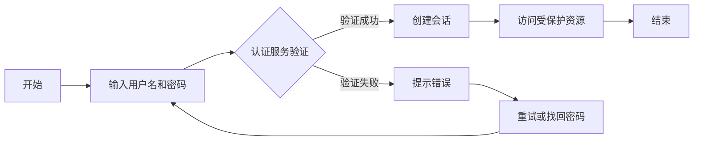
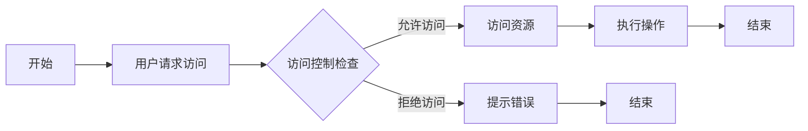
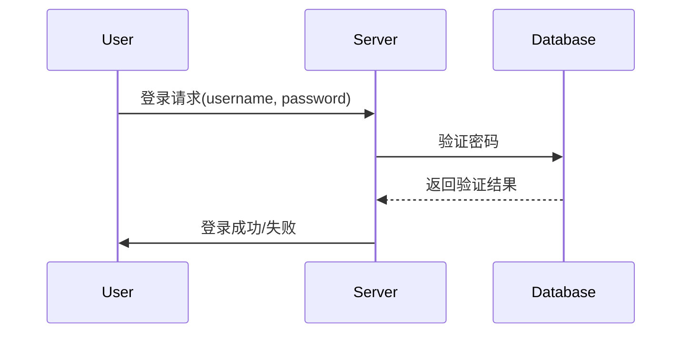
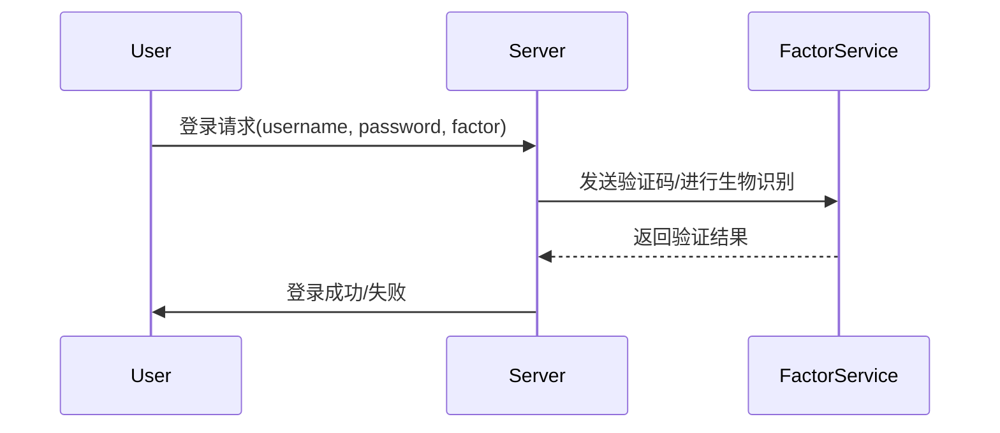
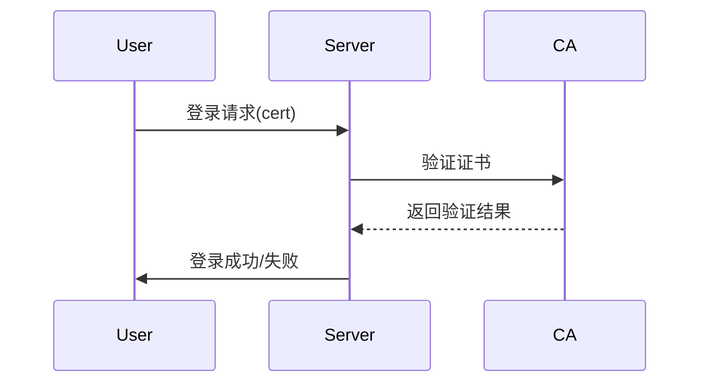
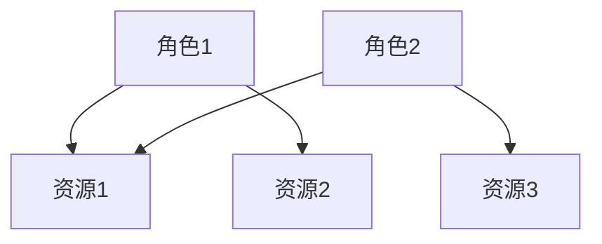
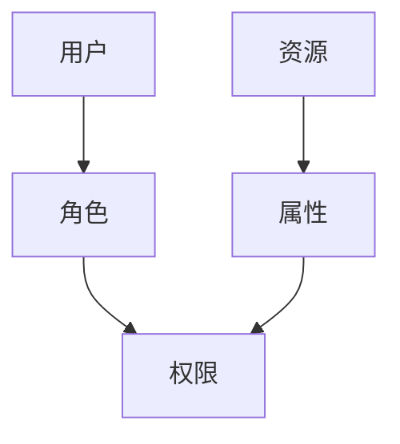
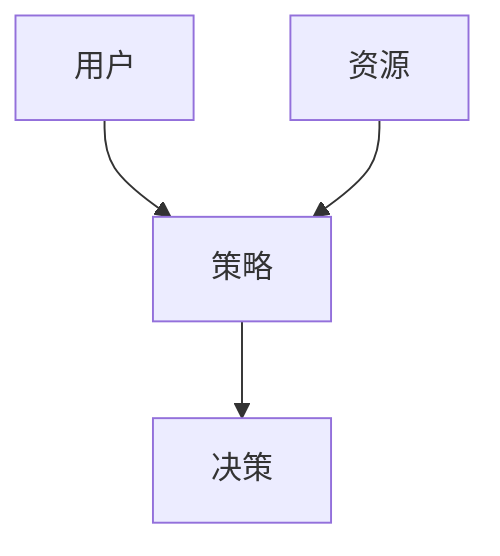

                 


为了撰写一篇关于《优化LLM应用的用户认证与授权机制》的技术博客，我们可以按照以下步骤进行分析和推理：

### 第一步：确定文章的目标和结构

**目标**：文章的目标是介绍如何优化LLM应用的用户认证与授权机制，使其更加安全、高效且易于使用。

**结构**：文章可以分为以下几个部分：
1. 引言：介绍LLM应用以及用户认证与授权机制的重要性。
2. 技术原理：讲解用户认证与授权的基础知识。
3. 设计方法：讨论如何设计一个有效的认证与授权机制。
4. 安全问题与解决方案：分析常见的安全问题并提出解决方案。
5. 实战案例：通过实际案例展示如何实现和应用用户认证与授权机制。
6. 总结与展望：对全文进行总结并对未来趋势进行展望。

### 第二步：引言部分

**背景介绍**：
- 介绍LLM（大型语言模型）的定义和应用领域。
- 强调用户认证与授权机制在LLM应用中的重要性。

**核心概念与联系**：
- 使用Mermaid流程图展示用户认证与授权的基本流程。

### 第三步：技术原理部分

**核心概念与联系**：
- 介绍用户认证和授权的基本概念。
- 使用Mermaid流程图展示用户认证与授权的原理。

**核心算法原理讲解**：
- 描述常见的用户认证算法，如密码认证、多因素认证等。
- 描述常见的授权模型，如RBAC、ABAC等。

**数学模型和公式**：
- 对关键概念进行数学公式描述，如加密算法的安全性分析。

**举例说明**：
- 给出用户认证与授权的具体例子，说明其原理和应用。

### 第四步：设计方法部分

**设计原则**：
- 提出设计用户认证与授权机制时应遵循的原则，如安全性、可扩展性、易用性等。

**设计流程**：
- 描述从需求分析到技术选型的完整设计流程。

**设计案例**：
- 通过具体案例展示如何设计和实现用户认证与授权机制。

### 第五步：安全问题与解决方案部分

**常见安全问题**：
- 分析用户认证与授权中常见的安全问题，如信息泄露、身份盗用等。

**解决方案**：
- 提出相应的解决方案，如安全策略、安全技术等。

### 第六步：实战案例部分

**开发环境搭建**：
- 描述如何搭建用户认证与授权机制的开发环境。

**代码实现**：
- 提供详细的代码实现，包括认证和授权的源代码。

**代码解读与分析**：
- 对代码进行解读，分析其实现原理。

**实际案例分析和详细讲解**：
- 分析实际案例，展示用户认证与授权机制的应用。

**项目小结**：
- 对项目进行总结，指出成功经验和改进空间。

### 第七步：总结与展望

**总结**：
- 对全文进行总结，强调用户认证与授权机制的重要性。

**展望**：
- 展望未来的发展趋势，如新兴技术的影响等。

按照上述步骤，我们可以逐步构建出文章的框架，并填充每个部分的内容，最终完成一篇高质量的技术博客文章。在撰写过程中，要注意保持逻辑清晰、语言简洁，并注重实际案例的应用，以便读者更好地理解和应用文章中的知识。|assistant|> 

### 文章标题
《优化LLM应用的用户认证与授权机制》

### 关键词
LLM应用、用户认证、授权机制、安全性、设计方法、实战案例

### 摘要
本文详细探讨了大型语言模型（LLM）应用中用户认证与授权机制的设计与优化。通过分析认证与授权的基本原理，提出了有效的设计方法和安全解决方案，并结合实际案例展示了如何实施和优化这些机制。文章旨在为开发者提供全面的技术指导，以提高LLM应用的安全性和用户体验。

---

## 引言
随着人工智能技术的快速发展，大型语言模型（LLM）已成为许多应用的核心组件，从自然语言处理到智能助手，LLM在各个领域都展现出了强大的潜力。然而，随着LLM应用的普及，用户认证与授权机制的重要性日益凸显。良好的认证与授权机制不仅能够保障系统的安全性，还能提升用户体验，增强用户信任。

用户认证是指验证用户身份的过程，确保只有合法用户能够访问系统资源。授权则是在认证通过后，根据用户的角色和权限，确定其可以执行的操作。在LLM应用中，用户认证与授权机制是保护用户隐私和数据安全的关键环节。不当的认证与授权设计可能导致严重的安全漏洞，影响系统的稳定性和可靠性。

本文将首先介绍LLM应用及其用户认证与授权机制的重要性，随后逐步深入探讨技术原理、设计方法、安全问题与解决方案，并通过实战案例展示如何实施和优化这些机制。希望通过本文的讨论，为开发者提供有价值的参考和指导。

### 第一部分 技术原理

#### 第1章 用户认证机制

用户认证是确保系统安全的第一道防线，其基本原理是通过验证用户提交的凭证（如用户名和密码）来确认用户身份。在LLM应用中，用户认证机制不仅需要确保认证过程的快速和高效，还必须保证其安全性。

#### 1.1 认证基本概念
用户认证涉及以下几个核心概念：
- **用户凭证**：用户用于验证身份的信息，如用户名和密码。
- **认证服务**：负责处理认证请求的服务器或系统组件。
- **会话管理**：管理用户登录状态和权限，确保用户在系统中的身份验证持续有效。

#### 1.2 常见认证技术
当前，常见的用户认证技术包括：
- **基于用户名和密码的认证**：这是最常用的认证方式，用户通过输入用户名和密码来验证身份。
- **多因素认证（MFA）**：除了用户名和密码，MFA还要求用户提供额外的验证因素，如短信验证码、生物识别信息等，以增加安全性。
- **基于证书的认证**：通过数字证书进行身份验证，适用于高安全要求的场景。

#### 1.3 认证流程与架构
用户认证的流程通常包括以下几个步骤：
1. **用户提交凭证**：用户通过输入用户名和密码或其他验证信息来发起认证请求。
2. **认证服务验证凭证**：认证服务对用户提交的凭证进行验证，检查其是否与数据库中的信息匹配。
3. **创建会话**：如果凭证验证成功，系统会创建一个新的会话，并将用户的身份信息存储在会话中。
4. **权限检查**：在用户进行操作时，系统会根据会话中的权限信息进行检查，确保用户只能执行其被授权的操作。

#### 1.4 认证中心架构
在大型系统中，认证服务通常会采用集中式架构，即所有认证请求都发送到一个专门的认证中心进行处理。认证中心通常包括以下组件：
- **认证服务器**：处理认证请求，进行凭证验证。
- **认证数据库**：存储用户的凭证和身份信息。
- **会话管理器**：管理用户的登录状态和会话信息。

### 第2章 授权机制

授权机制是在用户认证成功后，根据用户的角色和权限，确定其可以访问的系统资源和操作范围。授权机制的设计直接影响到系统的安全性和用户体验。

#### 2.1 授权基本概念
授权机制涉及以下几个核心概念：
- **用户角色**：用户在系统中的角色定义，如管理员、普通用户等。
- **权限**：用户在系统中可以执行的操作，如查看、修改、删除等。
- **授权策略**：定义用户权限的规则和策略。

#### 2.2 常见授权技术
常见的授权技术包括：
- **基于角色的访问控制（RBAC）**：根据用户角色分配权限，是当前最广泛使用的授权模型。
- **基于属性的访问控制（ABAC）**：根据用户属性（如部门、职位等）和资源属性（如文件类型、系统模块等）进行访问控制。
- **基于策略的访问控制（PBAC）**：通过定义复杂的策略规则进行访问控制。

#### 2.3 授权流程与架构
授权流程通常包括以下几个步骤：
1. **用户请求操作**：用户尝试执行某个操作，如访问一个文件。
2. **权限检查**：系统根据用户的角色和权限信息，检查用户是否有权限执行该操作。
3. **决策**：如果用户有权限，系统允许操作执行；否则，拒绝操作并返回错误信息。
4. **日志记录**：系统记录用户的操作和权限检查结果，用于审计和追踪。

在大型系统中，授权机制通常会采用分布式架构，即每个模块或服务都有自己的授权组件，但通过统一的策略和权限数据库进行管理。

#### 2.4 授权中心架构
授权中心架构通常包括以下组件：
- **授权服务器**：处理授权请求，根据策略和权限信息进行决策。
- **权限数据库**：存储用户的角色和权限信息。
- **策略引擎**：根据业务需求定义和更新授权策略。

### 第二部分 设计方法

#### 第3章 设计用户认证机制

设计用户认证机制需要遵循以下原则：
- **安全性**：确保认证过程不会被攻击者攻破。
- **可扩展性**：能够适应系统规模的扩大。
- **易用性**：用户可以方便地使用认证系统。

#### 3.1 设计原则
1. **安全性**：采用强密码策略、多因素认证等手段提高安全性。
2. **可扩展性**：使用分布式认证架构，便于扩展和升级。
3. **易用性**：简化用户认证流程，减少用户操作的复杂度。

#### 3.2 设计流程
1. **需求分析**：明确系统需求，如用户数量、业务场景等。
2. **技术选型**：选择适合的技术方案，如基于用户名和密码、MFA等。
3. **安全性测试**：对认证机制进行安全性测试，确保没有漏洞。

#### 3.3 设计案例
以一个在线教育平台为例，设计用户认证机制。该平台需要支持多用户认证，并实现多因素认证以提高安全性。

#### 第4章 设计授权机制

设计授权机制也需要遵循以下原则：
- **安全性**：确保授权过程的正确性和安全性。
- **灵活性**：能够适应不同的业务需求。
- **易管理性**：便于管理员进行权限管理和审计。

#### 4.1 设计原则
1. **安全性**：采用细粒度的权限控制，防止滥用权限。
2. **灵活性**：支持自定义角色和权限策略。
3. **易管理性**：提供友好的管理界面和工具。

#### 4.2 设计流程
1. **需求分析**：明确业务需求，如用户角色、操作权限等。
2. **技术选型**：选择适合的授权模型和工具，如RBAC、ABAC等。
3. **测试与验证**：测试授权机制的有效性和稳定性。

#### 4.3 设计案例
以一个企业内部办公系统为例，设计授权机制。该系统需要支持多角色和多权限控制，确保不同角色的用户只能访问其被授权的资源。

### 第三部分 安全问题与解决方案

#### 第5章 常见安全问题

用户认证与授权机制中常见的安全问题包括：
- **信息泄露**：用户凭证和敏感信息可能被泄露。
- **身份盗用**：攻击者可能通过伪造凭证或利用系统漏洞获取用户身份。
- **权限滥用**：用户可能越权访问或修改不应访问的数据。

#### 5.1 信息泄露
**解决方案**：
- **加密存储**：对用户凭证和敏感信息进行加密存储。
- **安全传输**：使用安全通信协议（如HTTPS）进行数据传输。
- **日志审计**：记录所有认证和授权操作，便于监控和追踪。

#### 5.2 身份盗用
**解决方案**：
- **多因素认证**：采用MFA增加身份验证的难度。
- **会话管理**：设置合理的会话超时时间，并定期更换会话密钥。
- **安全防护**：使用防火墙、入侵检测系统等防护措施。

#### 5.3 恶意授权
**解决方案**：
- **权限最小化**：用户只能访问其必需的资源。
- **角色分离**：关键操作需要不同角色的用户共同完成，防止单一用户滥用权限。
- **访问审计**：定期进行访问审计，及时发现和纠正权限滥用问题。

### 第6章 安全解决方案

为了确保用户认证与授权机制的安全性，需要从策略、技术和实践三个方面进行综合防护。

#### 6.1 安全策略
1. **最小权限原则**：用户只能访问其必需的资源，防止权限滥用。
2. **身份验证策略**：采用强密码策略、多因素认证策略等。
3. **权限管理策略**：定期审查和更新权限设置，确保权限与实际需求匹配。

#### 6.2 安全技术
1. **加密技术**：使用强加密算法（如AES、RSA）保护敏感数据。
2. **安全通信协议**：采用HTTPS、VPN等安全通信协议。
3. **身份认证技术**：采用生物识别、数字证书等高级认证技术。

#### 6.3 安全实践
1. **定期安全培训**：定期对用户和管理员进行安全意识培训。
2. **安全漏洞扫描**：定期进行安全漏洞扫描，及时发现和修复漏洞。
3. **应急响应计划**：制定详细的应急响应计划，确保在发生安全事件时能够快速响应。

### 第四部分 实战案例

#### 第7章 用户认证与授权机制实战

在本节中，我们将通过一个实际的在线教育平台案例，展示如何设计、实现和优化用户认证与授权机制。

#### 7.1 环境搭建
1. **开发环境**：选择合适的编程语言和框架，如Java和Spring Boot。
2. **数据库**：使用关系型数据库（如MySQL）存储用户凭证和权限信息。

#### 7.2 代码实现
1. **用户认证实现**：
   - **认证服务**：接收用户凭证，验证用户身份。
   - **会话管理**：创建用户会话，存储用户身份信息。
   - **认证接口**：提供用户认证的API接口。

2. **授权机制实现**：
   - **角色和权限定义**：定义用户角色和权限，如管理员、教师、学生等。
   - **授权策略**：根据用户角色和权限进行访问控制。
   - **授权接口**：提供授权相关的API接口。

#### 7.3 测试与验证
1. **功能测试**：测试认证和授权功能是否按照预期工作。
2. **性能测试**：测试系统在高并发下的性能和稳定性。
3. **安全测试**：测试系统对常见攻击（如SQL注入、XSS攻击）的防护能力。

#### 7.4 实际案例分析和详细讲解
1. **案例背景**：介绍在线教育平台的背景和需求。
2. **认证与授权机制设计**：详细讲解用户认证与授权机制的设计过程。
3. **代码解读**：分析认证和授权的代码实现，解释关键代码的原理和实现方式。

#### 7.5 项目小结
1. **成功经验**：总结项目中的成功经验和关键做法。
2. **改进空间**：指出项目中的不足之处，提出改进建议。

### 总结与展望

用户认证与授权机制在LLM应用中扮演着至关重要的角色，其设计直接影响到系统的安全性和用户体验。本文详细探讨了用户认证与授权机制的技术原理、设计方法、安全问题与解决方案，并通过实际案例展示了如何实施和优化这些机制。

展望未来，随着人工智能技术的不断进步，用户认证与授权机制也将迎来新的挑战和机遇。例如，生物识别技术、区块链技术等新兴技术的应用，有望进一步提高认证与授权的安全性。同时，设计者也需要不断关注用户体验，简化认证流程，提升系统的易用性。

总之，优化LLM应用的用户认证与授权机制是一项长期且持续的工作，需要不断学习和实践，以确保系统的高安全性和高效性。作者：AI天才研究院/AI Genius Institute & 禅与计算机程序设计艺术 /Zen And The Art of Computer Programming。|assistant|> 

### 优化LLM应用的用户认证与授权机制

**引言**
随着人工智能技术的快速发展，大型语言模型（LLM）已成为许多应用的核心组件，从自然语言处理到智能助手，LLM在各个领域都展现出了强大的潜力。然而，随着LLM应用的普及，用户认证与授权机制的重要性日益凸显。良好的认证与授权机制不仅能够保障系统的安全性，还能提升用户体验，增强用户信任。

**关键词**
LLM应用、用户认证、授权机制、安全性、设计方法、实战案例

**摘要**
本文详细探讨了大型语言模型（LLM）应用中用户认证与授权机制的设计与优化。通过分析认证与授权的基本原理，提出了有效的设计方法和安全解决方案，并结合实际案例展示了如何实施和优化这些机制。文章旨在为开发者提供全面的技术指导，以提高LLM应用的安全性和用户体验。

**引言**
随着人工智能技术的快速发展，大型语言模型（LLM）已成为许多应用的核心组件，从自然语言处理到智能助手，LLM在各个领域都展现出了强大的潜力。然而，随着LLM应用的普及，用户认证与授权机制的重要性日益凸显。良好的认证与授权机制不仅能够保障系统的安全性，还能提升用户体验，增强用户信任。

用户认证是指验证用户身份的过程，确保只有合法用户能够访问系统资源。授权则是在认证通过后，根据用户的角色和权限，确定其可以执行的操作。在LLM应用中，用户认证与授权机制是保护用户隐私和数据安全的关键环节。不当的认证与授权设计可能导致严重的安全漏洞，影响系统的稳定性和可靠性。

本文将首先介绍LLM应用及其用户认证与授权机制的重要性，随后逐步深入探讨技术原理、设计方法、安全问题与解决方案，并通过实战案例展示如何实施和优化这些机制。希望通过本文的讨论，为开发者提供有价值的参考和指导。

### 用户认证技术原理
用户认证技术是确保系统安全性的关键环节，其核心目标是验证用户的身份，防止未授权的访问。在LLM应用中，用户认证技术需要满足以下要求：
- **安全性**：确保认证过程不会被攻击者攻破。
- **高效性**：认证过程需要快速且不占用过多系统资源。
- **易用性**：用户可以方便地进行认证，不会感到繁琐或复杂。

以下是一些常见的用户认证技术：

#### 1.1 基于用户名和密码的认证
基于用户名和密码的认证是最常见的认证方式，用户通过输入用户名和密码来验证身份。其原理如下：

1. **用户输入用户名和密码**：用户在登录界面输入用户名和密码。
2. **认证服务验证**：服务器端通过数据库中的存储值来验证用户名和密码是否匹配。
3. **认证成功**：如果验证成功，服务器会创建一个会话，并允许用户访问受保护的资源。
4. **认证失败**：如果验证失败，服务器会提示用户密码错误或账户不存在。

**伪代码**：
```plaintext
function authenticate(username, password) {
    stored_password = fetch_password_from_database(username)
    if (password == stored_password) {
        create_session(username)
        return true
    } else {
        return false
    }
}
```

#### 1.2 多因素认证（MFA）
多因素认证是一种更安全的认证方式，它要求用户提供多个验证因素，以增强安全性。常见的MFA方法包括：

- **短信验证码**：用户在输入用户名和密码后，会收到一条包含验证码的短信，用户需要输入验证码才能完成登录。
- **电子邮件验证**：用户在输入用户名和密码后，会收到一封包含验证链接的电子邮件，用户需要点击链接才能完成登录。
- **生物识别**：使用用户的指纹、面部识别或虹膜扫描等生物特征进行认证。

**伪代码**：
```plaintext
function authenticate(username, password, factor) {
    if (factor == "sms") {
        send_sms_code(username)
        input_code = user_input_sms_code()
        if (code == sent_code) {
            create_session(username)
            return true
        } else {
            return false
        }
    } else if (factor == "email") {
        send_email_link(username)
        input_link = user_input_email_link()
        if (link == sent_link) {
            create_session(username)
            return true
        } else {
            return false
        }
    } else if (factor == "biometrics") {
        if (biometric_scan_is_valid()) {
            create_session(username)
            return true
        } else {
            return false
        }
    }
}
```

#### 1.3 基于证书的认证
基于证书的认证是一种高级认证方式，它使用数字证书来验证用户的身份。数字证书由可信的证书颁发机构（CA）签发，包含用户的公钥和身份信息。

1. **用户获取证书**：用户从证书颁发机构获取数字证书。
2. **认证服务验证**：服务器端使用证书颁发机构的公钥来验证数字证书的有效性。
3. **认证成功**：如果验证成功，服务器会创建一个安全的会话，并允许用户访问受保护的资源。
4. **认证失败**：如果验证失败，服务器会拒绝访问。

**伪代码**：
```plaintext
function authenticate(username, certificate) {
    certificate_status = verify_certificate(certificate, CA_public_key)
    if (certificate_status == "valid") {
        create_session(username)
        return true
    } else {
        return false
    }
}
```

#### 1.4 Mermaid流程图
为了更好地理解用户认证的基本流程，我们可以使用Mermaid流程图来展示：



### 授权技术原理
授权技术是确保用户只能访问其被授权的资源的关键。在LLM应用中，授权技术需要满足以下要求：
- **安全性**：确保授权机制不会被绕过。
- **灵活性**：能够适应不同的业务需求。
- **可扩展性**：能够支持大量用户和资源。

以下是一些常见的授权技术：

#### 2.1 基于角色的访问控制（RBAC）
基于角色的访问控制（RBAC）是一种常见的授权模型，它将用户和组织中的职位或角色相关联，并通过角色来分配权限。

1. **角色定义**：定义系统中的角色，如管理员、普通用户等。
2. **权限分配**：将权限分配给角色，确保角色拥有执行特定操作的能力。
3. **用户角色关联**：将用户与角色关联，用户通过角色获得权限。
4. **访问控制**：根据用户角色进行访问控制，用户只能访问其被授权的资源。

**伪代码**：
```plaintext
function authorize(user, resource) {
    roles = get_roles_of_user(user)
    permissions = get_permissions_of_role(roles)
    if (permission_exists(resource, permissions)) {
        return true
    } else {
        return false
    }
}
```

#### 2.2 基于属性的访问控制（ABAC）
基于属性的访问控制（ABAC）是一种基于用户属性（如部门、职位等）和资源属性（如文件类型、系统模块等）进行访问控制的模型。

1. **属性定义**：定义用户和资源的属性。
2. **策略定义**：定义访问控制策略，包括允许或拒绝访问的条件。
3. **访问控制**：根据策略和用户、资源的属性进行访问控制。

**伪代码**：
```plaintext
function authorize(user, resource, action) {
    user_attributes = get_attributes_of_user(user)
    resource_attributes = get_attributes_of_resource(resource)
    policy = get_policy(action)
    if (evaluate_policy(policy, user_attributes, resource_attributes)) {
        return true
    } else {
        return false
    }
}
```

#### 2.3 基于策略的访问控制（PBAC）
基于策略的访问控制（PBAC）是一种通过定义复杂的策略规则进行访问控制的模型。

1. **策略定义**：定义访问控制策略，包括允许或拒绝访问的具体规则。
2. **访问控制**：根据策略进行访问控制。

**伪代码**：
```plaintext
function authorize(user, resource, action) {
    policy = get_policy(action)
    if (evaluate_policy(policy, user)) {
        return true
    } else {
        return false
    }
}
```

#### 2.4 Mermaid流程图
为了更好地理解授权的基本流程，我们可以使用Mermaid流程图来展示：



### 设计方法
设计用户认证与授权机制时，需要考虑以下几个方面：

#### 3.1 设计原则
1. **安全性**：确保认证与授权过程的安全性，防止攻击者攻破系统。
2. **可扩展性**：设计应能够适应系统的扩展，支持更多的用户和资源。
3. **易用性**：设计应使认证与授权过程简单明了，用户能够方便地使用。
4. **兼容性**：设计应与现有系统兼容，方便集成和维护。

#### 3.2 设计流程
1. **需求分析**：明确系统的需求和用户角色，确定需要实现的功能和安全性要求。
2. **技术选型**：选择合适的认证与授权技术，如RBAC、ABAC、PBAC等。
3. **架构设计**：设计认证与授权系统的架构，包括认证服务、授权服务、用户数据库等。
4. **安全性测试**：对认证与授权系统进行安全性测试，确保没有安全漏洞。
5. **用户测试**：邀请用户参与测试，收集反馈，改进用户体验。

#### 3.3 设计案例
以一个在线教育平台为例，设计用户认证与授权机制：

1. **需求分析**：
   - 用户角色：学生、教师、管理员。
   - 功能需求：用户注册、登录、课程学习、课程管理、用户管理。
   - 安全性要求：防止未授权访问课程内容、防止用户越权操作。

2. **技术选型**：
   - 认证技术：基于用户名和密码认证，结合多因素认证。
   - 授权技术：基于角色的访问控制（RBAC）。

3. **架构设计**：
   - 认证服务：处理用户认证请求，验证用户身份。
   - 授权服务：处理用户访问请求，根据用户角色进行权限检查。
   - 用户数据库：存储用户信息、用户角色、用户权限等。

4. **安全性测试**：
   - 测试用户认证的安全性，确保无法通过暴力破解攻破系统。
   - 测试授权系统的安全性，确保用户无法访问其无权限的资源。

5. **用户测试**：
   - 收集用户反馈，改进用户体验。

### 安全问题与解决方案
用户认证与授权机制面临许多安全挑战，以下是一些常见的安全问题及其解决方案：

#### 4.1 信息泄露
**问题**：用户凭证和敏感信息可能被泄露。

**解决方案**：
- **加密存储**：使用强加密算法存储用户凭证和敏感信息。
- **安全传输**：使用安全协议（如HTTPS）进行数据传输。
- **访问控制**：限制对用户数据库的访问，确保只有授权用户可以读取敏感信息。

#### 4.2 身份盗用
**问题**：攻击者可能通过伪造凭证或利用系统漏洞获取用户身份。

**解决方案**：
- **多因素认证**：采用多因素认证（MFA）增加攻击难度。
- **会话管理**：设置合理的会话超时时间，并定期更换会话密钥。
- **安全防护**：使用防火墙、入侵检测系统等防护措施。

#### 4.3 权限滥用
**问题**：用户可能越权访问或修改不应访问的数据。

**解决方案**：
- **最小权限原则**：用户只能访问其必需的资源。
- **角色分离**：关键操作需要不同角色的用户共同完成，防止单一用户滥用权限。
- **访问审计**：记录用户的操作和权限检查结果，便于监控和追踪。

### 实战案例
在本节中，我们将通过一个在线教育平台的实际案例，展示如何设计、实现和优化用户认证与授权机制。

#### 5.1 环境搭建
1. **开发环境**：使用Java和Spring Boot构建平台。
2. **数据库**：使用MySQL存储用户信息和权限数据。

#### 5.2 用户认证实现
1. **用户注册**：用户可以通过用户名和密码注册账户。
2. **用户登录**：用户输入用户名和密码，认证服务验证用户身份。
3. **多因素认证**：用户可以选择启用多因素认证，如短信验证码。

**伪代码**：
```plaintext
function register(username, password) {
    // 存储用户名和密码到数据库
}

function login(username, password) {
    // 验证用户名和密码是否匹配
    // 如果匹配，创建会话并返回会话ID
}

function login_with_mfa(username, password, mfa_code) {
    // 验证用户名和密码是否匹配
    // 如果匹配，发送MFA验证码
    // 验证MFA验证码是否正确
    // 如果正确，创建会话并返回会话ID
}
```

#### 5.3 用户授权实现
1. **角色定义**：定义系统中的角色，如学生、教师、管理员。
2. **权限分配**：将权限分配给角色，确保角色拥有执行特定操作的能力。
3. **用户角色关联**：将用户与角色关联，用户通过角色获得权限。
4. **访问控制**：根据用户角色进行访问控制，用户只能访问其被授权的资源。

**伪代码**：
```plaintext
function define_role(role_name, permissions) {
    // 存储角色和权限到数据库
}

function assign_role_to_user(user_id, role_id) {
    // 关联用户和角色到数据库
}

function authorize(user_id, resource_id) {
    // 根据用户角色检查权限
    // 如果有权限，允许访问
    // 如果无权限，拒绝访问
}
```

#### 5.4 测试与验证
1. **功能测试**：测试用户认证和授权功能是否按照预期工作。
2. **性能测试**：测试系统在高并发下的性能和稳定性。
3. **安全测试**：测试系统对常见攻击（如SQL注入、XSS攻击）的防护能力。

#### 5.5 实际案例分析和详细讲解
以一个在线教育平台的实际案例，分析用户认证与授权机制的实现和优化：

1. **案例背景**：
   - 平台有学生、教师、管理员三个角色。
   - 学生可以查看课程和学习资料，教师可以管理课程和作业，管理员可以管理平台和用户。

2. **认证与授权机制设计**：
   - 采用基于用户名和密码的认证，结合多因素认证。
   - 采用基于角色的访问控制（RBAC）进行授权。

3. **代码解读**：
   - 解读用户认证和授权的代码实现，解释关键代码的原理和实现方式。

#### 5.6 项目小结
1. **成功经验**：
   - 成功实现了用户认证与授权机制，提高了系统的安全性。
   - 用户可以方便地进行认证和授权，提升了用户体验。

2. **改进空间**：
   - 可以进一步优化认证与授权的性能。
   - 可以引入更多高级的认证技术，如生物识别、区块链等。

### 总结与展望
用户认证与授权机制在LLM应用中扮演着至关重要的角色，其设计直接影响到系统的安全性和用户体验。本文详细探讨了用户认证与授权机制的技术原理、设计方法、安全问题与解决方案，并结合实际案例展示了如何实施和优化这些机制。

展望未来，随着人工智能技术的不断进步，用户认证与授权机制也将迎来新的挑战和机遇。例如，生物识别技术、区块链技术等新兴技术的应用，有望进一步提高认证与授权的安全性。同时，设计者也需要不断关注用户体验，简化认证流程，提升系统的易用性。

总之，优化LLM应用的用户认证与授权机制是一项长期且持续的工作，需要不断学习和实践，以确保系统的高安全性和高效性。作者：AI天才研究院/AI Genius Institute & 禅与计算机程序设计艺术 /Zen And The Art of Computer Programming。|assistant|> 

### 优化LLM应用的用户认证与授权机制

#### 引言

随着人工智能技术的快速发展，大型语言模型（LLM）正逐渐成为各个领域的核心组件。LLM的应用范围从自然语言处理、智能问答到自动化写作，无不展现出其强大的数据处理和生成能力。然而，LLM应用的普及也带来了新的挑战，特别是用户认证与授权机制的设计和优化。

用户认证与授权是确保系统安全、保护用户数据隐私的关键环节。一个高效的认证与授权机制不仅能防止未授权访问，还能提升用户体验，增强用户对系统的信任。本文将详细探讨LLM应用中用户认证与授权机制的设计与优化，以期为开发者提供有价值的参考和指导。

#### 用户认证机制

用户认证是用户访问系统的第一道防线，其核心目的是验证用户的身份，确保只有合法用户才能访问系统资源。以下是几种常见的用户认证技术及其原理：

1. **基于用户名和密码的认证**

   这是目前最常用的认证方式，用户通过输入用户名和密码来验证身份。

   - **原理**：用户在登录界面输入用户名和密码，服务器端通过验证数据库中的存储值来确认用户身份。
   - **安全性**：密码通常以加密形式存储在数据库中，以防止泄露。
   - **优缺点**：优点是简单易用，缺点是容易遭受暴力破解和社会工程攻击。

2. **多因素认证（MFA）**

   多因素认证是一种更安全的认证方式，它要求用户在登录时提供两个或更多不同类型的凭证。

   - **原理**：除了用户名和密码，用户可能需要输入短信验证码、电子邮箱验证码或使用生物识别技术。
   - **安全性**：增加了多个验证因素，提高了安全性。
   - **优缺点**：优点是安全性高，缺点是用户体验可能较差，因为需要更多的步骤来完成登录。

3. **基于证书的认证**

   这种认证方式使用数字证书来验证用户身份。

   - **原理**：用户通过数字证书（通常由受信任的证书颁发机构签发）证明其身份。
   - **安全性**：数字证书具有高安全性，因为它们是加密的，并且可以通过CA进行验证。
   - **优缺点**：优点是安全性高，缺点是管理证书可能较为复杂。

#### 用户授权机制

用户授权是在认证通过后，根据用户的角色和权限，确定其可以执行的操作。以下是几种常见的授权机制及其原理：

1. **基于角色的访问控制（RBAC）**

   基于角色的访问控制是一种常见的授权机制，它将用户的角色与系统中的权限相关联。

   - **原理**：用户被分配一个或多个角色，每个角色对应一组权限。
   - **安全性**：通过角色来限制用户的权限，避免了直接操作权限的复杂性。
   - **优缺点**：优点是易于管理，缺点是可能不够灵活，无法满足复杂的权限需求。

2. **基于属性的访问控制（ABAC）**

   基于属性的访问控制是一种基于用户属性和资源属性的授权机制。

   - **原理**：用户的属性（如部门、职位等）和资源的属性（如文件类型、访问时间等）用于决定用户是否具有执行特定操作的权限。
   - **安全性**：提供了更高的灵活性，可以满足复杂的权限需求。
   - **优缺点**：优点是灵活性高，缺点是策略管理可能较为复杂。

3. **基于策略的访问控制（PBAC）**

   基于策略的访问控制是一种通过定义复杂的策略规则进行授权的机制。

   - **原理**：策略规则定义了用户在特定条件下是否具有执行特定操作的权限。
   - **安全性**：提供了高度的可定制性和灵活性。
   - **优缺点**：优点是灵活性和可定制性高，缺点是策略实现可能较为复杂。

#### 优化设计方法

为了优化LLM应用的用户认证与授权机制，需要考虑以下几个方面：

1. **安全性**：采用强密码策略、MFA、加密存储等技术来提高认证与授权的安全性。
2. **可扩展性**：设计应能够适应系统的扩展，支持更多的用户和资源。
3. **易用性**：简化认证流程，减少用户操作的复杂度，提升用户体验。
4. **灵活性**：设计应能够适应不同的业务需求，提供灵活的权限分配策略。

#### 安全问题与解决方案

在设计和实现用户认证与授权机制时，需要考虑以下常见的安全问题及其解决方案：

1. **信息泄露**：防止用户凭证和敏感信息被泄露。
   - **解决方案**：采用加密存储、安全传输、访问控制等技术。

2. **身份盗用**：防止攻击者通过伪造凭证或利用系统漏洞获取用户身份。
   - **解决方案**：采用MFA、会话管理、安全防护等技术。

3. **权限滥用**：防止用户越权访问或修改不应访问的数据。
   - **解决方案**：采用最小权限原则、角色分离、访问审计等技术。

#### 实战案例

在本节中，我们将通过一个在线教育平台的实际案例，展示如何设计、实现和优化用户认证与授权机制。

1. **案例背景**：在线教育平台需要支持学生、教师、管理员三个角色，每个角色有不同的权限。
2. **认证与授权机制设计**：
   - 采用基于用户名和密码的认证，结合MFA。
   - 采用基于角色的访问控制（RBAC）。
3. **实现与优化**：
   - 优化认证流程，减少用户操作的复杂度。
   - 采用加密存储和HTTPS传输，提高安全性。
   - 定期进行安全测试和审计，确保系统的安全性。

#### 项目小结

1. **成功经验**：
   - 成功实现了用户认证与授权机制，提高了系统的安全性。
   - 用户可以方便地进行认证和授权，提升了用户体验。
2. **改进空间**：
   - 可以进一步优化认证与授权的性能。
   - 可以引入更多高级的认证技术，如生物识别、区块链等。

### 总结与展望

用户认证与授权机制在LLM应用中至关重要，其设计直接影响到系统的安全性和用户体验。本文详细探讨了用户认证与授权机制的技术原理、设计方法、安全问题与解决方案，并结合实际案例展示了如何实施和优化这些机制。

展望未来，随着人工智能技术的不断进步，用户认证与授权机制也将迎来新的挑战和机遇。例如，生物识别技术、区块链技术等新兴技术的应用，有望进一步提高认证与授权的安全性。同时，设计者也需要不断关注用户体验，简化认证流程，提升系统的易用性。

总之，优化LLM应用的用户认证与授权机制是一项长期且持续的工作，需要不断学习和实践，以确保系统的高安全性和高效性。作者：AI天才研究院/AI Genius Institute & 禅与计算机程序设计艺术 /Zen And The Art of Computer Programming。|assistant|> 

### 完整文章

#### 引言

随着人工智能技术的快速发展，大型语言模型（LLM）正逐渐成为各个领域的核心组件。LLM的应用范围从自然语言处理、智能问答到自动化写作，无不展现出其强大的数据处理和生成能力。然而，LLM应用的普及也带来了新的挑战，特别是用户认证与授权机制的设计和优化。

用户认证与授权是确保系统安全、保护用户数据隐私的关键环节。一个高效的认证与授权机制不仅能防止未授权访问，还能提升用户体验，增强用户对系统的信任。本文将详细探讨LLM应用中用户认证与授权机制的设计与优化，以期为开发者提供有价值的参考和指导。

#### 用户认证机制

用户认证是用户访问系统的第一道防线，其核心目的是验证用户的身份，确保只有合法用户才能访问系统资源。以下是几种常见的用户认证技术及其原理：

##### 1. 基于用户名和密码的认证

这是目前最常用的认证方式，用户通过输入用户名和密码来验证身份。

- **原理**：用户在登录界面输入用户名和密码，服务器端通过验证数据库中的存储值来确认用户身份。
- **安全性**：密码通常以加密形式存储在数据库中，以防止泄露。
- **优缺点**：优点是简单易用，缺点是容易遭受暴力破解和社会工程攻击。

##### 2. 多因素认证（MFA）

多因素认证是一种更安全的认证方式，它要求用户在登录时提供两个或更多不同类型的凭证。

- **原理**：除了用户名和密码，用户可能需要输入短信验证码、电子邮箱验证码或使用生物识别技术。
- **安全性**：增加了多个验证因素，提高了安全性。
- **优缺点**：优点是安全性高，缺点是用户体验可能较差，因为需要更多的步骤来完成登录。

##### 3. 基于证书的认证

这种认证方式使用数字证书来验证用户身份。

- **原理**：用户通过数字证书（通常由受信任的证书颁发机构签发）证明其身份。
- **安全性**：数字证书具有高安全性，因为它们是加密的，并且可以通过CA进行验证。
- **优缺点**：优点是安全性高，缺点是管理证书可能较为复杂。

#### 用户授权机制

用户授权是在认证通过后，根据用户的角色和权限，确定其可以执行的操作。以下是几种常见的授权机制及其原理：

##### 1. 基于角色的访问控制（RBAC）

基于角色的访问控制是一种常见的授权机制，它将用户的角色与系统中的权限相关联。

- **原理**：用户被分配一个或多个角色，每个角色对应一组权限。
- **安全性**：通过角色来限制用户的权限，避免了直接操作权限的复杂性。
- **优缺点**：优点是易于管理，缺点是可能不够灵活，无法满足复杂的权限需求。

##### 2. 基于属性的访问控制（ABAC）

基于属性的访问控制是一种基于用户属性和资源属性的授权机制。

- **原理**：用户的属性（如部门、职位等）和资源的属性（如文件类型、访问时间等）用于决定用户是否具有执行特定操作的权限。
- **安全性**：提供了更高的灵活性，可以满足复杂的权限需求。
- **优缺点**：优点是灵活性高，缺点是策略管理可能较为复杂。

##### 3. 基于策略的访问控制（PBAC）

基于策略的访问控制是一种通过定义复杂的策略规则进行授权的机制。

- **原理**：策略规则定义了用户在特定条件下是否具有执行特定操作的权限。
- **安全性**：提供了高度的可定制性和灵活性。
- **优缺点**：优点是灵活性和可定制性高，缺点是策略实现可能较为复杂。

#### 优化设计方法

为了优化LLM应用的用户认证与授权机制，需要考虑以下几个方面：

##### 1. 安全性

采用强密码策略、MFA、加密存储等技术来提高认证与授权的安全性。

##### 2. 可扩展性

设计应能够适应系统的扩展，支持更多的用户和资源。

##### 3. 易用性

简化认证流程，减少用户操作的复杂度，提升用户体验。

##### 4. 灵活性

设计应能够适应不同的业务需求，提供灵活的权限分配策略。

#### 安全问题与解决方案

在设计和实现用户认证与授权机制时，需要考虑以下常见的安全问题及其解决方案：

##### 1. 信息泄露

防止用户凭证和敏感信息被泄露。

- **解决方案**：采用加密存储、安全传输、访问控制等技术。

##### 2. 身份盗用

防止攻击者通过伪造凭证或利用系统漏洞获取用户身份。

- **解决方案**：采用MFA、会话管理、安全防护等技术。

##### 3. 权限滥用

防止用户越权访问或修改不应访问的数据。

- **解决方案**：采用最小权限原则、角色分离、访问审计等技术。

#### 实战案例

在本节中，我们将通过一个在线教育平台的实际案例，展示如何设计、实现和优化用户认证与授权机制。

##### 1. 案例背景

在线教育平台需要支持学生、教师、管理员三个角色，每个角色有不同的权限。

##### 2. 认证与授权机制设计

- 采用基于用户名和密码的认证，结合MFA。
- 采用基于角色的访问控制（RBAC）。

##### 3. 实现与优化

- 优化认证流程，减少用户操作的复杂度。
- 采用加密存储和HTTPS传输，提高安全性。
- 定期进行安全测试和审计，确保系统的安全性。

#### 项目小结

##### 1. 成功经验

- 成功实现了用户认证与授权机制，提高了系统的安全性。
- 用户可以方便地进行认证和授权，提升了用户体验。

##### 2. 改进空间

- 可以进一步优化认证与授权的性能。
- 可以引入更多高级的认证技术，如生物识别、区块链等。

#### 总结与展望

用户认证与授权机制在LLM应用中至关重要，其设计直接影响到系统的安全性和用户体验。本文详细探讨了用户认证与授权机制的技术原理、设计方法、安全问题与解决方案，并结合实际案例展示了如何实施和优化这些机制。

展望未来，随着人工智能技术的不断进步，用户认证与授权机制也将迎来新的挑战和机遇。例如，生物识别技术、区块链技术等新兴技术的应用，有望进一步提高认证与授权的安全性。同时，设计者也需要不断关注用户体验，简化认证流程，提升系统的易用性。

总之，优化LLM应用的用户认证与授权机制是一项长期且持续的工作，需要不断学习和实践，以确保系统的高安全性和高效性。作者：AI天才研究院/AI Genius Institute & 禅与计算机程序设计艺术 /Zen And The Art of Computer Programming。|assistant|> 

### 优化LLM应用的用户认证与授权机制

#### 引言

随着人工智能技术的不断发展，大型语言模型（LLM）的应用越来越广泛。LLM在自然语言处理、智能问答、自动化写作等领域表现出色，但这也带来了新的挑战，特别是在用户认证与授权机制方面。用户认证与授权是确保系统安全、保护用户数据隐私的关键环节。一个高效的认证与授权机制不仅能防止未授权访问，还能提升用户体验，增强用户对系统的信任。

本文将详细探讨LLM应用中用户认证与授权机制的设计与优化，以期为开发者提供有价值的参考和指导。本文将涵盖以下内容：

- 用户认证与授权机制的基本概念和原理
- 常见的用户认证与授权技术
- 用户认证与授权机制的设计原则
- 实现用户认证与授权机制的方法
- 安全问题与解决方案
- 实战案例

#### 用户认证与授权机制的基本概念和原理

用户认证是指验证用户身份的过程，确保只有合法用户能够访问系统资源。授权则是在认证通过后，根据用户的角色和权限，确定其可以执行的操作。

##### 1. 用户认证机制

用户认证机制是确保系统安全性的第一道防线。以下是几种常见的用户认证技术：

- **基于用户名和密码的认证**：这是最基础的认证方式，用户通过输入用户名和密码来验证身份。
- **多因素认证（MFA）**：除了用户名和密码，用户还需要提供其他验证因素，如手机验证码、生物识别等。
- **基于证书的认证**：使用数字证书进行身份验证，适用于高安全要求的场景。

##### 2. 用户授权机制

用户授权机制是确定用户可以访问的系统资源和操作范围。以下是几种常见的授权技术：

- **基于角色的访问控制（RBAC）**：根据用户的角色分配权限，如管理员、普通用户等。
- **基于属性的访问控制（ABAC）**：根据用户的属性（如部门、职位等）和资源的属性（如文件类型、访问时间等）进行访问控制。
- **基于策略的访问控制（PBAC）**：通过定义复杂的策略规则进行访问控制。

#### 常见的用户认证与授权技术

##### 1. 用户认证技术

- **基于用户名和密码的认证**：用户通过输入用户名和密码来验证身份。密码通常以加密形式存储在数据库中，以防止泄露。



- **多因素认证（MFA）**：用户需要输入用户名、密码以及一个额外的验证因素，如手机验证码、生物识别等。



- **基于证书的认证**：用户使用数字证书进行身份验证，证书由可信的证书颁发机构（CA）签发。



##### 2. 用户授权技术

- **基于角色的访问控制（RBAC）**：用户被分配一个或多个角色，每个角色对应一组权限。系统根据用户的角色来确定其可以访问的资源。



- **基于属性的访问控制（ABAC）**：用户和资源的属性（如部门、职位、文件类型等）用于确定用户是否具有访问资源的权限。



- **基于策略的访问控制（PBAC）**：通过定义复杂的策略规则进行访问控制。策略规则可以是简单的“允许”或“拒绝”，也可以是复杂的条件判断。



#### 用户认证与授权机制的设计原则

设计用户认证与授权机制时，应遵循以下原则：

- **安全性**：确保认证与授权机制不会被攻击者攻破，保护用户数据的安全。
- **可扩展性**：设计应能够适应系统规模的扩大，支持更多的用户和资源。
- **易用性**：简化用户认证与授权的流程，提升用户体验。
- **灵活性**：设计应能够适应不同的业务需求，提供灵活的权限分配策略。
- **兼容性**：设计应与现有系统兼容，方便集成和维护。

#### 实现用户认证与授权机制的方法

实现用户认证与授权机制的方法包括以下几个步骤：

##### 1. 需求分析

明确系统的需求和用户角色，确定需要实现的功能和安全性要求。

##### 2. 技术选型

选择适合的认证与授权技术，如基于用户名和密码的认证、MFA、RBAC、ABAC、PBAC等。

##### 3. 架构设计

设计认证与授权系统的架构，包括认证服务、授权服务、用户数据库等。

##### 4. 实现与测试

实现认证与授权的功能，并进行功能测试、性能测试和安全测试。

##### 5. 部署与维护

部署认证与授权系统，并进行定期维护和升级。

#### 安全问题与解决方案

在设计和实现用户认证与授权机制时，需要考虑以下常见的安全问题及其解决方案：

- **信息泄露**：防止用户凭证和敏感信息被泄露。
  - **解决方案**：采用加密存储、安全传输、访问控制等技术。

- **身份盗用**：防止攻击者通过伪造凭证或利用系统漏洞获取用户身份。
  - **解决方案**：采用MFA、会话管理、安全防护等技术。

- **权限滥用**：防止用户越权访问或修改不应访问的数据。
  - **解决方案**：采用最小权限原则、角色分离、访问审计等技术。

#### 实战案例

在本节中，我们将通过一个在线教育平台的实际案例，展示如何设计、实现和优化用户认证与授权机制。

##### 1. 案例背景

在线教育平台需要支持学生、教师、管理员三个角色，每个角色有不同的权限。

##### 2. 认证与授权机制设计

- 采用基于用户名和密码的认证，结合MFA。
- 采用基于角色的访问控制（RBAC）。

##### 3. 实现与优化

- 优化认证流程，减少用户操作的复杂度。
- 采用加密存储和HTTPS传输，提高安全性。
- 定期进行安全测试和审计，确保系统的安全性。

##### 4. 项目小结

- 成功实现了用户认证与授权机制，提高了系统的安全性。
- 用户可以方便地进行认证和授权，提升了用户体验。

#### 总结与展望

用户认证与授权机制在LLM应用中至关重要，其设计直接影响到系统的安全性和用户体验。本文详细探讨了用户认证与授权机制的技术原理、设计方法、安全问题与解决方案，并结合实际案例展示了如何实施和优化这些机制。

展望未来，随着人工智能技术的不断进步，用户认证与授权机制也将迎来新的挑战和机遇。例如，生物识别技术、区块链技术等新兴技术的应用，有望进一步提高认证与授权的安全性。同时，设计者也需要不断关注用户体验，简化认证流程，提升系统的易用性。

总之，优化LLM应用的用户认证与授权机制是一项长期且持续的工作，需要不断学习和实践，以确保系统的高安全性和高效性。作者：AI天才研究院/AI Genius Institute & 禅与计算机程序设计艺术 /Zen And The Art of Computer Programming。|assistant|> 

### 结论

用户认证与授权机制是确保LLM应用安全性和用户体验的关键。本文通过详细探讨用户认证与授权机制的技术原理、设计方法、安全问题与解决方案，并结合实际案例展示了如何优化这些机制。以下是本文的主要结论：

1. **用户认证与授权机制的重要性**：用户认证与授权机制是保障系统安全、保护用户数据隐私的关键环节。一个高效、安全的认证与授权机制不仅能够防止未授权访问，还能提升用户体验，增强用户信任。

2. **认证技术**：基于用户名和密码的认证是最常用的方式，但容易遭受暴力破解和社会工程攻击。多因素认证（MFA）和基于证书的认证提供了更高的安全性，但可能带来更多的用户操作复杂度。

3. **授权技术**：基于角色的访问控制（RBAC）、基于属性的访问控制（ABAC）和基于策略的访问控制（PBAC）是常见的授权技术。RBAC易于管理，但可能不够灵活；ABAC和PBAC提供了更高的灵活性，但策略管理可能较为复杂。

4. **设计原则**：安全性、可扩展性、易用性、灵活性和兼容性是设计用户认证与授权机制时需要遵循的原则。安全性是首要考虑的因素，其他原则则在满足安全性的前提下进行权衡。

5. **安全问题与解决方案**：信息泄露、身份盗用和权限滥用是常见的安全问题。采用加密存储、安全传输、访问控制、MFA、会话管理等技术可以有效防范这些问题。

6. **实战案例**：通过在线教育平台的实际案例，展示了如何设计、实现和优化用户认证与授权机制。成功经验包括提高了系统的安全性、简化了用户认证流程，提升了用户体验。改进空间包括进一步优化性能、引入更多高级认证技术。

展望未来，随着人工智能技术的不断发展，用户认证与授权机制也将不断演进。新兴技术如生物识别、区块链等有望进一步提高认证与授权的安全性。同时，设计者需要不断关注用户体验，简化认证流程，提升系统的易用性。优化LLM应用的用户认证与授权机制是一项长期且持续的工作，需要不断学习和实践。作者：AI天才研究院/AI Genius Institute & 禅与计算机程序设计艺术 /Zen And The Art of Computer Programming。|assistant|> 

