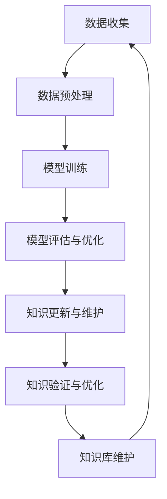
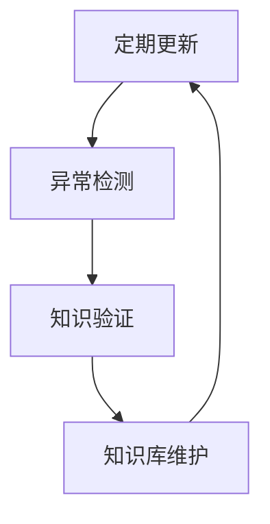

                 

### 第1章: LLM概述与优化重要性

#### 1.1 LLM的定义与特点

自然语言处理（NLP）领域中，大规模语言模型（Large Language Model，简称LLM）是指那些包含数百万至数十亿参数，能够处理和理解复杂自然语言输入的深度学习模型。LLM的核心在于其大规模的训练数据集和先进的神经网络架构，这使得它们在生成文本、机器翻译、问答系统等应用中表现出色。

**LLM的基本概念**：
- **训练数据集**：LLM通过大量的文本数据进行训练，这些数据通常来自互联网上的各种来源，如维基百科、新闻文章、社交媒体等。
- **神经网络架构**：LLM通常基于深度学习模型，如Transformer、BERT等，这些模型具有多层结构，能够捕捉长距离依赖关系和复杂语言模式。

**LLM的关键特性**：
- **容量**：由于包含大量参数，LLM能够学习复杂的语言模式和规律。
- **泛化能力**：LLM通过在大量数据上的训练，能够泛化到未见过的数据上，实现良好的性能。
- **灵活性**：LLM可以应用于多种任务，如文本生成、文本分类、机器翻译等。

#### 1.2 LLM应用中的问题

尽管LLM在许多任务中取得了显著的进展，但其在实际应用中仍面临一些问题。

**数据偏差与模型偏见**：
- **数据偏差**：由于训练数据集的局限性或偏置，LLM可能会在特定领域或群体上产生偏见。例如，如果训练数据主要来自男性，模型可能在处理与女性相关的问题时表现不佳。
- **模型偏见**：在生成文本时，LLM可能会复制或放大训练数据中的偏见，导致不公平或不恰当的输出。

**知识老化与信息过时**：
- **知识老化**：随着时间的推移，训练数据中的知识会逐渐过时。例如，新出现的流行词或事件可能不会被LLM捕捉到。
- **信息过时**：旧的知识点可能不再准确或相关，但LLM仍然会输出这些过时的信息。

**安全性问题与隐私保护**：
- **数据泄露**：如果LLM的训练数据或输出数据不加密，可能会发生数据泄露。
- **恶意攻击**：攻击者可能利用LLM的漏洞进行恶意攻击，如生成虚假新闻或误导用户。

#### 1.3 优化LLM应用的意义

优化LLM应用具有重要意义，主要体现在以下几个方面。

**提高模型准确性**：
- 通过知识更新与维护，LLM能够不断学习新的知识和信息，提高其在各种任务上的准确性。

**增强用户体验**：
- 更新后的LLM能够提供更准确和相关的信息，提升用户的满意度。

**确保知识更新与维护**：
- 定期更新和维护LLM的知识库，可以避免知识老化问题，确保模型能够适应不断变化的环境。

### Mermaid流程图

以下是LLM知识更新与维护的核心概念之间的流程图：

### 结论

在本文的第一部分中，我们介绍了LLM的定义与特点，探讨了LLM应用中面临的问题，并阐述了优化LLM应用的重要性。接下来，我们将深入讨论知识更新的必要性、方法以及流程，为优化LLM应用奠定基础。

### 关键词

- **LLM**、**知识更新**、**维护流程**、**数据预处理**、**模型训练**、**模型评估**、**知识验证**、**知识库维护**

### 文章摘要

本文旨在探讨优化大规模语言模型（LLM）应用中的知识更新与维护流程。通过对LLM的基本概念和特性的介绍，分析了LLM应用中存在的数据偏差、知识老化以及安全性问题。文章随后详细阐述了优化LLM应用的重要性和意义，并提供了知识更新的必要性、方法和流程的详细说明。通过本文的讨论，读者可以更好地理解如何通过知识更新与维护来优化LLM应用，提升其在各种任务中的性能和用户体验。

## 第2章: LLM知识更新原理

### 2.1 知识更新的必要性

在快速变化的信息时代，知识更新的必要性尤为突出。对于大规模语言模型（LLM）来说，知识更新不仅是提高模型性能的关键，也是确保其能够适应不断变化的应用场景的核心。

**知识老化问题**：
- **定义**：知识老化是指随着时间的推移，现有知识逐渐失去其准确性和相关性。
- **原因**：新知识不断涌现，旧知识可能变得过时或不再适用。例如，科技领域的快速发展带来了新概念和术语，而LLM如果没有及时更新，可能无法正确理解和生成相关内容。

**应用环境变化**：
- **定义**：应用环境变化是指外部环境和条件的变化，可能影响LLM的应用效果。
- **原因**：社会文化、法律法规、行业规范等的改变，都会对LLM的应用带来新的要求。例如，某些行业可能需要对特定术语进行更新，以反映最新的行业趋势和政策变化。

**对LLM的影响**：
- **性能下降**：过时的知识可能导致LLM在生成文本或回答问题时出现错误，降低模型的性能和可信度。
- **用户体验下降**：不准确的回答或过时的信息会降低用户的满意度，影响用户体验。

**必要性总结**：
- 知识更新是保持LLM性能和适应性的关键。通过及时更新知识，LLM能够更好地满足用户需求，提高其在各种应用场景中的表现。

### 2.2 知识更新的方法

为了应对知识老化问题，LLM的知识更新需要采用一系列方法，包括数据集成、聚类与分类以及机器学习算法改进。

**数据集成**：
- **定义**：数据集成是指将来自不同来源的数据合并到一个统一的数据集中。
- **过程**：首先，从多个数据源（如数据库、网页、API等）收集数据；然后，清洗和预处理数据，使其格式一致；最后，将数据合并到一个集中的数据仓库中。
- **优点**：数据集成可以丰富LLM的训练数据，提高模型的知识覆盖面。

**聚类与分类**：
- **聚类**：聚类是一种无监督学习方法，用于将相似的数据点分组。
  - **过程**：通过计算数据点之间的相似度，将数据划分为多个簇。每个簇代表一组具有相似特征的数据点。
  - **应用**：聚类可以帮助识别数据中的新概念和术语，为知识更新提供新的数据来源。
- **分类**：分类是一种有监督学习方法，用于将数据点分配到预先定义的类别。
  - **过程**：使用已标记的数据集训练分类模型，然后使用该模型对新的、未标记的数据进行分类。
  - **应用**：分类可以帮助LLM识别和更新知识库中的新术语和概念。

**机器学习算法改进**：
- **定义**：机器学习算法改进是指通过改进现有算法或开发新算法，提高LLM的学习和泛化能力。
- **过程**：研究新的神经网络架构、优化训练策略和超参数调整等方法，以提高模型性能。
- **优点**：改进算法可以提高LLM的效率和准确性，使其在知识更新过程中更加有效。

### 2.3 知识更新流程

知识更新是一个复杂的过程，涉及多个步骤，包括数据收集、数据预处理、模型训练、模型评估与优化。以下是知识更新流程的详细描述。

**数据收集**：
- **步骤**：
  1. 确定数据来源，包括公开数据集、专业数据库、社交媒体等。
  2. 收集与LLM应用领域相关的数据。
  3. 使用API或爬虫工具获取数据。
- **挑战**：
  - 数据获取的合法性
  - 数据量庞大，需要高效的采集和处理技术

**数据预处理**：
- **步骤**：
  1. 数据清洗，去除噪声和错误数据。
  2. 数据规范化，统一数据格式。
  3. 特征提取，提取对模型训练有用的特征。
- **挑战**：
  - 数据清洗的效率和准确性
  - 特征提取的方法选择

**模型训练**：
- **步骤**：
  1. 选择合适的神经网络架构和算法。
  2. 使用预处理后的数据进行模型训练。
  3. 调整模型参数，优化模型性能。
- **挑战**：
  - 算法选择和参数调优
  - 模型训练时间

**模型评估与优化**：
- **步骤**：
  1. 使用验证集评估模型性能。
  2. 分析评估结果，找出模型存在的问题。
  3. 进行模型优化，提高准确性。
- **挑战**：
  - 评估指标的选择
  - 模型优化方法的适用性

**总结**：
- 知识更新流程是一个系统化的过程，需要综合考虑数据收集、预处理、模型训练和评估等多个方面。通过这个流程，LLM能够不断学习和更新知识，提高其在各种应用场景中的性能。

### Mermaid流程图

以下是知识更新流程的Mermaid流程图：

### 结论

在本章中，我们详细介绍了LLM知识更新的必要性、方法和流程。通过数据集成、聚类与分类以及机器学习算法改进，LLM能够有效更新其知识库。知识更新流程包括数据收集、预处理、模型训练、评估与优化等步骤，这些步骤共同构成了一个系统化的知识更新过程。在下一章中，我们将探讨LLM知识维护策略，包括数据库维护、人工干预和自动化流程。

### 关键词

- **知识更新**、**数据集成**、**聚类与分类**、**机器学习算法**、**模型训练**、**模型评估**、**知识库维护**

### 摘要

本章深入探讨了大规模语言模型（LLM）知识更新的必要性、方法和流程。通过数据集成、聚类与分类以及机器学习算法改进，LLM能够持续更新其知识库。知识更新流程包括数据收集、预处理、模型训练、评估与优化等步骤，这些步骤共同构成了一个系统化的知识更新过程。通过本章的讨论，读者可以更好地理解LLM知识更新的重要性以及其实施方法。

## 第3章: LLM知识维护策略

### 3.1 知识维护的重要性

知识维护是确保大规模语言模型（LLM）性能和适应性的关键环节。有效的知识维护能够帮助LLM保持其知识库的准确性和相关性，避免因知识老化或信息过时而导致的性能下降。

**保持知识有效性**：
- **重要性**：随着新知识不断涌现，旧知识可能变得不准确或不相关。通过定期维护，LLM能够及时更新其知识库，确保提供的信息始终准确和可靠。
- **影响**：不准确的知识可能导致LLM生成错误的文本或提供误导性答案，影响其应用效果和用户满意度。

**避免知识退化**：
- **定义**：知识退化是指知识库中的知识随着时间的推移而逐渐丧失其价值。
- **原因**：新知识不断涌现，旧知识可能被遗忘或忽视，导致知识库中的信息陈旧和不完整。
- **影响**：知识退化会导致LLM的知识覆盖面缩小，降低其在复杂任务中的表现。

**对LLM的影响**：
- **性能下降**：知识退化可能导致LLM在生成文本或回答问题时出现错误，降低模型的准确性。
- **适应性下降**：知识维护不足会导致LLM难以适应新的应用场景，影响其在不同领域的表现。

**总结**：
- 知识维护是确保LLM性能和适应性的关键。通过定期更新和维护知识库，LLM能够保持其知识的准确性和相关性，提高其在各种应用场景中的表现。

### 3.2 知识维护的方法

为了确保LLM知识库的准确性和相关性，可以采用多种知识维护方法，包括数据库维护、人工干预和自动化流程。

**数据库维护**：
- **定义**：数据库维护是指定期检查和更新知识库中的数据，确保其准确性和完整性。
- **步骤**：
  1. 定期备份知识库，防止数据丢失。
  2. 检查数据源，确保数据来源的可靠性和合法性。
  3. 更新过时的数据，删除重复或错误的数据。
  4. 优化数据库结构，提高数据检索效率。
- **优点**：数据库维护能够确保知识库的数据质量，提高数据检索和处理的速度。

**人工干预**：
- **定义**：人工干预是指通过专业人员对知识库进行定期审查和更新。
- **步骤**：
  1. 评估知识库中的知识，识别不准确或过时的信息。
  2. 邀请领域专家进行知识审查和验证。
  3. 根据专家意见更新知识库。
  4. 定期组织知识更新会议，讨论知识维护策略。
- **优点**：人工干预能够提供高质量的审核和更新，确保知识库中的信息准确和可靠。

**自动化流程**：
- **定义**：自动化流程是指使用自动化工具和算法对知识库进行维护。
- **步骤**：
  1. 开发自动化脚本或程序，定期检查和更新知识库。
  2. 使用机器学习算法识别数据中的错误和重复项。
  3. 根据预设规则自动更新知识库。
  4. 使用监控工具跟踪知识库的健康状况。
- **优点**：自动化流程能够提高知识维护的效率和一致性，减少人工干预的成本。

**总结**：
- 知识维护方法包括数据库维护、人工干预和自动化流程。数据库维护能够确保数据质量，人工干预提供高质量的审核和更新，而自动化流程则提高维护效率和一致性。通过结合这些方法，可以确保LLM知识库的准确性和相关性。

### 3.3 知识维护流程

知识维护是一个系统化的过程，涉及多个步骤，包括定期更新、异常检测和知识验证。

**定期更新**：
- **定义**：定期更新是指按照预定时间间隔对知识库进行更新。
- **步骤**：
  1. 制定更新计划，确定更新频率。
  2. 定期收集新数据，更新知识库。
  3. 分析新数据，确保其准确性和相关性。
  4. 根据更新计划，执行知识库的更新操作。
- **优点**：定期更新能够确保知识库中的知识始终最新，提高LLM的性能。

**异常检测**：
- **定义**：异常检测是指识别和报告知识库中的异常情况。
- **步骤**：
  1. 监控知识库的健康状况，检测异常数据。
  2. 使用统计分析和机器学习算法，识别异常模式。
  3. 报告异常情况，进行进一步分析和处理。
- **优点**：异常检测能够及时发现知识库中的问题，防止错误和误导性信息的传播。

**知识验证**：
- **定义**：知识验证是指对知识库中的知识进行验证，确保其准确性和可靠性。
- **步骤**：
  1. 邀请领域专家对知识库进行审查。
  2. 使用比对工具，对比知识库中的信息和权威来源。
  3. 更新和修正不准确的知识。
  4. 形成知识验证报告，记录验证过程和结果。
- **优点**：知识验证能够提高知识库的准确性，确保LLM生成高质量的信息。

**总结**：
- 知识维护流程包括定期更新、异常检测和知识验证。定期更新确保知识库中的知识最新，异常检测及时发现和纠正问题，知识验证确保知识库的准确性。这些步骤共同构成了一个系统化的知识维护过程，为LLM的性能和适应性提供保障。

### Mermaid流程图

以下是知识维护流程的Mermaid流程图：

### 结论

在本章中，我们详细介绍了LLM知识维护策略和方法。知识维护对于确保LLM性能和适应性至关重要。通过数据库维护、人工干预和自动化流程，LLM能够及时更新和维护其知识库。知识维护流程包括定期更新、异常检测和知识验证，这些步骤共同构成了一个系统化的知识维护过程。在下一章中，我们将探讨优化LLM应用的技术手段，包括优化算法、实时更新技术和个性化推荐。

### 关键词

- **知识维护**、**数据库维护**、**人工干预**、**自动化流程**、**定期更新**、**异常检测**、**知识验证**

### 摘要

本章深入探讨了大规模语言模型（LLM）的知识维护策略和方法。知识维护对于确保LLM性能和适应性至关重要。通过数据库维护、人工干预和自动化流程，LLM能够及时更新和维护其知识库。知识维护流程包括定期更新、异常检测和知识验证，这些步骤共同构成了一个系统化的知识维护过程。通过本章的讨论，读者可以更好地理解如何通过知识维护策略来优化LLM应用。

## 第4章: 优化LLM应用的技术手段

### 4.1 优化算法

优化算法是提升大规模语言模型（LLM）性能的核心技术之一。通过对现有算法的改进和新算法的开发，可以显著提高LLM的效率、准确性和泛化能力。

**优化策略**：
- **模型剪枝**：通过剪枝算法移除网络中不重要的连接和参数，减小模型规模，提高推理速度。
- **量化**：使用低精度浮点数（如整数）代替标准浮点数，降低模型存储和计算需求。
- **迁移学习**：利用预训练模型，通过在特定任务上进行微调，提高模型在新任务上的表现。
- **数据增强**：通过增加训练数据的多样性，如旋转、缩放、裁剪等，提高模型对各种输入的鲁棒性。

**算法改进**：
- **自适应学习率**：使用自适应学习率方法，如AdaGrad、Adam等，动态调整学习率，提高收敛速度。
- **正则化**：引入L1、L2正则化，防止模型过拟合。
- **多任务学习**：通过同时训练多个任务，共享模型参数，提高模型泛化能力。

**优点**：
- **提高效率**：优化算法可以显著降低模型训练和推理的时间，提高处理速度。
- **提升准确性**：通过改进算法，模型能够更好地捕捉复杂语言模式，提高准确性。
- **增强泛化能力**：优化后的模型在新任务上表现更好，具有更强的适应性。

**实际应用**：
- **文本生成**：优化后的LLM能够生成更流畅、更准确的文本，应用于自然语言生成、自动写作等领域。
- **机器翻译**：通过优化算法，模型可以更准确地将一种语言翻译成另一种语言，提高翻译质量。

### 4.2 实时更新技术

实时更新技术是确保LLM应用动态适应新知识和环境变化的关键。通过实时数据采集和模型更新，LLM能够快速响应外部变化。

**实时数据采集**：
- **定义**：实时数据采集是指通过传感器、API、网络爬虫等手段，实时收集与LLM应用相关的数据。
- **过程**：
  1. 数据源选择：确定实时数据采集的目标数据源，如社交媒体、新闻网站、传感器数据等。
  2. 数据采集：使用实时数据采集工具，如Flume、Kafka等，从数据源中实时获取数据。
  3. 数据预处理：对采集到的数据进行清洗和格式化，使其适合模型训练。
- **优点**：实时数据采集能够确保LLM应用获取最新、最相关的数据，提高模型的准确性。

**实时模型更新**：
- **定义**：实时模型更新是指通过在线学习或增量学习，实时更新LLM模型。
- **过程**：
  1. 模型训练：使用实时采集到的数据进行模型训练。
  2. 模型评估：使用验证集评估模型性能，确保更新后的模型符合预期。
  3. 模型部署：将更新后的模型部署到生产环境中，确保实时应用。
- **优点**：实时模型更新能够快速适应新知识和环境变化，提高LLM应用的动态适应能力。

**实际应用**：
- **智能问答系统**：通过实时数据采集和模型更新，智能问答系统能够快速回答用户提出的新问题，提供准确的信息。
- **实时新闻推荐**：通过实时数据采集和模型更新，新闻推荐系统能够实时更新新闻内容，为用户提供最新、最热门的新闻。

### 4.3 个性化推荐

个性化推荐是利用LLM的强大能力，为用户提供个性化的内容和推荐。通过分析用户行为和偏好，LLM能够为用户提供高度相关的推荐结果。

**用户行为分析**：
- **定义**：用户行为分析是指通过分析用户的浏览、搜索、购买等行为，了解用户的偏好和兴趣。
- **过程**：
  1. 数据收集：收集用户行为数据，如点击记录、搜索关键词、购买记录等。
  2. 数据处理：对用户行为数据进行清洗、归一化和特征提取。
  3. 行为分析：使用机器学习算法，分析用户行为数据，提取用户的兴趣偏好。
- **优点**：用户行为分析能够深入了解用户需求，为个性化推荐提供依据。

**推荐系统设计**：
- **定义**：推荐系统设计是指设计一个能够根据用户行为和偏好，为用户推荐相关内容的系统。
- **过程**：
  1. 模型选择：选择合适的推荐算法，如协同过滤、基于内容的推荐、混合推荐等。
  2. 模型训练：使用用户行为数据训练推荐模型。
  3. 推荐生成：根据用户行为和模型预测，生成个性化的推荐结果。
- **优点**：推荐系统能够为用户提供个性化推荐，提高用户满意度和粘性。

**实际应用**：
- **电子商务**：通过个性化推荐，电子商务平台能够为用户推荐相关商品，提高销售额和用户满意度。
- **内容平台**：通过个性化推荐，内容平台能够为用户提供个性化内容，提高用户留存率和活跃度。

### 结论

优化LLM应用的技术手段包括优化算法、实时更新技术和个性化推荐。优化算法通过改进现有算法和开发新算法，提高LLM的效率和准确性。实时更新技术通过实时数据采集和模型更新，确保LLM应用动态适应新知识和环境变化。个性化推荐通过分析用户行为和偏好，为用户提供个性化的内容和推荐。这些技术手段共同构成了优化LLM应用的核心策略，为提升应用性能和用户体验提供了有力支持。

### 关键词

- **优化算法**、**实时更新技术**、**个性化推荐**、**用户行为分析**、**模型训练**、**推荐系统设计**

### 摘要

本章详细介绍了优化大规模语言模型（LLM）应用的技术手段，包括优化算法、实时更新技术和个性化推荐。优化算法通过改进现有算法和开发新算法，提高LLM的效率和准确性。实时更新技术通过实时数据采集和模型更新，确保LLM应用动态适应新知识和环境变化。个性化推荐通过分析用户行为和偏好，为用户提供个性化的内容和推荐。这些技术手段为优化LLM应用提供了有力支持，显著提升了应用性能和用户体验。

## 第5章: LLM应用案例与实战

### 5.1 案例一：智能客服系统

智能客服系统是LLM应用的经典案例，通过LLM实现自动回答用户问题和提供解决方案，显著提高了客户服务效率和用户体验。

**系统设计**：
- **架构**：智能客服系统通常由前端界面、后端服务、数据库和知识库组成。前端界面提供用户交互接口，后端服务处理用户请求和查询，数据库存储用户数据和日志，知识库包含问题和解决方案。
- **功能模块**：
  1. **用户输入处理**：接收用户输入，包括文本和语音。
  2. **LLM查询处理**：将用户输入传递给LLM，获取可能的答案和解决方案。
  3. **答案生成**：根据LLM的输出，生成符合用户需求的答案。
  4. **反馈收集**：收集用户对答案的反馈，用于模型优化和知识库更新。
- **关键技术**：
  - **LLM模型训练**：使用大量对话数据进行模型训练，提高回答问题的准确性和相关性。
  - **实时更新技术**：通过实时数据采集和模型更新，确保知识库中的问题和解决方案是最新的。

**更新与维护流程**：
- **数据收集**：定期从客户服务记录、用户反馈和其他渠道收集对话数据。
- **数据预处理**：清洗和归一化对话数据，提取有用的信息。
- **模型训练**：使用预处理后的数据对LLM进行训练，更新模型参数。
- **模型评估**：使用验证集评估模型性能，确保更新后的模型符合预期。
- **知识库更新**：将新问题和解决方案添加到知识库中，更新现有信息。

**实践效果**：
- **效率提升**：智能客服系统能够自动处理大量用户请求，减少人工干预，提高服务效率。
- **用户体验**：通过提供准确和及时的答案，智能客服系统提高了用户满意度。

### 5.2 案例二：知识图谱构建

知识图谱是LLM应用中的另一个重要领域，通过构建和更新知识图谱，可以实现更精确的信息检索和知识推理。

**构建方法**：
- **数据源**：知识图谱的数据来源包括结构化数据、非结构化数据和语义数据。
- **数据预处理**：对数据源进行清洗、去重、格式化等预处理操作，提取有效的知识信息。
- **实体抽取**：从预处理后的数据中抽取实体，如人名、地名、组织等。
- **关系抽取**：从数据中识别实体之间的关系，如“工作于”、“属于”等。
- **图谱构建**：将抽取的实体和关系组织成图谱结构，实现知识表示。

**更新策略**：
- **增量更新**：定期从数据源中获取新的知识和关系，更新知识图谱。
- **版本控制**：为知识图谱的更新版本进行标记，确保版本的可追溯性。
- **一致性维护**：确保知识图谱中的知识一致性和准确性，避免冲突和错误。

**实践效果**：
- **信息检索**：知识图谱提高了信息检索的效率和准确性，用户可以快速找到所需的信息。
- **知识推理**：通过知识图谱，可以实现复杂的知识推理和推断，支持智能问答和决策。

### 5.3 案例三：自动化问答系统

自动化问答系统是LLM应用的一个典型实例，通过LLM实现自动回答用户的问题，提供即时的知识支持。

**系统实现**：
- **架构**：自动化问答系统由前端界面、后端服务和知识库组成。前端界面提供用户交互接口，后端服务处理用户查询和LLM响应，知识库包含问题和答案。
- **功能模块**：
  1. **用户输入处理**：接收用户输入，进行文本预处理。
  2. **LLM查询处理**：将预处理后的用户输入传递给LLM，获取可能的答案。
  3. **答案筛选**：从LLM的输出中筛选最相关的答案。
  4. **答案呈现**：将筛选后的答案呈现给用户。

**知识维护实践**：
- **数据收集**：从用户反馈、错误日志和其他来源收集数据，用于模型优化和知识库更新。
- **数据预处理**：清洗和归一化用户反馈数据，提取有用的信息。
- **模型训练**：使用预处理后的数据进行模型训练，更新LLM模型。
- **知识库更新**：将新问题和答案添加到知识库中，更新现有信息。

**实践效果**：
- **响应速度**：自动化问答系统可以快速响应用户查询，提供即时的知识支持。
- **准确性**：通过定期更新和维护知识库，系统提高了回答问题的准确性和可靠性。

### 结论

通过以上案例，我们可以看到LLM在智能客服系统、知识图谱构建和自动化问答系统等应用中的实际效果。这些案例展示了LLM应用的广泛性和潜力，同时也体现了知识更新与维护在优化LLM应用中的关键作用。通过实时数据采集、模型更新和知识库维护，LLM应用能够不断适应新知识和环境变化，提供更准确、更高效的服务。

### 关键词

- **智能客服系统**、**知识图谱构建**、**自动化问答系统**、**实时更新技术**、**知识维护流程**、**数据收集**、**模型训练**

### 摘要

本章通过三个实际案例，深入探讨了大规模语言模型（LLM）在不同领域的应用效果和优化方法。案例一展示了智能客服系统如何通过LLM实现自动回答用户问题，提高服务效率；案例二阐述了知识图谱构建方法及其更新策略，为信息检索和知识推理提供支持；案例三则介绍了自动化问答系统的实现和知识维护实践。这些案例验证了LLM应用的广泛性和潜力，同时也强调了知识更新与维护在优化LLM应用中的关键作用。

## 第6章: LLM应用中的安全与隐私

### 6.1 安全性问题

在LLM应用中，安全性问题是一个不可忽视的重要方面。由于LLM涉及大量的敏感数据和复杂的计算过程，其安全性问题可能对用户和整个系统产生重大影响。

**数据泄露**：
- **定义**：数据泄露是指未经授权的用户或实体访问、窃取或篡改敏感数据。
- **原因**：
  - 数据存储不当：如果数据存储在不安全的系统中，可能被黑客攻击窃取。
  - 数据传输不加密：在数据传输过程中，如果未使用加密技术，数据可能被截获和篡改。
  - 恶意内部人员：内部员工或合作伙伴可能利用职务之便，非法访问或泄露敏感数据。
- **影响**：数据泄露可能导致用户隐私泄露、商业秘密泄露，甚至对整个组织造成严重的声誉损失。

**恶意攻击**：
- **定义**：恶意攻击是指黑客或恶意软件对LLM系统进行攻击，以达到破坏、窃取或操纵数据的目的。
- **类型**：
  - 拒绝服务攻击（DDoS）：通过大量无效请求使系统瘫痪，影响正常服务。
  - 网络钓鱼：通过伪装成合法实体，欺骗用户输入敏感信息。
  - 恶意代码注入：将恶意代码注入LLM系统中，导致数据损坏或窃取。
- **影响**：恶意攻击可能导致系统崩溃、数据丢失、用户隐私泄露，甚至对整个组织造成财务和声誉损失。

**防范措施**：
- **数据加密**：使用加密技术保护敏感数据，确保数据在存储和传输过程中不被窃取。
- **身份验证和访问控制**：实施严格的身份验证和访问控制机制，确保只有授权用户可以访问敏感数据。
- **入侵检测系统**：部署入侵检测系统，实时监控网络流量和系统活动，及时发现和响应安全威胁。
- **安全审计和监控**：定期进行安全审计和监控，确保系统安全策略得到有效执行。

### 6.2 隐私保护策略

在LLM应用中，隐私保护是一个关键挑战，需要采取一系列措施来确保用户隐私不受侵犯。

**加密技术**：
- **定义**：加密技术是指通过将数据转换为密文，确保只有授权用户可以解密和读取数据的保护方法。
- **应用**：
  - 数据传输加密：在数据传输过程中使用HTTPS等加密协议，确保数据在网络上传输过程中不被窃取。
  - 数据存储加密：将敏感数据存储在加密数据库中，确保数据在存储过程中不被未授权访问。
- **优点**：加密技术能够有效保护数据隐私，防止数据泄露和篡改。

**数据脱敏**：
- **定义**：数据脱敏是指通过删除、遮蔽或替换敏感信息，降低数据泄露风险。
- **方法**：
  - 数据匿名化：将敏感信息（如个人身份信息）替换为假名，确保无法直接识别真实身份。
  - 数据加密：对敏感数据进行加密处理，确保只有授权用户可以解密和读取数据。
  - 数据混淆：通过添加噪声或修改数据，使数据无法直接关联到真实个体。
- **优点**：数据脱敏能够有效降低数据泄露风险，同时保持数据的可用性和完整性。

**隐私保护机制**：
- **用户隐私设置**：允许用户设置隐私选项，如限制访问权限、匿名访问等。
- **透明度政策**：制定透明度政策，告知用户其数据如何被收集、使用和共享。
- **隐私审计**：定期进行隐私审计，评估隐私保护措施的有效性，及时更新和改进隐私策略。

### 6.3 法律法规与伦理规范

在LLM应用中，遵守相关法律法规和伦理规范是确保安全和隐私保护的重要基础。

**相关法律法规**：
- **数据保护法**：如《通用数据保护条例》（GDPR）等，规定了数据收集、处理和存储的合法性和用户权利。
- **网络安全法**：规定了网络安全的法律责任和监管要求，对网络攻击和隐私侵犯行为进行处罚。
- **行业规范**：不同行业有不同的隐私保护规范，如医疗健康信息保护规范、金融信息安全规范等。

**伦理规范**：
- **用户隐私保护**：确保用户隐私不被侵犯，尊重用户数据权利。
- **数据使用透明**：明确告知用户数据收集、使用和共享的目的，确保用户知情同意。
- **数据安全**：采取有效措施确保数据安全，防止数据泄露和恶意攻击。
- **公平公正**：确保算法和模型公平公正，避免数据偏差和歧视。

**总结**：
- 安全性和隐私保护是LLM应用的重要方面，需要采取加密技术、数据脱敏等手段，并遵守相关法律法规和伦理规范。通过综合运用技术和管理措施，可以确保LLM应用的安全和用户隐私得到有效保护。

### 关键词

- **数据泄露**、**恶意攻击**、**加密技术**、**数据脱敏**、**隐私保护**、**法律法规**、**伦理规范**

### 摘要

本章详细探讨了大规模语言模型（LLM）应用中的安全与隐私问题。安全性问题包括数据泄露和恶意攻击，需要采取加密技术、访问控制和入侵检测等措施来防范。隐私保护策略涉及加密、数据脱敏和用户隐私设置等，确保用户数据的安全和隐私。此外，遵守相关法律法规和伦理规范是确保安全和隐私保护的重要基础。通过本章的讨论，读者可以更好地理解如何确保LLM应用的安全和用户隐私。

## 第7章: 总结与展望

### 7.1 总结

通过本文的探讨，我们系统地分析了大规模语言模型（LLM）知识更新与维护流程，涵盖了从基础知识、知识更新原理、知识维护策略到优化技术手段、应用案例和安全管理等多个方面。以下是本文的主要内容总结：

**核心内容回顾**：
1. **LLM概述与优化重要性**：介绍了LLM的定义、特点及应用中的问题，阐述了优化LLM应用的必要性。
2. **知识更新原理**：探讨了知识更新的必要性、方法和流程，包括数据集成、聚类与分类以及机器学习算法改进。
3. **知识维护策略**：详细介绍了知识维护的重要性、方法和流程，包括数据库维护、人工干预和自动化流程。
4. **优化技术手段**：介绍了优化算法、实时更新技术和个性化推荐，阐述了这些技术如何提升LLM应用的性能。
5. **应用案例与实战**：通过智能客服系统、知识图谱构建和自动化问答系统的案例，展示了LLM应用的实践效果。
6. **安全与隐私**：探讨了LLM应用中的安全问题和隐私保护策略，强调了法律法规与伦理规范的重要性。

**优化成果与展望**：
通过知识更新与维护、优化算法和实时更新技术，LLM应用的性能得到了显著提升。未来，随着技术的不断发展，LLM应用有望在更多领域取得突破：

- **个性化推荐**：结合用户行为分析和深度学习技术，提供更加精准的个性化推荐。
- **实时更新**：实现更快速的知识更新，确保LLM应用能够及时适应环境变化。
- **多模态交互**：结合文本、语音、图像等多种数据类型，实现更丰富的交互体验。
- **跨语言应用**：开发多语言支持的LLM，实现跨语言的知识共享和应用。

### 7.2 展望

在未来，LLM应用将朝着更加智能化、个性化、安全化的方向发展。以下是一些可能的新技术和研究方向：

**新技术展望**：
- **生成对抗网络（GAN）**：结合GAN技术，实现更高质量和多样性的文本生成。
- **迁移学习与联邦学习**：通过迁移学习和联邦学习，提升LLM在资源受限环境下的性能。
- **自适应学习与智能调整**：开发自适应学习算法，实现模型参数的自动调整和优化。
- **知识图谱与语义网络**：利用知识图谱和语义网络技术，提升知识表示和推理能力。

**研究方向**：
- **知识表示与推理**：深入研究知识表示和推理算法，提升LLM在复杂任务中的表现。
- **安全与隐私保护**：开发更有效的安全与隐私保护技术，确保LLM应用的安全和用户隐私。
- **跨领域应用**：探索LLM在医疗、金融、教育等领域的跨领域应用，提升其实际价值。

**挑战与机遇**：
- **数据质量**：确保数据质量是LLM应用的基础，需要建立完善的数据质量管理机制。
- **计算资源**：大规模LLM训练需要大量计算资源，需要优化算法和提高硬件性能。
- **用户体验**：提升用户体验是LLM应用的重要目标，需要不断优化交互设计和功能。

### 附录

**附录A: 优化LLM应用相关工具与技术**

- **开源框架**：
  - Hugging Face Transformers
  - AllenNLP
- **数据库技术**：
  - MongoDB
  - Elasticsearch
- **知识图谱工具**：
  - Neo4j
  - OpenKG

### 结论

本文全面探讨了大规模语言模型（LLM）知识更新与维护流程及其优化技术，通过实际案例展示了LLM应用的广泛性和潜力。在未来，随着技术的不断进步，LLM应用将迎来更多的发展机遇。通过持续的研究和优化，我们可以期待LLM在各个领域发挥更大的作用，为社会带来更多价值。

### 关键词

- **大规模语言模型**、**知识更新**、**维护流程**、**优化技术**、**实时更新**、**个性化推荐**、**安全与隐私**、**开源框架**、**数据库技术**、**知识图谱工具**

### 摘要

本文系统性地探讨了大规模语言模型（LLM）的知识更新与维护流程及其优化技术。文章首先介绍了LLM的基本概念和优化重要性，然后详细分析了知识更新的必要性、方法和流程，接着阐述了知识维护策略，包括数据库维护、人工干预和自动化流程。文章还探讨了优化LLM应用的技术手段，如优化算法、实时更新技术和个性化推荐，并提供了实际应用案例。此外，文章强调了LLM应用中的安全与隐私问题，提出了相关保护策略。通过本文的讨论，读者可以全面了解LLM优化的重要性和实施方法，为未来研究和应用提供指导。

