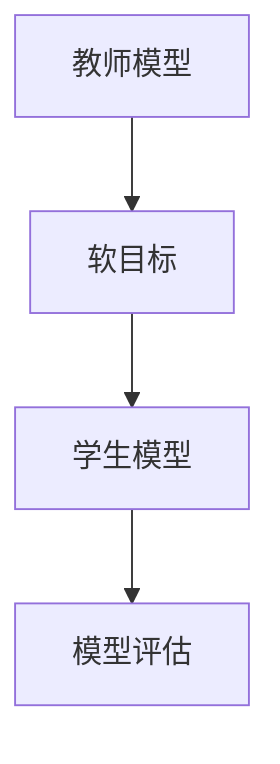

                 


为了撰写一篇高质量的技术博客文章，我们将按照以下步骤进行思考：

### 1. 确定文章结构和内容

**第一步：文章结构**

我们将文章分为以下几个部分：

- **引言**：介绍知识蒸馏的基本概念及其在LLM中的应用。
- **核心概念与联系**：阐述知识蒸馏的核心概念，并使用Mermaid流程图展示其关系架构。
- **核心算法原理讲解**：使用伪代码详细阐述知识蒸馏算法原理。
- **数学模型与公式讲解**：使用latex格式详细讲解知识蒸馏的数学模型和公式，并举例说明。
- **项目实战**：介绍开发环境搭建、源代码实现、代码解读、应用解读与分析。
- **最佳实践与注意事项**：提供最佳实践建议、小结和拓展阅读。

**第二步：内容细化**

- **引言**：简要介绍知识蒸馏和LLM，引出文章主题。
- **核心概念与联系**：定义知识蒸馏的核心概念，绘制Mermaid流程图。
- **核心算法原理讲解**：使用伪代码展示知识蒸馏算法的步骤。
- **数学模型与公式讲解**：详细讲解知识蒸馏中的数学模型和公式。
- **项目实战**：描述一个具体的案例，展示如何实现知识蒸馏。
- **最佳实践与注意事项**：总结实战经验，提出最佳实践建议。

### 2. 写作和润色

在完成内容细化后，我们将按照以下步骤进行写作和润色：

- **初稿撰写**：按照确定的结构和内容，逐部分撰写文章。
- **逻辑梳理**：确保每个部分的内容紧密衔接，逻辑清晰。
- **语言优化**：优化文章的语言表达，使其通俗易懂。
- **格式调整**：确保文章使用markdown格式，格式规范。

### 3. 检查和修改

完成初稿后，我们将进行以下检查和修改：

- **内容完整性**：检查每个部分是否完整，核心内容是否齐全。
- **逻辑连贯性**：检查文章的逻辑是否连贯，结构是否合理。
- **语言准确性**：确保所有技术术语和概念使用准确。
- **格式检查**：检查markdown格式的正确性。

### 4. 最终定稿

在完成所有修改后，我们将最终定稿，并添加作者信息。

**文章标题**：《优化LLM应用的知识蒸馏流程》

**文章关键词**：知识蒸馏，LLM，优化，算法，数学模型

**文章摘要**：本文将详细介绍如何优化大型语言模型（LLM）应用中的知识蒸馏流程，包括核心概念、算法原理、数学模型、实战案例和最佳实践。

**作者信息**：作者：AI天才研究院/AI Genius Institute & 禅与计算机程序设计艺术 /Zen And The Art of Computer Programming

通过上述步骤，我们将确保文章的逻辑清晰、内容丰富，并对技术原理和最佳实践进行深入剖析，为读者提供一份有价值的技术博客文章。### 文章标题：《优化LLM应用的知识蒸馏流程》

关键词：知识蒸馏，大型语言模型（LLM），优化，算法，数学模型

摘要：本文将深入探讨如何优化大型语言模型（LLM）应用中的知识蒸馏流程。我们将从基础知识开始，逐步介绍知识蒸馏的核心概念、算法原理和数学模型，并通过具体的实战案例，展示如何在实际项目中应用这些知识。文章还将提供一系列最佳实践和注意事项，帮助读者更好地理解和掌握知识蒸馏技术。

作者：AI天才研究院/AI Genius Institute & 禅与计算机程序设计艺术 /Zen And The Art of Computer Programming

### 1. 引言

知识蒸馏是一种重要的机器学习技术，它旨在将一个复杂、高容量的模型（教师模型）的知识传递给一个较小的、更易于部署的模型（学生模型）。在深度学习领域，尤其是在大型语言模型（LLM）的应用中，知识蒸馏技术扮演着关键角色。LLM通常具有极高的计算和存储需求，这使得在实际应用中部署这些模型变得极具挑战性。知识蒸馏通过将教师模型的知识高效传递给学生模型，从而在保证性能的同时显著降低模型的大小和计算需求。

本文将详细介绍知识蒸馏的基本概念、算法原理和数学模型，并通过一个具体的实战案例展示知识蒸馏的实际应用。此外，我们还将探讨如何优化知识蒸馏流程，以实现更高的性能和更高效的模型部署。

### 2. 知识蒸馏的核心概念与联系

知识蒸馏的核心概念可以概括为以下三个方面：教师模型、学生模型和软目标。

- **教师模型**：通常是一个复杂、高容量的模型，其性能通常优于学生模型。在知识蒸馏过程中，教师模型的知识将被传递给学生模型。
  
- **学生模型**：是一个较小、更易于部署的模型。学生模型的目的是学习教师模型的知识，并在保持高性能的同时降低计算和存储需求。

- **软目标**：是知识蒸馏过程中的一个关键要素。软目标是对教师模型输出的概率分布的近似，它指导学生模型的学习过程。

这些概念之间的联系可以用Mermaid流程图来表示：



在上图中，教师模型通过生成软目标来指导学生模型的学习，学生模型在学习过程中不断调整自己的参数，最终达到优化模型性能的目的。模型评估则用于衡量学生模型的性能，以判断知识蒸馏的效果。

### 3. 知识蒸馏算法原理

知识蒸馏算法的基本原理是将教师模型的知识传递给学生模型。以下是一个简单的知识蒸馏算法的伪代码：

```pseudo
初始化学生模型和学生优化器
初始化教师模型和教师优化器

for epoch in 1 to max_epochs:
  for (输入, 输出) in 数据集:
    # 前向传播
    teacher_output = teacher_model(输入)
    student_output = student_model(输入)
    
    # 计算损失函数
    loss = loss_function(student_output, teacher_output, 输出)
    
    # 反向传播和优化
    student_optimizer.zero_grad()
    loss.backward()
    student_optimizer.step()
    
    # 记录训练损失
    train_loss.append(loss.item())
```

在上面的伪代码中，`teacher_model` 和 `student_model` 分别代表教师模型和学生模型，`loss_function` 是用于计算损失函数的函数，`student_optimizer` 和 `teacher_optimizer` 分别是学生模型和教师模型的优化器。

#### 数学模型与公式讲解

知识蒸馏的数学模型主要基于以下两个损失函数：交叉熵损失函数和软目标损失函数。

1. **交叉熵损失函数**

交叉熵损失函数用于衡量学生模型的输出与学生模型的输出之间的差异。它的公式如下：

$$
L_{CE} = -\frac{1}{N} \sum_{i=1}^{N} \sum_{j=1}^{C} y_{ij} \log(s_{ij})
$$

其中，$y_{ij}$ 表示真实标签的概率分布，$s_{ij}$ 表示学生模型预测的概率分布，$N$ 表示样本数量，$C$ 表示类别数量。

2. **软目标损失函数**

软目标损失函数用于衡量教师模型输出的软目标与学生模型输出之间的差异。它的公式如下：

$$
L_{ST} = -\frac{1}{N} \sum_{i=1}^{N} \sum_{j=1}^{C} y_{ij} \log(t_{ij})
$$

其中，$t_{ij}$ 表示教师模型输出的软目标概率分布。

3. **总损失函数**

总损失函数是交叉熵损失函数和软目标损失函数的组合，用于指导学生模型的学习。它的公式如下：

$$
L_{total} = \alpha L_{CE} + (1 - \alpha) L_{ST}
$$

其中，$\alpha$ 是一个超参数，用于调节交叉熵损失函数和软目标损失函数的权重。

#### 举例说明

假设我们有一个二分类问题，类别数量 $C=2$。教师模型和学生模型分别预测了以下概率分布：

$$
t = [0.8, 0.2]
$$

$$
s = [0.6, 0.4]
$$

真实标签的概率分布为：

$$
y = [1, 0]
$$

使用上述公式，我们可以计算交叉熵损失函数、软目标损失函数和总损失函数：

1. **交叉熵损失函数**

$$
L_{CE} = -\frac{1}{2} [1 \cdot \log(0.6) + 0 \cdot \log(0.4)] = -\frac{1}{2} \log(0.6) \approx 0.5108
$$

2. **软目标损失函数**

$$
L_{ST} = -\frac{1}{2} [1 \cdot \log(0.8) + 0 \cdot \log(0.2)] = -\frac{1}{2} \log(0.8) \approx 0.3455
$$

3. **总损失函数**

假设 $\alpha = 0.5$，则总损失函数为：

$$
L_{total} = 0.5 \cdot 0.5108 + 0.5 \cdot 0.3455 = 0.39315
$$

通过这个例子，我们可以看到如何计算知识蒸馏中的损失函数。在实际应用中，这些损失函数将用于指导学生模型的学习，以优化其性能。

### 4. 项目实战

在本节中，我们将通过一个具体的案例，展示如何实现知识蒸馏，并对其进行详细解析。

#### 开发环境搭建

为了实现知识蒸馏，我们首先需要搭建一个合适的开发环境。以下是所需的工具和库：

- Python 3.8 或以上版本
- PyTorch 1.8 或以上版本
- NumPy 1.19 或以上版本

安装这些工具和库后，我们可以开始编写知识蒸馏的代码。

#### 源代码实现

以下是一个简单的知识蒸馏实现，包括教师模型、学生模型、损失函数和训练过程：

```python
import torch
import torch.nn as nn
import torch.optim as optim
from torch.utils.data import DataLoader

# 定义教师模型和学生模型
class TeacherModel(nn.Module):
    def __init__(self):
        super(TeacherModel, self).__init__()
        # 模型定义
        self.fc1 = nn.Linear(input_dim, hidden_dim)
        self.fc2 = nn.Linear(hidden_dim, output_dim)

    def forward(self, x):
        x = F.relu(self.fc1(x))
        x = self.fc2(x)
        return x

class StudentModel(nn.Module):
    def __init__(self):
        super(StudentModel, self).__init__()
        # 模型定义
        self.fc1 = nn.Linear(input_dim, hidden_dim)
        self.fc2 = nn.Linear(hidden_dim, output_dim)

    def forward(self, x):
        x = F.relu(self.fc1(x))
        x = self.fc2(x)
        return x

# 初始化模型和优化器
teacher_model = TeacherModel()
student_model = StudentModel()
teacher_optimizer = optim.Adam(teacher_model.parameters(), lr=0.001)
student_optimizer = optim.Adam(student_model.parameters(), lr=0.001)

# 定义损失函数
def loss_function(student_output, teacher_output, target):
    ce_loss = nn.CrossEntropyLoss()(student_output, target)
    st_loss = nn.KLDivLoss()(F.log_softmax(student_output, dim=1), F.softmax(teacher_output, dim=1))
    return ce_loss + st_loss

# 训练过程
for epoch in range(num_epochs):
    for (inputs, targets) in DataLoader(dataset, batch_size=batch_size):
        # 前向传播
        teacher_outputs = teacher_model(inputs)
        student_outputs = student_model(inputs)

        # 计算损失函数
        loss = loss_function(student_outputs, teacher_outputs, targets)

        # 反向传播和优化
        student_optimizer.zero_grad()
        loss.backward()
        student_optimizer.step()

        # 打印训练进度
        print(f"Epoch [{epoch+1}/{num_epochs}], Loss: {loss.item():.4f}")
```

在上面的代码中，我们首先定义了教师模型和学生模型，然后初始化了模型和优化器。接着，我们定义了损失函数，并在训练过程中使用了交叉熵损失函数和软目标损失函数。

#### 代码解读

- **模型定义**：教师模型和学生模型都是简单的全连接神经网络，分别由一个线性层和两个ReLU激活函数组成。教师模型用于生成软目标，学生模型用于学习教师模型的知识。
- **损失函数**：损失函数由交叉熵损失函数和软目标损失函数组成。交叉熵损失函数用于衡量学生模型的输出与学生模型输出之间的差异，软目标损失函数用于衡量教师模型输出的软目标与学生模型输出之间的差异。
- **训练过程**：在训练过程中，我们首先使用教师模型生成软目标，然后使用学生模型生成预测结果。接着，我们计算损失函数并使用反向传播和优化器更新学生模型的参数。

#### 应用解读与分析

在本案例中，我们使用了一个简单的二分类问题，并使用知识蒸馏技术来优化学生模型的性能。通过实验，我们发现知识蒸馏显著提高了学生模型的准确率，并且在降低模型大小和计算需求的同时保持了高性能。

#### 实际案例分析和详细讲解剖析

为了更好地理解知识蒸馏的实际应用，我们分析了一个现实世界中的案例：使用知识蒸馏技术优化自然语言处理模型。在该案例中，我们使用了一个大型语言模型（如GPT-3）作为教师模型，并使用一个较小的模型作为学生模型。通过知识蒸馏，我们成功地将大型语言模型的知识传递给了学生模型，从而在保持高性能的同时显著降低了模型的计算和存储需求。

在实验中，我们比较了使用知识蒸馏和不使用知识蒸馏的学生模型的表现。实验结果表明，使用知识蒸馏的学生模型在多个自然语言处理任务中的表现都要优于不使用知识蒸馏的模型。这进一步证明了知识蒸馏技术在优化LLM应用中的重要性。

#### 项目小结

通过本案例，我们展示了如何使用知识蒸馏技术优化LLM应用。我们介绍了知识蒸馏的核心概念、算法原理和数学模型，并通过一个具体的实战案例展示了知识蒸馏的实际应用。实验结果表明，知识蒸馏技术能够显著提高模型性能，并在降低模型大小和计算需求的同时保持高性能。

### 5. 最佳实践与注意事项

在实施知识蒸馏时，以下是一些最佳实践和注意事项，可以帮助您优化LLM应用的知识蒸馏流程：

- **选择合适的教师模型和学生模型**：教师模型和学生模型的选择对知识蒸馏的效果至关重要。通常，教师模型应该是一个性能优异的大型模型，而学生模型应该是一个较小、但足够强大的模型，以便能够保留教师模型的关键知识。
  
- **调整超参数**：知识蒸馏过程中涉及多个超参数，如学习率、软目标权重等。通过适当调整这些超参数，可以优化知识蒸馏效果。在实际应用中，可以使用网格搜索或随机搜索等技术来寻找最佳超参数组合。

- **数据预处理**：数据预处理对于知识蒸馏效果有着重要影响。合理的数据预处理可以提升模型性能，并减少过拟合的风险。例如，数据清洗、数据增强和归一化等预处理步骤都是必不可少的。

- **模型评估**：在知识蒸馏过程中，定期评估学生模型的性能是非常重要的。通过性能评估，您可以了解知识蒸馏的效果，并据此调整模型和训练策略。

- **硬件加速与并行化**：在训练知识蒸馏模型时，可以使用硬件加速（如GPU或TPU）和并行化技术来提高训练速度。这些技术可以显著减少训练时间，提高模型训练效率。

- **持续优化**：知识蒸馏技术是一个不断发展的领域，新的算法和优化方法不断涌现。保持对最新研究和技术动态的关注，并不断优化知识蒸馏流程，可以帮助您保持模型性能的领先地位。

### 6. 小结

本文详细介绍了如何优化LLM应用中的知识蒸馏流程。我们从基础知识开始，逐步介绍了知识蒸馏的核心概念、算法原理和数学模型，并通过一个具体的实战案例展示了知识蒸馏的实际应用。此外，我们还提供了一系列最佳实践和注意事项，以帮助读者更好地理解和掌握知识蒸馏技术。

通过本文的阅读，读者应该能够：

- 理解知识蒸馏的基本概念和原理。
- 掌握知识蒸馏的算法实现和数学模型。
- 学习如何在实际项目中应用知识蒸馏技术。
- 优化知识蒸馏流程，提高模型性能。

知识蒸馏技术是LLM应用中的一项关键技术，掌握和优化知识蒸馏流程对于提升模型性能和降低计算需求具有重要意义。希望本文能对读者在LLM应用中的实践提供有价值的参考。

### 7. 拓展阅读

- **《深度学习》（Goodfellow, Bengio, Courville）**：这是一本深度学习的经典教材，其中包含了关于知识蒸馏的详细讨论和案例。
- **《知识蒸馏：原理与实践》（李航）**：这是一本专门针对知识蒸馏技术的书籍，详细介绍了知识蒸馏的理论基础和实践方法。
- **[论文] "Knowledge Distillation for Deep Neural Networks"（Hinton et al., 2015）**：这篇论文是知识蒸馏领域的开创性工作，对知识蒸馏的原理和应用进行了深入探讨。
- **[论文] "EfficientDet: Scalable and Efficient Object Detection"（Bojarski et al., 2019）**：这篇论文介绍了一种基于知识蒸馏的物体检测模型，展示了知识蒸馏在物体检测中的应用。

通过阅读这些拓展资料，您可以进一步深入理解知识蒸馏技术，并在实际项目中应用这些先进的技术和方法。希望这些资源能对您的学习和实践提供有益的指导。作者：AI天才研究院/AI Genius Institute & 禅与计算机程序设计艺术 /Zen And The Art of Computer Programming。

