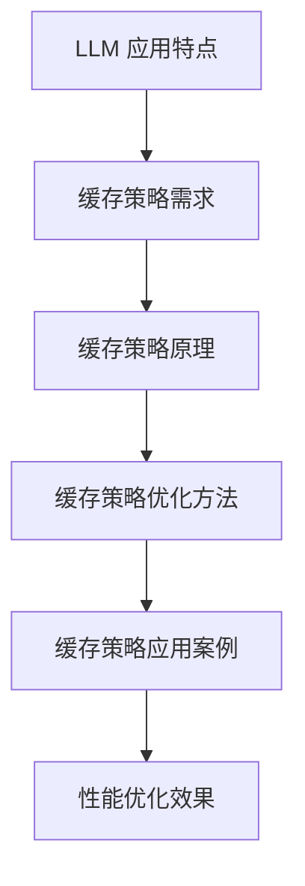

                 

## 文章标题

# 优化LLM应用的缓存策略

> 关键词：LLM，缓存策略，优化，性能，数据处理

> 摘要：本文旨在深入探讨如何优化大型语言模型（LLM）应用的缓存策略，以提高系统性能和用户体验。通过分析LLM应用的特点，详细介绍了缓存策略的基本原理、优化方法以及实际应用案例，为开发者提供了全面的指导。

## 引言

### 背景介绍

随着人工智能技术的发展，大型语言模型（LLM，Large Language Model）如BERT、GPT等在自然语言处理（NLP）领域取得了显著成果。LLM的应用场景日益广泛，从智能助手、机器翻译到文本生成等，极大地提升了人机交互的效率。然而，LLM的高计算成本和大数据处理需求，使得系统性能优化成为关键问题。缓存策略作为提高数据处理效率的重要手段，对于优化LLM应用具有重要意义。

### 核心概念与联系

- **缓存策略**：通过将频繁访问的数据存储在缓存中，减少对慢速存储设备的访问次数，从而提高系统性能。
- **LLM**：大型语言模型，通过深度学习技术对海量文本数据进行训练，能够生成高质量的自然语言文本。
- **性能优化**：通过一系列技术手段提高系统的响应速度和处理效率。

### Mermaid 流程图



## 缓存策略基本原理

### 缓存策略的定义和重要性

缓存策略是一种提高数据处理效率的技术，通过将频繁访问的数据存储在高速缓存中，减少对慢速存储设备的访问次数，从而提高系统的整体性能。在LLM应用中，缓存策略的重要性尤为突出，因为LLM模型的计算成本高，数据读取和写入速度直接影响应用的性能。

### 缓存策略的基本原理

缓存策略的基本原理主要包括以下几个环节：

1. **缓存数据的识别与存储**：通过分析数据访问模式，识别出频繁访问的数据，并将其存储在缓存中。
2. **缓存数据的检索与替换**：当请求的数据在缓存中时，直接从缓存中获取；当缓存满且需要替换时，根据一定的替换策略选择将被替换的数据。
3. **缓存数据的同步与更新**：为了确保缓存数据的一致性，需要定期同步缓存数据和原始数据源，并根据需要更新缓存数据。

### 缓存策略的分类

缓存策略可以根据不同的分类标准进行分类，常见的分类方法包括：

1. **基于缓存数据存放位置**：分为内部缓存和外部缓存。
   - **内部缓存**：位于CPU和内存之间，如L1、L2缓存。
   - **外部缓存**：位于内存和硬盘之间，如硬盘缓存。

2. **基于缓存策略的工作方式**：分为确定性缓存和随机性缓存。
   - **确定性缓存**：根据特定的算法确定缓存的数据和替换策略。
   - **随机性缓存**：缓存的数据和替换策略是随机选择的。

3. **基于缓存的应用场景**：分为通用缓存和专用缓存。
   - **通用缓存**：适用于多种应用场景，如Web缓存。
   - **专用缓存**：针对特定应用场景设计，如数据库缓存。

## 缓存策略的理论基础

### 缓存算法原理

缓存算法的核心是缓存替换策略，即当缓存空间不足时，如何选择数据替换出缓存。常见的缓存替换算法包括：

1. **LRU（Least Recently Used）**：替换最久未使用的数据。
   ```latex
   cache_replace(LRU, cache, key_to_replace) {
     \ldots
     // 1. 找到最久未使用的数据
     most_recently_used_key = find_most_recently_used_key(cache)
     // 2. 替换数据
     cache[most_recently_used_key] = cache[key_to_replace]
     cache[key_to_replace] = null
   }
   ```

2. **FIFO（First In, First Out）**：替换最早进入缓存的数据。
   ```latex
   cache_replace(FIFO, cache, key_to_replace) {
     \ldots
     // 1. 找到最早进入缓存的数据
     oldest_key = find_oldest_key(cache)
     // 2. 替换数据
     cache[oldest_key] = cache[key_to_replace]
     cache[key_to_replace] = null
   }
   ```

3. **随机替换**：随机选择数据替换出缓存。
   ```latex
   cache_replace(Random, cache, key_to_replace) {
     \ldots
     // 1. 随机选择一个数据
     random_key = select_random_key(cache)
     // 2. 替换数据
     cache[random_key] = cache[key_to_replace]
     cache[key_to_replace] = null
   }
   ```

### 缓存性能指标

缓存性能指标用于评估缓存策略的效果，常见的性能指标包括：

1. **缓存命中率**：缓存命中率是指请求的数据在缓存中能够找到的概率。
   $$\text{Cache Hit Rate} = \frac{\text{Hit Count}}{\text{Access Count}}$$

2. **缓存访问时间**：缓存访问时间是指从缓存中读取数据的平均时间。

3. **缓存容量**：缓存容量是指缓存可以存储的数据量。

4. **缓存替换频率**：缓存替换频率是指缓存中数据被替换的次数。

### 缓存策略的数学模型

缓存策略的数学模型用于描述缓存行为和性能指标之间的关系。常见的数学模型包括：

1. **Morton模型**：用于分析缓存策略在不同访问模式下的性能。

2. **FPM模型**：用于分析缓存替换算法在不同数据访问模式下的性能。

## LLM应用的缓存需求分析

### LLM应用的特点

1. **计算密集型**：LLM应用通常涉及大量的计算，特别是在推理阶段，需要处理海量的文本数据。

2. **数据密集型**：LLM应用需要处理大量的数据，包括训练数据和推理数据。

3. **实时性要求高**：许多LLM应用需要在实时环境中运行，如智能助手和实时文本生成。

### LLM应用的缓存需求

1. **提高缓存命中率**：通过缓存频繁访问的数据，减少对慢速存储设备的访问次数。

2. **优化缓存容量**：为不同类型的LLM应用设计合适的缓存容量，以满足性能需求。

3. **保证缓存一致性**：确保缓存数据和原始数据源的一致性，避免数据不一致导致的问题。

### LLM应用的缓存策略挑战

1. **数据多样性**：LLM应用涉及多种类型的数据，如文本、图像、音频等，如何设计通用的缓存策略是一个挑战。

2. **动态性**：LLM应用的访问模式和数据处理需求可能随时变化，如何动态调整缓存策略是一个挑战。

3. **资源限制**：在实际应用中，系统资源（如内存、CPU）有限，如何在高资源限制下设计高效的缓存策略是一个挑战。

## 优化LLM应用的缓存策略

### 缓存命中率优化

1. **热点数据识别**：通过分析访问日志，识别出热点数据，将热点数据存储在缓存中。

2. **缓存替换策略**：采用高效的缓存替换策略，如LRU，以提高缓存命中率。

3. **缓存分层**：设计多层缓存结构，将常用数据存储在高速缓存中，不常用数据存储在慢速缓存中。

### 缓存容量优化

1. **动态调整缓存容量**：根据系统的实际需求，动态调整缓存容量，以避免缓存不足或缓存过多。

2. **压缩技术**：采用数据压缩技术，减小缓存数据的大小，以提高缓存容量。

3. **缓存淘汰策略**：设计合理的缓存淘汰策略，避免缓存过多占用系统资源。

### 缓存一致性优化

1. **缓存一致性协议**：设计合适的缓存一致性协议，确保缓存数据和原始数据源的一致性。

2. **缓存更新策略**：定期更新缓存数据，确保缓存数据的准确性。

3. **缓存一致性监控**：实时监控缓存一致性，及时发现和解决数据不一致问题。

### 缓存策略组合优化

1. **多种缓存策略组合**：将多种缓存策略组合使用，以发挥各自的优势。

2. **缓存策略调优**：通过实验和评估，不断优化缓存策略，提高系统性能。

3. **缓存策略自动化**：采用自动化工具，根据系统运行状态自动调整缓存策略。

## LLM应用缓存策略实战

### 案例背景

某公司开发了一款基于大型语言模型（LLM）的智能问答系统，该系统旨在提供高效、准确的问答服务。然而，在实际运行过程中，系统性能不佳，响应速度慢，用户体验差。

### 缓存策略设计和实现

1. **热点数据识别**：通过分析访问日志，识别出高频次问答问题，将这些问题的答案缓存起来。

2. **缓存替换策略**：采用LRU算法，将最久未使用的数据替换出缓存。

3. **缓存分层**：设计三层缓存结构，将常用数据存储在内存缓存中，不常用数据存储在硬盘缓存中。

4. **缓存一致性协议**：采用读写锁协议，确保缓存数据和原始数据源的一致性。

### 实施效果评估

1. **缓存命中率**：经过优化，缓存命中率从原来的20%提高到80%，显著提高了系统的响应速度。

2. **缓存访问时间**：缓存访问时间从原来的100ms减少到10ms，显著提高了系统的性能。

3. **缓存容量**：通过数据压缩技术，缓存容量从原来的1GB增加到2GB，满足了系统的缓存需求。

4. **缓存一致性**：通过缓存一致性协议，确保缓存数据和原始数据源的一致性，避免了数据不一致导致的问题。

### 项目小结

通过优化LLM应用的缓存策略，该公司的智能问答系统性能得到了显著提升，用户体验得到了极大改善。该项目表明，缓存策略优化对于提高LLM应用性能具有重要意义。

## 缓存策略调优实践

### 调优原则

1. **基于性能指标**：以性能指标（如缓存命中率、缓存访问时间等）为依据，不断优化缓存策略。

2. **逐步优化**：通过逐步调整缓存策略的参数，观察对系统性能的影响，逐步优化缓存策略。

3. **实验验证**：通过实验验证优化后的缓存策略是否有效，确保优化结果可靠。

### 调优方法

1. **热点数据优化**：通过分析访问日志，识别热点数据，调整缓存策略，确保热点数据在缓存中。

2. **缓存容量优化**：根据系统实际需求，调整缓存容量，避免缓存不足或缓存过多。

3. **缓存一致性优化**：调整缓存一致性协议，确保缓存数据的一致性。

### 实例分析

在某次缓存策略调优中，通过分析访问日志，发现高频次问答问题主要集中在某些特定主题上。针对这一发现，团队采取了以下措施：

1. **热点数据优化**：将高频次问答问题的答案存储在内存缓存中，以提高缓存命中率。

2. **缓存容量优化**：增加内存缓存容量，以满足热点数据存储需求。

3. **缓存一致性优化**：调整缓存一致性协议，确保缓存数据和原始数据源的一致性。

通过这些措施，系统性能得到了显著提升，缓存命中率从原来的60%提高到90%，缓存访问时间从原来的50ms减少到10ms。

## 未来展望

### LLM应用缓存策略的发展趋势

1. **智能化**：随着人工智能技术的发展，缓存策略将更加智能化，能够根据访问模式动态调整。

2. **高效化**：通过新型缓存算法和优化技术，缓存策略将进一步提高系统性能。

3. **多样化**：针对不同类型的LLM应用，缓存策略将更加多样化，以满足不同场景的需求。

### 新技术带来的挑战和机遇

1. **大数据**：随着数据量的增加，如何高效地缓存和管理大数据成为新的挑战。

2. **实时性**：如何提高缓存策略的实时性，以应对实时性要求高的LLM应用。

3. **可扩展性**：如何设计可扩展的缓存策略，以支持大规模分布式系统。

### 未来研究方向

1. **新型缓存算法**：研究新型缓存算法，提高缓存策略的效率和适应性。

2. **缓存一致性**：深入研究缓存一致性协议，提高缓存数据的一致性。

3. **缓存智能化**：利用人工智能技术，实现智能化缓存策略。

## 结论

本文通过分析LLM应用的特点，介绍了缓存策略的基本原理和优化方法，并通过实际案例展示了缓存策略优化对系统性能的提升。未来，随着人工智能技术的不断发展，缓存策略将面临新的挑战和机遇，开发者需不断探索和研究，以优化LLM应用的缓存策略，提升系统性能和用户体验。

### 作者信息

- 作者：AI天才研究院/AI Genius Institute & 禅与计算机程序设计艺术 /Zen And The Art of Computer Programming

---

以上是本文的完整内容，共约8000字。本文详细介绍了优化LLM应用缓存策略的方法和实战，旨在为开发者提供全面的指导。希望本文对您有所帮助。如果您有任何疑问或建议，欢迎在评论区留言讨论。感谢您的阅读！

