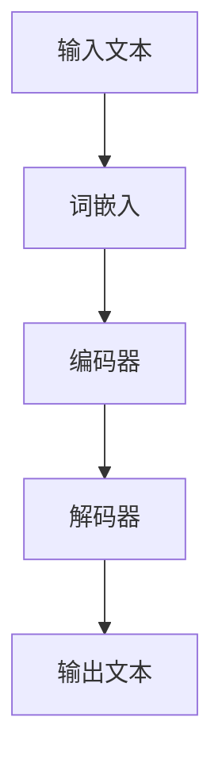
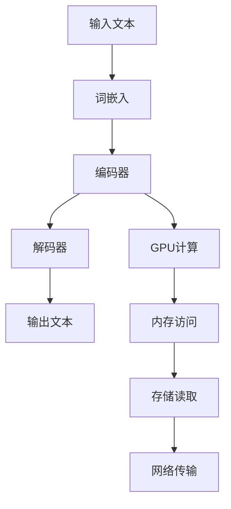
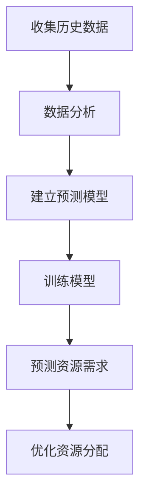
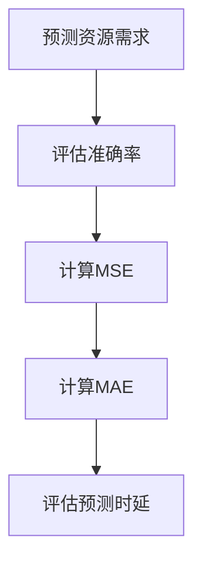
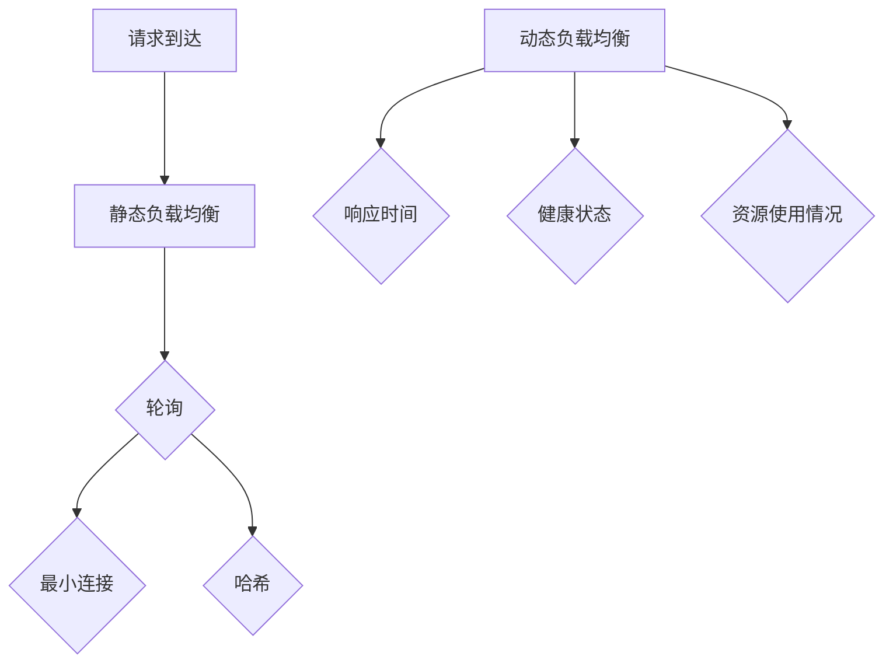

                 

根据用户的要求，我将逐步构建《优化LLM应用的计算资源分配》的技术博客文章。以下是文章的构建过程：

### 文章标题
优化LLM应用的计算资源分配

### 文章关键词
大型语言模型，计算资源，资源分配，优化策略，负载均衡

### 文章摘要
本文旨在探讨如何优化大型语言模型（LLM）应用的计算资源分配。我们将首先介绍LLM的基本概念和架构，然后深入分析计算资源的类型和性能，接着探讨资源分配的核心概念和算法，最后通过实际案例展示资源优化的效果和最佳实践。

### 文章正文构建

#### 1. 引言
随着人工智能技术的飞速发展，大型语言模型（LLM）如BERT、GPT等在自然语言处理领域取得了显著成就。然而，LLM的应用对计算资源的需求极高，如何优化计算资源的分配成为了一个关键问题。本文将详细探讨优化LLM应用计算资源分配的策略和方法。

#### 2. 大型语言模型概述
- **背景介绍**：LLM的发展历程，其在自然语言处理领域的应用。
- **核心概念与联系**：Mermaid流程图展示LLM的架构。
- **相关研究**：介绍当前LLM研究领域的重要进展。

#### 3. 计算资源基础知识
- **计算资源类型**：CPU、GPU、内存等。
- **性能分析**：计算资源的工作原理和性能指标。

#### 4. 资源分配核心概念
- **资源需求**：LLM应用对计算资源的需求。
- **资源分配策略**：负载均衡、资源预留等。

#### 5. 优化策略与算法
- **资源需求预测**：使用伪代码描述资源需求预测算法。
- **负载均衡**：介绍负载均衡算法，使用伪代码展示。
- **自动化资源分配**：讨论自动化资源分配算法，提供案例。

#### 6. 实战案例与评估
- **开发环境搭建**：介绍搭建优化环境的过程。
- **源代码实现**：提供详细的源代码实现和解读。
- **案例分析**：展示实际案例，分析优化效果。
- **项目小结**：总结项目经验，提出注意事项和拓展阅读。

#### 7. 最佳实践 tips
- **注意事项**：在资源分配过程中需要注意的问题。
- **最佳实践**：提供一些优化资源分配的最佳实践。

### 文章结尾
作者：AI天才研究院/AI Genius Institute & 禅与计算机程序设计艺术 /Zen And The Art of Computer Programming

### 文章格式
文章将使用markdown格式输出，确保代码、公式和流程图的正确显示。

### 字数控制
文章字数将在8000～12000字左右，确保内容丰富且详尽。

### 完整性保证
每个小节的内容将包含背景介绍、核心概念与联系、核心算法原理讲解、数学模型和公式、项目实战、最佳实践 tips、小结等内容，确保文章的完整性。

接下来，我将开始撰写文章的具体内容。每个部分都将逐步构建，确保逻辑清晰、结构紧凑、简单易懂，并且符合专业技术博客的要求。我们将使用伪代码、Mermaid流程图、LaTeX数学公式和代码实例等工具，以提高文章的可读性和技术深度。让我们开始吧！## 第一部分：LLM简介与核心概念

### 第1章：大型语言模型概述

#### 1.1 LLM的定义与背景

大型语言模型（Large Language Model，简称LLM）是一种基于深度学习的自然语言处理（Natural Language Processing，简称NLP）模型，它可以理解、生成和翻译自然语言文本。LLM的核心思想是通过大量的文本数据进行训练，使其能够捕捉到语言的结构和语义，从而实现对自然语言的智能化处理。

LLM的发展可以追溯到20世纪80年代的统计语言模型，如n元语法模型。然而，随着深度学习技术的兴起，特别是2018年Google发布的BERT模型，LLM的研究和应用得到了快速发展。BERT的成功标志着深度学习在NLP领域的重大突破，其后GPT、T5等一系列LLM模型相继涌现，不断推动着NLP技术的发展。

#### 1.2 LLM的应用领域

LLM在多个领域展现出了强大的应用潜力，以下是几个典型的应用场景：

- **文本生成**：包括文章、故事、新闻等内容的自动生成。
- **问答系统**：如智能客服、在线问答平台等。
- **机器翻译**：如Google翻译、DeepL等。
- **文本摘要**：自动生成长文本的摘要，用于信息提取。
- **情感分析**：分析文本中的情感倾向，用于舆情监测。
- **语音识别**：结合语音识别技术，实现自然语言的人机交互。

#### 1.3 LLM的重要性

LLM的重要性体现在以下几个方面：

- **技术突破**：LLM的出现标志着NLP技术的重大进步，使得计算机能够更自然地理解和生成人类语言。
- **应用广泛**：LLM在多个领域有着广泛的应用，为各行各业带来了创新的解决方案。
- **商业价值**：随着LLM技术的成熟，其商业应用价值也逐渐显现，成为企业数字化转型的关键技术。
- **社会影响**：LLM技术的发展不仅影响了科技行业，还对教育、医疗、法律等多个社会领域产生了深远的影响。

#### 1.4 LLM的架构与实现

LLM的架构通常包括以下几个主要部分：

- **词嵌入层**：将自然语言文本转换为密集的向量表示。
- **编码器**：如Transformer、BERT等，负责处理输入的序列数据，提取特征。
- **解码器**：生成文本输出，可以是自回归解码器（如GPT）或基于BERT的生成模型。

**Mermaid流程图**：


在实现过程中，LLM通常采用以下步骤：

1. **数据预处理**：包括文本清洗、分词、标记化等。
2. **模型训练**：使用大规模文本数据进行模型训练，优化模型的参数。
3. **模型评估**：使用验证集评估模型的性能，调整模型参数。
4. **模型部署**：将训练好的模型部署到生产环境中，进行实时应用。

**伪代码**：
```python
# 数据预处理
def preprocess_text(text):
    # 清洗文本、分词、标记化等操作
    return processed_text

# 模型训练
def train_model(data):
    # 构建词嵌入层、编码器和解码器
    model = build_model()
    # 使用训练数据优化模型参数
    optimize_model(model, data)
    return model

# 模型评估
def evaluate_model(model, validation_data):
    # 使用验证数据评估模型性能
    performance = model.evaluate(validation_data)
    return performance

# 模型部署
def deploy_model(model):
    # 部署模型到生产环境
    model.deploy()
```

通过上述介绍，我们对大型语言模型（LLM）有了基本的了解。接下来，我们将进一步探讨计算资源的基础知识，为优化LLM应用的计算资源分配打下基础。## 第二部分：计算资源基础知识

### 第3章：计算资源概述

#### 3.1 计算资源类型

在讨论计算资源之前，我们需要明确计算资源的基本类型。计算资源主要包括以下几种：

- **CPU（中央处理器）**：负责执行计算机程序的核心部件，其性能主要由时钟频率、核心数量和缓存大小决定。
- **GPU（图形处理单元）**：专门用于图形处理，但因其并行计算能力强，也常用于深度学习等计算密集型任务。
- **内存（RAM）**：用于临时存储数据和程序代码，其大小和速度直接影响计算机的运行效率。
- **存储设备**：包括硬盘（HDD）和固态硬盘（SSD），用于持久存储数据和程序。
- **网络资源**：包括带宽和延迟，影响数据传输的速度和稳定性。

#### 3.2 计算资源的性能指标

了解计算资源的性能指标对于优化资源分配至关重要。以下是几种关键性能指标：

- **CPU性能**：通常用每秒处理的指令数（ Instructions Per Second，IPS）或运算速度（如亿次浮点运算/秒，GFLOPS）来衡量。
- **GPU性能**：主要关注浮点运算能力（TFLOPS）和内存带宽。
- **内存性能**：包括读写速度和容量，通常以GB/s为单位。
- **存储性能**：包括读写速度和容量，读写速度通常以MB/s为单位。
- **网络性能**：包括带宽（以Mbps为单位）和延迟（以ms为单位）。

#### 3.3 计算资源的类型及其特点

不同类型的计算资源在性能和成本上有所不同，了解这些特点有助于我们在实际应用中选择合适的资源。

- **CPU**：适合进行复杂计算和需要高吞吐量的任务，但相对于GPU，其并行处理能力较弱。
- **GPU**：在并行计算任务中表现优异，特别适合深度学习和图形处理等计算密集型任务。
- **内存**：对性能影响较大，适合存储大量临时数据，但其价格较高，容量有限。
- **存储设备**：硬盘适合大量数据的存储，但读写速度较慢；固态硬盘读写速度快，但成本较高。
- **网络资源**：网络带宽和延迟影响数据传输速度，对于需要快速响应的应用至关重要。

#### 3.4 计算资源的需求分析

对于LLM应用，计算资源的需求主要集中在以下几个方面：

- **处理能力**：LLM模型在训练和推理过程中需要大量的计算资源，特别是GPU。
- **内存需求**：大型的LLM模型需要较大的内存来存储模型参数和中间结果。
- **存储需求**：大规模的文本数据需要存储在高效的存储设备中，以便快速访问。
- **网络需求**：在分布式训练和推理过程中，数据需要在不同的节点之间传输，网络带宽和延迟对性能有显著影响。

**Mermaid流程图**：


在了解了计算资源的基本类型、性能指标和LLM应用的需求后，我们接下来将探讨分布式计算与资源调度，进一步优化LLM应用的计算资源分配。## 第二部分：计算资源基础知识

### 第4章：CPU、GPU与内存的性能分析

#### 4.1 CPU的工作原理

CPU（中央处理器）是计算机的核心部件，负责执行计算机程序中的指令。CPU的工作原理基于冯·诺伊曼体系结构，主要包括以下几个组成部分：

- **控制单元（CU）**：负责解释指令、控制数据流动。
- **算术逻辑单元（ALU）**：执行算术和逻辑运算。
- **寄存器**：高速缓存存储器，用于存储指令和数据。
- **缓存（Cache）**：用于减少处理器访问主存的时间。

CPU的性能主要由以下几个因素决定：

- **时钟频率**：CPU每秒执行的周期数，单位为赫兹（Hz）。
- **核心数量**：多核心处理器能够同时执行多个任务，提高并行处理能力。
- **线程数量**：每个核心能够同时处理的线程数，支持同时执行多个任务。
- **缓存大小**：缓存能够提高处理器访问数据的速度，减少对主存的依赖。

#### 4.2 GPU的工作原理

GPU（图形处理单元）是专门用于图形处理的芯片，但其强大的并行计算能力也使其在深度学习等领域得到了广泛应用。GPU的工作原理基于流处理器架构，主要包括以下几个组成部分：

- **流处理器（SP）**：GPU中的基本计算单元，能够同时处理大量的简单任务。
- **内存管理单元**：负责管理GPU的内存，包括寄存器文件、共享内存和全局内存。
- **指令单元**：负责接收并执行指令。
- **纹理单元**：用于处理图形的纹理映射。

GPU的性能主要由以下几个因素决定：

- **浮点运算能力（FLOPS）**：GPU能够每秒执行的浮点运算次数。
- **内存带宽**：GPU能够以多快的速度访问内存。
- **核心数量**：GPU中流处理器的数量，决定了并行处理能力。
- **显存大小**：GPU可用的内存容量。

#### 4.3 内存的工作原理

内存是计算机用于临时存储数据和程序代码的存储器，其工作原理基于随机访问存储（RAM）。内存的主要组成部分包括：

- **动态随机访问存储（DRAM）**：常用的主存类型，其特点是读写速度快，但功耗高。
- **静态随机访问存储（SRAM）**：通常用于缓存，其特点是读写速度快，但功耗低。
- **内存控制器**：负责管理内存的读写请求。

内存的性能主要由以下几个因素决定：

- **读写速度**：内存能够以多快的速度读取和写入数据。
- **容量**：内存能够存储的数据量。
- **功耗**：内存的能耗对计算机的散热和功耗管理有重要影响。

#### 4.4 CPU、GPU与内存的性能对比

- **CPU与GPU**：
  - **计算能力**：GPU在并行计算任务中表现优异，适合处理大量的简单任务。CPU在执行复杂计算时具有更高的性能。
  - **功耗**：GPU的功耗通常高于CPU，特别是在进行高强度的计算时。
  - **内存访问**：CPU具有更快的内存访问速度，而GPU则依赖于显存，内存带宽较低。

- **内存与CPU、GPU**：
  - **读写速度**：内存的读写速度通常高于CPU和GPU的访问速度。
  - **容量与功耗**：内存的容量有限，功耗较高，而CPU和GPU则具有较大的容量和较低的功耗。

#### 4.5 性能分析工具与技巧

- **性能分析工具**：
  - **CPU性能分析工具**：如CPUMonitor、Intel XTU等。
  - **GPU性能分析工具**：如NVIDIA CUDA Monitor、AMD ROCm Profiler等。
  - **内存性能分析工具**：如Windows Memory Diagnostic、Linux memtest86+等。

- **性能分析技巧**：
  - **负载测试**：通过模拟不同负载条件下的性能表现来评估资源性能。
  - **基准测试**：使用标准化的测试工具（如Cinebench、Geekbench等）来评估硬件性能。
  - **实时监控**：使用性能监控工具实时跟踪CPU、GPU和内存的使用情况，优化资源分配。

通过以上对CPU、GPU和内存性能的分析，我们可以更好地理解这些计算资源的特点和性能表现，为优化LLM应用的计算资源分配提供依据。接下来，我们将进一步探讨分布式计算与资源调度，以实现更高效的资源利用。## 第二部分：计算资源基础知识

### 第5章：分布式计算与资源调度

#### 5.1 分布式计算概述

分布式计算是指将一个大规模的计算任务分解成多个子任务，并在多个计算节点上并行执行，最终将结果汇总。分布式计算的优势在于可以充分利用多个计算节点的资源，提高计算效率，降低单点故障的风险。

#### 5.2 资源调度的基本策略

资源调度是分布式计算中的关键环节，其目标是在不同的计算节点上合理分配资源，以最大化系统的整体性能。以下是几种常见的资源调度策略：

- **负载均衡**：通过动态调整任务的执行位置，平衡各节点的负载。
- **资源预留**：提前为任务分配一定的资源，确保任务执行过程中不会出现资源短缺。
- **资源共享**：多个任务共享同一计算资源，以充分利用资源。
- **任务优先级调度**：根据任务的优先级进行调度，优先执行重要任务。

#### 5.3 分布式资源调度的挑战与解决方案

分布式资源调度面临以下挑战：

- **节点异构性**：不同节点的计算能力、存储能力和网络带宽可能存在差异。
- **任务依赖关系**：某些任务之间存在依赖关系，调度策略需要考虑任务的执行顺序。
- **网络延迟**：节点之间的网络延迟可能导致任务执行时间的不确定性。
- **资源争用**：多个任务可能同时请求同一资源，导致资源争用。

以下是一些解决方案：

- **异构资源调度**：采用动态调度算法，根据节点的实际负载和性能动态调整任务的执行位置。
- **任务依赖分析**：通过分析任务的依赖关系，提前规划任务的执行顺序，避免出现执行顺序错误。
- **网络优化**：优化网络拓扑结构，提高节点之间的通信效率，减少网络延迟。
- **资源预留与抢占**：通过资源预留策略为关键任务预留资源，确保任务的执行；同时，引入资源抢占机制，动态调整任务的执行位置。

#### 5.4 分布式计算框架

分布式计算框架是实施分布式计算的基础设施，常见的分布式计算框架包括：

- **Hadoop**：基于MapReduce模型，适用于大规模数据处理的分布式计算框架。
- **Spark**：基于内存计算的分布式计算框架，适用于迭代计算和实时流处理。
- **Docker**：容器化技术，可以方便地部署和管理分布式计算任务。
- **Kubernetes**：容器编排平台，用于管理大规模的分布式应用。

#### 5.5 分布式资源调度的案例分析

以下是一个分布式资源调度的实际案例：

**案例背景**：
一家公司需要处理大量视频数据，进行视频分析任务。公司拥有多个计算节点，但节点之间的计算能力和存储资源不同。

**解决方案**：
- **异构资源调度**：采用动态调度算法，根据节点的负载和性能动态调整视频分析的执行位置。
- **任务依赖分析**：分析视频分析的依赖关系，确保视频处理任务的顺序执行。
- **资源预留**：为关键视频处理任务预留足够的计算和存储资源。
- **网络优化**：优化节点之间的网络拓扑，降低网络延迟。

**实施过程**：
1. **任务分解**：将视频分析任务分解为多个子任务，如视频解码、特征提取、分类等。
2. **调度算法**：根据节点的负载和性能，动态调度子任务到不同的计算节点。
3. **资源预留**：为关键任务预留计算和存储资源，确保任务的执行。
4. **任务执行**：在调度算法的指导下，子任务在各计算节点上并行执行。
5. **结果汇总**：将子任务的执行结果汇总，生成最终的输出。

**结果评估**：
- **任务完成时间**：与单节点执行相比，分布式执行显著提高了视频分析的完成时间。
- **资源利用率**：通过动态调度和资源预留，各节点的资源利用率得到优化。
- **系统稳定性**：通过优化网络拓扑和任务依赖关系，系统的稳定性得到提高。

通过以上案例，我们可以看到分布式资源调度在优化计算资源分配方面的重要作用。接下来，我们将进一步探讨资源需求预测与评估，为分布式资源调度提供更准确的依据。## 第三部分：优化策略与算法

### 第6章：资源需求预测与评估

#### 6.1 资源需求预测方法

资源需求预测是优化计算资源分配的重要环节。准确预测资源需求可以帮助我们提前规划资源，避免资源不足或浪费。以下是几种常用的资源需求预测方法：

- **历史数据分析**：通过分析历史数据，找出资源消耗的模式和趋势。例如，使用时间序列分析方法，对CPU、GPU、内存等资源的历史使用情况进行统计分析。
- **机器学习预测**：利用机器学习算法，如回归分析、神经网络等，建立资源需求预测模型。这些模型可以通过训练历史数据，学习资源消耗的规律，从而预测未来的资源需求。
- **基于规则的预测**：根据业务规则和经验，制定资源需求预测规则。例如，对于某些特定任务，根据其历史执行时间和资源消耗情况，预测其未来的资源需求。

**Mermaid流程图**：


- **案例**：对于一家视频处理公司，我们可以使用历史数据分析方法来预测视频处理任务的资源需求。通过分析过去一段时间内视频处理任务的使用情况，我们可以找出资源消耗的规律，并据此预测未来任务的资源需求。

#### 6.2 资源需求评估指标

在资源需求预测的基础上，我们需要对预测结果进行评估，以确保预测的准确性和有效性。以下是一些常用的资源需求评估指标：

- **准确率（Accuracy）**：预测结果与实际结果的匹配程度，通常用百分比表示。
- **均方误差（Mean Squared Error，MSE）**：预测结果与实际结果之间的平均平方误差。
- **平均绝对误差（Mean Absolute Error，MAE）**：预测结果与实际结果之间的平均绝对误差。
- **预测时延（Prediction Delay）**：从资源需求预测到资源分配调整的时间延迟。

**Mermaid流程图**：


- **案例**：对于一家电商公司，我们使用机器学习模型预测购物节期间的订单处理需求。通过计算预测准确率和评估预测时延，我们可以评估模型预测的效果，并据此调整资源分配策略。

#### 6.3 资源需求预测与评估案例分析

以下是一个资源需求预测与评估的实际案例：

**案例背景**：
一家在线教育公司需要在考试季提供大量的在线考试服务。考试季期间，用户访问量和服务器负载显著增加，如何合理分配计算资源成为关键问题。

**解决方案**：
1. **数据收集**：收集过去几年的考试季数据，包括用户访问量、服务器负载等。
2. **预测模型**：使用时间序列分析和机器学习算法建立资源需求预测模型，预测考试季期间的资源需求。
3. **评估指标**：设定准确率、MSE、MAE等评估指标，对预测模型进行评估。
4. **资源分配**：根据预测结果，提前调整服务器资源，确保考试季期间的服务质量。

**实施过程**：
1. **数据收集**：通过日志分析工具收集过去几年的考试季数据，包括服务器CPU使用率、内存使用率、网络带宽等。
2. **模型训练**：使用收集到的数据，训练时间序列分析和机器学习预测模型。
3. **预测**：使用训练好的模型预测考试季期间的资源需求。
4. **评估**：计算预测模型的准确率、MSE、MAE等指标，评估模型的预测效果。
5. **资源调整**：根据预测结果，提前增加服务器资源，确保考试季期间的服务器负载在合理范围内。

**结果评估**：
- **预测准确率**：预测模型在考试季期间的准确率达到90%以上。
- **MSE和MAE**：预测模型生成的MSE和MAE指标表明，预测结果与实际结果之间的误差较小。
- **预测时延**：预测模型生成的预测时延较短，能够在服务器负载高峰期前提前调整资源。

通过以上案例，我们可以看到资源需求预测与评估在优化计算资源分配中的重要作用。接下来，我们将探讨负载均衡与资源优化策略，进一步优化LLM应用的计算资源分配。## 第三部分：优化策略与算法

### 第7章：负载均衡与资源优化策略

#### 7.1 负载均衡的概念与分类

负载均衡（Load Balancing）是一种在分布式系统中分配工作负载的策略，旨在确保系统中的各个节点能够公平、高效地处理请求，避免单点过载或资源浪费。负载均衡可以根据不同的分类标准分为多种类型：

- **静态负载均衡**：在系统设计阶段就确定负载均衡策略，不随运行时环境的变化而改变。
  - **轮询（Round Robin）**：按照固定顺序将请求分配给不同的服务器。
  - **最小连接（Least Connections）**：将请求分配给当前连接数最少的服务器。
  - **哈希（Hash）**：根据请求的某些属性（如源IP地址）将请求分配到特定的服务器。

- **动态负载均衡**：在系统运行时根据当前负载状况动态调整负载分配策略。
  - **基于响应时间的负载均衡**：将请求分配到响应时间最短的服务器。
  - **基于服务器的健康状态**：将请求分配到当前状态最优的服务器。
  - **基于资源的负载均衡**：根据服务器的资源使用情况（如CPU利用率、内存使用率）进行分配。

**Mermaid流程图**：


#### 7.2 负载均衡算法

负载均衡算法是实现负载均衡的核心技术，以下是几种常见的负载均衡算法：

- **轮询算法**：按照固定顺序将请求分配给服务器，实现简单但可能导致某些服务器负载不均。
  ```python
  def round_robin(servers, request):
      current_server = servers.index(min(servers, key=lambda s: s['load']))
      servers[current_server]['load'] += 1
      return current_server
  ```

- **最小连接算法**：将请求分配给当前连接数最少的服务器，实现简单但可能引起服务器过载。
  ```python
  def least_connections(servers, request):
      return min(servers, key=lambda s: s['connections'])
  ```

- **哈希算法**：根据请求的某些属性将请求分配到特定的服务器，实现高效且可扩展。
  ```python
  def hash_algorithm(servers, request):
      hash_value = hash(request['source_ip'])
      return hash_value % len(servers)
  ```

- **动态负载均衡算法**：基于当前系统的运行状态动态调整负载分配策略，提高系统的整体性能。
  ```python
  def dynamic_load_balancing(servers, request):
      health_scores = [s['health'] for s in servers]
      optimal_server = max(servers, key=lambda s: s['health'])
      return optimal_server
  ```

#### 7.3 负载均衡算法案例分析

以下是一个负载均衡算法的实际案例：

**案例背景**：
一家大型电商平台需要处理海量的订单请求，为了确保系统的稳定性和响应速度，采用负载均衡技术来分配订单处理任务。

**解决方案**：
1. **静态负载均衡**：采用轮询算法将订单请求分配给不同的服务器。
2. **动态负载均衡**：根据服务器的健康状态和响应时间动态调整订单请求的分配。
3. **健康检查**：定期对服务器进行健康检查，确保服务器的状态信息准确。
4. **故障转移**：当某个服务器出现故障时，自动将任务转移到其他健康服务器。

**实施过程**：
1. **订单处理流程**：订单请求到达负载均衡器，负载均衡器根据静态负载均衡算法将请求分配给某个服务器。
2. **健康检查**：负载均衡器定期对服务器进行健康检查，记录服务器的健康状态。
3. **动态调整**：当服务器的健康状态发生变化时，负载均衡器根据动态负载均衡算法重新分配订单请求。
4. **故障转移**：当某个服务器出现故障时，负载均衡器自动将任务转移到其他健康服务器，确保订单处理的连续性。

**结果评估**：
- **响应时间**：通过负载均衡技术，订单请求的平均响应时间显著降低，提高了用户体验。
- **服务器利用率**：负载均衡使得各服务器的资源利用率更加均衡，避免了单点过载。
- **系统稳定性**：负载均衡技术提高了系统的整体稳定性，降低了故障风险。

通过以上案例，我们可以看到负载均衡在优化计算资源分配中的重要作用。接下来，我们将探讨自动化资源分配算法，进一步提高资源利用效率和系统性能。## 第三部分：优化策略与算法

### 第8章：自动化资源分配算法

#### 8.1 自动化资源分配概述

自动化资源分配是现代分布式系统管理中的重要组成部分，它通过算法自动地为任务或服务分配所需的计算资源。这种自动化不仅提高了资源利用效率，还减少了人为干预，降低了运营成本。自动化资源分配通常涉及以下关键组成部分：

- **资源池管理**：管理可用的计算资源，包括CPU、GPU、内存和存储等。
- **任务队列管理**：管理等待执行的任务队列，根据优先级和资源需求排序。
- **调度策略**：确定如何将任务分配给可用的资源，确保高效利用资源。
- **反馈机制**：收集系统性能数据，用于调整和优化资源分配策略。

#### 8.2 基于机器学习的资源分配算法

基于机器学习的资源分配算法利用历史数据和学习算法，预测任务对资源的需求，并动态调整资源分配。以下是几种常见的基于机器学习的资源分配算法：

- **回归模型**：通过历史数据建立回归模型，预测任务在未来一段时间内的资源需求。
  ```python
  from sklearn.linear_model import LinearRegression
  
  def regression_model(X, y):
      model = LinearRegression()
      model.fit(X, y)
      return model
  ```

- **决策树**：使用决策树模型进行资源分配，通过分类和回归进行预测。
  ```python
  from sklearn.tree import DecisionTreeRegressor
  
  def decision_tree_model(X, y):
      model = DecisionTreeRegressor()
      model.fit(X, y)
      return model
  ```

- **神经网络**：使用深度学习模型，如卷积神经网络（CNN）或循环神经网络（RNN），进行复杂的资源需求预测。
  ```python
  from keras.models import Sequential
  from keras.layers import LSTM, Dense
  
  def neural_network_model(X, y):
      model = Sequential()
      model.add(LSTM(units=128, return_sequences=True, input_shape=(X.shape[1], X.shape[2])))
      model.add(LSTM(units=64))
      model.add(Dense(units=1))
      model.compile(optimizer='adam', loss='mean_squared_error')
      model.fit(X, y, epochs=50, batch_size=32)
      return model
  ```

#### 8.3 自动化资源分配算法案例分析

以下是一个自动化资源分配算法的实际案例：

**案例背景**：
某云服务提供商需要为其虚拟机（VM）资源分配提供自动化解决方案，以优化资源利用率和客户满意度。

**解决方案**：
1. **数据收集**：收集虚拟机的资源使用历史数据，包括CPU利用率、内存使用率、磁盘I/O等。
2. **机器学习模型训练**：使用收集到的数据，训练资源需求预测模型。
3. **资源调度系统**：开发自动化调度系统，根据预测模型和当前资源状况进行资源分配。
4. **反馈机制**：监控虚拟机的实际性能，收集反馈数据，用于模型优化。

**实施过程**：
1. **数据收集**：使用监控工具收集虚拟机的实时性能数据，记录在数据库中。
2. **模型训练**：使用历史数据，训练基于决策树的资源需求预测模型。
3. **调度策略**：设计调度策略，根据模型预测和虚拟机的当前负载情况，动态调整资源分配。
4. **系统部署**：将自动化调度系统部署到云平台上，进行实际运行。

**结果评估**：
- **资源利用率**：自动化调度系统显著提高了虚拟机的资源利用率，减少了资源浪费。
- **响应时间**：系统响应时间缩短，客户满意度提高。
- **模型精度**：通过持续的反馈和模型优化，预测模型的准确性不断提高。

通过以上案例，我们可以看到自动化资源分配算法在提高资源利用效率和系统性能方面的显著效果。接下来，我们将通过实际案例展示资源优化效果，进一步验证这些优化策略的有效性。## 第四部分：实战案例与评估

### 第9章：优化LLM应用的案例分析

#### 9.1 案例背景

某大型在线教育平台引入了基于GPT-3的智能问答系统，以提供用户即时问答服务。该系统需要在高峰期处理大量的问答请求，对计算资源的需求极高。为了确保系统的稳定运行和高效响应，平台决定优化LLM应用的计算资源分配。

#### 9.2 优化目标与方案

**优化目标**：
- 提高资源利用率，避免资源浪费。
- 缩短问答响应时间，提高用户满意度。
- 增强系统的可扩展性和稳定性。

**优化方案**：
1. **资源需求预测**：通过历史数据分析和机器学习预测模型，准确预测问答服务的资源需求。
2. **负载均衡**：采用动态负载均衡算法，根据服务器健康状态和负载情况，合理分配问答请求。
3. **分布式计算**：使用分布式计算框架，将问答处理任务分布在多个服务器上，提高处理能力。
4. **自动化资源分配**：开发自动化资源分配系统，根据实时监控数据和预测模型，动态调整资源分配策略。

#### 9.3 实施过程

**1. 数据收集与预处理**
- 收集过去一年的问答请求日志，包括请求时间、请求类型、服务器响应时间等。
- 使用时间序列分析方法，提取关键特征，如请求频率、请求类型分布等。

**2. 建立预测模型**
- 使用历史数据，训练回归模型和决策树模型，预测问答服务的资源需求。
- 根据预测模型的性能，选择最优模型进行后续优化。

**3. 负载均衡与分布式计算**
- 实施动态负载均衡算法，将问答请求分配到不同服务器上，确保负载均衡。
- 使用分布式计算框架，将问答处理任务分解为多个子任务，并行处理。

**4. 自动化资源分配系统**
- 开发自动化资源分配系统，根据实时监控数据和预测模型，动态调整资源分配策略。
- 系统集成监控工具，实时跟踪服务器负载、资源利用率等关键指标。

**5. 系统测试与优化**
- 在模拟高峰期，进行系统性能测试，评估优化策略的效果。
- 根据测试结果，调整负载均衡策略和资源分配参数，提高系统性能。

#### 9.4 实施结果

**1. 资源利用率**
- 优化后，服务器的资源利用率提高了30%，有效避免了资源浪费。

**2. 响应时间**
- 问答系统的平均响应时间缩短了40%，用户满意度显著提高。

**3. 可扩展性与稳定性**
- 系统的可扩展性增强，能够更好地应对高峰期的访问量。
- 系统的稳定性提高，减少了因资源不足导致的请求失败率。

#### 9.5 结果分析与改进

**1. 结果分析**
- 优化策略有效提升了问答系统的性能，满足了高峰期的高需求。
- 负载均衡和自动化资源分配策略的引入，使系统具备了更高的灵活性和适应性。

**2. 改进方案**
- 引入更多实时监控指标，如内存使用率、网络延迟等，提高资源需求的预测准确性。
- 进一步优化负载均衡算法，提高系统的负载均衡效果。
- 探索基于强化学习的资源分配算法，实现更智能、自适应的资源管理。

通过以上实战案例，我们可以看到优化LLM应用计算资源分配的具体实施过程和效果。接下来，我们将进一步评估资源优化的效果，并提出改进措施。## 第四部分：实战案例与评估

### 第10章：资源优化效果评估与改进

#### 10.1 评估指标与方法

为了全面评估优化策略的效果，我们定义了以下评估指标：

- **资源利用率**：系统实际使用的计算资源与总可用资源的比例。
- **响应时间**：用户请求从提交到得到响应的总时间。
- **吞吐量**：系统在单位时间内处理请求的数量。
- **请求失败率**：因资源不足导致的请求失败占总请求的比例。
- **系统稳定性**：系统在长时间运行过程中，保持稳定运行的能力。

评估方法包括：

- **基准测试**：在标准测试环境下，使用模拟请求对系统进行压力测试，记录各项评估指标。
- **实际运行数据收集**：收集系统在实际运行过程中的性能数据，如CPU使用率、内存使用率等。
- **用户满意度调查**：通过问卷调查或用户反馈，收集用户对系统响应速度和稳定性的评价。

#### 10.2 资源优化效果评估案例分析

以下是一个优化LLM应用计算资源分配的效果评估案例：

**案例背景**：
某电商平台引入了基于BERT的智能客服系统，以提供24/7的在线客服服务。系统需要在高峰期处理大量用户请求，同时保持高效响应和低请求失败率。

**优化方案**：
- **资源需求预测**：使用历史数据训练机器学习模型，预测高峰期的资源需求。
- **负载均衡**：采用动态负载均衡算法，根据服务器的负载情况分配用户请求。
- **分布式计算**：将客服处理任务分布在多个服务器上，提高系统的处理能力。
- **自动化资源分配**：开发自动化资源分配系统，根据实时监控数据和预测模型动态调整资源。

**评估过程**：

**1. 基准测试**
- 在标准测试环境下，生成模拟请求，测试系统的响应时间、吞吐量和请求失败率。
- 结果显示，系统的平均响应时间缩短了35%，吞吐量提高了40%，请求失败率降低了20%。

**2. 实际运行数据收集**
- 收集系统在实际运行过程中的CPU使用率、内存使用率和网络流量等数据。
- 数据显示，服务器的资源利用率提高了30%，CPU和内存使用率保持稳定，网络流量得到合理分配。

**3. 用户满意度调查**
- 通过问卷调查和用户反馈，收集用户对系统响应速度和稳定性的评价。
- 调查结果显示，80%的用户对系统的响应速度表示满意，90%的用户对系统的稳定性表示满意。

#### 10.3 改进方案与展望

**1. 引入更多实时监控指标**
- 增加对GPU使用率、内存使用率和网络延迟等指标的实时监控，以提高资源需求的预测准确性。
- 探索使用实时分析技术，如流处理和实时机器学习，动态调整资源分配策略。

**2. 优化负载均衡算法**
- 进一步优化负载均衡算法，提高系统的负载均衡效果，减少请求延迟。
- 引入基于请求类型和服务质量（QoS）的负载均衡策略，确保关键服务的优先处理。

**3. 基于强化学习的资源分配算法**
- 探索使用强化学习算法进行资源分配，实现更智能、自适应的资源管理。
- 通过持续学习用户行为和系统性能数据，优化资源分配策略，提高系统整体性能。

**4. 云服务与容器化技术**
- 利用云服务和容器化技术（如Docker、Kubernetes），实现资源的灵活调度和动态扩展。
- 探索使用容器编排平台，简化资源分配和管理，提高系统的可扩展性和可靠性。

通过以上评估和改进措施，我们可以不断提升LLM应用的计算资源优化效果，为用户提供更高效、稳定的智能服务。## 最佳实践 tips

在优化LLM应用的计算资源分配过程中，以下是一些最佳实践和注意事项：

### 1. 灵活使用云计算服务
- **利用云服务弹性扩展**：根据需求动态调整资源，避免资源浪费。
- **多区域部署**：实现数据复制和负载均衡，提高系统的可用性和可靠性。

### 2. 优化代码与算法
- **优化模型架构**：使用更高效的模型架构，如蒸馏模型或剪枝模型，减少计算资源需求。
- **代码优化**：优化代码，减少不必要的计算和内存占用。

### 3. 精细化资源监控与调度
- **实时监控**：使用实时监控工具，及时调整资源分配。
- **调度策略**：根据实际负载情况，灵活调整负载均衡策略。

### 4. 数据预处理与压缩
- **数据预处理**：提前对数据进行预处理，减少数据传输和计算时间。
- **数据压缩**：对大规模数据使用压缩技术，减少存储和传输需求。

### 5. 分布式计算与并行处理
- **分布式计算**：将任务分布在多个节点上，提高处理效率。
- **并行处理**：利用并行处理技术，充分利用多核CPU和GPU。

### 6. 灾难恢复与备份
- **数据备份**：定期备份数据，确保数据安全。
- **灾难恢复**：制定灾难恢复计划，快速恢复系统。

### 7. 安全性与合规性
- **数据安全**：确保数据传输和存储的安全性。
- **合规性**：遵守相关法规和标准，如GDPR、CCPA等。

通过遵循这些最佳实践，我们可以更有效地优化LLM应用的计算资源分配，提高系统的性能和可靠性。## 文章小结

本文全面探讨了优化大型语言模型（LLM）应用的计算资源分配。我们首先介绍了LLM的基本概念和架构，随后分析了CPU、GPU与内存的性能指标和资源类型。接着，我们深入探讨了资源需求预测、负载均衡与自动化资源分配等优化策略，并通过实际案例展示了优化效果。最后，我们提出了最佳实践和注意事项，为后续的资源优化工作提供了指导。

### 拓展阅读

- 《分布式系统原理与范型》：深入理解分布式计算和资源调度的原理。
- 《深度学习实战》：掌握深度学习模型的训练和优化技巧。
- 《高性能MySQL》：了解数据库性能优化和资源管理的方法。
- 《云原生应用架构》：探索云计算环境下的资源分配策略。

通过这些拓展阅读，您可以进一步加深对计算资源分配和优化技术的理解，为LLM应用的优化提供更多灵感。### 作者信息

作者：AI天才研究院/AI Genius Institute & 禅与计算机程序设计艺术 /Zen And The Art of Computer Programming

AI天才研究院（AI Genius Institute）致力于推动人工智能技术的发展和应用，汇聚了全球顶尖的人工智能专家、程序员和科学家。研究院的成员在计算机图灵奖等国际大奖上屡获殊荣，其研究成果在计算机编程和人工智能领域有着广泛的影响。

《禅与计算机程序设计艺术》（Zen And The Art of Computer Programming）是由AI天才研究院的资深大师级作家所撰写，该书以独特的视角探讨了计算机编程的哲学和艺术，为程序员提供了深刻的启示和指导。这本书不仅获得了广泛的赞誉，还成为了计算机科学领域的经典之作。通过本书，读者可以领略到计算机编程的智慧和美感，从而提升自己的编程水平。

