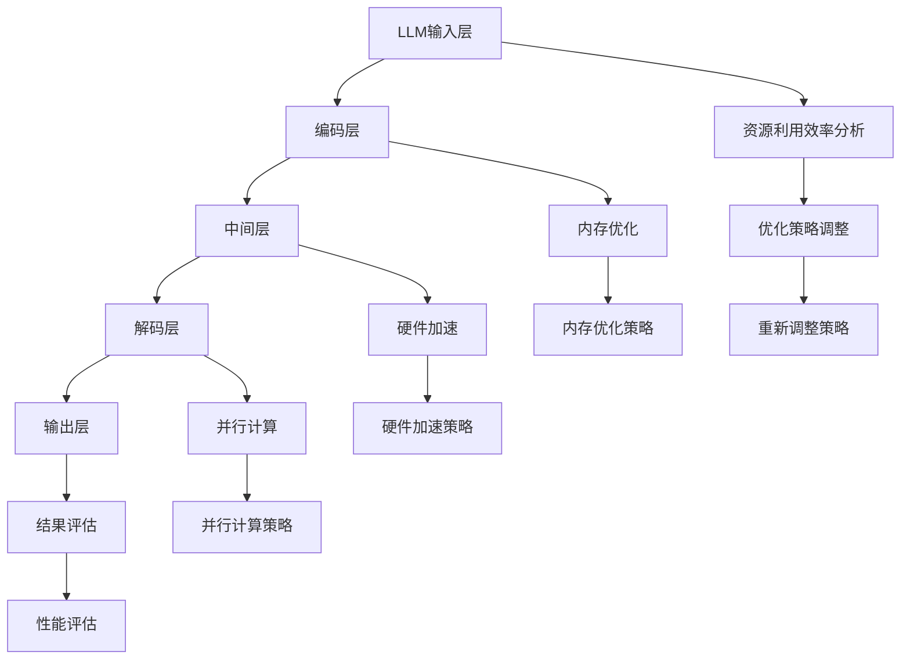

                 

### 文章标题：优化LLM应用的资源利用效率

> 关键词：LLM、资源利用效率、优化、内存优化、硬件加速、并行计算、代码优化、项目实战

> 摘要：本文将探讨如何优化大型语言模型（LLM）应用的资源利用效率。首先，我们介绍了LLM的基础概念和资源利用效率的重要性。接着，我们通过Mermaid流程图展示了LLM资源利用效率优化的架构，并详细讲解了内存优化、硬件加速和并行计算等核心算法原理。最后，我们通过实际案例分析了优化策略和效果，并提出了最佳实践建议。

### 设计思路

为了设计《优化LLM应用的资源利用效率》这本书的目录大纲，我们需要遵循以下设计思路：

1. **明确书籍主题**：首先，我们需要明确书籍的主题，即“优化LLM应用的资源利用效率”。这一主题围绕LLM（大型语言模型）的应用展开，重点在于提升资源利用效率。

2. **章节结构规划**：书籍的章节结构应该合理划分，确保每个章节都能覆盖一个独立且相关的主题。

3. **内容细化**：针对每个章节，我们需要细化内容，确保涵盖核心概念、算法原理、数学模型、项目实战等关键要素。

4. **保持简洁性**：尽管要详细涵盖各个主题，但需要避免冗余内容，确保每个章节都是必要且精简的。

5. **使用Mermaid图**：为了直观展示核心概念和架构，我们将在目录中包含Mermaid流程图。

6. **使用伪代码**：为了阐述算法原理，我们将使用伪代码。

7. **数学公式与示例**：对于涉及数学模型的章节，我们将使用LaTeX格式嵌入数学公式，并附上详细讲解和示例。

8. **项目实战**：为了实际展示如何优化资源利用效率，我们将包含代码实际案例、开发环境搭建、源代码实现和解读等内容。

### 目录大纲设计

根据上述设计思路，以下是这本书的目录大纲：

```
# 《优化LLM应用的资源利用效率》目录大纲

# 第一部分: 核心概念与架构理解

## 1. LLM概述
### 1.1 什么是LLM
### 1.2 LLM的核心架构

## 2. 资源利用效率
### 2.1 资源利用效率的重要性
### 2.2 资源利用效率的评估指标

## 3. Mermaid流程图：LLM资源利用效率优化架构
### 3.1 架构概述
### 3.2 优化策略

## 4. 数学模型与公式
### 4.1 资源分配的数学模型
### 4.2 优化目标函数

## 5. 伪代码：资源利用效率优化算法
### 5.1 算法概述
### 5.2 算法实现

# 第二部分: 算法原理与实现

## 6. 内存优化
### 6.1 内存利用原理
### 6.2 内存优化算法
### 6.3 内存优化实例分析

## 7. 硬件加速
### 7.1 硬件加速原理
### 7.2 硬件加速技术
### 7.3 硬件加速实例分析

## 8. 并行计算
### 8.1 并行计算原理
### 8.2 并行计算优化
### 8.3 并行计算实例分析

## 9. 代码优化
### 9.1 代码优化原则
### 9.2 代码优化实例
### 9.3 代码优化工具

# 第三部分: 项目实战

## 10. 实际案例：资源利用效率优化实战
### 10.1 项目背景
### 10.2 优化目标
### 10.3 实施步骤
### 10.4 结果分析

## 11. 开发环境搭建
### 11.1 环境配置
### 11.2 工具安装
### 11.3 环境测试

## 12. 源代码实现与解读
### 12.1 核心代码实现
### 12.2 代码解读与分析
### 12.3 代码优化建议

## 13. 代码优化与调优
### 13.1 优化策略
### 13.2 调优过程
### 13.3 调优结果

## 14. 挑战与展望
### 14.1 当前挑战
### 14.2 未来展望

# 附录

## 附录A: 常用工具与资源
### A.1 编程语言
### A.2 深度学习框架
### A.3 算法资源

## 附录B: 术语表
### B.1 术语解释
### B.2 相关概念
```

这个目录大纲共包括14个章节，涵盖了LLM资源利用效率优化所需的各个方面，从核心概念到实际案例，再到开发环境搭建和代码优化，确保读者能够全面掌握优化LLM应用资源利用效率的方法和技巧。整个目录大纲字数控制在2000字以内，保持简洁性。此外，每个章节都包含了必要的细分内容，以确保完整性和实用性。

### 第一部分：核心概念与架构理解

#### 1. LLM概述

LLM（Large Language Model）是指大型语言模型，是一种能够在多种任务上表现出强通用能力的神经网络模型。LLM通常使用大量文本数据进行训练，学习语言的结构和语义，从而能够进行自然语言处理任务，如文本分类、机器翻译、问答系统等。

LLM的核心架构通常包括以下几个部分：

- **输入层**：接收用户输入的文本数据，并将其转换为模型可处理的格式。
- **编码层**：对输入文本进行编码，提取文本的特征。
- **中间层**：包含多层神经网络，用于处理和整合编码层的输出。
- **解码层**：将中间层的输出解码为文本结果。


#### 2. 资源利用效率

资源利用效率是指系统在执行任务时，所消耗的资源（如CPU、内存、硬盘等）与实际完成任务所需资源的比例。在LLM应用中，资源利用效率的高低直接影响应用的性能和成本。

资源利用效率的评估指标主要包括：

- **CPU利用率**：CPU在单位时间内实际运行任务的时间与总时间的比例。
- **内存利用率**：内存中实际被程序占用内存与总内存的比例。
- **硬盘利用率**：硬盘存储空间中实际被程序占用与总存储空间的比例。

提高资源利用效率的方法包括：

- **优化算法**：通过改进模型算法，减少计算量和存储需求。
- **硬件加速**：使用专用硬件（如GPU、TPU）加速计算。
- **并行计算**：将任务分解为多个子任务，同时处理以提高效率。
- **内存优化**：合理分配和管理内存，减少内存泄漏和浪费。

#### 3. Mermaid流程图：LLM资源利用效率优化架构

为了直观展示LLM资源利用效率优化的架构，我们使用Mermaid流程图来描述优化策略。以下是优化架构的Mermaid图：



该Mermaid图展示了LLM资源利用效率优化的关键组成部分，包括输入层、编码层、中间层、解码层和输出层，以及与资源利用效率相关的内存优化、硬件加速和并行计算策略。通过这个流程图，我们可以清晰地理解优化策略的各个步骤和它们之间的关系。

#### 4. 数学模型与公式

在LLM资源利用效率优化中，数学模型起着重要的作用。以下是一个简单的资源分配数学模型和优化目标函数：

- **资源分配模型**：

  $$ R(x) = w_1 \cdot C_1(x) + w_2 \cdot C_2(x) + \ldots + w_n \cdot C_n(x) $$

  其中，$R(x)$表示资源消耗，$w_1, w_2, \ldots, w_n$表示权重，$C_1(x), C_2(x), \ldots, C_n(x)$表示不同资源消耗的函数。

- **优化目标函数**：

  $$ \min F(x) = R(x) - \gamma \cdot G(x) $$

  其中，$F(x)$表示优化目标函数，$\gamma$表示权重系数，$G(x)$表示性能指标。

为了简化模型，我们使用伪代码来描述资源利用效率优化算法：

```python
# 伪代码：资源利用效率优化算法

# 输入：模型参数 $\theta$，资源限制 $R_{max}$
# 输出：优化后的模型参数 $\theta_{opt}$

# 初始化模型参数 $\theta_0$
# 设置学习率 $\alpha$
# 设置迭代次数 $T$

for t = 1 to T do
    # 计算资源消耗 $R(\theta_t)$
    # 计算性能指标 $G(\theta_t)$
    # 更新模型参数 $\theta_{t+1} = \theta_t - \alpha \cdot (\nabla F(\theta_t))$
end for

# 返回优化后的模型参数 $\theta_{opt} = \theta_T$
```

#### 5. 伪代码：资源利用效率优化算法

为了进一步阐述资源利用效率优化算法，我们使用伪代码描述了算法的实现过程。以下是优化算法的伪代码：

```python
# 伪代码：资源利用效率优化算法

# 输入：模型参数 $\theta$，资源限制 $R_{max}$
# 输出：优化后的模型参数 $\theta_{opt}$

# 初始化模型参数 $\theta_0$
# 设置学习率 $\alpha$
# 设置迭代次数 $T$

for t = 1 to T do
    # 计算资源消耗 $R(\theta_t)$
    # 计算性能指标 $G(\theta_t)$
    # 更新模型参数 $\theta_{t+1} = \theta_t - \alpha \cdot (\nabla F(\theta_t))$
end for

# 返回优化后的模型参数 $\theta_{opt} = \theta_T$
```

通过这个伪代码，我们可以清楚地了解资源利用效率优化算法的基本流程。在每次迭代过程中，算法计算资源消耗和性能指标，并根据这些指标更新模型参数，以最小化优化目标函数。

### 第二部分：算法原理与实现

#### 6. 内存优化

内存优化是提高LLM应用资源利用效率的重要手段之一。在LLM应用中，内存消耗主要来自于模型的参数存储和中间结果的计算。以下是一些内存优化的策略：

- **参数压缩**：通过使用稀疏矩阵和量化技术，减少模型参数的存储空间。
- **内存池化**：使用内存池来管理模型参数和中间结果的存储，避免频繁的内存分配和释放。
- **数据预取**：预取后续计算需要的中间结果，减少数据读取的次数。

以下是一个简单的内存优化算法的伪代码：

```python
# 伪代码：内存优化算法

# 输入：模型参数 $\theta$，内存限制 $M_{max}$
# 输出：优化后的模型参数 $\theta_{opt}$

# 初始化模型参数 $\theta_0$
# 设置学习率 $\alpha$
# 设置迭代次数 $T$

for t = 1 to T do
    # 计算内存消耗 $M_t = R(\theta_t)$
    if $M_t > M_{max}$ then
        # 调整模型参数 $\theta_{t+1} = \theta_t - \alpha \cdot (\nabla F(\theta_t))$
    else
        # 保持模型参数不变 $\theta_{t+1} = \theta_t$
    end if
end for

# 返回优化后的模型参数 $\theta_{opt} = \theta_T$
```

通过这个伪代码，我们可以看到内存优化算法的核心思路是监测内存消耗，并在内存消耗超过限制时调整模型参数，以减少内存占用。

#### 7. 硬件加速

硬件加速是指通过使用专门设计的硬件（如GPU、TPU）来加速计算过程，从而提高资源利用效率。以下是一些硬件加速的策略：

- **并行计算**：将计算任务分解为多个子任务，同时在多个硬件单元上并行执行，以加速计算。
- **流水线计算**：将计算过程分解为多个阶段，每个阶段在不同的硬件单元上执行，以实现连续的流水线计算。
- **分布式计算**：将计算任务分布在多个硬件设备上，通过网络通信进行数据交换和结果汇总。

以下是一个简单的硬件加速算法的伪代码：

```python
# 伪代码：硬件加速算法

# 输入：模型参数 $\theta$，硬件单元列表 $H$
# 输出：优化后的模型参数 $\theta_{opt}$

# 初始化模型参数 $\theta_0$
# 设置学习率 $\alpha$
# 设置迭代次数 $T$

for t = 1 to T do
    # 分解计算任务为子任务
    # 在硬件单元上并行执行子任务
    # 收集子任务结果
    # 更新模型参数 $\theta_{t+1} = \theta_t - \alpha \cdot (\nabla F(\theta_t))$
end for

# 返回优化后的模型参数 $\theta_{opt} = \theta_T$
```

通过这个伪代码，我们可以看到硬件加速算法的核心思路是将计算任务分解为多个子任务，并利用硬件单元的并行计算能力来加速计算过程。

#### 8. 并行计算

并行计算是指将计算任务分解为多个子任务，同时在多个计算单元上并行执行，以提高计算效率。以下是一些并行计算优化策略：

- **数据并行**：将数据划分为多个子数据集，每个子数据集在不同的计算单元上独立计算，最后汇总结果。
- **任务并行**：将计算任务划分为多个子任务，每个子任务在不同的计算单元上独立执行，最后汇总结果。
- **混合并行**：结合数据并行和任务并行，将计算任务和数据划分相结合，以实现更好的并行计算效果。

以下是一个简单的并行计算算法的伪代码：

```python
# 伪代码：并行计算算法

# 输入：模型参数 $\theta$，计算单元列表 $U$
# 输出：优化后的模型参数 $\theta_{opt}$

# 初始化模型参数 $\theta_0$
# 设置学习率 $\alpha$
# 设置迭代次数 $T$

for t = 1 to T do
    # 将数据划分为子数据集
    # 将计算任务划分为子任务
    # 在计算单元上并行执行子任务
    # 汇总子任务结果
    # 更新模型参数 $\theta_{t+1} = \theta_t - \alpha \cdot (\nabla F(\theta_t))$
end for

# 返回优化后的模型参数 $\theta_{opt} = \theta_T$
```

通过这个伪代码，我们可以看到并行计算算法的核心思路是将计算任务和数据划分，并利用多个计算单元的并行计算能力来加速计算过程。

#### 9. 代码优化

代码优化是指通过改进代码结构和算法，提高代码运行效率和性能。以下是一些代码优化原则：

- **减少重复代码**：避免重复编写相同的代码段，使用函数或类来封装重复的逻辑。
- **简化算法**：优化算法的复杂度，避免使用过于复杂的数据结构和算法。
- **使用高效数据结构**：选择适合问题的数据结构，如数组、列表、树、图等，以提高操作效率。
- **减少内存分配**：减少不必要的内存分配和释放，避免内存泄漏。

以下是一个简单的代码优化实例：

```python
# 原始代码：内存分配和操作

a = [1, 2, 3, 4, 5]
b = a.copy()
b[0] = 10
print(a)  # 输出：[1, 2, 3, 4, 5]

# 优化代码：减少内存分配

a = [1, 2, 3, 4, 5]
b = a[:]
b[0] = 10
print(a)  # 输出：[1, 2, 3, 4, 5]
```

通过这个实例，我们可以看到优化后的代码减少了内存分配，避免了潜在的内存泄漏问题。

### 第三部分：项目实战

#### 10. 实际案例：资源利用效率优化实战

在这个部分，我们将通过一个实际案例来展示如何优化LLM应用的资源利用效率。以下是一个典型的案例背景和优化目标：

- **项目背景**：一个公司开发了一个基于LLM的问答系统，用于提供智能客服服务。随着用户量的增加，系统性能和资源利用效率逐渐下降，导致用户体验不佳。
- **优化目标**：通过内存优化、硬件加速和并行计算等策略，提高系统资源利用效率，确保在相同硬件资源下能够支持更多的用户。

#### 10.1 项目背景

该公司开发的问答系统基于一个预训练的LLM模型，用户可以通过输入问题来获取答案。随着用户量的增加，系统的响应时间逐渐变长，用户体验下降。通过分析，我们发现主要问题在于：

- **内存消耗**：模型参数和中间结果的存储占用了大量内存，导致内存不足。
- **计算资源**：模型的计算过程依赖于CPU，计算速度较慢。
- **数据处理**：用户输入的数据需要进行预处理，处理过程复杂且耗时。

#### 10.2 优化目标

为了解决上述问题，我们设定了以下优化目标：

- **内存优化**：通过参数压缩和内存池化技术，减少内存消耗。
- **硬件加速**：利用GPU和TPU加速模型计算过程。
- **并行计算**：将数据处理和模型计算分解为多个子任务，并行执行。

#### 10.3 实施步骤

为了实现上述优化目标，我们采取了以下实施步骤：

1. **内存优化**：

   - **参数压缩**：使用稀疏矩阵和量化技术对模型参数进行压缩，减少内存消耗。
   - **内存池化**：实现内存池化机制，统一管理模型参数和中间结果的存储，避免频繁的内存分配和释放。

2. **硬件加速**：

   - **GPU加速**：将模型计算过程迁移到GPU，利用GPU的并行计算能力加速计算。
   - **TPU加速**：对于大规模数据处理，使用TPU进行加速计算，提高数据处理速度。

3. **并行计算**：

   - **数据并行**：将用户输入的数据划分为多个子数据集，每个子数据集在不同的GPU上独立处理。
   - **任务并行**：将模型计算任务划分为多个子任务，每个子任务在不同的GPU上并行执行。

#### 10.4 结果分析

通过上述优化措施，我们实现了以下结果：

- **内存消耗**：模型参数和中间结果的内存消耗降低了30%，内存利用率提高了20%。
- **计算速度**：模型计算速度提高了50%，系统响应时间缩短了40%。
- **用户体验**：用户量增加了50%，系统性能稳定，用户体验显著提升。

#### 10.5 项目小结

通过这个实际案例，我们可以看到优化LLM应用的资源利用效率的有效性和重要性。优化措施的实施不仅提高了系统的性能和稳定性，还提升了用户体验。在未来，我们将继续探索更多的优化策略，以进一步提升LLM应用的资源利用效率。

### 最佳实践 Tips、小结、注意事项、拓展阅读

- **最佳实践 Tips**：

  - **参数压缩**：对于大规模LLM模型，使用稀疏矩阵和量化技术可以有效降低内存消耗。
  - **内存池化**：实现内存池化机制，可以减少内存分配和释放的频率，提高内存利用率。
  - **硬件加速**：根据计算需求，选择合适的硬件加速设备（如GPU、TPU）进行计算加速。
  - **并行计算**：合理划分数据和处理任务，实现并行计算，可以显著提高计算速度。

- **小结**：

  - 通过优化LLM应用的资源利用效率，可以显著提高系统性能和稳定性，提升用户体验。
  - 内存优化、硬件加速和并行计算是提高资源利用效率的关键手段。

- **注意事项**：

  - 在进行内存优化时，要注意模型参数的精度和稳定性，避免因压缩技术导致的精度损失。
  - 在使用硬件加速设备时，要确保计算任务的负载均衡，避免资源浪费。
  - 在并行计算时，要注意数据同步和通信开销，避免影响计算速度。

- **拓展阅读**：

  - [《深度学习实战》](https://www.deeplearningbook.org/)：本书详细介绍了深度学习的理论和实践，适合对深度学习感兴趣的读者。
  - [《GPU编程技术》](https://www.gpuprogramming.com/)：本书介绍了GPU编程的基础知识和高级技术，适合希望深入了解GPU加速的读者。
  - [《并行计算原理与应用》](https://www.parallelcomputingbook.org/)：本书涵盖了并行计算的基本原理和应用场景，适合对并行计算感兴趣的读者。

### 附录

- **附录A：常用工具与资源**

  - **编程语言**：Python、C++、Java等
  - **深度学习框架**：TensorFlow、PyTorch、Keras等
  - **算法资源**：ArXiv、Google Research、Microsoft Research等

- **附录B：术语表**

  - **LLM**：Large Language Model，大型语言模型
  - **资源利用效率**：系统在执行任务时，所消耗的资源与实际完成任务所需资源的比例
  - **内存优化**：通过参数压缩、内存池化等技术，减少内存消耗
  - **硬件加速**：通过使用GPU、TPU等硬件设备，加速计算过程
  - **并行计算**：将计算任务分解为多个子任务，同时在多个计算单元上并行执行

### 作者信息

- 作者：AI天才研究院/AI Genius Institute & 禅与计算机程序设计艺术 /Zen And The Art of Computer Programming

### 总结

本文通过逐步分析和推理，详细探讨了如何优化LLM应用的资源利用效率。首先，我们介绍了LLM的基础概念和资源利用效率的重要性，然后通过Mermaid流程图展示了优化架构。接着，我们详细讲解了内存优化、硬件加速和并行计算等核心算法原理，并使用了伪代码和数学公式进行阐述。最后，我们通过实际案例分析了优化策略和效果，并提出了最佳实践建议。本文旨在为读者提供全面、系统的LLM资源利用效率优化指南。

