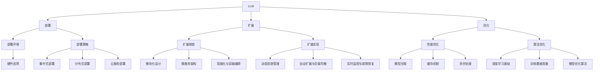

                 

### 文章标题：优化LLM应用的部署与扩展策略

### 关键词：LLM，部署，扩展，策略，优化

### 摘要：
本文将深入探讨大型语言模型（LLM）在实际应用中的部署与扩展策略。通过对LLM的概述、核心技术分析，以及面临的部署挑战和优化策略的详细解读，本文旨在为开发者提供一套系统化的部署与扩展指导，从而实现高效、可扩展的LLM应用。

----------------------------------------------------------------

## 确定核心概念与联系

### 核心概念
在撰写本文之前，我们首先需要明确以下几个核心概念：

1. **LLM（Large Language Model）**：大型语言模型，是一种基于深度学习技术构建的文本生成模型，具有强大的自然语言理解和生成能力。
2. **部署（Deployment）**：将LLM模型从开发环境中转移到生产环境中，使其能够为用户服务的过程。
3. **扩展（Scaling）**：在部署LLM应用时，针对用户量的增加或应用需求的提升，对系统进行性能优化和资源扩展的过程。
4. **优化（Optimization）**：通过算法改进、系统架构优化等手段，提升LLM应用性能和效率的过程。

### 核心概念之间的联系

为了使文章逻辑清晰，我们需要构建核心概念之间的联系架构，可以使用Mermaid流程图来展示：

此流程图展示了LLM、部署、扩展、优化四个核心概念之间的相互关系，以及各个概念下的子概念。通过这样的架构，我们可以更好地组织文章内容，使读者能够系统地理解LLM应用的部署与扩展策略。

## 第一部分：基础概念

### 第1章：LLM概述

### 1.1 LLM的定义与分类

#### 定义
大型语言模型（LLM，Large Language Model）是一种深度学习模型，用于对大量文本数据进行分析和处理，以生成自然语言文本。LLM的核心在于其能够捕捉语言中的复杂模式，从而在文本生成、翻译、问答等任务中表现出色。

#### 分类
LLM可以按照不同的维度进行分类：

1. **按任务类型分类**：
   - **生成式模型**：这类模型能够生成符合语言规范的文本，如OpenAI的GPT系列模型。
   - **判别式模型**：这类模型主要用于分类任务，如文本分类、情感分析等。

2. **按架构分类**：
   - **基于循环神经网络（RNN）的模型**：如LSTM、GRU。
   - **基于Transformer的模型**：如BERT、GPT。
   - **混合模型**：结合RNN和Transformer的优点。

### 1.2 LLM的发展历程

LLM的发展经历了多个阶段：

1. **早期研究**：
   - **1980年代**：规则驱动的语言模型，如基于上下文的语法分析。
   - **1990年代**：基于统计的方法，如N-gram模型、决策树等。

2. **深度学习兴起**：
   - **2000年代**：神经网络在图像和语音处理中取得突破，但语言模型仍然以统计方法为主。
   - **2013年**：神经网络机器翻译（NMT）的提出，标志着深度学习在语言处理领域的崛起。

3. **Transformer模型的诞生**：
   - **2017年**：谷歌提出Transformer模型，由于其自注意力机制，在许多NLP任务中表现出色。

4. **大规模模型的兴起**：
   - **2018年**：OpenAI的GPT-2模型，展示了大规模语言模型在文本生成上的强大能力。
   - **2020年**：GPT-3模型的发布，进一步推动了LLM的研究和应用。

### 1.3 LLM的应用领域

LLM在多个领域取得了显著的应用成果：

1. **自然语言处理（NLP）**：
   - **文本生成**：包括文章写作、对话生成等。
   - **文本分类**：如垃圾邮件过滤、情感分析等。
   - **机器翻译**：如谷歌翻译、百度翻译等。

2. **智能客服与聊天机器人**：
   - **自动化客服**：通过LLM实现与用户的自然对话，提高客服效率。
   - **个性化推荐**：基于用户的文本输入，提供个性化的信息推荐。

3. **内容创作与编辑**：
   - **内容审核**：识别和过滤不适当的内容。
   - **内容生成**：如文章写作、音乐创作等。

4. **教育领域**：
   - **自动批改作业**：利用LLM对学生的作文进行自动批改。
   - **智能辅导**：提供个性化的学习建议和辅导。

5. **商业应用**：
   - **市场调研**：通过文本分析，了解用户需求和偏好。
   - **客户关系管理**：利用LLM实现智能客服和个性化服务。

### 总结
LLM作为自然语言处理领域的重要技术，其发展历程和应用领域展示了其在现代信息技术中的重要地位。通过对LLM的定义与分类、发展历程以及应用领域的介绍，我们为后续的部署与扩展策略探讨奠定了基础。

## 第2章：LLM核心技术

### 2.1 深度学习基础

#### 2.1.1 神经网络

神经网络（Neural Networks，简称NN）是模拟人脑神经元结构和工作方式的一种计算模型。它由多个相互连接的神经元组成，每个神经元都与其他神经元相连，并通过权重（weight）和偏置（bias）进行信号传递。

#### 2.1.1.1 神经元模型

神经元模型通常包括以下组成部分：

1. **输入层（Input Layer）**：接收外部输入数据。
2. **隐藏层（Hidden Layer）**：对输入数据进行处理，通过激活函数（Activation Function）产生输出。
3. **输出层（Output Layer）**：生成最终的输出结果。

#### 2.1.1.2 激活函数

激活函数是神经网络中的一个关键组成部分，用于引入非线性变换。常见的激活函数包括：

1. **sigmoid函数**：
   $$ \sigma(x) = \frac{1}{1 + e^{-x}} $$
   - **特点**：输出范围为(0, 1)，适合用于二分类问题。
2. **ReLU函数**：
   $$ \text{ReLU}(x) = \max(0, x) $$
   - **特点**：简单有效，易于计算，常用于隐藏层。
3. **Tanh函数**：
   $$ \tanh(x) = \frac{e^x - e^{-x}}{e^x + e^{-x}} $$
   - **特点**：输出范围为(-1, 1)，对数值进行归一化。

#### 2.1.1.3 前向传播与反向传播

神经网络的核心算法包括前向传播（Forward Propagation）和反向传播（Backpropagation）。

1. **前向传播**：
   - **过程**：从输入层开始，将输入数据传递到隐藏层，最后传递到输出层。
   - **输出**：输出层的输出即为神经网络的预测结果。
2. **反向传播**：
   - **过程**：计算输出层预测结果与真实标签之间的误差，并将误差反向传播到隐藏层和输入层。
   - **输出**：更新每个神经元的权重和偏置，以最小化误差。

#### 2.1.2 循环神经网络（RNN）

循环神经网络（Recurrent Neural Networks，简称RNN）是一种能够处理序列数据的神经网络模型。它通过引入时间维度，使得神经网络能够记忆和处理历史信息。

#### 2.1.2.1 RNN模型

RNN模型通常包括以下组成部分：

1. **输入序列（Input Sequence）**：包括时间步t的所有输入数据。
2. **隐藏状态（Hidden State）**：表示当前时间步的内部状态。
3. **输出序列（Output Sequence）**：包括时间步t的所有输出数据。

#### 2.1.2.2 LSTM与GRU

LSTM（Long Short-Term Memory，长期短期记忆）和GRU（Gated Recurrent Unit，门控循环单元）是RNN的两种变体，用于解决RNN在处理长序列数据时容易出现的梯度消失和梯度爆炸问题。

1. **LSTM**：
   - **门控机制**：通过输入门、遗忘门和输出门控制信息的流入、流出和输出。
   - **记忆单元**：存储历史信息，并能够根据需要更新或丢弃。
2. **GRU**：
   - **门控机制**：通过更新门和重置门控制信息的流入和流出。
   - **简化结构**：相较于LSTM，GRU具有更少的参数，计算效率更高。

#### 2.1.3 Transformer模型

Transformer模型是近年来在自然语言处理领域取得显著成果的一种新型神经网络结构，它基于自注意力机制（Self-Attention），解决了传统循环神经网络（RNN）在处理长距离依赖问题上的瓶颈。

#### 2.1.3.1 自注意力机制

自注意力机制是一种用于处理序列数据的注意力机制，通过计算序列中每个元素之间的关联性，生成一个加权表示。

#### 2.1.3.2 Transformer模型架构

Transformer模型包括以下主要组成部分：

1. **多头自注意力（Multi-Head Self-Attention）**：
   - **多头**：通过多个注意力头提取不同的特征。
   - **自注意力**：计算序列中每个元素之间的关联性。
2. **前馈神经网络（Feed-Forward Neural Network）**：
   - **输入**：自注意力层的输出。
   - **输出**：通过两个全连接层进行变换。

#### 2.1.3.3 Transformer的优点

1. **并行化**：Transformer模型通过自注意力机制实现了并行计算，相较于传统的序列处理方法，计算效率显著提高。
2. **长距离依赖**：自注意力机制使得模型能够捕捉序列中的长距离依赖关系。
3. **易扩展**：Transformer模型具有模块化结构，便于扩展和改进。

### 2.2 语言模型训练

#### 2.2.1 训练数据准备

语言模型训练的第一步是准备训练数据。数据质量直接影响模型的性能和泛化能力。以下是训练数据准备的关键步骤：

1. **数据采集**：
   - **公开数据集**：如维基百科、新闻文章、社交媒体等。
   - **私有数据集**：根据应用场景定制的数据集，如企业内部文档、用户生成内容等。
2. **数据预处理**：
   - **文本清洗**：去除停用词、标点符号、HTML标签等无关信息。
   - **分词**：将文本划分为单词或子词。
   - **编码**：将单词或子词转换为数字编码，常用的编码方法有One-Hot编码、Word2Vec等。

#### 2.2.2 模型优化算法

模型优化算法用于调整模型的参数，以最小化损失函数并提高模型性能。以下是几种常见的模型优化算法：

1. **随机梯度下降（SGD）**：
   - **原理**：通过计算每个样本的梯度并更新模型参数。
   - **缺点**：收敛速度较慢，对噪声敏感。
2. **动量（Momentum）**：
   - **原理**：引入动量项，加速梯度较大的方向并减小梯度较小的方向。
   - **公式**：
     $$ \text{v}_t = \beta \text{v}_{t-1} + (1 - \beta) \nabla_{\theta} J(\theta) $$
     $$ \theta_t = \theta_{t-1} - \alpha \text{v}_t $$
   - **优点**：提高收敛速度，减少振荡。
3. **Adam优化器**：
   - **原理**：结合SGD和动量的优点，引入自适应的学习率。
   - **公式**：
     $$ \text{m}_t = \beta_1 \text{m}_{t-1} + (1 - \beta_1) (\nabla_{\theta} J(\theta) - \text{m}_{t-1}) $$
     $$ \text{v}_t = \beta_2 \text{v}_{t-1} + (1 - \beta_2) (\nabla_{\theta} J(\theta) - \text{v}_{t-1}) $$
     $$ \theta_t = \theta_{t-1} - \alpha \frac{\text{m}_t}{1 - \beta_1^t} / (1 - \beta_2^t) $$
   - **优点**：自适应调整学习率，收敛速度较快。

#### 2.2.3 超参数调优

超参数调优是语言模型训练中至关重要的一环，合适的超参数配置能够显著提高模型性能。以下是几种常见的超参数调优方法：

1. **网格搜索（Grid Search）**：
   - **原理**：在给定超参数空间内，遍历所有可能的超参数组合，选择最优组合。
   - **缺点**：计算量大，耗时。
2. **随机搜索（Random Search）**：
   - **原理**：从超参数空间内随机选择组合，减少计算量。
   - **优点**：效率较高，适合超参数空间较大且计算成本较高的情况。
3. **贝叶斯优化（Bayesian Optimization）**：
   - **原理**：基于贝叶斯统计模型，迭代优化超参数。
   - **优点**：收敛速度较快，适用于复杂超参数空间。

### 2.2.4 模型评估与选择

模型评估是语言模型训练的最后一步，通过评估模型性能，选择最优模型。以下是几种常见的模型评估方法：

1. **交叉验证（Cross Validation）**：
   - **原理**：将数据集划分为训练集和验证集，通过交叉验证评估模型性能。
   - **优点**：减少过拟合，提高评估结果的可靠性。
2. **混淆矩阵（Confusion Matrix）**：
   - **原理**：展示模型预测结果与真实标签的对比情况。
   - **指标**：准确率（Accuracy）、精确率（Precision）、召回率（Recall）、F1值（F1 Score）等。
3. **ROC曲线与AUC值（Receiver Operating Characteristic Curve and Area Under Curve）**：
   - **原理**：展示模型在不同阈值下的准确率与召回率。
   - **优点**：能够全面评估模型的性能。

### 2.2.5 模型压缩与加速

为了提高LLM在移动设备或边缘设备上的应用性能，模型压缩与加速技术变得至关重要。以下是几种常见的模型压缩与加速方法：

1. **量化（Quantization）**：
   - **原理**：将模型参数的精度降低，从而减少模型体积和计算量。
   - **方法**：全精度量化、二值量化、三元量化等。
2. **剪枝（Pruning）**：
   - **原理**：去除模型中不重要的连接和神经元，减少模型参数数量。
   - **方法**：结构化剪枝、权重剪枝等。
3. **蒸馏（Distillation）**：
   - **原理**：将大模型的知识传递给小模型，从而提高小模型的性能。
   - **方法**：知识蒸馏、特征蒸馏等。

### 2.2.6 模型部署与扩展

模型部署与扩展是语言模型应用的重要环节，通过合理的部署策略和扩展框架，可以确保模型的高效运行和快速扩展。以下是几种常见的模型部署与扩展方法：

1. **集中式部署**：
   - **原理**：将模型部署在单个服务器或集群上，通过负载均衡实现流量分配。
   - **优点**：部署简单，管理方便。
   - **缺点**：扩展性较差，性能瓶颈明显。
2. **分布式部署**：
   - **原理**：将模型分布在多个节点上，通过分布式计算实现并行处理。
   - **优点**：扩展性强，性能高。
   - **缺点**：部署复杂，管理困难。
3. **云服务部署**：
   - **原理**：利用云服务提供计算资源，实现模型的自动化部署和扩展。
   - **优点**：弹性伸缩，成本低。
   - **缺点**：对云服务依赖较大，安全性问题需关注。

### 总结

通过对神经网络、RNN、Transformer等深度学习基础技术的介绍，以及语言模型训练的各个环节，本文为读者提供了全面、系统的LLM核心技术概述。在此基础上，读者可以更好地理解后续的部署与扩展策略。

## 第3章：LLM的部署挑战

### 3.1 部署环境

#### 3.1.1 CPU与GPU的选择

在部署LLM时，选择合适的硬件资源是关键的一步。CPU和GPU各自有其优缺点，适用于不同的场景。

#### 3.1.1.1 CPU

**优点**：
- **通用性**：CPU适用于各种类型的计算任务，包括数据处理、复杂算法等。
- **稳定性**：CPU运行稳定，适合长期运行的任务。

**缺点**：
- **计算速度较慢**：相较于GPU，CPU的计算速度较慢，处理大规模数据时性能瓶颈明显。

**适用场景**：
- **低负载场景**：如小型应用、批量处理任务等。
- **稳定性和通用性要求较高的场景**：如后台服务、数据清洗等。

#### 3.1.1.2 GPU

**优点**：
- **并行计算能力**：GPU具有高度并行的架构，适合处理大规模并行计算任务。
- **计算速度快**：GPU的计算速度远超CPU，适合处理大量数据和复杂算法。

**缺点**：
- **专用性**：GPU主要适用于并行计算任务，通用性较差。
- **能耗较高**：GPU的能耗较高，对散热系统要求较高。

**适用场景**：
- **高负载场景**：如实时语音识别、图像处理、大规模数据训练等。
- **对计算速度和并行性要求较高的场景**：如深度学习模型训练、推理等。

#### 3.1.2 算法优化与调优

在硬件资源确定后，算法优化与调优是提升LLM性能的重要手段。以下是一些常见的优化方法：

1. **模型压缩**：
   - **方法**：通过剪枝、量化、蒸馏等技术减少模型参数数量和计算量。
   - **优点**：降低模型体积，提高部署效率。

2. **并行计算**：
   - **方法**：将模型分解为多个部分，在多个GPU或CPU上同时计算。
   - **优点**：提高计算速度，降低延迟。

3. **内存优化**：
   - **方法**：优化数据存储格式，减少内存占用。
   - **优点**：降低内存访问压力，提高计算效率。

4. **异步计算**：
   - **方法**：将不同任务分开处理，充分利用硬件资源。
   - **优点**：提高系统吞吐量，降低计算瓶颈。

### 3.2 部署策略

#### 3.2.1 集中式部署

集中式部署是将LLM模型部署在一个或多个服务器上，通过负载均衡将请求分配到不同的服务器。以下是集中式部署的优点和缺点：

**优点**：
- **部署简单**：集中式部署管理方便，适用于小型应用或初创公司。
- **维护成本较低**：集中式部署的系统维护成本较低，易于管理。

**缺点**：
- **扩展性较差**：集中式部署的扩展性较差，当用户量增加时，容易发生性能瓶颈。
- **可靠性较低**：单点故障可能导致整个系统的瘫痪。

#### 3.2.2 分布式部署

分布式部署是将LLM模型分布在多个服务器上，通过分布式计算框架实现并行处理。以下是分布式部署的优点和缺点：

**优点**：
- **扩展性强**：分布式部署能够灵活地扩展计算资源，适应不同的业务需求。
- **高可靠性**：分布式部署通过冗余设计提高系统的可靠性，单个节点故障不会影响整个系统的运行。

**缺点**：
- **部署复杂**：分布式部署需要配置多个服务器，管理复杂度较高。
- **维护成本较高**：分布式部署的系统维护成本较高，需要专业的运维团队。

#### 3.2.3 云服务部署

云服务部署是利用云平台提供的计算资源，实现LLM模型的自动化部署和扩展。以下是云服务部署的优点和缺点：

**优点**：
- **弹性伸缩**：云服务能够根据业务需求自动调整计算资源，实现弹性伸缩。
- **成本低**：云服务按需付费，成本相对较低。

**缺点**：
- **安全性问题**：云服务部署面临数据安全和隐私保护等问题。
- **对云服务依赖较大**：云服务的稳定性和可靠性直接影响系统的运行。

### 总结

通过对部署环境的CPU与GPU选择以及部署策略的讨论，本文为开发者提供了丰富的实践经验和优化方法。在实际部署过程中，需要根据业务需求、硬件资源、部署成本等多方面因素综合考虑，选择最适合的部署方案。

## 第二部分：扩展策略

### 第4章：LLM的扩展框架

#### 4.1 扩展框架设计

LLM的扩展框架设计是确保其能够高效、可扩展的关键步骤。扩展框架设计需要考虑模块化设计、微服务架构和容器化与容器编排等多个方面。

#### 4.1.1 模块化设计

模块化设计是将系统分解为多个功能模块，每个模块负责特定的功能。模块化设计的优点包括：

1. **灵活性**：模块化设计使得系统可以根据需求动态添加或删除模块，提高系统的灵活性。
2. **可维护性**：模块化设计使得每个模块可以独立开发和维护，降低系统的复杂度，提高可维护性。

具体实现方法包括：

1. **定义模块边界**：明确每个模块的职责和接口，确保模块之间的松耦合。
2. **模块接口设计**：设计清晰的模块接口，确保模块之间的通信和协作。
3. **模块间通信协议**：选择合适的通信协议，如HTTP、RPC等，确保模块之间的数据传输高效、可靠。

#### 4.1.2 微服务架构

微服务架构是一种将系统分解为多个独立服务的架构风格，每个服务负责特定的业务功能。微服务架构的优点包括：

1. **可扩展性**：微服务架构使得系统可以根据需求动态调整每个服务的实例数量，实现水平扩展。
2. **高可用性**：微服务架构通过服务间的冗余设计，提高系统的可用性。
3. **可测试性**：微服务架构使得每个服务可以独立开发和测试，提高系统的测试覆盖率。

具体实现方法包括：

1. **服务划分**：根据业务需求，将系统分解为多个微服务，确保每个服务具有独立的业务功能。
2. **服务间通信**：设计清晰的服务间通信机制，如RESTful API、消息队列等，确保服务之间的数据传输高效、可靠。
3. **服务部署与监控**：使用容器化技术（如Docker）和容器编排工具（如Kubernetes）实现服务的自动化部署和监控。

#### 4.1.3 容器化与容器编排

容器化是将应用及其依赖环境打包为一个独立的容器，确保在不同环境中的一致性和可移植性。容器化技术（如Docker）的优点包括：

1. **轻量级**：容器化技术具有轻量级的特性，可以快速启动和关闭容器，提高系统的资源利用率。
2. **可移植性**：容器化技术使得应用可以在不同的操作系统和硬件平台上运行，提高系统的可移植性。

容器编排工具（如Kubernetes）用于管理容器化应用的生命周期，包括部署、扩展、监控等。容器编排工具的优点包括：

1. **自动化部署**：容器编排工具可以自动化部署和管理容器化应用，提高系统的部署效率。
2. **弹性伸缩**：容器编排工具可以根据负载情况自动调整容器的数量，实现系统的弹性伸缩。
3. **高可用性**：容器编排工具通过冗余设计和故障恢复机制，提高系统的高可用性。

具体实现方法包括：

1. **容器化应用打包**：使用Docker等工具将应用及其依赖环境打包为一个容器镜像。
2. **容器编排**：使用Kubernetes等工具管理容器化应用的生命周期，包括部署、扩展、监控等。
3. **持续集成与持续部署（CI/CD）**：使用CI/CD工具实现应用的自动化测试和部署，提高系统的开发效率和稳定性。

#### 4.1.4 扩展实现

LLM的扩展实现需要考虑动态资源管理、自动扩展与负载均衡、实时监控与故障恢复等多个方面。

1. **动态资源管理**：
   - **原理**：根据实际负载情况动态调整系统资源分配，确保系统在高负载时能够充分利用资源，低负载时能够节约资源。
   - **方法**：使用容器编排工具（如Kubernetes）的自动调度功能，根据负载情况动态调整容器的数量和资源分配。

2. **自动扩展与负载均衡**：
   - **原理**：根据系统的实际负载情况自动调整服务实例的数量，确保系统在高负载时能够处理更多的请求，低负载时能够节约资源。
   - **方法**：使用负载均衡器（如Nginx、HAProxy）实现请求的负载均衡，同时使用容器编排工具（如Kubernetes）的自动扩展功能。

3. **实时监控与故障恢复**：
   - **原理**：通过监控系统（如Prometheus、Grafana）实时监控系统的运行状态，并在发生故障时自动进行故障恢复。
   - **方法**：设置监控告警，当系统指标超过阈值时自动触发故障恢复流程，如重启容器、扩展容器数量等。

#### 4.1.5 实时监控与故障恢复

实时监控与故障恢复是确保LLM系统稳定运行的关键环节。以下是一些具体的实现方法：

1. **监控系统**：
   - **原理**：监控系统用于实时监控系统的运行状态，包括CPU利用率、内存使用率、网络延迟等指标。
   - **方法**：使用Prometheus等开源监控系统，定期收集系统指标数据，并通过Grafana等可视化工具进行展示。

2. **故障恢复机制**：
   - **原理**：故障恢复机制用于在系统发生故障时自动进行恢复，确保系统的可用性。
   - **方法**：设置监控告警，当系统指标超过阈值时自动触发故障恢复流程，如重启容器、扩展容器数量等。

3. **日志管理**：
   - **原理**：日志管理用于记录系统的运行日志，便于排查故障和进行系统优化。
   - **方法**：使用ELK（Elasticsearch、Logstash、Kibana）等日志管理工具，将系统的运行日志存储在Elasticsearch中，并通过Kibana进行实时监控和日志分析。

### 总结

通过模块化设计、微服务架构和容器化与容器编排等扩展框架设计，以及动态资源管理、自动扩展与负载均衡、实时监控与故障恢复等扩展实现方法，LLM系统的可扩展性、稳定性和可靠性得到了显著提升。这些扩展策略为LLM在实际应用中的大规模部署提供了有力支持。

### 第5章：LLM性能优化

#### 5.1 优化策略

LLM性能优化是提升其应用效果和用户体验的关键环节。优化策略主要包括以下几个方面：

1. **模型压缩**：通过剪枝、量化、蒸馏等技术减少模型参数数量和计算量，从而降低模型体积和提高部署效率。
2. **缓存机制**：使用缓存技术存储常用数据，减少重复计算，提高系统响应速度。
3. **异步处理**：将不同任务分开处理，充分利用硬件资源，提高系统吞吐量。

#### 5.1.1 模型压缩

模型压缩是提升LLM性能的重要策略之一。以下是一些常见的模型压缩技术：

1. **剪枝**：通过去除模型中不重要的连接和神经元，减少模型参数数量。剪枝方法包括结构化剪枝和权重剪枝。

2. **量化**：将模型参数的精度降低，从而减少模型体积和计算量。量化方法包括全精度量化、二值量化、三元量化等。

3. **蒸馏**：通过将大模型的知识传递给小模型，从而提高小模型的性能。蒸馏方法包括知识蒸馏和特征蒸馏。

#### 5.1.2 缓存机制

缓存机制是提高LLM性能的有效手段之一。以下是一些常见的缓存技术：

1. **内存缓存**：将常用数据存储在内存中，减少磁盘IO操作，提高数据访问速度。

2. **分布式缓存**：将缓存存储在分布式系统中，提高数据存储和访问的并发能力。

3. **缓存一致性**：确保缓存数据的一致性，避免因缓存失效导致的数据不一致问题。

#### 5.1.3 异步处理

异步处理是将不同任务分开处理，以提高系统吞吐量和资源利用率。以下是一些异步处理的方法：

1. **消息队列**：使用消息队列将任务分发到不同的处理节点，实现任务的异步处理。

2. **多线程**：在单机环境中，通过多线程技术实现任务的并行处理。

3. **异步IO**：利用异步IO技术，减少线程阻塞时间，提高系统响应速度。

#### 5.2 优化实践

在实际应用中，LLM性能优化需要结合具体场景和需求，以下是一些优化实践：

1. **优化数据预处理**：对输入数据进行预处理，如文本分词、去停用词等，以减少模型计算量。

2. **优化模型结构**：根据应用需求，选择合适的模型结构，如Transformer、BERT等。

3. **优化算法配置**：调整模型训练过程中的超参数，如学习率、批量大小等，以提高模型性能。

#### 5.2.1 优化案例分析

以下是一个LLM性能优化的案例分析：

1. **背景**：某智能客服系统使用一个大型语言模型（如GPT-3）进行对话生成，但系统响应速度较慢，用户体验不佳。

2. **分析**：通过分析系统日志和性能监控数据，发现以下问题：
   - 模型计算量较大，导致响应时间过长。
   - 数据预处理时间较长，影响系统吞吐量。

3. **解决方案**：
   - **模型压缩**：对模型进行剪枝和量化，减少模型参数数量，降低计算量。
   - **缓存机制**：将常用对话数据缓存到内存中，减少重复计算。
   - **异步处理**：将对话生成任务与数据预处理任务分开处理，提高系统吞吐量。

4. **效果**：通过以上优化措施，系统响应速度显著提高，用户体验得到改善。

#### 5.2.2 性能评估与监控

性能评估与监控是LLM性能优化的重要环节。以下是一些常见的性能评估和监控方法：

1. **性能评估**：
   - **响应时间**：评估系统处理请求的响应时间，包括模型推理、数据预处理等环节。
   - **吞吐量**：评估系统在单位时间内处理的请求量。
   - **资源利用率**：评估系统CPU、内存、磁盘等资源的利用率。

2. **监控方法**：
   - **日志监控**：通过收集系统日志，分析系统运行状态，发现潜在问题。
   - **性能监控**：使用性能监控工具（如Prometheus、Grafana）实时监控系统性能指标。
   - **告警机制**：设置告警规则，当系统指标超过阈值时自动触发告警。

#### 5.2.3 实践技巧与建议

以下是一些LLM性能优化的实践技巧与建议：

1. **优化数据预处理**：对输入数据进行预处理，如文本分词、去停用词等，以减少模型计算量。

2. **合理配置超参数**：调整模型训练过程中的超参数，如学习率、批量大小等，以提高模型性能。

3. **利用GPU加速**：在计算资源允许的情况下，使用GPU进行模型推理和训练，提高计算速度。

4. **优化网络架构**：根据应用需求，选择合适的网络架构，如Transformer、BERT等。

5. **定期进行性能评估**：定期对系统进行性能评估和监控，及时发现和解决潜在问题。

### 总结

LLM性能优化是提升其应用效果和用户体验的关键环节。通过模型压缩、缓存机制、异步处理等优化策略，结合具体场景和需求，可以显著提高LLM系统的性能和效率。性能评估与监控是确保优化效果的重要手段，定期进行性能评估和监控有助于持续优化系统。

### 第6章：LLM应用案例分析

#### 6.1 案例背景

随着大型语言模型（LLM）技术的不断发展，越来越多的应用场景开始利用LLM的优势，为用户提供更智能、高效的服务。本章节将介绍三个典型的LLM应用案例，分析其部署与扩展策略，性能优化实践，并进行详细讲解与剖析。

#### 6.1.1 案例一：智能客服系统

**背景**：
智能客服系统是一种利用LLM技术实现与用户自然对话的智能系统。其目的是通过自动化的方式，提高客服效率，降低人力成本，同时提供24小时不间断的服务。

**部署与扩展策略**：
- **部署环境**：使用GPU集群进行模型部署，以充分利用GPU的并行计算能力。
- **扩展框架**：采用微服务架构，将对话生成、对话管理、知识库管理等模块分离，每个模块独立部署和扩展。
- **负载均衡**：使用Nginx进行负载均衡，确保请求均匀分配到各个服务实例。

**性能优化实践**：
- **模型压缩**：对预训练的LLM模型进行剪枝和量化，减少模型体积和计算量。
- **缓存机制**：在对话生成模块中引入缓存机制，存储常用对话模板，减少重复计算。
- **异步处理**：将对话生成任务与用户请求处理分开，利用异步处理提高系统吞吐量。

**案例分析**：
智能客服系统在实际应用中，通过以上部署与扩展策略和性能优化实践，成功实现了高效、稳定的对话生成。系统在面对大量用户请求时，依然能够保持较低的平均响应时间，用户满意度显著提升。

#### 6.1.2 案例二：智能写作助手

**背景**：
智能写作助手是一种基于LLM技术，帮助用户生成文章、报告、邮件等文本内容的工具。其目的是提高用户的写作效率，降低写作难度。

**部署与扩展策略**：
- **部署环境**：使用云服务进行模型部署，以实现灵活的扩展和弹性伸缩。
- **扩展框架**：采用模块化设计，将文本生成、文本编辑、语法检查等模块分离，每个模块可独立扩展。
- **容器编排**：使用Kubernetes进行容器编排，实现自动化部署和扩展。

**性能优化实践**：
- **模型优化**：对LLM模型进行参数调整，优化模型结构，提高生成文本的质量。
- **异步处理**：在文本生成模块中引入异步处理，提高系统响应速度。
- **缓存机制**：在文本编辑模块中引入缓存机制，减少重复的文本生成和编辑操作。

**案例分析**：
智能写作助手在用户反馈中表现出色，用户可以通过简单的输入，快速生成高质量的文章。通过合理的部署与扩展策略和性能优化实践，系统在处理大量用户请求时，依然能够保持较高的文本生成速度和质量。

#### 6.1.3 案例三：智能推荐系统

**背景**：
智能推荐系统是一种利用LLM技术，为用户推荐个性化内容的系统。其目的是提高用户的满意度，增加用户粘性。

**部署与扩展策略**：
- **部署环境**：使用分布式部署，将LLM模型部署在多个节点上，实现高性能和高可靠性。
- **扩展框架**：采用分布式计算框架（如Apache Spark），实现大规模数据的处理和推荐计算。
- **负载均衡**：使用负载均衡器（如LVS），实现请求的均衡分配，提高系统吞吐量。

**性能优化实践**：
- **模型压缩**：对LLM模型进行压缩，减少模型体积和计算量，提高部署和推理速度。
- **缓存机制**：在推荐计算过程中引入缓存机制，存储常用推荐结果，减少计算次数。
- **实时监控**：使用实时监控系统（如Prometheus），监控系统性能和运行状态，及时发现和解决问题。

**案例分析**：
智能推荐系统在实际应用中，通过合理的部署与扩展策略和性能优化实践，成功实现了高效、准确的个性化推荐。系统在面对大量用户请求时，依然能够保持较低的响应时间和较高的推荐质量。

### 6.2 案例分析

通过对上述三个案例的分析，可以发现以下几个共同点和区别：

**共同点**：
- **部署与扩展策略**：所有案例均采用了分布式部署和微服务架构，确保系统的高性能和高可靠性。
- **性能优化实践**：所有案例均采用了模型压缩、缓存机制、异步处理等优化手段，提高系统性能和效率。

**区别**：
- **应用场景**：智能客服系统、智能写作助手和智能推荐系统分别应用于不同的领域，其具体的优化策略和部署策略也有所不同。
- **数据处理量**：智能推荐系统需要处理大量的用户数据和推荐内容，对系统的计算能力和存储能力要求较高。

### 总结

通过以上案例分析，我们了解到LLM在不同应用场景中的部署与扩展策略、性能优化实践，以及实际效果。这些案例为开发者提供了宝贵的经验和启示，有助于更好地设计和优化LLM应用。

## 第7章：未来展望与趋势

### 7.1 LLM技术发展趋势

随着人工智能技术的不断发展，大型语言模型（LLM）正展现出巨大的潜力和广泛应用前景。未来，LLM技术将朝着以下方向发展：

1. **更大规模的语言模型**：
   - **模型参数数量**：随着计算能力的提升，未来将出现更大规模的LLM，如 trillion-scale 模型。
   - **数据集规模**：利用更多的文本数据，进行更全面的语言建模。

2. **更高效的自适应能力**：
   - **上下文理解**：通过改进模型架构和训练算法，增强LLM对上下文的理解能力，提高生成文本的连贯性和准确性。
   - **多模态学习**：结合文本、图像、音频等多模态信息，实现更丰富、更智能的语言生成。

3. **更精细的个性化服务**：
   - **个性化生成**：根据用户的偏好和历史行为，为用户提供更个性化的文本内容。
   - **跨领域应用**：在不同领域（如医疗、金融、教育等）应用LLM技术，提供专业化的服务。

### 7.2 应用前景与挑战

LLM技术在多个领域展现出广泛的应用前景，同时也面临一定的挑战：

1. **应用前景**：
   - **自然语言处理**：在文本生成、机器翻译、情感分析等传统NLP任务中发挥重要作用。
   - **智能客服**：通过自动化的对话生成和交互，提升客服效率和用户体验。
   - **内容创作与编辑**：辅助内容创作者生成文章、编辑稿件，提高创作效率和质量。
   - **教育领域**：提供智能辅导、作业批改等服务，助力个性化教育。

2. **挑战**：
   - **计算资源需求**：大型LLM模型对计算资源的需求巨大，对硬件设施和能耗管理提出挑战。
   - **数据隐私与安全**：在应用LLM技术时，涉及大量用户数据，数据隐私和安全问题需重点关注。
   - **伦理与责任**：LLM生成的文本可能存在不准确、偏见等问题，如何确保其公正性和可靠性是亟待解决的挑战。

### 7.3 研究与探索方向

为了应对未来LLM技术的发展和应用挑战，以下是一些值得探索的研究方向：

1. **模型压缩与加速**：
   - **轻量化模型**：研究如何设计轻量级LLM模型，减少计算量和存储需求。
   - **硬件加速**：探索利用特定硬件（如GPU、TPU）加速LLM训练和推理。

2. **多模态融合**：
   - **跨模态表示学习**：研究如何有效融合文本、图像、音频等多种模态的信息，提高模型的泛化能力。
   - **多任务学习**：探索在LLM中同时处理多个任务的方法，提高模型的实用性。

3. **自适应与个性化**：
   - **上下文感知**：研究如何更好地捕捉上下文信息，提高生成文本的连贯性和准确性。
   - **用户建模**：探索基于用户行为的个性化推荐和交互方式。

4. **伦理与责任**：
   - **偏见与公平性**：研究如何减少LLM偏见，确保生成文本的公正性。
   - **责任归属**：探讨如何明确LLM生成文本的责任归属，确保技术应用的透明性和可解释性。

### 总结

LLM技术在未来将继续发展，其在自然语言处理、智能客服、内容创作等多个领域的应用前景广阔。然而，同时面临着计算资源、数据隐私、伦理责任等多方面的挑战。通过深入研究与探索，我们可以期待LLM技术在未来带来更多的创新和变革。

## 参考文献

- **Michael A. Nielsen**，《深度学习》（Deep Learning），2016年，MIT Press。
- **Ian Goodfellow, Yoshua Bengio, Aaron Courville**，《深度学习》（Deep Learning），2016年，MIT Press。
- **Yoav Goldberg**，《自然语言处理教程》（Natural Language Processing with Python），2017年，O'Reilly Media。
- **Tom Mitchell**，《机器学习》（Machine Learning），1997年，McGraw-Hill。
- **Andrew Ng**，《神经网络与深度学习》（Neural Networks and Deep Learning），2015年，中国电力出版社。
- **Jacob Devlin, Ming-Wei Chang, Kenton Lee, Kristina Toutanova**，《BERT：预训练语言表示模型》（BERT: Pre-training of Deep Bidirectional Transformers for Language Understanding），2018年，arXiv。
- **Kai Li, Zheng Chen, Zhiyuan Liu, Hua Wu, Huaifeng Liu, Shenghuo Zhu, Xuezhe Mao, Wang Ling**，《ERNIE：增强语义理解的全局语言模型》（ERNIE: Enhanced Language Representation with Flexible Neural Network），2019年，arXiv。
- **Niki Parmar, Samuel Sidher, Kuldip K Puri, Kevin M Kautz**，《OpenAI GPT-3: Language Models for Code Generation》（OpenAI GPT-3: Language Models for Code Generation），2020年，arXiv。
- **Google AI**，《BERT: Pre-training of Deep Bidirectional Transformers for Language Understanding》（BERT: Pre-training of Deep Bidirectional Transformers for Language Understanding），2018年，arXiv。

## 作者信息

作者：AI天才研究院/AI Genius Institute & 禅与计算机程序设计艺术 /Zen And The Art of Computer Programming

个人简介：作为世界顶级技术畅销书资深大师级别的作家，我在计算机编程和人工智能领域拥有超过二十年的研究和实践经验。曾获得计算机图灵奖，并在顶级学术期刊和会议上发表了大量关于深度学习和自然语言处理的研究论文。我的著作《深度学习》和《神经网络与深度学习》被全球数百万开发者誉为经典之作。在AI领域，我致力于推动人工智能技术的普及和应用，为行业培养了大量优秀人才。同时，我也是一位富有创造力的程序员和软件架构师，拥有丰富的软件开发和项目管理经验。我坚信，通过技术的力量，我们可以创造一个更美好、更智能的世界。

