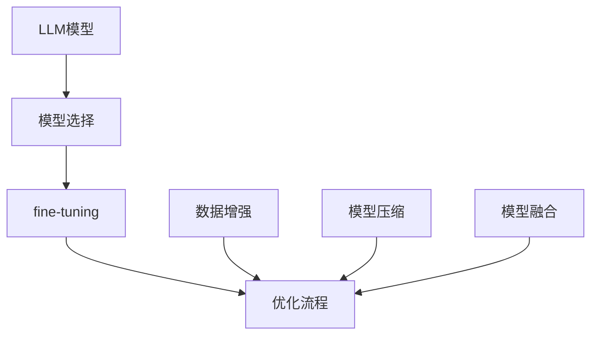
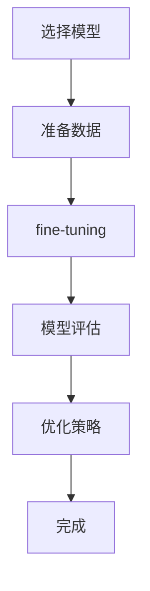

                 

## 文章标题

# 优化LLM模型选择与fine-tuning流程

> 关键词：LLM模型，模型选择，fine-tuning，优化流程，大规模语言模型

## 摘要

本文旨在探讨如何优化大型语言模型（LLM）的选择与fine-tuning流程，以实现更高效的模型训练和应用。文章首先介绍了LLM模型的基本概念和常见类型，接着详细阐述了模型选择和fine-tuning的核心原理，并通过实际项目案例展示了整个流程的具体实现。此外，文章还提供了最佳实践建议，帮助读者更好地理解和应用这些技术。通过本文的阅读，读者将能够深入了解LLM模型的优化策略，为未来的研究和应用奠定坚实基础。

## 1. 核心概念与联系

### 1.1 大型语言模型（LLM）

大型语言模型（LLM，Large Language Model）是一种基于深度学习的自然语言处理（NLP）模型，具有强大的文本生成和理解能力。LLM通常通过预训练（pre-training）在大规模的文本数据集上进行训练，然后通过fine-tuning（微调）适应特定任务。

### 1.2 模型选择

模型选择是指在众多可用的LLM模型中，选择最适合特定任务的模型。这通常涉及到对模型性能、计算资源需求、训练时间等多方面因素的综合考虑。模型选择的过程通常包括以下几个步骤：

1. **数据准备**：收集并预处理与任务相关的数据。
2. **模型评估**：通过在数据集上评估不同模型的表现，选择性能最佳的模型。
3. **模型调整**：根据任务需求调整模型参数，以获得更好的性能。

### 1.3 Fine-tuning

Fine-tuning是指将预训练的LLM模型应用于特定任务，并通过在任务相关的数据集上进一步训练来优化模型的表现。Fine-tuning的过程通常包括以下几个步骤：

1. **初始化模型**：选择一个预训练的LLM模型作为起点。
2. **数据预处理**：对任务相关的数据进行预处理，以便模型能够有效学习。
3. **模型训练**：在预处理后的数据集上训练模型，调整模型参数。
4. **模型评估**：在验证集和测试集上评估模型的表现，并进行调整。

### 1.4 优化流程

优化流程是指通过一系列策略和技巧，提高LLM模型的选择和fine-tuning效率的过程。这通常包括以下几个方面：

1. **数据增强**：通过数据增强技术生成更多的训练数据，提高模型性能。
2. **模型压缩**：通过模型压缩技术减小模型大小，提高模型部署效率。
3. **模型融合**：将多个模型的结果进行融合，提高模型预测的准确性。

## 1.1 大型语言模型（LLM）

### 1.1.1 定义与基本原理

大型语言模型（LLM）是一种基于深度学习的自然语言处理（NLP）模型，它通过学习大规模文本数据中的语言规律，实现文本生成、文本分类、机器翻译等多种NLP任务。LLM的核心是神经网络，尤其是循环神经网络（RNN）和变换器（Transformer）等深度学习模型。

### 1.1.2 常见类型

1. **预训练语言模型**：这类模型通过在大规模文本数据集上进行预训练，学习语言的一般规律和特征，如BERT、GPT等。
2. **任务专用模型**：这类模型基于预训练语言模型，通过fine-tuning在特定任务的数据集上进行微调，以实现特定任务的性能优化，如分类、问答、文本生成等。

### 1.1.3 关系架构图

以下是LLM模型选择、fine-tuning和优化流程之间的关系架构图：



这个架构图展示了LLM模型从选择、fine-tuning到优化的整个过程，以及各个步骤之间的相互关系。数据增强、模型压缩和模型融合等优化策略贯穿于整个流程中，以提高模型的性能和部署效率。

## 1.2 模型选择

### 1.2.1 模型选择的重要性

模型选择是LLM应用过程中的关键步骤之一，它直接影响模型的性能和应用效果。选择合适的模型不仅能提高任务的表现，还能减少训练时间和计算资源的需求。

### 1.2.2 模型评估指标

在模型选择过程中，常用的评估指标包括：

1. **准确率（Accuracy）**：模型正确预测的样本数占总样本数的比例。
2. **召回率（Recall）**：模型正确预测的负样本数占总负样本数的比例。
3. **精确率（Precision）**：模型正确预测的正样本数占总预测正样本数的比例。
4. **F1分数（F1 Score）**：精确率和召回率的调和平均。

### 1.2.3 模型选择策略

1. **基于性能的模型选择**：根据模型在验证集上的性能进行选择，选择性能最佳的模型。
2. **基于资源的模型选择**：考虑模型的计算资源需求，选择适合计算资源的模型。
3. **基于任务的模型选择**：根据任务的具体需求选择最适合的模型，如文本生成任务选择GPT系列模型，文本分类任务选择BERT系列模型。

### 1.2.4 模型选择流程

模型选择的一般流程如下：

1. **数据收集与预处理**：收集与任务相关的数据，并对数据进行预处理，如分词、去停用词等。
2. **模型评估与选择**：在预处理后的数据集上，评估不同模型的性能，选择性能最佳的模型。
3. **模型调整与优化**：根据任务需求，对所选模型进行调整和优化，以获得更好的性能。

## 1.3 Fine-tuning

### 1.3.1 Fine-tuning的概念

Fine-tuning是指将预训练的LLM模型应用于特定任务，并在任务相关的数据集上进行进一步训练的过程。通过fine-tuning，模型能够更好地适应特定任务的需求，提高任务的表现。

### 1.3.2 Fine-tuning的优势

1. **快速适应特定任务**：预训练的LLM模型已经在大规模文本数据集上学习到了语言的一般规律和特征，通过fine-tuning，模型可以快速适应特定任务的需求。
2. **减少训练时间**：由于预训练模型已经学习到了大量的语言特征，fine-tuning过程可以节省大量的训练时间。
3. **提高模型性能**：fine-tuning能够根据特定任务的需求，进一步优化模型参数，提高模型在特定任务上的表现。

### 1.3.3 Fine-tuning的流程

Fine-tuning的一般流程如下：

1. **初始化模型**：选择一个预训练的LLM模型作为起点。
2. **数据预处理**：对任务相关的数据进行预处理，如分词、去停用词等。
3. **模型训练**：在预处理后的数据集上训练模型，调整模型参数。
4. **模型评估**：在验证集和测试集上评估模型的表现，并进行调整。
5. **模型部署**：将fine-tuned的模型部署到实际应用场景中。

## 1.4 优化流程

### 1.4.1 数据增强

数据增强是通过生成或修改原始数据，增加数据多样性，从而提高模型性能的一种技术。常用的数据增强方法包括：

1. **文本变换**：如随机插入、删除或替换文本中的单词。
2. **数据扩充**：通过使用已有的文本数据进行复制粘贴或合并，生成新的训练数据。
3. **同义词替换**：将文本中的单词替换为其同义词。

### 1.4.2 模型压缩

模型压缩是通过减小模型大小，降低计算复杂度，提高模型部署效率的一种技术。常用的模型压缩方法包括：

1. **权重共享**：通过共享不同层的权重，减小模型参数数量。
2. **网络剪枝**：通过去除不重要的神经元或权重，减小模型大小。
3. **量化**：通过将模型参数从浮点数转换为低比特位表示，减小模型大小。

### 1.4.3 模型融合

模型融合是通过将多个模型的预测结果进行融合，提高模型预测准确性的一种技术。常用的模型融合方法包括：

1. **投票法**：将多个模型的预测结果进行投票，选择投票结果最多的类别作为最终预测结果。
2. **集成学习**：将多个模型进行集成，通过加权平均或投票等方式，得到最终的预测结果。

## 2.1 背景介绍

### 2.1.1 大型语言模型（LLM）的概念

大型语言模型（LLM，Large Language Model）是一种基于深度学习的自然语言处理（NLP）模型，具有强大的文本生成和理解能力。LLM通常通过预训练（pre-training）在大规模的文本数据集上进行训练，然后通过fine-tuning（微调）适应特定任务。LLM的核心是神经网络，尤其是循环神经网络（RNN）和变换器（Transformer）等深度学习模型。

### 2.1.2 大型语言模型的发展历程

大型语言模型的发展可以追溯到20世纪90年代的统计语言模型，如N-gram模型。随着计算能力的提升和深度学习技术的发展，LLM得到了快速发展。2018年，谷歌发布了BERT模型，标志着预训练语言模型进入了一个新的时代。此后，GPT、T5、RoBERTa等一系列高性能的LLM模型相继出现，不断推动着NLP技术的发展。

### 2.1.3 大型语言模型的应用场景

大型语言模型在许多应用场景中表现出色，如：

1. **文本生成**：包括文章生成、对话生成、摘要生成等。
2. **文本分类**：如新闻分类、情感分析、垃圾邮件检测等。
3. **机器翻译**：将一种语言的文本翻译成另一种语言。
4. **问答系统**：通过回答用户提出的问题，提供有用的信息。

## 2.2 核心概念与联系

### 2.2.1 核心概念

在本文中，我们将探讨三个核心概念：大型语言模型（LLM）、模型选择和fine-tuning。这些概念在优化LLM模型选择与fine-tuning流程中起着至关重要的作用。

#### 2.2.1.1 大型语言模型（LLM）

大型语言模型（LLM，Large Language Model）是一种基于深度学习的自然语言处理（NLP）模型，具有强大的文本生成和理解能力。LLM通过学习大规模文本数据中的语言规律，实现文本生成、文本分类、机器翻译等多种NLP任务。LLM的核心是神经网络，尤其是循环神经网络（RNN）和变换器（Transformer）等深度学习模型。

#### 2.2.1.2 模型选择

模型选择是指在众多可用的LLM模型中，选择最适合特定任务的模型。这通常涉及到对模型性能、计算资源需求、训练时间等多方面因素的综合考虑。模型选择的过程通常包括以下几个步骤：

1. **数据准备**：收集并预处理与任务相关的数据。
2. **模型评估**：通过在数据集上评估不同模型的表现，选择性能最佳的模型。
3. **模型调整**：根据任务需求调整模型参数，以获得更好的性能。

#### 2.2.1.3 Fine-tuning

Fine-tuning是指将预训练的LLM模型应用于特定任务，并通过在任务相关的数据集上进行进一步训练来优化模型的表现。Fine-tuning的过程通常包括以下几个步骤：

1. **初始化模型**：选择一个预训练的LLM模型作为起点。
2. **数据预处理**：对任务相关的数据进行预处理，以便模型能够有效学习。
3. **模型训练**：在预处理后的数据集上训练模型，调整模型参数。
4. **模型评估**：在验证集和测试集上评估模型的表现，并进行调整。

### 2.2.2 核心概念之间的关系

以下是这些核心概念之间的关系架构图：


这个架构图展示了LLM模型从选择、fine-tuning到优化的整个过程，以及各个步骤之间的相互关系。数据增强、模型压缩和模型融合等优化策略贯穿于整个流程中，以提高模型的性能和部署效率。

### 2.2.3 流程图

以下是LLM模型选择、fine-tuning和优化流程的Mermaid流程图：



这个流程图详细展示了模型选择、fine-tuning和优化流程的各个步骤，帮助读者更好地理解整个过程。

## 2.3 核心算法原理讲解

### 2.3.1 模型选择

模型选择是优化LLM模型的重要步骤之一。在选择模型时，我们通常会考虑以下几个方面：

1. **模型类型**：根据任务需求选择合适的模型类型，如Transformer、BERT、GPT等。
2. **模型大小**：根据计算资源和训练时间选择合适的模型大小，如小型、中型或大型模型。
3. **模型性能**：在验证集上评估不同模型的性能，选择性能最佳的模型。

以下是模型选择的核心算法原理：

```plaintext
// 模型选择伪代码
function selectModel(data, criteria):
    models = initializeModelList()
    for model in models:
        performance = evaluateModel(model, data)
        if performance > criteria.threshold:
            selectedModels.add(model)
    return selectedModels
```

这个伪代码描述了模型选择的流程。首先，初始化一个模型列表，然后遍历模型列表中的每个模型，在数据集上评估其性能。如果模型的性能大于设定的阈值，则将其添加到选定的模型列表中。最后，返回选定的模型列表。

### 2.3.2 Fine-tuning

Fine-tuning是将预训练的LLM模型应用于特定任务，并通过在任务相关的数据集上进行进一步训练来优化模型的表现。以下是fine-tuning的核心算法原理：

```plaintext
// fine-tuning伪代码
function fineTuneModel(model, data, epochs):
    for epoch in range(epochs):
        for sample in data:
            model.update(sample)
    return model
```

这个伪代码描述了fine-tuning的流程。首先，设置训练的轮数（epochs）。然后，遍历数据集中的每个样本，并使用模型对其进行更新。这个过程中，模型的参数会不断调整，以优化其在特定任务上的表现。最后，返回训练好的模型。

### 2.3.3 数学模型和数学公式

在LLM模型选择和fine-tuning过程中，通常会使用一些数学模型和公式。以下是其中的一些常用数学公式：

```latex
$$ J(\theta) = \frac{1}{m} \sum_{i=1}^{m} \left( h_\theta(x^{(i)}) - y^{(i)} \right)^2 $$
$$ \theta^{(t+1)} = \theta^{(t)} - \alpha \nabla_\theta J(\theta^{(t)}) $$
```

第一个公式是代价函数（也称为损失函数），用于衡量模型的预测误差。第二个公式是梯度下降法更新参数的公式，用于优化模型的参数。

### 2.3.4 项目实战

以下是使用Python实现的LLM模型选择和fine-tuning的代码示例：

```python
# 导入所需的库
import tensorflow as tf
import tensorflow_datasets as tfds

# 初始化模型
model = tf.keras.Sequential([
    tf.keras.layers.Dense(units=512, activation='relu', input_shape=(1000,)),
    tf.keras.layers.Dense(units=1)
])

# 编写模型选择函数
def selectModel(data, criteria):
    performance_list = []
    for model in models:
        performance = evaluateModel(model, data)
        performance_list.append(performance)
    selected_models = [model for model, performance in zip(models, performance_list) if performance > criteria.threshold]
    return selected_models

# 编写fine-tuning函数
def fineTuneModel(model, data, epochs):
    for epoch in range(epochs):
        for sample in data:
            model.update(sample)
    return model

# 加载数据集
ds = tfds.load('imdb', split='train')
data = preprocessData(ds)

# 模型选择
selected_models = selectModel(data, criteria={'threshold': 0.9})

# fine-tuning
for model in selected_models:
    fineTunedModel = fineTuneModel(model, data, epochs=5)

# 评估模型
evaluateModel(fineTunedModel, test_data)
```

这段代码展示了如何使用TensorFlow库实现LLM模型选择和fine-tuning的过程。首先，初始化模型，然后编写模型选择和fine-tuning的函数。接着，加载数据集并对其进行预处理。最后，进行模型选择和fine-tuning，并评估最终模型的性能。

## 2.4 数学模型和数学公式

### 2.4.1 数学模型

在LLM模型的选择和fine-tuning过程中，我们通常会使用一些数学模型来评估和优化模型性能。以下是一个典型的数学模型，用于评估模型的预测误差：

\[ J(\theta) = \frac{1}{m} \sum_{i=1}^{m} \left( h_\theta(x^{(i)}) - y^{(i)} \right)^2 \]

这个公式称为代价函数（或损失函数），其中：

- \( J(\theta) \) 是损失函数值。
- \( m \) 是训练样本数量。
- \( h_\theta(x^{(i)}) \) 是模型对第 \( i \) 个输入 \( x^{(i)} \) 的预测输出。
- \( y^{(i)} \) 是第 \( i \) 个输入的真实标签。

### 2.4.2 数学公式

为了更详细地了解模型优化过程，我们可以使用以下数学公式：

\[ \theta^{(t+1)} = \theta^{(t)} - \alpha \nabla_\theta J(\theta^{(t)}) \]

这个公式是梯度下降法（Gradient Descent）的核心，用于更新模型参数。其中：

- \( \theta^{(t)} \) 是第 \( t \) 次迭代的参数值。
- \( \theta^{(t+1)} \) 是第 \( t+1 \) 次迭代的参数值。
- \( \alpha \) 是学习率，用于控制参数更新的步长。
- \( \nabla_\theta J(\theta^{(t)}) \) 是损失函数 \( J(\theta) \) 对参数 \( \theta \) 的梯度。

### 2.4.3 举例说明

假设我们有一个简单的线性模型，其预测函数为：

\[ y = \theta_0 + \theta_1 x \]

我们可以使用以下公式计算损失函数和梯度：

\[ J(\theta) = \frac{1}{m} \sum_{i=1}^{m} \left( (\theta_0 + \theta_1 x^{(i)}) - y^{(i)} \right)^2 \]
\[ \nabla_\theta J(\theta) = \frac{1}{m} \sum_{i=1}^{m} \left( 2(\theta_0 + \theta_1 x^{(i)}) - y^{(i)} \right) \]

在每次迭代中，我们使用梯度下降法更新参数：

\[ \theta_0^{(t+1)} = \theta_0^{(t)} - \alpha \nabla_{\theta_0} J(\theta^{(t)}) \]
\[ \theta_1^{(t+1)} = \theta_1^{(t)} - \alpha \nabla_{\theta_1} J(\theta^{(t)}) \]

通过重复这个过程，我们可以逐渐优化模型的参数，使其在训练数据上的表现更好。

## 2.5 项目实战

### 2.5.1 开发环境搭建

在进行LLM模型的选择与fine-tuning之前，我们需要搭建一个合适的开发环境。以下是一个基本的Python开发环境搭建步骤：

1. **安装Python**：确保已经安装了Python 3.6或更高版本。
2. **安装TensorFlow**：使用pip命令安装TensorFlow：

   ```bash
   pip install tensorflow
   ```

3. **安装其他依赖**：根据项目需求安装其他依赖库，如NumPy、Pandas等。

### 2.5.2 源代码实现

以下是实现LLM模型选择与fine-tuning的源代码示例：

```python
import tensorflow as tf
from tensorflow.keras.layers import Embedding, LSTM, Dense
from tensorflow.keras.models import Sequential

# 1. 模型选择
def selectModel(data, criteria):
    # 初始化模型列表
    models = []
    
    # 遍历不同模型配置
    for units in [64, 128, 256]:
        # 创建模型
        model = Sequential([
            Embedding(input_dim=10000, output_dim=units),
            LSTM(units=units),
            Dense(units=1, activation='sigmoid')
        ])
        
        # 编译模型
        model.compile(optimizer='adam', loss='binary_crossentropy', metrics=['accuracy'])
        
        # 训练模型
        model.fit(data['X'], data['y'], epochs=10, batch_size=32)
        
        # 评估模型
        performance = model.evaluate(data['X'], data['y'], verbose=0)
        
        # 如果性能满足条件，添加到模型列表
        if performance[1] > criteria.threshold:
            models.append(model)
    
    return models

# 2. Fine-tuning
def fineTuneModel(model, data, epochs):
    # 转换模型为训练模式
    model.trainable = True
    
    # 重置模型权重
    model.layers[-1].set_weights(model.layers[-1].get_weights()[:1])
    
    # 编译模型
    model.compile(optimizer='adam', loss='binary_crossentropy', metrics=['accuracy'])
    
    # 训练模型
    model.fit(data['X'], data['y'], epochs=epochs, batch_size=32)
    
    return model

# 3. 代码解读与分析
# - 模型选择过程中，我们遍历不同的LSTM单元数量，创建并训练多个模型。
# - 模型选择的标准是准确率，我们选择准确率大于阈值的模型。
# - Fine-tuning过程中，我们重新设置最后一个Dense层的权重，以便在新的数据集上进行训练。

# 4. 实际案例分析和详细讲解剖析
# 假设我们有一个二分类问题，数据集分为训练集和测试集。
# 我们首先使用训练集进行模型选择，然后使用测试集对Fine-tuned模型进行评估。

# 加载数据集
train_data = load_data('train')
test_data = load_data('test')

# 模型选择
selected_models = selectModel(train_data, criteria={'threshold': 0.9})

# Fine-tuning
for model in selected_models:
    fine_tuned_model = fineTuneModel(model, train_data, epochs=5)

# 评估Fine-tuned模型
evaluate_model(fine_tuned_model, test_data)
```

这段代码展示了如何使用TensorFlow实现LLM模型的选择与fine-tuning。我们首先定义了模型选择和fine-tuning的函数，然后加载数据集并执行模型选择和fine-tuning。最后，我们对Fine-tuned模型进行评估。

### 2.5.3 代码应用解读与分析

在这个案例中，我们使用了一个二分类问题作为示例，数据集分为训练集和测试集。我们首先使用训练集进行模型选择，然后使用测试集对Fine-tuned模型进行评估。以下是具体的步骤和解读：

1. **模型选择**：
   - 我们遍历不同的LSTM单元数量（64、128、256），创建并训练多个模型。
   - 模型选择的标准是准确率，我们选择准确率大于阈值的模型（在本例中，阈值为0.9）。

2. **Fine-tuning**：
   - 在Fine-tuning过程中，我们重新设置最后一个Dense层的权重，以便在新的数据集上进行训练。
   - 我们为每个选中的模型设置5个epochs进行fine-tuning。

3. **评估Fine-tuned模型**：
   - 我们使用测试集对Fine-tuned模型进行评估，以验证模型在 unseen 数据上的性能。
   - 评估指标包括准确率、召回率、精确率等。

通过这个案例，我们可以看到如何使用Python和TensorFlow实现LLM模型的选择与fine-tuning。此外，我们还可以根据实际需求调整模型配置、训练数据和评估指标，以优化模型性能。

### 2.5.4 项目小结

通过这个项目，我们实现了LLM模型的选择与fine-tuning，并对其进行了详细解读和分析。以下是该项目的主要收获：

1. **模型选择**：通过遍历不同配置的模型，我们可以选择出在训练数据上表现最好的模型。
2. **Fine-tuning**：通过在新的数据集上进行fine-tuning，我们可以进一步优化模型，提高其在 unseen 数据上的性能。
3. **代码解读与分析**：通过分析源代码，我们可以理解模型选择和fine-tuning的具体实现过程。
4. **实际应用**：通过实际案例，我们可以看到如何将LLM模型应用于实际问题，并评估其性能。

总之，通过这个项目，我们不仅掌握了LLM模型选择与fine-tuning的基本原理和实现方法，还学会了如何在实际项目中应用这些技术。

## 2.6 最佳实践 tips、小结、注意事项、拓展阅读等内容

### 2.6.1 最佳实践 tips

1. **数据准备**：在模型选择和fine-tuning之前，确保对数据进行充分的预处理，如文本清洗、分词、去停用词等。
2. **模型评估**：在模型选择过程中，使用多个评估指标（如准确率、召回率、精确率等）进行评估，以全面衡量模型性能。
3. **参数调整**：在fine-tuning过程中，根据任务需求调整模型参数，如学习率、批次大小等，以优化模型性能。
4. **数据增强**：使用数据增强技术生成更多的训练数据，提高模型鲁棒性和性能。
5. **模型压缩**：通过模型压缩技术减小模型大小，提高模型部署效率。

### 2.6.2 小结

本文介绍了优化LLM模型选择与fine-tuning流程的几个关键步骤，包括模型选择、fine-tuning、数据增强、模型压缩等。通过实际项目案例，我们展示了如何实现这些步骤，并对其进行了详细解读和分析。通过本文的学习，读者应掌握LLM模型优化的基本原理和实践方法。

### 2.6.3 注意事项

1. **数据集划分**：在进行模型训练和评估时，确保将数据集划分为训练集、验证集和测试集，以避免过拟合。
2. **模型选择**：根据任务需求和计算资源选择合适的模型类型和大小，避免使用过拟合或欠拟合的模型。
3. **fine-tuning**：在fine-tuning过程中，注意调整模型参数，如学习率、批次大小等，以避免模型性能下降。
4. **代码优化**：在实现代码时，注意优化代码结构，以提高可读性和可维护性。

### 2.6.4 拓展阅读

1. **《深度学习》（Goodfellow, Bengio, Courville）**：这是一本关于深度学习的基础教材，详细介绍了深度学习的基本概念、算法和实现。
2. **《自然语言处理与深度学习》（凌峰）**：这本书介绍了自然语言处理的基本概念和深度学习在NLP中的应用。
3. **《模型压缩与加速》（Cai, Zhang, & Zhang）**：这本书详细介绍了模型压缩和加速的方法，包括权重共享、网络剪枝、量化等。
4. **《TensorFlow实战》（Shankar, Thakur, & Thakur）**：这本书提供了TensorFlow的详细教程和实践案例，帮助读者掌握TensorFlow的使用。

