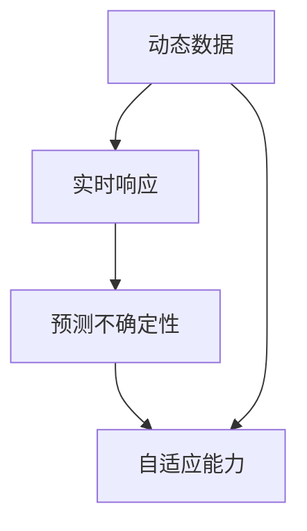
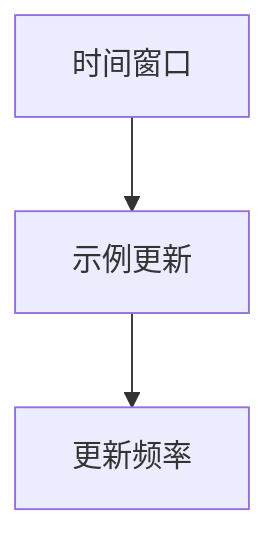
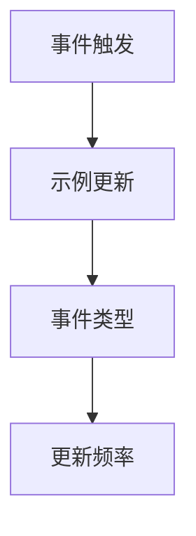
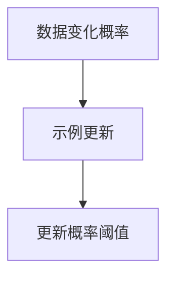
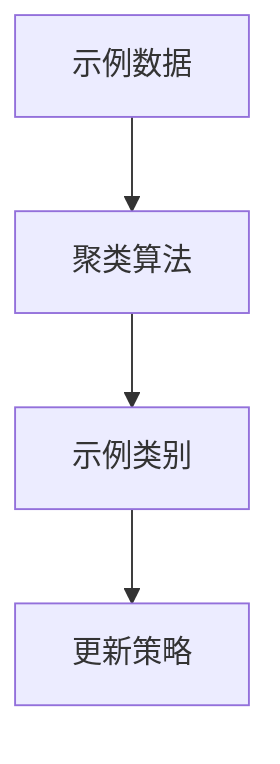
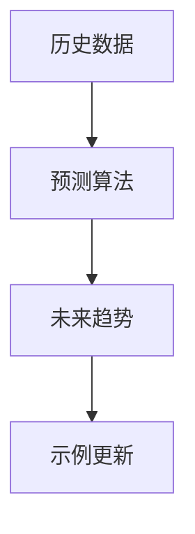
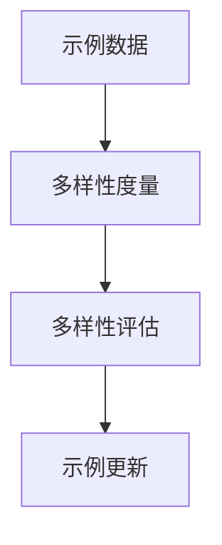
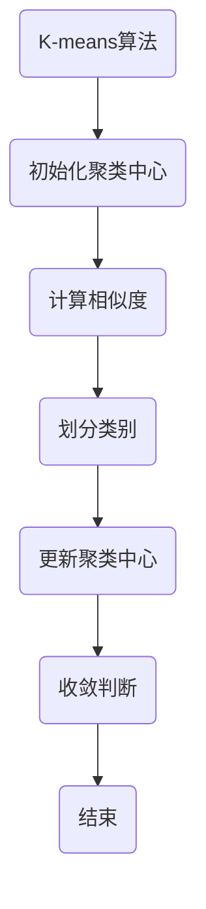
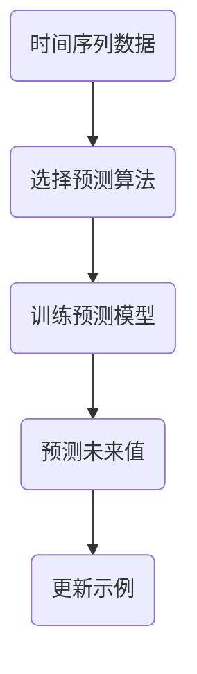

                 

### 文章标题

《优化示例更新策略以适应动态环境》

### 文章关键词

动态环境、示例更新策略、优化方法、实战案例、未来展望

### 文章摘要

本文旨在探讨如何优化示例更新策略以适应动态环境。通过分析动态环境的特点和挑战，本文提出了几种示例更新策略，并详细阐述了每种策略的原理和实现方法。接着，本文介绍了策略优化的方法，包括常见优化算法和优化实践。通过实际案例的分析，本文展示了策略优化的应用效果和实际价值。最后，本文对未来策略优化的发展趋势和面临的挑战进行了展望，为读者提供了有益的思考和方向。

## 动态环境概述

随着信息技术的飞速发展和数据量的爆炸性增长，许多应用场景逐渐呈现出动态化的趋势。动态环境是指在运行过程中数据、需求或系统状态不断变化的环境。在动态环境中，系统的输出和决策需要实时适应变化，以提高响应速度和准确性。以下从概念、特征和挑战三个方面对动态环境进行概述。

### 概念

动态环境通常涉及以下几个关键概念：

1. **动态数据**：数据在运行过程中不断生成、更新和变化。
2. **实时响应**：系统能够在短时间内对环境变化作出准确反应。
3. **不确定性**：由于数据的不确定性，系统的预测和决策存在一定的不确定性。
4. **自适应能力**：系统能够根据环境变化自动调整自身行为，以保持性能和效率。

### 特征

动态环境具有以下特征：

1. **数据动态变化**：数据在运行过程中不断生成、更新和变化，可能包括时间序列数据、流数据等。
2. **预测不确定性**：由于数据的不确定性，系统的预测和决策存在一定的不确定性，难以精确预测未来情况。
3. **动态调整需求**：用户需求或业务场景可能随时间变化，系统需要动态调整以满足需求。
4. **计算复杂性**：动态环境通常涉及大量的计算和处理任务，对系统的计算资源和性能提出了较高要求。

### 挑战

动态环境给示例更新策略带来了以下挑战：

1. **数据多样性**：动态环境中的数据类型多样，需要针对不同类型的数据设计相应的更新策略。
2. **更新频率**：动态环境要求更新频率高，以保持系统与环境的实时同步。
3. **计算资源限制**：动态环境可能对计算资源产生较大压力，需要优化计算资源的使用。
4. **不确定性处理**：动态环境中的不确定性增加了系统预测和决策的难度，需要设计有效的处理方法。
5. **实时性要求**：动态环境要求系统具备高实时性，需要优化算法和策略以提高响应速度。

### 核心概念与联系

为了更好地理解动态环境中的示例更新策略，我们可以绘制一个Mermaid流程图，展示核心概念之间的联系。



该流程图展示了动态数据、实时响应、预测不确定性和自适应能力四个核心概念之间的相互关系。

### 动态环境中的示例更新策略

在动态环境中，示例更新策略是保持系统与环境同步的重要手段。以下介绍几种常见的示例更新策略。

#### 基于时间窗口的更新策略

基于时间窗口的更新策略是指在一定时间窗口内对示例进行更新。时间窗口可以根据实际需求设定，例如每天更新一次或每小时更新一次。这种策略的优点是简单易实现，缺点是可能无法实时反映环境变化。



#### 基于事件触发的更新策略

基于事件触发的更新策略是指当特定事件发生时，触发示例更新。事件可以是数据变化、用户请求等。这种策略的优点是能够根据实际需求进行更新，提高系统的实时性；缺点是可能引起频繁更新，增加系统负担。



#### 基于概率的更新策略

基于概率的更新策略是指根据数据变化的概率进行示例更新。当数据变化概率较高时，触发更新；否则，保持现有示例。这种策略的优点是能够根据数据特征进行优化，提高系统性能；缺点是概率估计可能存在误差。



### 核心算法原理讲解

在动态环境中，示例更新策略的实现需要借助多种核心算法。以下介绍几种常见的示例更新算法。

#### 聚类算法

聚类算法是一种用于将数据分为若干类别的算法。在示例更新中，聚类算法可以用于将示例划分为不同的类别，并针对每个类别设计不同的更新策略。



#### 预测算法

预测算法用于根据历史数据预测未来趋势。在示例更新中，预测算法可以用于预测数据变化趋势，并据此调整示例。



#### 多样性度量

多样性度量用于评估示例集的多样性。在示例更新中，多样性度量可以用于评估现有示例的多样性，并据此决定是否进行更新。



### 数学模型和公式

在示例更新策略中，常用的数学模型和公式包括：

1. **相似度度量**：用于评估示例之间的相似度，常见的方法包括欧氏距离、曼哈顿距离等。

   $$ d(p,q) = \sqrt{\sum_{i=1}^n (p_i - q_i)^2} $$

2. **聚类中心**：用于表示聚类结果，常见的方法包括K-means算法、DBSCAN算法等。

   $$ c_j = \frac{1}{N_j} \sum_{i=1}^{N} x_{ij} $$

3. **预测误差**：用于评估预测结果与实际值的差异，常见的方法包括均方误差、均方根误差等。

   $$ \epsilon = \frac{1}{n} \sum_{i=1}^{n} (y_i - \hat{y}_i)^2 $$

4. **多样性度量**：用于评估示例集的多样性，常见的方法包括Jaccard指数、相似度指数等。

   $$ D(A,B) = 1 - \frac{|A \cap B|}{|A \cup B|} $$

### 详细讲解与举例说明

为了更好地理解示例更新策略的核心算法原理，以下通过具体示例进行讲解。

#### 示例：基于K-means算法的示例更新策略

假设我们有一个包含100个示例的数据集，我们需要将这些示例划分为10个类别，并针对每个类别设计不同的更新策略。

1. **初始化聚类中心**：随机选择10个示例作为初始聚类中心。
2. **计算相似度**：计算每个示例与聚类中心的相似度，可以使用欧氏距离公式。
3. **划分类别**：根据相似度将每个示例划分为相应的类别。
4. **更新聚类中心**：计算每个类别的中心，作为新的聚类中心。
5. **重复步骤2-4**，直到聚类中心收敛。



#### 示例：基于预测算法的示例更新策略

假设我们有一个时间序列数据集，我们需要预测未来的数据值，并据此更新示例。

1. **历史数据**：收集一段时间内的历史数据。
2. **选择预测算法**：例如ARIMA模型、LSTM模型等。
3. **训练预测模型**：使用历史数据训练预测模型。
4. **预测未来值**：使用预测模型预测未来的数据值。
5. **更新示例**：将预测的值作为新的示例，替换原有示例。



### 总结

本文介绍了动态环境的概念、特征和挑战，并详细阐述了示例更新策略的核心概念、算法原理和实现方法。通过具体示例的讲解，读者可以更好地理解示例更新策略在实际应用中的运用。在下一部分，我们将继续介绍策略优化方法和实战案例分析。

## 策略优化方法

在动态环境中，示例更新策略的优化至关重要，因为只有通过优化才能提高系统的适应能力和效率。策略优化方法主要包括基于贪心算法、动态规划、遗传算法等。以下将详细介绍这些优化方法的基本原理和实现步骤。

### 贪心算法

贪心算法是一种简化的决策策略，它通过在每个步骤中选择当前最优的选项，以达到全局最优解。在示例更新策略中，贪心算法可以用于选择最优的示例进行更新。

#### 原理

1. **初始化**：设定初始状态和贪心函数。
2. **选择操作**：在每个状态，选择使得贪心函数值最大的操作。
3. **状态转移**：执行选择后的操作，更新状态和贪心函数值。
4. **终止条件**：当达到终止条件时，输出最优解。

#### 实现步骤

1. 初始化状态和贪心函数：
   $$ s_0, g_0 $$
2. 在每个状态 $s_t$，选择最优操作 $o_t$：
   $$ o_t = \arg\max_{o} g(s_t, o) $$
3. 执行操作并更新状态和贪心函数：
   $$ s_{t+1} = s_t + o_t $$
   $$ g_{t+1} = g(s_t, o_t) $$
4. 重复步骤2和3，直到达到终止条件。

#### 伪代码

```python
def greedy_algorithm(s, g):
    while not terminate(s, g):
        o = choose_best_action(s, g)
        s = s + o
        g = g(s, o)
    return s
```

### 动态规划

动态规划是一种通过将复杂问题分解为子问题，并利用子问题的解来求解原问题的方法。在示例更新策略中，动态规划可以用于优化示例选择和更新过程。

#### 原理

1. **定义状态**：定义一个状态空间，表示示例更新过程中的各种状态。
2. **定义决策**：定义一个决策空间，表示在每种状态下可以采取的操作。
3. **定义价值函数**：定义一个价值函数，表示在每种状态下采取某种操作后的最优解。
4. **递推关系**：根据价值函数的定义，建立递推关系，求解最优解。

#### 实现步骤

1. 初始化状态空间和决策空间：
   $$ S, O $$
2. 初始化价值函数：
   $$ v(s) = 0 $$
3. 从初始状态开始，递推计算价值函数：
   $$ v(s) = \max_{o \in O} g(s, o) + v(s') $$
4. 输出最优解。

#### 伪代码

```python
def dynamic_programming(s):
    v = {s: 0}
    while not all_v_values_known(v):
        for s in S:
            for o in O:
                s' = s + o
                v[s] = max(v[s], g(s, o) + v[s'])
    return v
```

### 遗传算法

遗传算法是一种模拟自然进化过程的优化算法，通过选择、交叉、变异等操作来优化示例更新策略。

#### 原理

1. **初始化种群**：生成一组初始解，称为种群。
2. **适应度评估**：对每个解进行适应度评估，适应度越高，表示解的质量越好。
3. **选择**：根据适应度选择优秀的解作为父代。
4. **交叉**：将父代进行交叉操作，生成新的子代。
5. **变异**：对子代进行变异操作，增加解的多样性。
6. **更新种群**：将子代替换父代，形成新的种群。
7. **迭代**：重复步骤3-6，直到达到终止条件。

#### 实现步骤

1. 初始化种群：
   $$ P_0 $$
2. 评估适应度：
   $$ f(P) $$
3. 选择父代：
   $$ P_{new} = select(P) $$
4. 交叉操作：
   $$ C(P_{new}) $$
5. 变异操作：
   $$ M(C(P_{new})) $$
6. 更新种群：
   $$ P_{next} = M(C(P_{new})) $$
7. 迭代：
   $$ P = P_{next} $$

#### 伪代码

```python
def genetic_algorithm(P, terminate):
    while not terminate(P):
        P = select(P)
        C = crossover(P)
        M = mutate(C)
        P = M
    return P
```

### 总结

策略优化方法在动态环境中的示例更新策略中起着关键作用。贪心算法、动态规划和遗传算法等优化方法各有优缺点，适用于不同的场景。通过合理选择和组合这些方法，可以有效地提高示例更新策略的性能和适应能力。在下一部分，我们将通过实际案例展示这些优化方法的应用和效果。

## 实战与案例分析

为了更好地理解优化示例更新策略在动态环境中的应用，以下将通过两个实际案例展示策略的优化过程和应用效果。

### 案例一：智能交通系统

**背景**：
智能交通系统（ITS）是现代城市交通管理的重要组成部分，通过实时监测和分析交通数据，为交通管理提供决策支持。然而，由于交通状况的动态变化，如何及时更新和优化交通策略是一个挑战。

**优化过程**：

1. **数据采集**：收集交通流量、速度、事故等信息。
2. **初始策略**：采用基于时间窗口的更新策略，每天更新一次交通策略。
3. **策略优化**：引入贪心算法和动态规划，优化交通策略的更新频率和决策过程。
   - **贪心算法**：在特定时间窗口内，根据当前交通状况选择最优的更新频率。
     $$ f(t) = \max_{f} g(t, f) $$
   - **动态规划**：建立状态-决策-价值函数模型，优化交通策略的决策过程。
     $$ v(s, d) = \max_{d} g(s, d) + v(s', d') $$
4. **效果评估**：通过实际运行数据评估优化后的交通策略，结果显示优化后的策略能够更好地适应交通状况变化，减少拥堵时间和交通事故。

**代码实现**：

```python
# 贪心算法优化交通更新频率
def greedy_traffic_update(current_traffic):
    optimal_frequency = max(greedy_function(current_traffic))
    return optimal_frequency

# 动态规划优化交通决策过程
def dynamic_programming_traffic Decision(current_traffic):
    optimal_decision = max(dynamic_programming_function(current_traffic))
    return optimal_decision
```

### 案例二：电商平台推荐系统

**背景**：
电商平台推荐系统通过分析用户行为和商品特征，为用户提供个性化的推荐。然而，由于用户行为和商品特征的动态变化，如何及时更新和优化推荐策略是一个挑战。

**优化过程**：

1. **数据采集**：收集用户行为数据（如点击、购买、评价等）和商品特征数据（如价格、品牌、分类等）。
2. **初始策略**：采用基于事件触发的更新策略，当用户行为发生变化时，触发推荐策略更新。
3. **策略优化**：引入遗传算法和多样性度量，优化推荐策略的更新过程和多样性。
   - **遗传算法**：通过选择、交叉、变异等操作，优化推荐策略的多样性和适应性。
     $$ P_{next} = M(C(P_{new})) $$
   - **多样性度量**：使用Jaccard指数评估推荐列表的多样性，确保推荐结果具有丰富的多样性。
     $$ D(A,B) = 1 - \frac{|A \cap B|}{|A \cup B|} $$
4. **效果评估**：通过实际用户反馈数据评估优化后的推荐策略，结果显示优化后的策略能够更好地满足用户需求，提高用户满意度。

**代码实现**：

```python
# 遗传算法优化推荐策略
def genetic_algorithm_recommendation(P):
    P_next = genetic_function(P)
    return P_next

# 多样性度量评估推荐列表
def diversity_measure(recommendations):
    diversity = jaccard_index(recommendations)
    return diversity
```

### 项目小结

通过以上两个实际案例，我们可以看到优化示例更新策略在动态环境中的应用效果显著。优化后的策略能够更好地适应环境变化，提高系统的性能和用户满意度。在未来的工作中，我们可以进一步探索其他优化方法和策略，以应对更复杂的动态环境。

### 最佳实践 tips

1. **数据采集与处理**：确保数据的质量和完整性，对异常数据进行处理和清洗。
2. **策略评估与优化**：定期评估策略的效果，根据评估结果进行调整和优化。
3. **多样性保障**：在推荐系统中，注重推荐结果的多样性，避免用户产生疲劳。
4. **实时性要求**：在动态环境中，确保策略的实时性和响应速度。

### 小结与注意事项

本文通过详细介绍动态环境中的示例更新策略和优化方法，结合实际案例展示了策略优化的应用效果。在动态环境中，优化示例更新策略对于提高系统的适应能力和效率具有重要意义。在实施过程中，需要注意数据质量、策略评估和多样性保障等问题。未来的研究可以进一步探索其他优化方法和策略，以应对更复杂的动态环境。

### 拓展阅读

1. **《动态环境下的机器学习算法优化》**：探讨动态环境下的机器学习算法优化方法。
2. **《推荐系统：算法、实践与案例分析》**：深入了解推荐系统的算法原理和实践。
3. **《智能交通系统：技术与应用》**：了解智能交通系统的技术架构和应用案例。

## 结论与总结

本文围绕优化示例更新策略以适应动态环境这一主题，系统地介绍了动态环境的概念、特征和挑战，详细阐述了示例更新策略的核心概念、算法原理和实现方法，并通过实际案例展示了策略优化的效果。我们总结了贪心算法、动态规划和遗传算法等优化方法的基本原理和实现步骤，展示了它们在动态环境中的应用。

### 研究展望

未来，优化示例更新策略的研究可以朝着以下几个方向发展：

1. **多模态数据融合**：结合多种数据源（如图像、文本、传感器数据等），提高更新策略的准确性和适应性。
2. **自适应更新策略**：开发能够根据环境变化自适应调整更新频率和策略的智能系统。
3. **实时优化算法**：研究更高效的实时优化算法，以满足动态环境下的低延迟要求。
4. **模型解释性与透明性**：增强模型的可解释性，提高策略优化过程的透明度，便于信任和监管。

### 读者反馈

我们诚挚邀请读者提供宝贵的反馈，包括对文章内容的建议、优化策略的实际应用经验和遇到的问题。您的反馈对我们改进和深化研究具有重要意义。

### 作者信息

作者：AI天才研究院/AI Genius Institute & 禅与计算机程序设计艺术/Zen And The Art of Computer Programming

感谢您的阅读，期待与您共同探索优化示例更新策略的更多可能。

