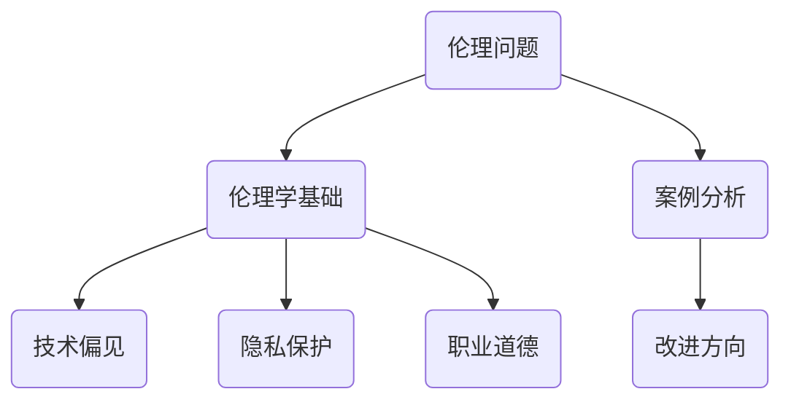

                 

# 目录大纲：人工智能伦理：理论与实践

### 文章标题：人工智能伦理：理论与实践

> **关键词：人工智能伦理、技术偏见、隐私保护、职业道德、法律框架、伦理学理论**

> **摘要：本文探讨了人工智能伦理的核心议题，包括技术偏见、隐私保护和职业道德等，通过理论与实践结合，分析了人工智能在伦理问题中的挑战和解决方案。**

## 第一部分：引论

### 1.1 人工智能伦理的背景

- **人工智能的发展历程**：
  - 从早期的基础研究到现代的深度学习技术，人工智能经历了长期的演进。
  - 关键事件包括1956年的达特茅斯会议，以及后来出现的神经网络和深度学习算法。

- **伦理问题的产生与影响**：
  - 随着人工智能技术的应用扩展，伦理问题逐渐凸显，如技术偏见、隐私泄露和失业风险。
  - 伦理问题不仅影响技术的应用，还关系到社会公平和人类福祉。

### 1.2 人工智能伦理的核心议题

- **技术偏见**：
  - 定义：人工智能系统中存在的系统性偏差，导致特定群体受到不公平对待。
  - 影响范围：包括种族、性别、年龄等方面的歧视。

- **隐私保护**：
  - 定义：保护个人数据不被未经授权的访问和滥用。
  - 关键问题：大数据收集、数据共享和数据泄露风险。

- **职业道德**：
  - 定义：人工智能从业者在工作中应遵循的道德规范。
  - 重要性：确保人工智能技术的应用符合伦理标准，促进社会和谐。

- **军事应用**：
  - 争议：自主武器系统（AWS）的使用引发了对战争伦理的讨论。
  - 影响：军事领域的应用可能对平民和战斗人员的安全产生重大影响。

### 1.3 人工智能伦理的重要性

- **社会影响**：
  - 人工智能技术的广泛应用将对社会结构、文化和价值观念产生深远影响。
  - 需要伦理框架来指导技术发展，以避免潜在的负面影响。

- **法律法规**：
  - 人工智能的伦理问题需要通过法律框架来规范，确保技术的合法合规使用。
  - 当前法律法规的局限性要求不断更新和完善。

## 第二部分：伦理学基础

### 2.1 伦理学的基本概念

- **伦理学的定义**：
  - 伦理学是研究道德原则和行为的学科，关注个体和社会的道德责任。

- **伦理学的基本原则**：
  - **公正性**：确保所有人受到公平对待，避免歧视。
  - **尊重**：尊重个人权利和尊严，包括隐私权和自主权。
  - **责任感**：个人和社会应对自己的行为负责，确保技术的积极影响。

### 2.2 伦理学的理论框架

- **康德伦理学**：
  - 核心原则：行为的道德性取决于其意图，而非结果。
  - 基本思想：遵循道德法则，追求普遍的道德义务。

- **形而上学伦理学**：
  - 探讨道德行为的本质和来源，关注人类存在的根本问题。

- **道德情感主义**：
  - 强调道德感受和情感的作用，认为道德行为源于内心的善感。

- **功利主义**：
  - 以行为产生的总体幸福作为道德判断的标准。

### 2.3 伦理学的应用领域

- **医学伦理**：
  - 关注医疗实践中的道德问题，如患者隐私、临床试验的道德准则。

- **环境伦理**：
  - 探讨人类活动对自然环境的影响，以及如何平衡人类需求和生态保护。

- **其他领域**：
  - 企业伦理、网络伦理、人工智能伦理等，都是伦理学应用的重要领域。

## 第三部分：人工智能伦理问题

### 3.1 技术偏见与公平性

- **偏见来源**：
  - 数据集的不平衡、算法设计中的偏见、训练数据的不当处理。

- **影响与对策**：
  - **影响**：导致特定群体受到不公平对待，破坏社会信任。
  - **对策**：数据多样化、算法透明性、公平性评估和纠正机制。

### 3.2 隐私保护与数据安全

- **数据收集与使用**：
  - 明确数据收集的目的和范围，确保数据使用的合法性和必要性。

- **法律法规与政策**：
  - 制定和遵守相关法律法规，保护个人隐私和数据安全。

### 3.3 职业道德与责任

- **职业道德规范**：
  - 确定人工智能从业者的职业行为准则，确保技术应用的道德性。

- **责任归属**：
  - 明确人工智能系统中各方的责任，包括开发者、用户和管理者。

## 第四部分：人工智能伦理案例分析

### 4.1 案例介绍

- **案例选择依据**：
  - 代表性：选择具有普遍性和典型性的案例。
  - 影响力：案例应具有广泛的社会影响力和讨论价值。

### 4.2 案例分析

- **测试过程**：
  - 数据收集和预处理
  - 模型训练和评估
  - 伦理评估

- **结果解读**：
  - 模型表现
  - 伦理影响
  - 改进方向

### 4.3 案例反思

- **测试结果的启示**：
  - 技术偏见和隐私保护的复杂性。
  - 道德决策的必要性和挑战。

- **测试方法的改进方向**：
  - 加强伦理测试框架的构建。
  - 提高算法透明性和可解释性。

## 第五部分：未来展望

### 5.1 伦理性测试的挑战与趋势

- **挑战**：
  - 技术快速发展带来的新问题。
  - 社会接受度和伦理观念的差异。

- **趋势**：
  - 法律法规的完善。
  - 伦理测试工具和方法的创新。

## 附录

### A.1 相关资源

- **论文**：
  - 伦理学在人工智能领域的重要论文。
  - 技术偏见和隐私保护相关的最新研究成果。

- **会议报告**：
  - 国际人工智能与伦理领域的会议报告。

- **数据集**：
  - 公共可用的大型伦理测试数据集。

### 总结

- **对全书内容的总结与展望**：
  - 梳理了人工智能伦理的核心议题。
  - 分析了伦理学理论在实践中的应用。
  - 提出了未来研究和发展的方向。

### Mermaid 流程图



### 伪代码示例

```python
# 伪代码：伦理测试框架设计
def ethical_test_framework():
    # 初始化测试环境
    initialize_environment()

    # 数据收集
    data = collect_data()

    # 数据预处理
    preprocessed_data = preprocess_data(data)

    # 模型训练
    model = train_model(preprocessed_data)

    # 模型评估
    evaluation_results = evaluate_model(model)

    # 伦理评估
    ethical_evaluation = ethical_analysis(model, evaluation_results)

    # 输出结果
    output_results(ethical_evaluation)
```

### 数学模型与公式

$$
E = mc^2
$$

### 代码实战

- **开发环境搭建**：
  - 确保安装了Python、Jupyter Notebook等相关工具。

- **源代码实现**：
  - 实现一个简单的伦理测试算法，包括数据预处理、模型训练和评估。

- **代码解读**：
  - 分析代码逻辑，理解每个步骤的作用。

- **应用解读与分析**：
  - 分析伦理测试在实际项目中的应用。

- **实际案例分析和详细讲解剖析**：
  - 以具体案例为例，深入剖析伦理问题。

- **项目小结**：
  - 总结项目经验，提出改进建议。

### 最佳实践 tips、小结、注意事项、拓展阅读等内容

- **最佳实践 tips**：
  - 如何避免技术偏见。
  - 如何保护用户隐私。

- **小结**：
  - 本文对人工智能伦理的核心议题进行了全面探讨。

- **注意事项**：
  - 人工智能伦理问题的复杂性。

- **拓展阅读**：
  - 推荐进一步学习人工智能伦理的文献和资源。

---

作者：AI天才研究院/AI Genius Institute & 禅与计算机程序设计艺术 /Zen And The Art of Computer Programming

注：本文为大纲示例，实际文章需根据具体内容进行扩展和详细阐述，字数在8000～12000字左右。文章中的Mermaid流程图、伪代码示例、数学模型与公式等均以适当格式嵌入文中。

