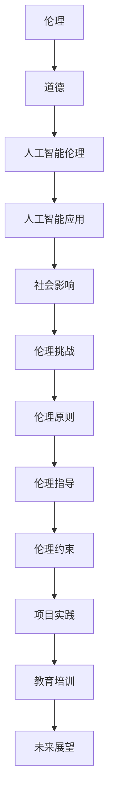

                 

# 《伦理约束：在提示词中加入道德指导》

> 关键词：伦理约束、道德指导、人工智能、提示词、伦理决策模型、伦理得分函数

> 摘要：本文探讨了在人工智能系统中加入伦理约束的必要性和方法。首先介绍了伦理与道德的基本概念及其在人工智能领域的重要性。接着，详细分析了人工智能伦理挑战，包括伦理困境、案例解析和伦理原则的探讨。在此基础上，提出了在提示词中加入道德指导的策略，包括提示词的概念、应用和挑战。随后，讨论了在人工智能项目中实践伦理约束的方法和策略，以及伦理约束教育和培训的重要性。最后，对伦理约束的未来发展进行了展望，并提供了相关资源与工具。

## 第一部分：伦理约束概述

### 1. 伦理与道德的基本概念

#### 1.1 伦理的定义与发展

伦理（Ethics）是一门研究道德（Morality）原则、规范和行为的哲学学科。伦理学探究的是人类行为的正确性、公正性以及道德责任等问题。伦理的定义和范畴随着历史和文化的发展而不断演变。在古代，伦理主要关注个体行为是否符合社会规范。随着现代社会的复杂化和科技进步，伦理研究的范围逐渐扩展到科技领域，尤其是人工智能领域。

伦理学的发展历程可以追溯到古希腊哲学家亚里士多德（Aristotle），他提出了“德性伦理学”（Virtue Ethics）的观点，强调个体道德品质的培养。随后，基督教伦理学和康德伦理学（Kantian Ethics）等学派进一步丰富了伦理学理论。现代伦理学则更多地关注社会问题，如公正、平等和人类尊严等。

#### 1.2 道德的内涵与外延

道德（Morality）是指一组指导个体行为的规范和准则，通常涉及到个体对社会的责任、对他人的尊重和公平性。道德不同于法律，法律是外在的强制性规范，而道德是内在的自觉约束。道德的内涵包括正义、诚实、仁爱、公正、责任感等价值观念。

道德的外延涉及多个领域，包括家庭、学校、工作场所和公共生活等。在家庭中，道德强调亲子关系和亲情；在学校中，道德教育是培养学生的核心任务；在工作场所，道德要求员工诚实守信、敬业爱岗；在公共生活中，道德关注公共秩序和公共利益。

#### 1.3 伦理与道德的联系与区别

伦理与道德密切相关，但两者存在一定的区别。伦理更侧重于研究道德原则、规范和行为的哲学学科，而道德则是具体的规范和准则。伦理关注的是人类行为的正确性和道德责任，而道德关注的是个体的行为规范和社会责任。

在人工智能领域，伦理与道德尤为重要。人工智能的发展和应用不仅影响个体行为，还涉及社会公正、隐私保护和人类尊严等重大问题。因此，在人工智能系统中引入伦理约束和道德指导，有助于确保人工智能系统的公平性、透明性和社会责任感。

### 2. 伦理约束的重要性

#### 2.1 伦理约束对个体的意义

伦理约束对个体具有重要意义。首先，伦理约束有助于个体形成良好的道德品质，如诚实、公正、责任感等。这些品质不仅有助于个体在社会中取得成功，还能提高个体的幸福感和自我价值感。其次，伦理约束有助于个体在复杂的社会环境中做出正确的道德选择，避免陷入道德困境。

此外，伦理约束对个体的心理健康也有积极影响。在遵循伦理规范的过程中，个体能够获得心理上的满足感和安全感。相反，违背伦理规范会导致个体内心的愧疚、焦虑和恐惧，对心理健康产生负面影响。

#### 2.2 伦理约束对社会的意义

伦理约束对社会具有深远的意义。首先，伦理约束有助于维护社会秩序和稳定。在社会生活中，伦理规范为人们的行为提供了明确的指导，有助于减少冲突和纠纷，促进社会和谐。其次，伦理约束有助于实现社会公正和公平。伦理规范强调个体对社会和他人的责任，有助于消除社会不公和歧视现象。

此外，伦理约束对社会的发展和创新具有积极的推动作用。在科技创新过程中，伦理约束有助于确保技术的应用符合道德原则，避免对人类和社会造成负面影响。例如，在人工智能领域，伦理约束有助于防止技术滥用和隐私侵犯，保障人类的尊严和权益。

#### 2.3 伦理约束对科技发展的意义

伦理约束对科技发展具有重要意义。首先，伦理约束有助于科技发展遵循道德原则，确保技术的应用符合人类的价值观和利益。例如，在人工智能领域，伦理约束有助于防止人工智能系统出现偏见、歧视和滥用现象，保障人工智能的公正性和透明性。

其次，伦理约束有助于推动科技领域的道德进步。在科技快速发展过程中，伦理约束能够引导科技工作者关注道德问题，提升科技从业者的道德素养。例如，在计算机科学领域，伦理约束有助于培养科技工作者的社会责任感，促使他们在技术开发过程中关注隐私保护、数据安全和公平公正等问题。

此外，伦理约束有助于促进科技领域的国际合作和共享。在全球化和技术快速发展的背景下，伦理约束为各国提供了共同遵守的道德准则，有助于促进科技领域的合作与交流，共同应对全球性挑战。

### 3. 伦理约束在人工智能中的应用

#### 3.1 人工智能伦理挑战

人工智能（AI）的快速发展给人类社会带来了前所未有的机遇和挑战。然而，人工智能系统在设计和应用过程中也面临诸多伦理困境。以下是一些常见的人工智能伦理挑战：

##### 3.1.1 伦理困境

1. **隐私侵犯**：人工智能系统通常需要大量的个人数据来进行训练和优化。这些数据的收集和处理可能会侵犯用户的隐私权益。
   
2. **算法偏见**：人工智能系统的决策过程可能受到训练数据的影响，导致算法偏见，从而对某些群体产生不公平的影响。

3. **人工智能失控**：随着人工智能系统的自主性不断提高，如何确保其在特定情境下的行为符合道德规范成为一个亟待解决的问题。

4. **就业影响**：人工智能的广泛应用可能导致某些职业的消失，引发社会就业问题。

##### 3.1.2 案例解析

1. **Facebook 数据泄露事件**：2018年，Facebook 数百万用户的个人数据被不当使用，用于政治竞选广告投放。这一事件引发了关于隐私保护、数据安全和算法透明性的伦理争议。

2. **自动驾驶车祸**：自动驾驶汽车在遇到复杂交通状况时，可能需要做出伦理决策，如选择保护司机还是行人。这类决策涉及到生命价值和社会责任等问题。

##### 3.1.3 人工智能伦理原则的探讨

为了解决人工智能伦理挑战，学术界和业界提出了一系列伦理原则。以下是一些常见的人工智能伦理原则：

1. **公正性**：确保人工智能系统在决策过程中对所有人公平，避免算法偏见。

2. **透明性**：确保人工智能系统的决策过程可解释，用户能够了解系统的行为依据。

3. **隐私保护**：保护用户的个人隐私，确保数据收集和处理符合道德规范。

4. **责任性**：明确人工智能系统在出现问题时，责任应由谁承担。

5. **人类控制**：确保人工智能系统始终处于人类的控制和监督之下，避免失控现象发生。

## 第二部分：伦理约束在人工智能中的应用

### 3. 人工智能伦理挑战

人工智能的快速发展不仅带来了技术上的突破，同时也引发了诸多伦理困境。在设计和应用人工智能系统时，如何确保其符合道德规范，是一个亟待解决的问题。

#### 3.1 人工智能的伦理困境

##### 3.1.1 隐私侵犯

隐私保护是人工智能领域面临的一个重要伦理问题。人工智能系统通常需要收集大量的个人数据来进行训练和优化，这些数据可能包括个人的行为记录、社交关系、生活习惯等。如果这些数据被滥用或泄露，可能会对用户的隐私权益造成严重侵害。例如，2018年的Facebook数据泄露事件，就是由于第三方应用程序非法获取用户数据，导致数百万用户的个人信息被不当使用。

##### 3.1.2 算法偏见

算法偏见是另一个引发广泛关注的伦理问题。由于训练数据的不完善或偏见，人工智能系统可能会在决策过程中对某些群体产生不公平的影响。例如，某些招聘系统可能会对某些性别或种族的候选人产生歧视。这类偏见不仅损害了公正性，也可能导致社会不公。

##### 3.1.3 人工智能失控

随着人工智能系统的自主性不断提高，如何确保其在特定情境下的行为符合道德规范成为一个亟待解决的问题。例如，自动驾驶汽车在遇到复杂交通状况时，可能需要做出伦理决策，如选择保护司机还是行人。这种决策过程涉及到生命价值和社会责任，如果处理不当，可能会导致严重后果。

##### 3.1.4 就业影响

人工智能的广泛应用也引发了关于就业影响的伦理争议。随着人工智能系统在各个领域的应用，某些职业可能会被自动化取代，导致大量劳动者失业。这引发了关于技术进步与社会责任之间平衡的讨论。

#### 3.2 人工智能伦理问题的案例解析

##### 3.2.1 案例一：Amazon招聘算法歧视

Amazon曾开发了一套用于招聘的算法，旨在通过分析简历和求职者的背景信息来评估其潜力。然而，研究人员发现，这个算法存在严重的性别偏见，对女性求职者产生了不公平的影响。这一案例引发了关于算法透明性和公正性的伦理争议。

##### 3.2.2 案例二：Google员工抗议

2018年，Google部分员工因公司在开发军事人工智能项目方面存在问题而发起抗议。他们担心这项技术可能被用于战争和人权侵犯。这一事件引发了关于人工智能应用领域和伦理责任的讨论。

#### 3.3 人工智能伦理原则的探讨

为了解决人工智能伦理挑战，学术界和业界提出了一系列伦理原则。以下是一些常见的人工智能伦理原则：

##### 3.3.1 公正性

公正性是人工智能伦理的核心原则之一。确保人工智能系统在决策过程中对所有人公平，避免算法偏见。例如，在设计招聘算法时，需要确保其不会对特定性别、种族或年龄的候选人产生歧视。

##### 3.3.2 透明性

透明性要求人工智能系统的决策过程可解释，用户能够了解系统的行为依据。例如，在自动驾驶汽车中，需要提供明确的决策逻辑，让用户知道车辆是如何做出驾驶决策的。

##### 3.3.3 隐私保护

隐私保护是确保用户数据不被滥用和泄露的关键。人工智能系统在收集和处理个人数据时，需要遵循相关法律法规，确保用户隐私得到保护。

##### 3.3.4 责任性

明确人工智能系统在出现问题时，责任应由谁承担。例如，在自动驾驶车祸中，需要明确车辆制造商、软件开发商和驾驶者之间的责任分配。

##### 3.3.5 人类控制

确保人工智能系统始终处于人类的控制和监督之下，避免失控现象发生。例如，在人工智能系统中引入伦理决策模型，以防止其做出违反道德规范的决策。

## 第三部分：实践伦理约束

### 4. 提示词中的伦理指导

在人工智能系统中，提示词（Prompt）是一种用于引导模型生成输出或执行任务的输入。通过设计合理的提示词，可以引导人工智能系统在决策过程中遵循伦理规范。以下讨论如何将伦理指导融入提示词中，以及可能遇到的挑战和策略。

#### 4.1 提示词的概念与作用

提示词是一种简短的信息或指令，用于引导人工智能模型进行特定的任务或生成特定的输出。在自然语言处理（NLP）和生成对抗网络（GAN）等应用中，提示词起着至关重要的作用。通过提示词，用户可以指定模型的学习方向和输出内容，从而实现更精确的控制。

例如，在文本生成任务中，提示词可以是一个简短的描述或主题，模型需要根据这个提示词生成相关的文本内容。在图像生成任务中，提示词可以是描述图像的词语或短语，模型需要生成符合这些描述的图像。

#### 4.2 道德指导在提示词中的应用

道德指导是指通过提示词引导人工智能系统遵循道德原则和伦理规范。在设计和应用提示词时，可以采用以下几种方法：

1. **伦理框架嵌入**：将伦理框架直接嵌入到提示词中，例如，在医疗诊断任务中，提示词可以包含“请确保你的诊断结果符合医学伦理标准”。

2. **价值观引导**：在提示词中明确表达特定的价值观，例如，在招聘任务中，提示词可以强调“公平、公正和多元化”。

3. **道德决策辅助**：在提示词中提供道德决策的辅助信息，例如，在自动驾驶任务中，提示词可以包含关于生命价值的讨论，帮助模型在紧急情况下做出决策。

#### 4.3 道德指导的挑战与策略

尽管道德指导在提示词中的应用具有显著潜力，但在实际操作中仍面临一系列挑战：

1. **复杂性**：道德问题通常非常复杂，涉及多个价值观念和利益冲突。如何通过简短的提示词有效传达这些复杂的道德信息，是一个需要解决的问题。

2. **可解释性**：道德指导的提示词需要具备高可解释性，使人类用户能够理解模型的决策过程和依据。如何确保提示词的透明性和可解释性，是一个关键挑战。

3. **适应性**：道德指导需要适应不同的应用场景和具体情境。提示词的设计需要具备灵活性，能够应对多样化的道德问题。

为了克服这些挑战，可以采取以下策略：

1. **多学科合作**：道德指导的设计需要结合伦理学、心理学、社会学等多个领域的知识，通过多学科合作，提高提示词的质量和有效性。

2. **案例研究**：通过分析真实案例，总结和提炼出适用于不同场景的道德指导提示词，为实际应用提供参考。

3. **持续优化**：道德指导是一个动态的过程，需要不断收集用户反馈和实际应用数据，对提示词进行优化和改进。

### 5. 伦理约束在人工智能项目中的实践

在人工智能项目中，实践伦理约束是确保系统设计和应用符合道德规范的关键步骤。以下讨论如何在项目中实施伦理约束，包括伦理审查机制的设计、伦理评估和伦理约束在项目实施中的应用。

#### 5.1 伦理审查机制的设计

伦理审查机制是确保人工智能项目遵循伦理规范的基础。以下是一个简单的伦理审查机制设计：

1. **建立伦理委员会**：成立一个由伦理学专家、技术专家和社会学家组成的伦理委员会，负责审查项目的伦理问题。

2. **制定伦理准则**：根据项目的具体应用场景，制定一套明确的伦理准则，包括隐私保护、公正性、透明性等。

3. **审查流程**：在项目开发过程中，定期进行伦理审查，确保项目设计、开发和测试阶段都遵循伦理准则。

4. **伦理决策支持**：利用伦理决策模型和工具，为项目团队提供伦理决策支持，帮助解决项目中出现的伦理问题。

#### 5.2 人工智能项目的伦理评估

伦理评估是确保人工智能项目在实施过程中遵循伦理规范的重要环节。以下是一个简单的伦理评估流程：

1. **识别伦理风险**：在项目开始前，对项目可能涉及的伦理问题进行识别和分析，确定关键风险点。

2. **制定评估标准**：根据伦理准则和项目特点，制定一套评估标准，用于衡量项目的伦理表现。

3. **评估实施**：在项目实施过程中，定期对项目的伦理表现进行评估，包括技术实现、数据使用、决策过程等方面。

4. **结果反馈**：将评估结果反馈给项目团队，提出改进建议，确保项目持续改进和优化。

#### 5.3 伦理约束在项目实施中的应用

在项目实施过程中，将伦理约束融入到系统的设计和开发中，有助于确保项目符合道德规范。以下是一些具体的应用策略：

1. **设计伦理决策模块**：在系统中设计伦理决策模块，用于在关键决策环节进行道德判断和选择。

2. **伦理风险评估**：在系统开发过程中，定期进行伦理风险评估，识别潜在风险，并提出相应的解决措施。

3. **透明性设计**：确保系统的决策过程和数据处理具有高透明性，用户可以了解系统的行为依据。

4. **用户参与**：鼓励用户参与到系统的设计和评估过程中，确保系统的伦理表现符合用户的期望和需求。

### 6. 伦理约束的教育与培训

伦理约束在人工智能领域的广泛应用，需要相关从业人员具备一定的伦理意识和素养。因此，伦理约束的教育与培训具有重要意义。以下讨论伦理约束教育的重要性、培训方法与策略以及案例分析。

#### 6.1 人工智能伦理教育的重要性

人工智能伦理教育的重要性体现在以下几个方面：

1. **提高道德素养**：通过伦理教育，帮助从业人员树立正确的道德观念，增强道德判断力和责任感。

2. **培养伦理意识**：使从业人员认识到伦理问题在人工智能领域的重要性，培养其在设计和应用人工智能技术时关注伦理问题的习惯。

3. **促进技术创新**：伦理教育有助于推动技术创新，确保人工智能技术的发展符合道德原则和人类利益。

4. **应对伦理挑战**：在人工智能快速发展过程中，从业人员需要具备应对伦理挑战的能力，通过伦理教育提高其解决伦理问题的能力。

#### 6.2 伦理约束的培训方法与策略

为了提高从业人员的伦理素养，可以采用以下培训方法和策略：

1. **案例教学**：通过分析真实案例，让从业人员了解人工智能伦理问题的复杂性和多样性，培养其解决实际问题的能力。

2. **小组讨论**：组织小组讨论，让从业人员在讨论中分享观点、交换意见，共同探讨伦理问题的解决方案。

3. **角色扮演**：通过角色扮演活动，让从业人员模拟实际情境，体验不同角色在伦理决策过程中的责任和挑战。

4. **在线课程**：开发在线课程，利用数字化教学资源，使从业人员能够灵活地学习和掌握伦理知识。

5. **持续学习**：鼓励从业人员持续学习，关注人工智能伦理领域的最新发展和研究成果，不断提高自身的伦理素养。

#### 6.3 伦理约束教育的案例分析

以下是一个伦理约束教育的案例分析：

**案例：某公司人工智能伦理培训项目**

1. **项目目标**：提高公司员工在人工智能领域的伦理素养，培养其解决伦理问题的能力。

2. **培训内容**：包括人工智能伦理基本原则、常见伦理问题案例分析、伦理决策模型应用等。

3. **培训方法**：采用案例教学、小组讨论、角色扮演等多种教学方式，结合在线课程和线下培训，提高培训效果。

4. **培训效果**：通过培训，员工对人工智能伦理问题有了更深入的了解，道德判断力和责任感得到提高，公司项目在伦理审查中表现优秀。

### 7. 伦理约束的未来展望

随着人工智能技术的不断进步，伦理约束在人工智能领域的重要性日益凸显。以下是关于伦理约束在未来发展趋势、应用前景以及全球化挑战和机遇的展望。

#### 7.1 伦理约束的发展趋势

1. **伦理决策模型的完善**：随着人工智能技术的进步，伦理决策模型将变得更加复杂和精细。未来的伦理决策模型可能会结合更多的伦理原则和道德准则，提高决策的准确性和公正性。

2. **伦理审查机制的规范化**：为了确保人工智能项目的伦理合规性，伦理审查机制将逐渐规范化，形成一套标准化的审查流程和评估体系。

3. **伦理教育的普及化**：随着人工智能技术的普及，伦理约束教育将逐渐成为人工智能领域从业人员的必备素质。伦理教育将渗透到高校教育、职业培训和继续教育等多个层面。

4. **伦理监管的加强**：各国政府和国际组织将加强对人工智能伦理问题的监管，出台更加严格的法律法规，确保人工智能技术的发展符合道德原则和人类利益。

#### 7.2 伦理约束在人工智能领域的未来应用

1. **公正性和透明性**：在人工智能应用中，伦理约束将有助于提高系统的公正性和透明性，消除算法偏见和歧视，确保所有人都能公平地享受人工智能带来的便利。

2. **隐私保护**：随着数据隐私问题的日益突出，伦理约束将在人工智能系统中发挥重要作用，确保用户数据的收集、存储和使用符合道德规范。

3. **社会责任**：在人工智能项目中，伦理约束将促使企业承担更多社会责任，关注技术对社会和环境的影响，推动可持续发展。

4. **人类控制**：通过伦理约束，确保人工智能系统始终处于人类的控制和监督之下，避免失控现象发生，保障人类的尊严和权益。

#### 7.3 伦理约束的全球化挑战与机遇

1. **全球化挑战**：随着人工智能技术的全球化发展，各国在伦理约束方面的标准和规范存在差异，可能导致国际合作和标准统一面临挑战。

2. **全球机遇**：全球化也为伦理约束提供了更多机遇。通过国际合作，各国可以共同应对人工智能伦理问题，分享经验和最佳实践，推动全球人工智能伦理体系的建设。

3. **跨国监管**：为了应对全球性的人工智能伦理挑战，各国政府和国际组织将加强跨国监管合作，建立统一的人工智能伦理标准和规范。

4. **伦理教育的国际化**：随着全球化进程的加速，伦理约束教育将逐渐走向国际化，各国可以借鉴和交流伦理教育经验，共同培养具备全球视野的伦理约束人才。

## 附录

### 8. 伦理约束相关资源与工具

为了更好地理解伦理约束在人工智能中的应用，以下是部分相关的资源与工具：

#### 8.1 伦理约束的研究机构与组织

1. **国际计算机学会（ACM）**：ACM设有计算机伦理委员会，致力于推动计算机伦理研究。

2. **国际人工智能研究协会（AAAI）**：AAAI在人工智能伦理方面设有专门的工作组。

3. **人工智能伦理联盟（IEEE-SBE AI Ethics Alliance）**：IEEE-SBE AI Ethics Alliance提供了一系列伦理培训资源和案例研究。

#### 8.2 伦理约束相关的法律法规

1. **欧盟通用数据保护条例（GDPR）**：GDPR对个人数据的收集、处理和存储提出了严格的要求，有助于保护用户隐私。

2. **美国加州消费者隐私法案（CCPA）**：CCPA规定了个人数据收集和处理的基本原则，保障用户对个人数据的控制权。

3. **人工智能法案草案**：多个国家和地区正在制定人工智能法案，以规范人工智能技术的应用。

#### 8.3 伦理约束的工具与平台

1. **AI伦理助手（AI Ethics Assistant）**：一个在线工具，提供伦理决策支持和案例研究。

2. **Code of Conduct for Data-Driven AI**：由多个组织共同制定的伦理准则，用于指导人工智能项目的设计和开发。

3. **AI Ethics for Engineers**：由Google开发的在线课程，旨在提高人工智能从业人员的伦理素养。

### 核心概念与联系

- **伦理**：研究道德原则和道德行为的哲学学科，涉及人类行为的正确性、公正性和道德责任等。
- **道德**：指导个体行为的规范和准则，通常涉及个体对社会的责任、对他人的尊重和公平性。
- **人工智能伦理**：研究人工智能在设计和应用中涉及的道德问题，包括算法的公平性、透明性、隐私保护等。
- **伦理约束**：确保人工智能系统遵循道德原则和伦理规范的一系列措施，包括伦理决策模型、伦理审查机制和教育培训等。

### Mermaid 流程图



### 核心算法原理讲解

- **伦理决策模型**：用于在人工智能系统中嵌入伦理指导的算法，通常基于以下步骤：
  ```pseudo
  function EthicalDecision(input_data, ethical_rules):
      1. 对输入数据进行预处理
      2. 对输入数据进行特征提取
      3. 利用伦理规则库对提取的特征进行判断
      4. 根据伦理规则给出决策建议
      5. 返回决策结果
  ```

### 数学模型和数学公式

- **伦理得分函数**：用于评估一个决策的伦理水平。
  $$ score = f(\text{fairness}, \text{autonomy}, \text{privacy}, \text{accountability}) $$
  其中，$f$ 是一个综合评估函数，$\text{fairness}$、$\text{autonomy}$、$\text{privacy}$、$\text{accountability}$ 分别表示公平性、自主性、隐私保护和责任性。

### 项目实战

- **案例研究：伦理约束在自动驾驶中的应用**

  - **开发环境搭建**：在自动驾驶项目中，首先需要搭建一个包含伦理约束模块的开发环境。这个环境应该包括：
    - **深度学习框架**：如TensorFlow或PyTorch
    - **伦理决策库**：包括常用的伦理规则和评估函数
    - **自动驾驶模块**：用于实现自动驾驶算法和模型

  - **源代码实现**：以下是伦理约束在自动驾驶中的部分代码实现：

    ```python
    def ethical_decision自动驾驶(self, situation):
        # 提取情境特征
        features = self.extract_features(situation)
        # 利用伦理规则库进行评估
        score = self.ethical_rules评估(features)
        # 根据得分给出决策建议
        decision = self.make_decision(score)
        return decision
    ```

  - **代码解读与分析**：在自动驾驶系统中，伦理约束模块用于在紧急情况下做出道德决策。例如，当车辆遇到行人时，需要决定是否紧急刹车。伦理得分函数根据不同的伦理规则，如生命价值和社会责任，对各种决策方案进行评估，并给出最优决策。

  - **实际案例分析**：在实际案例中，通过伦理约束模块，自动驾驶系统能够在复杂情境下做出符合道德规范的决策，从而提高系统的安全性和可靠性。

### 最佳实践 tips、小结、注意事项、拓展阅读等内容

- **最佳实践 tips**：
  - 在设计人工智能系统时，尽早考虑伦理约束问题，将伦理原则融入系统设计和开发全过程。
  - 定期进行伦理审查和评估，确保系统在运行过程中始终遵循伦理规范。
  - 建立跨学科团队，包括伦理学、心理学、社会学等领域专家，共同解决伦理问题。

- **小结**：
  - 伦理约束在人工智能系统中具有重要意义，有助于确保系统的公正性、透明性和社会责任感。
  - 提示词中的伦理指导是实现伦理约束的一种有效方法，通过合理设计提示词，可以引导人工智能系统遵循道德规范。
  - 伦理约束的教育与培训是提高从业人员伦理素养的关键，有助于培养具备全球视野的伦理约束人才。

- **注意事项**：
  - 伦理约束不是一成不变的，需要根据技术发展和应用场景的变化，不断更新和完善。
  - 在实际应用中，应关注伦理约束的适应性和灵活性，确保系统能够应对多样化的伦理问题。

- **拓展阅读**：
  - 《人工智能伦理学导论》（Introduction to AI Ethics）：了解人工智能伦理的基本概念和原则。
  - 《道德机器》（Moral Machines）：探讨人工智能在道德决策中的挑战和解决方案。
  - 《人工智能与伦理问题》（Artificial Intelligence and Moral Philosophy）：从哲学角度分析人工智能伦理问题。

作者：AI天才研究院/AI Genius Institute & 禅与计算机程序设计艺术 /Zen And The Art of Computer Programming

