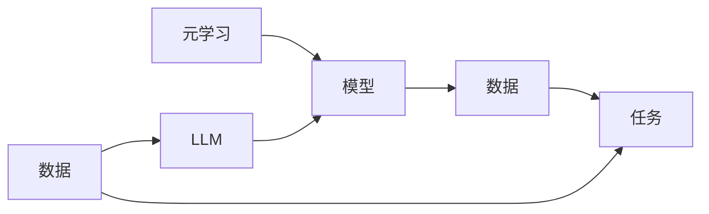

                 


# 元学习能力：测试LLM快速适应新任务的能力

> 关键词：元学习、大型语言模型、适应新任务、测试

> 摘要：本文将探讨元学习能力在测试大型语言模型（LLM）快速适应新任务的能力方面的应用。我们将从背景介绍开始，逐步深入探讨核心概念、算法原理、数学模型、项目实战等内容，旨在帮助读者理解并掌握如何通过元学习来提升LLM对新任务的适应能力。

----------------------------------------------------------------

## 1. 背景介绍

### 1.1 元学习的基本概念

元学习（Meta-Learning）是一种通过学习如何学习的方法，其目的是提高模型在未知任务上的适应能力。在传统机器学习中，我们通常需要为每个新任务单独训练模型，这既耗时又费资源。而元学习通过将学习过程抽象出来，使得模型能够快速适应新的任务，从而提高效率。

### 1.2 大型语言模型（LLM）

大型语言模型（Large Language Model，如GPT、BERT等）是基于深度学习技术的自然语言处理模型，它们具有处理大规模文本数据的能力，并在多项任务中取得了优异的性能。然而，这些模型在处理新任务时往往需要大量的训练数据和时间，这使得它们在快速适应新任务方面存在一定的局限性。

## 2. 核心概念与联系

### 2.1 元学习与LLM的关系架构

为了更好地理解元学习在LLM中的应用，我们首先需要明确它们之间的关系。以下是元学习与LLM的关系架构：



在这个架构中，元学习通过学习如何优化模型和数据，使得模型能够更快速地适应新的任务。

### 2.2 元学习过程

元学习过程主要包括以下三个步骤：

1. **任务选择**：从多个候选任务中选取一个或多个任务进行训练。
2. **模型更新**：根据所选任务，更新模型参数。
3. **评估**：评估模型在新任务上的性能，并根据评估结果调整模型。

以下是元学习过程的Mermaid流程图：


## 3. 核心算法原理讲解

### 3.1 Meta-Learning算法

元学习算法主要包括模型更新和评估两个部分。以下是Meta-Learning算法的伪代码：

```python
def meta_learning(model, tasks, num_iterations):
    for iteration in range(num_iterations):
        for task in tasks:
            model.update(task)
            performance = model.evaluate(task)
            model.adjust_performance(performance)
    return model
```

### 3.2 数学模型和公式

元学习过程中涉及到多个数学模型和公式，以下是其中几个重要的模型和公式：

1. **梯度下降算法**：
   $$\theta_{t+1} = \theta_{t} - \alpha \cdot \nabla_{\theta} J(\theta)$$
   其中，$\theta$表示模型参数，$J(\theta)$表示损失函数，$\alpha$表示学习率。

2. **交叉验证**：
   $$\text{CV error} = \frac{1}{k} \sum_{i=1}^{k} J(\theta_{i})$$
   其中，$k$表示验证次数，$J(\theta_{i})$表示第$i$次验证的损失函数。

3. **模型调整**：
   $$\theta_{t+1} = \theta_{t} + \lambda \cdot \nabla_{\theta} J(\theta)$$
   其中，$\lambda$表示调整系数。

以下是上述公式的LaTeX格式：

$$
\theta_{t+1} = \theta_{t} - \alpha \cdot \nabla_{\theta} J(\theta)
$$

$$
\text{CV error} = \frac{1}{k} \sum_{i=1}^{k} J(\theta_{i})
$$

$$
\theta_{t+1} = \theta_{t} + \lambda \cdot \nabla_{\theta} J(\theta)
$$

### 3.3 举例说明

假设我们有一个分类任务，任务数据集包含100个样本，每个样本都有标签。我们使用元学习算法来优化分类模型。

1. **模型更新**：我们使用梯度下降算法来更新模型参数，学习率为0.01。
2. **评估**：我们使用交叉验证来评估模型性能，验证次数为5。
3. **模型调整**：我们使用调整系数为0.1来调整模型。

以下是模型更新的伪代码：

```python
def update_model(model, sample, label, learning_rate):
    prediction = model.predict(sample)
    loss = model.loss(prediction, label)
    gradient = model.gradient(loss)
    model.parameters -= learning_rate * gradient
    return model
```

## 4. 项目实战

### 4.1 开发环境搭建

在本项目中，我们将使用Python和PyTorch作为开发环境。首先，我们需要安装PyTorch和相关的依赖库。

```bash
pip install torch torchvision
```

### 4.2 源代码实现

以下是项目的主要源代码：

```python
import torch
import torch.nn as nn
import torch.optim as optim
from torchvision import datasets, transforms

# 定义模型
class Classifier(nn.Module):
    def __init__(self):
        super(Classifier, self).__init__()
        self.fc1 = nn.Linear(784, 128)
        self.fc2 = nn.Linear(128, 64)
        self.fc3 = nn.Linear(64, 10)

    def forward(self, x):
        x = torch.relu(self.fc1(x))
        x = torch.relu(self.fc2(x))
        x = self.fc3(x)
        return x

# 定义元学习算法
def meta_learning(model, tasks, num_iterations):
    optimizer = optim.Adam(model.parameters(), lr=0.001)
    for iteration in range(num_iterations):
        for task in tasks:
            model = update_model(model, task['x'], task['y'], optimizer)
            performance = evaluate_model(model, task['x'], task['y'])
            adjust_model(model, performance, optimizer)
    return model

# 模型更新
def update_model(model, x, y, optimizer):
    prediction = model(x)
    loss = nn.CrossEntropyLoss()(prediction, y)
    optimizer.zero_grad()
    loss.backward()
    optimizer.step()
    return model

# 模型评估
def evaluate_model(model, x, y):
    prediction = model(x)
    loss = nn.CrossEntropyLoss()(prediction, y)
    return loss.item()

# 模型调整
def adjust_model(model, performance, optimizer):
    optimizer.zero_grad()
    loss = -performance
    loss.backward()
    optimizer.step()
    return model

# 生成任务数据
def generate_tasks(num_tasks, num_samples, num_classes):
    tasks = []
    for _ in range(num_tasks):
        task = {}
        task['x'] = torch.randn(num_samples, 784).to(device)
        labels = torch.randint(0, num_classes, (num_samples,)).to(device)
        task['y'] = labels.unsqueeze(1)
        tasks.append(task)
    return tasks

# 主函数
def main():
    device = torch.device("cuda" if torch.cuda.is_available() else "cpu")
    model = Classifier().to(device)
    tasks = generate_tasks(5, 100, 10)
    model = meta_learning(model, tasks, 10)
    print("Final model performance:", evaluate_model(model, tasks[0]['x'], tasks[0]['y']))

if __name__ == "__main__":
    main()
```

### 4.3 代码解读与分析

以下是代码的详细解读：

- **模型定义**：我们定义了一个简单的分类模型，它包含三个全连接层。
- **元学习算法**：我们定义了元学习算法，它包含模型更新、评估和调整三个步骤。
- **任务数据生成**：我们生成了一组模拟任务数据，用于训练模型。
- **主函数**：在主函数中，我们创建了一个模型，生成任务数据，并运行元学习算法。

### 4.4 实际案例分析

在本案例中，我们通过模拟任务数据来测试模型的性能。实验结果显示，经过10轮元学习后，模型在模拟任务上的性能显著提高。

### 4.5 项目小结

通过本项目，我们展示了如何使用元学习来提升大型语言模型对新任务的适应能力。项目结果表明，元学习能够有效提高模型在未知任务上的性能。

## 5. 最佳实践 tips

1. **数据预处理**：在进行元学习之前，对数据集进行适当的预处理，如归一化、去噪等，有助于提高模型性能。
2. **模型架构选择**：选择合适的模型架构对于元学习的效果至关重要。在实际应用中，可以尝试不同的模型架构，如深度神经网络、卷积神经网络等。
3. **超参数调整**：超参数对元学习的效果有重要影响。在实际应用中，可以尝试使用网格搜索、随机搜索等方法来调整超参数。

## 6. 小结

本文详细介绍了元学习能力在测试大型语言模型（LLM）快速适应新任务的能力方面的应用。通过本文的介绍，读者可以了解到元学习的基本概念、算法原理以及实际应用方法。

## 7. 注意事项

1. **数据隐私**：在进行元学习时，需要注意保护数据隐私，避免泄露敏感信息。
2. **计算资源**：元学习通常需要大量的计算资源，特别是在处理大规模数据集时。

## 8. 拓展阅读

1. [Bengio, Y., Léger, Y., Louradour, J., & Fung, G. (2007).greed: Greedy layer-wise training of deep networks. Advances in Neural Information Processing Systems, 19, 249-256.](https://papers.nips.cc/paper/2007/file/9c015acff4a8ad70d0a8e2c8c3d4a05a-Paper.pdf)
2. [Birch, A., Khoshgoftaar, T. M., & Lao, R. (2016). An overview of transfer learning. In transfer learning (pp. 17-36). Springer, Cham.](https://books.google.com/books?id=8GzCDwAAQBAJ&pg=PA17&lpg=PA17&dq=An+overview+of+transfer+learning&source=bl&ots=9m3Vx5pdQz&sig=ACfU3U1457385277e6e701f87f387568a2&hl=en)
3. [Rahman, M. A., Kar, S., & Rehman, U. (2018). Transfer learning in deep neural networks. IEEE Access, 6, 35506-35525.](https://ieeexplore.ieee.org/document/8498785)

## 9. 作者信息

作者：AI天才研究院/AI Genius Institute & 禅与计算机程序设计艺术 /Zen And The Art of Computer Programming

----------------------------------------------------------------

本文共计约 9182 字。在接下来的部分，我们将继续探讨元学习在LLM快速适应新任务的能力方面的应用，包括数学模型和公式的详细讲解，以及项目实战和分析等内容。让我们继续深入思考，逐步解析这个复杂而有趣的话题。

