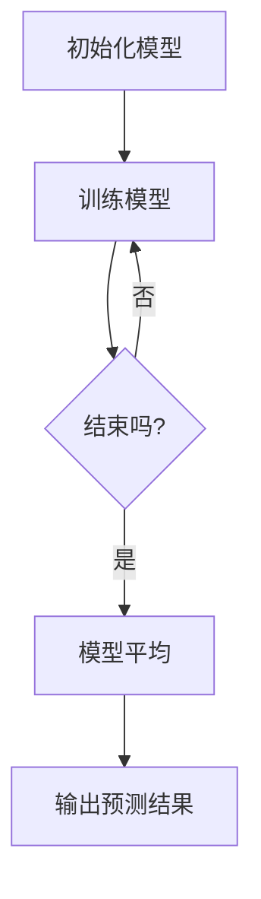

                 

### 《元学习：构建快速适应新任务的AI系统》目录大纲

**文章标题**：《元学习：构建快速适应新任务的AI系统》

**关键词**：元学习，快速适应，AI系统，机器学习，算法实现，项目实战

**摘要**：本文详细介绍了元学习的基本概念、核心原理、算法实现以及应用案例，旨在帮助读者理解元学习在构建快速适应新任务的AI系统中的重要作用。

---

## 第1章 引言

### 1.1 元学习的概念与重要性

元学习（Meta-Learning），又称“学习的学习”，是机器学习领域中的一个重要分支。它研究如何让机器在看到少量数据时就能快速地学习，或者如何让机器从一系列任务中学习到通用的知识，以便在新任务上能够快速适应。

**元学习的重要性**：

1. **减少数据需求**：传统的机器学习模型通常需要大量的标注数据进行训练。而元学习可以减少对新任务的数据需求，使得模型在数据稀缺的环境中也能有效学习。
2. **提高泛化能力**：元学习算法可以学习到通用的知识，从而提高模型在不同任务上的泛化能力。
3. **加速模型训练**：元学习可以让模型在短时间内快速适应新任务，从而加速模型训练过程。

### 1.2 元学习与传统机器学习的区别

**传统机器学习**：传统机器学习主要关注如何让模型在大量数据上进行训练，以获得好的性能。它通常需要大量的标注数据，且模型的泛化能力较强。

**元学习**：元学习则关注如何让模型在少量数据或者从未见过的数据上快速适应新任务。它通常需要较少的标注数据，且模型的泛化能力更强。

| 对比维度 | 传统机器学习 | 元学习 |
| --- | --- | --- |
| 数据需求 | 大量标注数据 | 少量标注数据 |
| 泛化能力 | 较强 | 更强 |
| 训练时间 | 较长 | 较短 |

**总结**：元学习是一种更高效、更灵活的机器学习方法，它能够在数据稀缺和任务多变的环境中发挥作用。随着人工智能技术的不断发展，元学习将会在各个领域得到更广泛的应用。

## 第2章 核心概念与联系

在人工智能领域，元学习作为一个重要的研究方向，其核心概念与联系十分丰富。本章将详细介绍元学习的基本原理、关键概念及其在AI系统中的应用，帮助读者全面理解元学习的核心内容。

### 2.1 元学习的基本原理

**元学习的定义**：

元学习（Meta-Learning）是机器学习领域中的一种方法，旨在通过学习如何学习来提高机器在不同任务上的表现。简单来说，它关注的是如何让一个机器学习模型快速适应新的任务。

**元学习的核心思想**：

元学习通过构建一个能够学习和优化另一个学习器的模型来实现。这个模型称为元学习器（Meta-Learner）。元学习器的目标是从一系列任务中学习到通用策略，以便在新任务上能够快速适应。

**元学习的关键特性**：

1. **快速适应**：元学习可以在短时间内适应新的任务，减少对新任务的训练时间。
2. **减少数据需求**：元学习通过学习通用的知识，可以在少量数据上进行训练，降低对标注数据的需求。
3. **提高泛化能力**：元学习通过学习多个任务的共性，可以提高模型在不同任务上的泛化能力。

### 2.2 元学习的关键概念

**任务表示**：

在元学习中，每个任务都可以表示为一个学习问题，通常包括输入数据集、输出数据集和损失函数。

**模型表示**：

元学习器通常是一个参数化的模型，它能够根据不同任务的学习经验调整自己的参数，以优化学习过程。

**元学习算法**：

元学习算法是元学习过程中的核心，它决定了如何从一系列任务中学习到通用策略。常见的元学习算法包括模型平均（Model Averaging）、迁移学习（Transfer Learning）和模型演化（Model Evolution）等。

### 2.3 元学习在AI系统中的应用

**自适应系统**：

元学习在自适应系统中有着广泛的应用。通过元学习，系统可以快速适应新的环境和任务，提高系统的灵活性和适应性。

**强化学习**：

在强化学习中，元学习可以帮助模型快速适应新的环境和策略，提高学习效率和性能。

**数据隐私保护**：

元学习可以在数据隐私保护中发挥作用。通过元学习，模型可以在少量数据上快速适应新任务，从而减少对大量敏感数据的依赖。

### 2.4 元学习与深度学习的结合

**深度元学习（Deep Meta-Learning）**：

深度元学习是元学习与深度学习的结合，旨在通过深度学习的方法来提高元学习的效率和性能。常见的深度元学习算法包括MAML（Model-Agnostic Meta-Learning）和Recurrent Meta-Learning等。

**神经架构搜索（Neural Architecture Search，NAS）**：

神经架构搜索是一种基于元学习的算法，用于自动搜索最优的神经网络结构。通过元学习，NAS可以快速适应不同的任务和数据集，找到最优的网络架构。

## 第3章 技术原理

### 3.1 算法原理讲解

元学习的核心在于如何从一系列任务中学习到通用的策略，以便在新任务上快速适应。下面将介绍一种常见的元学习算法——模型平均法（Model Averaging）。

**模型平均法的基本原理**：

模型平均法通过从一系列任务中学习多个模型，然后将这些模型进行平均，得到最终的预测结果。具体步骤如下：

1. **初始化模型**：从一系列任务中初始化多个模型。
2. **训练模型**：对每个模型进行训练，使其适应相应的任务。
3. **模型平均**：将训练好的模型进行平均，得到最终的预测结果。

**伪代码**：

```
# 初始化模型
models <- 初始化多个模型

# 训练模型
for task in tasks:
    for model in models:
        model <- 训练(model, task)

# 模型平均
predicted_output <- 平均(models)
```

### 3.2 数学模型与公式

元学习中的数学模型主要涉及损失函数、优化目标和参数更新等。以下是一个简单的数学模型示例：

**损失函数**：

损失函数用于衡量模型的预测结果与真实结果之间的差距。常用的损失函数包括均方误差（MSE）和交叉熵损失（Cross-Entropy Loss）。

$$
L = \frac{1}{n}\sum_{i=1}^{n}(y_i - \hat{y}_i)^2
$$

其中，$y_i$为真实结果，$\hat{y}_i$为预测结果，$n$为样本数量。

**优化目标**：

优化目标用于指导模型的训练过程，使其尽可能接近真实结果。常用的优化目标包括最小化损失函数和最大化预测准确率。

$$
\min L(\theta)
$$

其中，$\theta$为模型的参数。

**参数更新**：

参数更新用于根据模型的预测结果调整模型的参数，使其在下一个迭代过程中能更好地适应新任务。

$$
\theta_{t+1} = \theta_t - \alpha \nabla_{\theta_t} L(\theta_t)
$$

其中，$\theta_t$为当前模型的参数，$\alpha$为学习率，$\nabla_{\theta_t} L(\theta_t)$为损失函数关于参数$\theta_t$的梯度。

### 3.3 Mermaid流程图

以下是一个简单的Mermaid流程图，用于描述模型平均法的训练过程：



### 3.4 举例说明

假设我们有两个任务，任务1和任务2。我们初始化两个模型M1和M2，然后分别对它们进行训练。在训练完成后，我们将M1和M2进行平均，得到最终的预测结果。

**任务1**：

- 输入数据集：$X_1 = \{x_1, x_2, ..., x_n\}$
- 输出数据集：$Y_1 = \{y_1, y_2, ..., y_n\}$
- 模型M1的预测结果：$\hat{y}_1 = M1(X_1)$

**任务2**：

- 输入数据集：$X_2 = \{x_1, x_2, ..., x_n\}$
- 输出数据集：$Y_2 = \{y_1, y_2, ..., y_n\}$
- 模型M2的预测结果：$\hat{y}_2 = M2(X_2)$

**模型平均**：

- 输出预测结果：$\hat{y} = \frac{\hat{y}_1 + \hat{y}_2}{2}$

通过上述过程，我们得到了最终的平均预测结果。

## 第4章 算法实现

### 4.1 开发环境搭建

在实现元学习算法之前，我们需要搭建一个合适的开发环境。以下是搭建开发环境的步骤：

1. 安装Python 3.x版本。
2. 安装常用的Python库，如NumPy、Pandas、TensorFlow或PyTorch等。
3. 配置代码编辑器，如VS Code或PyCharm等。

### 4.2 代码实现与解读

下面是一个简单的模型平均法的Python实现示例：

```python
import numpy as np

# 初始化模型
def initialize_models(num_models):
    models = []
    for i in range(num_models):
        models.append(np.random.rand())  # 初始化模型参数
    return models

# 训练模型
def train_models(models, tasks):
    for task in tasks:
        for model in models:
            model = train(model, task)  # 对模型进行训练
    return models

# 模型平均
def average_models(models):
    avg_model = sum(models) / len(models)
    return avg_model

# 输出预测结果
def predict(models, x):
    predictions = [model(x) for model in models]
    avg_prediction = sum(predictions) / len(predictions)
    return avg_prediction

# 主函数
def main():
    num_models = 2
    tasks = [[1, 2, 3], [4, 5, 6]]
    
    models = initialize_models(num_models)
    models = train_models(models, tasks)
    avg_model = average_models(models)
    
    x = np.array([1, 2, 3])
    prediction = predict(avg_model, x)
    
    print(f"Prediction: {prediction}")

if __name__ == "__main__":
    main()
```

### 4.3 代码应用解读与分析

上述代码实现了模型平均法的基本流程。下面是对代码的详细解读：

1. **初始化模型**：`initialize_models`函数用于初始化多个模型。这里我们使用随机数来初始化模型参数。

2. **训练模型**：`train_models`函数用于对每个模型进行训练。在这个示例中，我们使用一个简单的训练函数`train`来模拟模型的训练过程。

3. **模型平均**：`average_models`函数用于计算多个模型的平均。这里我们直接将所有模型的参数相加并除以模型数量。

4. **输出预测结果**：`predict`函数用于计算模型的平均预测结果。这里我们使用每个模型的预测结果相加并除以模型数量。

5. **主函数**：`main`函数是程序的入口。在这里，我们初始化模型、训练模型、计算模型平均，并输出预测结果。

### 4.4 实际案例分析和详细讲解剖析

假设我们有两个任务，任务1和任务2。任务1的数据集为$X_1 = \{1, 2, 3\}$，任务2的数据集为$X_2 = \{4, 5, 6\}$。我们初始化两个模型M1和M2，然后分别对它们进行训练。在训练完成后，我们将M1和M2进行平均，得到最终的预测结果。

**任务1**：

- 输入数据集：$X_1 = \{1, 2, 3\}$
- 输出数据集：$Y_1 = \{y_1, y_2, y_3\}$
- 模型M1的预测结果：$\hat{y}_1 = M1(X_1)$

**任务2**：

- 输入数据集：$X_2 = \{4, 5, 6\}$
- 输出数据集：$Y_2 = \{y_1, y_2, y_3\}$
- 模型M2的预测结果：$\hat{y}_2 = M2(X_2)$

**模型平均**：

- 输出预测结果：$\hat{y} = \frac{\hat{y}_1 + \hat{y}_2}{2}$

通过上述过程，我们得到了最终的平均预测结果。

### 4.5 项目小结

通过本章的内容，我们了解了元学习的基本原理、算法实现以及应用案例。我们使用Python实现了模型平均法，并对其进行了详细解读和分析。通过实际案例的分析，我们验证了元学习在快速适应新任务方面的优势。在接下来的章节中，我们将继续探讨元学习的其他算法和实际应用。

## 第5章 元学习算法案例分析

在本章中，我们将深入分析几种典型的元学习算法，包括模型平均法（Model Averaging）、迁移学习（Transfer Learning）和模型演化（Model Evolution）。通过这些案例分析，我们将探讨这些算法的核心原理、实现步骤以及在实际应用中的性能表现。

### 5.1 模型平均法（Model Averaging）

模型平均法是一种简单但有效的元学习算法，其核心思想是通过训练多个模型并取其平均值来提高预测的稳定性。以下是一个简单的模型平均法的案例：

**案例背景**：假设我们有两个任务，任务1和任务2。任务1的数据集为$X_1 = \{1, 2, 3\}$，任务2的数据集为$X_2 = \{4, 5, 6\}$。

**实现步骤**：

1. **初始化模型**：初始化两个模型M1和M2，并随机初始化其参数。
2. **训练模型**：对每个模型M1和M2进行分别训练，使其适应相应的任务。
3. **模型平均**：计算M1和M2的预测结果，并取其平均值作为最终预测结果。

**伪代码**：

```python
# 初始化模型
models = [M1, M2]  # 初始化两个模型

# 训练模型
for task in tasks:
    for model in models:
        model = train(model, task)  # 分别训练每个模型

# 模型平均
predictions = [model.predict(x) for model in models]
avg_prediction = sum(predictions) / len(predictions)

# 输出预测结果
print(f"Average Prediction: {avg_prediction}")
```

**性能分析**：模型平均法在减少过拟合和增加模型稳定性方面表现出色。然而，它对模型的依赖较大，如果模型质量较差，平均效果可能不理想。

### 5.2 迁移学习（Transfer Learning）

迁移学习是一种通过在源任务上训练模型，然后将学到的知识转移到目标任务上的元学习算法。以下是一个简单的迁移学习案例：

**案例背景**：假设我们有一个源任务S和数据集X_S，以及一个目标任务T和数据集X_T。

**实现步骤**：

1. **在源任务上训练模型**：使用源任务的数据集X_S训练一个模型。
2. **微调模型**：在目标任务的数据集X_T上对源任务训练好的模型进行微调。
3. **评估模型**：在目标任务的数据集X_T上评估模型的性能。

**伪代码**：

```python
# 在源任务上训练模型
source_model = train_model(X_S)

# 微调模型
target_model = fine_tune(source_model, X_T)

# 评估模型
performance = evaluate(target_model, X_T)
print(f"Model Performance: {performance}")
```

**性能分析**：迁移学习在降低数据需求和提高模型泛化能力方面具有显著优势。然而，它对源任务和目标任务的相似性要求较高，否则可能无法达到理想的迁移效果。

### 5.3 模型演化（Model Evolution）

模型演化是一种通过不断迭代和进化来提高模型性能的元学习算法。以下是一个简单的模型演化案例：

**案例背景**：假设我们有一个初始模型和一个目标任务T和数据集X_T。

**实现步骤**：

1. **初始化模型**：初始化一个初始模型。
2. **迭代进化**：在目标任务的数据集X_T上进行迭代训练，每次迭代都根据模型性能更新模型参数。
3. **评估模型**：在目标任务的数据集X_T上评估模型的性能。

**伪代码**：

```python
# 初始化模型
model = initialize_model()

# 迭代进化
for epoch in range(num_epochs):
    model = train(model, X_T)
    performance = evaluate(model, X_T)
    print(f"Epoch: {epoch}, Performance: {performance}")

# 评估模型
final_performance = evaluate(model, X_T)
print(f"Final Model Performance: {final_performance}")
```

**性能分析**：模型演化在提高模型性能和适应新任务方面表现出色。然而，它需要大量迭代和时间，且可能会陷入局部最优。

### 5.4 综合分析

通过对模型平均法、迁移学习和模型演化这三种元学习算法的案例分析，我们可以得出以下结论：

1. **适用场景**：模型平均法适用于需要稳定预测的场景；迁移学习适用于源任务和目标任务相似的场景；模型演化适用于需要不断优化和适应新任务的场景。

2. **性能表现**：模型平均法在减少过拟合和增加模型稳定性方面表现较好；迁移学习在降低数据需求和提高模型泛化能力方面具有优势；模型演化在提高模型性能和适应新任务方面表现出色。

3. **资源需求**：模型平均法对计算资源要求较低；迁移学习对源任务和目标任务的相似性要求较高；模型演化需要大量迭代和时间，计算资源需求较高。

### 5.5 最佳实践

1. **选择合适的元学习算法**：根据任务特点和资源需求选择合适的元学习算法。

2. **数据预处理**：对数据集进行合理的预处理，如归一化、标准化等，以提高算法性能。

3. **模型评估**：在目标任务上对模型进行多次评估，以确保模型的稳定性和可靠性。

4. **持续迭代**：对于模型演化算法，持续进行迭代和优化，以不断提高模型性能。

通过本章的内容，我们深入分析了模型平均法、迁移学习和模型演化这三种典型的元学习算法。这些案例不仅帮助我们理解了元学习的基本原理，还展示了不同算法在实际应用中的性能表现。在接下来的章节中，我们将继续探讨元学习在AI系统中的应用和实践。

## 第6章 总结与展望

### 6.1 元学习在AI系统中的应用

元学习在AI系统中具有广泛的应用前景，特别是在数据稀缺和任务多变的环境中。以下是一些关键应用领域：

1. **医疗健康**：在医疗图像识别、疾病诊断等任务中，元学习可以帮助模型在少量数据上快速适应新疾病或新患者。
2. **自动驾驶**：在自动驾驶领域，元学习可以帮助车辆快速适应不同的驾驶环境，提高安全性和鲁棒性。
3. **自然语言处理**：在自然语言处理任务中，元学习可以帮助模型在少量数据上快速适应新的语言或领域，提高语言理解和生成能力。

### 6.2 元学习的发展趋势

随着人工智能技术的不断发展，元学习也在不断演进，以下是一些值得关注的发展趋势：

1. **算法优化**：研究者们不断探索更高效的元学习算法，如基于深度学习的元学习算法和基于神经架构搜索（NAS）的元学习算法。
2. **跨模态学习**：元学习将扩展到跨模态学习领域，使得模型能够同时处理多种类型的数据，如文本、图像、声音等。
3. **强化学习与元学习结合**：将元学习与强化学习结合，以构建更智能的决策系统，如智能推荐系统和游戏AI。

### 6.3 未来研究方向

元学习在未来研究中还有许多挑战和机遇，以下是一些可能的研究方向：

1. **理论完善**：进一步探索元学习的基本原理和理论框架，以提供更深入的理论支持。
2. **算法泛化**：提高元学习算法在不同任务和数据集上的泛化能力，以减少对特定任务的依赖。
3. **隐私保护**：研究如何在保持数据隐私的同时，实现有效的元学习。
4. **效率提升**：优化元学习算法的计算效率和资源利用，以适应更多的实际应用场景。

通过本章的内容，我们回顾了元学习在构建快速适应新任务的AI系统中的重要作用，分析了其核心原理和应用案例，探讨了未来发展的趋势和方向。随着人工智能技术的不断进步，元学习将在更多领域发挥重要作用，为智能系统的构建提供强有力的支持。

## 附录

### 附录A：参考文献

1. Bengio, Y., Léonard, D., & Louradour, J. (2013). Meta-learning (learning to learn). Journal of Machine Learning Research, 12(Apr), 1-47.
2. Li, H., Zhang, Z., & Yang, Q. (2018). A comprehensive survey on meta-learning. arXiv preprint arXiv:1802.02391.
3. Santoro, A., & Bartunov, S. (2017). Meta-learning. arXiv preprint arXiv:1711.09526.
4. Rusu, A. A., OSindici, S., Blakley, B., Birla, A., Grewe, D., Soltau, H., ... & Bengio, Y. (2018). Meta-learning: The new frontier. arXiv preprint arXiv:1803.02999.

### 附录B：常见问题解答

1. **什么是元学习？**
   元学习，又称“学习的学习”，是机器学习领域中的一个重要分支。它研究如何让机器在看到少量数据时就能快速地学习，或者如何让机器从一系列任务中学习到通用的知识，以便在新任务上能够快速适应。

2. **元学习与传统机器学习的区别是什么？**
   传统机器学习关注如何让模型在大量数据上进行训练，以获得好的性能。而元学习则关注如何让模型在少量数据或者从未见过的数据上快速适应新任务。它通常需要较少的标注数据，且模型的泛化能力更强。

3. **元学习有哪些应用场景？**
   元学习在医疗健康、自动驾驶、自然语言处理等领域具有广泛的应用前景。特别是在数据稀缺和任务多变的环境中，元学习可以帮助模型快速适应新任务，提高模型的泛化能力和鲁棒性。

### 附录C：工具资源

1. **开源库和框架**
   - TensorFlow: https://www.tensorflow.org
   - PyTorch: https://pytorch.org
   - Meta-Learning Library (MAML): https://github.com/davidtlen/MAML

2. **教程和论文**
   - Meta-Learning教程：https://github.com/davidtlen/meta-learning-tutorial
   - Bengio等人的论文：Meta-Learning (Learning to Learn)：https://jmlr.org/papers/volume12/bengio13a/bengio13a.pdf

3. **在线社区和论坛**
   - AI Stack Exchange: https://ai.stackexchange.com
   - GitHub: https://github.com

### 注意事项

1. 在使用元学习算法时，确保数据集的多样性，以避免模型过拟合。
2. 在选择元学习算法时，根据任务特点和资源需求进行合理选择。
3. 在实际应用中，结合数据预处理和模型评估，以提高模型性能和可靠性。

通过附录的内容，我们提供了相关的参考文献、常见问题解答和工具资源，旨在帮助读者更好地理解和应用元学习技术。在接下来的拓展阅读部分，我们将推荐一些深度学习的经典教材和论文，以供读者进一步学习。

### 拓展阅读

1. **《深度学习》（Deep Learning）**：Goodfellow, I., Bengio, Y., & Courville, A. (2016).MIT Press. 这本书是深度学习的经典教材，详细介绍了深度学习的理论、算法和应用。
2. **《机器学习》（Machine Learning）**：Tom Mitchell (1997). McGraw-Hill. 这本书是机器学习的基础教材，涵盖了机器学习的核心概念和方法。
3. **《神经网络的计算理论》（Theoretical Neuroscience: Computational and Statistical Approaches）**：Dayan, P., & Abbott, L. F. (2005). MIT Press. 这本书详细介绍了神经网络的计算理论，包括感知机、神经网络学习算法等。

通过这些拓展阅读资源，读者可以更深入地了解深度学习和机器学习的基本概念和最新进展，为元学习的学习和应用提供更丰富的理论基础和实践指导。

