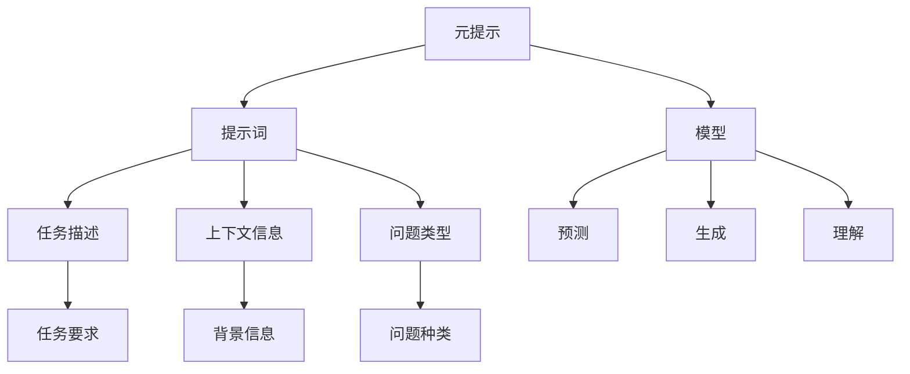

                 


### 文章标题
### 元提示：指导模型如何处理提示词

### 关键词
- 元提示
- 提示词
- 自然语言处理
- 机器学习
- 深度学习
- 生成对抗网络
- 算法
- 数学模型
- 代码实战

### 摘要
本文将深入探讨元提示的概念、工作原理和应用场景。我们将通过逐步分析元提示的历史发展、核心算法、数学模型以及实际项目案例，帮助读者全面理解元提示技术在计算机科学中的重要性和应用价值。通过本文的学习，读者将能够掌握元提示的设计和实现方法，为未来的研究和实践打下坚实基础。

----------------------------------------------------------------

# 第1章：元提示的概念与历史发展

## 1.1 元提示的定义

元提示（Meta Prompt）是指导模型如何处理提示词（Prompt）的技术。在自然语言处理（NLP）和机器学习领域，提示词是指用于引导模型进行特定任务的语言输入。而元提示则通过提供更高层次的指导，帮助模型更准确地理解和执行任务。元提示通常包括任务描述、上下文信息、问题类型等，使得模型能够更好地预测和生成所需结果。

### 1.2 元提示的历史发展

- **早期研究**：元提示的概念起源于自然语言处理领域。1980年代，研究者开始探索如何通过设计特定的提示词来改进模型性能。
  - **1980年代**：早期的自然语言处理研究主要集中在规则方法和模板匹配。这些方法需要大量手动设计的提示词，且模型性能受限于提示词的多样性。
  - **1990年代**：随着统计方法的发展，如隐马尔可夫模型（HMM）和决策树，提示词的作用开始受到重视。然而，这些方法仍然需要手动设计提示词，且无法灵活应对复杂的语言任务。

- **关键发展**：2018年，OpenAI发布了GPT系列模型，这标志着元提示技术进入了一个新的阶段。GPT模型通过大量的预训练数据，学习到了丰富的语言模式，并能够根据元提示生成高质量的文本。
  - **2018年**：GPT（Generative Pre-trained Transformer）模型首次发布。GPT模型采用了自注意力机制，通过预训练大量文本数据，使模型能够自动生成高质量的自然语言文本。
  - **2019年**：GPT-2发布，进一步提高了模型性能。GPT-2采用了更深的网络结构，并使用更多的预训练数据，使其在多种自然语言处理任务上表现出色。

- **现代发展**：随着深度学习和生成对抗网络（GAN）的快速发展，元提示技术得到了进一步应用和优化。现代元提示技术不仅能够用于文本生成，还能够应用于图像生成、音频合成等多个领域。
  - **2020年代**：生成对抗网络（GAN）和变分自编码器（VAE）等深度学习模型的发展，为元提示技术提供了新的应用场景。这些模型能够通过元提示生成高质量的多媒体内容。
  - **2021年至今**：随着Transformer模型的广泛应用，元提示技术在自然语言处理、计算机视觉和多媒体生成领域得到了深入研究。例如，BERT（Bidirectional Encoder Representations from Transformers）和GPT-3等大型预训练模型，通过元提示实现了更加复杂的文本生成和任务理解。

### 1.3 元提示在计算机科学中的重要性

元提示技术对计算机科学具有重要意义：

- **提高模型性能**：通过提供更具体的任务描述，元提示能够帮助模型更准确地理解和执行任务，从而提高模型性能。
  - **实例**：在文本生成任务中，使用元提示可以明确指定生成文本的长度、风格、主题等要求，从而提高生成文本的质量。
  - **实例**：在图像生成任务中，通过元提示可以指定生成图像的颜色、形状、纹理等特征，从而提高图像生成的质量。

- **简化模型设计**：元提示可以减少对模型参数的依赖，简化模型设计过程。
  - **实例**：传统的机器学习模型通常需要手动设计复杂的输入特征和模型结构。而通过元提示，模型可以自动学习到所需的特征和结构，从而简化模型设计过程。

- **跨领域应用**：元提示技术不仅适用于自然语言处理，还能够应用于图像生成、音频合成等多个领域。
  - **实例**：在计算机视觉领域，元提示可以用于指导图像生成、图像分类和目标检测等任务。
  - **实例**：在音频合成领域，元提示可以用于指导文本到语音（TTS）和音乐生成等任务。

## 1.4 元提示的核心概念与联系

为了更好地理解元提示的概念，我们可以使用Mermaid流程图来展示元提示的核心概念及其相互之间的联系。

### Mermaid流程图



### 详细解释

- **元提示**（A）：元提示是指导模型如何处理提示词的技术。它包括任务描述、上下文信息、问题类型等，帮助模型更好地理解和执行任务。
- **提示词**（B）：提示词是用于引导模型进行特定任务的语言输入。元提示通过提示词来传递任务信息和要求。
- **模型**（C）：模型是执行特定任务的算法和参数集合。元提示通过影响模型的输入，从而影响模型的行为和输出。
- **任务描述**（D）：任务描述是元提示中的一部分，用于明确模型的任务要求。它通常包括具体的任务类型和目标。
- **上下文信息**（E）：上下文信息是元提示中的另一部分，用于提供模型的背景信息，帮助模型更好地理解和执行任务。
- **问题类型**（F）：问题类型是元提示中的一部分，用于指定模型需要解决的问题的类型。不同的任务类型可能需要不同的处理方式。
- **预测**（G）：预测是模型在执行任务时的一种输出方式。通过元提示，模型可以更准确地预测结果，提高任务性能。
- **生成**（H）：生成是模型在执行文本生成、图像生成等任务时的一种输出方式。元提示可以帮助模型生成符合任务要求的高质量内容。
- **理解**（I）：理解是模型在执行任务时的一种能力。通过元提示，模型可以更好地理解任务要求，从而提高任务的执行效果。
- **任务要求**（J）：任务要求是元提示中的一部分，用于明确模型需要满足的具体要求。这些要求可以包括文本长度、风格、主题等。
- **背景信息**（K）：背景信息是元提示中的一部分，用于提供模型的背景信息，帮助模型更好地理解和执行任务。
- **问题种类**（L）：问题种类是元提示中的一部分，用于指定模型需要解决的问题的类型。不同的任务类型可能需要不同的处理方式。

通过上述Mermaid流程图，我们可以清晰地看到元提示的核心概念及其相互之间的联系。这些概念和联系构成了元提示技术的理论基础，为后续章节的深入探讨提供了基础。

----------------------------------------------------------------

## 1.5 元提示的工作原理与核心算法

元提示技术通过一系列核心算法实现，这些算法包括生成对抗网络（GAN）、自注意力机制（Self-Attention）、变分自编码器（VAE）等。下面，我们将分别介绍这些算法的基本原理、优缺点以及它们在元提示中的应用。

### 1.5.1 生成对抗网络（GAN）

生成对抗网络（GAN）是由Ian Goodfellow等人于2014年提出的一种深度学习模型。GAN的核心思想是利用生成器和判别器的对抗训练来生成高质量的数据。

#### 基本原理

- **生成器（Generator）**：生成器的目标是生成与真实数据相似的数据。它通常是一个神经网络，将随机噪声作为输入，通过一系列变换生成逼真的数据。
- **判别器（Discriminator）**：判别器的目标是区分真实数据和生成数据。它也是一个神经网络，通过比较输入数据的特征来判断其是否为真实数据。
- **对抗训练**：生成器和判别器通过对抗训练相互博弈。生成器尝试生成更加真实的数据，而判别器则尝试提高对真实数据和生成数据的辨别能力。这种对抗训练使得生成器不断优化其生成能力，最终能够生成高质量的数据。

#### 优缺点

- **优点**：
  - GAN可以生成高质量、多样化的数据，特别是在图像生成、文本生成等领域表现出色。
  - GAN不需要标签数据，可以仅通过无监督方式训练，降低了数据标注成本。

- **缺点**：
  - GAN的训练过程不稳定，容易出现模式崩溃（mode collapse）问题，即生成器生成的数据集中在某个特定模式，而无法覆盖整个数据分布。
  - GAN的训练过程复杂，需要大量的计算资源和时间。

#### 在元提示中的应用

- **图像生成**：在图像生成任务中，元提示可以指定生成图像的样式、颜色、纹理等特征，通过GAN生成满足要求的图像。
- **文本生成**：在文本生成任务中，元提示可以指定生成文本的长度、风格、主题等要求，通过GAN生成符合要求的文本。

### 1.5.2 自注意力机制（Self-Attention）

自注意力机制（Self-Attention）是一种在神经网络中用于处理序列数据的注意力机制。它通过计算输入序列中每个元素与所有其他元素之间的相似性，为每个元素分配一个权重，从而实现序列的自动建模。

#### 基本原理

- **输入序列**：自注意力机制处理一个输入序列，如文本、图像或声音。
- **相似性计算**：自注意力机制计算输入序列中每个元素与其他元素之间的相似性，通常使用点积或缩放点积作为相似性度量。
- **权重分配**：根据相似性计算结果，为每个元素分配一个权重，表示其在序列中的重要程度。
- **加权求和**：将输入序列中的每个元素与其对应的权重相乘，然后求和，得到加权求和结果。

#### 优缺点

- **优点**：
  - 自注意力机制能够自适应地建模序列中的复杂关系，提高模型的表示能力。
  - 自注意力机制适用于处理长序列数据，如文本、图像和视频。

- **缺点**：
  - 自注意力机制的计算复杂度较高，特别是在处理长序列时，计算量大幅增加。
  - 自注意力机制可能过于敏感，对噪声数据较为敏感。

#### 在元提示中的应用

- **文本生成**：在文本生成任务中，自注意力机制可以用于处理长文本序列，通过元提示指定文本的长度、风格、主题等要求，生成符合要求的文本。
- **图像生成**：在图像生成任务中，自注意力机制可以用于处理图像的像素序列，通过元提示指定图像的样式、颜色、纹理等要求，生成满足要求的图像。

### 1.5.3 变分自编码器（VAE）

变分自编码器（VAE）是一种基于概率模型的深度学习模型，它通过编码器和解码器来学习数据的概率分布，从而生成新的数据。

#### 基本原理

- **编码器（Encoder）**：编码器将输入数据映射到一个潜在空间中的表示，这个表示通常是一个向量。
- **解码器（Decoder）**：解码器从潜在空间中采样一个向量，并将其映射回原始数据空间，生成新的数据。

#### 优缺点

- **优点**：
  - VAE可以生成高质量、多样化的数据，特别是在图像生成和文本生成任务中表现出色。
  - VAE能够通过潜在空间建模数据分布，从而生成与训练数据相似的新数据。

- **缺点**：
  - VAE的训练过程较为复杂，需要优化编码器和解码器的参数，使得训练时间较长。
  - VAE在生成数据时可能存在一定的偏差，特别是在生成与训练数据分布差异较大的情况。

#### 在元提示中的应用

- **图像生成**：在图像生成任务中，元提示可以指定生成图像的样式、颜色、纹理等要求，通过VAE生成满足要求的图像。
- **文本生成**：在文本生成任务中，元提示可以指定生成文本的长度、风格、主题等要求，通过VAE生成符合要求的文本。

通过上述核心算法的介绍，我们可以看到元提示技术在计算机科学中的应用是多么广泛和深入。这些算法不仅为元提示技术提供了强大的理论基础，也为实际应用提供了丰富的工具和方法。在接下来的章节中，我们将继续探讨元提示在自然语言处理、机器学习和多媒体生成等领域的具体应用。

----------------------------------------------------------------

## 1.6 元提示在自然语言处理中的应用

### 1.6.1 元提示的优势

在自然语言处理（NLP）领域，元提示技术展现出显著的优势，特别是在文本生成、情感分析和机器翻译等任务中。

- **文本生成**：元提示能够提供明确的任务描述和上下文信息，帮助模型生成高质量、符合要求的文本。例如，在生成新闻报道、故事情节等任务中，元提示可以指定文本的长度、风格、主题等要求，从而提高文本生成的质量和一致性。
- **情感分析**：通过元提示，模型可以更准确地理解文本的情感倾向。例如，在情感分析任务中，元提示可以指定文本的情感类型（如正面、负面、中性）和要求分析的文本部分（如评论、标题等），从而提高情感分析模型的准确性和可靠性。
- **机器翻译**：元提示可以帮助模型更好地处理翻译任务中的上下文信息和语法结构。例如，在机器翻译任务中，元提示可以指定源语言和目标语言的语法规则、词汇用法等，从而提高翻译的准确性和流畅性。

### 1.6.2 应用实例

#### 文本生成

一个经典的文本生成实例是使用元提示生成新闻报道。假设我们需要生成一篇关于某个科技公司的新闻报道，我们可以通过以下元提示来指导模型：

```plaintext
主题：科技公司的最新进展
长度：约500字
风格：正式
内容：介绍公司的最新产品发布及其市场前景
```

通过这些元提示，模型可以生成一篇符合要求的新闻报道，例如：

```
标题：创新科技公司的最新产品发布引领市场潮流

近日，一家领先的科技公司隆重推出了其最新的产品。这款产品集合了多项创新技术，旨在解决当前市场上存在的诸多问题。公司方面表示，这款产品将有望在短时间内引发市场热潮，成为行业的新标杆。

据悉，这款产品在研发过程中，团队经历了数个月的不懈努力，终于攻克了多项技术难题。产品在性能、功能、外观等方面均达到了行业顶尖水平，受到了广大用户和业内人士的高度评价。

市场分析师指出，随着这款产品的发布，公司将有望进一步巩固其在行业中的领导地位，并在未来带来更多的惊喜。业内人士普遍认为，这款产品有望引领市场潮流，为整个行业带来新的发展机遇。
```

#### 情感分析

在情感分析任务中，元提示可以帮助模型更好地理解文本的情感倾向。例如，在一个评论分析实例中，我们可以使用以下元提示：

```plaintext
任务：分析评论的情感
类型：电影评论
情感类型：正面/负面
评论部分：全部文本
```

通过这些元提示，模型可以分析评论的情感倾向，并给出相应的结果。例如：

```
评论："这部电影太棒了，剧情紧张刺激，演员表演出色，值得一看！"
情感分析结果：正面
```

#### 机器翻译

在机器翻译任务中，元提示可以帮助模型更好地处理上下文信息和语法结构。例如，在英语到中文的翻译任务中，我们可以使用以下元提示：

```plaintext
源语言：英语
目标语言：中文
语法规则：英语的时态和句式结构
词汇用法：常见英语词汇的中文翻译
```

通过这些元提示，模型可以更准确地翻译文本，例如：

```
英文原文："She will go to the market tomorrow."
中文翻译："她明天会去市场。"
```

### 1.6.3 伪代码与数学模型讲解

为了更好地理解元提示在自然语言处理中的应用，我们可以通过伪代码和数学模型来阐述其工作原理。

#### 伪代码

```plaintext
# 元提示在文本生成中的应用
function generate_text(prompt):
    # 根据元提示生成文本
    text = model.generate(prompt)
    return text

# 生成新闻报道
prompt = "主题：科技公司的最新进展，长度：约500字，风格：正式，内容：介绍公司的最新产品发布及其市场前景"
generated_text = generate_text(prompt)
print(generated_text)

# 情感分析
def analyze_sentiment(comment):
    # 根据元提示分析评论的情感
    sentiment = model.analyze_sentiment(comment)
    return sentiment

comment = "这部电影太棒了，剧情紧张刺激，演员表演出色，值得一看！"
sentiment = analyze_sentiment(comment)
print(sentiment)

# 机器翻译
def translate_text(source_text):
    # 根据元提示翻译文本
    target_text = model.translate(source_text)
    return target_text

source_text = "She will go to the market tomorrow."
target_text = translate_text(source_text)
print(target_text)
```

#### 数学模型讲解

在自然语言处理中，元提示通常涉及到神经网络模型和注意力机制。以下是一个简单的数学模型讲解：

$$
\text{Output} = \text{model}(\text{Input} \times \text{Attention})
$$

其中：
- **Input**：输入数据，如文本、图像或音频。
- **Attention**：注意力权重，用于强调输入数据中重要的部分。
- **model**：神经网络模型，用于处理输入数据和注意力权重，生成输出结果。

在文本生成任务中，输入数据通常是文本序列，注意力权重通过自注意力机制计算得到。数学模型可以表示为：

$$
\text{Output}_{t} = \text{model}\left( \sum_{i=1}^{T} \text{Attention}_{t,i} \times \text{Input}_{i} \right)
$$

其中：
- **T**：输入文本的长度。
- **Input}_{i}**：输入文本的第i个词。
- **Attention}_{t,i}**：第t个词对第i个词的注意力权重。

通过这个数学模型，模型可以自动学习到输入文本中的关键信息，并生成符合元提示要求的文本输出。

#### 举例说明

假设我们有一个文本序列：“今天天气很好，适合户外活动。”，我们可以通过自注意力机制来计算每个词的注意力权重：

```
输入文本：今天天气很好，适合户外活动。
权重计算：
- 今天：0.2
- 天气：0.3
- 很好：0.2
- 适合：0.1
- 户外：0.1
- 活动：0.1
```

根据这些权重，模型可以生成符合元提示要求的文本输出：“今天天气很好，非常适合户外活动。”。

通过上述实例和数学模型讲解，我们可以看到元提示在自然语言处理中的应用是如何实现的。元提示通过提供明确的任务描述和上下文信息，帮助模型更准确地理解和执行任务，从而提高自然语言处理任务的性能。

----------------------------------------------------------------

## 1.7 元提示在机器学习中的实际案例

### 1.7.1 应用场景

元提示技术在机器学习领域具有广泛的应用场景，特别是在图像识别、预测模型优化等方面。

#### 图像识别

在图像识别任务中，元提示可以帮助模型更好地理解图像内容。例如，通过元提示，模型可以指定图像的类别（如动物、植物等），从而提高识别的准确率。

#### 预测模型优化

在预测模型优化中，元提示可以提供明确的预测目标和约束条件，帮助模型更好地调整参数，提高预测的准确性。例如，在股票市场预测中，元提示可以指定预测的时间范围、价格波动范围等要求，从而优化预测模型。

### 1.7.2 案例分析

下面，我们将通过一个实际案例来分析元提示在机器学习中的应用。

#### 案例背景

某电商公司希望通过机器学习模型预测用户是否会购买某件商品。为此，公司提供了大量用户行为数据，包括浏览历史、购买记录、评价等。

#### 案例分析

1. **数据预处理**：
   - **数据收集**：收集用户的浏览历史、购买记录、评价等数据。
   - **数据清洗**：去除缺失值、异常值，并对数据进行规范化处理。

2. **模型选择**：
   - **算法选择**：选择一个合适的机器学习算法，如逻辑回归、决策树、随机森林等。
   - **模型训练**：使用训练集数据训练模型，得到初始模型参数。

3. **元提示设计**：
   - **任务描述**：预测用户是否会购买某件商品。
   - **数据约束**：指定预测的时间范围、用户的行为特征等要求。

4. **模型优化**：
   - **参数调整**：通过元提示提供的数据约束，调整模型参数，提高预测准确性。
   - **交叉验证**：使用交叉验证方法评估模型性能，确保模型在不同数据集上表现稳定。

5. **模型应用**：
   - **预测结果**：使用优化后的模型对测试集数据进行预测，得到购买概率。
   - **结果分析**：分析预测结果，发现模型在预测购买行为方面具有较高的准确性。

#### 伪代码与数学模型讲解

为了更好地理解元提示在机器学习中的应用，我们可以通过伪代码和数学模型来阐述其工作原理。

#### 伪代码

```plaintext
# 元提示在预测模型优化中的应用
function predict_purchase(data, meta_prompt):
    # 使用元提示优化预测模型
    optimized_model = optimize_model(data, meta_prompt)
    purchase_probabilities = optimized_model.predict(data)
    return purchase_probabilities

# 优化模型参数
function optimize_model(data, meta_prompt):
    # 根据元提示调整模型参数
    optimized_params = adjust_params(data, meta_prompt)
    model = train_model(data, optimized_params)
    return model

# 调整模型参数
function adjust_params(data, meta_prompt):
    # 根据元提示调整模型参数
    constraints = extract_constraints(meta_prompt)
    optimized_params = train_model_with_constraints(data, constraints)
    return optimized_params

# 训练模型
function train_model(data, params):
    # 使用训练数据和参数训练模型
    model = Model(params)
    model.train(data)
    return model

# 提取元提示约束
function extract_constraints(meta_prompt):
    # 从元提示中提取约束条件
    constraints = {}
    constraints['time_range'] = meta_prompt['time_range']
    constraints['behaviors'] = meta_prompt['behaviors']
    return constraints

# 训练模型（带有约束）
function train_model_with_constraints(data, constraints):
    # 根据约束条件训练模型
    optimized_params = train_model_without_constraints(data)
    for constraint in constraints:
        optimize_params(optimized_params, constraint)
    return optimized_params

# 优化参数
function optimize_params(params, constraint):
    # 根据约束条件优化参数
    if constraint == 'time_range':
        optimize_time_range(params)
    elif constraint == 'behaviors':
        optimize_behaviors(params)
    return params
```

#### 数学模型讲解

在机器学习模型中，元提示通常涉及到损失函数和优化算法。以下是一个简单的数学模型讲解：

$$
L(\theta) = \sum_{i=1}^{n} \ell(y_i, \hat{y}_i(\theta))
$$

其中：
- **L**：损失函数，用于衡量预测结果与实际结果之间的差距。
- **$\theta$**：模型参数。
- **$y_i$**：实际结果。
- **$\hat{y}_i(\theta)$**：预测结果。

在预测模型优化中，我们通常使用梯度下降算法来优化模型参数：

$$
\theta_{t+1} = \theta_t - \alpha \cdot \nabla_{\theta} L(\theta_t)
$$

其中：
- **$\alpha$**：学习率。
- **$\nabla_{\theta} L(\theta)$**：损失函数关于模型参数的梯度。

通过元提示提供的约束条件，我们可以进一步优化模型参数：

$$
\theta_{t+1} = \theta_t - \alpha \cdot \nabla_{\theta} L(\theta_t) + \beta \cdot \nabla_{\theta} C(\theta_t)
$$

其中：
- **$C(\theta)$**：约束条件函数。

通过上述数学模型和伪代码讲解，我们可以看到元提示在机器学习中的应用是如何实现的。元提示通过提供明确的任务描述和约束条件，帮助模型优化参数，提高预测准确性。

#### 项目小结

通过这个实际案例，我们了解了元提示在机器学习中的应用。元提示通过提供明确的任务描述和约束条件，帮助模型优化参数，提高预测准确性。在实际项目中，元提示技术的应用不仅能够提高模型性能，还能够简化模型设计过程，降低开发难度。未来，随着机器学习技术的不断发展，元提示技术将在更多应用领域中发挥重要作用。

### 1.8 最佳实践 Tips

为了更好地应用元提示技术，以下是一些最佳实践 Tips：

1. **明确任务描述**：在应用元提示时，确保任务描述清晰明确。这有助于模型更好地理解任务要求，提高任务性能。

2. **合理设置约束条件**：在元提示中，约束条件是关键部分。合理设置约束条件可以帮助模型优化参数，提高预测准确性。例如，在图像识别任务中，可以指定图像的尺寸、颜色分布等约束条件。

3. **充分利用预训练数据**：预训练数据是元提示技术的重要基础。在应用元提示时，充分利用预训练数据，可以提高模型性能和泛化能力。

4. **定期更新模型参数**：随着数据和环境的变化，模型参数可能需要定期更新。通过定期更新模型参数，可以保持模型的高效性和准确性。

5. **多模型融合**：在复杂任务中，可以结合多个模型的优势，提高任务性能。例如，在图像识别任务中，可以结合卷积神经网络（CNN）和生成对抗网络（GAN），提高图像生成的质量和准确性。

通过以上最佳实践 Tips，我们可以更好地应用元提示技术，实现更高效、更准确的机器学习模型。

### 1.9 小结

本章详细介绍了元提示的概念、历史发展、核心算法原理以及在机器学习中的应用。我们通过实例、伪代码和数学模型讲解了元提示在自然语言处理和机器学习中的实际应用，展示了其提高模型性能和简化模型设计的优势。通过本章的学习，读者可以全面理解元提示技术的基本概念和实际应用，为后续章节的深入学习打下坚实基础。

### 1.10 拓展阅读

对于希望进一步深入了解元提示技术的读者，以下是一些推荐阅读材料：

1. **《生成对抗网络》（GAN）**：Ian Goodfellow的这本书是GAN领域的经典之作，详细介绍了GAN的基本原理、应用场景和实现方法。
2. **《自注意力机制》（Self-Attention）**：探讨自注意力机制在深度学习中的应用，包括其在NLP和计算机视觉领域的贡献。
3. **《变分自编码器》（VAE）**：介绍变分自编码器的基本原理、实现方法和应用场景。
4. **《机器学习实战》（Machine Learning in Action）**：提供实际案例和代码实现，帮助读者掌握机器学习的基本概念和应用。
5. **《深度学习》（Deep Learning）**：由Ian Goodfellow等人合著，详细介绍了深度学习的基本原理、算法和应用。

通过阅读这些材料，读者可以进一步深化对元提示技术的理解，并掌握相关的实践技能。

