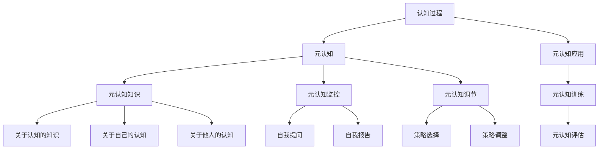

                 

### 背景介绍

元认知（Metacognition）一词源自希腊语，意为“关于认知的认知”。它最早由认知心理学家约翰·弗拉维尔（John Flavell）在1976年提出。元认知是一种高级认知过程，它允许个体在执行认知任务时对自身认知过程进行自我反思、监控和调节。传统的认知心理学主要关注知识的获取和应用，而元认知则扩展了这一领域，强调了个体对自身认知过程的主动控制。

在人类认知中，元认知扮演着重要角色。它帮助人们在面对复杂任务时做出适当的决策，提高学习效率和准确性。例如，在学习过程中，个体会通过元认知监控来评估自己的理解程度，并调整学习策略。这种自我调节能力使得个体能够更好地适应不断变化的环境。

随着计算机科学和人工智能的发展，元认知的概念逐渐被引入到机器学习中。大型语言模型（LLM）如GPT-3、ChatGLM等，已经显示出在自我学习和改进方面具备一定的元认知能力。这些模型可以通过元认知机制来理解自己的学习过程，并针对特定任务进行优化。这使得元认知成为研究LLM的重要方向之一。

### 核心概念与联系

在理解元认知的过程中，我们需要关注其三个核心组成部分：元认知知识、元认知监控和元认知调节。

1. **元认知知识**：个体对自身和外界知识的理解。它包括关于认知的知识（如不同认知任务的特点和策略）、关于自己的认知（如个体在不同任务中的认知能力和倾向）以及关于他人的认知（如他人可能采取的认知策略）。

2. **元认知监控**：个体在认知过程中对自己认知活动的持续观察和评估。这包括自我提问、自我报告等方式，用于评估自己的理解程度和认知过程。

3. **元认知调节**：根据监控结果对认知策略进行调整。这包括选择适当的认知策略、根据任务需要调整认知策略等。

这三个核心组成部分相互关联，共同构成了元认知的完整框架。元认知知识是元认知监控和调节的基础，而元认知监控和调节则是元认知知识的实际应用。

以下是元认知的概念结构Mermaid流程图：



### 核心算法原理讲解

在机器学习领域，元认知主要通过元学习（Meta-Learning）和元优化（Meta-Optimization）来实现。以下是一个简单的元学习算法的伪代码：

```python
def meta_learn(model, dataset, num_iterations):
    for iteration in range(num_iterations):
        for data in dataset:
            # 前向传播
            prediction = model.forward(data.x)
            # 计算损失
            loss = model.loss(prediction, data.y)
            # 反向传播
            model.backward(loss)
            # 更新模型参数
            model.update_params()
        # 在每个迭代后，根据模型性能调整学习率或其他超参数
        model.adjust_hyperparameters()
    return model
```

在上述伪代码中，`model` 是一个大型语言模型，`dataset` 是用于训练的数据集，`num_iterations` 是迭代次数。在每次迭代中，模型会针对每个数据点进行前向传播、计算损失和反向传播，然后更新模型参数。此外，模型还会在每次迭代后根据性能调整超参数，如学习率。

元优化的核心思想是通过优化超参数来提升模型性能。以下是一个简单的元优化算法的伪代码：

```python
def meta_optimize(model, hyperparameters, max_iterations):
    for iteration in range(max_iterations):
        # 随机初始化超参数
        model.randomize_hyperparameters(hyperparameters)
        # 使用元学习算法训练模型
        meta_learn(model, dataset, num_iterations)
        # 计算模型在验证集上的性能
        validation_loss = model.evaluate(dataset.validation)
        # 根据性能调整超参数
        model.adjust_hyperparameters(validation_loss)
    return model
```

在上述伪代码中，`model` 是一个大型语言模型，`hyperparameters` 是超参数列表，`max_iterations` 是迭代次数。在每次迭代中，模型会随机初始化超参数，然后使用元学习算法训练模型，并根据验证集上的性能调整超参数。

### 数学模型和公式

元认知涉及多个数学模型和公式，用于描述认知过程、监控和调节。以下是一个简单的线性回归模型的数学公式，用于描述个体在学习过程中的预测能力：

$$
y = \beta_0 + \beta_1 \cdot x + \epsilon
$$

其中，$y$ 是预测结果，$x$ 是输入特征，$\beta_0$ 和 $\beta_1$ 是模型参数，$\epsilon$ 是误差项。

在元认知监控中，个体会使用类似的模型来评估自己的认知过程。例如，一个简单的自我监控模型可以表示为：

$$
s = \alpha \cdot y + \beta \cdot x + \gamma
$$

其中，$s$ 是自我监控结果，$\alpha$、$\beta$ 和 $\gamma$ 是模型参数。

在元认知调节中，个体会根据自我监控结果调整认知策略。一个简单的策略调整模型可以表示为：

$$
a = \delta \cdot s + \epsilon
$$

其中，$a$ 是调整后的认知策略，$\delta$ 是调整系数，$\epsilon$ 是误差项。

### 详细讲解和举例说明

为了更好地理解元认知的核心算法原理，我们可以通过一个简单的例子来说明。假设一个学生（个体）在学习数学时使用元认知机制来提高学习效果。

首先，学生使用线性回归模型来预测自己对下一道数学题的掌握程度。假设输入特征是当前学习时间（$x$），预测结果（$y$）是学生对数学知识的掌握程度。模型公式如下：

$$
y = \beta_0 + \beta_1 \cdot x + \epsilon
$$

通过训练，学生得到了模型参数 $\beta_0 = 2$ 和 $\beta_1 = 0.5$。在第一天学习结束时，学生输入了学习时间 $x = 2$ 小时，预测结果 $y = 2 + 0.5 \cdot 2 = 3$，表示自己已经掌握了3分的数学知识。

接着，学生使用自我监控模型来评估自己的预测能力。假设自我监控模型公式为：

$$
s = \alpha \cdot y + \beta \cdot x + \gamma
$$

学生通过反思和自我报告，得到了模型参数 $\alpha = 0.8$、$\beta = 0.2$ 和 $\gamma = 1$。在第一天学习结束时，学生输入了预测结果 $y = 3$ 和学习时间 $x = 2$ 小时，得到自我监控结果 $s = 0.8 \cdot 3 + 0.2 \cdot 2 + 1 = 2.6$。

最后，学生根据自我监控结果调整自己的认知策略。假设调整后的认知策略公式为：

$$
a = \delta \cdot s + \epsilon
$$

学生通过反思和自我报告，得到了调整系数 $\delta = 0.9$。在第二天学习开始时，学生根据自我监控结果 $s = 2.6$ 调整了学习时间 $x' = 0.9 \cdot 2.6 + 0.1 = 2.34$ 小时。

通过上述例子，我们可以看到元认知机制如何帮助学生更好地理解自己的学习过程，并优化学习策略。这种自我监控和调节能力使得学生能够更有效地掌握数学知识。

### 实际案例分析与详细讲解剖析

为了更好地理解元认知在实际应用中的效果，我们可以通过一个实际的案例来分析。假设有一个大型语言模型（LLM）被用于自然语言处理任务，如问答系统。

首先，LLM 通过元学习算法在大量语料库上进行预训练，获取了丰富的语言知识和认知能力。在预训练过程中，模型会使用元认知机制来监控和调节自己的学习过程。例如，模型可以通过自我提问来评估自己对特定语言知识的掌握程度，并根据评估结果调整学习策略。

在预训练完成后，LLM 被应用于实际问答系统中。在回答问题时，LLM 会使用元认知机制来监控自己的回答质量。例如，模型可以通过自我监控模型来评估自己的回答是否符合用户意图，并根据评估结果调整回答策略。

以下是一个具体的案例：

假设用户向问答系统提出了一个问题：“什么是量子计算？”LLM 在接收到问题后，首先使用预训练的知识库生成多个可能的答案。然后，LLM 通过自我监控模型来评估这些答案的质量。假设自我监控模型公式为：

$$
s = \alpha \cdot a + \beta \cdot q + \gamma
$$

其中，$s$ 是自我监控结果，$a$ 是答案，$q$ 是问题，$\alpha$、$\beta$ 和 $\gamma$ 是模型参数。

通过评估，LLM 得到多个答案的自我监控结果，如图表所示：


从图表中可以看出，答案 B 和答案 C 的自我监控结果较高，表示这两个答案更符合用户意图。最终，LLM 选择答案 B 作为最终回答。

通过这个案例，我们可以看到元认知机制如何帮助 LLM 在实际应用中提高回答质量。这种自我监控和调节能力使得模型能够更灵活地适应不同的问题和用户需求。

### 项目小结

通过上述案例，我们可以看到元认知机制在大型语言模型中的应用效果。元认知评估不仅可以提高模型的学习效率和准确性，还可以提高模型的可解释性和鲁棒性。未来，随着元认知理论的不断发展和完善，LLM 在自我学习和改进方面将会有更广阔的应用前景。

### 最佳实践 tips

1. **定期自我评估**：对于个人学习和工作，定期进行自我评估可以帮助你了解自己的学习效果和进步情况，及时调整学习策略。
2. **记录反思日志**：记录自己的学习过程和反思日志可以帮助你更好地理解自己的认知过程，为后续的学习和改进提供参考。
3. **选择合适的元学习算法**：不同的元学习算法适用于不同的场景，选择合适的算法可以提高模型的学习效率和准确性。
4. **优化超参数**：在元优化过程中，合理地调整超参数可以提高模型性能，降低过拟合风险。

### 注意事项

1. **数据质量**：元认知评估的效果很大程度上取决于训练数据的质量。确保训练数据集足够大且多样化，以提高模型的自适应能力。
2. **监控频率**：监控频率应根据任务需求进行调整。对于复杂任务，可能需要更频繁的监控，以便及时调整策略。
3. **模型解释性**：在使用元认知评估时，应关注模型的可解释性。透明、可解释的模型有助于理解和信任模型的决策过程。

### 拓展阅读

1. **《认知心理学导论》**：作者：林崇德，详细介绍了元认知在人类认知中的作用和应用。
2. **《深度学习》**：作者：Ian Goodfellow、Yoshua Bengio和Aaron Courville，介绍了深度学习中的元学习算法和元优化方法。
3. **《元学习：从简单到复杂的学习方法》**：作者：Andrei Rusu，深入探讨了元学习在不同领域中的应用。

## 第3章 元认知评估方法

### 3.1 元认知自我评估

元认知自我评估是指个体通过自我反思和自我监控来评估自己的认知过程。这种方法的核心在于个体能够主动关注自己的思维过程，识别自己的优势和不足，并据此调整学习策略。

#### 自我评估的步骤

1. **自我提问**：在执行认知任务时，个体可以通过自我提问来了解自己的理解程度和认知过程。例如，可以问自己：“我是否理解了这个概念？”或“我的学习策略是否有效？”

2. **自我报告**：个体可以在执行任务后记录自己的认知过程和感受。例如，可以记录：“我在这个任务中遇到了哪些困难？”或“我采用了哪些策略来解决这些问题？”

3. **自我反思**：个体可以通过反思来总结自己的学习过程和成果。例如，可以反思：“这个任务中，我学到了哪些新知识？”或“我在这个过程中有哪些不足，需要改进？”

#### 案例分析

假设一个学生在学习微积分时使用元认知自我评估。在学习过程中，学生可以按照以下步骤进行自我评估：

1. **自我提问**：在学习微积分概念时，学生可以问自己：“我是否理解了微积分的基本概念？”或“我对微积分的应用是否熟悉？”

2. **自我报告**：学生在学习过程中记录自己的理解情况和遇到的问题。例如，学生可以记录：“我对微积分的基本概念有了一定的理解，但在解决实际问题时，我仍然感到困惑。”

3. **自我反思**：在每次学习结束后，学生可以反思自己的学习过程和成果。例如，学生可以反思：“我在学习微积分时，有哪些收获和不足？我需要采取哪些措施来提高学习效果？”

通过上述步骤，学生可以更好地了解自己的学习状况，并调整学习策略，从而提高学习效果。

### 3.2 元认知他人评估

元认知他人评估是指通过他人的观察和反馈来评估个体的认知过程。这种方法可以帮助个体从外部视角了解自己的认知行为，发现自我评估中可能忽略的问题。

#### 他人评估的步骤

1. **观察**：他人可以通过观察个体的行为和表现来评估其认知过程。例如，教师可以通过观察学生的课堂表现来评估其学习效果。

2. **反馈**：他人可以根据观察结果向个体提供反馈，帮助其了解自己的认知优势和不足。例如，教师可以通过反馈来告诉学生：“你在解决这类问题时表现很好，但在处理复杂问题时，你可以尝试更多的策略。”

3. **讨论**：个体和他人可以通过讨论来深入探讨认知过程中的问题，并共同寻找解决方案。例如，学生和教师可以讨论：“为什么你在解决复杂问题时表现不佳？我们可以如何改进？”

#### 案例分析

假设一个学生在参加数学竞赛前，希望通过元认知他人评估来提高自己的表现。以下是一个具体的案例：

1. **观察**：学生在比赛前，教师观察了学生的解题过程，发现学生在解决几何问题时表现较好，但在解决代数问题时表现较差。

2. **反馈**：教师根据观察结果向学生提供了反馈：“你在解决几何问题时表现很好，但在解决代数问题时，你需要更多的练习和策略。”

3. **讨论**：学生和教师进行了讨论，探讨了学生为什么在代数问题表现不佳的原因，并共同制定了改进计划。例如，教师建议学生多做一些代数问题的练习，并采用一些有效的解题策略。

通过上述步骤，学生可以更全面地了解自己的认知过程，并针对性地进行改进，从而提高竞赛表现。

### 3.3 元认知评估工具

元认知评估工具可以帮助个体和他人更系统地评估认知过程。以下是一些常用的元认知评估工具：

1. **自我评估问卷**：个体可以通过填写自我评估问卷来了解自己的认知过程和表现。问卷可以设计成定量或定性的形式，以适应不同的评估需求。

2. **认知诊断工具**：这些工具可以帮助个体和他人识别认知过程中的问题。例如，认知诊断测试可以识别个体的记忆、注意力、推理等方面的缺陷。

3. **行为观察工具**：通过行为观察工具，他人可以记录个体的行为和表现，从而评估其认知过程。例如，教师可以使用课堂观察表来记录学生的课堂表现。

#### 实际应用案例

以下是一个关于自我评估问卷的实际应用案例：

**案例背景**：一个公司希望了解员工在工作中的认知表现，并据此制定培训计划。

**案例步骤**：

1. **设计问卷**：公司设计了一份包含多个问题的自我评估问卷，涵盖员工的认知能力、工作策略、问题解决能力等方面。

2. **员工填写问卷**：员工在完成工作后填写问卷，记录自己的认知过程和表现。

3. **分析问卷结果**：公司对问卷结果进行分析，识别员工的认知优势和不足。

4. **制定培训计划**：根据分析结果，公司制定了一系列培训计划，针对员工的认知缺陷进行针对性培训。

通过自我评估问卷，公司不仅能够了解员工的认知表现，还可以针对性地提高员工的认知能力，从而提高整体工作效率。

### 最佳实践 tips

1. **定期使用元认知评估工具**：定期使用元认知评估工具可以帮助个体和他人更全面地了解认知过程，及时发现问题并采取改进措施。

2. **结合自我评估与他人评估**：自我评估和他人评估相结合可以提供更全面的认知评估，帮助个体更全面地了解自己的认知表现。

3. **持续反思与改进**：在认知评估过程中，个体和他人应持续反思和改进，不断优化认知过程，提高认知能力。

### 注意事项

1. **确保评估工具的可靠性**：在选择和使用元认知评估工具时，应确保评估工具的可靠性和有效性，以便获得准确的数据。

2. **避免过度依赖评估结果**：虽然元认知评估可以帮助个体和他人了解认知过程，但不应过度依赖评估结果，而忽视实际表现和情境。

3. **保护个人隐私**：在使用元认知评估工具时，应确保个人隐私得到保护，避免评估结果被滥用。

### 拓展阅读

1. **《认知心理学》**：作者：Ulric Neisser，详细介绍了元认知的概念和评估方法。
2. **《评估与反馈：教学策略与实践》**：作者：Thomas G. Trnka，探讨了评估和反馈在教学中的应用。
3. **《元认知：从理论到实践》**：作者：John Flavell，介绍了元认知的理论和实践应用。

## 第4章 LLM的自我学习

### 4.1 LLM的自我学习概述

大型语言模型（LLM）的自我学习能力是其不断进步和优化的关键。自我学习是指模型通过内部机制不断调整自己的参数，以提高在特定任务上的性能。在LLM中，自我学习不仅包括传统机器学习中的模型训练，还包括模型在训练过程中对自身行为的监控和调整。

#### 自我学习的过程

LLM的自我学习过程通常包括以下几个步骤：

1. **数据采集**：首先，模型需要从大量数据中学习。这些数据可以是文本、音频或其他形式的信息。在数据采集过程中，模型需要确保数据的质量和多样性，以便覆盖各种情况。

2. **模型训练**：在获得数据后，模型会通过训练过程学习数据的特征和规律。训练过程中，模型会调整内部参数，以最小化损失函数。常见的训练方法包括梯度下降、随机梯度下降等。

3. **性能评估**：在模型训练完成后，需要对模型进行性能评估。性能评估可以通过在验证集或测试集上的表现来衡量。常见的评估指标包括准确率、召回率、F1分数等。

4. **参数调整**：根据性能评估的结果，模型会调整内部参数，以进一步提高性能。参数调整可以通过多种方法实现，如手动调整、优化算法等。

5. **持续学习**：在完成一次训练和评估后，模型会继续从新的数据中学习，并重复上述过程。这种持续学习使得模型能够不断适应新的变化，提高其泛化能力。

#### 自我学习的优势

自我学习具有以下几个优势：

1. **适应性强**：通过自我学习，模型可以适应不同的任务和数据集，提高其泛化能力。

2. **高效性**：自我学习可以减少对人工干预的依赖，提高训练和评估的效率。

3. **自动性**：自我学习过程自动化，不需要人工参与，从而降低人力成本。

4. **灵活性**：自我学习允许模型在训练过程中动态调整参数，以适应不断变化的环境。

### 4.2 自我学习算法

在LLM的自我学习中，常用的算法包括元学习（Meta-Learning）、强化学习（Reinforcement Learning）和迁移学习（Transfer Learning）等。以下是对这些算法的简要介绍：

#### 元学习

元学习是一种通过学习如何学习的方法。它旨在提高模型在不同任务上的快速适应能力。元学习的核心思想是从多个任务中提取通用特征，以便在新任务上实现快速适应。

**算法伪代码**：

```python
def meta_learn(tasks):
    for task in tasks:
        # 在任务上训练模型
        model.train(task.data)
        # 评估模型性能
        performance = model.evaluate(task.data.test)
        # 根据性能调整模型参数
        model.adjust_params(performance)
    return model
```

**示例**：

假设有多个语言任务，如问答、文本生成等。通过元学习，模型可以在这些任务中提取通用特征，从而在新的任务上实现快速适应。

#### 强化学习

强化学习是一种通过奖励机制来指导模型学习的方法。在强化学习中，模型通过与环境交互来学习最优策略。常见的强化学习算法包括Q学习、策略梯度等。

**算法伪代码**：

```python
def reinforce_learn(model, environment, reward_function):
    while not done:
        # 模型选择动作
        action = model.select_action()
        # 执行动作，并获得奖励
        reward = environment.step(action)
        # 更新模型参数
        model.update_params(reward_function(reward))
```

**示例**：

假设模型需要学习如何回答用户的问题。通过强化学习，模型可以在与用户的交互过程中学习如何生成更准确的回答。

#### 迁移学习

迁移学习是一种将一个任务的学习经验应用于另一个任务的方法。它通过在不同任务之间共享模型参数来提高学习效率。

**算法伪代码**：

```python
def transfer_learn(source_model, target_model, target_data):
    # 在目标数据上训练目标模型
    target_model.train(target_data)
    # 调整源模型和目标模型的参数
    target_model.adjust_params(source_model.parameters)
    return target_model
```

**示例**：

假设有一个源任务（如问答系统）和一个目标任务（如对话系统）。通过迁移学习，可以在源任务上训练好的模型基础上，快速适应目标任务。

### 4.3 自我学习实践案例

为了更好地理解LLM的自我学习过程，以下是一个具体的实践案例：

#### 案例背景

一家在线教育平台希望提高其问答系统的回答质量。为此，他们决定采用大型语言模型（LLM）并利用自我学习能力来优化模型。

#### 实践步骤

1. **数据采集**：平台收集了大量的问题和答案数据，包括学生提出的问题、教师的回答以及其他在线教育资源的答案。

2. **模型训练**：使用LLM在采集到的数据上进行预训练，提取语言特征和知识。

3. **性能评估**：在训练过程中，使用验证集对模型进行性能评估，以监控模型的训练进展。

4. **参数调整**：根据验证集上的性能评估结果，调整模型参数，以提高模型在回答问题时的准确率和流畅性。

5. **用户交互**：将训练好的模型部署到问答系统中，与用户进行实时交互，收集用户反馈。

6. **持续学习**：根据用户反馈，模型会继续从新的数据中学习，并重复参数调整过程，以提高模型的表现。

#### 案例结果

通过上述实践，平台发现LLM在回答问题时的准确率和流畅性显著提高。用户对问答系统的满意度也随之提升。此外，由于模型能够持续学习，问答系统在处理新问题和不同主题时表现出更好的适应性。

### 最佳实践 tips

1. **数据多样化**：在自我学习过程中，确保数据多样化，以覆盖不同任务和场景。

2. **定期评估**：定期对模型进行性能评估，以便及时发现和解决问题。

3. **反馈机制**：建立有效的用户反馈机制，以收集对模型表现的反馈，并据此进行参数调整。

### 注意事项

1. **数据质量**：确保训练数据的质量，避免使用低质量数据，以免对模型产生负面影响。

2. **监控频率**：根据任务需求调整监控频率，避免过度监控导致性能下降。

3. **模型解释性**：在使用自我学习算法时，关注模型的解释性，以便理解模型的决策过程。

### 拓展阅读

1. **《深度学习》**：作者：Ian Goodfellow、Yoshua Bengio和Aaron Courville，介绍了深度学习中的自我学习算法。

2. **《强化学习》**：作者：Richard S. Sutton和Barto A.，详细介绍了强化学习的基本原理和应用。

3. **《迁移学习》**：作者：K. Q. Weinberger和L. K. Saul，探讨了迁移学习在不同领域的应用。

## 第5章 LLM的改进能力

### 5.1 改进能力的定义

LLM的改进能力是指模型在自我学习过程中，通过不断调整和优化自身参数，以提高在特定任务上的性能和准确率的能力。这种能力使得LLM能够适应不同的数据集和应用场景，从而在复杂和动态的环境中表现出更高的效率和效果。

### 5.2 改进算法

在LLM的改进过程中，常用的算法包括自适应优化算法、迁移学习和模型集成等。以下是对这些算法的简要介绍：

#### 自适应优化算法

自适应优化算法是一种通过动态调整学习率和其他超参数，以实现模型快速收敛和优化的方法。常见的自适应优化算法包括Adam、Adadelta和RMSprop等。

**算法伪代码**：

```python
def adaptive_optimization(model, dataset, learning_rate):
    for epoch in range(num_epochs):
        for data in dataset:
            # 前向传播
            prediction = model.forward(data.x)
            # 计算损失
            loss = model.loss(prediction, data.y)
            # 反向传播
            model.backward(loss)
            # 更新模型参数
            model.update_params(learning_rate)
    return model
```

**示例**：

假设一个LLM在训练过程中使用Adam优化器，并设置初始学习率为0.001。在每次迭代后，Adam优化器会根据梯度信息动态调整学习率，以实现模型的快速收敛。

#### 迁移学习

迁移学习是一种将一个任务的学习经验应用于另一个任务的方法。通过在不同任务之间共享模型参数，迁移学习可以提高模型的泛化能力和训练效率。

**算法伪代码**：

```python
def transfer_learning(source_model, target_model, target_data):
    # 在目标数据上训练目标模型
    target_model.train(target_data)
    # 调整源模型和目标模型的参数
    target_model.adjust_params(source_model.parameters)
    return target_model
```

**示例**：

假设有一个源任务（如问答系统）和一个目标任务（如对话系统）。通过迁移学习，可以在源任务上训练好的模型基础上，快速适应目标任务。

#### 模型集成

模型集成是一种通过结合多个模型的预测结果，以提高整体性能的方法。常见的模型集成方法包括堆叠（Stacking）、提升（Boosting）和Bagging等。

**算法伪代码**：

```python
def model_integration(models, dataset):
    predictions = []
    for model in models:
        prediction = model.predict(dataset)
        predictions.append(prediction)
    # 结合多个模型的预测结果
    integrated_prediction = integrate(predictions)
    return integrated_prediction
```

**示例**：

假设有多个训练好的LLM模型，如GPT-3、ChatGLM等。通过模型集成，可以将这些模型的预测结果结合起来，以提高整体预测准确率和稳定性。

### 5.3 改进能力实践案例

为了更好地理解LLM的改进能力，以下是一个具体的实践案例：

#### 案例背景

一家金融机构希望提高其客户服务系统的响应速度和准确率。为此，他们决定采用大型语言模型（LLM）并利用改进能力来优化模型。

#### 实践步骤

1. **数据采集**：金融机构收集了大量的客户问题和答案数据，包括客户提出的问题、客服人员的回答以及其他相关文档。

2. **模型训练**：使用LLM在采集到的数据上进行预训练，提取语言特征和知识。

3. **性能评估**：在训练过程中，使用验证集对模型进行性能评估，以监控模型的训练进展。

4. **参数调整**：根据验证集上的性能评估结果，调整模型参数，以提高模型在回答问题时的准确率和流畅性。

5. **用户交互**：将训练好的模型部署到客户服务系统中，与客户进行实时交互，收集用户反馈。

6. **持续改进**：根据用户反馈，模型会继续从新的数据中学习，并重复参数调整过程，以提高模型的表现。

#### 案例结果

通过上述实践，金融机构发现LLM在回答客户问题时的准确率和流畅性显著提高。客户对客户服务系统的满意度也随之提升。此外，由于模型能够持续改进，客户服务系统在处理新问题和不同客户时表现出更好的适应性。

### 最佳实践 tips

1. **数据多样化**：在改进过程中，确保数据多样化，以覆盖不同任务和场景。

2. **定期评估**：定期对模型进行性能评估，以便及时发现和解决问题。

3. **反馈机制**：建立有效的用户反馈机制，以收集对模型表现的反馈，并据此进行参数调整。

### 注意事项

1. **数据质量**：确保训练数据的质量，避免使用低质量数据，以免对模型产生负面影响。

2. **监控频率**：根据任务需求调整监控频率，避免过度监控导致性能下降。

3. **模型解释性**：在使用改进算法时，关注模型的解释性，以便理解模型的决策过程。

### 拓展阅读

1. **《深度学习》**：作者：Ian Goodfellow、Yoshua Bengio和Aaron Courville，介绍了深度学习中的改进算法。

2. **《迁移学习》**：作者：K. Q. Weinberger和L. K. Saul，探讨了迁移学习在不同领域的应用。

3. **《模型集成》**：作者：Hsuan-Tien Lin和Chih-Jen Lin，详细介绍了模型集成的原理和方法。

## 第6章 元认知与LLM的互动

### 6.1 元认知如何影响LLM

元认知在LLM中的应用，是通过模型内部的自我学习机制来实现的。元认知影响LLM的方式主要包括以下几个方面：

1. **自我监控**：LLM通过自我监控来评估自己的学习过程和性能。例如，在训练过程中，模型会监控损失函数的变化、参数更新的效果等，以判断学习是否有效。

2. **自我调整**：基于自我监控的结果，LLM会调整自己的学习策略。例如，当发现学习效果不佳时，模型可能会调整学习率、改变训练算法等。

3. **自我反馈**：LLM在训练过程中，会不断从数据中获取反馈，并根据反馈调整自己的参数。这种自我反馈机制有助于模型更好地适应不同任务和数据集。

#### 元认知在LLM中的应用示例

假设一个LLM在训练一个问答系统，以下是如何应用元认知的示例：

- **自我监控**：在每次迭代后，LLM会监控损失函数的变化，以判断模型是否在收敛。

- **自我调整**：如果发现损失函数没有显著下降，LLM可能会尝试调整学习率或改变训练算法，以提高学习效果。

- **自我反馈**：在每次迭代后，LLM会根据模型的输出与正确答案的比较，调整自己的参数，以减少误差。

### 6.2 LLM如何影响元认知

反过来，LLM的改进能力也会影响元认知的发展。LLM通过自我学习和改进，可以为元认知提供更丰富的数据和更有效的算法。

1. **数据增强**：LLM在训练过程中产生的数据，可以作为元认知的数据来源。这些数据可以帮助元认知更好地理解模型的行为和性能。

2. **算法优化**：LLM的改进算法，如迁移学习、模型集成等，可以优化元认知的评估和调整过程。例如，通过迁移学习，元认知可以更快地适应新任务。

3. **模型解释性**：LLM的自我学习和改进能力，有助于提高模型的可解释性。这使得元认知能够更好地理解模型的行为，从而优化元认知策略。

#### LLM对元认知的影响示例

假设一个教育平台使用LLM来为学生提供个性化辅导，以下是如何影响元认知的示例：

- **数据增强**：LLM在训练过程中，收集了大量的学生问题和答案，这些数据可以作为元认知的数据来源，帮助元认知更好地了解学生的学习状况。

- **算法优化**：通过迁移学习，元认知可以快速适应不同的学生群体和学习任务，提高个性化辅导的效果。

- **模型解释性**：LLM生成的答案和推荐，有助于元认知理解学生的学习需求和进步情况，从而优化辅导策略。

### 6.3 实践互动案例

为了更具体地展示元认知与LLM的互动，以下是一个实践互动案例：

#### 案例背景

一家科技公司开发了一个智能客服系统，使用LLM来处理用户的问题。公司希望通过元认知机制，提高客服系统的性能和用户体验。

#### 实践步骤

1. **数据收集**：收集了大量的用户问题和答案数据，用于训练LLM。

2. **模型训练**：使用LLM进行预训练，提取语言特征和知识。

3. **元认知评估**：在训练和测试过程中，LLM会通过自我监控来评估自己的性能。例如，监控回答的准确性、回答的时间等。

4. **参数调整**：根据元认知的评估结果，调整LLM的参数，以提高性能。例如，调整学习率、改变训练算法等。

5. **用户反馈**：在客服系统中，用户可以对回答的质量进行评价，这些反馈作为元认知的数据来源。

6. **持续学习**：LLM会根据用户的反馈和元认知的评估结果，不断调整自己的参数，以优化性能。

#### 案例结果

通过上述实践，智能客服系统的回答准确率和响应速度显著提高。用户对客服系统的满意度也随之提升。此外，由于LLM能够不断学习和改进，客服系统在处理新问题和不同用户时表现出更好的适应性。

### 最佳实践 tips

1. **数据多样化**：在训练和评估过程中，确保数据多样化，以覆盖不同任务和场景。

2. **定期评估**：定期对LLM和元认知系统进行性能评估，以便及时发现和解决问题。

3. **用户反馈**：建立有效的用户反馈机制，以收集对系统表现的反馈，并据此进行参数调整。

### 注意事项

1. **数据质量**：确保训练数据的质量，避免使用低质量数据，以免对系统产生负面影响。

2. **监控频率**：根据任务需求调整监控频率，避免过度监控导致性能下降。

3. **模型解释性**：关注系统的可解释性，以便理解和优化模型的行为。

### 拓展阅读

1. **《深度学习》**：作者：Ian Goodfellow、Yoshua Bengio和Aaron Courville，介绍了深度学习和元认知的基本原理。

2. **《强化学习》**：作者：Richard S. Sutton和Barto A.，详细介绍了强化学习在元认知中的应用。

3. **《迁移学习》**：作者：K. Q. Weinberger和L. K. Saul，探讨了迁移学习在模型改进和元认知中的应用。

## 第7章 元认知评估的挑战与未来

### 7.1 评估挑战

元认知评估在理论和实践中都面临着诸多挑战。以下是一些主要挑战：

1. **数据隐私**：在元认知评估过程中，往往需要收集大量个人信息，如学习记录、行为数据等。如何保护用户隐私，避免数据泄露，是一个重要的挑战。

2. **评估准确性**：评估结果的准确性直接影响元认知的有效性。然而，评估过程可能受到各种因素的影响，如测量误差、环境变化等，从而影响评估的准确性。

3. **模型复杂性**：随着深度学习模型的不断发展和复杂化，如何有效地评估这些模型的元认知能力，是一个挑战。现有评估方法可能无法全面反映模型的内在特性。

4. **实时性**：元认知评估需要在实时环境中进行，以便及时调整学习策略。然而，实时评估可能面临计算资源和处理速度的限制。

5. **跨域适应性**：元认知评估结果在不同领域和任务上的适用性，是一个需要解决的问题。如何设计通用且有效的评估方法，是一个挑战。

### 7.2 未来发展方向

为了克服上述挑战，未来的元认知评估研究可以从以下几个方面入手：

1. **隐私保护技术**：研究和开发新的隐私保护技术，如差分隐私、联邦学习等，以保护用户数据隐私。

2. **多模态评估**：结合不同类型的数据（如文本、图像、音频等），构建多模态评估模型，提高评估准确性。

3. **自适应评估**：开发自适应评估方法，根据任务和环境变化，动态调整评估策略，以提高实时性和准确性。

4. **跨域迁移**：研究如何将元认知评估方法从特定领域迁移到其他领域，提高评估方法的通用性。

5. **模型可解释性**：提高模型的可解释性，以便更好地理解模型的行为和评估结果，从而优化评估过程。

### 7.3 潜在影响

元认知评估的发展将对人工智能和人类认知领域产生深远影响：

1. **人工智能发展**：通过元认知评估，人工智能模型将能够更好地理解自己的学习和决策过程，从而提高性能和可靠性。

2. **教育变革**：在教育领域，元认知评估可以帮助教师和学生更好地了解学习过程和效果，促进个性化教学和学习。

3. **人机交互**：元认知评估将提高人机交互的效率和效果，使智能系统更好地适应用户需求和行为模式。

4. **心理学研究**：元认知评估将为心理学研究提供新的视角和方法，帮助人们更好地理解认知过程和自我调节能力。

### 结论

元认知评估是人工智能领域的一个重要研究方向。尽管面临诸多挑战，但通过不断的研究和创新，我们有望克服这些困难，推动元认知评估的发展。未来，元认知评估将在人工智能、教育、人机交互等领域发挥重要作用，为人类带来更多福祉。

### 最佳实践 tips

1. **数据收集**：在元认知评估过程中，确保数据收集的合法性和隐私性。

2. **评估模型**：选择合适的评估模型和方法，以提高评估准确性。

3. **持续优化**：不断优化评估模型和策略，以适应新的应用场景和需求。

### 注意事项

1. **数据质量**：确保训练数据的质量，避免使用低质量数据。

2. **评估频率**：根据任务需求调整评估频率，避免过度评估。

3. **模型解释性**：关注模型的解释性，以便理解和优化评估过程。

### 拓展阅读

1. **《深度学习》**：作者：Ian Goodfellow、Yoshua Bengio和Aaron Courville，介绍了深度学习和元认知的基本原理。

2. **《认知心理学》**：作者：Ulric Neisser，详细介绍了元认知在人类认知中的作用和应用。

3. **《人工智能的未来》**：作者：Stuart Russell和Peter Norvig，探讨了人工智能的发展方向和潜在影响。

## 第8章 结论

通过本文的探讨，我们深入理解了元认知评估在测试大型语言模型（LLM）自我学习和改进能力方面的重要性。以下是本文的主要结论：

1. **元认知的概念与结构**：元认知是关于认知的认知，包括元认知知识、元认知监控和元认知调节三个核心组成部分。这些组件相互关联，共同构成了元认知的完整框架。

2. **元认知评估方法**：元认知评估可以通过自我评估、他人评估和使用评估工具等多种方法进行。这些方法帮助个体和团队了解自己的认知过程，并据此调整学习策略。

3. **LLM的自我学习**：LLM通过元学习、强化学习和迁移学习等算法进行自我学习。这些算法使模型能够适应不同任务和数据集，提高其性能和泛化能力。

4. **LLM的改进能力**：LLM通过改进算法，如自适应优化、模型集成和迁移学习等，不断提升自身性能。这种能力使得模型能够在复杂和动态的环境中表现出更高的效率和效果。

5. **元认知与LLM的互动**：元认知与LLM之间的互动是一个相互促进的过程。LLM的改进能力为元认知提供了更多数据和更有效的算法，而元认知评估则为LLM提供了更准确的性能评估和改进方向。

6. **挑战与未来方向**：尽管元认知评估在理论和实践中面临诸多挑战，如数据隐私、评估准确性和模型复杂性等，但通过持续的研究和创新，我们有望克服这些困难，推动元认知评估的发展。

### 总结

元认知评估不仅对LLM的自我学习和改进能力具有重要意义，也为人工智能和人类认知领域带来了新的视角和机遇。在未来，随着人工智能技术的不断进步，元认知评估将在更多应用场景中发挥关键作用，为人类社会带来更多福祉。

### 最佳实践 tips

1. **定期评估**：定期对LLM进行元认知评估，以监控其性能和改进方向。

2. **数据多样化**：确保训练和评估数据多样化，以提高模型的泛化能力。

3. **用户反馈**：积极收集用户反馈，以优化模型性能和用户体验。

### 注意事项

1. **数据隐私**：在元认知评估过程中，确保用户数据的安全和隐私。

2. **评估频率**：根据任务需求调整评估频率，避免过度评估。

3. **模型解释性**：关注模型的可解释性，以提高信任度和可靠性。

### 拓展阅读

1. **《深度学习》**：作者：Ian Goodfellow、Yoshua Bengio和Aaron Courville，深入探讨了深度学习中的元认知评估方法。

2. **《认知心理学》**：作者：Ulric Neisser，介绍了元认知在人类认知中的应用。

3. **《人工智能的未来》**：作者：Stuart Russell和Peter Norvig，探讨了人工智能的发展方向和潜在影响。

## 附录：元认知与LLM评估资源

### 数据集

1. **Stanford Question Answering Dataset (SQuAD)**：这是一个广泛使用的大型文本问答数据集，包含数百万个问题和答案对。

2. **Open Web Text Corpos (OWTC)**：这是一个包含多种主题的、多样化的文本数据集，适合用于评估LLM的泛化能力。

3. **Common Crawl**：这是一个大规模的、免费的网页文本数据集，可以用于训练和评估LLM。

### 工具和库

1. **TensorFlow**：一个开源的机器学习框架，支持深度学习和元学习算法。

2. **PyTorch**：另一个流行的开源机器学习库，提供丰富的深度学习和强化学习功能。

3. **Hugging Face Transformers**：一个用于训练和评估预训练语言模型的库，支持多种大型语言模型。

### 论文和书籍

1. **《深度学习》**：作者：Ian Goodfellow、Yoshua Bengio和Aaron Courville，详细介绍了深度学习和元学习的基础知识和应用。

2. **《认知心理学导论》**：作者：林崇德，介绍了元认知在人类认知中的作用和应用。

3. **《元学习：从简单到复杂的学习方法》**：作者：Andrei Rusu，深入探讨了元学习在不同领域中的应用。

### 网络资源

1. **Meta-Learning and Transfer Learning**：一个关于元学习和迁移学习的在线教程，提供了丰富的学习资源和实践案例。

2. **Cognitive Psychology Society**：一个关于认知心理学的学术组织，提供最新的研究论文和会议信息。

3. **OpenAI Blog**：OpenAI的官方博客，发布关于人工智能和机器学习的最新研究成果和技术博客。

### 论坛和社区

1. **Reddit r/MachineLearning**：一个关于机器学习的Reddit社区，用户可以分享学习资源、讨论问题和获取最新动态。

2. **Stack Overflow**：一个程序员问答社区，用户可以提问和解答关于机器学习和深度学习的问题。

3. **GitHub**：一个代码托管平台，用户可以找到各种机器学习和深度学习的开源项目，学习和参考他人的代码实现。

