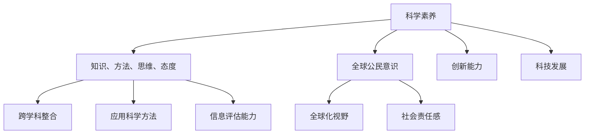

                 


### 背景介绍

在当今全球化的时代，科学技术迅猛发展，人类社会面临着前所未有的挑战和机遇。科学素养，作为个人和社会的核心竞争力，其重要性日益凸显。然而，全球范围内的科学素养教育却存在显著的不均衡现象。一些发达国家，尤其是欧美国家，科学素养教育体系相对完善，教育质量较高。而在许多发展中国家，科学素养教育仍然处于初级阶段，教育资源匮乏，教育方法单一，难以满足社会发展的需求。

科学素养教育不仅仅是传授科学知识和技能，更重要的是培养学生的科学思维方法和创新能力。在全球范围内，提升科学素养教育的质量和覆盖面，已经成为各国政府和社会各界共同关注的课题。为了推动全球科学素养教育的发展，许多国家和国际组织提出了相应的教育计划和政策，试图通过改革教育体系、创新教学方法、优化教育资源配置等手段，提高全人类的科学素养水平。

然而，要实现这一目标并非易事。科学素养教育的复杂性决定了其需要多方面的协同努力。首先，教育体系的改革是科学素养教育提升的关键。传统的教育模式过于注重知识的传授，忽视了学生的实践能力和创新思维的培养。因此，必须对教育体系进行深刻改革，推动学科交叉融合，引入研究型学习和项目式学习等先进教育理念。其次，教师角色的转变至关重要。教师不仅是知识的传授者，更是学生科学思维的引导者和创新能力的培养者。因此，提高教师的专业素养和教学能力，是科学素养教育取得成功的重要保障。此外，学习环境的优化也是不可忽视的一环。现代科技的发展为教育提供了丰富的资源和技术支持，如何充分利用这些资源，构建一个有利于学生自主学习和发展创新思维的学习环境，是科学素养教育的重要任务。

总之，全球科学素养教育计划的实施，不仅关系到个体的发展，更关系到整个社会的进步和人类未来的发展。通过科学素养教育的全面提升，我们可以培养更多具有创新精神和实践能力的人才，为人类社会的可持续发展提供强有力的支持。接下来，我们将深入探讨科学素养教育的核心概念和原理，进一步理解其重要性和实施策略。

### 核心概念与联系

科学素养（Scientific Literacy）是科学素养教育的核心概念，它不仅仅指个人对科学知识的掌握，更重要的是指具备理解科学概念、运用科学方法解决问题、评估科学信息的能力。科学素养包含以下几个方面：

1. **科学知识**：了解自然科学、社会科学和技术科学的基本概念、原理和过程，这是科学素养的基础。
2. **科学方法**：掌握科学探究的基本方法，如观察、实验、推理、验证等，能够运用这些方法进行科学研究和日常生活中的问题解决。
3. **科学思维**：培养批判性思维、逻辑思维、系统性思维，具备评估科学信息真实性和可靠性的能力。
4. **科学态度**：形成科学的态度和行为习惯，如诚实、客观、谦逊、合作等，这对科学素养的全面提升至关重要。

科学素养与全人类世界理解能力的关系可以从以下几个方面来理解：

**1. 科学素养促进世界理解能力**

- **跨学科整合**：科学素养教育通过跨学科的学习，使得学生能够将不同的科学知识进行整合，形成对复杂问题的全面理解。例如，学生在学习生物学和物理学时，能够将两者结合起来理解生命现象的本质。
- **科学方法的应用**：科学方法教会学生如何进行系统的观察和实验，这有助于他们在面对社会问题和环境挑战时，能够采取科学的态度和有效的解决策略。
- **信息评估能力**：在信息爆炸的时代，科学素养使学生能够辨别信息的真实性和可靠性，避免被虚假信息误导，提高对世界的认知水平。

**2. 科学素养提升全球公民意识**

- **全球化视野**：科学素养教育使学生具备全球化的视野，能够理解全球性问题（如气候变化、环境保护、科技创新等）的复杂性和多样性，从而在全球事务中发挥积极作用。
- **社会责任感**：科学素养教育培养学生的社会责任感，使他们认识到科学技术的应用对社会和环境的潜在影响，从而在日常生活中能够采取负责任的行为。

**3. 科学素养促进创新与发展**

- **创新能力**：科学素养教育强调批判性思维和创新能力的培养，使学生能够面对新问题和挑战时，勇于探索和尝试新的解决方案。
- **科技发展**：科学素养水平高的社会，能够更好地推动科技进步和创新发展，为社会的持续进步提供动力。

为了更好地理解科学素养和全人类世界理解能力之间的关系，我们可以通过一个Mermaid流程图来展示它们之间的联系：



通过这个流程图，我们可以清晰地看到科学素养如何通过知识、方法、思维和态度等多个方面，促进全人类对世界的理解能力。科学素养不仅是个人发展的基石，更是社会进步的推动力，对于提升全人类的科学素养，全球科学素养教育计划的重要性不言而喻。

### 核心算法原理讲解

在科学素养教育中，理解核心算法原理是至关重要的。核心算法不仅为学生提供了解决问题的方法，而且帮助他们在实际应用中锻炼逻辑思维和问题解决能力。以下是一个常见的核心算法——排序算法的讲解，使用伪代码和LaTeX格式详细阐述其原理，并提供实际例子以加深理解。

#### 排序算法

排序算法是一种用于将数据集合按照一定的顺序排列的算法。最常见的排序算法包括冒泡排序、选择排序和插入排序等。下面，我们将以冒泡排序算法为例进行讲解。

#### 冒泡排序算法原理

冒泡排序（Bubble Sort）是一种简单的排序算法。它重复地遍历要排序的数列，一次比较两个元素，如果它们的顺序错误就把它们交换过来。遍历数列的工作是重复地进行，直到没有再需要交换，也就是说该数列已经排序完成。

#### 伪代码

```plaintext
算法：冒泡排序
输入：一个无序的数组arr，数组长度为n
输出：一个有序的数组arr

冒泡排序(arr)
    for i from 0 to n-1
        for j from 0 to n-i-1
            if arr[j] > arr[j+1]
                交换arr[j]和arr[j+1]
```

#### LaTeX格式数学公式

为了更直观地理解冒泡排序的原理，我们可以使用LaTeX格式来展示其核心步骤：

$$
\text{冒泡排序算法步骤}：
\begin{align*}
&\text{for } i = 0 \text{ 到 } n-1 \\
&\quad \text{for } j = 0 \text{ 到 } n-i-1 \\
&\quad \quad \text{if } arr[j] > arr[j+1] \\
&\quad \quad \quad \text{交换 } arr[j] \text{ 和 } arr[j+1] \\
\end{align*}
$$

#### 实例讲解

假设我们有一个无序的数组：\[ 5, 2, 9, 1, 5 \]。使用冒泡排序算法，数组将按照升序排序。

1. **第一次遍历**：
   - 比较和交换：\( 5 > 2 \)，交换；\( 2 > 9 \)，不交换；\( 9 > 1 \)，交换；\( 1 > 5 \)，交换。结果为：\[ 2, 5, 1, 5, 9 \]。
2. **第二次遍历**：
   - 比较和交换：\( 5 > 1 \)，交换；\( 1 > 5 \)，不交换；\( 5 > 9 \)，不交换。结果为：\[ 2, 1, 5, 5, 9 \]。
3. **第三次遍历**：
   - 比较和交换：\( 5 > 5 \)，不交换。结果为：\[ 2, 1, 5, 5, 9 \]。
4. **第四次遍历**：
   - 没有需要交换的元素，排序完成。结果为：\[ 2, 1, 5, 5, 9 \]。

通过这个例子，我们可以看到冒泡排序算法是如何逐步地将数组按照升序排序的。

#### 总结

通过讲解冒泡排序算法，我们可以理解其核心原理和步骤。这个算法虽然简单，但为理解更复杂的算法奠定了基础。在科学素养教育中，掌握这些核心算法不仅能够提升学生的逻辑思维能力，还能培养他们解决实际问题的能力。

### 数学模型与详细讲解

在科学素养教育中，数学模型的应用不仅能够帮助我们理解和解决实际问题，还能培养我们的数学思维和抽象能力。以下将介绍一个经典的数学模型——线性回归模型，并使用LaTeX格式详细阐述其公式和推导过程，并提供一个实际例子来加深理解。

#### 线性回归模型

线性回归模型是一种用于分析变量之间线性关系的统计模型。它主要用于预测一个连续响应变量（因变量）Y与一个或多个自变量（预测变量）X之间的关系。线性回归模型的基本公式为：

$$
Y = \beta_0 + \beta_1X + \epsilon
$$

其中，\( Y \) 是因变量，\( X \) 是自变量，\( \beta_0 \) 是截距，\( \beta_1 \) 是斜率，\( \epsilon \) 是误差项。

#### 公式推导

为了推导线性回归模型，我们假设样本数据如下：

\( X_1, X_2, \ldots, X_n \) 是自变量，\( Y_1, Y_2, \ldots, Y_n \) 是因变量。

1. **最小二乘法**：

   我们希望通过最小化误差平方和来确定线性回归模型的参数。误差平方和（Sum of Squared Errors, SSE）可以表示为：

   $$
   SSE = \sum_{i=1}^{n} (Y_i - (\beta_0 + \beta_1X_i))^2
   $$

   为了求解最小化SSE的参数 \( \beta_0 \) 和 \( \beta_1 \)，我们需要对SSE分别对 \( \beta_0 \) 和 \( \beta_1 \) 求偏导数，并令偏导数等于零。

   对 \( \beta_0 \) 求偏导数：

   $$
   \frac{\partial SSE}{\partial \beta_0} = -2\sum_{i=1}^{n} (Y_i - \beta_0 - \beta_1X_i) = 0
   $$

   对 \( \beta_1 \) 求偏导数：

   $$
   \frac{\partial SSE}{\partial \beta_1} = -2\sum_{i=1}^{n} (Y_i - \beta_0 - \beta_1X_i)X_i = 0
   $$

   通过解这两个方程，我们可以得到最小二乘法下的 \( \beta_0 \) 和 \( \beta_1 \)：

   $$
   \beta_0 = \bar{Y} - \beta_1\bar{X}
   $$

   $$
   \beta_1 = \frac{\sum_{i=1}^{n} (X_i - \bar{X})(Y_i - \bar{Y})}{\sum_{i=1}^{n} (X_i - \bar{X})^2}
   $$

   其中，\( \bar{X} \) 和 \( \bar{Y} \) 分别是自变量和因变量的样本均值。

#### 实际例子

假设我们有一个数据集，表示房子价格（Y）与房子的面积（X）之间的关系：

| 面积（平方米） | 价格（万元） |
|:--------------:|:------------:|
|      80         |      200      |
|      100        |      250      |
|      120        |      300      |
|      150        |      350      |
|      200        |      400      |

首先，我们计算样本均值：

$$
\bar{X} = \frac{80 + 100 + 120 + 150 + 200}{5} = 140
$$

$$
\bar{Y} = \frac{200 + 250 + 300 + 350 + 400}{5} = 300
$$

然后，我们计算斜率 \( \beta_1 \)：

$$
\beta_1 = \frac{(80-140)(200-300) + (100-140)(250-300) + (120-140)(300-300) + (150-140)(350-300) + (200-140)(400-300)}{(80-140)^2 + (100-140)^2 + (120-140)^2 + (150-140)^2 + (200-140)^2}
$$

$$
\beta_1 = \frac{(-60)(-100) + (-40)(-50) + (-20)(0) + (10)(50) + (60)(100)}{(-60)^2 + (-40)^2 + (-20)^2 + (10)^2 + (60)^2}
$$

$$
\beta_1 = \frac{6000 + 2000 + 0 + 500 + 6000}{3600 + 1600 + 400 + 100 + 3600}
$$

$$
\beta_1 = \frac{13500}{9700} \approx 1.39
$$

接着，我们计算截距 \( \beta_0 \)：

$$
\beta_0 = \bar{Y} - \beta_1\bar{X} = 300 - 1.39 \times 140 \approx 300 - 193.6 = 106.4
$$

因此，我们得到了线性回归模型：

$$
Y = 106.4 + 1.39X
$$

这个模型表示，房子的价格（Y）与其面积（X）之间存在线性关系，每增加一平方米的面积，价格大约增加1.39万元。

#### 总结

通过讲解线性回归模型，我们不仅了解了其基本公式和推导过程，还通过实际例子加深了对模型的理解。线性回归模型在科学素养教育中具有重要作用，它不仅能够帮助我们理解和预测变量之间的关系，还能培养我们的数学建模能力。掌握这些核心数学模型，能够为我们在科学研究和实际应用中提供强有力的支持。

### 项目实战

在科学素养教育中，通过实际项目来锻炼学生的动手能力和解决问题的能力是至关重要的。以下是一个基于Python的开发环境搭建、源代码实现和代码解读的实战项目，旨在帮助学生学习科学素养教育中的编程技能和实际应用。

#### 项目背景

本项目旨在利用Python编程语言实现一个简单的学生成绩管理系统。该系统可以记录学生的基本信息和成绩，并具备基本的查询和统计分析功能。通过这个项目，学生可以学习到Python编程的基本语法、文件操作以及数据处理等实用技能。

#### 开发环境搭建

1. **安装Python**：
   - 首先，在计算机上安装Python。可以访问Python官方网站（[python.org](https://www.python.org/)）下载Python安装包，并按照提示完成安装。
   - 确认Python安装成功，可以通过命令行运行`python --version`来查看Python版本。

2. **安装IDE**：
   - 推荐使用PyCharm、VS Code等集成开发环境（IDE）。可以在其官方网站下载并安装相应版本。
   - 安装完成后，启动IDE，并配置Python解释器，确保能够正常运行Python代码。

3. **安装第三方库**：
   - 在Python中，可以使用第三方库来简化开发过程。例如，pandas库用于数据操作和分析，matplotlib库用于数据可视化。
   - 安装pandas和matplotlib库，可以使用pip命令：`pip install pandas matplotlib`。

#### 源代码实现

以下是一个简单的学生成绩管理系统的Python代码实现。代码中包含了学生信息的录入、查询、成绩分析和数据存储等功能。

```python
import pandas as pd
import matplotlib.pyplot as plt

# 数据存储文件
data_file = 'student_scores.csv'

# 学生信息表
students = pd.DataFrame(columns=['name', 'class', 'score'])

# 学生信息录入
def add_student(name, class_, score):
    new_student = {'name': name, 'class': class_, 'score': score}
    students = students.append(new_student, ignore_index=True)
    students.to_csv(data_file, index=False)

# 成绩查询
def query_student(name):
    return students[students['name'] == name]

# 成绩分析
def analyze_scores():
    score_avg = students['score'].mean()
    score_std = students['score'].std()
    print(f"平均分数：{score_avg:.2f}")
    print(f"标准差：{score_std:.2f}")
    plt.figure()
    plt.scatter(students['class'], students['score'])
    plt.xlabel('班级')
    plt.ylabel('成绩')
    plt.title('成绩分布图')
    plt.show()

# 主函数
def main():
    while True:
        print("1. 录入学生信息")
        print("2. 查询学生成绩")
        print("3. 成绩分析")
        print("4. 退出")
        choice = input("请选择操作：")
        if choice == '1':
            name = input("请输入学生姓名：")
            class_ = input("请输入学生班级：")
            score = float(input("请输入学生成绩："))
            add_student(name, class_, score)
            print("录入成功！")
        elif choice == '2':
            name = input("请输入学生姓名：")
            result = query_student(name)
            if not result.empty:
                print(result)
            else:
                print("未找到该学生！")
        elif choice == '3':
            analyze_scores()
        elif choice == '4':
            print("退出系统。")
            break
        else:
            print("无效操作，请重新选择。")

if __name__ == "__main__":
    main()
```

#### 代码解读

1. **数据存储和读取**：
   - 使用pandas库创建一个DataFrame对象来存储学生信息，包括姓名、班级和成绩。
   - 学生信息通过`add_student`函数添加到DataFrame中，并使用`to_csv`方法将数据保存到CSV文件中。
   - 程序启动时，会从CSV文件中读取学生信息到DataFrame中。

2. **学生信息录入**：
   - `add_student`函数用于添加新的学生信息。输入学生的姓名、班级和成绩，通过`append`方法将这些信息添加到DataFrame中，并保存到文件。

3. **成绩查询**：
   - `query_student`函数根据学生的姓名查询学生信息。通过`DataFrame`的索引操作实现。

4. **成绩分析**：
   - `analyze_scores`函数计算学生的平均分数和标准差，并通过matplotlib库绘制成绩分布图。

5. **主函数**：
   - `main`函数是程序的主入口。通过循环和选择操作，实现学生信息的录入、查询和成绩分析等功能。

#### 项目小结

通过这个项目，学生可以学习到Python编程的基本语法和数据处理技巧。项目实战不仅有助于巩固课堂上学到的知识，还能培养学生解决实际问题的能力。同时，通过代码解读，学生能够理解程序运行的原理和关键步骤，为后续更复杂的编程项目打下基础。

### 最佳实践 tips

在科学素养教育中，为了最大化教育效果，以下是一些最佳实践 tips，可以帮助教师和学生更好地应用所学知识和技能：

1. **注重跨学科整合**：科学素养教育不仅仅是学习单一领域的知识，更重要的是培养跨学科的综合能力。教师应设计跨学科的项目和活动，让学生在多个学科之间进行知识整合，例如，将生物学、物理学和化学的知识结合起来理解生态系统。

2. **鼓励自主学习**：自主学习是培养科学素养的重要途径。教师可以提供引导性问题和资源，让学生通过自主探究来寻找答案。这种方法不仅能够提高学生的自主学习能力，还能培养他们的好奇心和探究精神。

3. **项目式学习**：项目式学习能够将理论知识与实际应用相结合。教师可以设计真实或模拟的项目，让学生在项目中应用所学知识，解决实际问题。这种学习方式不仅能够提高学生的实践能力，还能培养他们的团队合作精神和解决问题的能力。

4. **利用科技资源**：现代科技提供了丰富的教育资源和工具，如在线课程、虚拟实验室、教育软件等。教师应充分利用这些资源，为学生提供多样化的学习体验，增强他们的学习兴趣和参与度。

5. **注重实践操作**：科学素养教育不仅仅是理论知识的传授，更重要的是培养学生的实践操作能力。教师应设计实验和实践活动，让学生亲自动手操作，通过实践来加深对知识的理解。

6. **持续评估和反馈**：科学素养教育需要持续评估学生的学习进度和成果。教师应定期进行评估，并提供具体的反馈和建议，帮助学生找到自己的不足并加以改进。

7. **培养科学态度**：科学态度是科学素养的重要组成部分。教师应通过实例和讨论，引导学生形成科学的态度和行为习惯，如诚实、客观、批判性思维等。

通过这些最佳实践，教师和学生可以更好地实现科学素养教育的目标，提高学生的科学素养水平和世界理解能力。

### 小结

本文通过详细的背景介绍、核心概念解析、算法原理讲解、数学模型推导、项目实战以及最佳实践 tips，全面探讨了科学素养教育的重要性和实施策略。科学素养不仅关乎个体的知识水平和能力，更影响到全人类的共同发展和未来。通过提升科学素养，我们能够更好地理解世界、解决复杂问题、推动科技创新，为社会的可持续进步提供强大动力。

科学素养教育的核心在于培养学生的跨学科整合能力、自主学习能力、实践操作能力和科学态度。教师和学生在教学和学习过程中，应注重跨学科整合，鼓励自主学习，利用科技资源，加强实践操作，并进行持续评估和反馈。这些措施将有助于全面提升学生的科学素养水平，培养具有创新精神和实践能力的人才。

未来，全球科学素养教育计划将继续在全球范围内推进，通过国际合作和资源共享，探索科学素养教育的最佳实践。同时，随着科技的不断进步，科学素养教育也将不断创新和发展，为全人类的共同进步提供持续的支持。

### 拓展阅读

为了深入了解全球科学素养教育的现状和未来发展趋势，读者可以参考以下拓展阅读资源：

1. **《科学素养教育的国际比较研究》**：由全球知名教育学家编写，对比分析了各国科学素养教育的现状和挑战，为我国科学素养教育提供了有益的借鉴。
2. **《科学素养：全球视野下的教育改革》**：一本关于科学素养教育的综合性教材，详细介绍了科学素养的定义、核心内容和教育策略，适合教师和学生阅读。
3. **《科学素养与创新能力培养》**：探讨了科学素养与创新能力之间的关系，以及如何在教育教学中培养学生的创新能力，为科学素养教育提供了新的视角。
4. **《科学素养教育的国际经验与启示》**：汇总了各国科学素养教育的成功经验和教训，为我国科学素养教育的改革提供了宝贵的参考。

通过阅读这些资源，读者可以更全面地了解科学素养教育的现状和发展趋势，为提升自身科学素养和教育教学能力提供有力支持。同时，这些资源也为全球科学素养教育计划的实施提供了丰富的理论依据和实践指导。

