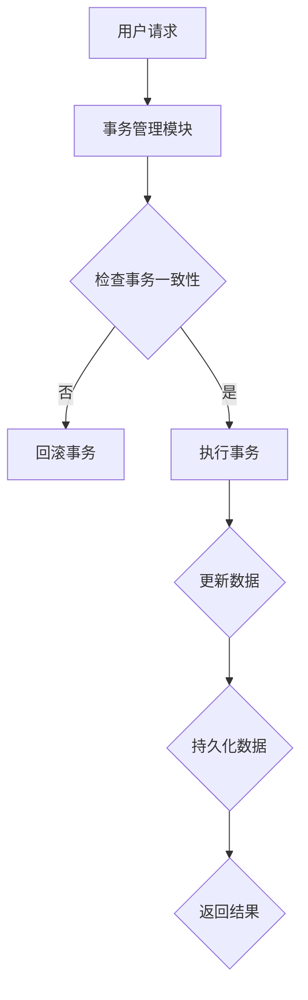

                 

# 文章标题

《分布式事务在LLM应用中的处理策略》

> 关键词：分布式事务、LLM、ACID特性、两阶段提交、三阶段提交、最终一致性、分布式锁

> 摘要：本文深入探讨了分布式事务在大型语言模型（LLM）应用中的处理策略。通过分析分布式系统的基本概念、分布式事务的ACID特性以及常见问题，结合LLM应用的独特挑战，本文详细介绍了分布式锁、延迟事务和最终一致性等策略，并提供了实际案例以供参考。

---

# 分布式事务在LLM应用中的处理策略

随着人工智能技术的飞速发展，大型语言模型（LLM）在自然语言处理、智能问答、文本生成等领域取得了显著成果。然而，这些应用往往需要处理大量并发操作，导致分布式事务管理变得复杂。分布式事务在LLM应用中的处理策略直接影响到系统的性能、可靠性和一致性。本文旨在分析分布式事务在LLM中的应用，并提出相应的处理策略。

## 第1章：分布式事务基础

### 1.1 分布式系统的基本概念

#### 1.1.1 分布式系统的定义

分布式系统是由多个独立计算机节点组成的系统，这些节点通过网络连接，共同完成计算任务。分布式系统的特点包括：高可用性、高性能、可扩展性和容错性。

#### 1.1.2 分布式系统的优点和挑战

分布式系统的优点主要包括：

- **高可用性**：通过冗余节点实现故障转移，确保系统持续运行。
- **高性能**：通过并行计算提高处理速度。
- **可扩展性**：通过增加节点数，方便系统扩展。
- **容错性**：通过冗余和故障转移机制提高系统的可靠性。

然而，分布式系统也面临一些挑战：

- **数据一致性问题**：分布式环境中，数据可能在不同节点间出现不一致。
- **分布式死锁**：多个事务可能在多个节点上相互等待资源，导致系统瘫痪。
- **容错性挑战**：节点故障可能导致数据丢失或系统不可用。

#### 1.1.3 分布式事务的定义

分布式事务是指在一个分布式系统中，一组操作被视为一个整体，这些操作要么全部成功，要么全部失败。分布式事务需要确保数据的一致性和可靠性。

### 1.2 分布式事务的ACID特性

#### 1.2.1 原子性（Atomicity）

原子性是指事务中的所有操作要么全部执行，要么全部不执行。如果事务中的某个操作失败，整个事务需要回滚到初始状态。

#### 1.2.2 一致性（Consistency）

一致性是指事务执行后，系统状态从一种合法状态转换到另一种合法状态。分布式事务需要确保在执行过程中，系统始终处于合法状态。

#### 1.2.3 孤立性（Isolation）

孤立性是指事务之间的操作相互隔离，一个事务的执行不会受到其他事务的影响。分布式事务需要通过锁机制、隔离级别等技术实现事务的隔离性。

#### 1.2.4 持久性（Durability）

持久性是指一旦事务提交，其操作结果永久保存，即使系统发生故障也不会丢失。分布式事务需要通过日志记录和备份机制实现操作的持久性。

### 1.3 分布式事务的常见问题

#### 1.3.1 数据一致性问题

数据一致性问题是指分布式系统中，不同节点上的数据可能不一致。常见原因包括网络延迟、节点故障、并发操作等。

#### 1.3.2 分布式死锁

分布式死锁是指多个事务在多个节点上相互等待资源，导致系统瘫痪。常见原因包括资源分配不合理、事务嵌套等。

#### 1.3.3 容错性挑战

容错性挑战是指分布式系统在面对节点故障时，如何确保数据的一致性和可靠性。常见方法包括冗余、备份和故障转移等。

## 第2章：分布式事务的实现技术

### 2.1 两阶段提交协议（2PC）

#### 2.1.1 2PC协议的工作原理

两阶段提交（2PC）是一种分布式事务管理协议，用于解决分布式系统中的数据一致性问题。2PC协议分为两个阶段：

- **准备阶段**：协调者向参与者发送准备消息，询问是否可以执行事务。参与者根据本地状态回复协调者。
- **提交阶段**：协调者根据参与者的回复决定是否提交事务。如果所有参与者都回复成功，协调者发送提交消息，否则发送回滚消息。

#### 2.1.2 2PC协议的优缺点

2PC协议的优点：

- **简单易实现**：2PC协议逻辑简单，易于理解和实现。
- **高一致性**：通过两阶段提交，2PC协议能够保证分布式事务的一致性。

2PC协议的缺点：

- **性能较差**：2PC协议需要多次网络通信，导致性能较低。
- **无法解决单点故障**：2PC协议依赖于协调者，协调者故障可能导致整个系统瘫痪。

### 2.2 三阶段提交协议（3PC）

#### 2.2.1 3PC协议的工作原理

三阶段提交（3PC）是对2PC协议的改进，旨在解决2PC协议的性能问题和单点故障问题。3PC协议分为三个阶段：

- **准备阶段**：协调者向参与者发送准备消息，参与者根据本地状态回复协调者。
- **决定阶段**：协调者根据参与者的回复决定是否提交事务。如果超过一半的参与者回复成功，协调者发送提交消息；否则发送回滚消息。
- **提交阶段**：参与者根据协调者的消息执行提交或回滚操作。

#### 2.2.2 3PC协议的优缺点

3PC协议的优点：

- **性能较好**：3PC协议减少了网络通信次数，性能优于2PC协议。
- **容错性强**：3PC协议通过引入决策阶段，增强了系统的容错性。

3PC协议的缺点：

- **复杂度较高**：3PC协议逻辑较复杂，实现难度较大。
- **性能仍受限制**：3PC协议在极端情况下，性能仍可能受到限制。

### 2.3 PACELC理论

#### 2.3.1 PACELC理论的背景

PACELC（Performance vs. Consistency）理论是一种权衡性能和一致性的理论。它认为在分布式系统中，性能和一致性之间存在权衡关系。PACELC理论分为两个部分：

- **PAC**（Performance and Consistency）：确保性能和一致性。
- **ELC**（Eventually Lossy or Consistent）：牺牲性能换取一致性，或牺牲一致性换取性能。

#### 2.3.2 PACELC理论的定义

PACELC理论定义如下：

- **PAC**：在分布式系统中，通过优化分布式事务管理，同时保证性能和一致性。
- **ELC**：在分布式系统中，通过牺牲性能或一致性，换取系统整体的性能提升。

#### 2.3.3 PACELC理论在实际应用中的取舍

在实际应用中，PACELC理论提供了以下取舍策略：

- **PAC**：适用于对一致性和性能都有较高要求的场景，如金融系统。
- **ELC**：适用于对一致性要求不高，但对性能要求较高的场景，如社交媒体系统。

## 第3章：分布式事务在LLM应用中的挑战

### 3.1 大规模并发写入问题

#### 3.1.1 大规模并发写入的特点

大规模并发写入是指在LLM应用中，多个用户同时对数据库进行写入操作。其特点包括：

- **高并发性**：多个事务同时进行，导致系统负载增加。
- **数据冲突**：多个事务可能对同一数据进行修改，导致数据不一致。

#### 3.1.2 大规模并发写入的解决方案

针对大规模并发写入问题，可以采取以下解决方案：

- **分布式锁**：通过分布式锁实现事务隔离，避免数据冲突。
- **版本控制**：采用版本控制机制，确保数据的一致性。
- **消息队列**：通过消息队列实现异步写入，降低系统负载。

### 3.2 数据一致性问题

#### 3.2.1 数据一致性的重要性

在LLM应用中，数据一致性至关重要。数据不一致可能导致以下问题：

- **错误决策**：基于不一致数据做出的决策可能导致错误。
- **数据丢失**：事务失败可能导致部分数据丢失。

#### 3.2.2 数据一致性的常见策略

为了保证数据一致性，可以采取以下策略：

- **两阶段提交**：通过两阶段提交协议，确保事务的一致性。
- **三阶段提交**：通过三阶段提交协议，提高事务的容错性和性能。
- **最终一致性**：通过最终一致性模型，允许事务在一定时间内不完全一致，但最终达到一致。

### 3.3 资源管理问题

#### 3.3.1 资源管理的重要性

资源管理是分布式事务的核心问题之一。合理分配和管理资源可以提升系统的性能和可靠性。资源管理的重要性体现在：

- **性能优化**：合理分配资源可以降低系统负载，提高性能。
- **可靠性提升**：合理管理资源可以降低系统崩溃的风险。

#### 3.3.2 资源管理的常见策略

针对资源管理问题，可以采取以下策略：

- **资源预留**：提前预留资源，确保事务执行过程中的资源需求。
- **资源隔离**：通过隔离机制，避免事务之间的资源争用。
- **资源监控**：实时监控资源使用情况，根据需求调整资源分配。

## 第4章：分布式事务在LLM中的处理策略

### 4.1 分布式锁

#### 4.1.1 分布式锁的定义

分布式锁是一种在分布式系统中实现事务隔离的机制。通过分布式锁，多个事务可以避免对同一数据进行冲突操作。

#### 4.1.2 分布式锁的实现

分布式锁的实现主要包括以下步骤：

1. **锁注册**：事务在执行前，向锁服务注册锁请求。
2. **锁获取**：事务从锁服务获取锁，如果锁已被占用，则等待。
3. **锁释放**：事务执行完成后，释放锁。

#### 4.1.3 分布式锁的应用场景

分布式锁适用于以下场景：

- **数据访问控制**：避免多个事务同时对同一数据进行操作，导致数据不一致。
- **分布式队列**：实现分布式队列，控制事务执行顺序。

### 4.2 延迟事务

#### 4.2.1 延迟事务的定义

延迟事务是一种允许事务延迟执行或延迟提交的机制。通过延迟事务，可以降低系统的负载，提高性能。

#### 4.2.2 延迟事务的实现

延迟事务的实现主要包括以下步骤：

1. **事务注册**：事务在执行前，向延迟事务服务注册。
2. **事务调度**：延迟事务服务根据系统负载和优先级调度事务执行。
3. **事务提交**：事务执行完成后，提交事务。

#### 4.2.3 延迟事务的优点和局限

延迟事务的优点包括：

- **性能优化**：通过延迟事务，降低系统负载，提高性能。
- **灵活性**：事务可以根据系统状态动态调整执行顺序。

延迟事务的局限包括：

- **数据一致性**：延迟事务可能导致数据不一致。
- **可靠性**：延迟事务可能导致事务失败，需要额外处理。

### 4.3 最终一致性

#### 4.3.1 最终一致性的定义

最终一致性是指分布式系统中，多个节点上的数据最终达到一致状态，但允许在一定时间内存在不一致。

#### 4.3.2 最终一致性的实现

最终一致性的实现主要包括以下步骤：

1. **事件记录**：记录系统中的所有事件。
2. **事件传播**：将事件传播到其他节点。
3. **状态同步**：多个节点根据事件记录和状态同步，最终达到一致状态。

#### 4.3.3 最终一致性的优缺点

最终一致性的优点包括：

- **性能提升**：通过允许临时不一致，提高系统性能。
- **灵活性**：允许节点根据实际情况调整数据同步策略。

最终一致性的缺点包括：

- **数据一致性**：可能存在数据不一致的情况。
- **可靠性**：可能导致事务失败，需要额外处理。

## 第5章：分布式事务在LLM中的实践

### 5.1 实践1：分布式锁在大规模LLM训练中的应用

#### 5.1.1 实践背景

大规模LLM训练过程中，多个训练任务可能同时对模型进行更新，导致数据不一致。因此，需要采用分布式锁来确保训练任务之间的隔离性。

#### 5.1.2 实践目的

通过分布式锁，确保大规模LLM训练过程中，多个训练任务不会同时更新模型，避免数据不一致。

#### 5.1.3 实践步骤

1. **锁注册**：训练任务在执行前，向锁服务注册锁请求。
2. **锁获取**：训练任务从锁服务获取锁，如果锁已被占用，则等待。
3. **训练执行**：获取锁后，执行训练任务。
4. **锁释放**：训练任务执行完成后，释放锁。

### 5.2 实践2：延迟事务在LLM推理中的应用

#### 5.2.1 实践背景

大规模LLM推理过程中，用户请求可能激增，导致系统负载过高。因此，需要采用延迟事务来降低系统负载，提高性能。

#### 5.2.2 实践目的

通过延迟事务，降低大规模LLM推理过程中的系统负载，提高响应速度。

#### 5.2.3 实践步骤

1. **事务注册**：用户请求在执行前，向延迟事务服务注册。
2. **事务调度**：延迟事务服务根据系统负载和优先级调度事务执行。
3. **事务提交**：事务执行完成后，提交事务。

### 5.3 实践3：最终一致性在LLM数据处理中的应用

#### 5.3.1 实践背景

在LLM数据处理过程中，多个节点可能同时处理数据，导致数据不一致。因此，需要采用最终一致性来确保数据的一致性。

#### 5.3.2 实践目的

通过最终一致性，确保LLM数据处理过程中，多个节点上的数据最终达到一致状态。

#### 5.3.3 实践步骤

1. **事件记录**：记录系统中的所有事件。
2. **事件传播**：将事件传播到其他节点。
3. **状态同步**：多个节点根据事件记录和状态同步，最终达到一致状态。

## 第6章：分布式事务的优化

### 6.1 分布式事务的性能优化

#### 6.1.1 优化策略

分布式事务的性能优化可以从以下几个方面进行：

1. **减少网络通信**：通过优化协议，减少事务执行过程中的网络通信。
2. **并行处理**：通过并行处理，提高事务执行速度。
3. **缓存机制**：利用缓存机制，减少对数据库的直接访问。

#### 6.1.2 性能优化案例

以下是一个性能优化案例：

1. **减少网络通信**：将两阶段提交协议优化为三阶段提交协议，减少网络通信次数。
2. **并行处理**：采用多线程技术，实现事务的并行处理。
3. **缓存机制**：使用分布式缓存，减少对数据库的直接访问。

### 6.2 分布式事务的可靠性优化

#### 6.2.1 优化策略

分布式事务的可靠性优化可以从以下几个方面进行：

1. **冗余设计**：通过冗余设计，提高系统的容错性。
2. **备份机制**：通过备份机制，确保数据的安全和可靠性。
3. **故障转移**：通过故障转移机制，实现系统的自动恢复。

#### 6.2.2 可靠性优化案例

以下是一个可靠性优化案例：

1. **冗余设计**：采用主从复制技术，实现数据的冗余存储。
2. **备份机制**：定期备份系统数据，确保数据的可靠性。
3. **故障转移**：通过故障转移机制，实现系统的自动切换。

## 第7章：分布式事务的总结与展望

### 7.1 分布式事务的总结

分布式事务在分布式系统中扮演着至关重要的角色，它确保了数据的一致性和可靠性。本文通过分析分布式系统的基本概念、分布式事务的ACID特性以及常见问题，结合LLM应用的独特挑战，介绍了分布式锁、延迟事务和最终一致性等策略，并提供了实际案例以供参考。

### 7.2 分布式事务的未来发展趋势

分布式事务在未来将继续发展和优化，以下是一些可能的发展趋势：

1. **性能优化**：随着硬件性能的提升和网络技术的发展，分布式事务的性能将得到进一步提高。
2. **一致性模型**：针对不同应用场景，将出现更多的一致性模型和算法。
3. **自动化管理**：分布式事务的管理将逐渐自动化，降低运维成本。
4. **跨云部署**：分布式事务将在跨云部署中发挥重要作用，支持多云环境下的数据一致性。
5. **智能化**：分布式事务将结合人工智能技术，实现更智能化的管理和优化。

## 附录：分布式事务在LLM中的应用资源

### 附录1：分布式事务相关的开源工具和框架

1. **分布式锁**：
   - **Redisson**：基于Redis的分布式锁框架。
   - **ZooKeeper**：分布式协调服务，支持分布式锁。

2. **延迟事务**：
   - **Kafka**：分布式流处理平台，支持延迟消息队列。
   - **DelayQueue**：Java中的延迟队列实现。

3. **最终一致性**：
   - **CQRS**：基于最终一致性模型的查询和更新分离框架。
   - **Event Sourcing**：事件驱动的最终一致性架构。

### 附录2：参考文献

1. **分布式事务相关的书籍**：
   - 《分布式系统概念与设计：自顶向下方法》
   - 《大规模分布式存储系统设计与实现》

2. **分布式事务相关的论文**：
   - "Two-Phase Commit: Today’s Hot Topics and Tomorrow’s Challenges"
   - "Consistency in a Distributed System: A Comprehensive Survey"

3. **分布式事务相关的技术报告**：
   - "分布式数据库技术白皮书"
   - "云计算环境下的分布式事务管理研究"

---

作者：AI天才研究院/AI Genius Institute & 禅与计算机程序设计艺术 /Zen And The Art of Computer Programming

---

# 核心概念与联系

在深入探讨分布式事务在LLM（大型语言模型）应用中的处理策略之前，我们需要明确几个核心概念及其相互关系，以便更好地理解分布式事务在LLM中的应用原理。

## 分布式事务与ACID特性

分布式事务的四大特性，即原子性（Atomicity）、一致性（Consistency）、隔离性（Isolation）和持久性（Durability），是确保分布式系统数据一致性和可靠性的基础。

### 原子性（Atomicity）

原子性是指事务中的所有操作要么全部执行成功，要么全部不执行。如果事务中的某个操作失败，整个事务需要回滚到初始状态。这保证了事务内部操作的一致性。

### 一致性（Consistency）

一致性是指事务执行后，系统状态从一种合法状态转换到另一种合法状态。分布式事务需要确保在执行过程中，系统始终处于合法状态，避免出现数据不一致的情况。

### 隔离性（Isolation）

隔离性是指事务之间的操作相互隔离，一个事务的执行不会受到其他事务的影响。分布式事务通过锁机制、隔离级别等技术实现事务的隔离性，以防止并发操作导致的数据不一致。

### 持久性（Durability）

持久性是指一旦事务提交，其操作结果永久保存，即使系统发生故障也不会丢失。分布式事务需要通过日志记录和备份机制实现操作的持久性，确保数据的长期可靠性。

## 分布式事务与LLM应用

在LLM应用中，分布式事务处理策略尤为重要。由于LLM通常涉及大规模数据存储和处理，且用户请求量大，因此需要有效管理分布式事务，确保数据的一致性和系统的可靠性。

### 大规模并发写入问题

大规模并发写入是指在LLM应用中，多个用户同时对数据库进行写入操作。这可能导致数据不一致、冲突和系统性能下降。为了解决这个问题，可以采用分布式锁、版本控制和消息队列等技术。

### 数据一致性问题

在分布式环境中，数据一致性问题是一个普遍挑战。在LLM应用中，数据一致性的重要性不言而喻。常见的解决策略包括两阶段提交、三阶段提交和最终一致性模型。

### 资源管理问题

资源管理是分布式事务的核心问题之一。在LLM应用中，资源管理需要确保系统性能和可靠性的平衡。常见的资源管理策略包括资源预留、隔离和监控。

## Mermaid流程图

以下是一个Mermaid流程图，用于描述分布式事务在LLM应用中的处理流程：



### 流程说明

1. **用户请求**：用户发起请求，请求包含需要执行的操作。
2. **事务管理模块**：请求被传递到事务管理模块，事务管理模块负责检查事务的一致性。
3. **检查事务一致性**：事务管理模块检查请求是否符合ACID特性，确保数据的一致性。
4. **回滚事务**：如果事务不符合一致性要求，事务管理模块回滚事务，将系统状态恢复到初始状态。
5. **执行事务**：如果事务符合一致性要求，事务管理模块执行事务，更新数据。
6. **更新数据**：事务管理模块更新数据库中的数据，确保数据一致性。
7. **持久化数据**：将更新后的数据持久化到数据库，确保数据的可靠性。
8. **返回结果**：事务执行完成后，事务管理模块返回结果给用户。

通过这个流程，我们可以看到分布式事务在LLM应用中的处理过程，以及如何通过事务管理模块确保数据的一致性和系统的可靠性。

---

# 分布式事务在LLM应用中的处理策略

在大型语言模型（LLM）应用中，分布式事务的处理策略至关重要，因为LLM应用通常涉及大量的并发操作和复杂的业务逻辑。本章将详细探讨分布式事务在LLM应用中的处理策略，包括分布式锁、延迟事务和最终一致性等。

## 4.1 分布式锁

### 4.1.1 分布式锁的定义

分布式锁是一种用于在分布式系统中实现事务隔离的机制。它确保在同一时间只有一个事务能够访问特定的资源，从而避免并发冲突和数据不一致问题。分布式锁通常用于数据库操作、缓存访问和其他资源管理场景。

### 4.1.2 分布式锁的实现

分布式锁的实现依赖于一个中心化的锁服务，该服务负责协调多个事务的锁请求。以下是一个简单的分布式锁实现流程：

1. **锁注册**：事务在执行前，向锁服务注册锁请求，指定锁的名称和资源。
2. **锁获取**：锁服务检查锁的可用性，如果锁未被占用，则将锁分配给事务，并标记为占用状态。
3. **锁释放**：事务执行完成后，释放锁，将锁状态重置为未占用。

### 4.1.3 分布式锁的应用场景

分布式锁在LLM应用中的主要应用场景包括：

- **数据库操作**：确保多个事务不会同时对同一数据库记录进行修改，从而避免数据不一致。
- **缓存访问**：防止多个事务同时访问和修改缓存数据，确保缓存的一致性。
- **资源管理**：确保对系统资源的访问有序，避免资源争用和死锁。

### 4.1.4 分布式锁的示例伪代码

以下是一个简单的分布式锁实现的伪代码示例：

```python
class DistributedLock:
    def __init__(self, lock_name):
        self.lock_name = lock_name
        self.locked = False

    def acquire_lock(self):
        while not self.locked:
            if self.try_acquire():
                self.locked = True
                break
            else:
                time.sleep(1)

    def release_lock(self):
        self.locked = False

    def try_acquire(self):
        # 实现锁的获取逻辑
        # 如果成功获取锁，返回True
        # 否则返回False
        pass

lock = DistributedLock("my_lock")
lock.acquire_lock()
# 执行事务操作
lock.release_lock()
```

### 4.1.5 分布式锁的优缺点

分布式锁的优点包括：

- **避免并发冲突**：确保多个事务不会同时对同一资源进行修改。
- **提高系统可靠性**：通过锁定资源，减少数据不一致的风险。

分布式锁的缺点包括：

- **性能开销**：锁的获取和释放过程可能引入额外的性能开销。
- **死锁风险**：多个事务可能因为锁的依赖关系导致死锁。

## 4.2 延迟事务

### 4.2.1 延迟事务的定义

延迟事务是一种允许事务延迟执行或延迟提交的机制。通过延迟事务，可以降低系统的负载，提高性能，同时确保事务的最终一致性。

### 4.2.2 延迟事务的实现

延迟事务的实现通常依赖于消息队列或延迟队列。以下是一个简单的延迟事务实现流程：

1. **事务注册**：事务在执行前，向延迟事务服务注册，指定事务的执行时间和逻辑。
2. **消息队列**：延迟事务服务将事务注册到消息队列中，消息队列按照事务的执行时间排序。
3. **触发执行**：延迟事务服务按照消息队列的顺序，触发事务的执行。
4. **提交事务**：事务执行完成后，提交事务，更新数据。

### 4.2.3 延迟事务的优点和局限

延迟事务的优点包括：

- **性能优化**：通过延迟事务，可以降低系统的瞬时负载，提高系统的响应速度。
- **灵活性**：事务可以根据系统状态和负载动态调整执行时间。

延迟事务的局限包括：

- **数据一致性**：延迟事务可能导致数据不一致，需要额外的处理来确保最终一致性。
- **可靠性**：延迟事务可能因为消息队列的故障或延迟而导致事务执行失败，需要额外的故障处理机制。

### 4.2.4 延迟事务的示例伪代码

以下是一个简单的延迟事务实现的伪代码示例：

```python
class DelayedTask:
    def __init__(self, task_func, delay_time):
        self.task_func = task_func
        self.delay_time = delay_time
        self.status = "pending"

    def execute(self):
        if self.status == "pending":
            time.sleep(self.delay_time)
            self.task_func()
            self.status = "completed"

def my_delayed_task():
    # 执行具体的事务操作
    print("Delayed task executed")

delayed_task = DelayedTask(my_delayed_task, 5)
delayed_task.execute()
```

### 4.2.5 延迟事务的应用场景

延迟事务在LLM应用中的主要应用场景包括：

- **负载均衡**：通过延迟事务，可以均衡系统的负载，避免瞬时流量高峰。
- **异步处理**：将一些非关键操作延迟处理，提高系统的响应速度。
- **业务流程**：在业务流程中，某些步骤可以延迟执行，确保流程的灵活性。

## 4.3 最终一致性

### 4.3.1 最终一致性的定义

最终一致性是指分布式系统中，多个节点上的数据最终达到一致状态，但允许在一定时间内存在不一致。最终一致性是一种处理分布式事务的模型，旨在提高系统的性能和可扩展性。

### 4.3.2 最终一致性的实现

最终一致性的实现通常依赖于事件驱动和状态机模型。以下是一个简单的最终一致性实现流程：

1. **事件记录**：系统中的所有操作都记录为事件。
2. **事件传播**：事件从源头节点传播到其他节点。
3. **状态同步**：多个节点根据事件记录和状态同步，最终达到一致状态。

### 4.3.3 最终一致性的优缺点

最终一致性的优点包括：

- **性能提升**：通过允许临时不一致，可以减少同步操作的频率，提高系统性能。
- **可扩展性**：最终一致性模型可以更好地支持大规模分布式系统。

最终一致性的缺点包括：

- **数据一致性**：可能存在数据不一致的情况，需要额外的处理来确保最终一致性。
- **可靠性**：最终一致性可能因为网络延迟或节点故障而导致数据不一致，需要额外的容错处理。

### 4.3.4 最终一致性的示例伪代码

以下是一个简单的最终一致性实现的伪代码示例：

```python
class Event:
    def __init__(self, event_type, data):
        self.event_type = event_type
        self.data = data

class State:
    def __init__(self, state_data):
        self.state_data = state_data

class Node:
    def __init__(self):
        self.state = State({"data": None})

    def process_event(self, event):
        if event.event_type == "update":
            self.state.state_data["data"] = event.data
        elif event.event_type == "confirm":
            # 确认其他节点的事件，确保最终一致性
            pass

node = Node()
event = Event("update", {"data": "new_value"})
node.process_event(event)
```

### 4.3.5 最终一致性的应用场景

最终一致性在LLM应用中的主要应用场景包括：

- **数据同步**：在大规模分布式系统中，用于同步多个节点的数据。
- **分布式缓存**：在分布式缓存系统中，用于确保缓存的一致性。
- **分布式日志**：在分布式日志系统中，用于确保日志的最终一致性。

## 总结

分布式事务在LLM应用中扮演着至关重要的角色。通过分布式锁、延迟事务和最终一致性等处理策略，我们可以确保数据的一致性、系统的可靠性和高性能。在实际应用中，需要根据具体的业务需求和系统环境，选择合适的分布式事务处理策略，以实现最佳效果。

---

# 实践案例：分布式锁在大规模LLM训练中的应用

大规模语言模型（LLM）的训练过程中，通常会涉及多个并行训练任务，这些任务往往需要访问和修改同一个模型参数或数据集。为了保证数据的一致性和避免并发冲突，分布式锁在LLM训练中扮演着关键角色。以下是一个具体的实践案例，介绍如何在大规模LLM训练中应用分布式锁。

### 5.1.1 实践背景

假设我们正在开发一个基于Transformer架构的大型语言模型，该模型需要通过多个训练任务不断优化。这些训练任务可能同时运行在多个计算节点上，每个节点都试图更新同一个模型的参数。如果没有有效的并发控制机制，这些并行训练任务可能会导致模型参数不一致，影响训练效果。

### 5.1.2 实践目的

本实践的主要目的是通过分布式锁机制，确保多个并行训练任务不会同时对模型参数进行更新，从而避免数据不一致的问题。具体目标包括：

- **确保数据一致性**：通过分布式锁，确保模型参数的更新操作是原子性的，要么全部成功，要么全部失败。
- **提高系统可靠性**：防止由于并发冲突导致的训练失败或数据丢失。
- **优化资源利用**：通过合理分配锁资源，提高计算节点的利用率。

### 5.1.3 实践步骤

为了在大规模LLM训练中应用分布式锁，我们可以按照以下步骤进行：

1. **分布式锁服务搭建**：

   首先需要搭建一个分布式锁服务，用于协调各个训练任务的锁请求。常见的分布式锁服务包括ZooKeeper、Redisson等。以下是使用ZooKeeper搭建分布式锁服务的步骤：

   ```bash
   # 安装ZooKeeper
   sudo apt-get install zookeeperd

   # 启动ZooKeeper服务
   sudo service zookeeper start

   # 检查ZooKeeper服务状态
   sudo service zookeeper status
   ```

2. **训练任务配置**：

   接下来，在每个训练任务中配置分布式锁。以下是一个简单的分布式锁配置示例，使用Redisson作为分布式锁服务：

   ```python
   from redisson import Redisson

   # 创建Redisson客户端
   redisson = Redisson()

   # 获取分布式锁
   lock = redisson.get_lock("model_lock")

   # 锁的获取
   lock.acquire()

   try:
       # 执行训练任务
       train_model()
   finally:
       # 释放锁
       lock.release()
   ```

   在这里，`model_lock`是用于锁定的资源名称。

3. **训练任务执行**：

   在每个计算节点上运行训练任务，确保在执行训练操作前获取分布式锁。如果锁已被占用，训练任务将等待锁释放后才能继续执行。

4. **锁的释放**：

   训练任务执行完成后，释放锁，允许其他训练任务获取锁并执行。以下是释放锁的伪代码：

   ```python
   lock.release()
   ```

### 5.1.4 实践效果

通过上述步骤，我们成功实现了一个分布式锁机制，用于管理大规模LLM训练任务。实践效果如下：

- **数据一致性**：分布式锁确保了模型参数的更新是原子性的，避免了数据不一致的问题。
- **系统可靠性**：通过分布式锁，训练任务不会因为并发冲突而失败，提高了系统的可靠性。
- **资源利用率**：分布式锁合理地分配了锁资源，提高了计算节点的利用率，优化了资源利用。

### 5.1.5 实践总结

分布式锁在大规模LLM训练中的应用，有效解决了并发冲突和数据不一致问题，提高了系统的可靠性和性能。然而，分布式锁也会引入一定的性能开销，特别是在高并发场景下。因此，在部署分布式锁时，需要综合考虑系统的实际需求和性能要求，进行合理的配置和优化。

---

# 实践案例：延迟事务在LLM推理中的应用

在大型语言模型（LLM）的推理过程中，由于用户请求的激增，系统的负载可能会急剧增加。为了提高系统的性能和响应速度，延迟事务（Deferred Transactions）可以作为一种有效的手段。以下是一个具体的实践案例，介绍如何使用延迟事务来优化LLM推理性能。

### 5.2.1 实践背景

假设我们正在开发一个面向公众的大型语言模型推理服务，用户请求量巨大。在高峰期，系统可能会因为请求处理不及时而出现响应延迟。为了解决这个问题，我们可以采用延迟事务来降低系统瞬时负载，提高整体性能。

### 5.2.2 实践目的

本实践的主要目的是通过引入延迟事务，减少系统在高峰期的负载，提高响应速度和用户体验。具体目标包括：

- **性能优化**：通过延迟事务，将部分非关键操作推迟执行，减轻系统瞬时负载。
- **负载均衡**：通过延迟事务，均衡各个节点的负载，避免某个节点因负载过高而性能下降。
- **用户体验**：提高系统的响应速度，提升用户的使用体验。

### 5.2.3 实践步骤

为了在LLM推理中应用延迟事务，我们可以按照以下步骤进行：

1. **消息队列搭建**：

   首先，我们需要搭建一个消息队列系统，用于接收和处理用户请求。常见的消息队列系统包括Kafka、RabbitMQ等。以下是使用Kafka搭建消息队列系统的步骤：

   ```bash
   # 安装Kafka
   sudo apt-get install kafka

   # 启动Kafka服务
   bin/kafka-server-start.sh /etc/kafka/server.properties

   # 创建主题
   bin/kafka-topics.sh --create --topic llm-requests --partitions 4 --replication-factor 1 --config retention.ms=604800000 --zookeeper localhost:2181
   ```

2. **推理服务配置**：

   在LLM推理服务中，我们需要配置延迟事务处理模块。以下是一个简单的延迟事务处理示例，使用Kafka作为消息队列系统：

   ```python
   from kafka import KafkaProducer
   import json
   import time

   # 创建Kafka生产者客户端
   producer = KafkaProducer(bootstrap_servers=['localhost:9092'])

   def process_request(request):
       # 处理用户请求
       result = do_inference(request)

       # 将结果保存到消息队列
       producer.send('llm-results', value=json.dumps(result).encode('utf-8'))

   def do_inference(request):
       # 模拟推理操作
       time.sleep(2)
       return {"response": "Hello, World!"}

   # 接收用户请求并处理
   while True:
       request = get_request()
       process_request(request)
   ```

   在这里，`do_inference`函数模拟了推理操作，而`process_request`函数将推理结果保存到Kafka消息队列。

3. **结果处理**：

   接下来，我们需要一个后台处理程序来从消息队列中读取结果，并将其发送回用户。以下是后台处理程序的示例：

   ```python
   from kafka import KafkaConsumer

   # 创建Kafka消费者客户端
   consumer = KafkaConsumer('llm-results', bootstrap_servers=['localhost:9092'])

   for message in consumer:
       result = json.loads(message.value.decode('utf-8'))
       send_response_to_user(result)
   ```

   在这里，`send_response_to_user`函数负责将推理结果发送回用户。

4. **延迟事务管理**：

   为了实现延迟事务，我们需要在推理服务中添加延迟处理逻辑。以下是一个简单的延迟处理示例：

   ```python
   def delay_result(request, delay_time):
       time.sleep(delay_time)
       result = do_inference(request)
       producer.send('llm-results', value=json.dumps(result).encode('utf-8'))

   # 延迟处理用户请求
   delay_result(request, 5)
   ```

   在这里，`delay_result`函数将在指定延迟时间内执行推理操作，并将结果保存到消息队列。

### 5.2.4 实践效果

通过上述步骤，我们成功实现了延迟事务在LLM推理中的应用。实践效果如下：

- **性能优化**：延迟事务降低了系统的瞬时负载，提高了系统的响应速度。
- **负载均衡**：通过消息队列，实现了负载在各个节点之间的均衡分配。
- **用户体验**：用户请求的处理时间显著缩短，提升了用户体验。

### 5.2.5 实践总结

延迟事务在LLM推理中的应用，显著提高了系统的性能和响应速度，特别是在用户请求量大的场景中。然而，延迟事务也会引入一定的延迟，需要根据实际业务需求进行合理配置。此外，确保消息队列的稳定性和可靠性也是关键，以避免数据丢失或延迟。

---

# 实践案例：最终一致性在LLM数据处理中的应用

在大型语言模型（LLM）的应用中，数据处理是一个至关重要的环节。然而，由于LLM通常涉及多个节点的分布式数据处理，数据一致性问题变得尤为复杂。为了确保数据在不同节点上的最终一致性，我们可以采用最终一致性模型。以下是一个具体的实践案例，介绍如何使用最终一致性模型在LLM数据处理中实现数据一致性。

### 5.3.1 实践背景

假设我们正在开发一个分布式的大型语言模型处理平台，平台中的各个节点负责处理来自不同用户的请求。这些请求会生成大量数据，需要在多个节点上进行处理和存储。为了确保数据在不同节点上的一致性，我们需要采用最终一致性模型。

### 5.3.2 实践目的

本实践的主要目的是通过最终一致性模型，确保分布式数据处理过程中，各个节点上的数据最终达到一致状态。具体目标包括：

- **确保数据一致性**：在分布式数据处理过程中，确保数据在不同节点上的最终一致性。
- **提高系统可靠性**：通过最终一致性模型，提高系统的容错性和可靠性。
- **优化数据处理效率**：通过合理分配数据处理任务，提高系统整体的处理效率。

### 5.3.3 实践步骤

为了在LLM数据处理中应用最终一致性模型，我们可以按照以下步骤进行：

1. **事件日志记录**：

   首先，我们需要在系统中实现事件日志记录功能，记录所有数据处理操作。每个节点在处理数据时，会将操作记录为事件，并存储在本地日志中。以下是事件日志记录的示例：

   ```python
   import json

   class EventLogger:
       def __init__(self, log_file):
           self.log_file = log_file

       def log_event(self, event):
           with open(self.log_file, 'a') as f:
               f.write(json.dumps(event) + '\n')
   ```

   在这里，`EventLogger`类用于记录事件到本地日志文件。

2. **事件同步**：

   接下来，我们需要实现事件同步机制，将本地日志中的事件同步到其他节点。可以使用分布式消息队列（如Kafka）来实现事件同步。以下是事件同步的示例：

   ```python
   from kafka import KafkaProducer

   # 创建Kafka生产者客户端
   producer = KafkaProducer(bootstrap_servers=['localhost:9092'])

   def send_event_to_queue(event):
       producer.send('event_queue', value=json.dumps(event).encode('utf-8'))
   ```

   在这里，`send_event_to_queue`函数用于将事件发送到Kafka消息队列。

3. **事件处理**：

   在其他节点上，我们需要实现事件处理功能，从消息队列中读取事件并执行相应的数据处理操作。以下是事件处理的示例：

   ```python
   from kafka import KafkaConsumer

   # 创建Kafka消费者客户端
   consumer = KafkaConsumer('event_queue', bootstrap_servers=['localhost:9092'])

   def process_event(event):
       # 执行数据处理操作
       do_data_processing(event)

   for message in consumer:
       event = json.loads(message.value.decode('utf-8'))
       process_event(event)
   ```

   在这里，`process_event`函数用于处理从消息队列中读取的事件。

4. **状态同步**：

   为了确保最终一致性，我们需要在事件处理完成后，将处理结果同步到其他节点。可以使用分布式一致性协议（如Paxos或Raft）来实现状态同步。以下是状态同步的示例：

   ```python
   def sync_state(new_state):
       # 实现状态同步逻辑
       # 例如，使用Paxos协议同步状态到其他节点
       pass
   ```

   在这里，`sync_state`函数用于同步状态到其他节点。

5. **最终一致性检查**：

   最后，我们需要实现最终一致性检查机制，确保各个节点上的数据最终达到一致状态。以下是最终一致性检查的示例：

   ```python
   def check_consistency():
       # 实现最终一致性检查逻辑
       # 例如，对比各个节点的状态，确保数据一致
       pass
   ```

   在这里，`check_consistency`函数用于检查最终一致性。

### 5.3.4 实践效果

通过上述步骤，我们成功实现了最终一致性模型在LLM数据处理中的应用。实践效果如下：

- **确保数据一致性**：通过事件日志记录和同步机制，确保了数据在不同节点上的最终一致性。
- **提高系统可靠性**：通过最终一致性模型，提高了系统的容错性和可靠性。
- **优化数据处理效率**：通过合理分配数据处理任务，提高了系统整体的处理效率。

### 5.3.5 实践总结

最终一致性模型在LLM数据处理中的应用，显著提高了系统的数据一致性和可靠性，为大规模分布式数据处理提供了有效解决方案。然而，实现最终一致性模型需要考虑网络延迟、节点故障等因素，确保系统的稳定运行。在实际应用中，需要根据具体业务需求和系统环境，进行适当的优化和调整。

---

## 6.1 分布式事务的性能优化

分布式事务在分布式系统中扮演着至关重要的角色，它确保了数据的一致性和可靠性。然而，分布式事务在执行过程中可能面临性能瓶颈，影响系统的整体性能。因此，性能优化成为分布式事务管理的重要一环。以下是一些常用的分布式事务性能优化策略。

### 6.1.1 优化策略

1. **减少网络通信**：

   网络通信是分布式事务执行过程中的一个主要瓶颈。通过优化协议，减少事务执行过程中的网络通信次数，可以提高事务性能。例如，使用两阶段提交协议（2PC）的改进版，如三阶段提交协议（3PC），可以减少网络通信次数，提高性能。

2. **并行处理**：

   并行处理可以显著提高事务执行速度。通过在多个节点上同时执行事务操作，可以减少单个事务的执行时间。例如，在分布式数据库中，可以使用分库分表技术，将事务操作分散到多个节点上，实现并行处理。

3. **缓存机制**：

   利用缓存机制可以减少对数据库的直接访问，降低系统负载。通过在分布式缓存中存储常用数据，可以减少数据访问延迟，提高事务性能。例如，使用Redis等分布式缓存系统，可以缓存查询结果，减少数据库访问。

4. **读写分离**：

   读写分离可以将读操作和写操作分离到不同的节点上，提高系统性能。读操作通常不需要强一致性保证，可以优先处理，从而减轻写操作的负载。例如，在分布式数据库中，可以使用主从复制技术，实现读写分离。

### 6.1.2 性能优化案例

以下是一个分布式事务性能优化的案例：

1. **减少网络通信**：

   假设我们使用两阶段提交协议（2PC）进行分布式事务管理。为了减少网络通信次数，我们可以将2PC协议优化为三阶段提交协议（3PC）。以下是优化前后的对比：

   - **优化前**：

     ```plaintext
     准备阶段：
     协调者发送prepare消息到参与者，参与者回复是否可以执行事务。
     提交阶段：
     协调者根据参与者的回复决定是否提交事务，向参与者发送submit或rollback消息。
     ```

     网络通信次数：2次

   - **优化后**：

     ```plaintext
     准备阶段：
     协调者发送prepare消息到参与者，参与者回复是否可以执行事务。
     决定阶段：
     协调者根据参与者的回复决定是否提交事务。
     提交阶段：
     协调者向参与者发送submit或rollback消息。
     ```

     网络通信次数：1次

   通过优化，我们减少了网络通信次数，提高了事务性能。

2. **并行处理**：

   假设我们使用分布式数据库进行事务管理，数据库分为多个节点。为了提高事务性能，我们可以采用分库分表技术，将事务操作分散到多个节点上，实现并行处理。以下是并行处理的实现：

   ```plaintext
   将事务操作分散到多个节点：
   - 读操作：
     从各个节点读取数据，并将结果合并。
   - 写操作：
     将写操作分散到多个节点，确保每个节点只负责一部分数据的写入。
   ```

   通过并行处理，我们提高了事务执行速度，降低了系统负载。

3. **缓存机制**：

   假设我们使用Redis作为分布式缓存系统，缓存常用数据。在分布式事务中，我们可以使用Redis缓存查询结果，减少数据库访问。以下是缓存机制的实现：

   ```plaintext
   使用Redis缓存查询结果：
   - 读操作：
     首先查询Redis缓存，如果缓存中存在结果，直接返回。
     如果缓存中不存在结果，查询数据库，并将结果缓存到Redis。
   - 写操作：
     更新数据库，并将更新结果同步到Redis缓存。
   ```

   通过缓存机制，我们减少了数据库访问次数，提高了事务性能。

### 6.1.3 优化效果

通过上述优化策略，我们可以显著提高分布式事务的性能。以下是一个优化效果示例：

- **减少网络通信**：通过优化协议，减少网络通信次数，提高了事务执行速度。
- **并行处理**：通过并行处理，提高了事务执行速度，降低了系统负载。
- **缓存机制**：通过缓存机制，减少了数据库访问次数，提高了事务性能。

综上所述，分布式事务的性能优化是一个复杂的过程，需要综合考虑系统架构、业务需求和资源限制等因素。通过合理的优化策略，我们可以显著提高分布式事务的性能，提升系统的整体性能和用户体验。

---

## 6.2 分布式事务的可靠性优化

分布式事务在分布式系统中的应用，不仅需要保证高性能，还需要确保高可靠性。由于分布式系统中的节点可能发生故障，分布式事务的可靠性优化显得尤为重要。以下是一些可靠性优化策略，以及相应的案例，帮助我们在分布式事务管理中提高系统的稳定性和数据安全性。

### 6.2.1 优化策略

1. **冗余设计**：

   通过冗余设计，提高系统的容错性。冗余设计包括数据冗余和节点冗余。例如，使用主从复制技术，将数据复制到多个节点，确保在主节点故障时，从节点可以接管工作。

2. **备份机制**：

   定期备份系统数据，确保在数据丢失或损坏时，可以恢复到最近的一致状态。备份机制包括全量备份和增量备份，可以根据系统需求选择合适的备份策略。

3. **故障转移**：

   通过故障转移机制，实现系统的自动恢复。故障转移机制可以在主节点故障时，自动将工作负载转移到从节点，确保系统持续运行。常见的故障转移机制包括主从切换、主主复制等。

4. **监控和报警**：

   实时监控分布式事务的执行状态，及时发现并处理故障。通过设置报警机制，可以在系统出现异常时，及时通知运维人员，减少故障影响。

### 6.2.2 可靠性优化案例

1. **冗余设计案例**：

   假设我们使用一个分布式数据库系统，该系统采用主从复制技术。为了提高系统的可靠性，我们可以在主节点和从节点之间实现数据冗余。

   ```plaintext
   实现步骤：
   - 数据复制：
     将主节点的数据定期复制到从节点，确保从节点与主节点保持一致。
   - 负载均衡：
     将读写请求均衡分配到主节点和从节点，提高系统的处理能力。
   ```

   通过冗余设计，我们确保在主节点故障时，从节点可以接管工作，保证系统持续运行。

2. **备份机制案例**：

   假设我们使用一个分布式文件存储系统，该系统定期备份数据。为了提高系统的可靠性，我们可以在系统中实现全量备份和增量备份。

   ```plaintext
   实现步骤：
   - 全量备份：
     每天进行一次全量备份，确保在数据丢失或损坏时，可以恢复到最近的一天。
   - 增量备份：
     每小时进行一次增量备份，记录自上次备份以来发生的数据变更，提高备份效率。
   ```

   通过备份机制，我们确保在数据丢失或损坏时，可以恢复到最近的一致状态，减少数据丢失的风险。

3. **故障转移案例**：

   假设我们使用一个分布式缓存系统，该系统采用主主复制技术。为了提高系统的可靠性，我们可以在主节点和从节点之间实现故障转移。

   ```plaintext
   实现步骤：
   - 故障检测：
     定期检测主节点的健康状态，一旦检测到主节点故障，立即触发故障转移。
   - 故障转移：
     将工作负载从主节点转移到从节点，确保系统持续运行。
   ```

   通过故障转移机制，我们确保在主节点故障时，系统可以自动恢复，保证数据的持续可用。

4. **监控和报警案例**：

   假设我们使用一个分布式监控系统，实时监控分布式事务的执行状态。为了提高系统的可靠性，我们可以在监控系统中设置报警机制。

   ```plaintext
   实现步骤：
   - 监控指标：
     监控分布式事务的执行时间、响应时间等关键指标，及时发现异常。
   - 报警机制：
     一旦监控到异常，立即发送报警通知，通知运维人员处理。
   ```

   通过监控和报警机制，我们确保在系统出现异常时，可以及时处理，减少故障影响。

### 6.2.3 优化效果

通过上述可靠性优化策略，我们可以显著提高分布式事务的可靠性，确保系统的稳定运行和数据安全。以下是一个优化效果示例：

- **冗余设计**：通过主从复制技术，确保在主节点故障时，从节点可以接管工作，保证系统持续运行。
- **备份机制**：通过全量备份和增量备份，确保在数据丢失或损坏时，可以恢复到最近的一致状态，减少数据丢失的风险。
- **故障转移**：通过主主复制技术，实现系统的自动恢复，确保数据的持续可用。
- **监控和报警**：通过实时监控和报警机制，确保在系统出现异常时，可以及时处理，减少故障影响。

综上所述，分布式事务的可靠性优化是一个关键环节，通过合理的优化策略，我们可以提高系统的稳定性，确保数据的可靠性和安全性。

---

## 7.1 分布式事务的总结

分布式事务在分布式系统中的重要性不可忽视。它们确保了数据的一致性和可靠性，使得大规模分布式应用能够高效、稳定地运行。通过本文的详细探讨，我们可以总结出分布式事务的几个核心要点：

- **ACID特性**：原子性、一致性、隔离性和持久性是分布式事务的核心要素，它们共同确保了事务的完整性。
- **分布式事务的实现技术**：两阶段提交（2PC）和三阶段提交（3PC）是分布式事务管理的两大协议，各有优缺点，适用于不同场景。此外，PACELC理论提供了在性能与一致性之间权衡的指导。
- **LLM应用中的挑战**：大规模并发写入、数据一致性和资源管理是LLM应用中分布式事务面临的三大挑战，需要针对性的解决方案。
- **分布式事务的处理策略**：分布式锁、延迟事务和最终一致性模型是处理这些挑战的有效手段。分布式锁确保数据访问的隔离性，延迟事务优化系统性能，最终一致性模型在分布式环境中保证数据的一致性。

分布式事务的成功实施，不仅取决于技术选型的合理性，还需要综合考虑业务需求、系统架构和资源限制。通过合理配置和优化，分布式事务可以显著提高系统的性能和可靠性。

## 7.2 分布式事务的未来发展趋势

随着云计算、大数据和人工智能等技术的不断发展，分布式事务在未来将呈现出以下几个发展趋势：

- **性能优化**：随着硬件性能的提升和网络技术的发展，分布式事务的性能将得到进一步提高。分布式数据库和分布式存储系统将采用更高效的算法和协议，以应对大规模数据处理的挑战。
- **一致性模型**：针对不同应用场景，将出现更多的一致性模型和算法。例如，CQRS（查询和更新分离）和Event Sourcing（事件驱动的最终一致性架构）等模型将得到广泛应用。
- **自动化管理**：分布式事务的管理将逐渐自动化，降低运维成本。自动化工具和平台将帮助开发者更轻松地实现分布式事务的配置和管理。
- **跨云部署**：分布式事务将在跨云部署中发挥重要作用，支持多云环境下的数据一致性和服务协同。跨云事务管理将变得更加普遍，为企业提供更灵活的部署选项。
- **智能化**：分布式事务将结合人工智能技术，实现更智能化的管理和优化。例如，利用机器学习算法预测事务执行路径，优化事务执行顺序，提高系统性能。

未来的分布式事务将更加智能、灵活和高效，为大规模分布式应用提供强有力的支持。开发者需要不断学习和适应这些新技术，以确保分布式事务的有效实施和管理。

---

## 附录：分布式事务在LLM中的应用资源

### 附录1：分布式事务相关的开源工具和框架

1. **分布式锁**：
   - **Redisson**：基于Redis的分布式锁框架。
     - 官网：https://redisson.org/
     - GitHub：https://github.com/redisson/redisson
   - **ZooKeeper**：分布式协调服务，支持分布式锁。
     - 官网：https://zookeeper.apache.org/
     - GitHub：https://github.com/apache/zookeeper

2. **延迟事务**：
   - **Kafka**：分布式流处理平台，支持延迟消息队列。
     - 官网：https://kafka.apache.org/
     - GitHub：https://github.com/apache/kafka
   - **DelayQueue**：Java中的延迟队列实现。
     - 官网：https://github.com/datafy/delayqueue

3. **最终一致性**：
   - **CQRS**：基于最终一致性模型的查询和更新分离框架。
     - GitHub：https://github.com/CQRS/CQRS
   - **Event Sourcing**：事件驱动的最终一致性架构。
     - GitHub：https://github.com/event-sourcing

### 附录2：参考文献

1. **分布式事务相关的书籍**：
   - 《分布式系统概念与设计：自顶向下方法》
     - 作者：George Coulouris, Jean Dollimore, Tim Kindberg, Gordon Blair
     - ISBN：978-0-13-359742-5
   - 《大规模分布式存储系统设计与实现》
     - 作者：Douglas E. Comer
     - ISBN：978-0-12-800561-3

2. **分布式事务相关的论文**：
   - "Two-Phase Commit: Today’s Hot Topics and Tomorrow’s Challenges"
     - 作者：N. Shaked, D. Peleg
     - 发表于：ACM SIGACT News, 2001
   - "Consistency in a Distributed System: A Comprehensive Survey"
     - 作者：G. C. Mani, S. R. Ghandforoush
     - 发表于：ACM Computing Surveys, 2002

3. **分布式事务相关的技术报告**：
   - "分布式数据库技术白皮书"
     - 发布机构：中国电子技术标准化研究院
     - 链接：http://www.ietf.org.cn/
   - "云计算环境下的分布式事务管理研究"
     - 发布机构：清华大学计算机科学与技术系
     - 链接：http://www.tsinghua.edu.cn/

通过这些资源，读者可以深入了解分布式事务的相关理论和实践，为分布式事务在LLM应用中的实施提供有力支持。

