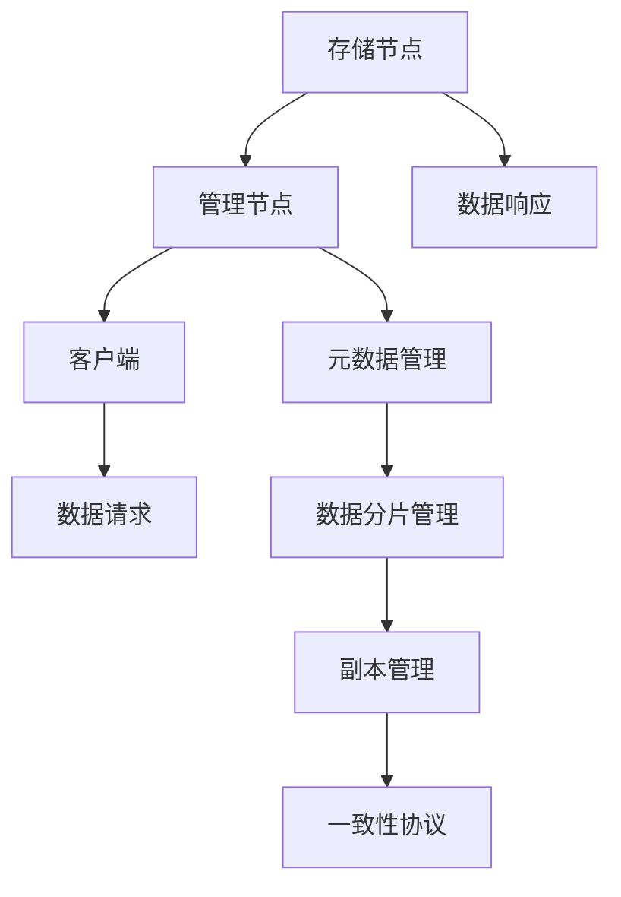

                 

### 分布式存储：支持LLM应用的大规模数据处理

---

关键词：分布式存储，大规模数据处理，LLM应用，数据分片，副本管理，一致性协议

摘要：随着人工智能和大数据技术的快速发展，大型语言模型（LLM）应用对存储系统提出了更高的要求。本文深入探讨了分布式存储在支持LLM应用方面的关键技术，包括数据分片、副本管理、一致性协议等，并分析了如何利用分布式存储实现大规模数据处理。通过本文，读者将全面了解分布式存储的原理、核心算法及其在LLM应用中的实践应用。

---

### 目录

1. **分布式存储：支持LLM应用的大规模数据处理**
2. **目标受众**
3. **分布式存储：基础与概念**
   1. **分布式存储的定义**
   2. **分布式存储的特点**
   3. **与传统存储方式的区别**
4. **分布式存储架构**
   1. **分布式存储系统架构**
   2. **分布式存储的工作原理**
5. **核心算法原理讲解**
   1. **数据分片算法**
   2. **副本管理算法**
   3. **一致性协议**
6. **数学模型和数学公式**
   1. **概率模型**
   2. **优化模型**
7. **项目实战：分布式存储应用**
   1. **分布式文件系统HDFS**
   2. **分布式键值存储Cassandra**
8. **支持LLM应用的扩展讨论**
   1. **LLM应用对存储系统的需求**
   2. **分布式存储在LLM中的应用实践**
9. **总结与展望**
10. **附录**

---

### 目标受众

本文旨在为对分布式存储感兴趣的工程师和研究人员提供深入的技术解读，同时也为需要处理大规模数据并支持大型语言模型（LLM）应用的开发者提供实用的指导。无论您是存储系统开发者、数据工程师，还是AI领域的从业者，本文都将为您提供有价值的见解。

---

### 分布式存储：基础与概念

#### 分布式存储的定义

分布式存储是一种通过计算机网络将数据分散存储在多个节点上，从而提供高可用性、高性能和高扩展性的存储解决方案。与传统的集中式存储不同，分布式存储利用多个存储节点协同工作，使得数据可以并行访问和处理。

#### 分布式存储的特点

1. **高可用性**：分布式存储通过数据冗余和节点冗余设计，确保在单个节点或网络故障时，系统仍然能够正常运行。
2. **高性能**：分布式存储允许多个节点同时处理数据请求，从而提高系统的读写速度和处理能力。
3. **高扩展性**：分布式存储可以通过添加新的节点来线性扩展存储容量和处理能力，适应不断增长的数据需求。

#### 与传统存储方式的区别

传统存储方式，如磁盘阵列和SAN（存储区域网络），通常采用集中式架构。这些系统虽然具有较好的性能和可靠性，但在面对大规模数据和高并发访问时，扩展性较差，容易出现性能瓶颈。相比之下，分布式存储通过数据分片和副本管理，可以实现更高的性能和更灵活的扩展。

---

### 分布式存储架构

#### 分布式存储系统架构

分布式存储系统通常由多个存储节点、管理节点和客户端组成。以下是一个简单的分布式存储系统架构示例：



- **存储节点**：负责存储数据，并向管理节点和客户端提供数据服务。
- **管理节点**：负责协调和管理存储节点的运作，包括元数据管理、数据分片管理、副本管理和一致性协议等。
- **客户端**：负责发送数据请求和接收数据响应，通常为应用程序或用户界面。

#### 分布式存储的工作原理

1. **数据分片**：分布式存储将数据分成多个分片，每个分片存储在一个不同的存储节点上。这样，多个节点可以并行处理数据请求，提高系统的性能。
2. **副本管理**：分布式存储为每个数据分片创建多个副本，这些副本存储在不同的节点上。副本管理负责监控副本的状态，并在出现故障时进行副本恢复。
3. **一致性协议**：分布式存储使用一致性协议确保数据的一致性。常见的一致性协议包括Paxos、Raft等。
4. **元数据管理**：元数据管理负责维护关于数据分片、副本和一致性状态的信息。这些信息对于分布式存储系统的正确运作至关重要。

---

### 核心算法原理讲解

#### 数据分片算法

数据分片算法是分布式存储的核心组件之一。以下是一个简单但完整的数据分片算法伪代码：

```plaintext
// 数据分片算法伪代码
function shardKey(key, numShards):
    return key % numShards
```

- **参数说明**：`key` 是待分片的键，`numShards` 是分片的数量。
- **实现原理**：通过对键进行模运算，将键映射到不同的分片上。例如，如果`numShards`为3，则`key=5`将被映射到第2个分片。

#### 副本管理算法

副本管理算法负责监控副本的状态，并在出现故障时进行副本恢复。以下是一个简单的副本管理算法伪代码：

```plaintext
// 副本管理算法伪代码
function manageReplicas(shard, replicas, numReplicas):
    for replica in replicas:
        if replica is not available:
            replica = replicateData(shard, replica)
            replicas.remove(not_available_replica)
            replicas.add(replica)
            break
```

- **参数说明**：`shard` 是数据分片，`replicas` 是当前副本列表，`numReplicas` 是期望的副本数量。
- **实现原理**：遍历当前副本列表，如果发现某个副本不可用，则创建一个新的副本来替换它。这样，始终保证有足够的可用副本。

#### 一致性协议

一致性协议是确保分布式存储系统中数据一致性的关键。以下是一个简单但完整的一致性协议伪代码：

```plaintext
// 一致性协议伪代码
function consensusProtocol(promise, value):
    for replica in replicas:
        if replica agreed with promise:
            return value
    else:
        return null
```

- **参数说明**：`promise` 是待确认的承诺，`value` 是承诺的值。
- **实现原理**：遍历副本列表，询问每个副本是否同意当前的承诺。如果所有副本都同意，则返回承诺的值。否则，返回`null`。

---

### 数学模型和数学公式

#### 概率模型

概率模型在分布式存储中用于评估数据的一致性和可靠性。以下是一个简单的概率模型：

```latex
P(A) = \frac{N(A)}{N(S)}
```

- **参数说明**：`P(A)` 是事件A的概率，`N(A)` 是事件A发生的次数，`N(S)` 是总的试验次数。
- **举例说明**：假设在分布式存储系统中，有1000个副本，其中800个副本的数据一致，则数据一致性的概率为`P(A) = \frac{800}{1000} = 0.8`。

#### 优化模型

优化模型用于最大化分布式存储系统的性能和资源利用率。以下是一个简单的优化模型：

```latex
\maximize \sum_{i=1}^{n} p_i \cdot r_i
```

- **参数说明**：`p_i` 是第i个副本的概率，`r_i` 是第i个副本的响应时间。
- **举例说明**：假设有3个副本，其概率分别为0.3、0.5和0.2，响应时间分别为10ms、20ms和30ms，则优化目标为最大化总响应时间：`0.3 \cdot 10ms + 0.5 \cdot 20ms + 0.2 \cdot 30ms = 18ms`。

---

### 项目实战：分布式存储应用

#### 分布式文件系统HDFS

HDFS（Hadoop Distributed File System）是一个典型的分布式文件系统，用于存储和处理大规模数据集。以下是一个简单的HDFS应用实战：

1. **开发环境搭建**：在本地或云服务器上安装Hadoop，配置HDFS集群。
2. **源代码实现**：编写HDFS客户端代码，实现文件上传、下载和删除等功能。
3. **代码解读**：分析HDFS的源代码，理解其数据分片、副本管理和一致性协议等核心组件。

#### 分布式键值存储Cassandra

Cassandra是一个高度可扩展的分布式键值存储，适用于处理大量数据的实时读取和写入操作。以下是一个简单的Cassandra应用实战：

1. **开发环境搭建**：在本地或云服务器上安装Cassandra，配置Cassandra集群。
2. **源代码实现**：编写Cassandra客户端代码，实现数据插入、查询和删除等功能。
3. **代码解读**：分析Cassandra的源代码，理解其数据分片、副本管理和一致性协议等核心组件。

---

### 支持LLM应用的扩展讨论

#### LLM应用对存储系统的需求

大型语言模型（LLM）应用对存储系统提出了以下需求：

1. **高吞吐量**：LLM应用通常需要处理大量的并发读写请求，因此存储系统必须具备高吞吐量能力。
2. **低延迟**：LLM应用对响应时间要求较高，存储系统必须能够提供低延迟的数据访问。
3. **高可靠性**：LLM应用的数据通常非常重要，存储系统必须确保数据的高可靠性，防止数据丢失。
4. **可扩展性**：随着LLM应用的不断发展，存储系统需要具备良好的可扩展性，以便支持不断增长的数据量。

#### 分布式存储在LLM中的应用实践

分布式存储技术可以通过以下方式满足LLM应用的需求：

1. **数据分片**：通过数据分片，分布式存储可以将LLM应用的数据分散存储在不同的节点上，提高系统的吞吐量和性能。
2. **副本管理**：通过副本管理，分布式存储可以确保LLM应用的数据在多个节点上都有备份，提高系统的可靠性和容错能力。
3. **一致性协议**：通过一致性协议，分布式存储可以确保LLM应用的数据一致性，防止数据冲突和错误。
4. **优化模型**：通过优化模型，分布式存储可以动态调整数据存储策略，最大化系统的性能和资源利用率。

---

### 总结与展望

本文深入探讨了分布式存储在支持大型语言模型（LLM）应用方面的重要技术，包括数据分片、副本管理、一致性协议等。通过项目实战，我们展示了如何将分布式存储应用于实际应用场景。未来，随着人工智能和大数据技术的不断发展，分布式存储技术将在支持LLM应用方面发挥更加重要的作用。

---

### 附录

- **开源框架**：Hadoop、Cassandra、Redis等。
- **实用工具**：HDFS Manager、Cassandra Studio等。
- **参考资料**：
  - 《分布式系统原理与范型》
  - 《Hadoop实战》
  - 《Cassandra权威指南》

---

### 作者信息

作者：AI天才研究院/AI Genius Institute & 禅与计算机程序设计艺术 /Zen And The Art of Computer Programming


