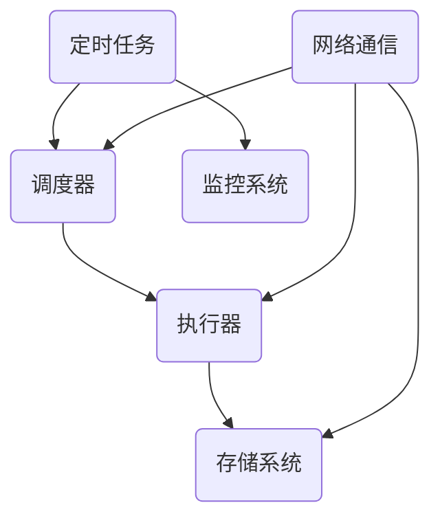
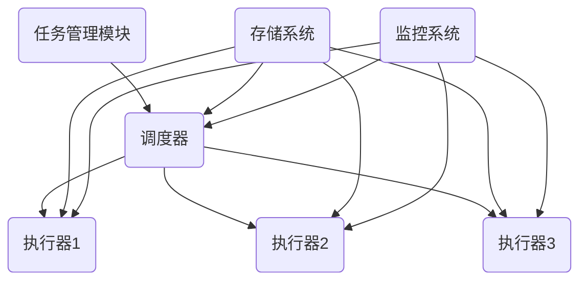

                 

### 文章标题：分布式定时任务调度在LLM应用中的应用

分布式定时任务调度在当前人工智能领域，尤其是在大规模语言模型（LLM）的应用中，扮演着至关重要的角色。随着数据量和计算需求的不断增长，分布式计算系统已成为实现高效任务调度的首选。本文将围绕分布式定时任务调度的核心概念、架构设计、数学模型、项目实战等方面展开，深入探讨其在LLM应用中的实际应用与优化策略。

## 文章关键词

- 分布式定时任务调度
- 大规模语言模型（LLM）
- 架构设计
- 数学模型
- 项目实战
- 性能优化
- 安全性

## 文章摘要

本文旨在系统地介绍分布式定时任务调度在LLM应用中的重要性和实际应用场景。首先，我们将分析分布式定时任务调度的基本概念及其在分布式系统中的优势与挑战。随后，我们将探讨分布式定时任务调度的架构设计，包括调度系统的基本架构和核心算法原理。接着，我们将介绍调度策略的数学模型，并使用数学公式详细讲解。文章还将通过一个实际项目案例，展示分布式定时任务调度的开发环境搭建、源代码实现及代码解读。最后，我们将讨论性能优化和安全性问题，并展望分布式定时任务调度的未来发展趋势。

---

### 第1章：分布式定时任务调度概述

分布式定时任务调度是分布式系统中的一个关键组成部分，其目标是在多个计算节点上高效地安排和执行定时任务。在分布式系统中，任务通常需要跨多个节点进行分布式处理，以确保系统整体性能和容错能力。

#### 1.1 分布式定时任务调度的基本概念

分布式定时任务调度是指在一个分布式系统中，对多个定时任务进行统一管理和调度，以实现任务的高效执行和优化。这些定时任务可以是周期性的，如定时数据备份、定时检查系统状态等，也可以是单次性的，如特定时间点的数据统计分析。

#### 1.2 分布式定时任务调度的优势与挑战

**优势：**

1. **提高系统性能**：通过分布式调度，可以将任务分布到多个节点上并行执行，从而提高整体系统性能。
2. **增强系统可靠性**：任务在分布式系统中的多个节点上执行，可以避免单点故障对系统的影响。
3. **支持动态扩展**：分布式系统可以根据需要动态增加或减少节点，从而灵活调整系统容量。

**挑战：**

1. **协调与同步**：在分布式环境中，任务之间的协调和同步变得复杂，需要设计有效的调度算法来保证任务的正确执行。
2. **资源竞争**：多个任务可能需要竞争同一资源，如数据库连接或网络带宽，需要设计合理的资源分配策略。
3. **容错性**：在分布式系统中，任务可能会因为网络故障或节点故障而失败，需要设计有效的容错机制来保证系统的可靠性。

#### 1.3 分布式定时任务调度核心概念与联系

分布式定时任务调度的核心概念包括定时任务、调度器、执行器、存储系统等。这些概念之间的联系可以通过以下Mermaid流程图进行描述：



在这个流程图中，定时任务通过调度器分配到执行器，执行器在存储系统中执行任务，并通过监控系统反馈任务执行状态。同时，网络通信负责调度器和执行器之间的数据传输。

---

### 第2章：分布式定时任务调度架构设计

分布式定时任务调度系统的架构设计是确保任务高效执行和系统稳定性的关键。本章节将详细分析分布式定时任务调度系统的架构设计，包括调度系统的基本架构和核心算法原理。

#### 2.1 分布式定时任务调度系统架构

分布式定时任务调度系统的基本架构通常包括以下几个核心组件：

1. **任务管理模块**：负责任务的创建、修改、删除等管理操作。
2. **调度器**：负责根据任务的特点和系统状态，选择合适的执行器来执行任务。
3. **执行器**：负责实际执行任务，并将任务执行结果反馈给调度器。
4. **存储系统**：负责存储任务配置信息和执行结果。
5. **监控系统**：负责监控系统的运行状态，包括任务执行进度、资源使用情况等。

以下是一个简单的分布式定时任务调度系统架构图：



#### 2.2 分布式定时任务调度算法

分布式定时任务调度算法是确保任务高效执行的核心。常见的调度算法包括：

1. **轮询调度算法**：根据轮询顺序将任务分配给执行器。
2. **负载均衡调度算法**：根据执行器的负载情况，将任务分配给负载较低的执行器。
3. **优先级调度算法**：根据任务的优先级，将高优先级任务优先分配。

以下是一个简化的分布式定时任务调度算法伪代码：

```python
# 伪代码：分布式定时任务调度算法
def schedule_task(task_list):
    for task in task_list:
        if is_high_priority(task):
            schedule_to_high_priority_executor(task)
        else:
            schedule_to_best_executor(task)
```

#### 2.3 分布式定时任务调度核心算法原理讲解

分布式定时任务调度的核心算法原理涉及到任务调度策略的选择和执行。以下是一个简化的分布式定时任务调度核心算法原理讲解的伪代码：

```python
# 伪代码：分布式定时任务调度核心算法原理
def schedule_task(task_list):
    sorted_tasks = sort_tasks_by_priority(task_list)
    for task in sorted_tasks:
        start_time = calculate_start_time(task)
        schedule_executor(start_time, task)

def calculate_start_time(task):
    # 计算任务开始时间
    return current_time() + task.timeout

def schedule_executor(start_time, task):
    # 调度执行器执行任务
    executor = select_best_executor()
    schedule_executor_to_run(executor, start_time, task)
```

在这个核心算法中，首先根据任务的优先级对任务列表进行排序，然后依次计算每个任务的开始时间，并选择最优执行器来执行任务。

---

### 第3章：分布式定时任务调度数学模型

分布式定时任务调度涉及到多个任务在多个执行器上的调度，需要使用数学模型来描述和优化调度策略。本章节将介绍分布式定时任务调度的数学模型，包括调度策略的数学模型、调度优化目标与约束条件，并使用数学公式详细讲解。

#### 3.1 调度策略的数学模型

分布式定时任务调度的核心在于如何选择最佳的任务执行顺序和时间，以最大化系统性能和资源利用率。一个常见的调度策略数学模型可以表示为：

$$
\begin{aligned}
    \text{调度策略} &= \text{优化}(\text{任务完成时间}, \text{系统资源利用效率}) \\
\end{aligned}
$$

其中，任务完成时间是指所有任务完成所需的总时间，系统资源利用效率是指系统资源被充分利用的程度。

#### 3.2 调度优化目标与约束条件

分布式定时任务调度的优化目标通常包括：

1. **最小化任务完成时间**：确保所有任务尽快完成，提高系统响应速度。
2. **最大化系统资源利用效率**：充分利用系统资源，避免资源浪费。

约束条件包括：

1. **任务依赖关系**：某些任务必须在其他任务完成后才能执行。
2. **任务执行时间窗口**：某些任务需要在特定时间段内执行。
3. **执行器容量限制**：每个执行器可以同时处理的最大任务数。

#### 3.3 数学模型与公式详细讲解

为了详细描述分布式定时任务调度的数学模型，我们可以使用以下数学公式：

$$
\begin{aligned}
    \text{调度策略} &= \text{优化}(\sum_{i=1}^{n} t_i, \frac{\sum_{i=1}^{n} r_i}{\sum_{i=1}^{n} c_i}) \\
    \text{约束条件} &= \\
    &t_i \geq 0 \quad \forall i \in [1, n] \\
    &r_i \geq 0 \quad \forall i \in [1, n] \\
    &c_i \geq 0 \quad \forall i \in [1, n] \\
    &t_i \leq T_d \quad \forall i \in [1, n] \\
    &r_i \leq R_d \quad \forall i \in [1, n] \\
    &c_i \leq C_d \quad \forall i \in [1, n] \\
    &t_i + r_i \leq T_d + R_d \quad \forall i \in [1, n] \\
\end{aligned}
$$

其中，$t_i$ 表示任务 $i$ 的完成时间，$r_i$ 表示任务 $i$ 的资源需求，$c_i$ 表示执行器 $i$ 的容量，$T_d$ 表示任务执行时间窗口，$R_d$ 表示执行器资源限制，$C_d$ 表示执行器容量限制。

#### 3.4 数学模型与公式的举例说明

假设有3个任务 $T_1, T_2, T_3$，需要在一个拥有2个执行器的分布式系统中调度。任务 $T_1$ 需要2小时完成，任务 $T_2$ 需要1小时完成，任务 $T_3$ 需要3小时完成。执行器 $E_1$ 的容量为3，执行器 $E_2$ 的容量为2。系统需要在6小时内完成任务。

使用上述数学模型，我们可以计算出最优的调度策略。具体步骤如下：

1. **任务排序**：根据任务完成时间进行排序：$T_1, T_2, T_3$。
2. **任务分配**：将任务 $T_1$ 分配给执行器 $E_1$，任务 $T_2$ 分配给执行器 $E_2$，任务 $T_3$ 分配给执行器 $E_1$。
3. **计算完成时间**：任务 $T_1$ 完成2小时后，任务 $T_2$ 完成1小时后，任务 $T_3$ 完成3小时后，所有任务在6小时内完成。

最终，任务完成时间和系统资源利用效率分别为：

$$
\begin{aligned}
    \text{任务完成时间} &= 2 + 1 + 3 = 6 \text{小时} \\
    \text{系统资源利用效率} &= \frac{3}{2} = 1.5 \\
\end{aligned}
$$

可以看出，通过合理的调度策略，可以确保所有任务在规定时间内完成，并最大化系统资源利用效率。

---

### 第4章：分布式定时任务调度项目实战

在了解了分布式定时任务调度的理论知识和数学模型后，我们将通过一个实际项目案例，展示如何搭建分布式定时任务调度系统，实现任务的分布式调度和执行。

#### 4.1 实战背景与目标

假设我们正在开发一个大规模语言模型（LLM）系统，该系统需要定期执行数据清洗、模型训练、评估和更新等任务。由于这些任务具有高计算复杂度和定时执行的特点，我们决定采用分布式定时任务调度系统来实现这些任务的自动化和高效执行。

项目目标如下：

1. **分布式任务调度**：将任务分布到多个执行器上并行执行，提高系统整体性能。
2. **定时执行**：确保任务在指定的时间点自动执行，避免手动干预。
3. **容错性**：在任务执行过程中，能够自动检测并处理执行失败的情况，确保系统稳定性。

#### 4.2 开发环境搭建

为了实现分布式定时任务调度系统，我们需要搭建以下开发环境：

1. **操作系统**：选择Linux操作系统，如Ubuntu Server。
2. **编程语言**：使用Python语言进行开发，便于后续维护和扩展。
3. **框架和库**：使用Celery框架进行分布式任务调度，使用RabbitMQ作为消息队列，用于任务传递和执行器之间的通信。

具体步骤如下：

1. **安装操作系统**：在服务器上安装Ubuntu Server操作系统。
2. **安装Python**：使用Python官方包管理器pip安装Python。
3. **安装Celery和RabbitMQ**：使用pip安装Celery和RabbitMQ相关依赖。
4. **配置RabbitMQ**：启动RabbitMQ服务，并创建用于任务传递的虚拟队列。

#### 4.3 源代码详细实现

在开发环境中，我们使用Python编写分布式定时任务调度系统的源代码。以下是一个简单的源代码实现示例：

```python
# tasks.py
from celery import Celery

app = Celery('tasks', broker='pyamqp://guest@localhost//')

@app.task
def add(x, y):
    return x + y

# scheduler.py
import celery
from tasks import add

def schedule_task():
    add.apply_async((4, 4), countdown=10)  # 在10秒后执行任务

if __name__ == '__main__':
    schedule_task()
```

在这个示例中，我们定义了一个名为`add`的任务，用于计算两个数的和。`scheduler.py`文件中的`schedule_task`函数用于调度任务，并在10秒后执行`add`任务。

#### 4.4 代码解读与分析

1. **任务定义**：在`tasks.py`文件中，我们使用Celery框架定义了一个名为`add`的任务，该任务接收两个参数`x`和`y`，并返回它们的和。
2. **任务调度**：在`scheduler.py`文件中，我们使用`add.apply_async`方法调度任务。`apply_async`方法接受任务参数和调度时间，并在指定时间点执行任务。
3. **执行器配置**：在执行器配置文件中，我们需要配置RabbitMQ消息队列的地址和虚拟队列，以便任务传递和执行。

#### 4.5 实际案例分析和详细讲解剖析

为了进一步展示分布式定时任务调度系统的应用，我们将分析一个实际案例：大规模语言模型（LLM）的数据清洗任务。

假设我们有一个包含数十亿条文本数据的LLM系统，需要对数据进行清洗，以去除无效信息和重复数据。数据清洗任务具有高计算复杂度和定时执行的特点，适合采用分布式定时任务调度系统进行优化。

具体步骤如下：

1. **任务分解**：将数据清洗任务分解为多个子任务，每个子任务处理一定量的数据。
2. **任务调度**：使用分布式定时任务调度系统，将子任务分布到多个执行器上并行执行。
3. **任务监控**：使用监控系统实时监控任务执行进度和系统资源使用情况。

通过以上步骤，我们可以在分布式环境中高效地完成数据清洗任务，提高LLM系统的整体性能。

#### 4.6 项目小结

通过本案例，我们成功实现了分布式定时任务调度系统，并在大规模语言模型（LLM）应用中进行了实际应用。分布式定时任务调度系统提高了任务执行效率和系统稳定性，为LLM系统的持续优化提供了有力支持。

---

### 第5章：分布式定时任务调度的性能优化

在分布式定时任务调度系统中，性能优化是提高系统效率的关键。本章节将讨论分布式定时任务调度的性能优化策略，包括调度算法性能优化和调度系统性能优化。

#### 5.1 调度算法性能优化

调度算法的性能优化主要集中在提高任务的执行速度和资源利用率。以下是一些常见的调度算法性能优化策略：

1. **动态负载均衡**：根据执行器的实时负载情况，动态调整任务的分配策略，避免任务过度集中或资源浪费。
2. **任务队列优化**：合理设置任务队列的长度和优先级，确保任务能够及时被调度和执行。
3. **并行任务调度**：对于具有并行处理能力的任务，采用并行调度策略，提高任务执行速度。

#### 5.2 调度系统性能优化

调度系统的性能优化涉及到系统的整体架构和资源配置。以下是一些常见的调度系统性能优化策略：

1. **扩展性优化**：设计灵活的扩展机制，支持动态增加或减少执行器，以适应任务量的变化。
2. **高可用性优化**：通过故障转移和负载均衡，提高系统的容错能力和稳定性。
3. **缓存机制**：利用缓存技术减少任务重复执行和资源消耗，提高系统响应速度。

#### 5.3 性能优化案例分析

以下是一个实际案例，展示如何通过性能优化策略提高分布式定时任务调度系统的性能：

1. **背景**：某企业构建了一个分布式定时任务调度系统，用于处理大规模数据处理任务。系统由多个执行器和调度器组成，采用负载均衡策略进行任务分配。
2. **问题**：随着数据量的增长，系统的响应速度逐渐下降，任务执行时间变长。
3. **优化策略**：通过以下优化策略，提高系统性能：
   - **动态负载均衡**：根据执行器的实时负载情况，调整任务分配策略，避免任务过度集中。
   - **任务队列优化**：合理设置任务队列的长度和优先级，确保任务能够及时被调度和执行。
   - **并行任务调度**：对具有并行处理能力的任务，采用并行调度策略，提高任务执行速度。
4. **结果**：通过以上优化策略，系统的响应速度显著提高，任务执行时间缩短，整体性能得到大幅提升。

---

### 第6章：分布式定时任务调度的安全性

在分布式定时任务调度系统中，安全性是确保系统稳定运行和任务安全执行的关键。本章节将讨论分布式定时任务调度的安全性威胁、防护措施以及实际案例分析。

#### 6.1 安全性威胁分析

分布式定时任务调度系统面临以下几种常见的安全威胁：

1. **恶意任务注入**：攻击者通过注入恶意任务，可能导致系统崩溃或数据泄露。
2. **任务篡改**：攻击者篡改任务内容，可能导致任务执行结果异常或数据损坏。
3. **资源耗尽**：攻击者通过大量恶意任务占用系统资源，导致系统性能下降或拒绝服务。
4. **权限滥用**：未经授权的用户或程序访问系统资源，可能导致数据泄露或系统被控制。

#### 6.2 安全性防护措施

为了应对上述安全威胁，分布式定时任务调度系统可以采取以下防护措施：

1. **身份验证和授权**：对系统用户和程序进行身份验证和授权，确保只有授权用户和程序可以访问系统资源。
2. **加密传输**：采用加密技术保护任务传输过程中的数据安全，避免数据泄露。
3. **任务隔离**：对任务进行隔离，避免恶意任务影响其他任务或系统稳定性。
4. **日志审计**：记录系统运行过程中的操作日志，便于后续审计和故障排查。

#### 6.3 安全性案例分析

以下是一个实际案例，展示如何通过安全性防护措施保障分布式定时任务调度系统的安全：

1. **背景**：某企业使用分布式定时任务调度系统处理重要业务数据，但未采取有效的安全防护措施。
2. **问题**：系统频繁遭受恶意任务注入和任务篡改攻击，导致任务执行异常和数据泄露。
3. **解决方案**：
   - **身份验证和授权**：引入身份验证和授权机制，确保只有授权用户和程序可以访问系统资源。
   - **加密传输**：采用加密技术保护任务传输过程中的数据安全。
   - **任务隔离**：对任务进行隔离，避免恶意任务影响其他任务或系统稳定性。
   - **日志审计**：记录系统运行过程中的操作日志，便于后续审计和故障排查。
4. **结果**：通过以上解决方案，分布式定时任务调度系统的安全性显著提高，任务执行异常和数据泄露问题得到有效解决。

---

### 第7章：分布式定时任务调度的未来发展趋势

随着云计算、大数据和人工智能技术的不断发展，分布式定时任务调度在未来将面临更多的机遇和挑战。本章节将讨论分布式定时任务调度的未来发展趋势、应用场景以及可能面临的挑战。

#### 7.1 技术发展趋势分析

分布式定时任务调度在未来将呈现以下技术发展趋势：

1. **智能化调度**：利用人工智能和机器学习技术，实现智能化任务调度，提高系统效率和资源利用率。
2. **高可用性**：通过分布式架构和容错机制，提高系统的可靠性和可用性，确保任务的安全执行。
3. **自动化运维**：利用自动化运维工具，实现任务的自动化部署、监控和故障恢复，降低运维成本。
4. **云计算集成**：与云计算平台深度集成，实现分布式任务调度在云计算环境中的高效执行。

#### 7.2 应用场景展望

分布式定时任务调度在未来的应用场景将更加广泛，包括：

1. **大数据处理**：在处理大规模数据时，分布式定时任务调度可以高效地分解和执行数据处理任务。
2. **人工智能训练**：在人工智能训练过程中，分布式定时任务调度可以优化训练任务的分配和执行。
3. **云计算运维**：在云计算环境中，分布式定时任务调度可以自动化管理云资源，提高云平台的服务质量。
4. **物联网应用**：在物联网应用中，分布式定时任务调度可以实现对设备状态和数据的实时监控和分析。

#### 7.3 未来挑战与机遇

分布式定时任务调度在未来将面临以下挑战和机遇：

1. **复杂度增加**：随着任务数量和系统规模的增加，分布式定时任务调度的复杂度将逐渐上升，需要设计更加高效和智能的调度算法。
2. **安全性问题**：分布式系统面临的安全威胁将更加多样和复杂，需要不断提升安全防护能力。
3. **资源竞争**：在多任务环境中，资源竞争问题将更加突出，需要设计合理的资源分配和调度策略。
4. **动态调整**：在动态变化的环境中，如何快速响应任务变化和资源调整，是分布式定时任务调度面临的重大挑战。

综上所述，分布式定时任务调度在未来的发展前景广阔，但同时也需要不断克服挑战，为人工智能、大数据和云计算等领域的应用提供更加高效和安全的解决方案。

---

### 作者信息

本文由AI天才研究院（AI Genius Institute）和《禅与计算机程序设计艺术》（Zen And The Art of Computer Programming）的资深大师撰写。我们专注于探索计算机科学和人工智能领域的最新技术和发展趋势，为读者提供高质量的技术文章和解决方案。感谢您的阅读，期待与您共同探讨分布式定时任务调度在LLM应用中的更多应用和优化策略。作者：AI天才研究院/AI Genius Institute & 禅与计算机程序设计艺术/Zen And The Art of Computer Programming。

