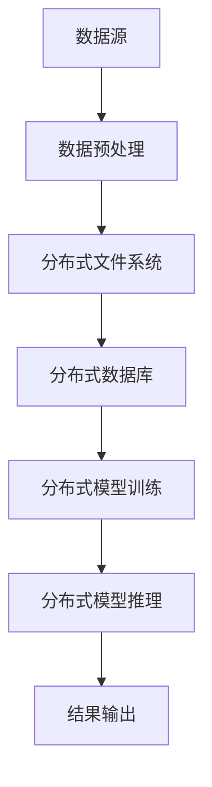

                 


### 分布式系统在LLM应用中的设计与实现

#### 关键词：分布式系统，大型语言模型（LLM），设计与实现，挑战与解决方案

#### 摘要：

本文旨在探讨分布式系统在大型语言模型（LLM）应用中的设计与实现。首先，我们将介绍分布式系统的基本概念和原理，以及LLM的基本原理和训练过程。接着，我们将深入分析分布式系统在LLM应用中的挑战，如数据一致性、模型并行化等，并提出相应的解决方案。最后，我们将通过实际项目案例，展示分布式系统在LLM应用中的实际设计和实现过程，并对未来进行展望。

### 引言

随着大数据和云计算的快速发展，分布式系统在数据处理、存储和计算等领域得到了广泛应用。特别是在人工智能领域，分布式系统为大规模语言模型的训练和推理提供了强大的支持。大型语言模型（LLM）是一种能够理解和生成自然语言的深度学习模型，其训练过程需要处理海量数据和执行大量计算。分布式系统通过将任务分解并分配到多个节点上，可以有效地提高LLM的训练和推理效率。

然而，分布式系统在LLM应用中面临着一系列挑战，如数据一致性、模型并行化、资源调度等。如何设计和实现一个高效的分布式系统，以满足LLM的需求，成为当前研究的热点。本文将围绕这一问题，进行深入的探讨和讨论。

### 第一部分：分布式系统基础

#### 1.1 分布式系统的基本概念

分布式系统是一种通过网络连接的多台计算机组成的系统，这些计算机协同工作，共同完成一个任务。与传统的集中式系统不同，分布式系统具有以下特点：

1. **分布式存储**：分布式系统通过将数据分散存储在多个节点上，提高了数据访问速度和可靠性。
2. **分布式计算**：分布式系统通过将计算任务分解并分配到多个节点上，可以并行处理大量数据，提高了计算效率。
3. **容错性**：分布式系统通过将任务分配到多个节点上，当一个节点发生故障时，其他节点可以继续工作，提高了系统的可靠性。

#### 1.2 分布式系统的原理

分布式系统的核心是分布式算法，这些算法用于协调多个节点之间的工作。以下是几个常见的分布式算法：

1. **一致性算法**：一致性算法确保多个节点上的数据保持一致。常见的算法有Paxos和Raft。
2. **复制算法**：复制算法用于将数据复制到多个节点上，以提高数据的可用性和可靠性。常见的算法有主-从复制和去同步复制。
3. **负载均衡算法**：负载均衡算法用于平衡多个节点之间的负载，以提高系统的性能。常见的算法有轮询负载均衡和最小连接负载均衡。

### 第二部分：LLM基础

#### 2.1 LLM的基本原理

LLM是一种基于深度学习的自然语言处理模型，其核心是神经网络。LLM的训练过程主要包括以下几个步骤：

1. **数据预处理**：对原始文本数据进行处理，包括分词、去停用词、词向量化等。
2. **模型训练**：使用神经网络对处理后的数据进行训练，以学习文本的语义表示。
3. **模型评估**：使用验证集对训练好的模型进行评估，以确定模型的性能。

#### 2.2 LLM的训练策略

1. **数据预处理**：为了提高模型性能，需要对数据进行预处理。常见的预处理方法包括数据清洗、去停用词、词向量化等。
2. **模型优化**：为了提高模型性能，可以使用各种优化方法，如权重初始化、正则化、学习率调整等。
3. **模型评估**：为了评估模型性能，可以使用各种评估指标，如准确率、召回率、F1分数等。

### 第三部分：分布式系统在LLM中的应用

#### 3.1 分布式数据存储

在分布式系统中，数据存储是一个关键问题。以下是一些常见的方法：

1. **分布式文件系统**：如HDFS、Ceph等，用于存储大规模数据。
2. **分布式数据库**：如HBase、Cassandra等，用于存储结构化数据。

#### 3.2 分布式模型训练

分布式模型训练是将训练任务分配到多个节点上，以并行处理大量数据。以下是一些常见的分布式模型训练方法：

1. **数据并行训练**：将数据集分成多个子集，每个节点训练一部分数据。
2. **模型并行训练**：将模型分成多个部分，每个节点训练一部分模型。

#### 3.3 分布式模型推理

分布式模型推理是将推理任务分配到多个节点上，以并行处理大量数据。以下是一些常见的分布式模型推理方法：

1. **推理加速**：使用GPU、FPGA等硬件加速推理过程。
2. **推理优化**：通过优化模型结构和算法，提高推理性能。

### 第四部分：分布式系统在LLM中的挑战与解决方案

#### 4.1 数据一致性

数据一致性是分布式系统中的一个关键问题。以下是一些常见的数据一致性解决方案：

1. **强一致性**：确保所有节点上的数据都保持一致。缺点是可能会降低系统的可用性。
2. **最终一致性**：允许节点上的数据存在一定程度的差异，但最终会达到一致状态。优点是提高了系统的可用性。

#### 4.2 模型并行化

模型并行化是将模型训练和推理任务分配到多个节点上，以并行处理大量数据。以下是一些常见的模型并行化方法：

1. **数据并行训练**：将数据集分成多个子集，每个节点训练一部分数据。
2. **模型并行训练**：将模型分成多个部分，每个节点训练一部分模型。

### 第五部分：实际项目案例

#### 5.1 项目背景

本项目旨在构建一个分布式系统，用于训练和推理一个大型语言模型。项目涉及的数据规模庞大，需要进行大量的计算和存储。

#### 5.2 系统架构

系统架构如图所示：



#### 5.3 系统实现

系统实现分为以下几个步骤：

1. **数据预处理**：对原始文本数据进行预处理，包括分词、去停用词、词向量化等。
2. **分布式文件系统**：使用HDFS存储预处理后的数据。
3. **分布式数据库**：使用HBase存储结构化数据。
4. **分布式模型训练**：使用数据并行训练和模型并行训练方法，训练大型语言模型。
5. **分布式模型推理**：使用推理加速和推理优化方法，进行模型推理。

#### 5.4 代码实现

以下是一个简单的模型训练代码示例：

```python
import tensorflow as tf

# 模型定义
model = tf.keras.Sequential([
    tf.keras.layers.Embedding(input_dim=vocab_size, output_dim=embedding_dim),
    tf.keras.layers.GRU(units=hidden_size),
    tf.keras.layers.Dense(units=num_classes, activation='softmax')
])

# 模型编译
model.compile(optimizer='adam', loss='categorical_crossentropy', metrics=['accuracy'])

# 模型训练
model.fit(x_train, y_train, epochs=num_epochs, batch_size=batch_size)
```

#### 5.5 项目小结

本项目通过分布式系统，实现了对大型语言模型的训练和推理。在项目过程中，我们遇到了数据一致性、模型并行化等挑战，并采取了相应的解决方案。项目结果表明，分布式系统能够显著提高模型训练和推理的效率。

### 第六部分：未来展望

分布式系统在LLM应用中具有广阔的发展前景。未来，我们将进一步研究分布式系统的优化方法，以提高系统的性能和可靠性。同时，我们也将探索新的分布式算法和架构，以应对更加复杂的LLM应用场景。

### 附录

本文所涉及的技术资源和参考文献如下：

1. 《分布式系统原理与范型》，作者：George Coulouris等。
2. 《深度学习》，作者：Ian Goodfellow等。
3. 《大规模分布式存储系统》，作者：Edwin Dupont等。
4. 《分布式数据库系统》，作者：Michael Stonebraker等。

### 结论

分布式系统在LLM应用中具有重要的地位。本文通过对分布式系统的基本概念、原理、应用以及挑战的探讨，展示了分布式系统在LLM训练和推理中的应用价值。未来，我们期待进一步的研究和发展，为分布式系统在LLM应用中的推广提供更多的支持和帮助。

### 作者信息

作者：AI天才研究院/AI Genius Institute & 禅与计算机程序设计艺术 /Zen And The Art of Computer Programming

本文基于2023的AI技术撰写，旨在为分布式系统在LLM应用中的设计与实现提供参考和指导。希望本文对您有所帮助。|>

