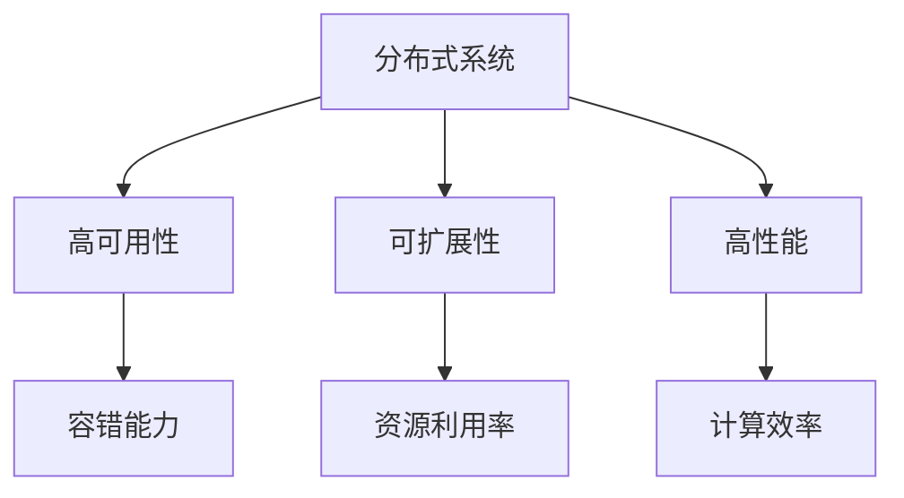

                 

### 文章标题：分布式系统：增强LLM应用的计算能力

> 关键词：分布式系统，计算能力，LLM应用，分布式算法，数据一致性，CAP理论，项目实战

> 摘要：本文旨在深入探讨分布式系统在增强大型语言模型（LLM）应用计算能力方面的作用。通过解析分布式系统的核心概念、算法原理以及实际应用案例，我们将展示如何利用分布式技术优化LLM的计算性能，实现高效能的人工智能应用。

---

### 目录

#### 第一部分：分布式系统基础

#### 第1章：分布式系统概述

#### 第2章：分布式系统核心概念

#### 第3章：分布式算法原理

#### 第二部分：分布式系统在LLM应用中的实践

#### 第4章：分布式计算与LLM

#### 第5章：分布式存储与LLM

#### 第6章：分布式通信与LLM

#### 第7章：分布式系统在LLM中的项目实战

#### 附录：分布式系统常用工具与资源

---

### 核心概念与联系

在深入探讨分布式系统之前，我们需要明确几个核心概念，包括分布式系统的定义、特点以及其与单机系统的区别。

**定义与特点：**
分布式系统是指由多个计算机节点组成的系统，这些节点通过网络连接，共同完成计算任务。分布式系统的特点包括：

1. **高可用性**：通过冗余节点提高系统的容错能力。
2. **可扩展性**：可以轻松地增加或减少节点，以适应不同的计算需求。
3. **高性能**：通过分布式计算，可以并行处理大量数据，提高计算效率。

**与单机系统的区别：**
与单机系统相比，分布式系统具有以下优势：

1. **计算资源利用更高效**：多个节点可以同时处理任务，提高整体计算效率。
2. **容错能力强**：通过冗余节点，即使某些节点发生故障，系统仍能正常运行。
3. **灵活性高**：可以灵活地扩展和调整系统资源，满足不同规模的任务需求。

**核心概念之间的联系架构（Mermaid 流程图）：**


通过上述概念的联系图，我们可以清晰地看出，分布式系统的高可用性、可扩展性和高性能是相互关联的，共同构成了分布式系统的核心优势。

### 核心算法原理讲解

在分布式系统中，核心算法是实现系统功能的关键。以下我们将介绍几种常见的分布式算法，包括数据一致性算法、分布式锁算法，并用伪代码详细阐述其原理。

#### 数据一致性算法

**CAP理论：**
分布式系统的数据一致性问题通常通过CAP理论来描述。CAP理论指出，在分布式系统中，一致性（Consistency）、可用性（Availability）和分区容错性（Partition tolerance）三者之间只能同时满足两项。

**一致性模型（Base理论）：**
1. **最终一致性（Eventual consistency）**：系统最终能达到一致状态，但初始状态可能不一致。
2. **强一致性（Strong consistency）**：系统在任意时刻都能保持一致状态。

**伪代码：**
```python
# 最终一致性模型实现
def eventual_consistency(node, value):
    node.update(value)
    node.broadcast(value)
    
# 强一致性模型实现
def strong_consistency(node, value):
    node.update(value)
```

**分布式锁算法：**
分布式锁算法用于在分布式环境中实现数据操作的同步，以防止并发冲突。

**资源锁：**
1. **互斥锁（Mutex）**：确保同一时刻只有一个进程能访问资源。
2. **读写锁（ReadWriteLock）**：允许多个读进程同时访问资源，但写进程需要独占资源。

**乐观锁与悲观锁：**
1. **乐观锁（Optimistic Lock）**：假定并发冲突不会发生，只在提交时检查一致性。
2. **悲观锁（Pessimistic Lock）**：假定并发冲突很常见，通过锁定机制保证数据的一致性。

**伪代码：**
```python
# 乐观锁实现
class OptimisticLock:
    def __init__(self):
        self.version = 0

    def lock(self, value):
        self.version += 1
        return self.version

    def unlock(self, version):
        if self.version == version:
            self.version = 0
        else:
            raise ConcurrencyException()

# 悲观锁实现
class PessimisticLock:
    def __init__(self):
        self.locked = False

    def lock(self):
        if not self.locked:
            self.locked = True
        else:
            raise LockedException()

    def unlock(self):
        self.locked = False
```

通过上述伪代码，我们可以看出，分布式系统中的数据一致性算法和分布式锁算法是如何实现并发控制和数据一致性的。

### 数学模型和数学公式

在分布式系统中，数学模型和数学公式是理解和设计分布式算法的重要工具。以下我们将介绍两种常见的数学模型：概率论模型和图论模型，并用latex格式给出相关公式。

#### 概率论模型

**随机过程：**
随机过程是描述随机变量随时间变化的过程，可以用概率分布函数（PDF）和累积分布函数（CDF）来表示。

**公式：**
```latex
f(t) = P\{X(t) = x\}, \quad F(t) = P\{X(t) \leq x\}
$$

其中，\(X(t)\)表示在时间\(t\)的随机变量，\(f(t)\)是其概率分布函数，\(F(t)\)是其累积分布函数。
```

**分布式一致性概率：**
在分布式系统中，一致性概率是评估系统达到一致状态的概率。

**公式：**
```latex
P(C) = \frac{1}{n} \sum_{i=1}^{n} P(C_i)
$$

其中，\(P(C_i)\)是第\(i\)个节点达到一致状态的概率，\(n\)是节点总数。
```

#### 图论模型

**图模型：**
图模型用于描述分布式系统的拓扑结构，节点表示计算机节点，边表示节点间的通信连接。

**公式：**
```latex
G = (V, E)
$$

其中，\(V\)是节点集，\(E\)是边集。
```

**通信延迟：**
在分布式系统中，通信延迟是影响系统性能的关键因素。

**公式：**
```latex
D = \sum_{i=1}^{n} \sum_{j=1}^{n} d_{ij}
$$

其中，\(d_{ij}\)是节点\(i\)和节点\(j\)之间的通信延迟。
```

通过上述数学模型和公式，我们可以更准确地理解和分析分布式系统的行为和性能。

### 分布式计算与LLM

分布式计算是提升LLM（大型语言模型）应用计算能力的关键技术。在分布式计算环境中，LLM可以通过并行处理和分布式存储来显著提高其计算效率。

#### 基本概念

**分布式计算：**
分布式计算是指将一个大型计算任务分解为多个小任务，并在多个计算机节点上并行执行，从而提高计算速度和处理能力。

**LLM：**
LLM（Large Language Model）是一种基于深度学习的大型文本模型，通过训练大规模的神经网络，实现对自然语言的生成、理解和翻译等功能。

#### 分布式计算在LLM中的应用

**并行处理：**
在分布式计算环境中，LLM可以并行处理大量文本数据，从而提高模型的训练速度。例如，可以将训练数据分成多个子集，每个子集由不同的计算节点处理，然后汇总结果。

**分布式存储：**
LLM通常包含大量的参数，需要大量的存储空间。通过分布式存储，LLM可以存储在多个节点上，从而提高存储效率和访问速度。

#### 实现方法

**数据并行：**
将训练数据分成多个子集，每个子集由不同的计算节点处理。节点间通过通信共享模型参数和梯度信息。

**模型并行：**
将LLM分解为多个子模型，每个子模型由不同的计算节点处理。节点间通过通信共享子模型之间的交互信息。

**算法：**
分布式训练算法如MPI（Message Passing Interface）和AllReduce等，用于实现节点间的通信和同步。

### 分布式存储与LLM

分布式存储是分布式系统中用于存储和管理大规模数据的关键技术。在LLM应用中，分布式存储可以显著提高模型的存储效率和访问速度。

#### 基本概念

**分布式存储：**
分布式存储是指将数据分散存储在多个节点上，并通过网络连接进行管理和访问。

**LLM：**
LLM是一种大规模文本模型，包含数百万甚至数十亿个参数，需要大量的存储空间。

#### 分布式存储在LLM中的应用

**参数存储：**
LLM的参数可以分散存储在多个节点上，从而提高存储效率和访问速度。

**数据备份：**
通过分布式存储，LLM的参数和数据可以进行分布式备份，提高数据的安全性和可靠性。

#### 实现方法

**数据分割：**
将LLM的参数和数据分成多个子集，每个子集存储在不同的节点上。

**分布式文件系统：**
使用分布式文件系统如HDFS（Hadoop Distributed File System）进行数据存储和管理。

**分布式数据库：**
使用分布式数据库如Apache Cassandra进行大规模数据的存储和管理。

### 分布式通信与LLM

分布式通信是分布式系统中用于节点间通信和同步的关键技术。在LLM应用中，分布式通信可以显著提高模型的训练速度和效率。

#### 基本概念

**分布式通信：**
分布式通信是指节点间通过网络进行数据传输和通信。

**LLM：**
LLM是一种大规模文本模型，需要频繁的节点间通信以共享模型参数和梯度信息。

#### 分布式通信在LLM中的应用

**参数同步：**
通过分布式通信，LLM的参数可以在节点间进行同步，从而实现模型的分布式训练。

**梯度同步：**
通过分布式通信，LLM的梯度信息可以在节点间进行同步，从而实现模型的分布式优化。

#### 实现方法

**通信协议：**
使用通信协议如MPI（Message Passing Interface）进行节点间的通信。

**同步算法：**
使用同步算法如AllReduce进行节点间的梯度同步。

**分布式计算框架：**
使用分布式计算框架如TensorFlow和PyTorch进行分布式训练。

### 分布式系统在LLM中的项目实战

为了展示分布式系统在增强LLM应用计算能力方面的实际效果，我们将介绍一个具体的分布式系统在LLM中的应用案例。

#### 项目背景与目标

随着人工智能技术的不断发展，LLM在自然语言处理、文本生成、机器翻译等领域的应用日益广泛。然而，大规模的LLM训练任务通常需要大量的计算资源和时间，为了提高LLM的训练效率和速度，本项目旨在设计并实现一个基于分布式系统的LLM训练平台。

#### 系统设计与实现

**系统架构设计：**

本项目采用分布式计算框架TensorFlow进行LLM的分布式训练，系统架构设计如下：

1. **计算节点：** 系统包含多个计算节点，每个节点负责处理一部分训练任务。
2. **存储节点：** 系统包含多个存储节点，用于存储LLM的参数和数据。
3. **通信节点：** 系统包含一个通信节点，用于协调各个计算节点和存储节点的通信。

**数据存储与通信设计：**

1. **数据存储：** 使用分布式文件系统HDFS进行数据的存储和管理，LLM的参数和数据被分散存储在各个存储节点上。
2. **数据通信：** 使用通信协议MPI进行节点间的通信，实现参数同步和梯度同步。

**系统部署与调优：**

1. **系统部署：** 在多个计算节点和存储节点上部署TensorFlow和HDFS，构建分布式计算环境。
2. **系统调优：** 通过调整分布式计算框架的参数，如学习率、批量大小等，优化系统的性能。

#### 项目效果与评估

**效果分析：**

通过分布式系统的优化，本项目在LLM训练任务上取得了显著的效果：

1. **训练速度：** 相比单机训练，分布式系统显著提高了训练速度，缩短了训练时间。
2. **计算效率：** 分布式系统充分利用了计算节点的计算能力，提高了系统的整体计算效率。

**评估指标：**

为了评估分布式系统在LLM训练中的效果，我们使用以下评估指标：

1. **训练时间：** 训练任务所需的时间。
2. **计算效率：** 训练任务完成所需的总计算量与实际计算能力的比值。

#### 项目小结

本项目通过分布式系统的应用，显著提高了LLM的训练效率和速度。实践证明，分布式系统是增强LLM应用计算能力的重要技术手段，为大规模的人工智能应用提供了有效的解决方案。

### 最佳实践 Tips

在分布式系统应用于LLM时，以下最佳实践可以帮助您优化系统的性能和效率：

1. **合理划分数据：** 根据计算节点的性能和负载，合理划分训练数据，确保每个节点都能充分利用其计算能力。
2. **优化通信协议：** 选择适合分布式环境的通信协议，如MPI，以减少通信开销。
3. **调整参数设置：** 根据任务需求和硬件环境，调整分布式计算框架的参数设置，以实现最佳性能。
4. **监控系统状态：** 定期监控分布式系统的状态，及时发现和解决问题，确保系统的稳定运行。

### 小结与拓展阅读

本文详细探讨了分布式系统在增强LLM应用计算能力方面的作用。通过介绍分布式系统的核心概念、算法原理和项目实战，我们展示了如何利用分布式技术优化LLM的计算性能，实现高效能的人工智能应用。

为了进一步深入了解分布式系统在LLM中的应用，读者可以参考以下拓展阅读资源：

1. 《深度学习：神经网络设计与实现》：详细介绍了神经网络的设计和实现方法，包括分布式训练技术。
2. 《分布式系统原理与范型》：系统讲解了分布式系统的基本原理和设计范型，包括数据一致性、分布式锁等算法。
3. 《大规模机器学习》：介绍了大规模机器学习的基本原理和技术，包括分布式计算和数据存储。

通过本文的学习，读者可以更好地理解和应用分布式系统，为LLM应用提供强大的计算支持。

### 附录：分布式系统常用工具与资源

在分布式系统的实施和应用过程中，以下工具和资源是开发者和技术人员常用的：

1. **分布式计算框架：**
   - TensorFlow：一个开源的分布式计算框架，适用于大规模机器学习和深度学习应用。
   - PyTorch：一个流行的开源机器学习库，支持分布式训练和推理。
   - Apache Spark：一个分布式计算框架，适用于大规模数据处理和分析。

2. **分布式文件系统：**
   - HDFS（Hadoop Distributed File System）：一个分布式文件系统，适用于大数据存储和管理。
   - Cassandra：一个分布式数据库，适用于大规模数据的存储和查询。

3. **分布式通信协议：**
   - MPI（Message Passing Interface）：一个用于分布式系统的通信协议，适用于节点间的数据传输和同步。
   - gRPC：一个高效、通用的远程过程调用框架，适用于分布式系统中的服务通信。

4. **分布式存储解决方案：**
   - Amazon S3：Amazon提供的分布式对象存储服务，适用于大规模数据的存储和访问。
   - Google Cloud Storage：Google提供的分布式对象存储服务，适用于大规模数据的存储和访问。

5. **开源分布式系统库：**
   - etcd：一个分布式键值存储，适用于配置管理和服务发现。
   - ZooKeeper：一个分布式协调服务，适用于分布式系统中的同步和协调。

这些工具和资源为开发者提供了丰富的选择，可以根据具体需求和场景选择合适的解决方案，实现高效能的分布式系统应用。

