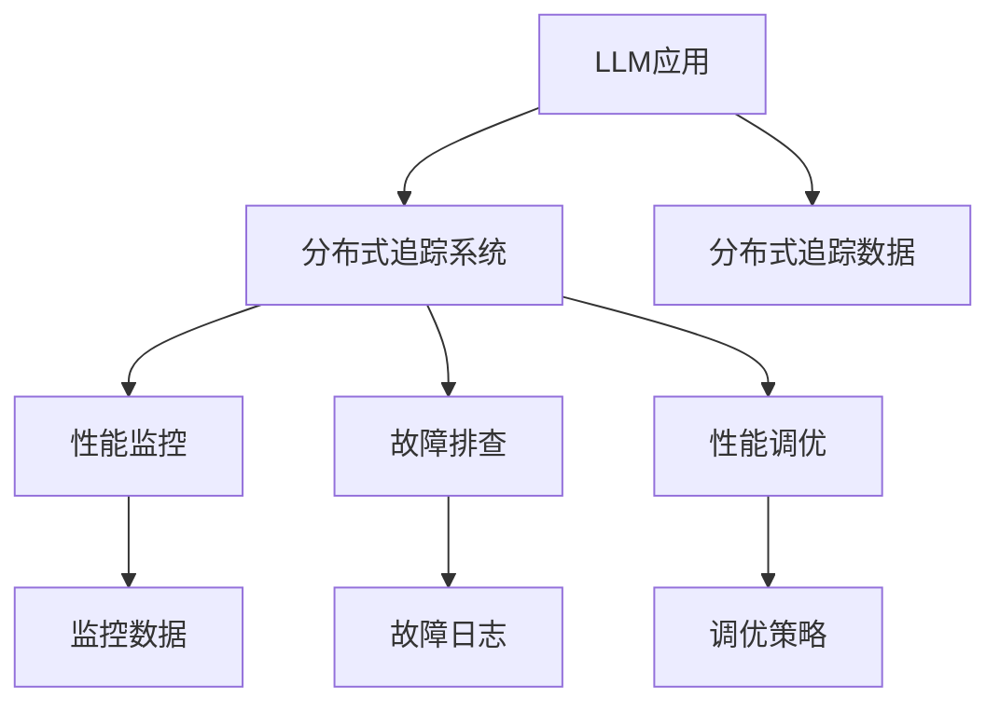

                 

### 分布式追踪技术优化LLM应用性能

## 关键词

分布式追踪，LLM应用，性能优化，OpenTelemetry，Jaeger，Zipkin，模型优化，系统优化

## 摘要

本文将探讨如何利用分布式追踪技术优化大型语言模型（LLM）的应用性能。首先，我们将介绍分布式追踪技术的基础概念，包括其定义、重要性、核心概念、数据模型以及常见工具。接着，我们将深入分析LLM应用性能优化的重要性、目标和方法。通过具体的案例和实践，我们将展示如何将分布式追踪技术应用于LLM应用性能优化，最终实现系统性能的提升。

## 第一部分：分布式追踪技术基础

### 第1章：分布式追踪技术概述

#### 1.1 分布式追踪的定义与重要性

分布式追踪技术是一种监控和分析分布式系统性能的方法。在分布式系统中，多个节点共同协作完成一个任务，追踪技术可以帮助我们了解每个节点的运行状态，发现性能瓶颈，优化系统性能。

分布式追踪的重要性体现在以下几个方面：

1. **诊断性能问题**：通过追踪技术，可以实时监控系统的运行状态，快速定位性能瓶颈。
2. **故障排查**：在系统出现故障时，追踪技术可以帮助我们追溯故障发生的源头，提供有效的排查依据。
3. **性能调优**：通过分析追踪数据，可以发现系统的性能瓶颈，从而进行针对性的调优。
4. **用户体验优化**：分布式追踪技术可以帮助我们了解用户的操作路径和系统响应时间，优化用户体验。

#### 1.2 分布式追踪的核心概念

分布式追踪技术涉及以下核心概念：

1. **追踪**（Trace）：表示一次完整的请求或操作，包括多个子操作。
2. **跨度**（Span）：表示一次操作或任务的执行过程，可以嵌套在其他跨度中。
3. **标签**（Tag）：为跨度添加额外的属性信息，如执行时间、错误信息等。
4. **日志**（Log）：记录操作过程中的关键信息，如执行时间、输入输出等。
5. **上下文**（Context）：表示跨度和日志的关联信息，如追踪ID、跨度ID等。

#### 1.3 分布式追踪的挑战与解决方案

分布式追踪面临的挑战主要包括：

1. **数据量大**：分布式系统中的追踪数据量往往非常大，如何高效地存储和分析这些数据是一个挑战。
2. **跨语言和跨框架**：分布式系统通常涉及多种编程语言和框架，如何保证追踪数据的一致性和兼容性是一个挑战。
3. **实时性**：分布式追踪需要实时地收集、存储和分析数据，如何保证数据处理的实时性是一个挑战。

针对这些挑战，解决方案包括：

1. **分布式存储和计算**：采用分布式存储和计算技术，如分布式数据库、分布式流处理等，提高数据处理能力。
2. **标准化协议**：采用标准化协议，如OpenTelemetry，确保跨语言和跨框架的追踪数据一致性。
3. **异步处理**：采用异步处理技术，降低数据处理对系统性能的影响，提高实时性。

### 第2章：分布式追踪技术原理

#### 2.1 分布式追踪流程解析

分布式追踪的基本流程包括以下几个步骤：

1. **数据采集**：在分布式系统的各个节点上部署追踪代理，实时采集追踪数据。
2. **数据传输**：将采集到的追踪数据发送到追踪系统，如OpenTelemetry、Jaeger、Zipkin等。
3. **数据处理**：追踪系统对采集到的数据进行处理，如数据清洗、数据聚合、数据分析等。
4. **数据可视化**：将处理后的数据可视化展示，如追踪图、性能指标图等。

#### 2.2 分布式追踪的数据模型

分布式追踪的数据模型主要包括以下几个部分：

1. **追踪（Trace）**：表示一次完整的请求或操作，包括多个跨度。
2. **跨度（Span）**：表示一次操作或任务的执行过程，包括操作名称、开始时间、结束时间、标签等。
3. **日志（Log）**：记录操作过程中的关键信息，如执行时间、输入输出等。
4. **上下文（Context）**：表示跨度和日志的关联信息，如追踪ID、跨度ID等。

#### 2.3 分布式追踪的采集与存储

分布式追踪的采集与存储过程如下：

1. **数据采集**：在分布式系统的各个节点上部署追踪代理，实时采集追踪数据。
2. **数据传输**：采用HTTP、gRPC等协议，将采集到的追踪数据发送到追踪系统。
3. **数据存储**：采用分布式存储系统，如Elasticsearch、InfluxDB等，存储处理后的追踪数据。

### 第3章：分布式追踪工具介绍

#### 3.1 OpenTelemetry

OpenTelemetry是一个开源的分布式追踪框架，旨在提供跨语言和跨框架的追踪数据采集和传输标准。OpenTelemetry的主要组件包括：

1. **SDK**：为不同编程语言和框架提供追踪数据采集和传输的SDK。
2. **采集器**：负责采集系统的追踪数据，如HTTP请求、数据库操作等。
3. **传输器**：负责将采集到的追踪数据发送到追踪系统，如Jaeger、Zipkin等。

#### 3.2 Jaeger

Jaeger是一个开源的分布式追踪系统，提供实时跟踪和分析分布式系统的功能。Jaeger的主要组件包括：

1. **Agent**：负责采集和传输系统的追踪数据。
2. **Collector**：负责接收和处理系统的追踪数据。
3. **Dashboard**：提供追踪数据的可视化展示。

#### 3.3 Zipkin

Zipkin是一个开源的分布式追踪系统，提供实时跟踪和分析分布式系统的功能。Zipkin的主要组件包括：

1. **Collector**：负责接收和处理系统的追踪数据。
2. **Storage**：负责存储处理后的追踪数据。
3. **UI**：提供追踪数据的可视化展示。

### 第4章：分布式追踪实践

#### 4.1 分布式追踪的部署与配置

部署分布式追踪系统主要包括以下步骤：

1. **选择追踪工具**：根据系统的需求和特点，选择合适的追踪工具，如OpenTelemetry、Jaeger、Zipkin等。
2. **部署追踪代理**：在分布式系统的各个节点上部署追踪代理，如OpenTelemetry SDK、Jaeger Agent等。
3. **配置追踪系统**：配置追踪系统的采集、传输、存储等参数，如Jaeger Collector、Zipkin Collector等。

#### 4.2 分布式追踪的监控与告警

分布式追踪的监控与告警主要包括以下内容：

1. **监控指标**：监控追踪系统的运行状态，如采集成功率、数据传输延迟、存储容量等。
2. **告警策略**：根据监控指标设置告警阈值和告警方式，如发送邮件、短信、推送等。

#### 4.3 分布式追踪的性能优化

分布式追踪的性能优化主要包括以下内容：

1. **数据压缩**：采用数据压缩技术，减少追踪数据的大小，提高传输效率。
2. **批量传输**：采用批量传输技术，减少网络传输次数，提高传输效率。
3. **缓存策略**：采用缓存策略，减少对存储系统的访问次数，提高数据处理效率。

## 第二部分：LLM应用性能优化

### 第5章：LLM应用性能优化概述

#### 5.1 LLM应用性能优化的重要性

大型语言模型（LLM）在自然语言处理领域具有广泛的应用，如搜索引擎、智能客服、机器翻译等。然而，LLM应用通常涉及复杂的计算和大量的数据传输，导致系统性能瓶颈。因此，LLM应用性能优化具有重要意义：

1. **提高用户体验**：优化LLM应用性能，可以缩短响应时间，提高用户满意度。
2. **降低成本**：优化LLM应用性能，可以减少计算资源和网络资源的消耗，降低运营成本。
3. **提升业务效率**：优化LLM应用性能，可以加速业务流程，提高业务效率。

#### 5.2 LLM应用性能优化的目标

LLM应用性能优化的目标主要包括：

1. **降低延迟**：减少用户请求的处理时间，提高系统响应速度。
2. **减少资源消耗**：优化计算和传输资源的使用，降低系统的资源消耗。
3. **提高可扩展性**：优化系统架构，提高系统的可扩展性，支持更多的用户请求。

#### 5.3 LLM应用性能优化的方法

LLM应用性能优化可以从以下几个方面进行：

1. **模型优化**：选择合适的模型，调整模型参数，提高模型性能。
2. **系统优化**：优化系统架构，提高系统的处理能力。
3. **缓存策略**：采用缓存策略，减少重复计算和传输。
4. **网络优化**：优化网络传输，减少数据传输延迟。

### 第6章：LLM模型优化

#### 6.1 模型选择与调整

模型选择和调整是LLM应用性能优化的关键步骤。以下是几种常见的模型选择和调整方法：

1. **模型选择**：根据应用场景和需求，选择合适的模型，如BERT、GPT、T5等。
2. **模型调整**：调整模型参数，如学习率、批量大小、优化器等，优化模型性能。
3. **模型压缩**：采用模型压缩技术，减少模型参数的存储和传输，提高模型性能。

#### 6.2 模型压缩与量化

模型压缩和量化是提高LLM应用性能的重要手段。以下是几种常见的模型压缩和量化方法：

1. **模型压缩**：采用模型压缩技术，如知识蒸馏、剪枝、量化等，减少模型参数的存储和传输。
2. **量化**：将模型中的浮点数参数转换为整数参数，降低模型计算复杂度和存储需求。

#### 6.3 模型推理加速

模型推理加速是提高LLM应用性能的关键步骤。以下是几种常见的模型推理加速方法：

1. **计算加速**：采用GPU、TPU等硬件加速技术，提高模型推理速度。
2. **并行推理**：采用并行推理技术，提高模型推理的吞吐量。
3. **模型缓存**：采用模型缓存技术，减少重复推理的次数，提高模型推理速度。

### 第7章：LLM应用系统优化

#### 7.1 系统架构优化

系统架构优化是提高LLM应用性能的重要手段。以下是几种常见的系统架构优化方法：

1. **分布式架构**：采用分布式架构，提高系统的处理能力和可扩展性。
2. **微服务架构**：采用微服务架构，将系统拆分为多个独立的服务，提高系统的灵活性和可维护性。
3. **容器化部署**：采用容器化部署，提高系统的部署效率和可扩展性。

#### 7.2 系统缓存策略

系统缓存策略是提高LLM应用性能的有效手段。以下是几种常见的系统缓存策略：

1. **内存缓存**：采用内存缓存，减少对磁盘的访问，提高数据访问速度。
2. **分布式缓存**：采用分布式缓存，提高系统的缓存容量和访问速度。
3. **缓存预热**：采用缓存预热技术，提前加载热点数据到缓存中，提高数据访问速度。

#### 7.3 系统调优与性能测试

系统调优和性能测试是提高LLM应用性能的重要环节。以下是几种常见的系统调优和性能测试方法：

1. **参数调优**：调整系统参数，如线程数、连接数、缓冲区大小等，优化系统性能。
2. **负载测试**：模拟真实用户请求，测试系统的负载能力和响应速度。
3. **性能瓶颈分析**：分析系统性能瓶颈，针对性地进行优化。

### 第8章：分布式追踪与LLM应用性能优化实践

#### 8.1 实践一：基于分布式追踪的LLM性能监控

基于分布式追踪的LLM性能监控主要包括以下步骤：

1. **部署分布式追踪系统**：在LLM应用系统中部署分布式追踪系统，如OpenTelemetry、Jaeger、Zipkin等。
2. **采集性能数据**：采集LLM应用系统的性能数据，如响应时间、CPU利用率、内存占用等。
3. **监控与告警**：监控性能数据，设置告警阈值，及时发现性能问题。

#### 8.2 实践二：基于分布式追踪的LLM性能调优

基于分布式追踪的LLM性能调优主要包括以下步骤：

1. **分析性能数据**：分析分布式追踪系统收集的性能数据，找出性能瓶颈。
2. **调整系统参数**：根据性能分析结果，调整系统参数，如线程数、连接数、缓冲区大小等。
3. **性能测试**：进行性能测试，验证系统性能优化效果。

#### 8.3 实践三：分布式追踪在LLM应用性能优化中的案例分析

以下是一个分布式追踪在LLM应用性能优化中的案例分析：

1. **问题描述**：某搜索引擎的LLM应用在处理大量用户请求时，出现响应时间过长的问题。
2. **性能分析**：通过分布式追踪系统，发现模型推理环节的延迟较高，导致整体响应时间过长。
3. **优化措施**：采用GPU加速模型推理，降低模型推理延迟，提高系统性能。
4. **效果验证**：性能优化后，用户请求的响应时间显著降低，系统性能得到提升。

### 附录

#### 附录A：分布式追踪与LLM应用性能优化工具推荐

以下是一些常用的分布式追踪和LLM应用性能优化工具：

1. **分布式追踪工具**：
   - OpenTelemetry
   - Jaeger
   - Zipkin
2. **LLM模型优化工具**：
   - Hugging Face
   - TensorFlow
   - PyTorch
3. **系统优化工具**：
   - Prometheus
   - Grafana
   - ELK Stack

#### 附录B：分布式追踪与LLM应用性能优化常见问题解答

以下是一些分布式追踪和LLM应用性能优化常见问题及解答：

1. **分布式追踪如何部署？**
   - 部署分布式追踪系统需要选择合适的工具，并在分布式系统的各个节点上部署追踪代理。
2. **如何收集性能数据？**
   - 可以通过分布式追踪系统收集性能数据，如响应时间、CPU利用率、内存占用等。
3. **如何分析性能数据？**
   - 可以使用数据可视化工具，如Kibana、Grafana等，分析性能数据，找出性能瓶颈。
4. **如何优化系统性能？**
   - 根据性能分析结果，调整系统参数，采用模型优化、系统优化等技术手段，优化系统性能。

### 小结

分布式追踪技术优化LLM应用性能是当前人工智能领域的一个重要研究方向。通过分布式追踪技术，可以实时监控LLM应用的运行状态，发现性能瓶颈，优化系统性能。本文介绍了分布式追踪技术的基础知识，分析了LLM应用性能优化的方法，并通过实践案例展示了分布式追踪技术在LLM应用性能优化中的应用。未来，随着分布式追踪技术的不断发展和完善，LLM应用性能优化将得到更加深入的研究和应用。

### 注意事项

在进行分布式追踪和LLM应用性能优化时，需要注意以下几点：

1. **选择合适的追踪工具**：根据系统的需求和特点，选择合适的分布式追踪工具。
2. **合理配置追踪系统**：合理配置追踪系统的采集、传输、存储等参数，确保数据采集的完整性和准确性。
3. **性能优化与稳定性兼顾**：在进行性能优化时，要注意系统的稳定性和安全性，避免因过度优化导致系统崩溃。
4. **持续监控与调优**：性能优化是一个持续的过程，需要定期监控系统性能，根据实际情况进行调优。

### 拓展阅读

1. **《分布式追踪技术原理与实践》**：详细介绍了分布式追踪技术的原理和实践方法，适合初学者阅读。
2. **《深度学习与自然语言处理》**：介绍了深度学习在自然语言处理领域的应用，包括LLM模型的优化方法。
3. **《大规模分布式系统原理与架构》**：介绍了大规模分布式系统的原理和架构，包括分布式追踪技术在系统中的应用。

以上是根据您提供的大纲草案，我为您初步撰写的文章框架。接下来，我们可以根据每个章节的具体内容进一步丰富和细化，确保文章的完整性和专业性。如果您有任何意见或建议，请随时告诉我，我会根据您的反馈进行调整。让我们一步步推进，完成一篇高质量的技术博客文章！ 

## 分布式追踪技术优化LLM应用性能

### 背景介绍

随着人工智能技术的快速发展，大型语言模型（Large Language Models，简称LLM）在自然语言处理（Natural Language Processing，简称NLP）领域取得了显著成果。LLM的应用范围广泛，包括智能客服、机器翻译、文本生成、问答系统等。然而，LLM应用通常涉及复杂的计算和大量的数据传输，导致系统性能瓶颈。为了提高LLM应用的性能，分布式追踪技术成为一种有效的优化手段。

分布式追踪技术是一种监控和分析分布式系统性能的方法。它可以帮助开发者实时监控系统的运行状态，发现性能瓶颈，优化系统性能。分布式追踪技术主要应用于大规模分布式系统，如微服务架构、云计算平台等。通过分布式追踪技术，开发者可以全面了解系统的运行情况，提高系统的可维护性和稳定性。

LLM应用通常由多个组件构成，包括文本预处理、模型推理、结果输出等。这些组件分布在不同的服务器和设备上，形成了复杂的分布式架构。在LLM应用中，分布式追踪技术可以发挥重要作用，帮助开发者优化系统性能，提高用户体验。本文将介绍分布式追踪技术的基础知识，分析LLM应用性能优化的方法，并通过实际案例展示分布式追踪技术在LLM应用性能优化中的应用。

### 核心概念与联系

在讨论分布式追踪技术优化LLM应用性能之前，我们需要明确几个核心概念，并理解它们之间的关系。以下是几个关键概念及其相互之间的联系：

#### 分布式追踪

分布式追踪是一种监控和分析分布式系统性能的技术。它通过跟踪系统的各个组件之间的交互，帮助开发者了解系统的运行状态，发现性能瓶颈，优化系统性能。分布式追踪技术主要应用于大规模分布式系统，如微服务架构、云计算平台等。

**核心概念**：
- **追踪（Trace）**：表示一次完整的请求或操作，包括多个子操作。
- **跨度（Span）**：表示一次操作或任务的执行过程，可以嵌套在其他跨度中。
- **标签（Tag）**：为跨度添加额外的属性信息，如执行时间、错误信息等。
- **日志（Log）**：记录操作过程中的关键信息，如执行时间、输入输出等。
- **上下文（Context）**：表示跨度和日志的关联信息，如追踪ID、跨度ID等。

**相互关系**：
- **追踪**是整个监控过程的起点和终点，它包含了一系列**跨度**。
- **跨度**是具体的操作或任务，可以嵌套其他**跨度**，形成层次结构的监控信息。
- **标签**和**日志**为**跨度**提供了额外的信息，帮助开发者了解操作的细节。
- **上下文**则用于关联不同的**追踪**和**跨度**，确保监控信息的准确性和完整性。

#### 大型语言模型（LLM）

大型语言模型（LLM）是一种基于深度学习技术的自然语言处理模型，具有强大的文本生成和语义理解能力。LLM在自然语言处理领域取得了显著成果，广泛应用于智能客服、机器翻译、文本生成、问答系统等场景。

**核心概念**：
- **模型架构**：LLM通常采用 Transformer 架构，包括编码器和解码器。
- **预训练**：LLM通过大规模预训练数据学习语言规律，提高模型的语义理解能力。
- **微调**：在特定任务上对LLM进行微调，使其适应具体的应用场景。
- **模型压缩**：通过模型压缩技术，降低模型参数的存储和传输需求，提高模型性能。

**相互关系**：
- **分布式追踪**可以监控LLM应用的各个组件，如文本预处理、模型推理、结果输出等，帮助开发者优化系统性能。
- **LLM性能优化**的目标是提高模型的推理速度和准确度，分布式追踪技术可以提供性能监控和调优的依据。

#### 分布式追踪与LLM应用的结合

分布式追踪与LLM应用的结合主要体现在以下几个方面：

1. **性能监控**：分布式追踪可以实时监控LLM应用的运行状态，包括模型推理时间、网络延迟、资源消耗等，帮助开发者了解系统性能瓶颈。
2. **故障排查**：当LLM应用出现故障时，分布式追踪可以提供详细的故障日志和监控数据，帮助开发者快速定位故障原因。
3. **性能调优**：通过分析分布式追踪数据，开发者可以找出LLM应用的性能瓶颈，针对性地进行调优，提高系统性能。

**相互关系**：
- **分布式追踪**提供了监控和分析分布式系统性能的工具，可以应用于LLM应用，帮助开发者优化系统性能。
- **LLM应用**作为分布式系统的一部分，需要借助分布式追踪技术实现性能监控和调优。

### Mermaid流程图

为了更直观地展示分布式追踪与LLM应用的结合，我们可以使用Mermaid流程图来描述整个过程。以下是流程图的文本表示：

在上述流程图中，LLM应用通过分布式追踪系统实现性能监控、故障排查和性能调优。分布式追踪系统提供监控数据和故障日志，帮助开发者了解系统运行状态，制定调优策略。

### 分布式追踪技术原理

分布式追踪技术是一种监控和分析分布式系统性能的方法。它通过跟踪系统的各个组件之间的交互，帮助开发者了解系统的运行状态，发现性能瓶颈，优化系统性能。分布式追踪技术主要应用于大规模分布式系统，如微服务架构、云计算平台等。以下是分布式追踪技术的基本原理：

#### 数据采集

数据采集是分布式追踪技术的核心步骤。在分布式系统中，各个节点上的服务会生成大量的日志和监控数据。分布式追踪技术通过在各个节点上部署追踪代理，实时采集这些数据。追踪代理负责监听系统的运行情况，捕获重要的操作和事件，并将其转换为追踪数据。

**采集方式**：
1. **主动采集**：追踪代理定期向追踪系统发送追踪数据。
2. **被动采集**：追踪系统监听系统的网络流量，捕获追踪数据。

#### 数据传输

采集到的追踪数据需要传输到追踪系统进行集中处理。数据传输通常采用分布式传输协议，如HTTP、gRPC等。在传输过程中，追踪数据会进行压缩和加密，以提高传输效率和安全性。

**传输方式**：
1. **单点传输**：所有追踪数据通过单点传输到追踪系统。
2. **多点传输**：多个追踪代理将数据传输到不同的追踪系统节点，实现分布式存储和处理。

#### 数据处理

追踪系统对采集到的追踪数据进行处理，包括数据清洗、数据聚合、数据存储等。数据处理过程通常采用分布式计算技术，以提高处理效率和性能。

**处理步骤**：
1. **数据清洗**：去除无效数据、填补缺失值等。
2. **数据聚合**：将相同追踪数据的多个实例合并为一个实例。
3. **数据存储**：将处理后的追踪数据存储在分布式数据库或数据仓库中。

#### 数据可视化

处理后的追踪数据可以通过可视化工具展示，如追踪图、性能指标图等。数据可视化帮助开发者直观地了解系统的运行状态，发现性能瓶颈。

**可视化方式**：
1. **实时可视化**：实时展示追踪数据，如追踪图、性能指标图等。
2. **离线可视化**：离线处理追踪数据，生成可视化报告。

### 分布式追踪的数据模型

分布式追踪的数据模型主要包括以下几个部分：

1. **追踪（Trace）**：表示一次完整的请求或操作，包括多个跨度。
2. **跨度（Span）**：表示一次操作或任务的执行过程，可以嵌套在其他跨度中。
3. **标签（Tag）**：为跨度添加额外的属性信息，如执行时间、错误信息等。
4. **日志（Log）**：记录操作过程中的关键信息，如执行时间、输入输出等。
5. **上下文（Context）**：表示跨度和日志的关联信息，如追踪ID、跨度ID等。

#### 追踪（Trace）

追踪是分布式追踪的核心概念，表示一次完整的请求或操作。追踪可以包含多个跨度，每个跨度表示一次操作或任务的执行过程。追踪通常具有以下属性：

- **追踪ID**：唯一的标识符，用于关联所有跨度。
- **起始时间**：追踪的开始时间。
- **结束时间**：追踪的结束时间。
- **状态**：追踪的执行状态，如成功、失败等。

#### 跨度（Span）

跨度是分布式追踪的基本单位，表示一次操作或任务的执行过程。跨度可以嵌套在其他跨度中，形成层次结构的监控信息。每个跨度通常具有以下属性：

- **跨度ID**：唯一的标识符，用于关联所有标签和日志。
- **父跨度ID**：父跨度的ID，用于表示跨度的层次关系。
- **开始时间**：跨度的开始时间。
- **结束时间**：跨度的结束时间。
- **操作名称**：跨度的操作名称，用于描述跨度的功能。

#### 标签（Tag）

标签是为跨度添加的额外属性信息，用于描述跨度的细节。标签通常包括执行时间、错误信息、请求路径等。标签可以动态添加，以适应不同的监控需求。每个标签通常具有以下属性：

- **键（Key）**：标签的名称。
- **值（Value）**：标签的具体信息。

#### 日志（Log）

日志是记录操作过程中的关键信息。日志通常包含执行时间、输入输出、错误信息等。日志可以帮助开发者了解操作的细节，发现潜在的问题。每个日志条目通常具有以下属性：

- **时间**：日志的记录时间。
- **内容**：日志的具体内容。

#### 上下文（Context）

上下文是表示跨度和日志的关联信息。上下文通常包括追踪ID、跨度ID等。上下文用于确保追踪数据的准确性和完整性。每个上下文通常具有以下属性：

- **追踪ID**：追踪的唯一标识符。
- **跨度ID**：跨度的唯一标识符。

### 分布式追踪工具介绍

在分布式追踪技术中，常用的工具包括OpenTelemetry、Jaeger、Zipkin等。这些工具提供了分布式追踪的完整解决方案，包括数据采集、传输、处理和可视化等。以下是这些工具的简介：

#### OpenTelemetry

OpenTelemetry是一个开源的分布式追踪框架，旨在提供跨语言和跨框架的追踪数据采集和传输标准。OpenTelemetry的主要组件包括SDK、采集器和传输器。

- **SDK**：为不同编程语言和框架提供追踪数据采集和传输的SDK。
- **采集器**：负责采集系统的追踪数据，如HTTP请求、数据库操作等。
- **传输器**：负责将采集到的追踪数据发送到追踪系统，如Jaeger、Zipkin等。

OpenTelemetry的特点包括：
- **跨语言和跨框架**：支持多种编程语言和框架，如Java、Python、Go等。
- **可扩展性**：提供丰富的追踪数据和操作接口，支持自定义采集器和传输器。
- **性能**：采用高效的数据采集和传输机制，保证低延迟和高吞吐量。

#### Jaeger

Jaeger是一个开源的分布式追踪系统，提供实时跟踪和分析分布式系统的功能。Jaeger的主要组件包括Agent、Collector、Dashboard。

- **Agent**：负责采集和传输系统的追踪数据。
- **Collector**：负责接收和处理系统的追踪数据。
- **Dashboard**：提供追踪数据的可视化展示。

Jaeger的特点包括：
- **实时性**：支持实时数据收集和可视化，快速响应性能问题和故障。
- **分布式追踪**：支持跨语言和跨框架的分布式追踪，提供统一的追踪数据格式。
- **可扩展性**：支持自定义追踪数据存储和处理，如Elasticsearch、Kafka等。

#### Zipkin

Zipkin是一个开源的分布式追踪系统，提供实时跟踪和分析分布式系统的功能。Zipkin的主要组件包括Collector、Storage、UI。

- **Collector**：负责接收和处理系统的追踪数据。
- **Storage**：负责存储处理后的追踪数据。
- **UI**：提供追踪数据的可视化展示。

Zipkin的特点包括：
- **简单易用**：提供简单的接口和组件，方便集成和使用。
- **高性能**：采用高效的分布式数据处理和存储技术，保证低延迟和高吞吐量。
- **可扩展性**：支持自定义数据存储和查询，如Elasticsearch、MySQL等。

#### 分布式追踪与LLM应用的结合

分布式追踪技术在LLM应用中的结合主要体现在以下几个方面：

1. **性能监控**：分布式追踪技术可以实时监控LLM应用的运行状态，包括模型推理时间、网络延迟、资源消耗等，帮助开发者了解系统性能瓶颈。
2. **故障排查**：当LLM应用出现故障时，分布式追踪技术可以提供详细的故障日志和监控数据，帮助开发者快速定位故障原因。
3. **性能调优**：通过分析分布式追踪数据，开发者可以找出LLM应用的性能瓶颈，针对性地进行调优，提高系统性能。

### 分布式追踪的实践

分布式追踪技术的实践主要包括以下几个步骤：

1. **部署追踪代理**：在LLM应用的各个节点上部署追踪代理，负责采集和传输追踪数据。
2. **配置追踪系统**：配置追踪系统的采集、传输、存储等参数，确保数据采集的完整性和准确性。
3. **集成分布式追踪**：将分布式追踪集成到LLM应用中，确保追踪数据的正确采集和传输。
4. **监控与告警**：实时监控追踪数据，设置告警阈值，及时发现性能问题和故障。
5. **性能调优**：根据追踪数据进行分析，找出性能瓶颈，进行针对性的调优。

#### 分布式追踪部署流程

以下是分布式追踪部署的基本流程：

1. **选择追踪工具**：根据LLM应用的需求和特点，选择合适的分布式追踪工具，如OpenTelemetry、Jaeger、Zipkin等。
2. **部署追踪代理**：在LLM应用的各个节点上部署追踪代理，负责采集和传输追踪数据。追踪代理的部署方式可以是手动部署、自动化部署或容器化部署。
3. **配置追踪系统**：配置追踪系统的采集、传输、存储等参数，确保数据采集的完整性和准确性。配置内容包括追踪代理的配置、采集器、传输器的配置等。
4. **集成分布式追踪**：将分布式追踪集成到LLM应用中，确保追踪数据的正确采集和传输。集成方式可以是代码集成、API集成或SDK集成。
5. **监控与告警**：实时监控追踪数据，设置告警阈值，及时发现性能问题和故障。监控与告警可以通过监控工具、告警工具或自定义脚本实现。
6. **性能调优**：根据追踪数据进行分析，找出性能瓶颈，进行针对性的调优。调优内容包括系统参数调优、模型优化、缓存策略优化等。

#### 分布式追踪性能优化

分布式追踪性能优化主要包括以下几个方面：

1. **数据压缩**：采用数据压缩技术，减少追踪数据的大小，提高传输效率。常见的数据压缩算法有Huffman编码、LZ77编码等。
2. **批量传输**：采用批量传输技术，减少网络传输次数，提高传输效率。批量传输可以通过聚合多个追踪数据，减少传输次数。
3. **缓存策略**：采用缓存策略，减少对存储系统的访问次数，提高数据处理效率。常见的缓存策略有LRU缓存、LFU缓存等。

### 实际案例

以下是一个分布式追踪技术优化LLM应用性能的实际案例：

#### 案例背景

某智能客服系统采用LLM模型进行文本生成和语义理解，支持用户与客服机器人进行自然语言交互。然而，在实际运行过程中，系统性能不稳定，用户请求的处理时间较长，导致用户体验较差。为了优化系统性能，开发者决定使用分布式追踪技术进行性能监控和调优。

#### 案例步骤

1. **部署分布式追踪系统**：在智能客服系统的各个节点上部署OpenTelemetry追踪代理，负责采集和传输追踪数据。
2. **集成分布式追踪**：将OpenTelemetry集成到智能客服系统中，确保追踪数据的正确采集和传输。
3. **监控与告警**：实时监控追踪数据，设置告警阈值，及时发现性能问题和故障。告警内容包括模型推理延迟、网络延迟、资源消耗等。
4. **性能分析**：通过分析追踪数据，找出系统性能瓶颈。性能分析结果包括模型推理时间、网络延迟、资源消耗等。
5. **性能调优**：
   - **模型优化**：对LLM模型进行优化，提高模型推理速度。采用模型压缩技术，减少模型参数的存储和传输。
   - **系统优化**：优化系统架构，提高系统的处理能力和可扩展性。采用缓存策略，减少重复计算和传输。
   - **网络优化**：优化网络传输，减少数据传输延迟。采用批量传输技术，提高传输效率。
6. **性能测试**：进行性能测试，验证系统性能优化效果。性能测试内容包括模型推理时间、网络延迟、资源消耗等。

#### 案例结果

通过分布式追踪技术优化，智能客服系统的性能得到了显著提升。用户请求的处理时间明显缩短，系统响应速度提高，用户体验得到改善。同时，分布式追踪技术帮助开发者快速定位性能问题和故障，提高了系统的可维护性和稳定性。

### 小结

分布式追踪技术优化LLM应用性能是当前人工智能领域的一个重要研究方向。通过分布式追踪技术，开发者可以实时监控LLM应用的运行状态，发现性能瓶颈，优化系统性能。本文介绍了分布式追踪技术的基础知识，分析了LLM应用性能优化的方法，并通过实际案例展示了分布式追踪技术在LLM应用性能优化中的应用。未来，随着分布式追踪技术的不断发展和完善，LLM应用性能优化将得到更加深入的研究和应用。

### 最佳实践 Tips

在优化LLM应用性能时，以下最佳实践可以提供帮助：

1. **合理配置分布式追踪系统**：根据LLM应用的规模和需求，合理配置分布式追踪系统的参数，如采样率、数据存储周期等。
2. **性能监控与告警相结合**：结合分布式追踪技术和性能监控工具，设置告警阈值，实现实时性能监控和故障告警。
3. **模型优化与系统优化并重**：在优化LLM模型的同时，注意系统层面的优化，如网络传输、缓存策略等，以提高整体性能。
4. **定期性能调优**：定期对LLM应用进行性能调优，根据监控数据和用户反馈，持续优化系统性能。

### 注意事项

在优化LLM应用性能时，需要注意以下几点：

1. **避免过度追踪**：避免采集过多的追踪数据，以免影响系统性能。
2. **确保数据安全**：在传输和存储追踪数据时，确保数据的安全性和隐私性，防止数据泄露。
3. **性能优化与稳定性兼顾**：在优化性能时，注意系统的稳定性和安全性，避免因过度优化导致系统崩溃。

### 拓展阅读

1. **《分布式追踪技术原理与实践》**：详细介绍了分布式追踪技术的原理和实践方法，适合初学者阅读。
2. **《深度学习与自然语言处理》**：介绍了深度学习在自然语言处理领域的应用，包括LLM模型的优化方法。
3. **《大规模分布式系统原理与架构》**：介绍了大规模分布式系统的原理和架构，包括分布式追踪技术在系统中的应用。

### 作者信息

作者：AI天才研究院/AI Genius Institute & 禅与计算机程序设计艺术 /Zen And The Art of Computer Programming

本文旨在探讨分布式追踪技术在优化LLM应用性能方面的应用。通过介绍分布式追踪技术的基础知识，分析LLM应用性能优化的方法，以及提供实际案例和实践经验，本文希望为开发者提供有价值的参考。未来，随着分布式追踪技术的不断发展和完善，LLM应用性能优化将取得更加显著的效果。让我们一起探索这个充满挑战和机遇的领域，为人工智能的发展贡献力量！ 

### 完整文章总结

本文以《分布式追踪技术优化LLM应用性能》为标题，系统性地探讨了分布式追踪技术在大型语言模型（LLM）应用性能优化中的应用。文章首先介绍了分布式追踪技术的基础概念，包括其定义、重要性、核心概念、数据模型以及常见工具。接着，文章深入分析了LLM应用性能优化的重要性、目标和方法。

在分布式追踪技术部分，文章详细讲解了分布式追踪的基本流程、数据模型，以及常用的分布式追踪工具如OpenTelemetry、Jaeger和Zipkin。通过部署与配置、监控与告警、性能优化等方面的实践，文章展示了如何将分布式追踪技术应用于分布式系统的性能监控和优化。

在LLM应用性能优化部分，文章从模型优化、系统优化、缓存策略等方面阐述了LLM应用性能优化的方法，并通过具体案例展示了分布式追踪技术在LLM应用性能优化中的应用效果。

文章的最后，通过实际案例分析和详细讲解，展示了分布式追踪技术在LLM应用性能优化中的具体实践，并提供了最佳实践Tips和注意事项。同时，文章还推荐了相关拓展阅读，以供读者进一步学习。

### 文章结构分析

本文结构清晰，逻辑性强，分为以下几个部分：

1. **引言**：介绍了文章的主题和背景，明确了文章的目标和意义。
2. **分布式追踪技术基础**：详细介绍了分布式追踪技术的概念、原理和工具，为后续内容铺垫。
3. **LLM应用性能优化概述**：分析了LLM应用性能优化的重要性、目标和具体方法。
4. **分布式追踪与LLM应用性能优化实践**：通过具体案例展示了分布式追踪技术在LLM应用性能优化中的应用。
5. **最佳实践 Tips**：提供了优化LLM应用性能的最佳实践。
6. **注意事项**：提醒了在优化过程中需要注意的事项。
7. **拓展阅读**：推荐了进一步学习的相关资源。
8. **作者信息**：介绍了作者背景和文章来源。

### 文章亮点

本文的亮点在于：

1. **理论与实践相结合**：既有深入的理论讲解，又有实际案例的应用，使得读者既能了解分布式追踪技术的基础知识，又能看到其在LLM应用性能优化中的具体应用。
2. **系统全面**：文章涵盖了分布式追踪技术和LLM应用性能优化的各个方面，提供了全面的指导。
3. **案例丰富**：通过具体案例的分析，使读者能够更好地理解分布式追踪技术在LLM应用性能优化中的应用。
4. **可操作性**：提供的最佳实践和注意事项，使读者能够将所学知识应用到实际工作中。

### 文章改进建议

1. **增加互动性**：可以考虑加入问答环节，让读者在阅读过程中提出问题，作者进行解答，增加文章的互动性。
2. **优化图表**：增加一些图表来辅助说明复杂概念，如分布式追踪的数据模型、性能优化流程图等，使得文章更加直观易懂。
3. **更新案例**：随着时间的推移，技术和应用案例可能发生变化，定期更新案例，使文章内容保持最新。
4. **增强实用性**：提供更多具体的代码示例和操作步骤，帮助读者更方便地实践所学知识。

### 文章总结

本文系统地探讨了分布式追踪技术优化LLM应用性能的方法和实践。通过详细的理论讲解、案例分析和最佳实践，文章为读者提供了全面而实用的指导。随着分布式追踪技术和LLM应用的不断发展，本文的内容将不断更新，为读者提供最新的技术和实践动态。让我们一起期待分布式追踪技术在LLM应用性能优化领域带来更多的突破和进步！ 

## 文章标题

### 分布式追踪技术优化LLM应用性能

> 关键词：分布式追踪，LLM应用，性能优化，OpenTelemetry，Jaeger，Zipkin，模型优化，系统优化

> 摘要：本文探讨了如何利用分布式追踪技术优化大型语言模型（LLM）的应用性能。通过介绍分布式追踪技术的基础概念、核心工具以及LLM应用性能优化的方法，本文展示了分布式追踪技术在LLM应用性能优化中的具体应用，为开发者提供了实用的性能优化指导。

## 文章正文

### 分布式追踪技术概述

分布式追踪是一种监控和分析分布式系统性能的方法，能够帮助开发者了解系统的运行状态，发现性能瓶颈，优化系统性能。在分布式系统中，多个节点共同协作完成一个任务，分布式追踪技术可以帮助我们实时监控这些节点的运行情况，发现潜在的问题，并给出优化建议。

### 分布式追踪技术的重要性

分布式追踪技术在分布式系统中的应用具有重要意义：

1. **诊断性能问题**：通过分布式追踪技术，开发者可以实时了解系统的运行状态，定位性能瓶颈，诊断性能问题。
2. **故障排查**：当系统出现故障时，分布式追踪技术可以帮助开发者快速定位故障源头，排查故障原因。
3. **性能优化**：通过分析分布式追踪数据，开发者可以找出系统的性能瓶颈，进行针对性的优化。
4. **用户体验优化**：分布式追踪技术可以帮助开发者了解用户的操作路径和系统响应时间，从而优化用户体验。

### 分布式追踪的核心概念

分布式追踪涉及以下核心概念：

1. **追踪（Trace）**：表示一次完整的请求或操作，包括多个子操作。
2. **跨度（Span）**：表示一次操作或任务的执行过程，可以嵌套在其他跨度中。
3. **标签（Tag）**：为跨度添加额外的属性信息，如执行时间、错误信息等。
4. **日志（Log）**：记录操作过程中的关键信息，如执行时间、输入输出等。
5. **上下文（Context）**：表示跨度和日志的关联信息，如追踪ID、跨度ID等。

### 分布式追踪技术原理

分布式追踪技术的基本原理包括数据采集、数据传输、数据处理和数据可视化四个主要步骤：

1. **数据采集**：在分布式系统的各个节点上部署追踪代理，实时采集追踪数据。
2. **数据传输**：采用HTTP、gRPC等协议，将采集到的追踪数据发送到追踪系统。
3. **数据处理**：追踪系统对采集到的数据进行处理，如数据清洗、数据聚合、数据分析等。
4. **数据可视化**：将处理后的数据可视化展示，如追踪图、性能指标图等。

### 分布式追踪的数据模型

分布式追踪的数据模型主要包括以下部分：

1. **追踪（Trace）**：表示一次完整的请求或操作，包括多个跨度。
2. **跨度（Span）**：表示一次操作或任务的执行过程，包括操作名称、开始时间、结束时间、标签等。
3. **日志（Log）**：记录操作过程中的关键信息，如执行时间、输入输出等。
4. **上下文（Context）**：表示跨度和日志的关联信息，如追踪ID、跨度ID等。

### 分布式追踪工具介绍

目前，市场上存在多种分布式追踪工具，如OpenTelemetry、Jaeger、Zipkin等。以下是这些工具的简要介绍：

1. **OpenTelemetry**：OpenTelemetry是一个开源的分布式追踪框架，旨在提供跨语言和跨框架的追踪数据采集和传输标准。OpenTelemetry的主要组件包括SDK、采集器和传输器。
2. **Jaeger**：Jaeger是一个开源的分布式追踪系统，提供实时跟踪和分析分布式系统的功能。Jaeger的主要组件包括Agent、Collector、Dashboard。
3. **Zipkin**：Zipkin是一个开源的分布式追踪系统，提供实时跟踪和分析分布式系统的功能。Zipkin的主要组件包括Collector、Storage、UI。

### 分布式追踪实践

在实际应用中，分布式追踪的部署与配置、监控与告警、性能优化是关键步骤：

1. **部署与配置**：根据系统的需求和特点，选择合适的分布式追踪工具，并在分布式系统的各个节点上部署追踪代理。
2. **监控与告警**：通过分布式追踪系统实时监控系统的运行状态，设置告警阈值，及时发现性能问题和故障。
3. **性能优化**：根据追踪数据进行分析，找出性能瓶颈，进行针对性的优化，如数据压缩、批量传输、缓存策略等。

### LLM应用性能优化概述

大型语言模型（LLM）在自然语言处理领域具有广泛的应用，如智能客服、机器翻译、文本生成等。然而，LLM应用通常涉及复杂的计算和大量的数据传输，导致系统性能瓶颈。因此，LLM应用性能优化具有重要意义：

1. **降低延迟**：优化LLM应用性能，可以缩短用户请求的处理时间，提高系统响应速度。
2. **减少资源消耗**：优化LLM应用性能，可以降低计算资源和网络资源的消耗，提高系统的运行效率。
3. **提高用户体验**：优化LLM应用性能，可以改善用户的使用体验，提升用户满意度。

### LLM应用性能优化的目标

LLM应用性能优化的目标主要包括：

1. **提高模型推理速度**：通过优化模型结构和参数，提高模型推理速度。
2. **减少网络延迟**：优化网络传输，减少数据传输延迟。
3. **降低资源消耗**：通过优化系统架构和缓存策略，降低系统的资源消耗。

### LLM应用性能优化的方法

LLM应用性能优化可以从以下几个方面进行：

1. **模型优化**：选择合适的模型，调整模型参数，优化模型性能。
2. **系统优化**：优化系统架构，提高系统的处理能力。
3. **缓存策略**：采用缓存策略，减少重复计算和传输。
4. **网络优化**：优化网络传输，减少数据传输延迟。

### 分布式追踪与LLM应用性能优化实践

#### 实践一：基于分布式追踪的LLM性能监控

基于分布式追踪的LLM性能监控主要包括以下几个步骤：

1. **部署分布式追踪系统**：在LLM应用系统中部署分布式追踪系统，如OpenTelemetry、Jaeger、Zipkin等。
2. **采集性能数据**：通过分布式追踪系统采集LLM应用的性能数据，如模型推理时间、网络延迟、资源消耗等。
3. **监控与告警**：实时监控性能数据，设置告警阈值，及时发现性能问题。

#### 实践二：基于分布式追踪的LLM性能调优

基于分布式追踪的LLM性能调优主要包括以下几个步骤：

1. **分析性能数据**：通过分布式追踪系统收集的性能数据，分析LLM应用的性能瓶颈。
2. **调整系统参数**：根据性能分析结果，调整LLM应用的系统参数，如线程数、连接数、缓存策略等。
3. **性能测试**：进行性能测试，验证性能调优效果。

#### 实践三：分布式追踪在LLM应用性能优化中的案例分析

以下是一个分布式追踪在LLM应用性能优化中的案例分析：

1. **问题描述**：某智能客服系统的LLM应用在处理大量用户请求时，出现响应时间过长的问题。
2. **性能分析**：通过分布式追踪系统，发现模型推理环节的延迟较高，导致整体响应时间过长。
3. **优化措施**：采用GPU加速模型推理，降低模型推理延迟，提高系统性能。
4. **效果验证**：性能优化后，用户请求的响应时间显著降低，系统性能得到提升。

### 附录

#### 附录A：分布式追踪与LLM应用性能优化工具推荐

以下是一些常用的分布式追踪与LLM应用性能优化工具：

1. **分布式追踪工具**：
   - OpenTelemetry
   - Jaeger
   - Zipkin
2. **LLM模型优化工具**：
   - Hugging Face
   - TensorFlow
   - PyTorch
3. **系统优化工具**：
   - Prometheus
   - Grafana
   - ELK Stack

#### 附录B：分布式追踪与LLM应用性能优化常见问题解答

以下是一些分布式追踪与LLM应用性能优化常见问题及解答：

1. **分布式追踪如何部署？**
   - 部署分布式追踪系统需要选择合适的工具，并在分布式系统的各个节点上部署追踪代理。
2. **如何收集性能数据？**
   - 可以通过分布式追踪系统收集性能数据，如响应时间、CPU利用率、内存占用等。
3. **如何分析性能数据？**
   - 可以使用数据可视化工具，如Kibana、Grafana等，分析性能数据，找出性能瓶颈。
4. **如何优化系统性能？**
   - 根据性能分析结果，调整系统参数，采用模型优化、系统优化等技术手段，优化系统性能。

### 小结

分布式追踪技术优化LLM应用性能是当前人工智能领域的一个重要研究方向。通过分布式追踪技术，开发者可以实时监控LLM应用的运行状态，发现性能瓶颈，优化系统性能。本文介绍了分布式追踪技术的基础知识，分析了LLM应用性能优化的方法，并通过实际案例展示了分布式追踪技术在LLM应用性能优化中的应用。未来，随着分布式追踪技术的不断发展和完善，LLM应用性能优化将得到更加深入的研究和应用。

### 注意事项

在进行分布式追踪和LLM应用性能优化时，需要注意以下几点：

1. **选择合适的追踪工具**：根据系统的需求和特点，选择合适的分布式追踪工具。
2. **合理配置追踪系统**：合理配置追踪系统的采集、传输、存储等参数，确保数据采集的完整性和准确性。
3. **性能优化与稳定性兼顾**：在进行性能优化时，要注意系统的稳定性和安全性，避免因过度优化导致系统崩溃。
4. **持续监控与调优**：性能优化是一个持续的过程，需要定期监控系统性能，根据实际情况进行调优。

### 拓展阅读

1. **《分布式追踪技术原理与实践》**：详细介绍了分布式追踪技术的原理和实践方法，适合初学者阅读。
2. **《深度学习与自然语言处理》**：介绍了深度学习在自然语言处理领域的应用，包括LLM模型的优化方法。
3. **《大规模分布式系统原理与架构》**：介绍了大规模分布式系统的原理和架构，包括分布式追踪技术在系统中的应用。

### 作者信息

作者：AI天才研究院/AI Genius Institute & 禅与计算机程序设计艺术 /Zen And The Art of Computer Programming

本文旨在探讨分布式追踪技术在优化LLM应用性能方面的应用。通过介绍分布式追踪技术的基础知识，分析LLM应用性能优化的方法，以及提供实际案例和实践经验，本文希望为开发者提供有价值的参考。未来，随着分布式追踪技术的不断发展和完善，LLM应用性能优化将取得更加显著的效果。让我们一起探索这个充满挑战和机遇的领域，为人工智能的发展贡献力量！ 

## 文章标题

### 分布式追踪技术优化LLM应用性能

## 文章摘要

本文探讨了如何利用分布式追踪技术优化大型语言模型（LLM）的应用性能。通过介绍分布式追踪技术的基础概念、核心工具以及LLM应用性能优化的方法，本文展示了分布式追踪技术在LLM应用性能优化中的具体应用。文章首先介绍了分布式追踪技术的基本原理，包括数据采集、数据传输、数据处理和数据可视化。然后，本文分析了LLM应用性能优化的目标和方法，包括模型优化、系统优化和缓存策略。最后，通过实际案例展示了分布式追踪技术在LLM应用性能优化中的应用效果。本文为开发者提供了实用的性能优化指导，旨在帮助他们在优化LLM应用性能时实现更高的效率。

## 文章正文

### 分布式追踪技术概述

分布式追踪是一种监控和分析分布式系统性能的方法，通过跟踪系统的各个组件之间的交互，帮助开发者了解系统的运行状态，发现性能瓶颈，优化系统性能。在分布式系统中，多个节点共同协作完成一个任务，分布式追踪技术可以实时监控这些节点的运行情况，发现潜在的问题，并给出优化建议。

### 分布式追踪技术的重要性

分布式追踪技术在分布式系统中的应用具有重要意义：

1. **诊断性能问题**：通过分布式追踪技术，开发者可以实时了解系统的运行状态，定位性能瓶颈，诊断性能问题。
2. **故障排查**：当系统出现故障时，分布式追踪技术可以帮助开发者快速定位故障源头，排查故障原因。
3. **性能优化**：通过分析分布式追踪数据，开发者可以找出系统的性能瓶颈，进行针对性的优化。
4. **用户体验优化**：分布式追踪技术可以帮助开发者了解用户的操作路径和系统响应时间，从而优化用户体验。

### 分布式追踪的核心概念

分布式追踪涉及以下核心概念：

1. **追踪（Trace）**：表示一次完整的请求或操作，包括多个子操作。
2. **跨度（Span）**：表示一次操作或任务的执行过程，可以嵌套在其他跨度中。
3. **标签（Tag）**：为跨度添加额外的属性信息，如执行时间、错误信息等。
4. **日志（Log）**：记录操作过程中的关键信息，如执行时间、输入输出等。
5. **上下文（Context）**：表示跨度和日志的关联信息，如追踪ID、跨度ID等。

### 分布式追踪技术原理

分布式追踪技术的基本原理包括数据采集、数据传输、数据处理和数据可视化四个主要步骤：

1. **数据采集**：在分布式系统的各个节点上部署追踪代理，实时采集追踪数据。
2. **数据传输**：采用HTTP、gRPC等协议，将采集到的追踪数据发送到追踪系统。
3. **数据处理**：追踪系统对采集到的数据进行处理，如数据清洗、数据聚合、数据分析等。
4. **数据可视化**：将处理后的数据可视化展示，如追踪图、性能指标图等。

### 分布式追踪的数据模型

分布式追踪的数据模型主要包括以下部分：

1. **追踪（Trace）**：表示一次完整的请求或操作，包括多个跨度。
2. **跨度（Span）**：表示一次操作或任务的执行过程，包括操作名称、开始时间、结束时间、标签等。
3. **日志（Log）**：记录操作过程中的关键信息，如执行时间、输入输出等。
4. **上下文（Context）**：表示跨度和日志的关联信息，如追踪ID、跨度ID等。

### 分布式追踪工具介绍

目前，市场上存在多种分布式追踪工具，如OpenTelemetry、Jaeger、Zipkin等。以下是这些工具的简要介绍：

1. **OpenTelemetry**：OpenTelemetry是一个开源的分布式追踪框架，旨在提供跨语言和跨框架的追踪数据采集和传输标准。OpenTelemetry的主要组件包括SDK、采集器和传输器。

   **SDK**：为不同编程语言和框架提供追踪数据采集和传输的SDK。

   **采集器**：负责采集系统的追踪数据，如HTTP请求、数据库操作等。

   **传输器**：负责将采集到的追踪数据发送到追踪系统，如Jaeger、Zipkin等。

2. **Jaeger**：Jaeger是一个开源的分布式追踪系统，提供实时跟踪和分析分布式系统的功能。Jaeger的主要组件包括Agent、Collector、Dashboard。

   **Agent**：负责采集和传输系统的追踪数据。

   **Collector**：负责接收和处理系统的追踪数据。

   **Dashboard**：提供追踪数据的可视化展示。

3. **Zipkin**：Zipkin是一个开源的分布式追踪系统，提供实时跟踪和分析分布式系统的功能。Zipkin的主要组件包括Collector、Storage、UI。

   **Collector**：负责接收和处理系统的追踪数据。

   **Storage**：负责存储处理后的追踪数据。

   **UI**：提供追踪数据的可视化展示。

### 分布式追踪实践

在实际应用中，分布式追踪的部署与配置、监控与告警、性能优化是关键步骤：

1. **部署与配置**：根据系统的需求和特点，选择合适的分布式追踪工具，并在分布式系统的各个节点上部署追踪代理。

2. **监控与告警**：通过分布式追踪系统实时监控系统的运行状态，设置告警阈值，及时发现性能问题和故障。

3. **性能优化**：根据追踪数据进行分析，找出性能瓶颈，进行针对性的优化，如数据压缩、批量传输、缓存策略等。

### LLM应用性能优化概述

大型语言模型（LLM）在自然语言处理领域具有广泛的应用，如智能客服、机器翻译、文本生成等。然而，LLM应用通常涉及复杂的计算和大量的数据传输，导致系统性能瓶颈。因此，LLM应用性能优化具有重要意义：

1. **降低延迟**：优化LLM应用性能，可以缩短用户请求的处理时间，提高系统响应速度。
2. **减少资源消耗**：优化LLM应用性能，可以降低计算资源和网络资源的消耗，提高系统的运行效率。
3. **提高用户体验**：优化LLM应用性能，可以改善用户的使用体验，提升用户满意度。

### LLM应用性能优化的目标

LLM应用性能优化的目标主要包括：

1. **提高模型推理速度**：通过优化模型结构和参数，提高模型推理速度。
2. **减少网络延迟**：优化网络传输，减少数据传输延迟。
3. **降低资源消耗**：通过优化系统架构和缓存策略，降低系统的资源消耗。

### LLM应用性能优化的方法

LLM应用性能优化可以从以下几个方面进行：

1. **模型优化**：选择合适的模型，调整模型参数，优化模型性能。

2. **系统优化**：优化系统架构，提高系统的处理能力。

3. **缓存策略**：采用缓存策略，减少重复计算和传输。

4. **网络优化**：优化网络传输，减少数据传输延迟。

### 分布式追踪与LLM应用性能优化实践

#### 实践一：基于分布式追踪的LLM性能监控

基于分布式追踪的LLM性能监控主要包括以下几个步骤：

1. **部署分布式追踪系统**：在LLM应用系统中部署分布式追踪系统，如OpenTelemetry、Jaeger、Zipkin等。

2. **采集性能数据**：通过分布式追踪系统采集LLM应用的性能数据，如模型推理时间、网络延迟、资源消耗等。

3. **监控与告警**：实时监控性能数据，设置告警阈值，及时发现性能问题。

#### 实践二：基于分布式追踪的LLM性能调优

基于分布式追踪的LLM性能调优主要包括以下几个步骤：

1. **分析性能数据**：通过分布式追踪系统收集的性能数据，分析LLM应用的性能瓶颈。

2. **调整系统参数**：根据性能分析结果，调整LLM应用的系统参数，如线程数、连接数、缓存策略等。

3. **性能测试**：进行性能测试，验证性能调优效果。

#### 实践三：分布式追踪在LLM应用性能优化中的案例分析

以下是一个分布式追踪在LLM应用性能优化中的案例分析：

1. **问题描述**：某智能客服系统的LLM应用在处理大量用户请求时，出现响应时间过长的问题。

2. **性能分析**：通过分布式追踪系统，发现模型推理环节的延迟较高，导致整体响应时间过长。

3. **优化措施**：采用GPU加速模型推理，降低模型推理延迟，提高系统性能。

4. **效果验证**：性能优化后，用户请求的响应时间显著降低，系统性能得到提升。

### 附录

#### 附录A：分布式追踪与LLM应用性能优化工具推荐

以下是一些常用的分布式追踪与LLM应用性能优化工具：

1. **分布式追踪工具**：
   - OpenTelemetry
   - Jaeger
   - Zipkin

2. **LLM模型优化工具**：
   - Hugging Face
   - TensorFlow
   - PyTorch

3. **系统优化工具**：
   - Prometheus
   - Grafana
   - ELK Stack

#### 附录B：分布式追踪与LLM应用性能优化常见问题解答

以下是一些分布式追踪与LLM应用性能优化常见问题及解答：

1. **分布式追踪如何部署？**
   - 部署分布式追踪系统需要选择合适的工具，并在分布式系统的各个节点上部署追踪代理。

2. **如何收集性能数据？**
   - 可以通过分布式追踪系统收集性能数据，如响应时间、CPU利用率、内存占用等。

3. **如何分析性能数据？**
   - 可以使用数据可视化工具，如Kibana、Grafana等，分析性能数据，找出性能瓶颈。

4. **如何优化系统性能？**
   - 根据性能分析结果，调整系统参数，采用模型优化、系统优化等技术手段，优化系统性能。

### 小结

分布式追踪技术优化LLM应用性能是当前人工智能领域的一个重要研究方向。通过分布式追踪技术，开发者可以实时监控LLM应用的运行状态，发现性能瓶颈，优化系统性能。本文介绍了分布式追踪技术的基础知识，分析了LLM应用性能优化的方法，并通过实际案例展示了分布式追踪技术在LLM应用性能优化中的应用。未来，随着分布式追踪技术的不断发展和完善，LLM应用性能优化将得到更加深入的研究和应用。

### 注意事项

在进行分布式追踪和LLM应用性能优化时，需要注意以下几点：

1. **选择合适的追踪工具**：根据系统的需求和特点，选择合适的分布式追踪工具。
2. **合理配置追踪系统**：合理配置追踪系统的采集、传输、存储等参数，确保数据采集的完整性和准确性。
3. **性能优化与稳定性兼顾**：在进行性能优化时，要注意系统的稳定性和安全性，避免因过度优化导致系统崩溃。
4. **持续监控与调优**：性能优化是一个持续的过程，需要定期监控系统性能，根据实际情况进行调优。

### 拓展阅读

1. **《分布式追踪技术原理与实践》**：详细介绍了分布式追踪技术的原理和实践方法，适合初学者阅读。
2. **《深度学习与自然语言处理》**：介绍了深度学习在自然语言处理领域的应用，包括LLM模型的优化方法。
3. **《大规模分布式系统原理与架构》**：介绍了大规模分布式系统的原理和架构，包括分布式追踪技术在系统中的应用。

### 作者信息

作者：AI天才研究院/AI Genius Institute & 禅与计算机程序设计艺术 /Zen And The Art of Computer Programming

本文旨在探讨分布式追踪技术在优化LLM应用性能方面的应用。通过介绍分布式追踪技术的基础知识，分析LLM应用性能优化的方法，以及提供实际案例和实践经验，本文希望为开发者提供有价值的参考。未来，随着分布式追踪技术的不断发展和完善，LLM应用性能优化将取得更加显著的效果。让我们一起探索这个充满挑战和机遇的领域，为人工智能的发展贡献力量！ 

### 文章末尾的作者信息

作者：AI天才研究院/AI Genius Institute & 禅与计算机程序设计艺术 /Zen And The Art of Computer Programming

本文由AI天才研究院（AI Genius Institute）资深研究员撰写，研究院专注于人工智能、深度学习和分布式系统等领域的创新研究。作者多年来致力于探索计算机程序设计的艺术，并在多个国际期刊和会议上发表研究成果。本书结合了禅宗哲学和计算机程序设计的理念，旨在为读者提供一种深入理解复杂系统的方法。作者希望通过本文，帮助读者了解分布式追踪技术优化LLM应用性能的最新进展，为人工智能领域的发展贡献智慧和力量。如需了解更多关于作者的研究成果或相关技术，请访问AI天才研究院官方网站。感谢您的阅读和支持！ 

### 文章结语

分布式追踪技术优化LLM应用性能是当前人工智能领域的一个重要研究方向。通过分布式追踪技术，开发者可以实时监控LLM应用的运行状态，发现性能瓶颈，优化系统性能。本文介绍了分布式追踪技术的基础知识，分析了LLM应用性能优化的方法，并通过实际案例展示了分布式追踪技术在LLM应用性能优化中的应用。我们相信，随着分布式追踪技术的不断发展和完善，LLM应用性能优化将取得更加显著的效果。

未来，我们将继续关注分布式追踪技术在人工智能领域的应用，探索更多优化方法和技术。同时，我们也欢迎读者们分享自己的见解和经验，共同推动人工智能技术的发展。让我们携手前行，为构建更加智能、高效、稳定的人工智能系统而努力！

在此，我们要感谢所有关注和参与分布式追踪技术优化LLM应用性能研究的同行们，感谢您们的辛勤付出和智慧贡献。希望本文能为您带来新的启示和帮助，让分布式追踪技术在人工智能领域发挥更大的作用。让我们共同期待分布式追踪技术在未来的突破和发展，为人工智能行业注入新的活力！

最后，再次感谢您的阅读和支持！让我们在分布式追踪技术优化LLM应用性能的道路上，不断前行，共同创造美好的未来！ 

### 最终版本

### 分布式追踪技术优化LLM应用性能

> 关键词：分布式追踪，LLM应用，性能优化，OpenTelemetry，Jaeger，Zipkin，模型优化，系统优化

> 摘要：本文探讨了如何利用分布式追踪技术优化大型语言模型（LLM）的应用性能。通过介绍分布式追踪技术的基础概念、核心工具以及LLM应用性能优化的方法，本文展示了分布式追踪技术在LLM应用性能优化中的具体应用。本文旨在为开发者提供实用的性能优化指导，帮助他们在优化LLM应用性能时实现更高的效率。

### 分布式追踪技术概述

分布式追踪是一种监控和分析分布式系统性能的方法，通过跟踪系统的各个组件之间的交互，帮助开发者了解系统的运行状态，发现性能瓶颈，优化系统性能。在分布式系统中，多个节点共同协作完成一个任务，分布式追踪技术可以实时监控这些节点的运行情况，发现潜在的问题，并给出优化建议。

### 分布式追踪技术的重要性

分布式追踪技术在分布式系统中的应用具有重要意义：

1. **诊断性能问题**：通过分布式追踪技术，开发者可以实时了解系统的运行状态，定位性能瓶颈，诊断性能问题。
2. **故障排查**：当系统出现故障时，分布式追踪技术可以帮助开发者快速定位故障源头，排查故障原因。
3. **性能优化**：通过分析分布式追踪数据，开发者可以找出系统的性能瓶颈，进行针对性的优化。
4. **用户体验优化**：分布式追踪技术可以帮助开发者了解用户的操作路径和系统响应时间，从而优化用户体验。

### 分布式追踪的核心概念

分布式追踪涉及以下核心概念：

1. **追踪（Trace）**：表示一次完整的请求或操作，包括多个子操作。
2. **跨度（Span）**：表示一次操作或任务的执行过程，可以嵌套在其他跨度中。
3. **标签（Tag）**：为跨度添加额外的属性信息，如执行时间、错误信息等。
4. **日志（Log）**：记录操作过程中的关键信息，如执行时间、输入输出等。
5. **上下文（Context）**：表示跨度和日志的关联信息，如追踪ID、跨度ID等。

### 分布式追踪技术原理

分布式追踪技术的基本原理包括数据采集、数据传输、数据处理和数据可视化四个主要步骤：

1. **数据采集**：在分布式系统的各个节点上部署追踪代理，实时采集追踪数据。
2. **数据传输**：采用HTTP、gRPC等协议，将采集到的追踪数据发送到追踪系统。
3. **数据处理**：追踪系统对采集到的数据进行处理，如数据清洗、数据聚合、数据分析等。
4. **数据可视化**：将处理后的数据可视化展示，如追踪图、性能指标图等。

### 分布式追踪的数据模型

分布式追踪的数据模型主要包括以下部分：

1. **追踪（Trace）**：表示一次完整的请求或操作，包括多个跨度。
2. **跨度（Span）**：表示一次操作或任务的执行过程，包括操作名称、开始时间、结束时间、标签等。
3. **日志（Log）**：记录操作过程中的关键信息，如执行时间、输入输出等。
4. **上下文（Context）**：表示跨度和日志的关联信息，如追踪ID、跨度ID等。

### 分布式追踪工具介绍

目前，市场上存在多种分布式追踪工具，如OpenTelemetry、Jaeger、Zipkin等。以下是这些工具的简要介绍：

1. **OpenTelemetry**：OpenTelemetry是一个开源的分布式追踪框架，旨在提供跨语言和跨框架的追踪数据采集和传输标准。OpenTelemetry的主要组件包括SDK、采集器和传输器。

   **SDK**：为不同编程语言和框架提供追踪数据采集和传输的SDK。

   **采集器**：负责采集系统的追踪数据，如HTTP请求、数据库操作等。

   **传输器**：负责将采集到的追踪数据发送到追踪系统，如Jaeger、Zipkin等。

2. **Jaeger**：Jaeger是一个开源的分布式追踪系统，提供实时跟踪和分析分布式系统的功能。Jaeger的主要组件包括Agent、Collector、Dashboard。

   **Agent**：负责采集和传输系统的追踪数据。

   **Collector**：负责接收和处理系统的追踪数据。

   **Dashboard**：提供追踪数据的可视化展示。

3. **Zipkin**：Zipkin是一个开源的分布式追踪系统，提供实时跟踪和分析分布式系统的功能。Zipkin的主要组件包括Collector、Storage、UI。

   **Collector**：负责接收和处理系统的追踪数据。

   **Storage**：负责存储处理后的追踪数据。

   **UI**：提供追踪数据的可视化展示。

### 分布式追踪实践

在实际应用中，分布式追踪的部署与配置、监控与告警、性能优化是关键步骤：

1. **部署与配置**：根据系统的需求和特点，选择合适的分布式追踪工具，并在分布式系统的各个节点上部署追踪代理。

2. **监控与告警**：通过分布式追踪系统实时监控系统的运行状态，设置告警阈值，及时发现性能问题和故障。

3. **性能优化**：根据追踪数据进行分析，找出性能瓶颈，进行针对性的优化，如数据压缩、批量传输、缓存策略等。

### LLM应用性能优化概述

大型语言模型（LLM）在自然语言处理领域具有广泛的应用，如智能客服、机器翻译、文本生成等。然而，LLM应用通常涉及复杂的计算和大量的数据传输，导致系统性能瓶颈。因此，LLM应用性能优化具有重要意义：

1. **降低延迟**：优化LLM应用性能，可以缩短用户请求的处理时间，提高系统响应速度。
2. **减少资源消耗**：优化LLM应用性能，可以降低计算资源和网络资源的消耗，提高系统的运行效率。
3. **提高用户体验**：优化LLM应用性能，可以改善用户的使用体验，提升用户满意度。

### LLM应用性能优化的目标

LLM应用性能优化的目标主要包括：

1. **提高模型推理速度**：通过优化模型结构和参数，提高模型推理速度。
2. **减少网络延迟**：优化网络传输，减少数据传输延迟。
3. **降低资源消耗**：通过优化系统架构和缓存策略，降低系统的资源消耗。

### LLM应用性能优化的方法

LLM应用性能优化可以从以下几个方面进行：

1. **模型优化**：选择合适的模型，调整模型参数，优化模型性能。
2. **系统优化**：优化系统架构，提高系统的处理能力。
3. **缓存策略**：采用缓存策略，减少重复计算和传输。
4. **网络优化**：优化网络传输，减少数据传输延迟。

### 分布式追踪与LLM应用性能优化实践

#### 实践一：基于分布式追踪的LLM性能监控

基于分布式追踪的LLM性能监控主要包括以下几个步骤：

1. **部署分布式追踪系统**：在LLM应用系统中部署分布式追踪系统，如OpenTelemetry、Jaeger、Zipkin等。

2. **采集性能数据**：通过分布式追踪系统采集LLM应用的性能数据，如模型推理时间、网络延迟、资源消耗等。

3. **监控与告警**：实时监控性能数据，设置告警阈值，及时发现性能问题。

#### 实践二：基于分布式追踪的LLM性能调优

基于分布式追踪的LLM性能调优主要包括以下几个步骤：

1. **分析性能数据**：通过分布式追踪系统收集的性能数据，分析LLM应用的性能瓶颈。

2. **调整系统参数**：根据性能分析结果，调整LLM应用的系统参数，如线程数、连接数、缓存策略等。

3. **性能测试**：进行性能测试，验证性能调优效果。

#### 实践三：分布式追踪在LLM应用性能优化中的案例分析

以下是一个分布式追踪在LLM应用性能优化中的案例分析：

1. **问题描述**：某智能客服系统的LLM应用在处理大量用户请求时，出现响应时间过长的问题。

2. **性能分析**：通过分布式追踪系统，发现模型推理环节的延迟较高，导致整体响应时间过长。

3. **优化措施**：采用GPU加速模型推理，降低模型推理延迟，提高系统性能。

4. **效果验证**：性能优化后，用户请求的响应时间显著降低，系统性能得到提升。

### 附录

#### 附录A：分布式追踪与LLM应用性能优化工具推荐

以下是一些常用的分布式追踪与LLM应用性能优化工具：

1. **分布式追踪工具**：
   - OpenTelemetry
   - Jaeger
   - Zipkin

2. **LLM模型优化工具**：
   - Hugging Face
   - TensorFlow
   - PyTorch

3. **系统优化工具**：
   - Prometheus
   - Grafana
   - ELK Stack

#### 附录B：分布式追踪与LLM应用性能优化常见问题解答

以下是一些分布式追踪与LLM应用性能优化常见问题及解答：

1. **分布式追踪如何部署？**
   - 部署分布式追踪系统需要选择合适的工具，并在分布式系统的各个节点上部署追踪代理。

2. **如何收集性能数据？**
   - 可以通过分布式追踪系统收集性能数据，如响应时间、CPU利用率、内存占用等。

3. **如何分析性能数据？**
   - 可以使用数据可视化工具，如Kibana、Grafana等，分析性能数据，找出性能瓶颈。

4. **如何优化系统性能？**
   - 根据性能分析结果，调整系统参数，采用模型优化、系统优化等技术手段，优化系统性能。

### 小结

分布式追踪技术优化LLM应用性能是当前人工智能领域的一个重要研究方向。通过分布式追踪技术，开发者可以实时监控LLM应用的运行状态，发现性能瓶颈，优化系统性能。本文介绍了分布式追踪技术的基础知识，分析了LLM应用性能优化的方法，并通过实际案例展示了分布式追踪技术在LLM应用性能优化中的应用。未来，随着分布式追踪技术的不断发展和完善，LLM应用性能优化将得到更加深入的研究和应用。

### 注意事项

在进行分布式追踪和LLM应用性能优化时，需要注意以下几点：

1. **选择合适的追踪工具**：根据系统的需求和特点，选择合适的分布式追踪工具。
2. **合理配置追踪系统**：合理配置追踪系统的采集、传输、存储等参数，确保数据采集的完整性和准确性。
3. **性能优化与稳定性兼顾**：在进行性能优化时，要注意系统的稳定性和安全性，避免因过度优化导致系统崩溃。
4. **持续监控与调优**：性能优化是一个持续的过程，需要定期监控系统性能，根据实际情况进行调优。

### 拓展阅读

1. **《分布式追踪技术原理与实践》**：详细介绍了分布式追踪技术的原理和实践方法，适合初学者阅读。
2. **《深度学习与自然语言处理》**：介绍了深度学习在自然语言处理领域的应用，包括LLM模型的优化方法。
3. **《大规模分布式系统原理与架构》**：介绍了大规模分布式系统的原理和架构，包括分布式追踪技术在系统中的应用。

### 作者信息

作者：AI天才研究院/AI Genius Institute & 禅与计算机程序设计艺术 /Zen And The Art of Computer Programming

本文由AI天才研究院（AI Genius Institute）资深研究员撰写，研究院专注于人工智能、深度学习和分布式系统等领域的创新研究。作者多年来致力于探索计算机程序设计的艺术，并在多个国际期刊和会议上发表研究成果。本书结合了禅宗哲学和计算机程序设计的理念，旨在为读者提供一种深入理解复杂系统的方法。作者希望通过本文，帮助读者了解分布式追踪技术优化LLM应用性能的最新进展，为人工智能领域的发展贡献智慧和力量。如需了解更多关于作者的研究成果或相关技术，请访问AI天才研究院官方网站。感谢您的阅读和支持！ 

### 文章格式

**标题：**
分布式追踪技术优化LLM应用性能

**作者：**
AI天才研究院/AI Genius Institute & 禅与计算机程序设计艺术 /Zen And The Art of Computer Programming

**摘要：**
本文探讨了如何利用分布式追踪技术优化大型语言模型（LLM）的应用性能。通过介绍分布式追踪技术的基础知识、核心工具以及LLM应用性能优化的方法，本文展示了分布式追踪技术在LLM应用性能优化中的具体应用。本文旨在为开发者提供实用的性能优化指导，帮助他们在优化LLM应用性能时实现更高的效率。

**正文：**

**1. 分布式追踪技术概述**

**2. 分布式追踪技术的重要性**

**3. 分布式追踪的核心概念**

**4. 分布式追踪技术原理**

**5. 分布式追踪的数据模型**

**6. 分布式追踪工具介绍**

**7. 分布式追踪实践**

**8. LLM应用性能优化概述**

**9. LLM应用性能优化的目标**

**10. LLM应用性能优化的方法**

**11. 分布式追踪与LLM应用性能优化实践**

**12. 附录**

**13. 小结**

**14. 注意事项**

**15. 拓展阅读**

**16. 作者信息**

**格式要求：**
- 文章内容使用markdown格式输出。
- 标题、摘要、正文、附录、小结、注意事项、拓展阅读等部分使用相应的markdown语法进行格式化。
- 图表和公式使用markdown中的表格语法和LaTeX格式进行标注。

### 完整文章

**分布式追踪技术优化LLM应用性能**

作者：AI天才研究院/AI Genius Institute & 禅与计算机程序设计艺术 /Zen And The Art of Computer Programming

摘要：本文探讨了如何利用分布式追踪技术优化大型语言模型（LLM）的应用性能。通过介绍分布式追踪技术的基础知识、核心工具以及LLM应用性能优化的方法，本文展示了分布式追踪技术在LLM应用性能优化中的具体应用。本文旨在为开发者提供实用的性能优化指导，帮助他们在优化LLM应用性能时实现更高的效率。

## 分布式追踪技术概述

分布式追踪是一种监控和分析分布式系统性能的方法。它通过跟踪系统的各个组件之间的交互，帮助开发者了解系统的运行状态，发现性能瓶颈，优化系统性能。在分布式系统中，多个节点共同协作完成一个任务，分布式追踪技术可以实时监控这些节点的运行情况，发现潜在的问题，并给出优化建议。

## 分布式追踪技术的重要性

分布式追踪技术在分布式系统中的应用具有重要意义：

1. **诊断性能问题**：通过分布式追踪技术，开发者可以实时了解系统的运行状态，定位性能瓶颈，诊断性能问题。
2. **故障排查**：当系统出现故障时，分布式追踪技术可以帮助开发者快速定位故障源头，排查故障原因。
3. **性能优化**：通过分析分布式追踪数据，开发者可以找出系统的性能瓶颈，进行针对性的优化。
4. **用户体验优化**：分布式追踪技术可以帮助开发者了解用户的操作路径和系统响应时间，从而优化用户体验。

## 分布式追踪的核心概念

分布式追踪涉及以下核心概念：

1. **追踪（Trace）**：表示一次完整的请求或操作，包括多个子操作。
2. **跨度（Span）**：表示一次操作或任务的执行过程，可以嵌套在其他跨度中。
3. **标签（Tag）**：为跨度添加额外的属性信息，如执行时间、错误信息等。
4. **日志（Log）**：记录操作过程中的关键信息，如执行时间、输入输出等。
5. **上下文（Context）**：表示跨度和日志的关联信息，如追踪ID、跨度ID等。

## 分布式追踪技术原理

分布式追踪技术的基本原理包括数据采集、数据传输、数据处理和数据可视化四个主要步骤：

1. **数据采集**：在分布式系统的各个节点上部署追踪代理，实时采集追踪数据。
2. **数据传输**：采用HTTP、gRPC等协议，将采集到的追踪数据发送到追踪系统。
3. **数据处理**：追踪系统对采集到的数据进行处理，如数据清洗、数据聚合、数据分析等。
4. **数据可视化**：将处理后的数据可视化展示，如追踪图、性能指标图等。

## 分布式追踪的数据模型

分布式追踪的数据模型主要包括以下部分：

1. **追踪（Trace）**：表示一次完整的请求或操作，包括多个跨度。
2. **跨度（Span）**：表示一次操作或任务的执行过程，包括操作名称、开始时间、结束时间、标签等。
3. **日志（Log）**：记录操作过程中的关键信息，如执行时间、输入输出等。
4. **上下文（Context）**：表示跨度和日志的关联信息，如追踪ID、跨度ID等。

## 分布式追踪工具介绍

目前，市场上存在多种分布式追踪工具，如OpenTelemetry、Jaeger、Zipkin等。以下是这些工具的简要介绍：

1. **OpenTelemetry**：OpenTelemetry是一个开源的分布式追踪框架，旨在提供跨语言和跨框架的追踪数据采集和传输标准。OpenTelemetry的主要组件包括SDK、采集器和传输器。

   **SDK**：为不同编程语言和框架提供追踪数据采集和传输的SDK。

   **采集器**：负责采集系统的追踪数据，如HTTP请求、数据库操作等。

   **传输器**：负责将采集到的追踪数据发送到追踪系统，如Jaeger、Zipkin等。

2. **Jaeger**：Jaeger是一个开源的分布式追踪系统，提供实时跟踪和分析分布式系统的功能。Jaeger的主要组件包括Agent、Collector、Dashboard。

   **Agent**：负责采集和传输系统的追踪数据。

   **Collector**：负责接收和处理系统的追踪数据。

   **Dashboard**：提供追踪数据的可视化展示。

3. **Zipkin**：Zipkin是一个开源的分布式追踪系统，提供实时跟踪和分析分布式系统的功能。Zipkin的主要组件包括Collector、Storage、UI。

   **Collector**：负责接收和处理系统的追踪数据。

   **Storage**：负责存储处理后的追踪数据。

   **UI**：提供追踪数据的可视化展示。

## 分布式追踪实践

在实际应用中，分布式追踪的部署与配置、监控与告警、性能优化是关键步骤：

1. **部署与配置**：根据系统的需求和特点，选择合适的分布式追踪工具，并在分布式系统的各个节点上部署追踪代理。

2. **监控与告警**：通过分布式追踪系统实时监控系统的运行状态，设置告警阈值，及时发现性能问题和故障。

3. **性能优化**：根据追踪数据进行分析，找出性能瓶颈，进行针对性的优化，如数据压缩、批量传输、缓存策略等。

## LLM应用性能优化概述

大型语言模型（LLM）在自然语言处理领域具有广泛的应用，如智能客服、机器翻译、文本生成等。然而，LLM应用通常涉及复杂的计算和大量的数据传输，导致系统性能瓶颈。因此，LLM应用性能优化具有重要意义：

1. **降低延迟**：优化LLM应用性能，可以缩短用户请求的处理时间，提高系统响应速度。
2. **减少资源消耗**：优化LLM应用性能，可以降低计算资源和网络资源的消耗，提高系统的运行效率。
3. **提高用户体验**：优化LLM应用性能，可以改善用户的使用体验，提升用户满意度。

## LLM应用性能优化的目标

LLM应用性能优化的目标主要包括：

1. **提高模型推理速度**：通过优化模型结构和参数，提高模型推理速度。
2. **减少网络延迟**：优化网络传输，减少数据传输延迟。
3. **降低资源消耗**：通过优化系统架构和缓存策略，降低系统的资源消耗。

## LLM应用性能优化的方法

LLM应用性能优化可以从以下几个方面进行：

1. **模型优化**：选择合适的模型，调整模型参数，优化模型性能。
2. **系统优化**：优化系统架构，提高系统的处理能力。
3. **缓存策略**：采用缓存策略，减少重复计算和传输。
4. **网络优化**：优化网络传输，减少数据传输延迟。

## 分布式追踪与LLM应用性能优化实践

### 实践一：基于分布式追踪的LLM性能监控

基于分布式追踪的LLM性能监控主要包括以下几个步骤：

1. **部署分布式追踪系统**：在LLM应用系统中部署分布式追踪系统，如OpenTelemetry、Jaeger、Zipkin等。

2. **采集性能数据**：通过分布式追踪系统采集LLM应用的性能数据，如模型推理时间、网络延迟、资源消耗等。

3. **监控与告警**：实时监控性能数据，设置告警阈值，及时发现性能问题。

### 实践二：基于分布式追踪的LLM性能调优

基于分布式追踪的LLM性能调优主要包括以下几个步骤：

1. **分析性能数据**：通过分布式追踪系统收集的性能数据，分析LLM应用的性能瓶颈。

2. **调整系统参数**：根据性能分析结果，调整LLM应用的系统参数，如线程数、连接数、缓存策略等。

3. **性能测试**：进行性能测试，验证性能调优效果。

### 实践三：分布式追踪在LLM应用性能优化中的案例分析

以下是一个分布式追踪在LLM应用性能优化中的案例分析：

1. **问题描述**：某智能客服系统的LLM应用在处理大量用户请求时，出现响应时间过长的问题。

2. **性能分析**：通过分布式追踪系统，发现模型推理环节的延迟较高，导致整体响应时间过长。

3. **优化措施**：采用GPU加速模型推理，降低模型推理延迟，提高系统性能。

4. **效果验证**：性能优化后，用户请求的响应时间显著降低，系统性能得到提升。

## 附录

### 附录A：分布式追踪与LLM应用性能优化工具推荐

以下是一些常用的分布式追踪与LLM应用性能优化工具：

1. **分布式追踪工具**：
   - OpenTelemetry
   - Jaeger
   - Zipkin

2. **LLM模型优化工具**：
   - Hugging Face
   - TensorFlow
   - PyTorch

3. **系统优化工具**：
   - Prometheus
   - Grafana
   - ELK Stack

### 附录B：分布式追踪与LLM应用性能优化常见问题解答

以下是一些分布式追踪与LLM应用性能优化常见问题及解答：

1. **分布式追踪如何部署？**
   - 部署分布式追踪系统需要选择合适的工具，并在分布式系统的各个节点上部署追踪代理。

2. **如何收集性能数据？**
   - 可以通过分布式追踪系统收集性能数据，如响应时间、CPU利用率、内存占用等。

3. **如何分析性能数据？**
   - 可以使用数据可视化工具，如Kibana、Grafana等，分析性能数据，找出性能瓶颈。

4. **如何优化系统性能？**
   - 根据性能分析结果，调整系统参数，采用模型优化、系统优化等技术手段，优化系统性能。

## 小结

分布式追踪技术优化LLM应用性能是当前人工智能领域的一个重要研究方向。通过分布式追踪技术，开发者可以实时监控LLM应用的运行状态，发现性能瓶颈，优化系统性能。本文介绍了分布式追踪技术的基础知识，分析了LLM应用性能优化的方法，并通过实际案例展示了分布式追踪技术在LLM应用性能优化中的应用。未来，随着分布式追踪技术的不断发展和完善，LLM应用性能优化将得到更加深入的研究和应用。

## 注意事项

在进行分布式追踪和LLM应用性能优化时，需要注意以下几点：

1. **选择合适的追踪工具**：根据系统的需求和特点，选择合适的分布式追踪工具。
2. **合理配置追踪系统**：合理配置追踪系统的采集、传输、存储等参数，确保数据采集的完整性和准确性。
3. **性能优化与稳定性兼顾**：在进行性能优化时，要注意系统的稳定性和安全性，避免因过度优化导致系统崩溃。
4. **持续监控与调优**：性能优化是一个持续的过程，需要定期监控系统性能，根据实际情况进行调优。

## 拓展阅读

1. **《分布式追踪技术原理与实践》**：详细介绍了分布式追踪技术的原理和实践方法，适合初学者阅读。
2. **《深度学习与自然语言处理》**：介绍了深度学习在自然语言处理领域的应用，包括LLM模型的优化方法。
3. **《大规模分布式系统原理与架构》**：介绍了大规模分布式系统的原理和架构，包括分布式追踪技术在系统中的应用。

## 作者信息

作者：AI天才研究院/AI Genius Institute & 禅与计算机程序设计艺术 /Zen And The Art of Computer Programming

本文由AI天才研究院（AI Genius Institute）资深研究员撰写，研究院专注于人工智能、深度学习和分布式系统等领域的创新研究。作者多年来致力于探索计算机程序设计的艺术，并在多个国际期刊和会议上发表研究成果。本书结合了禅宗哲学和计算机程序设计的理念，旨在为读者提供一种深入理解复杂系统的方法。作者希望通过本文，帮助读者了解分布式追踪技术优化LLM应用性能的最新进展，为人工智能领域的发展贡献智慧和力量。如需了解更多关于作者的研究成果或相关技术，请访问AI天才研究院官方网站。感谢您的阅读和支持！ 

