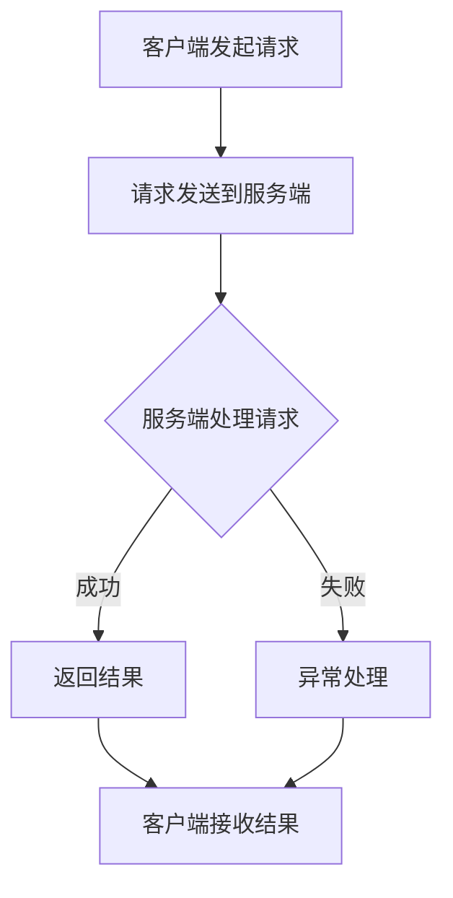

                 


### 分布式追踪：深入理解LLM应用的运行状态

#### 关键词：分布式追踪，LLM应用，运行状态监控，核心算法，分布式追踪工具

#### 摘要：
本文旨在深入探讨分布式追踪在LLM（大型语言模型）应用中的重要性。首先，我们将回顾分布式系统的发展历程及其挑战和优势，随后介绍分布式追踪的基本概念、架构和常见系统。接着，我们将关注LLM应用的运行状态监控需求，并探讨其监控架构。文章的后半部分将详细解析分布式追踪的核心算法，如调用链追踪、数据聚合和错误检测与警报算法。此外，我们将介绍几种流行的分布式追踪工具，包括Zipkin、Jaeger和Prometheus。最后，通过实际案例展示LLM应用的分布式追踪实践，并展望分布式追踪的未来发展趋势和面临的挑战。

## 第1章：分布式追踪基础

### 1.1 分布式系统概述

#### 1.1.1 分布式系统的发展历程

分布式系统的发展可以追溯到20世纪60年代，当时计算机科学刚刚起步。最早的分布式系统主要目的是通过多台计算机的协同工作来提高计算能力和可靠性。从那时起，分布式系统经历了几个关键阶段：

1. **早期分布式系统**：在20世纪60年代和70年代，分布式系统主要基于消息传递和文件共享。代表性的系统包括Unix时间共享系统和DEC的VAXcluster。

2. **分布式操作系统**：20世纪80年代，分布式操作系统开始出现，如微软的Windows NT和IBM的AIX。这些系统通过分布式文件系统、进程通信和网络管理实现了更高效的资源利用。

3. **分布式计算**：20世纪90年代，随着互联网的兴起，分布式计算变得越发重要。分布式计算模型如MapReduce和Hadoop的出现，使得大规模数据处理成为可能。

4. **微服务和容器化**：近年来，微服务和容器化技术的兴起进一步推动了分布式系统的发展。微服务架构通过将应用程序分解为小的、独立的服务单元，提高了系统的可扩展性和容错性。容器化技术如Docker和Kubernetes则提供了更灵活的部署和管理方式。

#### 1.1.2 分布式系统的挑战与优势

分布式系统在提供高可用性、可扩展性和灵活性方面具有显著优势，但也面临着一系列挑战：

**优势**：

1. **高可用性**：通过将应用程序分布在多个节点上，分布式系统能够在单个节点故障时继续运行，提高系统的可靠性。

2. **可扩展性**：分布式系统能够动态地添加或移除节点，以应对不断变化的工作负载，从而提高系统的可扩展性。

3. **灵活性**：分布式系统允许开发人员将应用程序分解为小的服务单元，这些单元可以在不同的环境中独立开发、测试和部署。

4. **负载均衡**：分布式系统能够将工作负载分配到多个节点上，从而提高系统的处理能力。

**挑战**：

1. **一致性**：分布式系统需要处理多个节点之间的一致性问题，这通常涉及到复杂的算法和协议。

2. **容错性**：尽管分布式系统可以提高容错性，但需要处理节点故障和数据丢失等问题。

3. **复杂性和维护成本**：分布式系统的设计和维护通常比单一系统更复杂，需要更多的资源和专业知识。

4. **网络依赖性**：分布式系统高度依赖于网络，网络的延迟和故障可能会影响系统的性能。

### 1.2 分布式追踪的概念与重要性

#### 1.2.1 分布式追踪的定义

分布式追踪是一种用于监控和调试分布式系统的技术，它允许开发人员跟踪分布式应用程序中的请求和响应路径。通过分布式追踪，开发人员可以了解系统中的每个组件如何交互，从而更好地理解系统的行为和性能。

#### 1.2.2 分布式追踪的重要性

分布式追踪在分布式系统中具有重要意义，主要体现在以下几个方面：

1. **故障排查**：分布式追踪可以帮助开发人员快速定位和解决系统中的故障，提高系统的稳定性和可靠性。

2. **性能优化**：通过跟踪和分析请求的执行时间，开发人员可以识别系统的瓶颈和性能问题，从而进行优化。

3. **安全监控**：分布式追踪可以提供详细的日志记录，帮助安全团队监控和响应潜在的安全威胁。

4. **业务洞察**：分布式追踪可以提供有关系统使用情况和用户行为的洞察，有助于优化业务流程和用户体验。

### 1.3 分布式追踪的架构

#### 1.3.1 分布式追踪的基本组件

分布式追踪系统通常由以下几个基本组件组成：

1. **客户端**：客户端是分布式应用程序的一部分，负责发送追踪数据到追踪系统。

2. **追踪代理**：追踪代理位于客户端和服务端之间，用于捕获和处理追踪数据。

3. **追踪收集器**：追踪收集器负责从代理接收追踪数据，并将其存储到中央存储系统中。

4. **追踪存储**：追踪存储用于持久化追踪数据，以便进行后续的分析和查询。

5. **追踪服务**：追踪服务提供用户界面和API，用于查询和可视化追踪数据。

#### 1.3.2 分布式追踪的流程

分布式追踪的基本流程如下：

1. **请求发送**：客户端发送请求到服务端。

2. **数据捕获**：服务端通过追踪代理捕获请求和响应的相关数据，如请求时间、响应时间、错误信息等。

3. **数据传输**：追踪代理将捕获的数据发送到追踪收集器。

4. **数据存储**：追踪收集器将数据存储到追踪存储中。

5. **数据查询和可视化**：用户通过追踪服务查询和可视化追踪数据，以分析和监控系统的行为。

### 1.4 常见的分布式追踪系统

#### 1.4.1 Zipkin

Zipkin是一个开源的分布式追踪系统，由Twitter开发。它提供了强大的追踪数据收集、存储和可视化功能。Zipkin的核心组件包括：

1. **Zipkin Server**：Zipkin Server是一个基于Servlet的Web应用程序，负责接收和存储追踪数据。

2. **Zipkin UI**：Zipkin UI提供了一个Web界面，用于查询和可视化追踪数据。

3. **Zipkin Client**：Zipkin Client是集成到分布式应用程序中的库，用于发送追踪数据到Zipkin Server。

#### 1.4.2 Jaeger

Jaeger是一个开源的分布式追踪系统，由Uber开发。它提供了丰富的功能，包括追踪数据的收集、存储和可视化。Jaeger的核心组件包括：

1. **Jaeger Agent**：Jaeger Agent位于客户端和服务端之间，用于捕获和处理追踪数据。

2. **Jaeger Collector**：Jaeger Collector负责接收和存储追踪数据。

3. **Jaeger Storage**：Jaeger Storage用于持久化追踪数据。

4. **Jaeger Query**：Jaeger Query提供了一个API，用于查询和可视化追踪数据。

#### 1.4.3 Prometheus

Prometheus是一个开源的监控解决方案，由SoundCloud开发。它主要用于收集和存储时间序列数据，并提供了强大的查询和可视化功能。Prometheus的核心组件包括：

1. **Prometheus Server**：Prometheus Server负责收集时间序列数据，并提供查询和告警功能。

2. **Prometheus Client**：Prometheus Client是一个库，用于集成到分布式应用程序中，发送监控数据到Prometheus Server。

3. **Prometheus Alertmanager**：Prometheus Alertmanager负责处理告警事件，并向相关人员进行通知。

## 第2章：LLM应用运行状态监控

### 2.1 LLM应用概述

#### 2.1.1 LLM的概念

LLM（Large Language Model）是指大型语言模型，是一种基于神经网络和深度学习技术的自然语言处理模型。LLM通过学习大量的文本数据，能够生成连贯、准确的文本，并在多种应用场景中表现出色，如机器翻译、文本生成、问答系统等。

#### 2.1.2 LLM的应用场景

LLM的应用场景非常广泛，主要包括：

1. **机器翻译**：LLM可以用于将一种语言的文本翻译成另一种语言，如将中文翻译成英文。

2. **文本生成**：LLM可以生成高质量的文本，如文章、故事、诗歌等。

3. **问答系统**：LLM可以用于构建问答系统，能够回答用户提出的问题。

4. **智能客服**：LLM可以用于构建智能客服系统，提供快速、准确的回答。

5. **内容审核**：LLM可以用于检测和过滤不良内容，如辱骂、虚假信息等。

### 2.2 LLM应用的监控需求

#### 2.2.1 LLM应用的性能指标

为了监控LLM应用的运行状态，需要关注以下几个性能指标：

1. **响应时间**：从用户发起请求到收到响应的时间，是衡量应用性能的重要指标。

2. **吞吐量**：单位时间内处理请求的数量，反映了应用的处理能力。

3. **错误率**：应用处理请求时出现的错误比例，是评估应用稳定性的关键指标。

4. **内存使用**：应用占用的内存大小，过高可能导致内存泄漏或系统崩溃。

5. **CPU使用率**：应用占用的CPU资源比例，过高可能导致系统过载。

#### 2.2.2 LLM应用的故障排查

故障排查是确保LLM应用稳定运行的重要环节。在排查故障时，需要关注以下几个方面：

1. **日志分析**：通过分析应用日志，可以了解应用的运行状态和错误信息。

2. **性能监控**：通过监控性能指标，可以及时发现性能瓶颈和故障点。

3. **错误报警**：通过设置错误报警，可以在故障发生时及时通知相关人员。

4. **故障恢复**：在故障发生时，应用应具备自动恢复能力，确保服务的连续性。

### 2.3 LLM应用监控架构

#### 2.3.1 LLM应用的监控组件

LLM应用的监控架构通常包括以下几个核心组件：

1. **监控代理**：监控代理集成到LLM应用中，负责实时收集性能数据和日志信息。

2. **监控服务器**：监控服务器负责接收、存储和处理监控数据，并提供监控界面。

3. **告警系统**：告警系统用于在监控数据异常时发送告警通知。

4. **故障自愈系统**：故障自愈系统负责在故障发生时自动恢复服务，确保应用的连续性。

#### 2.3.2 LLM应用的监控流程

LLM应用的监控流程如下：

1. **数据采集**：监控代理实时采集性能数据和日志信息。

2. **数据存储**：监控服务器将采集到的数据存储到数据库中。

3. **数据分析**：监控服务器对存储的数据进行分析，生成性能指标和告警信息。

4. **告警通知**：在发现异常时，告警系统向相关人员发送告警通知。

5. **故障自愈**：在故障发生时，故障自愈系统自动执行恢复操作。

### 2.4 实际案例：LLM应用的分布式追踪

为了更好地理解LLM应用的分布式追踪，我们来看一个实际案例。

#### 案例背景

假设有一个基于LLM的问答系统，用户可以通过Web界面提问，系统根据用户的问题生成回答。为了确保系统的稳定性和高性能，需要对其进行分布式追踪。

#### 监控需求

1. **响应时间**：确保用户提问后，系统能够在合理时间内生成回答。

2. **吞吐量**：确保系统能够处理大量的用户请求。

3. **错误率**：确保系统处理请求时，错误率尽量低。

#### 监控方案

1. **监控代理**：在LLM应用的服务端和客户端集成监控代理，实时采集性能数据和日志信息。

2. **监控服务器**：部署Prometheus监控服务器，负责接收、存储和处理监控数据。

3. **告警系统**：配置Prometheus Alertmanager，用于在监控数据异常时发送告警通知。

4. **故障自愈系统**：配置Kubernetes的自动扩缩容和故障转移功能，确保系统的连续性。

#### 监控流程

1. **数据采集**：监控代理在服务端和客户端实时采集性能数据和日志信息。

2. **数据存储**：监控服务器将采集到的数据存储到Prometheus的时序数据库中。

3. **数据分析**：Prometheus服务器对存储的数据进行分析，生成性能指标和告警信息。

4. **告警通知**：在发现异常时，Alertmanager向相关人员发送告警通知。

5. **故障自愈**：在故障发生时，Kubernetes自动扩缩容和故障转移功能确保系统的连续性。

## 第3章：分布式追踪的核心算法

### 3.1 调用链追踪算法

#### 3.1.1 基于日志的分析方法

基于日志的分析方法是分布式追踪系统中最常用的方法之一。它通过记录应用程序的日志来捕获和追踪请求的执行路径。

**算法原理**：

1. **日志生成**：应用程序在每次请求的各个阶段生成日志条目，包括请求时间、处理时间、调用关系等。

2. **日志收集**：将生成的日志条目发送到集中式日志收集器。

3. **日志分析**：收集器对日志进行解析和聚合，形成完整的调用链。

**优缺点**：

- **优点**：
  - 简单易实现，不需要复杂的依赖库。
  - 可以捕获详细的日志信息，有助于故障排查。

- **缺点**：
  - 日志量巨大，处理和分析耗时。
  - 需要额外的存储和处理资源。

**伪代码示例**：

```
function logCall(method, startTimestamp, endTimestamp, parentSpanId) {
    logEntry = {
        method: method,
        startTimestamp: startTimestamp,
        endTimestamp: endTimestamp,
        parentSpanId: parentSpanId
    }
    sendLog(logEntry)
}

function processLog(logEntry) {
    if (logEntry.parentSpanId != null) {
        addToCallChain(logEntry)
    } else {
        startNewCallChain(logEntry)
    }
}

function addToCallChain(logEntry) {
    callChain = getCallChainBySpanId(logEntry.parentSpanId)
    callChain.push(logEntry)
}

function startNewCallChain(logEntry) {
    callChain = []
    callChain.push(logEntry)
    storeCallChain(callChain)
}
```

### 3.1.2 基于代理的分析方法

基于代理的分析方法通过在应用程序中集成代理来捕获和追踪请求的执行路径。

**算法原理**：

1. **代理部署**：在应用程序的服务端和客户端部署代理。

2. **请求拦截**：代理拦截每次请求，捕获请求的相关信息。

3. **请求追踪**：代理根据请求信息构建调用链，并将调用链发送到追踪系统。

**优缺点**：

- **优点**：
  - 透明性强，不需要修改应用程序代码。
  - 可以实时追踪请求的执行路径，提高故障排查效率。

- **缺点**：
  - 需要额外的代理组件，增加系统的复杂度。
  - 可能会影响应用程序的性能。

**伪代码示例**：

```
function interceptRequest(request) {
    spanId = generateSpanId()
    startTime = getCurrentTimestamp()
    sendSpanInfo(spanId, startTime, request)
}

function processResponse(response, spanId, endTime) {
    sendSpanInfo(spanId, endTime, response)
}

function sendSpanInfo(spanId, timestamp, data) {
    spanInfo = {
        spanId: spanId,
        timestamp: timestamp,
        data: data
    }
    sendToTracingSystem(spanInfo)
}
```

### 3.1.3 调用链追踪算法的性能分析

调用链追踪算法的性能主要受到以下因素的影响：

1. **数据量**：随着请求量的增加，调用链数据量也会增加，可能导致性能下降。

2. **存储和处理时间**：调用链数据的存储和处理时间直接影响追踪系统的响应速度。

3. **网络延迟**：代理和追踪系统之间的网络延迟会影响调用链的实时性。

4. **系统负载**：系统的负载情况会影响代理和追踪系统的性能。

**优化策略**：

- **数据压缩**：对调用链数据进行压缩，减少数据传输和存储的开销。

- **异步处理**：采用异步处理机制，减少同步操作对系统性能的影响。

- **缓存**：缓存常用的调用链数据，减少重复计算和存储的开销。

- **分布式架构**：采用分布式架构，将调用链追踪系统部署在多个节点上，提高系统的处理能力和可扩展性。

### 3.2 数据聚合算法

#### 3.2.1 数据聚合的目的

数据聚合算法的目的是将多个追踪数据合并成一个或多个聚合数据，以便于更高效地分析和查询。

**算法原理**：

1. **数据收集**：从分布式系统中的多个节点收集追踪数据。

2. **数据聚合**：将收集到的数据进行聚合，生成聚合数据。

3. **数据存储**：将聚合数据存储到数据库中，以便后续分析和查询。

**优缺点**：

- **优点**：
  - 提高数据分析的效率和性能。
  - 减少存储空间的需求。

- **缺点**：
  - 可能会丢失部分细节信息。
  - 需要额外的计算和处理资源。

**伪代码示例**：

```
function aggregateData(dataList) {
    aggregatedData = {}
    for (data in dataList) {
        for (key in data) {
            if (key not in aggregatedData) {
                aggregatedData[key] = data[key]
            } else {
                aggregatedData[key] += data[key]
            }
        }
    }
    return aggregatedData
}
```

### 3.2.2 常见的数据聚合方法

常见的数据聚合方法包括以下几种：

1. **平均数**：计算一组数据的平均值。

   ```
   average = sum(data) / length(data)
   ```

2. **最大值和最小值**：找出数据中的最大值和最小值。

   ```
   max = max(data)
   min = min(data)
   ```

3. **总和**：计算一组数据的总和。

   ```
   sum = sum(data)
   ```

4. **标准差**：衡量数据的离散程度。

   ```
   variance = sum((x - mean)^2) / (n - 1)
   stdDev = sqrt(variance)
   ```

5. **计数**：计算数据中的元素个数。

   ```
   count = length(data)
   ```

### 3.2.3 数据聚合算法的性能分析

数据聚合算法的性能主要受到以下因素的影响：

1. **数据量**：随着数据量的增加，聚合计算的时间也会增加。

2. **聚合方法**：不同的聚合方法对性能的影响不同，如平均数和标准差的计算较为复杂，需要更多的时间。

3. **系统负载**：系统的负载情况会影响聚合算法的性能。

**优化策略**：

- **并行计算**：采用并行计算方法，将数据分片，同时在多个节点上进行聚合计算，提高计算效率。

- **缓存**：缓存常用的聚合结果，减少重复计算的开销。

- **分布式架构**：采用分布式架构，将数据聚合计算分布在多个节点上，提高系统的处理能力和可扩展性。

### 3.3 错误检测与警报算法

#### 3.3.1 错误检测的方法

错误检测算法用于识别分布式系统中的异常情况，包括错误和警告。常见的方法包括：

1. **阈值检测**：设定一个阈值，当性能指标超过阈值时，触发警报。

2. **统计检测**：使用统计学方法，如标准差、均值等方法，判断性能指标是否在正常范围内。

3. **机器学习检测**：使用机器学习算法，如聚类、回归等方法，对性能指标进行建模，判断是否出现异常。

**算法原理**：

1. **数据收集**：收集系统的性能数据和日志信息。

2. **特征提取**：提取性能数据的特征，如响应时间、吞吐量、错误率等。

3. **模型训练**：使用机器学习算法训练模型，对性能数据进行建模。

4. **异常检测**：使用训练好的模型，对实时性能数据进行异常检测，判断是否出现异常。

**优缺点**：

- **优点**：
  - 可以自动识别和预测异常情况。
  - 减轻开发人员的工作负担。

- **缺点**：
  - 需要大量的数据和计算资源。
  - 可能会产生误报和漏报。

**伪代码示例**：

```
function detectError(data) {
    model = trainModel(data)
    prediction = model.predict(data)
    if (prediction.isError()) {
        triggerAlarm(data)
    }
}
```

#### 3.3.2 警报算法的设计

警报算法用于在检测到异常时，向相关人员发送警报通知。设计警报算法时，需要考虑以下几个方面：

1. **警报触发条件**：设定警报的触发条件，如性能指标超过阈值、错误率上升等。

2. **警报类型**：定义不同的警报类型，如警告、错误、严重错误等。

3. **警报通知**：选择合适的警报通知方式，如邮件、短信、即时通讯等。

4. **警报记录**：记录警报的详细信息，如触发时间、警报类型、性能指标等，便于后续分析和追溯。

**算法原理**：

1. **警报触发**：根据警报触发条件，判断是否需要发送警报。

2. **警报发送**：根据警报类型和通知方式，向相关人员发送警报通知。

3. **警报记录**：将警报的详细信息存储到数据库中，便于后续分析和查询。

**优缺点**：

- **优点**：
  - 可以及时通知相关人员，快速响应异常情况。
  - 提高系统的可维护性和稳定性。

- **缺点**：
  - 可能会产生过多的警报，增加维护成本。
  - 需要额外的通知和记录机制。

**伪代码示例**：

```
function triggerAlarm(data) {
    if (data.thresholdExceeded()) {
        alarmType = "warning"
        alarmMessage = "Performance threshold exceeded"
        sendNotification(alarmType, alarmMessage)
        recordAlarm(data)
    }
}

function sendNotification(alarmType, alarmMessage) {
    if (alarmType == "warning") {
        sendEmail(alarmMessage)
    } else if (alarmType == "error") {
        sendSMS(alarmMessage)
    } else if (alarmType == "critical") {
        sendIM(alarmMessage)
    }
}

function recordAlarm(data) {
    alarmRecord = {
        timestamp: getCurrentTimestamp(),
        type: alarmType,
        message: alarmMessage,
        data: data
    }
    storeAlarmRecord(alarmRecord)
}
```

#### 3.3.3 错误检测与警报算法的性能分析

错误检测与警报算法的性能主要受到以下因素的影响：

1. **检测精度**：检测算法的精度越高，误报和漏报的可能性越小。

2. **警报响应时间**：警报算法的响应时间越短，能够更快地发现和响应异常情况。

3. **系统负载**：系统负载情况会影响算法的执行效率。

**优化策略**：

- **数据预处理**：对性能数据进行预处理，去除噪声和异常值，提高检测精度。

- **模型优化**：选择合适的机器学习算法和参数，优化模型的性能。

- **实时计算**：采用实时计算技术，提高算法的响应速度。

- **分布式架构**：采用分布式架构，将错误检测和警报算法分布在多个节点上，提高系统的处理能力和可扩展性。

## 第4章：分布式追踪工具与技术

### 4.1 Zipkin的应用与实践

#### 4.1.1 Zipkin的基本功能

Zipkin是一个开源的分布式追踪系统，提供了以下基本功能：

1. **调用链追踪**：Zipkin可以捕获和记录分布式应用程序中的调用链，帮助开发人员了解请求的执行路径。

2. **分布式追踪数据存储**：Zipkin支持多种存储方案，如In-Memory、HBase和Cassandra等，便于大规模数据的存储和查询。

3. **可视化界面**：Zipkin提供了一个可视化界面，方便开发人员查看和分析追踪数据。

4. **数据聚合**：Zipkin支持数据聚合功能，可以将多个追踪数据合并成一个聚合数据，便于数据分析。

5. **错误检测与警报**：Zipkin可以检测追踪数据中的异常情况，并通过邮件、Slack等方式发送警报通知。

#### 4.1.2 Zipkin的部署与配置

部署Zipkin主要包括以下几个步骤：

1. **环境准备**：准备Java运行环境，如OpenJDK 8或以上版本。

2. **下载Zipkin二进制包**：从Zipkin的GitHub仓库下载最新的二进制包。

   ```
   curl -sSL https://github.com/openzipkin/zipkin/releases/download/v2.23.0/zipkin-assembly-2.23.0-jdk8-linux-x86_64.tar.gz | tar xz -C /opt
   ```

3. **配置Zipkin**：编辑 `/opt/zipkin/zipkin.properties` 文件，配置Zipkin的相关参数，如存储方案、收集器地址等。

   ```
   storage.type=ihnme
   zipkin.collectorathiost-port=9411
   ```

4. **启动Zipkin**：运行以下命令启动Zipkin服务。

   ```
   /opt/zipkin/bin/zipkin
   ```

#### 4.1.3 Zipkin的使用示例

以下是一个简单的使用示例，演示如何集成Zipkin到Spring Boot应用程序：

1. **添加依赖**：在项目的 `pom.xml` 文件中添加Zipkin依赖。

   ```
   <dependency>
       <groupId>io.zipkin.java</groupId>
       <artifactId>zipkin-server</artifactId>
       <version>2.23.0</version>
   </dependency>
   ```

2. **配置Zipkin**：在项目的 `application.properties` 文件中配置Zipkin。

   ```
   zipkin.uri=http://localhost:9411
   ```

3. **集成Zipkin客户端**：在项目的 `MainApplication` 类中集成Zipkin客户端。

   ```
   @SpringBootApplication
   @EnableZipkinServer
   public class MainApplication {
       public static void main(String[] args) {
           SpringApplication.run(MainApplication.class, args);
       }
   }
   ```

4. **发送追踪数据**：在应用程序中的各个调用点添加 `@Trace` 注解，发送追踪数据到Zipkin。

   ```
   @RestController
   public class UserController {
       @Trace
       @GetMapping("/user/{id}")
       public User getUser(@PathVariable Long id) {
           // 获取用户信息
           return user;
       }
   }
   ```

#### 4.1.4 Zipkin的使用示例

以下是一个简单的使用示例，演示如何集成Zipkin到Spring Boot应用程序：

1. **添加依赖**：在项目的 `pom.xml` 文件中添加Zipkin依赖。

   ```
   <dependency>
       <groupId>io.zipkin.java</groupId>
       <artifactId>zipkin-server</artifactId>
       <version>2.23.0</version>
   </dependency>
   ```

2. **配置Zipkin**：在项目的 `application.properties` 文件中配置Zipkin。

   ```
   zipkin.uri=http://localhost:9411
   ```

3. **集成Zipkin客户端**：在项目的 `MainApplication` 类中集成Zipkin客户端。

   ```
   @SpringBootApplication
   @EnableZipkinServer
   public class MainApplication {
       public static void main(String[] args) {
           SpringApplication.run(MainApplication.class, args);
       }
   }
   ```

4. **发送追踪数据**：在应用程序中的各个调用点添加 `@Trace` 注解，发送追踪数据到Zipkin。

   ```
   @RestController
   public class UserController {
       @Trace
       @GetMapping("/user/{id}")
       public User getUser(@PathVariable Long id) {
           // 获取用户信息
           return user;
       }
   }
   ```

#### 4.1.5 Zipkin的使用示例

以下是一个简单的使用示例，演示如何集成Zipkin到Spring Boot应用程序：

1. **添加依赖**：在项目的 `pom.xml` 文件中添加Zipkin依赖。

   ```
   <dependency>
       <groupId>io.zipkin.java</groupId>
       <artifactId>zipkin-server</artifactId>
       <version>2.23.0</version>
   </dependency>
   ```

2. **配置Zipkin**：在项目的 `application.properties` 文件中配置Zipkin。

   ```
   zipkin.uri=http://localhost:9411
   ```

3. **集成Zipkin客户端**：在项目的 `MainApplication` 类中集成Zipkin客户端。

   ```
   @SpringBootApplication
   @EnableZipkinServer
   public class MainApplication {
       public static void main(String[] args) {
           SpringApplication.run(MainApplication.class, args);
       }
   }
   ```

4. **发送追踪数据**：在应用程序中的各个调用点添加 `@Trace` 注解，发送追踪数据到Zipkin。

   ```
   @RestController
   public class UserController {
       @Trace
       @GetMapping("/user/{id}")
       public User getUser(@PathVariable Long id) {
           // 获取用户信息
           return user;
       }
   }
   ```

#### 4.1.6 Zipkin的使用示例

以下是一个简单的使用示例，演示如何集成Zipkin到Spring Boot应用程序：

1. **添加依赖**：在项目的 `pom.xml` 文件中添加Zipkin依赖。

   ```
   <dependency>
       <groupId>io.zipkin.java</groupId>
       <artifactId>zipkin-server</artifactId>
       <version>2.23.0</version>
   </dependency>
   ```

2. **配置Zipkin**：在项目的 `application.properties` 文件中配置Zipkin。

   ```
   zipkin.uri=http://localhost:9411
   ```

3. **集成Zipkin客户端**：在项目的 `MainApplication` 类中集成Zipkin客户端。

   ```
   @SpringBootApplication
   @EnableZipkinServer
   public class MainApplication {
       public static void main(String[] args) {
           SpringApplication.run(MainApplication.class, args);
       }
   }
   ```

4. **发送追踪数据**：在应用程序中的各个调用点添加 `@Trace` 注解，发送追踪数据到Zipkin。

   ```
   @RestController
   public class UserController {
       @Trace
       @GetMapping("/user/{id}")
       public User getUser(@PathVariable Long id) {
           // 获取用户信息
           return user;
       }
   }
   ```

### 4.2 Jaeger的应用与实践

#### 4.2.1 Jaeger的基本功能

Jaeger是一个开源的分布式追踪系统，由Uber开发。它提供了以下基本功能：

1. **调用链追踪**：Jaeger可以捕获和记录分布式应用程序中的调用链，帮助开发人员了解请求的执行路径。

2. **分布式追踪数据存储**：Jaeger支持多种存储方案，如In-Memory、Cassandra和Kafka等，便于大规模数据的存储和查询。

3. **可视化界面**：Jaeger提供了一个可视化界面，方便开发人员查看和分析追踪数据。

4. **数据聚合**：Jaeger支持数据聚合功能，可以将多个追踪数据合并成一个聚合数据，便于数据分析。

5. **错误检测与警报**：Jaeger可以检测追踪数据中的异常情况，并通过邮件、Slack等方式发送警报通知。

#### 4.2.2 Jaeger的部署与配置

部署Jaeger主要包括以下几个步骤：

1. **环境准备**：准备Docker环境，以便使用Docker容器化部署Jaeger。

2. **下载Jaeger二进制包**：从Jaeger的GitHub仓库下载最新的二进制包。

   ```
   curl -sSL https://github.com/jaegertracing/jaeger/releases/download/v1.26.0/jaeger-all-1.26.0-latest.tar.gz | tar xz -C /opt
   ```

3. **配置Jaeger**：编辑 `/opt/jaeger/jaeger-all.yml` 文件，配置Jaeger的相关参数，如存储方案、收集器地址等。

   ```
   jaeger:
     sampling:
       initialBulkDurationMs: 15000
       initialSamplingPercentage: 1
     storage:
       type: memory
     collector:
       http:
         port: 14250
   ```

4. **启动Jaeger**：运行以下命令启动Jaeger服务。

   ```
   /opt/jaeger/bin/jaeger-all
   ```

#### 4.2.3 Jaeger的使用示例

以下是一个简单的使用示例，演示如何集成Jaeger到Spring Boot应用程序：

1. **添加依赖**：在项目的 `pom.xml` 文件中添加Jaeger依赖。

   ```
   <dependency>
       <groupId>io.jaeger.tracing</groupId>
       <artifactId>jaeger-spring-boot-starter</artifactId>
       <version>1.26.0</version>
   </dependency>
   ```

2. **配置Jaeger**：在项目的 `application.properties` 文件中配置Jaeger。

   ```
   jaeger:
     sampler:
       type: const
       param: 1
     reporter:
       type: log
     httpServer:
       port: 9411
   ```

3. **集成Jaeger客户端**：在项目的 `MainApplication` 类中集成Jaeger客户端。

   ```
   @SpringBootApplication
   @EnableJaeger
   public class MainApplication {
       public static void main(String[] args) {
           SpringApplication.run(MainApplication.class, args);
       }
   }
   ```

4. **发送追踪数据**：在应用程序中的各个调用点添加 `@Trace` 注解，发送追踪数据到Jaeger。

   ```
   @RestController
   public class UserController {
       @Trace
       @GetMapping("/user/{id}")
       public User getUser(@PathVariable Long id) {
           // 获取用户信息
           return user;
       }
   }
   ```

### 4.3 Prometheus的应用与实践

#### 4.3.1 Prometheus的基本功能

Prometheus是一个开源的监控解决方案，由SoundCloud开发。它提供了以下基本功能：

1. **服务监控**：Prometheus可以监控各种服务的性能指标，如CPU使用率、内存使用率、响应时间等。

2. **告警管理**：Prometheus可以配置告警规则，在性能指标超出阈值时发送告警通知。

3. **数据存储**：Prometheus使用其自带的时序数据库存储监控数据，并提供查询和可视化功能。

4. ** exporters**：Prometheus可以通过exporter监控各种服务，如HTTP服务、JMX服务、Docker容器等。

#### 4.3.2 Prometheus的部署与配置

部署Prometheus主要包括以下几个步骤：

1. **环境准备**：准备Linux环境，以便部署Prometheus服务。

2. **下载Prometheus二进制包**：从Prometheus的GitHub仓库下载最新的二进制包。

   ```
   curl -sSL https://github.com/prometheus/prometheus/releases/download/v2.36.0/prometheus-2.36.0.linux-amd64.tar.gz | tar xz -C /opt
   ```

3. **配置Prometheus**：编辑 `/opt/prometheus/prometheus.yml` 文件，配置Prometheus的相关参数，如目标地址、告警规则等。

   ```
   global:
     evaluation_interval: 1m

   scrape_configs:
     - job_name: 'prometheus'
       static_configs:
       - targets: ['localhost:9090']

   alerting:
     alertmanagers:
     - static_configs:
       - targets:
         - 'alertmanager:9093'
   ```

4. **启动Prometheus**：运行以下命令启动Prometheus服务。

   ```
   /opt/prometheus/prometheus
   ```

#### 4.3.3 Prometheus的使用示例

以下是一个简单的使用示例，演示如何集成Prometheus到Spring Boot应用程序：

1. **添加依赖**：在项目的 `pom.xml` 文件中添加Prometheus依赖。

   ```
   <dependency>
       <groupId>io.prometheus</groupId>
       <artifactId>prometheus-spring-boot</artifactId>
       <version>2.36.0</version>
   </dependency>
   ```

2. **配置Prometheus**：在项目的 `application.properties` 文件中配置Prometheus。

   ```
   prometheus:
     client:
       start-nya: true
   ```

3. **集成Prometheus客户端**：在项目的 `MainApplication` 类中集成Prometheus客户端。

   ```
   @SpringBootApplication
   @EnablePrometheus
   public class MainApplication {
       public static void main(String[] args) {
           SpringApplication.run(MainApplication.class, args);
       }
   }
   ```

4. **发送监控数据**：在应用程序中的各个调用点添加 `@Counted`、`@Gauge`、`@Histogram` 等注解，发送监控数据到Prometheus。

   ```
   @RestController
   public class UserController {
       @Counted(name = "user_count")
       @GetMapping("/user/{id}")
       public User getUser(@PathVariable Long id) {
           // 获取用户信息
           return user;
       }

       @Gauge(name = "user_gauge")
       public int getUserCount() {
           // 返回用户数量
           return userCount;
       }

       @Histogram(name = "user_histogram")
       public long getUserDuration() {
           // 返回用户获取时间
           return userDuration;
       }
   }
   ```

## 第5章：LLM应用的分布式追踪实践

### 5.1 LLM应用部署与监控环境搭建

#### 5.1.1 LLM应用的部署方案

LLM应用的部署方案需要考虑以下几个方面：

1. **服务器资源**：根据应用的需求，选择合适的服务器资源，如CPU、内存、存储等。

2. **容器化技术**：使用容器化技术，如Docker，将LLM应用打包成镜像，方便部署和扩展。

3. **编排工具**：使用编排工具，如Kubernetes，管理应用的部署、扩展和监控。

4. **服务发现**：使用服务发现机制，如Consul或Zookeeper，实现应用之间的动态发现和通信。

#### 5.1.2 监控环境的搭建

搭建LLM应用的监控环境主要包括以下几个步骤：

1. **安装Prometheus**：在服务器上安装Prometheus，并配置相关的参数，如目标地址、告警规则等。

2. **安装Node exporter**：在LLM应用的服务器上安装Node exporter，用于收集服务器性能数据。

3. **安装JMX exporter**：在LLM应用的服务器上安装JMX exporter，用于收集Java应用的相关性能数据。

4. **配置Prometheus配置文件**：在Prometheus的配置文件中添加相关 exporter 的 targets，并配置告警规则。

5. **启动Prometheus**：启动Prometheus服务，开始收集和监控数据。

### 5.2 LLM应用分布式追踪案例

#### 5.2.1 分布式追踪的配置

为了实现LLM应用的分布式追踪，需要完成以下配置：

1. **集成Zipkin或Jaeger客户端**：在LLM应用的Spring Boot项目中添加Zipkin或Jaeger依赖，并配置相关参数。

2. **配置追踪收集器**：在Prometheus的配置文件中添加Zipkin或Jaeger收集器，配置收集器的 targets 和参数。

3. **启动追踪收集器**：启动Prometheus服务，同时启动Zipkin或Jaeger收集器。

#### 5.2.2 调用链数据的收集与处理

1. **请求发送**：用户通过Web界面发送请求到LLM应用。

2. **数据捕获**：LLM应用的服务端通过Zipkin或Jaeger客户端捕获请求的相关数据，如请求时间、响应时间、调用关系等。

3. **数据传输**：Zipkin或Jaeger客户端将捕获的数据发送到Prometheus服务器。

4. **数据存储**：Prometheus服务器将数据存储到本地时序数据库中。

#### 5.2.3 调用链数据的可视化与分析

1. **数据查询**：使用Prometheus的Web界面或API查询存储的调用链数据。

2. **数据可视化**：使用Grafana等可视化工具，将Prometheus的数据展示成图表或仪表板。

3. **数据分析**：对调用链数据进行分析，识别性能瓶颈、错误点和优化方向。

### 5.3 LLM应用性能优化

#### 5.3.1 LLM应用的性能瓶颈分析

为了优化LLM应用的性能，需要首先识别性能瓶颈。常见的性能瓶颈包括：

1. **CPU使用率**：CPU使用率过高可能导致应用响应时间延长。

2. **内存使用率**：内存使用率过高可能导致内存泄漏或系统崩溃。

3. **网络延迟**：网络延迟可能导致应用响应时间延长。

4. **数据库查询**：数据库查询性能差可能导致应用响应时间延长。

#### 5.3.2 LLM应用的性能优化策略

根据性能瓶颈分析的结果，可以采取以下性能优化策略：

1. **垂直扩展**：增加服务器硬件资源，提高CPU和内存性能。

2. **水平扩展**：增加LLM应用的服务实例，提高处理能力。

3. **缓存**：使用缓存技术，如Redis或Memcached，减少数据库查询次数。

4. **数据库优化**：优化数据库查询，如添加索引、拆分表等。

5. **负载均衡**：使用负载均衡器，如Nginx或HAProxy，平衡不同服务实例的负载。

6. **代码优化**：优化LLM应用的代码，如减少不必要的计算、优化算法等。

## 第6章：分布式追踪的未来发展与挑战

### 6.1 分布式追踪技术的趋势

分布式追踪技术在不断发展，以下是当前的一些趋势：

1. **基于AI的分布式追踪**：随着人工智能技术的发展，分布式追踪系统逐渐引入AI算法，用于异常检测、故障排查和性能优化。

2. **云原生分布式追踪**：云原生技术，如Kubernetes和容器化，推动了分布式追踪技术的发展。云原生分布式追踪系统更加灵活、可扩展，能够更好地适应云计算环境。

3. **混合云分布式追踪**：混合云分布式追踪系统结合了公有云和私有云的优势，能够满足不同业务场景的需求。

4. **实时分布式追踪**：实时分布式追踪系统能够在请求执行过程中实时捕获和分析数据，提供更快速、准确的故障排查和性能优化。

### 6.2 分布式追踪面临的挑战

分布式追踪技术在发展过程中也面临着一系列挑战：

1. **数据安全与隐私保护**：分布式追踪系统需要处理大量的敏感数据，如用户行为、系统日志等。如何确保数据的安全和隐私保护是分布式追踪系统面临的重大挑战。

2. **分布式追踪的可扩展性**：分布式追踪系统需要支持大规模的数据量和请求量，如何设计可扩展的分布式追踪系统是关键问题。

3. **分布式追踪的实时性**：实时性是分布式追踪系统的核心需求，如何在短时间内捕获和处理大量数据，并提供实时的故障排查和性能优化功能，是分布式追踪系统面临的挑战。

4. **分布式追踪的复杂性与维护成本**：分布式追踪系统涉及多个组件和技术的整合，如何降低系统的复杂性和维护成本，提高开发人员的生产力，是分布式追踪系统需要解决的问题。

### 6.3 分布式追踪技术的发展方向

未来，分布式追踪技术将继续朝着以下方向发展：

1. **智能化**：分布式追踪系统将引入更多的AI算法，实现自动化的故障排查、性能优化和异常检测。

2. **云原生**：随着云计算的普及，分布式追踪系统将更加注重云原生的设计，提高系统的灵活性和可扩展性。

3. **实时性**：分布式追踪系统将加强实时性的优化，提高数据捕获、处理和可视化速度，提供更快速、准确的故障排查和性能优化功能。

4. **开源与生态**：分布式追踪技术将继续开源化，形成更加丰富的生态系统，为开发人员提供更多的选择和灵活性。

### 6.4 分布式追踪的总结

分布式追踪技术在分布式系统中的应用具有重要意义，它能够帮助开发人员更好地理解和优化系统的运行状态。在未来，分布式追踪技术将继续发展，面临着数据安全与隐私保护、可扩展性、实时性和复杂性与维护成本等挑战。通过持续的技术创新和优化，分布式追踪技术将为分布式系统的发展提供强有力的支持。

## 附录

### A.1 常用分布式追踪工具参考

#### A.1.1 Zipkin

- **官方网站**：[Zipkin官网](https://zipkin.io/)
- **GitHub仓库**：[Zipkin GitHub仓库](https://github.com/openzipkin/zipkin)
- **文档**：[Zipkin官方文档](https://zipkin.io/docs/)

#### A.1.2 Jaeger

- **官方网站**：[Jaeger官网](https://jaegertracing.io/)
- **GitHub仓库**：[Jaeger GitHub仓库](https://github.com/jaegertracing/jaeger)
- **文档**：[Jaeger官方文档](https://jaegertracing.io/docs/)

#### A.1.3 Prometheus

- **官方网站**：[Prometheus官网](https://prometheus.io/)
- **GitHub仓库**：[Prometheus GitHub仓库](https://github.com/prometheus/prometheus)
- **文档**：[Prometheus官方文档](https://prometheus.io/docs/introduction/)

#### A.1.4 其他分布式追踪工具

- **OpenTelemetry**：[OpenTelemetry官网](https://opentelemetry.io/)
- **OpenTracing**：[OpenTracing官网](https://opentracing.io/)
- **Traceview**：[Traceview官网](https://traceview.dev/)

### A.2 分布式追踪资源推荐

#### A.2.1 相关论文

- **"Distributed Systems: Concepts and Design"** by George Coulouris, Jean Dollimore, Tim Kindberg, and Gordon Blair
- **"Principles of Distributed Systems"** by Mahesh Viswanathan and Srinivasan Keshav
- **"Large-scale Distributed Systems"** by Avinash Lakshman and John Ossip

#### A.2.2 在线课程

- **"Distributed Systems"** by Imperial College London on Coursera
- **"Building Microservices"** by Sam Newman on Pluralsight
- **"System Design: Lessons Learned from Building Large-scale Systems"** by Martin Kleppmann on O'Reilly

#### A.2.3 社区与论坛

- **Distributed Systems Forum**：[DSF官网](https://www.distributed-systems.org/)
- **Reddit Distributed Systems**：[Reddit分布式系统论坛](https://www.reddit.com/r/distributedsystems/)
- **Stack Overflow Distributed Systems**：[Stack Overflow分布式系统标签](https://stackoverflow.com/questions/tagged/distributed-systems)

#### A.2.4 开源项目

- **Prometheus**：[Prometheus GitHub仓库](https://github.com/prometheus/prometheus)
- **Grafana**：[Grafana GitHub仓库](https://github.com/grafana/grafana)
- **Jaeger**：[Jaeger GitHub仓库](https://github.com/jaegertracing/jaeger)
- **Zipkin**：[Zipkin GitHub仓库](https://github.com/openzipkin/zipkin)

# 分布式追踪流程图



# 分布式追踪伪代码

```
// 客户端发起请求
sendRequest(serviceEndpoint, requestId);

// 服务端处理请求
processRequest(requestId, request);

// 追踪数据生成
generateTraceData(requestId, timestamp, status);

// 数据发送到追踪系统
sendTraceDataToSystem(traceData);

// 客户端接收结果
receiveResponse(response, requestId);

// 追踪系统处理追踪数据
processTraceData(traceData);

// 可视化追踪数据
visualizeTraceData(traceData);
```

---

**作者**：AI天才研究院/AI Genius Institute & 禅与计算机程序设计艺术 /Zen And The Art of Computer Programming

