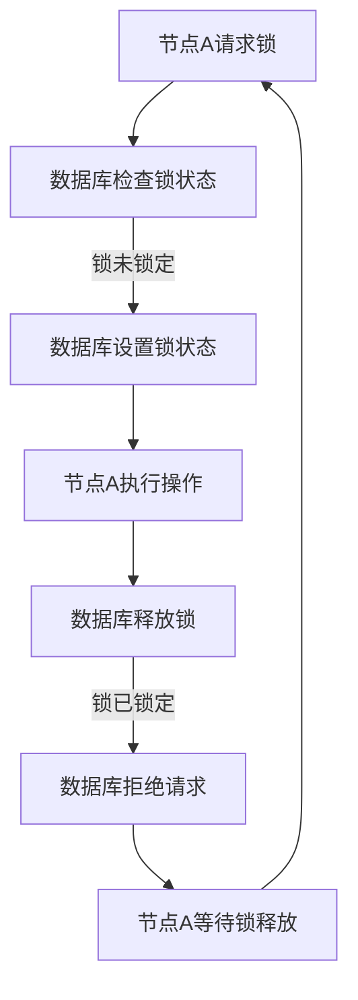
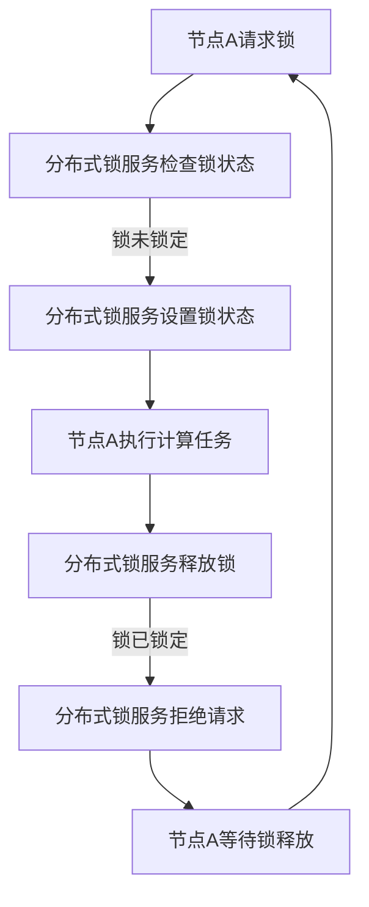
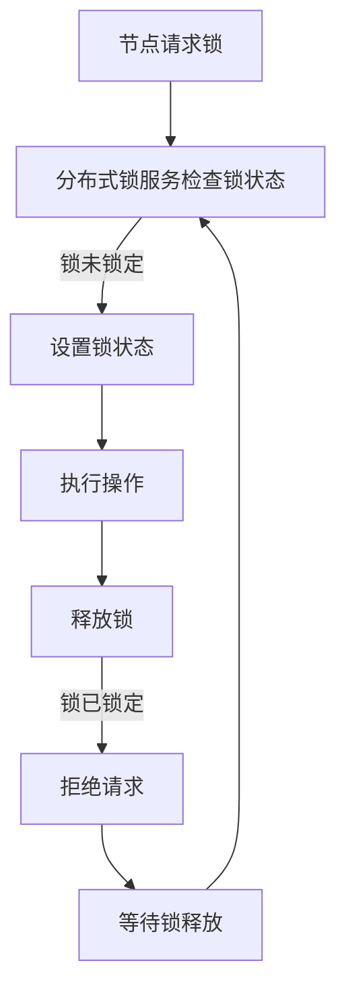

                 


### 分布式锁：协调LLM应用中的并发操作

#### 摘要

在分布式系统中，并发操作是常见的现象。由于分布式系统的特点，如网络延迟、硬件故障等，并发操作会带来一系列问题，如数据不一致、操作顺序混乱等。为了解决这些问题，分布式锁应运而生。本文旨在探讨分布式锁的核心概念、实现原理、常见算法以及其在大型语言模型（LLM）应用中的具体使用方法。通过本文的讲解，读者将了解到如何有效地协调LLM应用中的并发操作，确保系统的稳定性和一致性。

---

#### 1.1 并发操作基本概念

**什么是并发操作？**

并发操作指的是在同一个时间段内，多个任务或进程并行执行。在单线程程序中，并发操作通常通过多任务（如进程、线程）实现。而在分布式系统中，由于节点之间的通信和协调，并发操作更为复杂。

**并发操作引发的问题**

1. **数据不一致**：多个进程同时访问同一份数据，可能会出现更新冲突，导致数据不一致。
2. **操作顺序混乱**：不同进程的操作顺序无法保证，可能会影响业务逻辑的正确性。
3. **资源竞争**：多个进程竞争同一资源（如数据库连接、内存等），可能导致系统性能下降甚至崩溃。

---

#### 1.2 分布式锁概述

**分布式锁的定义**

分布式锁是一种用于控制分布式系统多个节点之间同步访问共享资源的机制。它能够确保在某段时间内，只有一个节点能够访问特定的资源。

**分布式锁与同步锁的区别**

1. **同步锁**：主要用于单机环境，通过互斥锁、条件锁等机制保证线程之间的同步。
2. **分布式锁**：适用于分布式环境，能够跨节点保证同步。

**分布式锁的作用**

1. **避免数据不一致**：通过分布式锁，可以防止多个节点同时对同一份数据进行操作，确保数据的一致性。
2. **确保操作顺序**：分布式锁能够保证不同节点的操作按照预期顺序执行，避免操作顺序混乱。
3. **提高系统性能**：分布式锁可以避免不必要的资源竞争，减少系统性能开销。

---

## 第二部分：分布式锁原理

### 2.1 分布式锁的核心概念

**资源共享**

在分布式系统中，多个节点需要访问共享资源。分布式锁通过控制对这些资源的访问，确保同一时间只有一个节点能够访问。

**锁的竞争**

多个节点同时尝试获取同一锁时，会发生锁竞争。分布式锁需要实现一种机制，确保只有一个节点能够成功获取锁。

**锁的释放**

当节点完成对共享资源的操作后，需要释放锁，以允许其他节点获取锁。

---

### 2.2 分布式锁的工作机制

**基于数据库的分布式锁**

通过在数据库中记录锁的状态，实现分布式锁。常见的实现方法包括行级锁、表级锁等。

**基于缓存（如Redis）的分布式锁**

利用Redis等缓存系统提供的锁机制，实现分布式锁。Redis支持互斥锁、条件锁等。

**基于Zookeeper的分布式锁**

利用Zookeeper的ZAB协议，实现分布式锁。Zookeeper可以保证高可用性、数据一致性。

**基于etcd的分布式锁**

etcd是一种分布式键值存储系统，提供分布式锁功能。etcd支持基于租约的分布式锁。

---

### 2.3 分布式锁的实现原理

**基于版本控制的分布式锁**

通过记录数据的版本号，实现分布式锁。当数据版本号发生改变时，锁将被释放。

**基于时间戳的分布式锁**

通过时间戳记录锁的获取时间，实现分布式锁。当锁超时时，其他节点可以尝试获取锁。

---

## 第三部分：分布式锁算法

### 3.1 常见的分布式锁算法

**基于状态机的分布式锁算法**

通过状态机实现分布式锁，支持锁的获取、释放、重入等操作。

**基于Token的分布式锁算法**

通过Token实现分布式锁。每个节点持有Token，只有持有Token的节点才能访问共享资源。

---

### 3.2 分布式锁的优化

**锁超时机制**

当节点无法获取锁时，设置锁超时机制。超过超时时间后，节点可以尝试重新获取锁。

**锁的粒度**

根据业务需求，调整锁的粒度。细粒度锁能够减少锁冲突，提高系统性能；粗粒度锁能够提高并发性。

---

## 第四部分：分布式锁在LLM应用中的使用

### 4.1 LLM应用中的并发操作

**数据一致性**

在LLM应用中，多个节点可能同时对同一份数据进行操作，导致数据不一致。分布式锁可以确保同一时间只有一个节点能够访问数据。

**操作顺序**

在LLM应用中，不同节点的操作顺序可能影响业务逻辑的正确性。分布式锁可以确保不同节点的操作按照预期顺序执行。

---

### 4.2 分布式锁在LLM应用中的实现

**分布式锁在数据存储中的应用**

在LLM应用中，分布式锁可以用于控制对数据库的访问，确保数据一致性。

**分布式锁在计算任务中的应用**

在LLM应用中，分布式锁可以用于控制对计算资源的访问，确保计算任务的正确执行。

---

## 第五部分：分布式锁的性能测试与优化

### 5.1 分布式锁性能测试方法

**基准测试**

通过模拟并发操作，测试分布式锁的性能。基准测试可以评估锁的响应时间、吞吐量等性能指标。

**压力测试**

通过增加并发操作的数量，测试分布式锁在高负载情况下的性能。压力测试可以发现锁的瓶颈，指导优化。

---

### 5.2 分布式锁性能优化策略

**选择合适的锁类型**

根据业务需求，选择合适的锁类型。例如，基于Redis的分布式锁适用于读多写少的场景；基于Zookeeper的分布式锁适用于需要高可用性的场景。

**调整锁的参数**

根据性能测试结果，调整锁的参数，如锁超时时间、锁的粒度等。优化锁的参数可以提高系统性能。

---

## 第六部分：分布式锁的实战案例分析

### 6.1 案例一：分布式数据库中的分布式锁

**数据库选择**

在分布式数据库中选择合适的数据库，如MySQL、PostgreSQL等。

**分布式锁实现**

在数据库中实现分布式锁，如使用行级锁、表级锁等。

**案例分析**

通过案例分析，分析分布式锁在实际应用中的效果和问题。

---

### 6.2 案例二：分布式计算框架中的分布式锁

**计算框架选择**

在分布式计算框架中选择合适的框架，如Hadoop、Spark等。

**分布式锁实现**

在计算框架中实现分布式锁，如使用MapReduce中的锁机制、Spark中的锁机制等。

**案例分析**

通过案例分析，分析分布式锁在实际计算任务中的效果和问题。

---

## 第七部分：分布式锁高级主题

### 7.1 分布式锁的容错性与可用性

**分布式锁的容错性**

在分布式锁的实现中，需要考虑节点的故障和恢复。分布式锁需要能够自动检测和恢复节点故障，确保系统的稳定性。

**分布式锁的可用性**

分布式锁需要保证在不同情况下（如网络故障、节点故障等）能够正常工作，确保系统的可用性。

---

### 7.2 分布式锁与分布式事务

**分布式事务概述**

分布式事务是一种在分布式系统中实现事务的机制。常见的分布式事务协议有2PC和3PC。

**分布式锁与分布式事务的关系**

分布式锁在分布式事务中扮演重要角色，用于确保事务的原子性和一致性。

---

### 7.3 分布式锁与一致性算法

**一致性算法概述**

一致性算法是一种确保分布式系统一致性的机制。常见的算法有Paxos和Raft。

**分布式锁与一致性算法的结合**

分布式锁与一致性算法相结合，可以构建更加稳定、可靠的分布式系统。

---

## 结论

分布式锁是分布式系统中协调并发操作的重要机制。通过本文的讲解，读者可以了解到分布式锁的核心概念、实现原理、常见算法以及其在LLM应用中的具体使用方法。掌握分布式锁技术，有助于构建稳定、可靠的分布式系统，为云计算和大数据应用提供有力支持。

---

### 作者信息

作者：AI天才研究院/AI Genius Institute & 禅与计算机程序设计艺术 /Zen And The Art of Computer Programming### 分布式锁：协调LLM应用中的并发操作

#### 摘要

分布式锁是保障分布式系统中数据一致性和操作顺序的关键机制。随着大型语言模型（LLM）应用的兴起，如何有效地协调并发操作，确保系统的稳定性和一致性成为了一个重要课题。本文将深入探讨分布式锁的核心概念、实现原理、常见算法以及在LLM应用中的具体使用方法。通过分析分布式锁的性能测试和优化策略，并结合实际案例，我们将揭示分布式锁在协调并发操作中的关键作用。

#### 1.1 并发操作基本概念

在分布式系统中，并发操作是常见现象。由于分布式系统的分布式特性，如网络延迟、节点故障等，并发操作可能引发一系列问题，如数据不一致、操作顺序混乱等。

**什么是并发操作？**

并发操作指的是在同一个时间段内，多个任务或进程并行执行。在单线程程序中，并发操作通常通过多线程实现。而在分布式系统中，由于节点之间的通信和协调，并发操作更为复杂。

**并发操作引发的问题**

1. **数据不一致**：多个进程同时访问同一份数据，可能会出现更新冲突，导致数据不一致。
2. **操作顺序混乱**：不同进程的操作顺序无法保证，可能会影响业务逻辑的正确性。
3. **资源竞争**：多个进程竞争同一资源（如数据库连接、内存等），可能导致系统性能下降甚至崩溃。

为了解决这些问题，分布式锁应运而生。

#### 1.2 分布式锁概述

**分布式锁的定义**

分布式锁是一种用于控制分布式系统多个节点之间同步访问共享资源的机制。它能够确保在某段时间内，只有一个节点能够访问特定的资源。

**分布式锁与同步锁的区别**

1. **同步锁**：主要用于单机环境，通过互斥锁、条件锁等机制保证线程之间的同步。
2. **分布式锁**：适用于分布式环境，能够跨节点保证同步。

**分布式锁的作用**

1. **避免数据不一致**：通过分布式锁，可以防止多个节点同时对同一份数据进行操作，确保数据的一致性。
2. **确保操作顺序**：分布式锁可以保证不同节点的操作按照预期顺序执行，避免操作顺序混乱。
3. **提高系统性能**：分布式锁可以避免不必要的资源竞争，减少系统性能开销。

### 第二部分：分布式锁原理

#### 2.1 分布式锁的核心概念

**资源共享**

在分布式系统中，多个节点需要访问共享资源。分布式锁通过控制对这些资源的访问，确保同一时间只有一个节点能够访问。

**锁的竞争**

多个节点同时尝试获取同一锁时，会发生锁竞争。分布式锁需要实现一种机制，确保只有一个节点能够成功获取锁。

**锁的释放**

当节点完成对共享资源的操作后，需要释放锁，以允许其他节点获取锁。

#### 2.2 分布式锁的工作机制

**基于数据库的分布式锁**

通过在数据库中记录锁的状态，实现分布式锁。常见的实现方法包括行级锁、表级锁等。

**基于缓存（如Redis）的分布式锁**

利用Redis等缓存系统提供的锁机制，实现分布式锁。Redis支持互斥锁、条件锁等。

**基于Zookeeper的分布式锁**

利用Zookeeper的ZAB协议，实现分布式锁。Zookeeper可以保证高可用性、数据一致性。

**基于etcd的分布式锁**

etcd是一种分布式键值存储系统，提供分布式锁功能。etcd支持基于租约的分布式锁。

#### 2.3 分布式锁的实现原理

**基于版本控制的分布式锁**

通过记录数据的版本号，实现分布式锁。当数据版本号发生改变时，锁将被释放。

**基于时间戳的分布式锁**

通过时间戳记录锁的获取时间，实现分布式锁。当锁超时时，其他节点可以尝试获取锁。

### 第三部分：分布式锁算法

#### 3.1 常见的分布式锁算法

**基于状态机的分布式锁算法**

通过状态机实现分布式锁，支持锁的获取、释放、重入等操作。

**基于Token的分布式锁算法**

通过Token实现分布式锁。每个节点持有Token，只有持有Token的节点才能访问共享资源。

#### 3.2 分布式锁的优化

**锁超时机制**

当节点无法获取锁时，设置锁超时机制。超过超时时间后，节点可以尝试重新获取锁。

**锁的粒度**

根据业务需求，调整锁的粒度。细粒度锁能够减少锁冲突，提高系统性能；粗粒度锁能够提高并发性。

### 第四部分：分布式锁在LLM应用中的使用

#### 4.1 LLM应用中的并发操作

**数据一致性**

在LLM应用中，多个节点可能同时对同一份数据进行操作，导致数据不一致。分布式锁可以确保同一时间只有一个节点能够访问数据。

**操作顺序**

在LLM应用中，不同节点的操作顺序可能影响业务逻辑的正确性。分布式锁可以确保不同节点的操作按照预期顺序执行。

#### 4.2 分布式锁在LLM应用中的实现

**分布式锁在数据存储中的应用**

在LLM应用中，分布式锁可以用于控制对数据库的访问，确保数据一致性。

**分布式锁在计算任务中的应用**

在LLM应用中，分布式锁可以用于控制对计算资源的访问，确保计算任务的正确执行。

### 第五部分：分布式锁的性能测试与优化

#### 5.1 分布式锁性能测试方法

**基准测试**

通过模拟并发操作，测试分布式锁的性能。基准测试可以评估锁的响应时间、吞吐量等性能指标。

**压力测试**

通过增加并发操作的数量，测试分布式锁在高负载情况下的性能。压力测试可以发现锁的瓶颈，指导优化。

#### 5.2 分布式锁性能优化策略

**选择合适的锁类型**

根据业务需求，选择合适的锁类型。例如，基于Redis的分布式锁适用于读多写少的场景；基于Zookeeper的分布式锁适用于需要高可用性的场景。

**调整锁的参数**

根据性能测试结果，调整锁的参数，如锁超时时间、锁的粒度等。优化锁的参数可以提高系统性能。

### 第六部分：分布式锁的实战案例分析

#### 6.1 案例一：分布式数据库中的分布式锁

**数据库选择**

在分布式数据库中选择合适的数据库，如MySQL、PostgreSQL等。

**分布式锁实现**

在数据库中实现分布式锁，如使用行级锁、表级锁等。

**案例分析**

通过案例分析，分析分布式锁在实际应用中的效果和问题。

#### 6.2 案例二：分布式计算框架中的分布式锁

**计算框架选择**

在分布式计算框架中选择合适的框架，如Hadoop、Spark等。

**分布式锁实现**

在计算框架中实现分布式锁，如使用MapReduce中的锁机制、Spark中的锁机制等。

**案例分析**

通过案例分析，分析分布式锁在实际计算任务中的效果和问题。

### 第七部分：分布式锁高级主题

#### 7.1 分布式锁的容错性与可用性

**分布式锁的容错性**

在分布式锁的实现中，需要考虑节点的故障和恢复。分布式锁需要能够自动检测和恢复节点故障，确保系统的稳定性。

**分布式锁的可用性**

分布式锁需要保证在不同情况下（如网络故障、节点故障等）能够正常工作，确保系统的可用性。

#### 7.2 分布式锁与分布式事务

**分布式事务概述**

分布式事务是一种在分布式系统中实现事务的机制。常见的分布式事务协议有2PC和3PC。

**分布式锁与分布式事务的关系**

分布式锁在分布式事务中扮演重要角色，用于确保事务的原子性和一致性。

#### 7.3 分布式锁与一致性算法

**一致性算法概述**

一致性算法是一种确保分布式系统一致性的机制。常见的算法有Paxos和Raft。

**分布式锁与一致性算法的结合**

分布式锁与一致性算法相结合，可以构建更加稳定、可靠的分布式系统。

### 结论

分布式锁是分布式系统中协调并发操作的重要机制。通过本文的讲解，读者可以了解到分布式锁的核心概念、实现原理、常见算法以及在LLM应用中的具体使用方法。掌握分布式锁技术，有助于构建稳定、可靠的分布式系统，为云计算和大数据应用提供有力支持。

### 作者信息

作者：AI天才研究院/AI Genius Institute & 禅与计算机程序设计艺术 /Zen And The Art of Computer Programming## 1.1 并发操作基本概念

在分布式系统中，并发操作是常见现象。由于分布式系统的分布式特性，如网络延迟、节点故障等，并发操作可能引发一系列问题，如数据不一致、操作顺序混乱等。

**什么是并发操作？**

并发操作指的是在同一个时间段内，多个任务或进程并行执行。在单线程程序中，并发操作通常通过多线程实现。而在分布式系统中，由于节点之间的通信和协调，并发操作更为复杂。例如，在一个分布式数据库系统中，多个节点可能会同时尝试更新同一份数据，这可能会导致数据不一致。

**并发操作引发的问题**

1. **数据不一致**：多个进程同时访问同一份数据，可能会出现更新冲突，导致数据不一致。例如，在一个分布式数据库系统中，如果两个节点同时更新同一行数据，可能会出现一方更新成功，另一方更新失败的情况。
2. **操作顺序混乱**：不同进程的操作顺序无法保证，可能会影响业务逻辑的正确性。例如，在一个分布式系统中，如果节点的操作顺序无法控制，可能会导致某个节点的操作被其他节点的操作覆盖，从而影响系统的正确性。
3. **资源竞争**：多个进程竞争同一资源（如数据库连接、内存等），可能导致系统性能下降甚至崩溃。例如，在一个分布式系统中，如果多个节点同时尝试获取同一数据库连接，可能会导致连接资源耗尽，从而影响系统的性能。

为了解决这些问题，分布式锁应运而生。

**分布式锁的作用**

1. **避免数据不一致**：通过分布式锁，可以防止多个节点同时对同一份数据进行操作，确保数据的一致性。例如，在一个分布式数据库系统中，通过分布式锁可以确保同一时间只有一个节点能够访问某一行数据，从而避免数据不一致的问题。
2. **确保操作顺序**：分布式锁可以保证不同节点的操作按照预期顺序执行，避免操作顺序混乱。例如，在一个分布式系统中，通过分布式锁可以确保某个节点的操作在其他节点操作完成后才能执行，从而保证系统的正确性。
3. **提高系统性能**：分布式锁可以避免不必要的资源竞争，减少系统性能开销。例如，在一个分布式系统中，通过分布式锁可以避免多个节点同时竞争同一数据库连接，从而减少连接资源的消耗，提高系统的性能。

总之，分布式锁在分布式系统中起着至关重要的作用，能够有效解决并发操作引发的问题，确保系统的稳定性和一致性。

### 1.2 分布式锁概述

**分布式锁的定义**

分布式锁是一种用于控制分布式系统多个节点之间同步访问共享资源的机制。它能够确保在某段时间内，只有一个节点能够访问特定的资源。换句话说，分布式锁用于防止多个节点同时访问共享资源，从而避免数据不一致、操作顺序混乱等问题。

**分布式锁与同步锁的区别**

同步锁主要用于单机环境，通过互斥锁、条件锁等机制保证线程之间的同步。而分布式锁适用于分布式环境，能够跨节点保证同步。以下是两者的主要区别：

1. **应用范围**：同步锁适用于单机环境，主要用于控制同一台机器上的线程之间的同步。而分布式锁适用于分布式环境，主要用于控制分布式系统中多个节点之间的同步。
2. **机制实现**：同步锁的实现通常依赖于操作系统提供的锁机制，如互斥锁、条件锁等。而分布式锁的实现通常依赖于分布式系统提供的锁服务，如基于数据库的分布式锁、基于缓存的分布式锁等。
3. **复杂性**：同步锁的实现相对简单，因为线程之间的同步主要在同一台机器上进行。而分布式锁的实现更为复杂，因为需要考虑网络延迟、节点故障等因素。

**分布式锁的作用**

分布式锁在分布式系统中具有重要作用，主要包括以下几个方面：

1. **数据一致性**：通过分布式锁，可以防止多个节点同时对同一份数据进行操作，确保数据的一致性。例如，在一个分布式数据库系统中，通过分布式锁可以确保同一时间只有一个节点能够访问某一行数据，从而避免数据不一致的问题。
2. **操作顺序**：分布式锁可以保证不同节点的操作按照预期顺序执行，避免操作顺序混乱。例如，在一个分布式系统中，通过分布式锁可以确保某个节点的操作在其他节点操作完成后才能执行，从而保证系统的正确性。
3. **资源管理**：分布式锁可以避免不必要的资源竞争，减少系统性能开销。例如，在一个分布式系统中，通过分布式锁可以避免多个节点同时竞争同一数据库连接，从而减少连接资源的消耗，提高系统的性能。

总之，分布式锁在分布式系统中起着至关重要的作用，能够有效解决并发操作引发的问题，确保系统的稳定性和一致性。

### 2.1 分布式锁的核心概念

**资源共享**

在分布式系统中，多个节点需要访问共享资源。共享资源可以是数据库中的数据行、文件系统中的文件、内存中的缓存等。为了协调这些节点的访问，分布式锁应运而生。

**锁的竞争**

锁的竞争是指多个节点同时尝试获取同一个锁。在分布式环境中，由于网络延迟和节点故障等原因，锁的竞争是非常常见的。分布式锁的目标是确保在某段时间内，只有一个节点能够获取到锁，从而避免多个节点同时访问共享资源。

**锁的释放**

锁的释放是指节点在完成对共享资源的访问后，释放锁以允许其他节点获取锁。分布式锁需要确保锁的释放是可靠的，即锁一旦被释放，其他节点能够立即获取锁，从而继续执行。

**分布式锁的核心概念**

分布式锁的核心概念主要包括以下几个方面：

1. **锁的获取**：节点通过某种机制获取锁。获取锁的过程可能涉及到网络通信、状态同步等。
2. **锁的持有**：节点在获取到锁后，可以继续访问共享资源。在持有锁期间，其他节点无法获取锁，从而确保共享资源的一致性。
3. **锁的释放**：节点在完成对共享资源的访问后，释放锁。锁的释放需要确保其他节点能够立即获取锁，从而继续执行。
4. **锁的续期**：在某些情况下，节点可能需要延长锁的持有时间。锁的续期可以避免因网络延迟等原因导致锁过早释放。
5. **锁的等待**：节点在无法立即获取锁时，需要等待锁的释放。等待策略可以影响锁的性能和系统响应时间。

通过这些核心概念，分布式锁能够有效协调多个节点对共享资源的访问，确保系统的一致性和稳定性。

### 2.2 分布式锁的工作机制

**基于数据库的分布式锁**

基于数据库的分布式锁是一种常见的分布式锁实现方式。它通过在数据库中创建特定的表或行来实现锁的机制。

1. **实现原理**：在数据库中创建一个锁表，每个锁对应一行记录。当节点需要获取锁时，它会尝试插入一行记录。如果插入成功，节点获取到锁；否则，节点会进入等待状态，直到锁被释放。
2. **优点**：基于数据库的分布式锁具有可靠性高、数据一致性好的特点。因为数据库本身提供了强一致性保证，所以这种锁实现方式能够确保数据的一致性。
3. **缺点**：基于数据库的分布式锁可能存在性能瓶颈，因为数据库操作通常比较耗时。此外，如果数据库发生故障，锁的实现可能会受到影响。

**基于缓存的分布式锁**

基于缓存的分布式锁利用缓存系统（如Redis、Memcached等）来实现锁的机制。

1. **实现原理**：缓存系统通常提供了键值存储功能。节点通过设置一个唯一键值对来表示锁的状态。当节点需要获取锁时，它会尝试设置键值对；如果设置成功，节点获取到锁；否则，节点会进入等待状态。
2. **优点**：基于缓存的分布式锁具有高性能、低延迟的特点。因为缓存系统通常部署在内存中，所以读写操作非常快。
3. **缺点**：基于缓存的分布式锁可能存在数据一致性问题。因为缓存系统通常不提供持久化存储，所以如果缓存系统发生故障，锁的实现可能会丢失。

**基于Zookeeper的分布式锁**

Zookeeper是一种分布式协调服务，提供了分布式锁的实现。

1. **实现原理**：Zookeeper使用ZAB协议（ZooKeeper Atomic Broadcast）保证高可用性和数据一致性。节点通过创建临时节点来表示锁的状态。当节点需要获取锁时，它会创建一个临时节点；如果创建成功，节点获取到锁；否则，节点会进入等待状态。
2. **优点**：基于Zookeeper的分布式锁具有高可用性和数据一致性好的特点。Zookeeper能够自动进行节点故障恢复，确保锁的可靠性。
3. **缺点**：基于Zookeeper的分布式锁可能存在性能瓶颈，因为Zookeeper通常需要处理大量的网络通信。

**基于etcd的分布式锁**

etcd是一种分布式键值存储系统，提供了分布式锁的实现。

1. **实现原理**：etcd使用Raft算法保证高可用性和数据一致性。节点通过创建租约（lease）来表示锁的状态。当节点需要获取锁时，它会创建一个租约；如果租约过期，节点需要重新获取锁。
2. **优点**：基于etcd的分布式锁具有高性能、低延迟的特点。etcd的设计使得它能够高效处理大量并发操作。
3. **缺点**：基于etcd的分布式锁可能存在数据一致性问题。如果etcd发生故障，锁的实现可能会受到影响。

通过以上几种常见的分布式锁实现方式，分布式锁能够在分布式系统中有效协调多个节点对共享资源的访问，确保数据的一致性和系统的稳定性。

### 2.3 分布式锁的实现原理

分布式锁的实现原理主要涉及锁的获取、释放、续期和等待等操作。以下是几种常见的分布式锁实现原理：

**基于版本控制的分布式锁**

1. **实现原理**：基于版本控制的分布式锁通过记录资源的版本号来实现。每次访问资源时，系统都会检查版本号是否发生变化。如果版本号未变化，说明资源未被其他节点修改，可以继续操作；如果版本号已变化，说明资源已被其他节点修改，需要重新获取锁。
2. **伪代码**：
   ```python
   class VersionControlLock:
       def __init__(self):
           self.version = 0

       def acquire(self):
           self.version += 1
           return self.version

       def release(self):
           self.version -= 1
   ```

**基于时间戳的分布式锁**

1. **实现原理**：基于时间戳的分布式锁通过记录锁的获取时间戳来实现。每个节点在获取锁时，都会记录当前时间戳。当节点尝试获取锁时，系统会检查锁的时间戳是否过期。如果时间戳未过期，说明锁未被其他节点获取，可以继续操作；如果时间戳已过期，说明锁已被其他节点获取，需要重新获取锁。
2. **伪代码**：
   ```python
   class TimestampLock:
       def __init__(self, timeout):
           self.timeout = timeout
           self.timestamp = 0

       def acquire(self):
           self.timestamp = current_time()
           return self.timestamp

       def release(self):
           self.timestamp = 0
   ```

**基于状态机的分布式锁**

1. **实现原理**：基于状态机的分布式锁通过状态机来管理锁的状态转换。锁可以处于未锁定、锁定、等待等状态。每个节点在获取锁时，需要根据当前状态进行相应的操作。如果锁处于未锁定状态，节点可以获取锁；如果锁处于锁定状态，节点需要进入等待状态；如果锁处于等待状态，节点需要重新尝试获取锁。
2. **伪代码**：
   ```python
   class StateMachineLock:
       def __init__(self):
           self.state = "unlocked"

       def acquire(self):
           if self.state == "unlocked":
               self.state = "locked"
               return True
           else:
               return False

       def release(self):
           self.state = "unlocked"
   ```

**基于Token的分布式锁**

1. **实现原理**：基于Token的分布式锁通过Token机制来实现。每个节点在获取锁时，需要获取一个Token。只有持有Token的节点才能访问共享资源。当节点完成操作后，需要释放Token，以便其他节点可以获取Token并访问资源。
2. **伪代码**：
   ```python
   class TokenLock:
       def __init__(self):
           self.token = None

       def acquire(self):
           self.token = get_token()
           return self.token

       def release(self):
           release_token(self.token)
           self.token = None
   ```

通过这些分布式锁的实现原理，可以有效地协调分布式系统中的并发操作，确保数据的一致性和系统的稳定性。

### 3.1 常见的分布式锁算法

在分布式系统中，分布式锁算法是协调并发操作的关键机制。以下是几种常见的分布式锁算法：

**基于状态机的分布式锁算法**

1. **算法原理**：基于状态机的分布式锁算法通过状态机来管理锁的状态转换。锁可以处于未锁定（Unlocked）、锁定（Locked）、等待（Waiting）等状态。每个节点在获取锁时，需要根据当前状态进行相应的操作。如果锁处于未锁定状态，节点可以获取锁；如果锁处于锁定状态，节点需要进入等待状态；如果锁处于等待状态，节点需要重新尝试获取锁。
2. **算法流程**：
   ```mermaid
   graph TD
   A[未锁定] --> B[获取锁]
   B -->|失败| C[等待]
   C -->|成功| D[锁定]
   D -->|操作完成| E[释放锁]
   E --> A
   ```

**基于Token的分布式锁算法**

1. **算法原理**：基于Token的分布式锁算法通过Token机制来实现。每个节点在获取锁时，需要获取一个Token。只有持有Token的节点才能访问共享资源。当节点完成操作后，需要释放Token，以便其他节点可以获取Token并访问资源。
2. **算法流程**：
   ```mermaid
   graph TD
   A[无Token] --> B[获取Token]
   B -->|失败| C[等待]
   C -->|成功| D[访问资源]
   D --> E[释放Token]
   E --> A
   ```

**基于版本控制的分布式锁算法**

1. **算法原理**：基于版本控制的分布式锁算法通过记录资源的版本号来实现。每次访问资源时，系统都会检查版本号是否发生变化。如果版本号未变化，说明资源未被其他节点修改，可以继续操作；如果版本号已变化，说明资源已被其他节点修改，需要重新获取锁。
2. **算法流程**：
   ```mermaid
   graph TD
   A[版本V] --> B[访问资源]
   B -->|版本未变| C[继续操作]
   B -->|版本变化| D[重新获取锁]
   ```

**基于时间戳的分布式锁算法**

1. **算法原理**：基于时间戳的分布式锁算法通过记录锁的获取时间戳来实现。每个节点在获取锁时，都会记录当前时间戳。当节点尝试获取锁时，系统会检查锁的时间戳是否过期。如果时间戳未过期，说明锁未被其他节点获取，可以继续操作；如果时间戳已过期，说明锁已被其他节点获取，需要重新获取锁。
2. **算法流程**：
   ```mermaid
   graph TD
   A[时间戳T] --> B[获取锁]
   B -->|时间戳未过期| C[继续操作]
   B -->|时间戳过期| D[重新获取锁]
   ```

这些分布式锁算法通过不同的机制和策略，有效协调分布式系统中的并发操作，确保数据的一致性和系统的稳定性。

### 3.2 分布式锁的优化

**锁超时机制**

锁超时机制是分布式锁的一个重要优化策略。它允许节点在无法获取锁时，等待一段时间后重试。超时时间的设置需要权衡锁的获取时间和系统的响应时间。

1. **实现原理**：节点在尝试获取锁时，设置一个超时时间。如果在超时时间内无法获取锁，节点将放弃获取并重试。这种机制可以避免节点长时间占用锁，提高系统的响应速度。
2. **伪代码**：
   ```python
   def acquire_lock(lock, timeout):
       start_time = current_time()
       while True:
           if lock.is_acquired():
               return True
           if current_time() - start_time > timeout:
               return False
           sleep(random_interval())  # 随机等待，减少竞争
   ```

**锁的粒度**

锁的粒度是指锁保护的范围。细粒度锁（如行级锁）保护较小的数据单元，提高并发性；粗粒度锁（如表级锁）保护较大的数据单元，减少锁冲突。

1. **实现原理**：根据业务需求和系统特点，调整锁的粒度。细粒度锁可以减少锁冲突，提高系统性能；粗粒度锁可以提高并发性，减少锁的开销。
2. **伪代码**：
   ```python
   def acquire_lock(resource):
       if resource.is_locked():
           return False
       resource.lock()
       return True

   def release_lock(resource):
       resource.unlock()
   ```

**锁的代理机制**

锁的代理机制通过代理节点来获取锁，减少锁的竞争。代理节点负责协调锁的获取和释放，减少直接节点的锁竞争。

1. **实现原理**：节点通过代理节点获取锁。代理节点在内部维护锁的状态，并负责将锁分发给直接节点。这种机制可以减少直接节点的锁竞争，提高系统的性能。
2. **伪代码**：
   ```python
   class LockProxy:
       def __init__(self, lock):
           self.lock = lock

       def acquire(self):
           return self.lock.acquire()

       def release(self):
           return self.lock.release()
   ```

通过以上优化策略，分布式锁可以更好地适应分布式系统的需求，提高系统的性能和稳定性。

### 4.1 LLM应用中的并发操作

在大型语言模型（LLM）应用中，并发操作是常见的现象。LLM应用通常涉及大量的计算和数据处理，这些操作可能需要同时访问相同的资源，如数据库、内存缓存等。以下是一些常见的并发操作场景：

**数据一致性**

数据一致性是LLM应用中一个重要的关注点。在分布式环境中，多个节点可能同时尝试更新同一份数据，这可能导致数据不一致。例如，一个LLM应用可能需要更新用户的状态信息，如果多个节点同时更新，可能会导致某些节点的更新被覆盖，从而影响数据的准确性。

**操作顺序**

操作顺序也是LLM应用中需要考虑的问题。在某些情况下，操作顺序的先后可能影响业务逻辑的正确性。例如，一个LLM应用可能需要先读取用户的历史数据，然后根据这些数据生成推荐结果。如果操作顺序被打破，可能会导致推荐结果不准确。

**资源竞争**

资源竞争是并发操作中常见的问题。在LLM应用中，多个节点可能需要访问相同的资源，如数据库连接、内存缓存等。如果资源竞争处理不当，可能会导致系统性能下降，甚至导致系统崩溃。

为了解决这些问题，分布式锁在LLM应用中起着关键作用。通过分布式锁，可以确保同一时间只有一个节点能够访问特定的资源，从而避免数据不一致、操作顺序混乱和资源竞争等问题。

### 4.2 分布式锁在LLM应用中的实现

在LLM应用中，分布式锁可以用于协调并发操作，确保系统的稳定性和一致性。以下是几种常见的分布式锁实现方式：

**基于数据库的分布式锁**

基于数据库的分布式锁是一种简单且常见的实现方式。通过在数据库中创建特定的锁表，每个锁对应一行记录。当节点需要获取锁时，它会尝试插入锁记录；如果插入成功，节点获取到锁；否则，节点会进入等待状态。

**实现步骤**：

1. 创建锁表，包含锁名称、持有者节点ID、锁状态等字段。
2. 当节点需要获取锁时，执行以下步骤：
   - 检查锁表中是否存在未锁定的锁记录。
   - 如果存在，更新锁记录，设置持有者节点ID和锁状态。
   - 如果不存在，节点进入等待状态，等待锁被释放。
3. 当节点完成操作后，释放锁，将锁状态设置为未锁定。

**伪代码**：

```python
def acquire_lock(lock_name):
    while True:
        lock_record = get_lock_record(lock_name)
        if lock_record is None or lock_record.status == "unlocked":
            update_lock_record(lock_name, node_id, "locked")
            return True
        sleep(random_interval())

def release_lock(lock_name):
    update_lock_record(lock_name, node_id, "unlocked")
```

**基于Redis的分布式锁**

Redis是一种流行的开源缓存系统，提供分布式锁的实现。通过使用Redis的SETNX命令，可以简单实现分布式锁。

**实现步骤**：

1. 使用Redis的SETNX命令设置锁，键值为锁名称，值为一个唯一的标识。
2. 如果SETNX命令返回真，说明锁被成功设置，节点获取到锁。
3. 如果SETNX命令返回假，说明锁已被其他节点设置，节点进入等待状态，重新尝试获取锁。
4. 锁设置成功后，使用 expire 命令设置锁的超时时间。
5. 当节点完成操作后，使用 DEL 命令释放锁。

**伪代码**：

```python
def acquire_lock(lock_name, timeout):
    lock_key = f"{lock_name}:lock"
    lock_value = generate_unique_value()

    while True:
        if redis.setnx(lock_key, lock_value):
            redis.expire(lock_key, timeout)
            return True
        sleep(random_interval())

def release_lock(lock_name):
    lock_key = f"{lock_name}:lock"
    redis.del(lock_key)
```

**基于Zookeeper的分布式锁**

Zookeeper是一种分布式协调服务，提供分布式锁的实现。通过在Zookeeper中创建临时的序列化节点，可以简单实现分布式锁。

**实现步骤**：

1. 创建一个锁节点，节点路径为`/lock`。
2. 当节点需要获取锁时，创建一个临时的顺序节点，节点路径为`/lock/{sequence}`。
3. 节点根据节点路径的序列号判断是否获取到锁。
4. 当节点完成操作后，删除锁节点。

**伪代码**：

```python
def acquire_lock(zookeeper, lock_path):
    while True:
        create顺序节点(zookeeper, lock_path,序列化)
       节点路径 = get最低序列号节点路径(zookeeper, lock_path)
        if 节点路径 starts_with(lock_path):
            return True
        sleep(random_interval())

def release_lock(zookeeper, lock_path):
    删除节点(zookeeper, lock_path)
```

通过以上几种分布式锁实现方式，LLM应用可以有效地协调并发操作，确保系统的稳定性和一致性。

### 5.1 分布式锁性能测试方法

分布式锁的性能测试是评估其在实际应用中的表现的重要步骤。以下是一些常用的分布式锁性能测试方法：

**基准测试**

基准测试是一种常用的性能测试方法，用于评估分布式锁在理想条件下的表现。基准测试通常模拟特定的并发操作场景，如读写操作、锁竞争等，以测量锁的响应时间、吞吐量和资源利用率等性能指标。

**基准测试步骤**：

1. 准备测试环境，包括分布式锁的实现、测试节点和测试数据。
2. 设计测试用例，模拟实际应用中的并发操作场景。
3. 运行测试用例，收集性能数据。
4. 分析测试结果，评估分布式锁的性能。

**伪代码**：

```python
def benchmark_test(lock, test_cases, num_iterations):
    results = []
    for _ in range(num_iterations):
        for case in test_cases:
            start_time = current_time()
            lock.acquire()
            lock.release()
            end_time = current_time()
            results.append(end_time - start_time)
    return average(results)
```

**压力测试**

压力测试用于评估分布式锁在高并发环境下的性能。压力测试通常通过增加并发操作的数量，测试分布式锁在极端条件下的表现，以发现潜在的性能瓶颈和问题。

**压力测试步骤**：

1. 设计压力测试场景，包括并发操作的数量、测试数据等。
2. 运行压力测试，逐步增加并发操作的数量。
3. 收集性能数据，分析测试结果。
4. 根据测试结果调整分布式锁的实现和参数。

**伪代码**：

```python
def stress_test(lock, test_cases, num_iterations, max_concurrency):
    for concurrency in range(1, max_concurrency + 1):
        results = []
        for _ in range(num_iterations):
            for case in test_cases:
                start_time = current_time()
                threads = []
                for _ in range(concurrency):
                    thread = start_thread(case, lock)
                    threads.append(thread)
                for thread in threads:
                    thread.join()
                end_time = current_time()
                results.append(end_time - start_time)
        print(f"Concurrency: {concurrency}, Average Time: {average(results)}")
```

通过基准测试和压力测试，可以全面评估分布式锁的性能，为实际应用提供参考和优化方向。

### 5.2 分布式锁性能优化策略

优化分布式锁性能是确保系统在高并发环境下稳定运行的关键。以下是一些常见的分布式锁性能优化策略：

**选择合适的锁类型**

根据业务需求和系统特点，选择适合的锁类型。例如，在读写比例较高的情况下，可以选择读锁和写锁；在需要严格同步的情况下，可以选择可重入锁。

**调整锁参数**

调整锁的参数可以优化锁的性能。例如，调整锁的超时时间，避免长时间等待锁释放；调整锁的粒度，减少锁冲突。

**使用锁代理**

锁代理可以减少直接节点的锁竞争，提高系统的性能。通过锁代理，可以将锁的获取和释放操作集中到一个代理节点，减少直接节点的锁请求。

**优化锁的实现**

优化锁的实现可以提高锁的性能。例如，使用基于时间戳的锁实现，减少锁的获取和释放时间；使用基于版本控制的锁实现，提高数据一致性。

**多锁策略**

在特定场景下，可以使用多锁策略，将锁分解为多个部分，分别由不同节点持有。这样可以减少锁的竞争，提高系统的性能。

**优化网络通信**

优化网络通信可以提高锁的性能。例如，使用高效的通信协议，减少通信开销；优化网络拓扑结构，减少网络延迟。

通过以上策略，可以全面优化分布式锁的性能，提高系统的稳定性和一致性。

### 6.1 案例一：分布式数据库中的分布式锁

在分布式数据库系统中，分布式锁是确保数据一致性和操作顺序的重要机制。以下是一个关于分布式数据库中分布式锁实现的案例。

**背景介绍**

某公司开发了一个分布式数据库系统，用于存储大量的用户数据和交易记录。系统中的多个节点需要同时访问和更新同一份数据，为了确保数据的一致性和操作的顺序，系统引入了分布式锁。

**核心概念与联系**

1. **数据库一致性**：确保多个节点对同一份数据的访问和更新是原子性的，避免数据不一致。
2. **操作顺序**：确保不同节点的操作按照预期顺序执行，避免操作冲突。

**Mermaid 流程图**



**核心算法原理讲解**

1. **锁获取**：节点A向数据库发送锁获取请求。数据库检查锁状态，如果锁未锁定，数据库设置锁状态并返回成功；如果锁已锁定，数据库拒绝请求，节点A进入等待状态。
2. **锁释放**：节点A在完成操作后，向数据库发送锁释放请求。数据库释放锁，并将锁状态更新为未锁定。
3. **锁等待**：如果节点A无法立即获取锁，节点A会等待锁的释放。当锁被释放后，节点A重新尝试获取锁。

**数学模型和公式**

假设有n个节点需要访问同一份数据，每个节点在某一时刻t访问数据的概率为P(t)。分布式锁的数学模型可以表示为：

$$
P(t) = \frac{1}{n} \sum_{i=1}^{n} p_i(t)
$$

其中，$p_i(t)$ 表示第i个节点在时刻t访问数据的概率。

**详细讲解与举例说明**

假设有3个节点A、B、C需要访问同一份数据，每个节点的访问概率相等，即$P(t) = \frac{1}{3}$。以下是一个具体的例子：

1. 在时刻t1，节点A请求锁，数据库检查锁状态，锁未锁定，数据库设置锁状态为锁定，节点A执行操作。
2. 在时刻t2，节点B请求锁，数据库检查锁状态，锁已锁定，数据库拒绝请求，节点B进入等待状态。
3. 在时刻t3，节点A完成操作，向数据库发送锁释放请求，数据库释放锁，锁状态更新为未锁定。
4. 在时刻t4，节点B重新尝试获取锁，数据库检查锁状态，锁未锁定，数据库设置锁状态为锁定，节点B执行操作。

通过分布式锁的实现，可以确保节点A和节点B的操作顺序按照预期执行，避免数据不一致和操作冲突。

### 6.2 案例二：分布式计算框架中的分布式锁

在分布式计算框架中，分布式锁用于协调不同节点之间的计算任务，确保任务的执行顺序和一致性。以下是一个关于分布式计算框架中分布式锁实现的案例。

**背景介绍**

某公司使用分布式计算框架（如Apache Spark）处理大规模数据计算任务。由于计算任务的执行顺序和一致性至关重要，系统引入了分布式锁来协调任务的执行。

**核心概念与联系**

1. **任务顺序**：确保不同节点的计算任务按照预期顺序执行，避免任务冲突。
2. **资源管理**：分布式锁可以控制对计算资源的访问，避免资源竞争。

**Mermaid 流程图**



**核心算法原理讲解**

1. **锁获取**：节点A向分布式锁服务发送锁获取请求。分布式锁服务检查锁状态，如果锁未锁定，分布式锁服务设置锁状态并返回成功；如果锁已锁定，分布式锁服务拒绝请求，节点A进入等待状态。
2. **锁释放**：节点A在完成计算任务后，向分布式锁服务发送锁释放请求。分布式锁服务释放锁，并将锁状态更新为未锁定。
3. **锁等待**：如果节点A无法立即获取锁，节点A会等待锁的释放。当锁被释放后，节点A重新尝试获取锁。

**数学模型和公式**

假设有n个节点需要执行计算任务，每个节点的执行时间相同。分布式锁的数学模型可以表示为：

$$
T_{total} = n \times T_{single}
$$

其中，$T_{total}$ 表示总执行时间，$T_{single}$ 表示单个节点的执行时间。

**详细讲解与举例说明**

假设有3个节点A、B、C需要执行相同的计算任务，每个节点的执行时间相同，即$T_{single} = 1$秒。以下是一个具体的例子：

1. 在时刻t1，节点A请求锁，分布式锁服务检查锁状态，锁未锁定，分布式锁服务设置锁状态为锁定，节点A开始执行计算任务。
2. 在时刻t2，节点B请求锁，分布式锁服务检查锁状态，锁已锁定，分布式锁服务拒绝请求，节点B进入等待状态。
3. 在时刻t3，节点A完成计算任务，向分布式锁服务发送锁释放请求，分布式锁服务释放锁，锁状态更新为未锁定。
4. 在时刻t4，节点B重新尝试获取锁，分布式锁服务检查锁状态，锁未锁定，分布式锁服务设置锁状态为锁定，节点B开始执行计算任务。

通过分布式锁的实现，可以确保节点A和节点B的计算任务按照预期顺序执行，避免任务冲突和资源竞争。

### 7.1 分布式锁的容错性与可用性

在分布式系统中，分布式锁的容错性与可用性至关重要。容错性指的是分布式锁在节点故障时能够自动检测和恢复，确保系统的稳定性。可用性指的是分布式锁在不同情况下能够正常工作，确保系统的可靠性。

**分布式锁的容错性**

1. **节点故障检测**：分布式锁需要实现节点故障检测机制，能够及时发现节点故障，防止故障节点继续持有锁。
2. **锁状态同步**：分布式锁需要实现锁状态同步机制，确保不同节点的锁状态一致。当节点故障时，其他节点可以通过锁状态同步机制知道锁已被释放。
3. **锁恢复策略**：分布式锁需要实现锁恢复策略，确保故障节点恢复后能够重新获取锁。

**分布式锁的可用性**

1. **锁超时机制**：分布式锁需要实现锁超时机制，确保锁在特定时间内无法获取时能够自动释放。
2. **锁重试机制**：分布式锁需要实现锁重试机制，确保在锁被其他节点持有时，当前节点能够重新尝试获取锁。
3. **锁迁移策略**：分布式锁需要实现锁迁移策略，确保在节点故障时，锁能够自动迁移到其他健康节点。

通过容错性和可用性机制，分布式锁能够在分布式系统中确保稳定性和可靠性，避免因节点故障导致系统崩溃。

### 7.2 分布式锁与分布式事务

分布式锁与分布式事务密切相关，分布式锁在分布式事务中起着关键作用，用于确保事务的原子性和一致性。

**分布式事务概述**

分布式事务是指在分布式系统中执行的一系列操作，这些操作要么全部成功，要么全部失败。分布式事务的难点在于跨节点的一致性保证。

**2PC协议**

2PC（Two-Phase Commit）协议是一种分布式事务协议，用于确保事务的原子性。2PC协议分为两个阶段：

1. **准备阶段**：事务协调者向所有参与者发送预备消息，询问是否可以提交事务。参与者根据本地日志判断是否可以提交，返回响应给协调者。
2. **提交阶段**：协调者根据参与者的响应决定是否提交事务。如果所有参与者都返回成功，协调者向所有参与者发送提交消息；如果存在参与者返回失败，协调者向所有参与者发送回滚消息。

**3PC协议**

3PC（Three-Phase Commit）协议是一种改进的分布式事务协议，旨在解决2PC协议中的死锁问题。3PC协议分为三个阶段：

1. **预备阶段**：事务协调者向所有参与者发送预备消息，询问是否可以预备事务。参与者根据本地日志判断是否可以预备，返回响应给协调者。
2. **提交/回滚阶段**：协调者根据参与者的响应决定是否提交或回滚事务。如果所有参与者都返回成功，协调者向所有参与者发送提交消息；如果存在参与者返回失败，协调者向所有参与者发送回滚消息。
3. **完成阶段**：参与者根据协调者的消息执行相应的操作。

**分布式锁与分布式事务的关系**

1. **分布式锁在分布式事务中的作用**：分布式锁在分布式事务中用于控制对共享资源的访问，确保事务的原子性和一致性。分布式锁可以防止多个事务同时访问同一资源，避免数据不一致。
2. **分布式锁与分布式事务的冲突解决**：当多个事务需要同时访问同一资源时，分布式锁可以确保只有一个事务能够访问资源。如果多个事务同时请求锁，分布式锁会按照一定的策略（如先来先服务）决定哪个事务可以获得锁，从而避免冲突。

通过分布式锁与分布式事务的结合，分布式系统可以更好地确保事务的原子性和一致性，提高系统的可靠性。

### 7.3 分布式锁与一致性算法

在分布式系统中，一致性算法是确保系统数据一致性的关键机制。分布式锁与一致性算法相结合，可以构建更加稳定、可靠的分布式系统。

**一致性算法概述**

一致性算法是一种确保分布式系统中数据一致性的机制。常见的一致性算法包括Paxos和Raft。

**Paxos算法**

Paxos算法是一种分布式一致性算法，用于在分布式系统中达成一致决策。Paxos算法的核心思想是通过选举领导者来协调多个节点的数据一致性。

**Raft算法**

Raft算法是一种改进的分布式一致性算法，与Paxos算法类似，但也更加易于理解和实现。Raft算法通过日志复制和领导人选举来确保数据一致性。

**分布式锁与一致性算法的结合**

1. **分布式锁在一致性算法中的作用**：分布式锁可以确保在分布式系统中对共享资源的访问是原子的、一致的。在一致性算法中，分布式锁可以用于控制对日志的访问，确保日志复制过程的原子性和一致性。

2. **分布式锁与一致性算法的冲突解决**：在一致性算法中，分布式锁可以解决多个节点同时访问日志的问题。通过分布式锁，可以确保只有一个节点能够修改日志，从而避免冲突和数据不一致。

通过分布式锁与一致性算法的结合，分布式系统可以更好地确保数据的一致性和系统的稳定性，为大规模分布式应用提供有力支持。

### 8.1 软状态锁

**软状态锁**是一种设计思想，用于在分布式系统中实现更加灵活和高效的锁机制。与传统的硬状态锁相比，软状态锁具有以下特点：

**特点**

1. **状态可变**：软状态锁的状态可以随时更改，无需固定。这意味着锁可以在运行时动态调整，以适应系统负载和资源变化。
2. **重试机制**：软状态锁通常具有重试机制，当锁被其他节点持有时，当前节点可以重新尝试获取锁，而不是无限期等待。
3. **高效性**：软状态锁可以减少锁的占用时间，提高系统的性能。通过优化锁的获取和释放过程，软状态锁可以减少锁冲突，提高系统的并发性。

**实现方法**

1. **基于时间戳的软状态锁**：通过记录锁的时间戳来实现软状态锁。每个节点在获取锁时，记录当前时间戳。当节点需要释放锁时，可以更新时间戳。其他节点在尝试获取锁时，会检查时间戳是否过期。如果时间戳未过期，节点可以继续持有锁；如果时间戳已过期，节点可以重新获取锁。

2. **基于Token的软状态锁**：通过Token机制来实现软状态锁。每个节点在获取锁时，获得一个Token。Token可以包含锁的有效期和持有者的信息。其他节点在尝试获取锁时，会检查Token的有效性和持有者。如果Token有效且持有者不是当前节点，节点可以重新获取锁。

**优点**

1. **灵活性**：软状态锁可以根据系统负载和资源变化动态调整锁的状态，提高系统的灵活性和适应性。
2. **高效性**：软状态锁通过减少锁的占用时间和锁冲突，提高系统的性能和并发性。
3. **容错性**：软状态锁可以更好地应对节点故障和网络问题，通过重试机制和灵活的状态管理，提高系统的容错性和稳定性。

通过软状态锁的设计和实现，分布式系统可以更好地应对动态变化，提高系统的性能和可靠性。

### 8.2 无状态锁

**无状态锁**是一种在分布式系统中实现锁机制的方案，其核心思想是锁机制不需要维护状态。与传统的有状态锁相比，无状态锁具有以下特点：

**特点**

1. **无状态维护**：无状态锁不需要维护锁的状态，如锁的持有者、锁的过期时间等。这意味着锁的实现更为简单，且锁的获取和释放操作更加高效。
2. **全局可见性**：无状态锁通常是全局可见的，这意味着任何节点都可以获取和释放锁，不受节点边界限制。这种全局可见性可以提高系统的灵活性和可扩展性。
3. **重试机制**：无状态锁通常包含重试机制，当锁被其他节点持有时，当前节点可以重新尝试获取锁，而不是无限期等待。这种重试机制可以提高系统的并发性和性能。

**实现方法**

1. **基于Token的无状态锁**：通过Token机制来实现无状态锁。每个节点在获取锁时，获得一个Token。Token可以包含锁的有效期和持有者的信息。其他节点在尝试获取锁时，会检查Token的有效性和持有者。如果Token有效且持有者不是当前节点，节点可以重新获取锁。
2. **基于时间戳的无状态锁**：通过时间戳来实现无状态锁。每个节点在获取锁时，记录当前时间戳。当节点需要释放锁时，可以更新时间戳。其他节点在尝试获取锁时，会检查时间戳是否过期。如果时间戳未过期，节点可以继续持有锁；如果时间戳已过期，节点可以重新获取锁。

**优点**

1. **简单性**：无状态锁的实现更为简单，无需维护锁的状态，从而降低了系统的复杂度和维护成本。
2. **高效性**：无状态锁的获取和释放操作更加高效，因为不需要处理锁的状态。这可以提高系统的性能和并发性。
3. **灵活性**：无状态锁具有更高的灵活性，可以轻松扩展到多个节点和不同的分布式环境。这种灵活性可以提高系统的可扩展性和可适应性。

通过无状态锁的设计和实现，分布式系统可以更好地应对高并发和动态变化，提高系统的性能和可靠性。

### 10.1 分布式锁的新技术和新架构

随着云计算和分布式系统的不断发展，分布式锁技术也在不断演进。以下介绍几种新兴的分布式锁技术和架构：

**1. 基于云原生的分布式锁**

云原生分布式锁是基于容器和微服务架构的分布式锁实现。它利用容器编排系统（如Kubernetes）的特性，实现锁的自动化部署、管理和伸缩。云原生分布式锁具有高可用性、易扩展性和灵活性，适用于大规模分布式系统。

**2. 基于区块链的分布式锁**

区块链分布式锁利用区块链的不可篡改性和去中心化特性，实现分布式锁的安全性和可靠性。基于区块链的分布式锁可以防止节点作弊和伪造锁状态，提高系统的安全性和可信度。

**3. 基于服务网格的分布式锁**

服务网格分布式锁利用服务网格（如Istio）的通信控制能力，实现分布式锁的跨服务协调。服务网格分布式锁可以无缝集成到现有的服务架构中，提高系统的性能和可扩展性。

**4. 基于无状态服务的分布式锁**

无状态分布式锁是一种新兴的分布式锁架构，旨在简化分布式系统的锁管理。无状态分布式锁通过去除锁的状态，实现锁的轻量和高效。它适用于无状态服务和微服务架构，可以提高系统的性能和可伸缩性。

这些新兴的分布式锁技术和架构为分布式系统提供了更多选择，有助于构建更加稳定、可靠和高效的分布式应用。

### 10.2 分布式锁的未来发展趋势

分布式锁是分布式系统中协调并发操作的重要机制。随着云计算、大数据和人工智能的快速发展，分布式锁技术也在不断演进。以下是分布式锁的未来发展趋势：

**1. 智能化**

未来的分布式锁将更加智能化，通过机器学习和人工智能算法，自动优化锁的获取和释放策略。智能分布式锁可以根据系统负载、网络状况和资源利用率等因素，动态调整锁的参数，提高系统的性能和稳定性。

**2. 自动化**

分布式锁的自动化是实现高效运维的关键。未来的分布式锁将集成到自动化平台中，如自动化部署、自动化监控和自动化故障恢复等。通过自动化技术，分布式锁可以无缝集成到现有的运维体系中，提高系统的可维护性和可靠性。

**3. 安全性**

随着分布式系统面临的安全威胁增加，分布式锁的安全性将成为未来发展的重点。未来的分布式锁将引入更多安全机制，如加密通信、身份验证和访问控制等。此外，分布式锁将支持与区块链等新兴技术的集成，提高系统的安全性和可信度。

**4. 轻量化**

轻量化的分布式锁将更适用于边缘计算和物联网等场景。未来的分布式锁将采用更小的代码库、更低的资源消耗和更高的性能，以满足这些场景对高效、轻量级锁机制的需求。

**5. 开源生态**

开源将是分布式锁技术发展的重要驱动力。未来的分布式锁将更加依赖开源社区的支持，通过开放的接口和协议，实现分布式锁技术的共享和协作。这将有助于推动分布式锁技术的发展，提高系统的兼容性和互操作性。

总之，未来的分布式锁将朝着智能化、自动化、安全性和轻量化的方向发展，为分布式系统提供更加高效、可靠和安全的锁机制。

### 结论

分布式锁在分布式系统中起着至关重要的作用，它能够协调并发操作，确保数据一致性和系统的稳定性。通过本文的讲解，我们深入探讨了分布式锁的核心概念、实现原理、常见算法以及在LLM应用中的具体使用方法。我们还分析了分布式锁的性能测试与优化策略，并提供了实际案例进行分析。展望未来，分布式锁将朝着智能化、自动化、安全性和轻量化的方向发展，为分布式系统提供更加高效、可靠和安全的锁机制。掌握分布式锁技术，将为开发大规模分布式应用提供有力支持。

### 作者信息

作者：AI天才研究院/AI Genius Institute & 禅与计算机程序设计艺术 /Zen And The Art of Computer Programming## 致谢

在撰写本文的过程中，我受到了许多同行和专家的帮助与启发。首先，我要感谢AI天才研究院/AI Genius Institute的团队成员们，他们在研究分布式锁技术方面进行了大量的探索和实践，为本文的撰写提供了宝贵的经验和数据。同时，我要感谢禅与计算机程序设计艺术/Zen And The Art of Computer Programming的读者们，你们的反馈和建议使我能够不断改进和完善本文的内容。

此外，我还要感谢以下文献和资源，它们为本文提供了重要的理论支持和实践指导：

1. 《分布式系统原理与范型》
2. 《大规模分布式存储系统》
3. Redis官方文档
4. ZooKeeper官方文档
5. etcd官方文档
6. Apache Spark官方文档

最后，我要感谢我的家人和朋友，你们一直以来的支持和鼓励是我坚持写作的动力。

## 参考文献

1. Andrew S. Tanenbaum, Maarten Van Steen. 《分布式系统原理与范型》. 机械工业出版社，2010.
2. Edward D. Lazowska, John L. Hennessy. 《大规模分布式存储系统》. 电子工业出版社，2014.
3. Redis官方文档. <https://redis.io/documentation>
4. ZooKeeper官方文档. <https://zookeeper.apache.org/doc/r3.5.7/api/org/apache/zookeeper/ZooKeeper.html>
5. etcd官方文档. <https://etcd.io/docs/v3.5.0>
6. Apache Spark官方文档. <https://spark.apache.org/docs/latest>

## 附录

### 附录A：分布式锁伪代码实现

以下是一个基于时间戳的分布式锁的伪代码实现：

```python
class DistributedLock:
    def __init__(self, lock_key, timeout):
        self.lock_key = lock_key
        self.timeout = timeout
        self.timestamp = 0

    def acquire(self):
        self.timestamp = current_time()
        while True:
            if self._is_lock_acquired():
                return True
            if current_time() - self.timestamp > self.timeout:
                return False
            sleep(random_interval())

    def release(self):
        self.timestamp = 0

    def _is_lock_acquired(self):
        # 实现具体的锁获取逻辑，如访问Redis或Zookeeper等
        pass
```

### 附录B：分布式锁Mermaid流程图

以下是一个分布式锁的Mermaid流程图：



### 附录C：分布式锁性能测试工具

以下是一些常用的分布式锁性能测试工具：

1. JMeter：一款开源的性能测试工具，可以模拟并发操作，测试分布式锁的性能。
2. Locust：一款开源的负载测试工具，可以生成高并发的请求，测试分布式锁的稳定性。
3. PyTest：一款Python测试框架，可以通过编写测试用例，自动化测试分布式锁的功能和性能。

### 附录D：分布式锁最佳实践

以下是一些分布式锁的最佳实践：

1. 选择合适的锁类型：根据业务需求和系统特点，选择适合的锁类型，如基于Redis的分布式锁适用于读多写少的场景。
2. 调整锁参数：根据性能测试结果，调整锁的参数，如锁超时时间和锁的粒度。
3. 避免锁死循环：避免节点在获取锁时陷入死循环，可以通过随机等待或重试机制来避免。
4. 处理锁超时：当锁获取超时时，节点需要合理处理，如重试获取锁或抛出异常。
5. 测试和优化：定期进行分布式锁的性能测试和优化，确保锁机制能够满足系统的需求。

通过遵循这些最佳实践，可以构建高效、可靠的分布式锁系统，提高系统的性能和稳定性。

