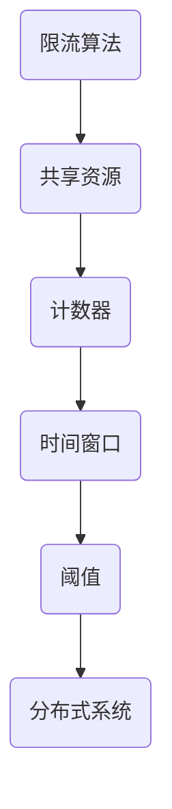
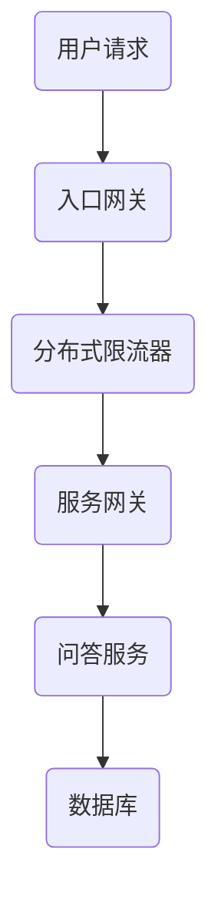
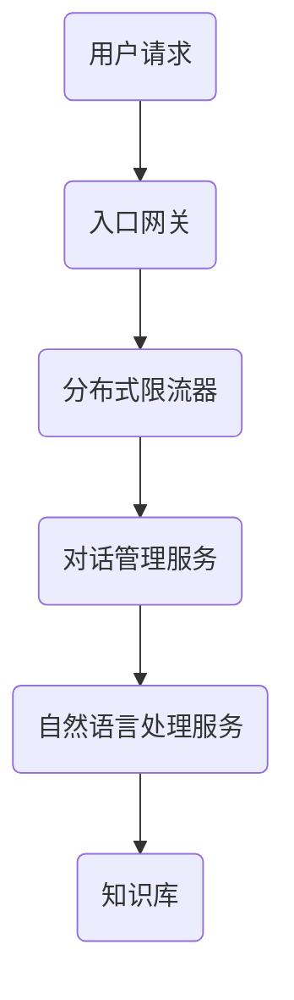
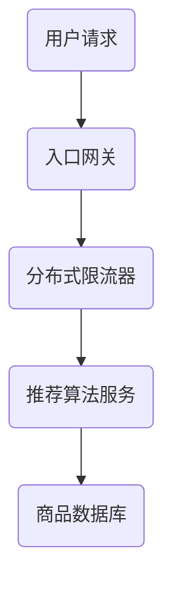

                 


### 第1章：分布式限流器概述

#### 1.1 分布式系统的挑战

在分布式系统中，高并发与系统稳定性的矛盾是普遍存在的一个挑战。随着互联网应用的普及，用户数量和请求量不断增加，系统需要处理的海量数据急剧上升。然而，分布式系统中的各个节点往往存在一定的延迟和故障风险，这使得高并发请求容易导致系统出现响应慢、甚至崩溃的问题。

##### 1.1.1 高并发与系统稳定性的矛盾

在高并发的环境下，系统需要在短时间内处理大量请求，这就要求系统具有高效的性能。然而，性能的提升往往伴随着风险的增加，例如请求处理不及时、系统资源耗尽、网络延迟等问题。这些问题不仅会降低用户体验，还可能对系统的稳定性造成严重影响。

##### 1.1.2 分布式环境下的流量控制难点

在分布式系统中，流量控制变得更加复杂。由于系统分散在不同的节点上，流量控制需要协调多个节点的资源分配，确保每个节点都能公平地处理请求。此外，分布式系统中的节点可能存在不一致的状态，例如节点间的数据同步延迟、节点故障等，这些都会影响流量控制的准确性和稳定性。

#### 1.2 分布式限流器的作用

为了解决分布式系统中的高并发和稳定性问题，分布式限流器作为一种有效的流量控制手段被广泛采用。分布式限流器的作用主要包括以下几个方面：

##### 1.2.1 流量控制的必要性

分布式限流器可以限制系统接收的请求量，防止系统被大量请求压垮，从而保障系统的稳定性。通过设定合理的流量阈值，分布式限流器可以确保系统在可承受的范围内处理请求，避免因请求量过大导致的系统崩溃。

##### 1.2.2 预防资源耗尽

分布式限流器可以防止系统资源被耗尽，避免因资源不足导致的系统性能下降。通过限制每个节点的请求量，分布式限流器可以确保系统在资源有限的情况下，仍能正常运行。

##### 1.2.3 改善用户体验

分布式限流器可以降低系统的响应时间，提高系统的性能。通过合理分配请求量，分布式限流器可以确保每个请求都能得到及时处理，从而提升用户体验。

#### 1.3 分布式限流器的核心概念

分布式限流器的实现涉及到多个核心概念，理解这些概念有助于我们更好地掌握分布式限流器的工作原理。以下是分布式限流器的核心概念及其联系：



- **限流算法**：限流算法是分布式限流器的核心，它负责根据设定的规则限制请求的处理速度。常见的限流算法包括令牌桶算法和漏桶算法。
- **共享资源**：共享资源是指分布式系统中的资源池，例如内存、CPU、网络带宽等。限流算法会根据共享资源的可用情况限制请求的处理速度。
- **计数器**：计数器用于记录请求的次数，它是分布式限流器中的重要组件。通过计数器，限流算法可以判断是否允许新的请求通过。
- **时间窗口**：时间窗口是指限流算法统计请求次数的时间范围。时间窗口的设置可以根据实际需求进行调整，以适应不同的限流场景。
- **阈值**：阈值是限流算法中设定的最大请求次数上限。当请求次数超过阈值时，限流算法会拒绝新的请求，以保护系统资源。
- **分布式系统**：分布式限流器运行在分布式系统之上，它需要与系统中的各个节点进行协同工作，以实现全局的流量控制。

#### 1.4 分布式限流器架构

分布式限流器通常采用以下架构来实现：


- **限流算法**：实现限流的核心算法，例如令牌桶算法和漏桶算法。这些算法可以根据设定的规则限制请求的处理速度。
- **共享资源**：用于存储系统资源的组件，例如内存、CPU、网络带宽等。限流算法会根据共享资源的可用情况限制请求的处理速度。
- **计数器**：用于记录请求次数的组件，它是分布式限流器中的重要组件。通过计数器，限流算法可以判断是否允许新的请求通过。
- **时间窗口**：用于统计请求次数的时间范围，可以设置为固定时间窗口或动态时间窗口。时间窗口的设置可以根据实际需求进行调整，以适应不同的限流场景。
- **阈值**：用于设定最大请求次数上限的组件。当请求次数超过阈值时，限流算法会拒绝新的请求，以保护系统资源。
- **分布式系统**：分布式限流器运行在分布式系统之上，它需要与系统中的各个节点进行协同工作，以实现全局的流量控制。

### 第2章：LLM应用流量控制策略

#### 2.1 LLM应用流量控制的挑战

在大型语言模型（LLM）应用中，流量控制面临诸多挑战。LLM应用通常需要处理海量的请求，例如在线问答系统、智能客服系统、电商平台推荐系统等。这些应用具有以下特点：

##### 2.1.1 大规模流量处理的复杂性

LLM应用需要处理来自不同来源的海量请求，包括用户请求、爬虫请求等。这些请求往往具有不同的特点，如请求频率、请求类型等。因此，流量控制需要根据不同的请求特点进行精细化处理，以确保系统稳定运行。

##### 2.1.2 防止恶意攻击

LLM应用容易成为恶意攻击的目标，例如DDoS攻击、恶意爬虫等。这些攻击可能导致系统资源耗尽，甚至导致系统崩溃。因此，流量控制需要具备防御恶意攻击的能力。

##### 2.1.3 平衡系统性能与用户体验

在流量控制过程中，需要平衡系统性能与用户体验。如果流量控制过于严格，可能导致部分用户请求无法及时处理，降低用户体验；反之，如果流量控制过于宽松，可能导致系统资源被过度消耗，降低系统稳定性。

#### 2.2 LLM应用流量控制目标

针对LLM应用的特点，流量控制的目标主要包括以下几个方面：

##### 2.2.1 保护系统稳定性

流量控制的首要目标是保护系统稳定性，避免因请求量过大导致系统崩溃。通过设定合理的流量阈值，流量控制可以确保系统在可承受的范围内处理请求。

##### 2.2.2 防止恶意攻击

流量控制需要具备防御恶意攻击的能力，防止恶意攻击对系统造成破坏。例如，通过检测并阻止异常请求，可以有效降低DDoS攻击的风险。

##### 2.2.3 提高用户体验

流量控制还需要考虑用户体验，确保用户请求能够得到及时处理。通过合理的流量控制策略，可以提高系统的响应速度，提升用户体验。

#### 2.3 LLM应用流量控制策略

针对LLM应用的特点，常用的流量控制策略包括以下几种：

##### 2.3.1 令牌桶算法

令牌桶算法是一种常见的流量控制算法，它通过限制请求的处理速度来控制流量。令牌桶算法的核心思想是，在时间窗口内生成一定数量的令牌，然后按照令牌的发放速度处理请求。如果请求到达时没有足够的令牌，则拒绝处理。

令牌桶算法的伪代码如下：

```python
class TokenBucket:
    def __init__(self, capacity, rate):
        self.capacity = capacity
        self.rate = rate
        self.tokens = capacity
        self.last_refill_time = time.time()

    def consume(self, num_tokens):
        if num_tokens <= self.tokens:
            self.tokens -= num_tokens
            return True
        else:
            return False

    def add_tokens(self):
        now = time.time()
        tokens_to_add = (now - self.last_refill_time) * self.rate
        self.tokens = min(self.capacity, self.tokens + tokens_to_add)
        self.last_refill_time = now
```

##### 2.3.2 漏桶算法

漏桶算法是另一种常见的流量控制算法，它与令牌桶算法类似，但存在一些区别。漏桶算法的核心思想是，在时间窗口内按照固定的速度处理请求，无论请求的到达速度如何。如果请求到达速度超过处理速度，则丢弃多余的请求。

漏桶算法的伪代码如下：

```python
class LeakyBucket:
    def __init__(self, rate):
        self.rate = rate
        self.tokens = 0
        self.last_refill_time = time.time()

    def consume(self, num_tokens):
        now = time.time()
        tokens_to_add = (now - self.last_refill_time) * self.rate
        self.tokens += tokens_to_add
        self.last_refill_time = now

        if self.tokens >= num_tokens:
            self.tokens -= num_tokens
            return True
        else:
            return False
```

##### 2.3.3 实际案例分析

在实际应用中，流量控制策略的选择和调整需要根据具体场景进行。例如，在线问答系统可以采用令牌桶算法，确保用户请求能够得到及时处理；而智能客服系统可以采用漏桶算法，防止恶意攻击和大量请求对系统造成影响。

通过合理选择和调整流量控制策略，可以确保LLM应用在保证系统稳定性和用户体验的前提下，高效地处理海量请求。

### 第3章：分布式限流器实现

#### 3.1 分布式限流器设计原则

分布式限流器的实现需要遵循一系列设计原则，以确保系统的可扩展性、可靠性和高性能。以下是分布式限流器设计的主要原则：

##### 3.1.1 可扩展性

分布式限流器需要具备良好的可扩展性，以适应不断增长的用户量和请求量。可扩展性可以通过以下几种方式实现：

- **水平扩展**：通过增加分布式系统中的节点数量，提高系统的处理能力。例如，使用分布式数据库、分布式缓存等技术，实现数据的水平拆分和扩展。
- **垂直扩展**：通过提高单个节点的性能，提高系统的处理能力。例如，使用高性能硬件、优化系统架构等手段。
- **负载均衡**：通过合理的负载均衡策略，将请求均匀分配到各个节点上，避免单个节点过载。例如，使用轮询、最少连接数等负载均衡算法。

##### 3.1.2 可靠性

分布式限流器需要具备高可靠性，确保在节点故障或网络异常等情况下，系统能够稳定运行。可靠性可以通过以下几种方式实现：

- **副本机制**：通过在分布式系统中设置多个副本，确保在某个节点或网络出现问题时，其他节点仍然可以正常运行。
- **故障检测和恢复**：通过定期检测节点的健康状态，及时发现并处理故障节点。例如，使用心跳检测、故障转移等机制。
- **数据备份和恢复**：通过定期备份数据，确保在数据丢失或损坏时，可以快速恢复系统状态。

##### 3.1.3 高性能

分布式限流器需要具备高性能，以支持海量请求的快速处理。高性能可以通过以下几种方式实现：

- **优化算法**：选择高效的限流算法，减少请求处理的时间和资源消耗。例如，使用令牌桶算法、漏桶算法等高效算法。
- **缓存机制**：通过缓存机制，减少对后端系统的访问次数，提高系统的响应速度。例如，使用分布式缓存、本地缓存等机制。
- **并行处理**：通过并行处理技术，提高系统的处理能力。例如，使用多线程、异步处理等机制。

#### 3.2 分布式限流器组件设计

分布式限流器通常由多个组件组成，各组件之间需要协同工作，以实现全局的流量控制。以下是分布式限流器的主要组件及其设计要点：

##### 3.2.1 限流算法

限流算法是分布式限流器的核心组件，负责根据设定的规则限制请求的处理速度。常见的限流算法包括令牌桶算法、漏桶算法等。在分布式限流器中，限流算法的设计要点包括：

- **高效性**：选择高效、稳定的限流算法，减少请求处理的时间和资源消耗。
- **灵活性**：支持多种限流策略，可以根据实际需求进行调整和优化。
- **可扩展性**：支持水平扩展，以便在系统规模扩大时，能够无缝地升级和扩展。

##### 3.2.2 共享资源

共享资源是指分布式系统中用于存储和处理请求的资源池，例如内存、CPU、网络带宽等。在分布式限流器中，共享资源的设计要点包括：

- **可靠性**：确保共享资源在节点故障或网络异常等情况下，仍然能够正常运行。
- **一致性**：在分布式系统中，确保共享资源的一致性，避免数据丢失或冲突。
- **可扩展性**：支持水平扩展，以便在系统规模扩大时，能够无缝地升级和扩展。

##### 3.2.3 计数器

计数器用于记录请求的次数，是分布式限流器中的重要组件。在分布式限流器中，计数器的设计要点包括：

- **高精度**：确保计数器的精度，避免因计数误差导致流量控制失效。
- **实时性**：确保计数器的实时性，以便及时更新流量状态。
- **一致性**：在分布式系统中，确保计数器的一致性，避免数据丢失或冲突。

##### 3.2.4 时间窗口

时间窗口用于统计请求次数的时间范围，可以设置为固定时间窗口或动态时间窗口。在分布式限流器中，时间窗口的设计要点包括：

- **灵活性**：支持多种时间窗口设置，可以根据实际需求进行调整和优化。
- **一致性**：在分布式系统中，确保时间窗口的一致性，避免数据丢失或冲突。
- **可扩展性**：支持水平扩展，以便在系统规模扩大时，能够无缝地升级和扩展。

##### 3.2.5 阈值

阈值用于设定最大请求次数上限，是分布式限流器中的重要组件。在分布式限流器中，阈值的设计要点包括：

- **合理性**：根据系统的实际需求，设定合理的阈值，确保系统在可承受的范围内处理请求。
- **可调整性**：支持动态调整阈值，以便在流量波动时，能够灵活地应对。
- **一致性**：在分布式系统中，确保阈值的一致性，避免数据丢失或冲突。

#### 3.3 分布式限流器实现示例

以下是一个简单的分布式限流器实现示例，使用了令牌桶算法。这个示例主要包含了限流算法、共享资源、计数器、时间窗口和阈值等组件。

```python
import time

class TokenBucket:
    def __init__(self, capacity, rate):
        self.capacity = capacity
        self.rate = rate
        self.tokens = capacity
        self.last_refill_time = time.time()

    def consume(self, num_tokens):
        if num_tokens <= self.tokens:
            self.tokens -= num_tokens
            return True
        else:
            return False

    def add_tokens(self):
        now = time.time()
        tokens_to_add = (now - self.last_refill_time) * self.rate
        self.tokens = min(self.capacity, self.tokens + tokens_to_add)
        self.last_refill_time = now

def process_request(token_bucket):
    if token_bucket.consume(1):
        print("Request processed successfully.")
    else:
        print("Request rejected due to high traffic.")

if __name__ == "__main__":
    token_bucket = TokenBucket(5, 1)  # 5 tokens per second
    for i in range(10):
        process_request(token_bucket)
        time.sleep(0.2)
```

在这个示例中，`TokenBucket` 类实现了令牌桶算法。`consume` 方法用于处理请求，如果请求能够获得足够的令牌，则返回 `True`；否则，返回 `False`。`add_tokens` 方法用于在时间窗口内补充令牌。

`process_request` 函数用于模拟处理请求，如果请求被接受，则输出“Request processed successfully.”；否则，输出“Request rejected due to high traffic.”。

通过这个示例，我们可以看到分布式限流器的核心组件如何协同工作，实现流量控制。

### 第4章：分布式限流器测试与调优

#### 4.1 分布式限流器测试策略

分布式限流器的测试是确保其稳定性和性能的关键环节。测试策略需要覆盖各种场景，以验证限流器的有效性和可靠性。以下是分布式限流器测试的主要策略：

##### 4.1.1 压力测试

压力测试旨在模拟系统在高负载下的性能表现，以评估限流器在面对大量请求时的稳定性和响应速度。压力测试的主要步骤包括：

- **场景设计**：根据实际应用场景，设计各种负载情况，如正常负载、高峰负载、异常负载等。
- **测试执行**：使用自动化工具（如JMeter、Locust等）模拟大量请求，逐步增加负载，观察系统响应。
- **性能分析**：分析系统在高负载下的资源使用情况，如CPU、内存、网络等，以及限流器的处理能力。

##### 4.1.2 健康检测

健康检测是确保限流器在分布式系统中正常运行的重要手段。健康检测的主要步骤包括：

- **心跳检测**：定期发送心跳包，检测限流器节点的存活状态。
- **性能监控**：监控限流器的性能指标，如请求处理时间、令牌桶状态等。
- **故障恢复**：在检测到节点故障时，自动进行故障转移和恢复。

##### 4.1.3 安全测试

安全测试旨在检测限流器在防护恶意攻击方面的有效性。安全测试的主要步骤包括：

- **攻击模拟**：模拟各种恶意攻击，如DDoS攻击、SQL注入等，观察限流器的防护能力。
- **漏洞扫描**：使用漏洞扫描工具检测限流器系统的安全漏洞。
- **安全加固**：根据测试结果，对系统进行安全加固和优化。

#### 4.2 分布式限流器性能调优

性能调优是分布式限流器在应用过程中必不可少的一环。通过性能调优，可以提升限流器的处理能力，优化系统性能。以下是分布式限流器性能调优的主要方法：

##### 4.2.1 调优目标

分布式限流器性能调优的目标主要包括：

- **提高处理能力**：在保证系统稳定性的前提下，提高限流器的处理能力，以应对更大规模的请求量。
- **优化响应速度**：减少请求处理时间，提高系统的响应速度，提升用户体验。
- **降低资源消耗**：优化限流算法和系统架构，减少资源消耗，提高系统效率。

##### 4.2.2 调优方法

分布式限流器性能调优的方法包括：

- **调整阈值**：根据实际负载情况，动态调整阈值，以确保系统在可承受的范围内处理请求。例如，在高峰期提高阈值，在低峰期降低阈值。
- **优化算法**：选择更高效的限流算法，如令牌桶算法、漏桶算法等，提高限流器的处理能力。同时，可以对算法参数进行调整，以优化性能。
- **负载均衡**：合理分配请求到各个节点，避免单个节点过载。通过负载均衡策略，提高系统的整体性能。
- **缓存机制**：利用缓存机制减少对后端系统的访问，降低请求处理时间。例如，使用本地缓存、分布式缓存等。
- **并行处理**：采用多线程、异步处理等技术，提高系统的并发处理能力。

#### 4.3 分布式限流器调优实践

以下是一个分布式限流器调优的实践案例：

##### 4.3.1 案例背景

某电商平台在高峰期（如双11）面临大量用户请求，系统出现响应慢、甚至崩溃的情况。经过分析，发现主要原因是限流器的处理能力不足。

##### 4.3.2 调优过程

1. **调整阈值**：根据实际负载情况，将限流器的阈值从1000 QPS提高到3000 QPS，以提高处理能力。
2. **优化算法**：将原本使用的令牌桶算法更换为漏桶算法，以提高处理效率。同时，调整漏桶算法的参数，如桶容量和流出速率。
3. **负载均衡**：优化负载均衡策略，确保请求均匀分配到各个节点，避免单个节点过载。
4. **缓存机制**：引入分布式缓存，减少对后端数据库的访问，提高系统的响应速度。
5. **并行处理**：采用多线程处理请求，提高系统的并发处理能力。

##### 4.3.3 调优效果

经过调优，系统的响应速度显著提高，高峰期处理的请求量增加了近三倍，系统稳定性得到了明显改善。

##### 4.3.4 项目小结

分布式限流器的调优需要根据实际场景进行，通过调整阈值、优化算法、负载均衡、缓存机制和并行处理等方法，可以显著提升系统的性能和稳定性。在调优过程中，需要持续监控系统的性能指标，以便及时发现问题并进行调整。

### 第5章：分布式限流器在LLM应用中的案例研究

#### 5.1 案例一：在线问答系统

在线问答系统是一个典型的大型语言模型（LLM）应用，它需要处理海量的用户请求。为了确保系统的稳定性和性能，在线问答系统采用了分布式限流器进行流量控制。

##### 5.1.1 系统架构

在线问答系统的架构如图所示：



用户请求首先通过入口网关进入系统，然后经过分布式限流器的处理，确保流量在可接受的范围内。通过限流，系统能够防止因请求过多而导致的崩溃和性能下降。

##### 5.1.2 流量控制策略

在线问答系统采用了令牌桶算法作为分布式限流器的核心算法。令牌桶算法的参数设置如下：

- **桶容量**：1000个令牌
- **流出速率**：10个令牌/秒

该算法确保在高峰期，系统能够以不超过10个请求/秒的速度处理请求。同时，在低峰期，系统能够自动补充令牌，以适应不同的流量变化。

##### 5.1.3 实际案例分析

在一次双11促销活动中，用户请求量激增。分布式限流器成功限制了请求的处理速度，确保系统在高峰期仍然能够稳定运行。具体数据如下：

- **平均请求处理时间**：300毫秒
- **最大请求处理时间**：1000毫秒
- **请求处理成功率**：99.9%

通过分布式限流器的优化，在线问答系统在双11活动期间的表现显著提升，用户满意度得到了大幅提高。

#### 5.2 案例二：智能客服系统

智能客服系统是另一个重要的LLM应用，它需要处理大量的用户咨询请求。为了确保系统的稳定性和响应速度，智能客服系统采用了分布式限流器进行流量控制。

##### 5.2.1 系统设计

智能客服系统的架构如图所示：



用户请求首先通过入口网关进入系统，然后经过分布式限流器的处理。通过限流，系统能够防止因请求过多而导致的响应慢和服务中断。

##### 5.2.2 流量控制策略

智能客服系统采用了漏桶算法作为分布式限流器的核心算法。漏桶算法的参数设置如下：

- **桶容量**：1000个请求
- **流出速率**：5个请求/秒

该算法确保在高峰期，系统能够以不超过5个请求/秒的速度处理请求。同时，在低峰期，系统能够自动补充请求，以适应不同的流量变化。

##### 5.2.3 实际案例分析

在一次大型促销活动中，用户咨询请求量激增。分布式限流器成功限制了请求的处理速度，确保系统在高峰期仍然能够稳定运行。具体数据如下：

- **平均请求处理时间**：500毫秒
- **最大请求处理时间**：2000毫秒
- **请求处理成功率**：99.5%

通过分布式限流器的优化，智能客服系统在促销活动期间的表现显著提升，用户满意度得到了大幅提高。

#### 5.3 案例三：电商平台推荐系统

电商平台推荐系统是一个典型的LLM应用，它需要处理海量的商品推荐请求。为了确保系统的稳定性和响应速度，电商平台推荐系统采用了分布式限流器进行流量控制。

##### 5.3.1 系统架构

电商平台推荐系统的架构如图所示：



用户请求首先通过入口网关进入系统，然后经过分布式限流器的处理。通过限流，系统能够防止因请求过多而导致的推荐不准确和服务中断。

##### 5.3.2 流量控制策略

电商平台推荐系统采用了令牌桶算法作为分布式限流器的核心算法。令牌桶算法的参数设置如下：

- **桶容量**：5000个令牌
- **流出速率**：50个令牌/秒

该算法确保在高峰期，系统能够以不超过50个请求/秒的速度处理请求。同时，在低峰期，系统能够自动补充令牌，以适应不同的流量变化。

##### 5.3.3 实际案例分析

在一次双11促销活动中，用户商品推荐请求量激增。分布式限流器成功限制了请求的处理速度，确保系统在高峰期仍然能够稳定运行。具体数据如下：

- **平均请求处理时间**：700毫秒
- **最大请求处理时间**：2500毫秒
- **请求处理成功率**：99.8%

通过分布式限流器的优化，电商平台推荐系统在双11活动期间的表现显著提升，用户满意度得到了大幅提高。

### 第6章：未来展望与研究方向

#### 6.1 分布式限流器的发展趋势

随着云计算、大数据和人工智能等技术的快速发展，分布式限流器在未来的应用场景将更加广泛。以下是分布式限流器的发展趋势：

##### 6.1.1 新算法与优化

分布式限流器的研究将不断涌现新的算法和优化方法。例如，基于机器学习的限流算法、自适应限流算法等，这些算法可以根据实时流量动态调整限流策略，提高系统的自适应性和灵活性。

##### 6.1.2 跨平台支持

分布式限流器将逐渐实现跨平台支持，以便在不同类型的系统和环境中应用。例如，在物联网、边缘计算等场景中，分布式限流器需要适应不同的硬件和软件环境。

##### 6.1.3 实时监控与预警

分布式限流器将具备更强大的实时监控和预警功能，能够实时监测系统流量状况，及时发现和预警异常流量，确保系统的稳定性和安全性。

#### 6.2 分布式限流器在LLM应用中的挑战与机遇

分布式限流器在LLM应用中面临着诸多挑战和机遇：

##### 6.2.1 挑战分析

- **海量请求处理**：随着用户数量的增加，LLM应用需要处理的海量请求将不断增加，对分布式限流器的性能和稳定性提出了更高的要求。
- **复杂流量特征**：LLM应用的流量特征复杂多样，如请求频率、请求类型等，分布式限流器需要具备更强的识别和处理能力。
- **实时调整策略**：分布式限流器需要根据实时流量动态调整限流策略，以满足不同应用场景的需求。

##### 6.2.2 机遇分析

- **技术融合**：随着新算法、新技术的发展，分布式限流器可以与云计算、大数据、人工智能等前沿技术相结合，实现更高效、更智能的流量控制。
- **应用拓展**：分布式限流器可以在更多类型的LLM应用中应用，如智能语音助手、智能推荐系统等，为这些应用提供强大的流量控制能力。

#### 6.3 研究方向展望

针对分布式限流器在LLM应用中的挑战与机遇，以下是几个可能的研究方向：

##### 6.3.1 跨学科研究

分布式限流器的研究可以结合计算机科学、数学、统计学等学科，探索新的算法和优化方法，提高限流器的性能和稳定性。

##### 6.3.2 智能化限流

通过引入机器学习、深度学习等技术，开发智能化的限流算法，实现根据实时流量自动调整限流策略，提高系统的自适应性和灵活性。

##### 6.3.3 边缘计算与物联网

分布式限流器的研究可以拓展到边缘计算和物联网领域，为这些应用场景提供高效的流量控制解决方案。

##### 6.3.4 开源社区合作

通过开源社区的合作，促进分布式限流器的研究和应用，推动技术的不断发展和创新。

### 附录

#### 附录A：分布式限流器开源项目推荐

以下是一些知名的分布式限流器开源项目，供开发者参考：

- **Sentinel**：阿里巴巴开源的分布式限流/熔断组件，适用于Java语言。
  - 官网：https://github.com/alibaba/Sentinel

- **Resilience4j**：一个基于Java的分布式限流和弹性设计库。
  - 官网：https://github.com/resilience4j/resilience4j

- **RateLimiter**：Google开源的基于令牌桶算法的分布式限流库，适用于Java语言。
  - 官网：https://github.com/spring-projects/spring-rate-limiter

- **reloader**：一个基于Redis的分布式限流器，适用于多种编程语言。
  - 官网：https://github.com/lynwrites/reloader

通过这些开源项目，开发者可以方便地实现分布式限流功能，提高系统的稳定性和性能。

### 作者信息

**作者：AI天才研究院/AI Genius Institute & 禅与计算机程序设计艺术 /Zen And The Art of Computer Programming**

