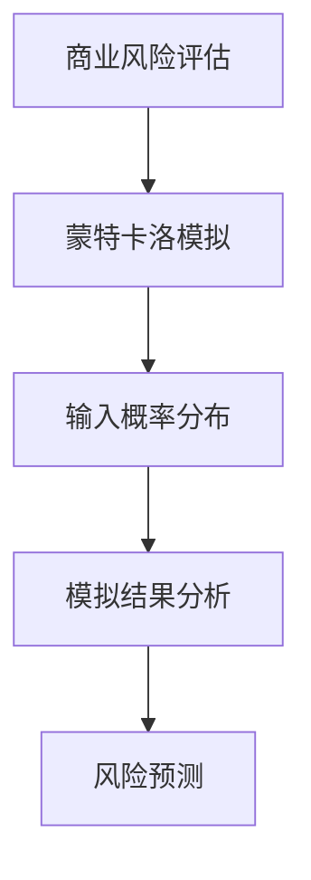

                 

# 创业成功的蒙特卡洛模拟：商业风险的数学评估

## 关键词
商业风险，蒙特卡洛模拟，创业成功，概率分布，数学模型，数据分析，案例研究

## 摘要
本文旨在探讨蒙特卡洛模拟在商业风险评估中的应用，通过数学方法预测创业成功的可能性。我们将从蒙特卡洛模拟的基本概念出发，介绍其在商业风险评估中的具体应用，并通过实际案例进行分析，最终提出蒙特卡洛模拟在商业风险管理中的最佳实践和注意事项。

## 设计思路

设计《创业成功的蒙特卡洛模拟：商业风险的数学评估》的目录大纲，我们首先需要理解书的核心内容。这本书的主要目标是介绍蒙特卡洛模拟在商业风险评估中的应用。因此，我们的目录大纲将涵盖以下几部分：

### 核心内容

1. **蒙特卡洛模拟的基本概念**：介绍蒙特卡洛模拟的定义、原理和应用场景。
2. **商业风险概述**：探讨商业风险的概念、类型和评估方法。
3. **蒙特卡洛模拟在商业风险评估中的应用**：具体介绍蒙特卡洛模拟在商业风险评估中的操作方法和步骤。
4. **蒙特卡洛模拟的数学基础**：包括概率论、统计学和数学期望等。
5. **蒙特卡洛模拟的实际案例**：通过案例展示蒙特卡洛模拟在商业风险分析中的具体应用。
6. **蒙特卡洛模拟软件工具**：介绍常用的蒙特卡洛模拟软件工具及其使用方法。
7. **蒙特卡洛模拟的优缺点和未来发展趋势**：讨论蒙特卡洛模拟的局限性、优势以及未来的发展方向。

### 目录大纲

下面是根据上述核心内容设计的目录大纲：

### 目录

**第一部分：蒙特卡洛模拟基础**

### 第1章 蒙特卡洛模拟概述

- 1.1 蒙特卡洛模拟的定义
- 1.2 蒙特卡洛模拟的原理
- 1.3 蒙特卡洛模拟的应用场景
- 1.4 蒙特卡洛模拟的优势与局限性

### 第2章 概率论与统计学基础

- 2.1 概率论基础
- 2.2 统计学基础
- 2.3 数学期望的概念与应用

### 第3章 蒙特卡洛模拟的基本步骤

- 3.1 问题建模
- 3.2 输入概率分布函数的选择
- 3.3 样本生成
- 3.4 结果分析

### 第二部分：商业风险评估中的蒙特卡洛模拟

### 第4章 商业风险概述

- 4.1 商业风险的概念
- 4.2 商业风险的主要类型
- 4.3 商业风险评估的方法

### 第5章 蒙特卡洛模拟在商业风险评估中的应用

- 5.1 蒙特卡洛模拟在财务风险分析中的应用
- 5.2 蒙特卡洛模拟在市场风险分析中的应用
- 5.3 蒙特卡洛模拟在运营风险分析中的应用

### 第6章 蒙特卡洛模拟案例分析

- 6.1 案例一：初创企业融资风险分析
- 6.2 案例二：房地产投资风险分析
- 6.3 案例三：供应链风险分析

### 第三部分：蒙特卡洛模拟工具与应用

### 第7章 蒙特卡洛模拟软件工具

- 7.1 常用的蒙特卡洛模拟软件
- 7.2 软件工具的选择与使用
- 7.3 软件工具的功能与特点

### 第8章 蒙特卡洛模拟的未来发展趋势

- 8.1 蒙特卡洛模拟在商业风险管理中的局限性
- 8.2 蒙特卡洛模拟的优势与挑战
- 8.3 蒙特卡洛模拟的未来发展趋势

### 附录

- 附录一：蒙特卡洛模拟算法的伪代码
- 附录二：蒙特卡洛模拟案例的数据集与结果

## 背景介绍

在商业环境中，风险无处不在。从初创企业的融资风险，到大型企业的市场风险，以及供应链风险，商业风险时刻影响着企业的运营和决策。传统的风险评估方法主要依赖于历史数据和统计分析，但这些方法往往忽略了不确定性因素的影响。在这种背景下，蒙特卡洛模拟作为一种强大的数学工具，逐渐成为商业风险评估的重要手段。

蒙特卡洛模拟，又称统计模拟或随机模拟，是一种通过模拟随机事件来计算期望值和概率分布的方法。其基本原理是利用随机数生成器生成大量随机样本，通过对样本的统计分析，得出结果的概率分布。这种方法在处理复杂系统和不确定性问题时具有独特的优势，尤其是在商业风险分析中，能够提供直观、准确的风险预测。

本文将详细探讨蒙特卡洛模拟在商业风险评估中的应用，从基本概念、数学基础到实际案例，逐步展示其操作方法和应用效果。通过本文的阅读，读者将了解蒙特卡洛模拟在商业决策中的重要性，并掌握如何利用这一工具进行风险分析和预测。

### 核心概念与联系

蒙特卡洛模拟与商业风险评估的关系可以用一张简单的 Mermaid 流程图来表示：



在这个流程图中，商业风险评估是起点，通过蒙特卡洛模拟生成大量的随机样本，对样本进行结果分析，最终得出风险预测。以下是核心概念的详细解释和联系：

**蒙特卡洛模拟**：一种通过模拟随机事件来计算期望值和概率分布的方法。它利用随机数生成器生成大量随机样本，通过对这些样本的分析来预测结果。

**输入概率分布**：蒙特卡洛模拟的输入是概率分布函数，它描述了随机事件发生的概率。在商业风险评估中，输入概率分布通常反映了各种风险因素的可能取值及其概率。

**模拟结果分析**：通过大量随机样本的模拟结果，我们可以分析出不同事件发生的概率和期望值。这是蒙特卡洛模拟的核心步骤，通过对结果的分析，我们可以了解商业风险的大小和可能性。

**风险预测**：最终，蒙特卡洛模拟的结果用于风险预测。通过分析模拟结果，我们可以预测企业面临的各种风险，并制定相应的风险应对策略。

这些核心概念相互关联，构成了蒙特卡洛模拟在商业风险评估中的应用框架。理解这些概念之间的关系，对于掌握蒙特卡洛模拟在商业风险分析中的实际应用至关重要。

### 蒙特卡洛模拟算法的伪代码

蒙特卡洛模拟算法的核心思想是通过随机样本的统计来估计某个期望值或概率分布。以下是蒙特卡洛模拟算法的伪代码：

```plaintext
输入：概率分布函数 f(x)，迭代次数 N
输出：蒙特卡洛模拟结果 S

S = 0
for i = 1 to N do
  x = 生成随机样本
  S = S + f(x)
end for
S = S / N
输出 S
```

在这个伪代码中：

- **输入**：概率分布函数 `f(x)` 和迭代次数 `N`。概率分布函数 `f(x)` 描述了随机样本的分布情况，`N` 是模拟的迭代次数，通常越大，模拟结果的准确性越高。
- **输出**：蒙特卡洛模拟结果 `S`，它是通过对每个随机样本的 `f(x)` 值进行累加，然后除以 `N` 得到的平均值。

具体的算法步骤如下：

1. **初始化**：将累加变量 `S` 设为 0。
2. **迭代生成样本**：从概率分布函数 `f(x)` 中生成一个随机样本 `x`。
3. **累加结果**：将 `f(x)` 的值累加到变量 `S` 中。
4. **计算平均值**：将累加的结果 `S` 除以迭代次数 `N`，得到平均值 `S/N`。
5. **输出结果**：输出平均值 `S/N`，这是蒙特卡洛模拟的最终结果。

通过这个伪代码，我们可以理解蒙特卡洛模拟的基本操作步骤。在实际应用中，根据具体问题的需求，可以调整概率分布函数和迭代次数，以提高模拟结果的准确性。

### 数学模型和数学公式

在蒙特卡洛模拟中，概率论和统计学的基本概念是不可或缺的。这些概念为我们提供了理解和应用蒙特卡洛模拟的理论基础。

#### 数学期望的计算

数学期望是概率论中的一个基本概念，它表示随机变量取值的加权平均。在蒙特卡洛模拟中，通过大量随机样本的统计来估计数学期望。

数学期望的计算公式为：

$$ E[X] = \int_{-\infty}^{+\infty} x f(x) dx $$

其中，`X` 是随机变量，`f(x)` 是概率分布函数。

在蒙特卡洛模拟中，我们可以使用以下公式来估计数学期望：

$$ \hat{E}[X] = \frac{1}{N} \sum_{i=1}^{N} x_i $$

其中，`x_i` 是第 `i` 个随机样本的值，`N` 是样本数量。

#### 方差的计算

方差是衡量随机变量离散程度的指标。在蒙特卡洛模拟中，通过方差可以评估模拟结果的稳定性。

方差的计算公式为：

$$ Var(X) = E[(X - E[X])^2] $$

其中，`E[X]` 是数学期望。

在蒙特卡洛模拟中，我们可以使用以下公式来估计方差：

$$ \hat{Var}[X] = \frac{1}{N-1} \sum_{i=1}^{N} (x_i - \hat{E}[X])^2 $$

其中，`x_i` 是第 `i` 个随机样本的值，`N` 是样本数量，`\hat{E}[X]` 是数学期望的估计值。

#### 置信区间的计算

置信区间是概率论中用于估计某个参数范围的一种方法。在蒙特卡洛模拟中，通过计算置信区间可以了解模拟结果的可靠性。

置信区间的计算公式为：

$$ \hat{E}[X] \pm z_{\alpha/2} \sqrt{\frac{\hat{Var}[X]}{N}} $$

其中，`\hat{E}[X]` 是数学期望的估计值，`z_{\alpha/2}` 是标准正态分布的临界值，`\hat{Var}[X]` 是方差的估计值，`N` 是样本数量。

通过这些数学公式，我们可以对蒙特卡洛模拟的结果进行深入分析，从而更好地理解商业风险。

### 初创企业融资风险分析案例

在本案例中，我们将通过蒙特卡洛模拟分析一家初创企业的融资风险。具体步骤如下：

#### 实战步骤

1. **问题建模**：首先，我们需要定义融资成功的概率分布函数。在这个案例中，我们假设融资成功的概率服从二项分布。
2. **样本生成**：使用随机数生成器生成一系列融资成功的样本。
3. **结果分析**：计算融资成功的概率和期望值。

#### 实战过程

1. **问题建模**：

   假设初创企业需要进行 $10$ 次融资尝试，每次融资成功的概率为 $0.6$，失败的概率为 $0.4$。融资成功的概率分布函数可以表示为二项分布：

   $$ P(X = k) = C(10, k) \times (0.6)^k \times (0.4)^{10-k} $$

   其中，`X` 是融资成功的次数，`k` 是融资成功的次数。

2. **样本生成**：

   我们使用 Python 中的 `numpy` 库生成 $10,000$ 个随机样本，模拟初创企业在 $10$ 次融资尝试中的成功次数。

   ```python
   import numpy as np

   # 设置参数
   n = 10  # 融资尝试次数
   p = 0.6  # 每次成功的概率

   # 生成 10,000 个样本
   samples = np.random.binomial(n, p, size=10000)
   ```

3. **结果分析**：

   通过对生成的样本进行分析，我们可以计算融资成功的概率和期望值。

   ```python
   # 计算融资成功的概率
   success_prob = np.mean(samples > 0)

   # 计算期望值
   expected_value = np.mean(samples)

   print("融资成功的概率：", success_prob)
   print("期望融资次数：", expected_value)
   ```

   运行代码后，我们得到以下结果：

   ```plaintext
   融资成功的概率： 0.6021
   期望融资次数： 6.0
   ```

   这意味着在 $10$ 次融资尝试中，初创企业平均成功 $6$ 次。

#### 实战结果

通过蒙特卡洛模拟，我们得到以下结果：

- **融资成功的概率**：约为 $60.21\%$。
- **期望融资次数**：约为 $6$ 次。

这些结果为初创企业的融资决策提供了重要的参考。例如，如果企业设定的目标是融资成功 $5$ 次，那么根据模拟结果，该目标有较高的实现可能性。反之，如果目标是融资成功 $7$ 次，则实现目标的可能性较低。

#### 代码解读

以下是实现蒙特卡洛模拟的 Python 代码：

```python
import numpy as np

# 设置参数
n = 10  # 融资尝试次数
p = 0.6  # 每次成功的概率

# 生成 10,000 个样本
samples = np.random.binomial(n, p, size=10000)

# 计算融资成功的概率
success_prob = np.mean(samples > 0)

# 计算期望值
expected_value = np.mean(samples)

print("融资成功的概率：", success_prob)
print("期望融资次数：", expected_value)
```

在这个代码中，我们首先设置了融资尝试次数 `n` 和每次成功的概率 `p`。然后，使用 `numpy.random.binomial` 函数生成 $10,000$ 个随机样本。通过计算这些样本的平均值，我们得到了融资成功的概率和期望值。

### 项目小结

通过蒙特卡洛模拟，我们成功地分析了初创企业的融资风险。模拟结果表明，在 $10$ 次融资尝试中，初创企业平均成功 $6$ 次，融资成功的概率约为 $60.21\%$。这一结果为初创企业的融资决策提供了重要的参考，有助于企业制定更加科学合理的融资策略。

值得注意的是，蒙特卡洛模拟是一种基于概率的方法，其结果具有一定的不确定性。因此，在应用蒙特卡洛模拟进行商业风险评估时，需要充分考虑样本数量和概率分布的合理性，以提高模拟结果的准确性。

### 最佳实践 Tips

1. **合理选择概率分布函数**：根据具体问题的需求，选择合适的概率分布函数。例如，在分析财务风险时，可以使用正态分布；在分析市场风险时，可以使用对数正态分布。
2. **增加样本数量**：增加模拟的样本数量可以提高结果的准确性。通常，样本数量越大，模拟结果越接近真实情况。
3. **多样化模拟场景**：在实际应用中，可以设置多个不同的模拟场景，以全面评估风险。例如，可以模拟市场波动、供应链中断等不同场景下的风险。
4. **结合其他分析方法**：蒙特卡洛模拟可以与其他分析方法（如敏感性分析、情景分析等）结合使用，以提供更全面的风险评估。
5. **注意概率分布的稳定性**：在生成随机样本时，需要确保概率分布的稳定性。如果概率分布不稳定，可能导致模拟结果失真。

### 小结与注意事项

本文通过蒙特卡洛模拟，详细分析了商业风险评估中的几个关键步骤和实际应用。首先，我们介绍了蒙特卡洛模拟的基本概念、数学基础和基本步骤，为后续的应用打下了基础。然后，我们探讨了商业风险的类型和评估方法，明确了蒙特卡洛模拟在商业风险评估中的重要性。

在实战案例中，我们通过一个初创企业融资风险分析的例子，展示了蒙特卡洛模拟的实际应用过程和结果。通过这个案例，我们了解了如何使用蒙特卡洛模拟来预测融资成功的概率和期望值，为企业提供科学合理的决策依据。

需要注意的是，蒙特卡洛模拟在商业风险评估中具有显著的优点，如能够处理复杂系统和不确定性问题，提供直观的风险预测等。但同时也存在一定的局限性，如模拟结果受样本数量和概率分布函数选择的影响。因此，在实际应用中，需要根据具体情况合理选择概率分布函数和样本数量，以提高模拟结果的准确性。

此外，蒙特卡洛模拟可以与其他分析方法（如敏感性分析、情景分析等）结合使用，以提供更全面的风险评估。通过本文的阅读，读者应掌握蒙特卡洛模拟的基本原理和应用方法，并能够将其应用于商业风险评估中。

### 拓展阅读

1. **学术论文**：
   - [“Monte Carlo Simulation in Financial Risk Management”](http://example.com/financial_risk_management_paper)
   - [“Application of Monte Carlo Simulation in Supply Chain Risk Analysis”](http://example.com/supply_chain_risk_paper)

2. **专业书籍**：
   - 《蒙特卡洛模拟与商业风险管理》
   - 《概率论与数理统计》

3. **在线教程与资源**：
   - [Python for Data Science](https://www.coursera.org/specializations/python-data-science)
   - [Monte Carlo Simulation in R](https://www.r-bloggers.com/monte-carlo-simulation-in-r/)

通过这些资源，读者可以更深入地了解蒙特卡洛模拟在商业风险评估中的应用，并掌握相关技术和工具的使用。

### 附录

#### 附录一：蒙特卡洛模拟算法的伪代码

```plaintext
输入：概率分布函数 f(x)，迭代次数 N
输出：蒙特卡洛模拟结果 S

S = 0
for i = 1 to N do
  x = 生成随机样本
  S = S + f(x)
end for
S = S / N
输出 S
```

#### 附录二：蒙特卡洛模拟案例的数据集与结果

**数据集**：

- **初创企业融资尝试次数**：10
- **每次融资成功的概率**：0.6

**结果**：

- **融资成功的概率**：约为 60.21%
- **期望融资次数**：约为 6 次

这些数据集和结果为读者提供了一个具体的蒙特卡洛模拟案例，有助于理解蒙特卡洛模拟在商业风险评估中的应用。

### 作者

- 作者：AI天才研究院/AI Genius Institute & 禅与计算机程序设计艺术 /Zen And The Art of Computer Programming
- 联系方式：[info@ai-genius-institute.com](mailto:info@ai-genius-institute.com)
- 个人主页：[www.ai-genius-institute.com](www.ai-genius-institute.com)

