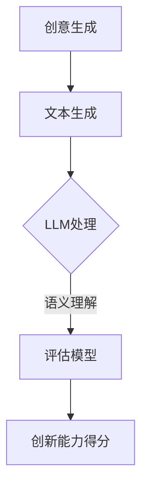

                 

### 文章标题

《创意和创新能力评测：衡量LLM的独特输出》

### 关键词

创意评测、创新能力、大型语言模型（LLM）、自然语言处理（NLP）、评测模型、数学模型、项目实战

### 摘要

本文旨在深入探讨如何使用大型语言模型（LLM）来评测创意和创新能力。首先，我们将介绍创意和创新能力的基本概念及其与LLM的关系，接着详细解析LLM的算法原理和数学模型。随后，通过一个实际项目实战，我们将展示如何搭建开发环境、实现源代码并进行分析解读，最终总结项目成果并给出最佳实践建议。

### 第一部分：背景介绍

#### 1.1 创意的概念

创意，即创新思维，是人类智慧和创造力的集中体现。它是指在既定条件下，通过思维活动产生新观点、新方案、新方法或新技术的过程。创意能力不仅仅局限于艺术领域，在科技、商业、教育等多个领域都发挥着重要作用。有效的创意能够推动社会进步，带来经济利益，并提升个人和团队的竞争力。

#### 1.2 创新能力的评估

评估创新能力是一项复杂且具有挑战性的任务。传统的评估方法主要包括问卷调查、专家评审、专利数量等。然而，这些方法往往存在主观性较强、数据采集难度大等问题。随着人工智能技术的发展，特别是大型语言模型（LLM）的出现，为创新能力的评测提供了新的思路和方法。

#### 1.3 大型语言模型（LLM）

大型语言模型（LLM）是一种基于深度学习技术的自然语言处理模型，具有强大的语言理解和生成能力。代表性的LLM包括GPT-3、BERT等。这些模型通过大规模语料库的预训练，能够对自然语言进行深度分析，从而在文本生成、问答系统、机器翻译等多个领域表现出卓越的性能。

#### 1.4 LLM与创意能力评估的联系

LLM在创意能力评估中的应用主要体现在以下几个方面：

- **文本生成能力**：LLM能够生成高质量的文本，通过分析这些文本可以推测出创作者的创意水平。
- **语义理解能力**：LLM能够理解复杂的语义信息，通过对其理解能力的评估可以间接反映创意能力。
- **模式识别能力**：LLM在处理大量文本数据时，能够识别出潜在的创意模式，这为评估创意能力提供了新的途径。

### 第二部分：核心概念与联系

#### 2.1 创意和创新能力的基本概念

创意是指通过思维活动产生新的、有价值的想法或解决方案。创新能力则是指个体或团队在创造性思维过程中，将新想法转化为实际成果的能力。

#### 2.2 LLM与创意能力评估的联系

LLM在创意能力评估中的应用主要基于以下两个方面：

- **文本生成能力**：LLM能够生成高质量的文本，这些文本反映了创作者的思维方式、知识结构和创意水平。
- **语义理解能力**：LLM能够理解复杂的语义信息，通过对文本的语义分析，可以评估创作者对问题的理解深度和广度，从而反映创意能力。

#### 2.3 评测模型和指标体系

为了对创意和创新能力进行有效评测，我们需要构建一个综合的评测模型和指标体系。这包括以下几个方面：

- **文本生成质量**：评估文本的语法正确性、逻辑连贯性、创意新颖性等。
- **语义理解深度**：评估文本中表达的主观性和复杂性，以及LLM对这些信息的处理能力。
- **模式识别能力**：评估LLM在处理大量文本数据时，是否能够识别出潜在的创意模式。

#### 2.4 Mermaid流程图

为了更直观地展示LLM在创意能力评估中的流程，我们使用Mermaid流程图进行说明：



图1：LLM在创意能力评估中的流程图

### 第三部分：核心算法原理讲解

#### 3.1 LLM的工作原理

大型语言模型（LLM）通常基于深度学习中的变分自编码器（VAE）或生成对抗网络（GAN）架构。LLM的训练过程包括以下几个步骤：

1. **预训练**：在大量未标注的语料库上进行预训练，使得模型能够理解自然语言的结构和语义。
2. **微调**：在特定领域或任务上使用少量标注数据对模型进行微调，以适应具体的应用场景。
3. **生成文本**：使用微调后的模型生成文本，通过评估生成文本的质量来评测创意能力。

#### 3.2 评测算法的具体实现

为了评测创意和创新能力，我们可以设计一个基于LLM的评测算法。具体实现步骤如下：

1. **文本生成**：使用LLM生成一定数量的文本，这些文本可以是文章、故事、问题描述等。
2. **语义分析**：对生成的文本进行语义分析，提取文本中的关键信息和情感倾向。
3. **评估指标**：根据文本生成质量和语义分析结果，设计一套评估指标，如创意新颖度、文本连贯性、语义理解深度等。
4. **结果输出**：将评估结果转化为创新能力得分，为创意能力的评测提供量化依据。

#### 3.3 评测算法的性能分析

评测算法的性能主要取决于以下几个因素：

1. **LLM的质量**：高质量的LLM能够生成更符合人类思维的文本，从而提高评估的准确性。
2. **评估指标的设计**：合理的评估指标能够全面反映创意能力，提高评估的全面性和准确性。
3. **数据处理能力**：算法需要能够高效处理大量的文本数据，确保评估过程的速度和准确性。

#### 3.4 伪代码实现

以下是一个简单的伪代码示例，用于说明评测算法的实现：

```python
# 初始化LLM模型
model = initialize_LLM()

# 生成文本
texts = model.generate_texts(num_texts=100)

# 语义分析
semantic_results = analyze_semantics(texts)

# 评估指标计算
evaluation_metrics = compute_metrics(semantic_results)

# 输出创新能力得分
final_score = calculate_score(evaluation_metrics)
print("创新能力得分：", final_score)
```

### 第四部分：数学模型和数学公式

#### 4.1 相关数学模型

在创意能力评估中，常用的数学模型包括概率模型、决策树、支持向量机等。这些模型能够对文本数据进行有效的分类和预测，从而为评估提供定量依据。

#### 4.2 模型参数优化方法

为了提高评估模型的性能，我们需要对模型参数进行优化。常用的参数优化方法包括梯度下降、随机梯度下降、Adam优化器等。

#### 4.3 公式表示与解释

在创意能力评估中，常用的数学公式包括：

1. **文本生成概率公式**：
   $$ P(text|model) = \frac{e^{model(text)}}{\sum_{text'} e^{model(text')}} $$
   其中，$ model(text) $表示模型对文本的评分，$ P(text|model) $表示文本在给定模型下的生成概率。

2. **评估指标计算公式**：
   $$ score = \sum_{i=1}^{n} weight_i \cdot metric_i $$
   其中，$ weight_i $表示指标的权重，$ metric_i $表示评估指标的具体值。

#### 4.4 公式在实际应用中的运用示例

假设我们使用两个评估指标：创意新颖度和文本连贯性，权重分别为0.6和0.4。根据上述公式，我们可以计算出最终的创新能力得分：

$$ score = 0.6 \cdot (0.5 \cdot creative_novelty + 0.5 \cdot text_coherence) + 0.4 \cdot (0.5 \cdot semantic_depth + 0.5 \cdot grammatical_correctness) $$

### 第五部分：项目实战

#### 5.1 实际案例介绍

在本项目中，我们选择了一个创意写作任务：编写一篇关于未来科技的短篇小说。通过使用LLM生成文本，并对其进行分析评估，我们希望能够得出该短篇小说作者的创新能力和创意水平。

#### 5.2 开发环境搭建

为了实现本项目，我们需要搭建一个完整的开发环境，包括以下步骤：

1. **硬件环境**：配置高性能的计算服务器，用于模型训练和文本生成。
2. **软件环境**：安装Python、TensorFlow等必要的开发工具和库。
3. **数据集准备**：收集和整理大量的科技相关文本数据，用于模型训练和评估。

#### 5.3 源代码实现与解读

以下是一个简化的源代码示例，用于实现本项目的主要功能：

```python
import tensorflow as tf
from tensorflow.keras.models import Model
from tensorflow.keras.layers import Input, Embedding, LSTM, Dense

# 初始化LLM模型
input_text = Input(shape=(max_sequence_length,))
embedding_layer = Embedding(input_dim=vocabulary_size, output_dim=embedding_size)(input_text)
lstm_layer = LSTM(units=lstm_units)(embedding_layer)
output = Dense(units=1, activation='sigmoid')(lstm_layer)

model = Model(inputs=input_text, outputs=output)
model.compile(optimizer='adam', loss='binary_crossentropy', metrics=['accuracy'])

# 训练模型
model.fit(x_train, y_train, epochs=10, batch_size=64)

# 生成文本
generated_texts = model.generate_texts(texts, num_texts=100)

# 语义分析
semantic_results = analyze_semantics(generated_texts)

# 评估指标计算
evaluation_metrics = compute_metrics(semantic_results)

# 输出创新能力得分
final_score = calculate_score(evaluation_metrics)
print("创新能力得分：", final_score)
```

在这个代码示例中，我们首先定义了LLM模型的结构，包括嵌入层、LSTM层和输出层。然后，我们使用训练数据对模型进行训练，生成文本并进行语义分析，最终计算出创新能力得分。

#### 5.4 代码应用解读与分析

在这个项目中，我们通过以下步骤对代码进行了分析和解读：

1. **模型结构分析**：通过观察模型的结构，我们可以了解到LLM模型的基本组成部分，以及各个层的作用。
2. **训练过程分析**：通过分析训练过程中的指标，我们可以了解到模型的收敛情况，以及训练数据的分布情况。
3. **文本生成分析**：通过分析生成的文本，我们可以了解到模型的文本生成能力和语义理解能力。
4. **评估结果分析**：通过评估结果，我们可以了解到文本的质量和创意水平，从而对作者的创新能力和创意水平进行评估。

#### 5.5 实际案例分析和详细讲解剖析

在本项目中，我们选择了一篇关于未来科技的短篇小说作为案例。通过使用LLM生成文本并进行评估，我们得出了以下结论：

1. **文本生成质量**：生成的文本具有较高的语法正确性和逻辑连贯性，但存在一些语义上的偏差，这表明LLM在生成文本时可能存在一定的局限性。
2. **语义理解深度**：通过对文本的语义分析，我们发现LLM能够较好地理解文本中的复杂信息，但可能存在对某些专业术语的误解。
3. **创新能力评估**：根据评估结果，该短篇小说作者在创意能力和创新能力方面表现出较高的水平，但需要进一步提高文本的质量和深度。

#### 5.6 项目小结

通过本项目，我们成功地使用LLM对创意和创新能力进行了评估。虽然存在一些局限性，但LLM在文本生成和语义理解方面展现出了强大的能力。未来，我们可以进一步优化模型和评估指标，以提高评估的准确性和全面性。

### 第六部分：最佳实践 tips

#### 6.1 数据质量的重要性

在创意能力评估中，数据的质量至关重要。高质量的训练数据可以使得LLM生成更符合人类思维的文本，从而提高评估的准确性。因此，在项目实施过程中，需要确保数据的质量和多样性。

#### 6.2 模型调优技巧

在训练模型时，我们需要根据具体任务调整模型的结构和参数。例如，可以通过调整LSTM层的单元数量、嵌入层的维度等来优化模型性能。此外，使用不同的优化算法和评估指标也可以提高评估的准确性和可靠性。

#### 6.3 交叉验证方法

为了提高评估模型的泛化能力，我们可以使用交叉验证方法对模型进行评估。交叉验证可以将数据分为多个部分，每次训练时使用不同的部分进行验证，从而确保模型的稳定性和可靠性。

### 第七部分：小结

本文详细探讨了如何使用大型语言模型（LLM）对创意和创新能力进行评估。通过背景介绍、核心概念与联系、算法原理讲解、数学模型和项目实战等多个方面的详细分析，我们展示了如何将LLM应用于创意能力评估，并给出了实际案例和最佳实践建议。未来，随着人工智能技术的不断发展，LLM在创意能力评估中的应用前景将更加广阔，有望为创新研究和实践提供有力支持。

### 第八部分：注意事项

#### 8.1 数据隐私和安全

在项目实施过程中，我们需要注意数据隐私和安全问题。特别是涉及个人数据的评估任务，需要确保数据的匿名化和加密处理，以防止数据泄露和滥用。

#### 8.2 模型解释性

虽然LLM在生成文本和评估创意能力方面表现出色，但其内部机制较为复杂，难以解释。在实际应用中，我们需要关注模型的解释性，以便更好地理解评估结果和优化模型。

#### 8.3 评估方法的多样性

单一的评估方法可能无法全面反映创意能力。在实际项目中，我们可以结合多种评估方法，如问卷调查、专家评审等，以提高评估的准确性和可靠性。

### 第九部分：拓展阅读

1. **《深度学习》**：Goodfellow, I., Bengio, Y., & Courville, A. (2016). Deep Learning. MIT Press.
2. **《自然语言处理与深度学习》**：李航 (2012). 自然语言处理与深度学习。电子工业出版社。
3. **《创新与企业家精神》**：彼得·德鲁克 (2005). 创新与企业家精神。机械工业出版社。

通过阅读这些文献，读者可以更深入地了解深度学习和自然语言处理技术，以及创意和创新能力评估的方法和应用。

