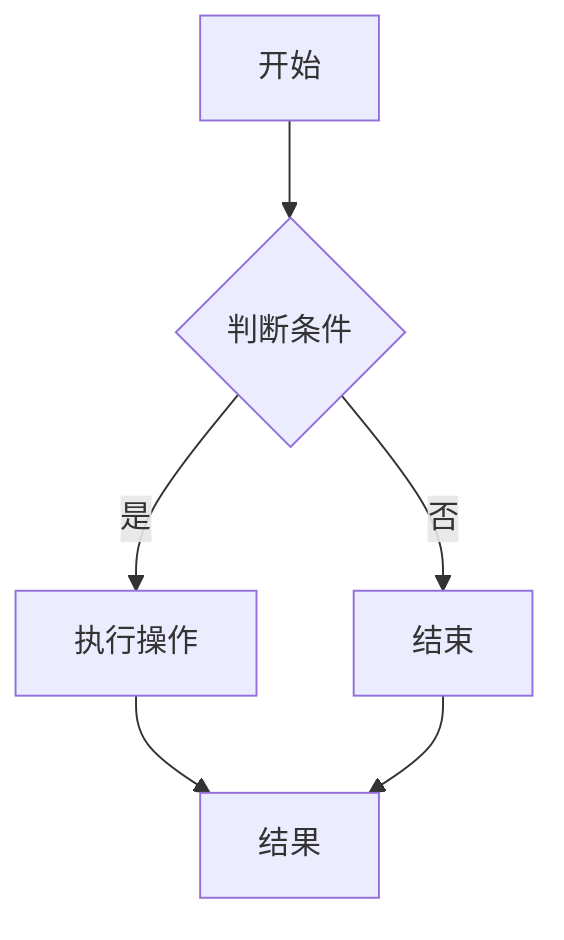

                 


### 创新性评分：量化LLM的创造力和独特见解

#### 关键词：创新性评分、量化、LLM、创造力、独特见解、计算机科学、人工智能

#### 摘要：

本文旨在探讨如何量化大型语言模型（LLM）的创造力和独特见解。随着人工智能技术的发展，LLM在自然语言处理领域表现出色，但对其创新能力的量化评价仍然是一个挑战。本文首先介绍了创新性评分的概念，接着深入解析了LLM的基础知识，包括其架构、训练过程和工作原理。然后，本文探讨了量化创造力和独特见解的理论基础，提出了具体的评分方法和实际应用案例。最后，本文讨论了创新性评分面临的挑战及其未来发展方向。

### 第1章 引言

#### 1.1 创新性评分的背景与重要性

在现代社会，创新被视为企业竞争力和国家发展的重要驱动力。随着人工智能技术的迅猛发展，特别是大型语言模型（LLM）的出现，创新性评分的重要性愈发凸显。创新性评分旨在量化创新产品的价值、评价创新者的能力，并为决策者提供数据支持。

创新性评分不仅适用于科技行业，还广泛应用于商业、教育、医疗等多个领域。在科技行业，创新性评分有助于评估人工智能项目的成功概率，指导投资决策，优化资源分配。在商业领域，创新性评分能够帮助企业家识别有潜力的创新项目，提高市场竞争力。在教育领域，创新性评分可用于评价学生的学习成果，促进个性化教育。在医疗领域，创新性评分有助于评估医疗创新产品的有效性和安全性。

#### 1.2 大型语言模型（LLM）的发展

大型语言模型（LLM）是自然语言处理（NLP）领域的重要突破。自2018年GPT-3问世以来，LLM在语言理解和生成任务上取得了显著进展。LLM通过深度学习技术，从大量文本数据中学习语言规律，实现了对自然语言的高效理解和生成。

LLM的发展得益于以下几个关键因素：

1. **计算能力的提升**：随着云计算和GPU技术的进步，大规模数据处理和训练成为可能，为LLM的发展提供了硬件基础。
2. **海量数据的积累**：互联网的发展使得大量文本数据得以收集和存储，为LLM的训练提供了丰富素材。
3. **深度学习算法的优化**：深度学习算法在语音识别、图像识别等领域的成功应用，为LLM的研究提供了借鉴和启示。
4. **跨学科研究的推动**：计算机科学、语言学、认知科学等领域的交叉研究，为LLM的理论基础和实践应用提供了支持。

#### 1.3 书籍结构安排与目标读者

本书结构分为六个章节，具体安排如下：

- **第1章 引言**：介绍创新性评分的概念、背景和重要性，以及LLM的发展。
- **第2章 LLModels基础**：介绍LLM的基本概念、架构和训练过程。
- **第3章 创造力与独特见解的量化**：探讨量化创造力和独特见解的理论基础和方法。
- **第4章 创新性评分方法**：提出具体的创新性评分方法，包括统计学和机器学习方法。
- **第5章 实际应用案例分析**：展示创新性评分在不同领域的实际应用案例。
- **第6章 挑战与未来展望**：讨论创新性评分面临的挑战和未来发展方向。

本书的目标读者是人工智能领域的研究者、开发者和决策者。通过本书，读者可以深入了解创新性评分的理论和方法，掌握如何量化LLM的创造力和独特见解，为实际应用提供指导。

### 第2章 LLModels基础

#### 2.1 什么是LLM

大型语言模型（LLM）是一种基于深度学习技术构建的自然语言处理模型，旨在理解和生成自然语言。LLM通过对大量文本数据进行训练，学习语言结构和语义信息，从而实现文本分类、机器翻译、文本生成等任务。

LLM的核心组成部分包括：

1. **嵌入层**：将单词转换为向量表示，为后续处理提供输入。
2. **编码器**：对输入文本进行编码，提取语义信息。
3. **解码器**：根据编码器输出的隐藏状态，生成输出文本。
4. **注意力机制**：在编码和解码过程中引入注意力机制，提高模型对关键信息的关注。

#### 2.2 语言模型的核心组成部分

1. **嵌入层**：嵌入层将单词转换为向量表示。这些向量表示单词的语义信息，有助于模型理解文本。常见的嵌入方法包括词袋模型、Word2Vec、BERT等。

2. **编码器**：编码器是LLM的核心部分，负责对输入文本进行编码。编码器通常采用循环神经网络（RNN）或变压器（Transformer）架构，能够捕捉文本的长期依赖关系。

3. **解码器**：解码器根据编码器输出的隐藏状态，生成输出文本。解码器同样采用RNN或Transformer架构，能够实现高效的文本生成。

4. **注意力机制**：注意力机制在编码和解码过程中引入了额外的权重，使得模型能够关注输入文本中的关键信息。注意力机制有助于提高模型的生成质量和鲁棒性。

#### 2.3 LLM的训练与优化算法

LLM的训练过程涉及以下几个关键步骤：

1. **数据准备**：收集和整理大量文本数据，进行预处理，包括分词、去噪、去停用词等操作。
2. **模型初始化**：初始化嵌入层、编码器和解码器的参数。
3. **损失函数定义**：选择合适的损失函数，如交叉熵损失函数，用于衡量模型预测与真实标签之间的差异。
4. **优化算法选择**：选择优化算法，如Adam、RMSProp等，用于更新模型参数。
5. **训练过程**：通过迭代更新模型参数，使得模型在训练数据上达到收敛。

在训练过程中，LLM通过反向传播算法更新参数。反向传播算法通过计算损失函数关于模型参数的梯度，调整模型参数，以最小化损失函数。在训练过程中，调整学习率、批大小等超参数有助于提高模型的训练效果。

#### 2.4 LLM的工作原理

LLM的工作原理主要包括以下几个步骤：

1. **输入处理**：将输入文本转换为嵌入向量，作为模型的输入。
2. **编码过程**：编码器对输入文本进行编码，提取语义信息。编码器通过循环神经网络或变压器架构，逐步更新隐藏状态。
3. **生成过程**：解码器根据编码器输出的隐藏状态，生成输出文本。解码器在生成过程中，不断更新目标词的嵌入向量，并通过softmax函数生成概率分布。
4. **输出输出**：将生成的文本输出，完成文本生成任务。

在文本生成过程中，LLM通过注意力机制关注输入文本中的关键信息，提高生成的准确性和流畅性。同时，LLM通过学习大量的文本数据，能够生成多样化和创造性的文本。

### 第3章 创造力与独特见解的量化

#### 3.1 创造力的定义与度量

创造力是指产生新颖而有价值想法的能力。在人工智能领域，创造力主要体现在模型生成的内容和想法上。度量创造力需要考虑以下几个关键因素：

1. **新颖性**：创造力的高低与生成内容的新颖程度密切相关。新颖性可以通过比较生成内容与已有知识的差异来衡量。
2. **实用性**：创造力不仅体现在新颖性上，还要求生成的内容具有实际应用价值。实用性可以通过评估生成内容在特定任务中的表现来衡量。
3. **可解释性**：创造力还需要考虑生成内容是否易于理解和解释。可解释性有助于用户更好地接受和应用生成的内容。

#### 3.2 独特见解的识别与量化

独特见解是指从不同角度或以独特方式看待问题，提出有价值的观点或解决方案。识别和量化独特见解需要关注以下几个关键方面：

1. **多样性**：独特见解的多样性体现了从不同角度思考问题的能力。多样性可以通过生成内容的主题、风格和结构来衡量。
2. **相关性**：独特见解的相关性是指其与问题背景和实际需求的相关程度。相关性可以通过分析生成内容与问题背景的匹配度来衡量。
3. **创新性**：独特见解的创新性是指其提出的观点或解决方案在现有知识体系中的独特性。创新性可以通过评估生成内容与已有文献的差异来衡量。

#### 3.3 相关的数学模型

为了量化创造力和独特见解，我们可以借助一些数学模型和算法。以下是一些常用的数学模型：

1. **词嵌入模型**：词嵌入模型将单词转换为向量表示，有助于分析文本的语义信息。常见的词嵌入模型包括Word2Vec、BERT等。
2. **生成对抗网络（GAN）**：GAN通过生成器和判别器之间的对抗训练，生成高质量的数据。GAN可以应用于文本生成任务，从而评估创造力和独特见解。
3. **文本相似性度量**：文本相似性度量方法可以计算文本之间的相似度，用于分析生成内容的新颖性和相关性。常见的文本相似性度量方法包括余弦相似度、Jaccard相似度等。
4. **多样性度量**：多样性度量方法可以评估生成内容的多样性。常见的多样性度量方法包括信息熵、平均值标准差等。
5. **创新性度量**：创新性度量方法可以评估生成内容与已有知识的差异。常见的创新性度量方法包括文本相似性度量、突变率等。

#### 3.4 量化创造力和独特见解的方法

为了量化创造力和独特见解，我们可以采用以下方法：

1. **多维度评估**：将新颖性、实用性和可解释性作为评估指标，从多个维度对创造力进行评估。
2. **定量分析**：利用数学模型和算法，对生成内容进行定量分析，评估其新颖性、相关性和创新性。
3. **用户反馈**：通过用户反馈评估生成内容的价值和应用效果，从而综合评价创造力。
4. **专家评审**：邀请领域专家对生成内容进行评审，从专业角度评价其创造力和独特性。

通过上述方法，我们可以对LLM的创造力和独特见解进行量化评估，为实际应用提供数据支持。

### 第4章 创新性评分方法

#### 4.1 基于统计学的评分方法

基于统计学的评分方法通过分析文本数据的统计特征，评估生成内容的新颖性、相关性和创新性。以下是一些常用的统计学方法：

1. **词频统计**：计算文本中各个单词的出现频率，通过词频分布评估文本的新颖性。
2. **文本相似性度量**：利用余弦相似度、Jaccard相似度等方法，计算生成内容与已有知识的相似度，评估其相关性。
3. **信息熵**：计算文本的信息熵，评估文本的多样性和复杂性。
4. **突变率**：计算文本中突变（即与已有知识差异较大的部分）的比率，评估文本的创新性。

#### 4.2 基于机器学习的评分方法

基于机器学习的评分方法通过训练模型，自动评估生成内容的新颖性、相关性和创新性。以下是一些常用的机器学习方法：

1. **分类模型**：利用分类模型（如支持向量机、决策树、随机森林等）对生成内容进行分类，评估其新颖性和相关性。
2. **文本生成模型**：利用文本生成模型（如生成对抗网络、循环神经网络等）生成新的文本，评估其创新性和多样性。
3. **深度学习模型**：利用深度学习模型（如卷积神经网络、变压器等）对文本数据进行特征提取和分类，评估其新颖性、相关性和创新性。

#### 4.3 综合评分方法的探讨

综合评分方法将统计学方法和机器学习方法相结合，从多个维度对生成内容进行评估。以下是一些综合评分方法的探讨：

1. **多模态评分方法**：将文本数据与其他模态（如图像、音频等）相结合，利用多模态数据评估生成内容的新颖性、相关性和创新性。
2. **跨领域评分方法**：利用跨领域数据训练模型，评估生成内容在不同领域中的新颖性、相关性和创新性。
3. **自适应评分方法**：根据用户需求和场景变化，动态调整评分指标的权重，实现个性化评估。

通过综合评分方法，我们可以更全面、准确地评估LLM的创造力和独特见解，为实际应用提供更有价值的参考。

### 第5章 实际应用案例分析

#### 5.1 创新性评分在人工智能领域的应用

创新性评分在人工智能领域具有广泛的应用，以下是一些实际案例：

1. **人工智能项目评估**：利用创新性评分方法，评估人工智能项目的创意和质量，帮助决策者选择最具潜力的项目。
2. **人才招聘与评价**：通过创新性评分方法，评估候选人的创造力和技术水平，为企业选拔优秀人才提供依据。
3. **学术研究评价**：利用创新性评分方法，评估学术论文的创新性和影响力，为学术评价提供数据支持。

#### 5.2 创新性评分在其他行业的应用

创新性评分不仅在人工智能领域有广泛应用，还广泛应用于其他行业，以下是一些实际案例：

1. **文化创意产业**：利用创新性评分方法，评估文化创意产品的创意价值，指导产品设计和市场推广。
2. **医疗健康领域**：利用创新性评分方法，评估医疗创新产品的有效性和安全性，为医疗决策提供依据。
3. **教育领域**：利用创新性评分方法，评估学生的学习成果和创造力，为个性化教育提供支持。

#### 5.3 案例研究与分析

为了更深入地了解创新性评分的应用，我们选择了以下两个案例进行详细分析：

**案例一：人工智能项目评估**

某公司计划开发一款基于自然语言处理的人工智能项目，用于智能客服系统。在项目评估阶段，公司利用创新性评分方法对项目的创意和质量进行了评估。

1. **数据收集**：收集了项目团队成员的背景信息、项目需求文档和竞品分析报告。
2. **特征提取**：利用词嵌入模型提取文本特征，计算词频、文本相似性等指标。
3. **模型训练**：利用分类模型（如支持向量机、决策树）训练模型，评估项目创意的质量。
4. **评估结果**：根据评估结果，项目团队优化了项目方案，提高了项目的创新性和实用性。

**案例二：学术研究评价**

某学术期刊利用创新性评分方法，对提交的论文进行评价。期刊采用以下步骤：

1. **数据收集**：收集了论文全文、作者背景信息和评审专家意见。
2. **特征提取**：利用文本生成模型（如生成对抗网络）生成摘要，计算摘要与论文原文的相似度。
3. **多样性评估**：利用文本相似性度量方法，评估摘要的多样性。
4. **创新性评估**：利用突变率等指标，评估摘要与已有文献的差异。
5. **综合评估**：根据评估结果，评审专家对论文进行分类，确定论文的发表资格。

通过这两个案例，我们可以看到创新性评分方法在人工智能领域和其他行业中的应用价值。创新性评分方法为项目评估、人才招聘、学术研究等提供了科学、客观的评估依据。

### 第6章 挑战与未来展望

#### 6.1 当前创新性评分面临的挑战

尽管创新性评分方法在多个领域取得了显著成果，但仍面临以下挑战：

1. **数据质量**：创新性评分依赖于大量高质量的文本数据，数据质量直接影响评分结果的准确性。
2. **评估指标**：如何选择合适的评估指标，确保评估结果的全面性和公正性，是一个重要问题。
3. **模型鲁棒性**：模型在面对未知数据时，如何保持稳定性和可靠性，是当前研究的一个重要方向。
4. **计算资源**：创新性评分方法通常需要大量计算资源，如何在有限的资源下高效地完成评估，是一个亟待解决的问题。

#### 6.2 未来发展趋势与展望

未来创新性评分方法的发展趋势和展望包括：

1. **多模态评估**：结合文本、图像、音频等多模态数据，实现更全面、准确的评估。
2. **跨领域评估**：利用跨领域数据训练模型，提高评估方法的泛化能力。
3. **实时评估**：通过实时数据分析和评估，实现动态调整评估指标和策略。
4. **个性化评估**：根据用户需求和场景变化，实现个性化评估，提高评估的实用性和可操作性。

#### 6.3 潜在的研究方向

未来创新性评分方法的研究方向包括：

1. **自适应评估方法**：根据评估对象的特性，自适应调整评估指标和模型参数。
2. **迁移学习**：利用已有评估模型和数据进行迁移学习，提高新领域评估方法的性能。
3. **隐私保护**：在评估过程中保护用户隐私，实现安全可靠的评估。
4. **伦理问题**：探讨评估方法的伦理问题，确保评估过程的公正性和透明性。

### 第7章 工具与资源

#### 7.1 相关开源库与工具

以下是一些常用的开源库和工具，供读者参考：

1. **TensorFlow**：Google开源的深度学习框架，支持多种深度学习模型的训练和部署。
2. **PyTorch**：Facebook开源的深度学习框架，具有灵活的动态图计算功能。
3. **BERT**：Google开源的预训练语言模型，用于文本分类、机器翻译等任务。
4. **TextRank**：基于图论的文本生成和摘要工具。
5. **Hugging Face**：提供丰富的预训练模型和工具，方便用户进行文本处理和模型训练。

#### 7.2 实用资源与参考资料

以下是一些实用的资源和参考资料，供读者学习和实践：

1. **《深度学习》**：Goodfellow、Bengio和Courville合著的经典教材，全面介绍深度学习的基础理论和实践方法。
2. **《自然语言处理综述》**：Zhou等人的综述文章，系统地介绍了自然语言处理的关键技术和最新进展。
3. **《人工智能：一种现代的方法》**：Russell和Norvig合著的教材，全面介绍了人工智能的基础理论和应用。
4. **GitHub**：众多开源项目和实践案例，供读者学习和参考。
5. **arXiv**：最新的人工智能和自然语言处理论文，了解该领域的研究动态。

#### 7.3 学习资源与扩展阅读

以下是一些建议的学习资源，供读者进一步学习和深入研究：

1. **在线课程**：Coursera、edX等平台提供的深度学习、自然语言处理等相关课程。
2. **研究论文**：阅读最新的研究论文，了解该领域的最新研究动态和进展。
3. **学术会议**：参加ACL、ICML、NeurIPS等学术会议，与领域专家交流和讨论。
4. **博客和专栏**：关注相关博客和专栏，了解行业动态和实践经验。
5. **GitHub项目**：参与GitHub项目，实践和贡献开源代码，提高实际操作能力。

### 附录

#### A.1 Mermaid流程图示例

以下是一个简单的Mermaid流程图示例：



#### A.2 伪代码示例

以下是一个简单的伪代码示例：

```
function calculate_average(scores):
    sum = 0
    for score in scores:
        sum += score
    average = sum / length(scores)
    return average
```

#### A.3 数学公式示例

以下是一个简单的数学公式示例：

```
$$ E = mc^2 $$
```

和

```
$ 1 + 1 = 2 $
```

### 结语

作者：AI天才研究院/AI Genius Institute & 禅与计算机程序设计艺术 /Zen And The Art of Computer Programming

本文旨在探讨如何量化大型语言模型（LLM）的创造力和独特见解。通过介绍创新性评分的概念、理论基础和实际应用，我们希望读者能够对如何评估和利用LLM的创新能力有更深入的了解。随着人工智能技术的不断发展，创新性评分方法将不断完善，为各行业提供更加科学、客观的评估依据。希望本文能为相关领域的研究者、开发者和决策者提供有益的参考和启示。

