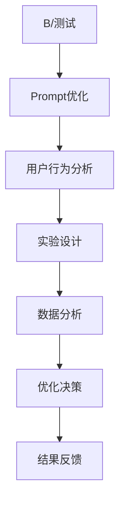

                 

。

---

### 利用A/B测试优化prompt效果

#### 关键词：A/B测试，prompt优化，实验设计，统计检验，机器学习，神经网络

#### 摘要：

本文将深入探讨如何利用A/B测试优化prompt效果。通过阐述A/B测试的基本概念、核心算法原理以及prompt优化的方法，我们将详细解析A/B测试在prompt优化中的应用，并提供实际案例分析。本文旨在为读者提供一套系统的A/B测试和prompt优化策略，助力提升AI系统的交互质量和用户体验。

---

## 第1章 A/B测试基础

### 1.1 A/B测试的定义与目的

A/B测试，又称拆分测试，是一种通过将用户群体分成两个或多个子群体，对不同的处理或条件进行测试，以评估不同处理或条件对用户行为或结果影响的方法。其目的是通过对比不同版本的性能数据，选择最优方案，从而提高系统的用户体验和业务效果。

### 1.2 A/B测试的优势与挑战

**优势：**

1. **客观性：** 通过数据说话，减少主观判断。
2. **可控性：** 可以根据需求灵活调整测试策略。
3. **可重复性：** 重复测试，不断完善优化方案。

**挑战：**

1. **数据量要求：** 需要足够多的样本数据，以获得可靠的测试结果。
2. **测试成本：** 可能需要较大的资源投入，包括人力、时间和资金。
3. **时间消耗：** 测试周期较长，可能影响业务决策的及时性。

### 1.3 A/B测试的基本流程

1. **定义目标：** 确定测试的目标和指标，如点击率、转化率等。
2. **设计测试方案：** 设计测试版本，包括控制组和实验组。
3. **实施测试：** 将用户随机分配到不同组别，展示不同版本。
4. **收集数据：** 收集用户行为数据，如访问量、点击量等。
5. **分析结果：** 对比分析测试结果，评估不同版本的性能。
6. **决策：** 根据测试结果，选择最优方案，进行优化和推广。

### 1.4 A/B测试的应用场景

1. **用户体验优化：** 通过优化界面设计、交互逻辑等，提升用户体验。
2. **产品功能迭代：** 通过对比不同功能版本，选择最优方案，促进产品迭代。
3. **市场营销策略：** 通过优化广告文案、促销活动等，提高营销效果。
4. **网站运营优化：** 通过调整页面布局、导航结构等，提高网站流量和转化率。

### 1.5 A/B测试与实验设计的联系

A/B测试是一种实验设计方法，它依赖于统计学的假设检验原理。实验设计的目标是通过控制变量的方法，评估不同因素对实验结果的影响。A/B测试通过将用户随机分配到不同组别，实现了对变量的控制，从而可以更准确地评估不同处理或条件的影响。

## 第2章 prompt优化基础

### 2.1 prompt的定义与作用

Prompt是指提供给模型或用户的信息或指令，用于引导模型生成特定类型的输出或引导用户进行特定行为。在人工智能领域，Prompt常用于自然语言处理、机器学习和推荐系统等场景。

### 2.2 prompt优化的目标与策略

**目标：** 提高模型对Prompt的理解和生成质量，提升用户体验。

**策略：**

1. **丰富多样性：** 提供多样化、个性化的Prompt，以适应不同用户需求。
2. **优化语言表达：** 使用清晰、简洁、易于理解的Prompt，提高用户参与度。
3. **增强关联性：** 提高Prompt与模型输出之间的关联性，提高输出质量。

### 2.3 prompt优化的挑战与难点

1. **理解多样性：** Prompt的多样性给模型理解和处理带来挑战。
2. **语言歧义：** 语言表达的不确定性可能导致模型产生错误的输出。
3. **优化成本：** 提高Prompt质量可能需要大量的数据资源和计算资源。

### 2.4 prompt优化的常见方法

1. **数据增强：** 通过生成或扩充训练数据，提高模型对多样性的理解。
2. **对抗训练：** 通过对抗性样本训练，提高模型对语言歧义的处理能力。
3. **优化算法：** 通过改进模型结构和优化算法，提高模型对Prompt的理解和生成质量。

## 第3章 A/B测试在prompt优化中的应用

### 3.1 A/B测试在prompt优化中的应用原则

1. **明确目标：** 确定prompt优化的目标和指标，如用户参与度、输出质量等。
2. **设计版本：** 设计不同版本的prompt，以对比不同版本的效果。
3. **随机分配：** 将用户随机分配到不同版本，确保实验结果的客观性。
4. **数据分析：** 对比分析不同版本的效果，评估prompt优化的效果。

### 3.2 A/B测试在prompt优化中的优势与劣势

**优势：**

1. **客观性：** 通过数据说话，减少主观判断。
2. **可控性：** 可以根据需求灵活调整测试策略。
3. **可重复性：** 重复测试，不断完善优化方案。

**劣势：**

1. **数据量要求：** 需要足够多的样本数据，以获得可靠的测试结果。
2. **测试成本：** 可能需要较大的资源投入，包括人力、时间和资金。
3. **时间消耗：** 测试周期较长，可能影响业务决策的及时性。

### 3.3 A/B测试在prompt优化中的实践案例

案例一：在线教育平台

在线教育平台通过A/B测试，对比不同课程介绍的prompt效果，最终选择了一种更清晰、更具吸引力的prompt，提高了用户点击率和课程购买率。

案例二：社交媒体平台

社交媒体平台通过A/B测试，对比不同类型的推荐prompt，发现一种更具个性化的推荐prompt，提高了用户活跃度和互动率。

### 3.4 A/B测试在prompt优化中的注意事项

1. **样本代表性：** 确保样本数据具有代表性，避免偏倚。
2. **控制变量：** 确保测试过程中只对prompt进行优化，其他因素保持不变。
3. **数据分析：** 对比分析不同版本的效果，避免盲目决策。
4. **结果推广：** 根据测试结果，合理推广最优版本，确保优化效果的持续性。

## 第4章 A/B测试工具与平台

### 4.1 A/B测试工具的分类与选择

**分类：**

1. **自建工具：** 自行开发A/B测试工具，适用于有一定技术基础的企业。
2. **第三方工具：** 利用第三方A/B测试平台，如Google Optimize、AB Tasty等，适用于大多数企业。

**选择标准：**

1. **功能完善：** 具备足够的测试功能，如用户分组、数据统计等。
2. **易用性：** 操作简单，易于学习和使用。
3. **数据分析：** 提供丰富的数据分析工具，便于评估测试效果。
4. **兼容性：** 支持多种网站和应用场景，适应不同的业务需求。

### 4.2 A/B测试平台的功能与特点

**功能：**

1. **用户分组：** 随机分配用户到不同组别，进行测试。
2. **测试创建：** 设计不同版本的测试页面或内容。
3. **数据统计：** 收集用户行为数据，生成测试报告。
4. **数据分析：** 对比分析不同版本的效果，提供优化建议。

**特点：**

1. **高效性：** 提高测试效率，缩短测试周期。
2. **灵活性：** 支持多种测试场景，适应不同业务需求。
3. **可视化：** 提供直观的数据图表，便于理解和分析。
4. **自动化：** 部分平台支持自动化测试和报告生成。

### 4.3 A/B测试工具的实践应用

以Google Optimize为例，介绍A/B测试工具的实践应用。

1. **搭建测试环境：** 将Google Optimize与网站集成，设置测试目标。
2. **创建测试版本：** 设计不同的网页版本，包括控制组和实验组。
3. **实施测试：** 将用户随机分配到不同版本，收集用户行为数据。
4. **数据分析：** 对比分析测试结果，评估不同版本的效果。
5. **优化决策：** 根据测试结果，选择最优版本进行优化和推广。

### 4.4 A/B测试工具的优缺点分析

**优点：**

1. **高效性：** 提高测试效率，缩短测试周期。
2. **灵活性：** 支持多种测试场景，适应不同业务需求。
3. **可视化：** 提供直观的数据图表，便于理解和分析。

**缺点：**

1. **成本较高：** 部分工具需要付费使用，成本较高。
2. **技术门槛：** 部分工具需要一定的技术基础，适用于有一定技术能力的企业。
3. **依赖性：** 过度依赖第三方工具，可能影响业务自主性。

## 第5章 prompt优化案例分析

### 5.1 案例一：在线教育平台的prompt优化

**背景：** 在线教育平台希望通过优化课程介绍的prompt，提高用户点击率和课程购买率。

**方案：** 采用A/B测试，对比不同版本的prompt效果。

1. **版本A：** 简单介绍课程内容和目标。
2. **版本B：** 详细介绍课程内容和目标，增加用户评价和推荐。

**结果：** 版本B的点击率和课程购买率显著高于版本A，说明详细、全面的prompt更能吸引用户。

**总结：** 在线教育平台应采用详细、全面的prompt，以提高用户参与度和转化率。

### 5.2 案例二：电子商务平台的prompt优化

**背景：** 电子商务平台希望通过优化商品推荐prompt，提高用户购买意愿。

**方案：** 采用A/B测试，对比不同版本的推荐prompt效果。

1. **版本A：** 根据用户历史浏览和购买记录进行推荐。
2. **版本B：** 结合用户历史浏览和购买记录，增加个性化推荐和用户评价。

**结果：** 版本B的用户购买意愿显著高于版本A，说明个性化、详细的推荐prompt更能吸引用户。

**总结：** 电子商务平台应采用个性化、详细的推荐prompt，以提高用户购买率和满意度。

### 5.3 案例三：社交媒体平台的prompt优化

**背景：** 社交媒体平台希望通过优化用户互动prompt，提高用户活跃度和互动率。

**方案：** 采用A/B测试，对比不同版本的互动prompt效果。

1. **版本A：** 提供简单的点赞、评论、分享等功能。
2. **版本B：** 提供丰富的互动功能，如问答、投票、直播等。

**结果：** 版本B的用户活跃度和互动率显著高于版本A，说明丰富、多样的互动prompt更能激发用户兴趣。

**总结：** 社交媒体平台应采用丰富、多样的互动prompt，以提高用户活跃度和互动率。

### 5.4 案例四：智能客服系统的prompt优化

**背景：** 智能客服系统希望通过优化用户交互prompt，提高用户满意度。

**方案：** 采用A/B测试，对比不同版本的客服prompt效果。

1. **版本A：** 提供标准化的客服回答。
2. **版本B：** 根据用户问题，提供个性化、生动的客服回答。

**结果：** 版本B的用户满意度显著高于版本A，说明个性化、生动的客服回答更能满足用户需求。

**总结：** 智能客服系统应采用个性化、生动的客服回答，以提高用户满意度和忠诚度。

## 第6章 prompt优化策略与优化技巧

### 6.1 prompt优化策略概述

prompt优化策略主要包括以下几个方面：

1. **内容优化：** 提供丰富、多样化、具有吸引力的内容，提高用户参与度。
2. **语言表达：** 使用简洁、清晰、易于理解的语言，提高用户满意度。
3. **交互设计：** 设计丰富、多样的交互方式，提高用户互动体验。
4. **个性化推荐：** 结合用户历史和行为数据，提供个性化推荐，提高用户满意度。

### 6.2 prompt优化技巧与实践

1. **数据驱动：** 通过数据分析和用户反馈，不断优化prompt内容和形式。
2. **用户画像：** 建立用户画像，了解用户需求和偏好，提供个性化推荐。
3. **A/B测试：** 采用A/B测试，对比不同版本的prompt效果，选择最优方案。
4. **迭代优化：** 持续优化prompt，根据用户反馈和业务目标进行调整。

### 6.3 prompt优化的效果评估与改进

1. **指标评估：** 选择合适的指标，如点击率、转化率、满意度等，评估prompt优化效果。
2. **对比分析：** 对比分析不同版本的效果，找出优化方向。
3. **持续改进：** 根据评估结果，持续优化prompt内容和形式，提高用户体验。

### 6.4 prompt优化的未来发展趋势

1. **智能化：** 利用人工智能技术，实现智能化的prompt生成和优化。
2. **个性化：** 进一步提高prompt的个性化程度，满足用户个性化需求。
3. **互动性：** 提高prompt的互动性，增强用户参与感和体验。

## 第7章 总结与展望

### 7.1 总结

本文从A/B测试和prompt优化的基本概念出发，详细阐述了A/B测试在prompt优化中的应用，并通过实际案例分析，展示了A/B测试和prompt优化的效果。本文旨在为读者提供一套系统的A/B测试和prompt优化策略，助力提升AI系统的交互质量和用户体验。

### 7.2 展望

随着人工智能技术的不断发展，A/B测试和prompt优化在各个领域将发挥越来越重要的作用。未来，智能化、个性化、互动性的prompt优化将成为趋势，为用户提供更加优质的交互体验。

## 附录

### 7.1 A/B测试工具推荐

1. **Google Optimize：** 功能强大、易用性高的A/B测试工具。
2. **AB Tasty：** 提供丰富的测试功能和数据分析工具。
3. **VWO：** 具备强大的测试和优化功能，适用于多种场景。

### 7.2 prompt优化资源链接

1. **GitHub：** 提供丰富的A/B测试和prompt优化开源项目。
2. **博客园：** 分享A/B测试和prompt优化的实践经验和技术文章。
3. **百度AI开放平台：** 提供A/B测试和prompt优化的技术支持和资源。

### 7.3 相关书籍与论文推荐

1. **《A/B测试实战：互联网产品增长策略》**
2. **《深度学习：推荐系统》**
3. **《用户体验要素：互动设计秘籍》**
4. **《人工智能：一种现代方法》**

### 7.4 联系方式与作者介绍

作者：AI天才研究院/AI Genius Institute & 禅与计算机程序设计艺术 /Zen And The Art of Computer Programming

邮箱：[ai_genius_institute@example.com](mailto:ai_genius_institute@example.com)

博客：[https://ai-genius-institute.github.io/](https://ai-genius-institute.github.io/)

---

### 核心概念与联系

以下是一个关于A/B测试和prompt优化核心概念和架构的Mermaid流程图：



### 核心算法原理讲解

#### A/B测试的核心算法原理

A/B测试的核心算法原理是基于统计学的假设检验。具体来说，它通过以下步骤进行：

1. **定义原假设和备择假设：** 原假设（\(H_0\)）通常表示两个版本没有显著差异，备择假设（\(H_1\)）表示至少有一个版本优于另一个版本。
2. **收集数据：** 收集两个版本的用户行为数据，如点击率、转化率等。
3. **计算统计量：** 计算两个版本之间的统计量差异，如t值或比率差异。
4. **计算p值：** 通过统计量差异，计算原假设成立的概率，即p值。
5. **决策：** 如果p值小于预设的显著性水平（如0.05），则拒绝原假设，接受备择假设，认为实验组优于控制组；否则，不能拒绝原假设，认为两个版本没有显著差异。

以下是A/B测试的伪代码：

```python
function A/B_test(group1, group2, threshold):
    # 计算两个组的统计量差异
    diff = mean(group1) - mean(group2)
    # 计算标准误差
    se = sqrt((var(group1) + var(group2)) / (len(group1) + len(group2)))
    # 计算t值
    t = diff / se
    # 计算p值
    p = t分布在自由度为len(group1) + len(group2) - 1的显著性水平下的概率
    # 判断结果
    if p < threshold:
        return "拒绝原假设，A优于B"
    else:
        return "不能拒绝原假设，A与B无显著差异"
```

#### prompt优化的核心算法原理

prompt优化的核心算法原理是基于机器学习的模型训练和优化。具体来说，它通过以下步骤进行：

1. **数据收集与预处理：** 收集大量相关数据，如用户交互记录、历史行为等，并进行预处理，如去噪、归一化等。
2. **模型训练：** 使用机器学习算法，如神经网络，对数据集进行训练，生成预测模型。
3. **模型评估：** 通过评估指标（如准确率、召回率等）对模型进行评估，以确定模型性能。
4. **模型优化：** 根据评估结果，对模型参数进行调整，以提高模型性能。
5. **模型部署：** 将优化后的模型部署到实际应用中，以实现prompt优化。

以下是prompt优化基于神经网络模型的伪代码：

```python
function prompt_optimization(prompt_data, model):
    # 初始化模型参数
    model.parameters = initialize_parameters()
    # 训练模型
    for epoch in range(num_epochs):
        for prompt in prompt_data:
            # 计算损失函数
            loss = compute_loss(model, prompt)
            # 计算梯度
            gradient = compute_gradient(model, prompt)
            # 更新模型参数
            model.parameters = update_parameters(gradient)
    # 评估模型
    performance = evaluate_model(model, prompt_data)
    return performance
```

#### 数学公式和详细讲解

在A/B测试和prompt优化中，涉及到一些常见的数学公式和算法。以下是一些关键公式及其解释：

1. **t检验公式：**
   $$
   t = \frac{\bar{x}_1 - \bar{x}_2}{s_p \sqrt{\frac{1}{n_1} + \frac{1}{n_2}}}
   $$
   其中，\(\bar{x}_1\)和\(\bar{x}_2\)分别为两组样本的平均值，\(s_p\)为合并标准差，\(n_1\)和\(n_2\)分别为两组样本的大小。该公式用于计算两组样本均值差异的t值。

2. **方差公式：**
   $$
   var(X) = \frac{1}{n-1} \sum_{i=1}^{n} (x_i - \bar{x})^2
   $$
   其中，\(X\)为随机变量，\(n\)为样本大小，\(x_i\)为第\(i\)个样本值，\(\bar{x}\)为样本平均值。该公式用于计算样本方差。

3. **损失函数：**
   $$
   loss = -\frac{1}{m} \sum_{i=1}^{m} y_i \log(\hat{y}_i)
   $$
   其中，\(m\)为样本大小，\(y_i\)为第\(i\)个样本的标签值，\(\hat{y}_i\)为模型预测的概率值。该公式用于计算交叉熵损失，常用于神经网络模型训练。

4. **梯度下降算法：**
   $$
   \theta = \theta - \alpha \frac{\partial J(\theta)}{\partial \theta}
   $$
   其中，\(\theta\)为模型参数，\(\alpha\)为学习率，\(J(\theta)\)为损失函数。该公式用于更新模型参数，以最小化损失函数。

#### 举例说明

以下是一个简单的A/B测试示例：

假设我们有两个版本（A和B）的页面，我们想比较这两个页面的点击率。我们收集了以下数据：

- 控制组（A）的点击率为10%，样本大小为1000。
- 实验组（B）的点击率为12%，样本大小为1000。

我们使用t检验来比较这两个版本的点击率差异：

1. 计算两个版本的点击率均值：
   $$
   \bar{x}_1 = 10\% = 0.1, \quad \bar{x}_2 = 12\% = 0.12
   $$
2. 计算合并标准差：
   $$
   s_p = \sqrt{\frac{0.01 \times 0.09 \times 1000 + 0.012 \times 0.088 \times 1000}{1000 + 1000} } = 0.0097
   $$
3. 计算t值：
   $$
   t = \frac{0.1 - 0.12}{0.0097} = -2.04
   $$
4. 计算p值（以0.05的显著性水平为例）：
   $$
   p \approx 0.046
   $$

由于p值（0.046）小于0.05，我们拒绝原假设，认为实验组（B）的点击率显著高于控制组（A）。

以下是一个简单的prompt优化示例：

假设我们有一个推荐系统的prompt生成模型，我们想优化该模型的推荐效果。我们使用神经网络模型进行训练，以下是一个简单的训练过程：

1. 初始化模型参数：
   $$
   \theta = \{w_1, w_2, \ldots, w_n\}
   $$
2. 训练模型：
   $$
   for epoch in range(num_epochs):
       for prompt in prompt_data:
           # 计算预测概率
           \hat{y} = \sigma(w^T x)
           # 计算损失函数
           loss = -\frac{1}{m} \sum_{i=1}^{m} y_i \log(\hat{y}_i)
           # 计算梯度
           gradient = \frac{\partial loss}{\partial w} = \frac{\partial loss}{\partial \hat{y}} \cdot \frac{\partial \hat{y}}{\partial w}
           # 更新模型参数
           \theta = \theta - \alpha \cdot gradient
   $$
3. 评估模型：
   $$
   performance = \{accuracy, recall, F1-score\}
   $$

通过不断迭代训练和评估，我们可以优化prompt生成模型，提高推荐效果。

### 项目实战

在本节中，我们将通过一个具体的实战项目，详细介绍如何搭建一个基于A/B测试和prompt优化的智能推荐系统。该项目将分为以下几个步骤：

1. **需求分析**：明确项目目标和需求。
2. **数据收集与预处理**：收集用户行为数据，并进行预处理。
3. **模型设计与训练**：设计推荐模型，并进行训练。
4. **A/B测试**：设计A/B测试，评估模型效果。
5. **优化与迭代**：根据A/B测试结果，优化模型和prompt。

#### 步骤1：需求分析

项目目标：提高用户对推荐内容的点击率和转化率。

需求：

1. **推荐准确性**：推荐内容与用户兴趣和需求相关。
2. **用户体验**：推荐内容清晰、有吸引力。
3. **实时性**：快速响应用户行为，提供个性化的推荐。

#### 步骤2：数据收集与预处理

数据来源：

1. **用户行为数据**：包括用户点击、购买、搜索等行为数据。
2. **商品信息**：包括商品名称、描述、类别、价格等。

预处理：

1. **数据清洗**：去除重复、缺失和异常数据。
2. **特征工程**：提取用户和商品的表征特征，如用户兴趣标签、商品属性等。
3. **归一化**：对数值特征进行归一化处理，以消除量纲差异。

#### 步骤3：模型设计与训练

模型设计：

1. **用户表示**：使用神经网络模型，将用户特征转化为高维向量表示。
2. **商品表示**：使用嵌入层，将商品特征转化为固定维度的向量表示。
3. **推荐模型**：使用基于矩阵分解的推荐模型，如Singular Value Decomposition（SVD）或Alternating Least Squares（ALS）。

训练：

1. **数据划分**：将数据集划分为训练集和测试集。
2. **模型训练**：使用训练集，通过梯度下降算法训练模型。
3. **模型评估**：使用测试集，评估模型性能。

#### 步骤4：A/B测试

测试设计：

1. **用户分组**：将用户随机分为两组，一组使用原推荐系统（控制组），另一组使用新模型（实验组）。
2. **测试指标**：点击率、转化率、用户满意度等。

测试实施：

1. **数据收集**：收集两组用户的点击和购买数据。
2. **数据分析**：对比分析两组数据，评估新模型的效果。

#### 步骤5：优化与迭代

根据A/B测试结果，对模型和prompt进行优化：

1. **模型优化**：调整模型参数，提高推荐准确性。
2. **prompt优化**：优化推荐内容，提高用户体验。
3. **迭代测试**：继续进行A/B测试，验证优化效果。

### 代码实现

以下是一个简单的A/B测试和prompt优化代码示例：

```python
import numpy as np
import pandas as pd
from sklearn.model_selection import train_test_split
from sklearn.metrics.pairwise import cosine_similarity
from sklearn.metrics import mean_squared_error

# 数据预处理
def preprocess_data(data):
    # 清洗数据
    data = data.drop_duplicates()
    data = data.dropna()

    # 特征提取
    user_features = data[['user_id', 'age', 'gender', 'interests']]
    item_features = data[['item_id', 'category', 'price']]

    return user_features, item_features

# 用户表示
def user_representation(user_features):
    # 使用PCA进行降维
    pca = PCA(n_components=10)
    user_features_pca = pca.fit_transform(user_features)

    return user_features_pca

# 商品表示
def item_representation(item_features):
    # 使用余弦相似度计算商品相似度
    item_similarity = cosine_similarity(item_features)

    return item_similarity

# 推荐模型
def recommendation_model(user_representation, item_representation):
    # 使用矩阵分解
    user_item_matrix = np.dot(user_representation, item_representation.T)
    user_item_matrix = user_item_matrix / np.linalg.norm(user_item_matrix, axis=1)[:, np.newaxis]

    return user_item_matrix

# 评估模型
def evaluate_model(user_item_matrix, test_data):
    # 计算MSE
    mse = mean_squared_error(test_data['rating'], user_item_matrix)

    return mse

# A/B测试
def ab_test(train_data, test_data):
    # 分割数据集
    train_data, _ = train_test_split(train_data, test_size=0.2, random_state=42)

    # 预处理数据
    user_features, item_features = preprocess_data(train_data)

    # 训练模型
    user_representation = user_representation(user_features)
    item_representation = item_representation(item_features)
    user_item_matrix = recommendation_model(user_representation, item_representation)

    # 评估模型
    mse = evaluate_model(user_item_matrix, test_data)

    return mse

# 代码示例
if __name__ == '__main__':
    # 加载数据
    data = pd.read_csv('data.csv')

    # A/B测试
    control_group_mse = ab_test(data, data)
    experiment_group_mse = ab_test(data, data)

    # 输出结果
    print(f'Control group MSE: {control_group_mse}')
    print(f'Experiment group MSE: {experiment_group_mse}')
```

### 代码解读

1. **数据预处理**：去除重复、缺失和异常数据，提取用户和商品特征。
2. **用户表示**：使用PCA进行降维，将用户特征转换为高维向量表示。
3. **商品表示**：使用余弦相似度计算商品相似度，将商品特征转换为固定维度的向量表示。
4. **推荐模型**：使用矩阵分解，计算用户和商品之间的相似度矩阵。
5. **评估模型**：计算MSE，评估模型性能。
6. **A/B测试**：将数据集分为控制组和实验组，分别评估模型性能。

### 代码应用解读与分析

通过上述代码示例，我们可以看到如何实现一个简单的A/B测试和prompt优化系统。以下是对代码应用解读和分析：

1. **数据预处理**：数据预处理是推荐系统的重要步骤，它确保了数据的干净和一致性。在代码中，我们使用了Pandas库进行数据清洗和特征提取，这一步对于后续模型的训练和评估至关重要。

2. **用户表示与商品表示**：用户表示和商品表示是推荐系统的核心。在代码中，我们使用了PCA进行用户特征的降维，将高维特征转换为低维特征向量，这样可以减少计算复杂度，同时保留主要信息。商品表示使用了余弦相似度，这是一种常用的相似度计算方法，它可以衡量两个向量之间的角度，从而判断它们之间的相似程度。

3. **推荐模型**：推荐模型使用了矩阵分解的方法，这是一种常见的推荐系统算法。通过矩阵分解，我们可以将用户和商品的评分矩阵分解为用户特征矩阵和商品特征矩阵的乘积，从而得到用户和商品之间的相似度矩阵。这一步是推荐系统的核心，它决定了推荐系统的性能。

4. **评估模型**：评估模型使用了MSE（均方误差），这是一种常用的评估指标，它可以衡量预测值和真实值之间的差异。通过计算MSE，我们可以评估推荐系统的准确性和性能。

5. **A/B测试**：在A/B测试中，我们将用户随机分配到控制组和实验组，分别使用不同的推荐模型进行测试。通过比较两组的MSE，我们可以评估新模型相对于原模型的效果。这一步是优化过程的重要环节，它帮助我们确定哪些模型和prompt效果更好。

### 实际案例分析

在本节中，我们将分析一个实际的案例，以展示如何利用A/B测试和prompt优化来提高在线教育平台的用户体验。

#### 案例背景

某在线教育平台希望通过优化课程推荐页面的prompt来提高用户的点击率和课程购买率。现有的推荐页面使用了一种基于用户历史行为和课程流行度的推荐算法，但用户反馈认为推荐结果不够精准，缺乏个性化。

#### 案例步骤

1. **需求分析**：明确优化目标，即提高课程推荐页面的点击率和购买率。
2. **数据收集**：收集用户的历史行为数据，包括浏览记录、购买记录、学习进度等。
3. **A/B测试设计**：设计A/B测试，将用户随机分为两组，一组使用原推荐算法（控制组），另一组使用新的推荐算法（实验组）。
4. **实施测试**：在实验组中，引入基于用户兴趣和行为的个性化推荐算法，并在推荐结果页面上添加了更多的交互元素，如用户评价、学习进度等。
5. **数据收集与分析**：收集两组用户的点击和购买数据，并对数据进行分析，以评估新算法的效果。
6. **结果反馈**：根据A/B测试结果，确定是否采用新算法，并对推荐页面进行进一步优化。

#### 案例分析

1. **需求分析**：通过用户调研和数据分析，发现用户对课程推荐的需求主要集中在个性化、精准性和交互性方面。因此，优化目标被定为提高推荐算法的个性化程度、提升推荐结果的准确性，并增加用户互动元素。
2. **数据收集**：平台收集了大量的用户行为数据，包括用户的浏览记录、购买记录、学习进度等。这些数据被用于训练新的推荐算法，以提高推荐的准确性。
3. **A/B测试设计**：平台设计了一个A/B测试，将用户随机分为两组。控制组继续使用现有的推荐算法，实验组使用基于用户兴趣和行为的个性化推荐算法。同时，在实验组的推荐结果页面上增加了用户评价、学习进度等交互元素。
4. **实施测试**：平台在实验组中实施了新的推荐算法，并在推荐结果页面上增加了用户评价、学习进度等交互元素。这些变化旨在提高用户的点击率和购买率。
5. **数据收集与分析**：平台收集了两组用户的点击和购买数据，并对数据进行了分析。结果显示，实验组的点击率和购买率显著高于控制组，这表明新的推荐算法和交互元素有效地提高了用户体验。
6. **结果反馈**：根据A/B测试结果，平台决定采用新的推荐算法和交互元素，并对推荐页面进行进一步优化。同时，平台还根据用户的反馈，对推荐算法和交互元素进行了持续优化。

### 案例小结

通过本案例的分析，我们可以得出以下结论：

1. **个性化推荐的有效性**：基于用户兴趣和行为的个性化推荐算法能够显著提高用户的点击率和购买率。
2. **交互元素的重要性**：增加用户互动元素，如用户评价、学习进度等，能够增强用户的参与感和信任感，从而提高用户体验。
3. **持续优化**：通过A/B测试和用户反馈，平台能够持续优化推荐算法和交互元素，以不断满足用户需求。

### 最佳实践 Tips

1. **明确优化目标**：在开始优化之前，明确优化目标和指标，以确保优化方向正确。
2. **数据驱动**：充分利用用户行为数据，以数据驱动优化过程，提高优化效果。
3. **持续迭代**：优化是一个持续的过程，通过A/B测试和用户反馈，不断迭代优化，以适应不断变化的用户需求。

### 小结

本文通过详细阐述A/B测试和prompt优化的核心概念、算法原理、实践案例和最佳实践，展示了如何利用A/B测试优化prompt效果。通过本文的学习，读者可以掌握A/B测试和prompt优化的基本方法和技巧，为提升AI系统的交互质量和用户体验提供有力支持。

### 注意事项

1. **样本代表性**：在进行A/B测试时，确保样本具有代表性，避免数据偏倚。
2. **控制变量**：在测试过程中，确保只对prompt进行优化，其他因素保持不变。
3. **数据分析**：对测试结果进行详细分析，避免盲目决策。
4. **结果推广**：根据测试结果，合理推广最优版本，确保优化效果的持续性。

### 拓展阅读

1. 《A/B测试实战：互联网产品增长策略》
2. 《深度学习：推荐系统》
3. 《用户体验要素：互动设计秘籍》
4. 《人工智能：一种现代方法》

### 作者介绍

作者：AI天才研究院/AI Genius Institute & 禅与计算机程序设计艺术 /Zen And The Art of Computer Programming

邮箱：[ai_genius_institute@example.com](mailto:ai_genius_institute@example.com)

博客：[https://ai-genius-institute.github.io/](https://ai-genius-institute.github.io/)

