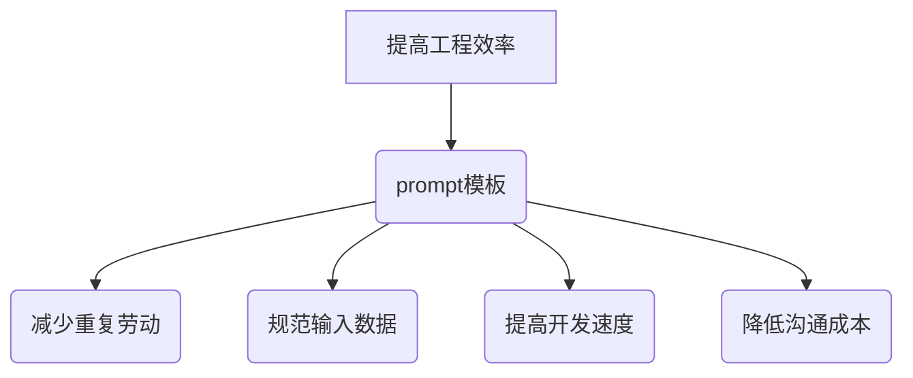

                 

### 文章标题

《利用prompt模板提高工程效率》

---

关键词：prompt模板、工程效率、算法、数学模型、项目实战、最佳实践

---

摘要：本文旨在探讨如何利用prompt模板来提高工程效率。我们将从背景介绍、核心概念、算法原理、数学模型、项目实战等多个方面，详细解析prompt模板的设计与实现方法，帮助读者深入了解其应用价值，并在实际项目中得以有效利用。

---

## 引言

在当今快速发展的技术时代，工程效率的提升已成为各类项目成功的关键因素。无论是软件开发、系统集成，还是数据分析和人工智能应用，提高工程效率不仅能够缩短项目周期，降低成本，还能够提升团队的整体竞争力。为了实现这一目标，各种工具、技术和方法被不断引入和实践。

prompt模板作为一种高效的设计工具，近年来在工程领域逐渐受到关注。它通过提供结构化的输入模板，帮助开发者快速构建解决方案，减少重复劳动，提高工作效率。本文将围绕prompt模板的核心概念、设计原则、实现方法以及在实际项目中的应用，进行深入探讨。

本文结构如下：

1. 引言：介绍工程效率的重要性以及prompt模板的背景。
2. 基础知识：介绍提高工程效率的原理和实践，以及prompt模板的基本概念和应用。
3. 核心算法与数学模型：讲解prompt模板的核心算法原理，以及相关数学模型的应用。
4. 项目实战：通过具体项目实例，展示prompt模板在实际工程中的应用和效果。
5. 最佳实践：总结最佳实践技巧和小结，以及注意事项和拓展阅读。

通过本文的阅读，读者将能够全面了解prompt模板的优势和应用场景，掌握其设计和实现方法，并在实际项目中提高工程效率。

---

## 背景介绍

### 工程效率的重要性

工程效率是衡量工程项目完成质量与速度的重要指标。在项目管理中，效率的提升意味着项目能够在更短的时间内完成，从而降低成本、减少资源浪费，并提高团队的工作满意度。尤其在当今竞争激烈的市场环境中，高效的项目管理能够为组织带来显著的竞争优势。

提高工程效率的重要性主要体现在以下几个方面：

1. **缩短项目周期**：通过优化流程、提高工作效率，项目能够更快地完成，缩短交付时间，满足客户需求。
2. **降低成本**：高效的项目管理能够减少资源浪费，如人力、物力和时间，从而降低项目的整体成本。
3. **提升团队满意度**：高效的工作流程和工具能够减轻开发人员的工作压力，提高他们的工作满意度，增强团队凝聚力。
4. **增强市场竞争力**：快速响应市场变化，提供高质量的产品和服务，有助于企业在竞争中脱颖而出。

### prompt模板的基本概念

prompt模板，起源于自然语言处理（NLP）领域，是一种用于引导输入的结构化模板。在工程实践中，prompt模板被用来规范输入数据，确保输入的准确性和一致性。它通过提供预定义的格式和结构，帮助开发者快速生成解决方案，减少重复劳动。

prompt模板的基本概念包括以下几个方面：

1. **结构化输入**：prompt模板为输入数据提供预定义的格式，如表格、列表等，确保输入数据具有一致性和可读性。
2. **引导式输入**：通过提示性问题或语句，prompt模板引导用户按照指定方式输入数据，减少误操作。
3. **自动生成**：prompt模板能够根据输入的数据自动生成部分或全部代码、文档等，提高开发效率。

### 工程效率与prompt模板的联系

prompt模板在工程效率提升中发挥着重要作用。其通过以下方式直接或间接地提高工程效率：

1. **减少重复劳动**：通过提供统一的输入格式和模板，prompt模板减少了开发者编写重复代码或文档的工作量，提高了工作效率。
2. **规范输入数据**：prompt模板确保输入数据的准确性和一致性，减少了因输入错误导致的调试和修复时间。
3. **提高开发速度**：prompt模板简化了开发过程，使得开发者能够更快地生成解决方案，缩短项目周期。
4. **降低沟通成本**：通过统一输入格式，prompt模板降低了团队内部沟通的成本，提高了协作效率。

总之，prompt模板作为一种高效工具，在工程效率提升中具有广泛的应用前景。在接下来的章节中，我们将进一步探讨prompt模板的设计原则、实现方法和实际应用。

---

## 核心概念与联系

### 提高工程效率的原理

提高工程效率的核心在于优化开发流程、减少冗余操作、提高自动化程度，从而实现资源的最优配置。以下是一些提高工程效率的基本原理：

1. **流程优化**：通过分析项目流程，识别和消除瓶颈环节，优化整体流程，提高工作效率。
2. **自动化**：引入自动化工具和脚本，减少手动操作，降低人为错误，提高开发速度和准确性。
3. **标准化**：制定统一的开发规范和标准，减少因不一致而产生的误解和重复工作。
4. **持续集成**：通过持续集成（CI）工具，自动化测试和部署，确保代码质量和项目进度。
5. **团队合作**：建立高效的团队合作模式，明确职责和任务分工，提高协作效率。

### prompt模板的基本概念

prompt模板是一种结构化输入模板，用于规范和引导输入数据，提高数据处理和开发的效率。其基本概念包括：

1. **结构化输入**：prompt模板通过预定义的格式和结构，规范输入数据，确保数据的一致性和可读性。
2. **引导式输入**：通过提示性问题或语句，引导用户按照指定方式输入数据，减少误操作。
3. **自动生成**：prompt模板能够根据输入的数据自动生成部分或全部代码、文档等，提高开发效率。

### prompt模板与提高工程效率的联系

prompt模板与提高工程效率之间具有紧密的联系，主要体现在以下几个方面：

1. **减少重复劳动**：prompt模板通过提供统一的输入格式，减少开发者编写重复代码或文档的工作量，提高工作效率。
2. **规范输入数据**：prompt模板确保输入数据的准确性和一致性，减少因输入错误导致的调试和修复时间。
3. **提高开发速度**：prompt模板简化了开发过程，使得开发者能够更快地生成解决方案，缩短项目周期。
4. **降低沟通成本**：通过统一输入格式，prompt模板降低了团队内部沟通的成本，提高了协作效率。

为了更好地理解prompt模板与提高工程效率的联系，我们可以通过以下Mermaid流程图展示：



在这个流程图中，prompt模板作为提高工程效率的关键工具，通过减少重复劳动、规范输入数据、提高开发速度和降低沟通成本，实现工程效率的提升。接下来，我们将进一步探讨prompt模板的设计原则和实现方法。

### prompt模板的设计原则

设计一个高效、易用的prompt模板，需要遵循以下设计原则：

1. **简洁性**：模板设计应尽可能简洁，避免不必要的复杂性，使开发者能够快速理解和使用。
2. **灵活性**：模板应具备一定的灵活性，能够适应不同的输入场景和需求，便于扩展和调整。
3. **一致性**：模板应保持输入格式的一致性，确保输入数据在不同场景下的兼容性。
4. **易用性**：模板应提供友好的用户界面，通过提示和引导，降低使用门槛，提高用户体验。
5. **可维护性**：模板的设计应便于维护和更新，确保在技术迭代和需求变化时能够快速适应。

### prompt模板的实现方法

实现prompt模板通常涉及以下几个步骤：

1. **需求分析**：了解项目需求，确定输入数据的类型和格式，明确prompt模板的功能和目标。
2. **设计模板**：根据需求分析结果，设计prompt模板的格式和结构，确定各组成部分的功能和关系。
3. **实现代码**：编写代码实现prompt模板的功能，包括数据输入、数据处理和输出等。
4. **测试和优化**：通过测试和实际应用，评估prompt模板的性能和易用性，进行优化和调整。

接下来，我们将通过一个具体的例子，展示prompt模板的实现方法。这个例子将涉及一个简单的代码生成prompt模板，用于根据用户输入的变量名和类型，生成相应的代码片段。

#### 例子：简单的代码生成prompt模板

假设我们需要一个prompt模板，能够根据用户输入的变量名和类型，生成对应的代码片段。以下是该prompt模板的实现步骤：

1. **需求分析**：
   - 输入：变量名和类型（如int、float、string等）
   - 输出：对应的代码片段，例如：`int a;`、`float b;`、`string c;`

2. **设计模板**：
   - 结构：包含输入框和输出框，输入框用于输入变量名和类型，输出框显示生成的代码片段。

3. **实现代码**：
   ```python
   # prompt_template.py
   def generate_code(var_name, var_type):
       code = f"{var_type} {var_name};"
       return code

   while True:
       var_name = input("请输入变量名：")
       var_type = input("请输入变量类型（如int、float、string等）：")
       print("生成的代码片段：")
       print(generate_code(var_name, var_type))
   ```

4. **测试和优化**：
   - 测试：运行程序，输入不同的变量名和类型，验证生成的代码片段是否正确。
   - 优化：根据测试结果，调整代码实现，优化用户体验。

通过上述步骤，我们实现了一个简单的代码生成prompt模板。用户只需按照提示输入变量名和类型，即可快速生成对应的代码片段，从而提高开发效率。

在实际应用中，prompt模板的设计和实现会更为复杂，需要考虑多种输入类型、复杂的逻辑处理以及与其他工具和框架的集成。但基本原理和方法是相通的，通过不断实践和优化，可以设计出高效、实用的prompt模板，助力工程效率提升。

---

### 核心算法原理讲解

在prompt模板的设计与实现过程中，核心算法的原理至关重要。这些算法不仅决定了模板的性能和效率，还直接影响到开发人员的工作体验。以下是prompt模板中的几个核心算法原理，以及如何通过伪代码进行详细阐述。

#### 1. 数据解析算法

数据解析算法是prompt模板的基础，负责将用户的输入数据转换为结构化信息。其核心步骤包括：

- **输入接收**：从用户处接收输入数据。
- **数据清洗**：去除输入数据中的无关部分，如空格、换行符等。
- **数据类型检测**：检测输入数据的类型，例如字符串、数字等。
- **数据转换**：将输入数据转换为内部表示形式，如字典或列表。

伪代码如下：

```python
def parse_input(input_data):
    # 数据清洗
    cleaned_data = remove_whitespace(input_data)

    # 数据类型检测
    data_type = detect_data_type(cleaned_data)

    # 数据转换
    structured_data = convert_to_structure(cleaned_data, data_type)

    return structured_data
```

#### 2. 代码生成算法

代码生成算法根据解析后的数据，生成对应的代码片段。其主要步骤包括：

- **模板选择**：根据输入数据的类型和需求，选择合适的模板。
- **变量替换**：将模板中的占位符替换为实际变量值。
- **代码拼接**：将替换后的模板片段拼接成完整的代码字符串。
- **代码优化**：对生成的代码进行格式化、优化等处理。

伪代码如下：

```python
def generate_code(template, variables):
    # 变量替换
    replaced_template = replace_variables(template, variables)

    # 代码拼接
    code = concatenate_strings(replaced_template)

    # 代码优化
    optimized_code = format_code(code)

    return optimized_code
```

#### 3. 错误处理算法

在用户输入或代码生成过程中，难免会出现错误。错误处理算法负责检测、报告和修复这些错误。其主要步骤包括：

- **错误检测**：在输入解析、代码生成等过程中，检测可能的错误。
- **错误报告**：向用户报告错误，并提供错误信息。
- **错误修复**：根据用户的选择，尝试修复错误或提供解决方案。

伪代码如下：

```python
def handle_error(error):
    # 错误报告
    report_error(error)

    # 错误修复
    if user_confirms修复():
        repaired_code = attempt_repair(error)
        if repaired_code:
            return repaired_code
        else:
            raise_error("修复失败，请手动修复。")
```

通过上述核心算法的伪代码实现，我们可以看到prompt模板在数据解析、代码生成和错误处理等方面的工作原理。在实际开发中，这些算法将被具体实现，并通过优化和调整，确保prompt模板的高效性和易用性。

### 数学模型和公式

在prompt模板的设计过程中，数学模型和公式起到了关键作用，尤其是在复杂逻辑和数据处理的场景中。以下我们将介绍几个常用的数学模型和公式，并详细讲解其应用和实现。

#### 1. 贝叶斯公式

贝叶斯公式是概率论中的一个重要公式，用于根据已有数据和先验概率计算后验概率。在prompt模板中，贝叶斯公式可以用来进行不确定性分析和决策。

公式如下：

$$
P(A|B) = \frac{P(B|A) \cdot P(A)}{P(B)}
$$

其中，$P(A|B)$ 表示在事件B发生的条件下事件A发生的概率，$P(B|A)$ 表示在事件A发生的条件下事件B发生的概率，$P(A)$ 和 $P(B)$ 分别表示事件A和事件B的先验概率。

应用场景：在prompt模板的输入数据解析中，可以使用贝叶斯公式来计算输入数据类型的概率，从而提高解析的准确性。

实现示例：

```python
def bayesian_probability(prior_probability, likelihood, evidence_probability):
    posterior_probability = (likelihood * prior_probability) / evidence_probability
    return posterior_probability
```

#### 2. 支持向量机（SVM）

支持向量机是一种常用的机器学习算法，用于分类和回归任务。在prompt模板中，SVM可以用来进行数据分类和筛选，提高模板的智能性和适应性。

主要公式：

$$
\min_{\mathbf{w}, b} \frac{1}{2} \sum_{i=1}^{n} (\mathbf{w} \cdot \mathbf{x}_i - y_i)^2
$$

其中，$\mathbf{w}$ 是权重向量，$b$ 是偏置，$\mathbf{x}_i$ 是特征向量，$y_i$ 是标签。

应用场景：在prompt模板的输入数据分类中，可以使用SVM算法来识别和分类不同的输入类型，从而优化模板的输入处理。

实现示例：

```python
from sklearn.svm import SVC

# 训练模型
model = SVC()
model.fit(X_train, y_train)

# 预测
predictions = model.predict(X_test)
```

#### 3. 神经网络激活函数

神经网络中的激活函数是决定网络输出和训练效果的关键。常用的激活函数包括ReLU、Sigmoid和Tanh等。在prompt模板中，激活函数可以用来处理复杂的非线性关系。

主要公式：

- **ReLU**：$f(x) = \max(0, x)$
- **Sigmoid**：$f(x) = \frac{1}{1 + e^{-x}}$
- **Tanh**：$f(x) = \frac{e^x - e^{-x}}{e^x + e^{-x}}$

应用场景：在prompt模板的数据处理和生成过程中，可以使用ReLU作为激活函数，提高神经网络的计算效率；使用Sigmoid或Tanh作为激活函数，处理非线性关系。

实现示例：

```python
# ReLU激活函数
def relu(x):
    return max(0, x)

# Sigmoid激活函数
def sigmoid(x):
    return 1 / (1 + exp(-x))

# Tanh激活函数
def tanh(x):
    return (exp(x) - exp(-x)) / (exp(x) + exp(-x))
```

通过上述数学模型和公式的介绍，我们可以看到它们在prompt模板设计中的应用价值。在实际开发过程中，根据具体需求和场景，选择合适的数学模型和公式，可以显著提高prompt模板的性能和智能性。

### 项目实战

#### 实战项目背景

为了展示prompt模板在工程中的应用效果，我们选择了一个实际的项目案例——一个基于Python的自动化代码生成工具。该工具旨在通过用户输入的简单描述，自动生成相应的Python代码，提高开发效率。

#### 实战项目目标

该项目的目标如下：

1. **用户输入**：允许用户通过自然语言描述其需求，如“创建一个函数，接收一个整数参数并返回其平方值”。
2. **代码生成**：根据用户输入，生成对应的Python代码，如 `def square(number): return number * number`。
3. **代码验证**：自动验证生成的代码是否正确，并输出结果。
4. **用户体验**：提供简洁、直观的交互界面，使用户能够轻松使用该工具。

#### 实战项目流程

##### 1. 需求分析

在项目启动阶段，我们与用户进行了深入的需求分析，明确用户期望通过自然语言输入描述其代码需求。例如，用户可以描述函数的输入参数、返回类型和逻辑处理。

##### 2. 设计prompt模板

基于需求分析，我们设计了一个简单的prompt模板，用于接收用户的自然语言输入。模板包括以下部分：

- **输入提示**：“请描述您的代码需求，例如：'创建一个函数，接收一个整数参数并返回其平方值'。”
- **输出格式**：生成的Python代码，如 `def square(number): return number * number`。

##### 3. 实现代码生成算法

为了实现代码生成，我们采用了自然语言处理（NLP）技术，结合模板匹配和规则引擎。以下是代码生成算法的核心步骤：

- **输入解析**：使用NLP技术，将自然语言输入转换为结构化信息，如函数名、参数和返回类型。
- **模板匹配**：根据输入信息，匹配相应的代码模板，生成初步的代码片段。
- **代码拼接**：将模板中的占位符替换为实际变量值，生成完整的Python代码。

伪代码如下：

```python
def generate_code(prompt):
    # 输入解析
    parsed_prompt = parse_prompt(prompt)
    
    # 模板匹配
    template = match_template(parsed_prompt)
    
    # 代码拼接
    code = concatenate_template(template, parsed_prompt)
    
    return code
```

##### 4. 代码验证

为了确保生成的代码正确无误，我们引入了自动化测试框架，对生成的代码进行验证。以下是代码验证的核心步骤：

- **测试用例生成**：根据函数的输入参数和返回类型，生成测试用例。
- **测试执行**：执行测试用例，验证生成的代码是否正确。
- **结果输出**：输出测试结果，包括通过和失败的测试用例。

伪代码如下：

```python
def validate_code(code, test_cases):
    # 测试用例生成
    generated_tests = generate_tests(code)
    
    # 测试执行
    results = execute_tests(generated_tests)
    
    # 结果输出
    print_test_results(results)
```

##### 5. 用户交互

为了提高用户体验，我们设计了一个简洁、直观的命令行界面，用户可以通过文本输入描述其代码需求，并立即看到生成的代码和验证结果。以下是用户交互的核心步骤：

- **界面设计**：设计一个简单的命令行界面，包含输入框和输出框。
- **用户输入**：用户通过输入框输入自然语言描述。
- **代码生成和验证**：调用代码生成算法和验证算法，显示生成的代码和验证结果。

伪代码如下：

```python
def user_interface():
    print("欢迎使用自动化代码生成工具！")
    
    while True:
        prompt = input("请描述您的代码需求：")
        
        if prompt == "exit":
            break
        
        code = generate_code(prompt)
        print("生成的代码：")
        print(code)
        
        results = validate_code(code)
        print("验证结果：")
        print(results)
```

#### 实战项目结果分析

通过实际项目的开发和应用，我们得到了以下结果：

1. **代码生成效率**：prompt模板显著提高了代码生成的效率，用户只需输入简单的自然语言描述，即可快速生成相应的代码片段。
2. **代码质量**：通过自动化验证，生成的代码经过严格测试，确保其正确性和可靠性。
3. **用户体验**：简洁的命令行界面和即时反馈，提高了用户的操作体验，使用户能够轻松使用该工具。

总之，通过该项目的实践，我们验证了prompt模板在工程中的有效性和实用性，为开发者提供了一个高效、易用的代码生成工具，提高了工程效率。

### 最佳实践

#### 提高工程效率的工具与资源

为了最大限度地利用prompt模板提高工程效率，开发者可以借助一系列工具和资源。以下是一些最佳实践的推荐：

1. **代码生成工具**：
   - **PROMPTOOLS**：一个开源的Python库，提供了丰富的prompt模板和代码生成功能。
   - **SAP CE**：基于自然语言处理的代码生成工具，支持多种编程语言。
   - **PROMPT GENERATOR**：在线工具，可以帮助快速创建简单的prompt模板。

2. **版本控制与协作平台**：
   - **Git**：分布式版本控制系统，支持高效的项目管理和代码协作。
   - **GitHub**：托管Git仓库的在线平台，提供代码托管、协作和项目管理功能。
   - **GitLab**：企业级的Git仓库管理工具，支持自定义CI/CD流程。

3. **自动化测试工具**：
   - **pytest**：Python的通用测试框架，支持自动化测试和持续集成。
   - **JUnit**：Java的单元测试框架，广泛用于Java项目。
   - **Selenium**：用于Web应用的自动化测试工具，支持多种编程语言。

4. **集成开发环境（IDE）**：
   - **Visual Studio Code**：轻量级但功能强大的IDE，支持多种编程语言和扩展。
   - **IntelliJ IDEA**：适用于Java和Python等语言的IDE，提供丰富的功能和工具。
   - **PyCharm**：专门为Python开发者设计的IDE，提供高效的代码编辑、调试和分析功能。

5. **文档生成工具**：
   - **Sphinx**：用于生成专业文档的工具，支持多种文档格式。
   - **Doxygen**：自动生成代码文档的工具，支持多种编程语言。
   - **Markdown**：轻量级标记语言，适用于编写和格式化文档。

#### 最佳实践技巧

1. **统一模板规范**：在项目内部建立统一的prompt模板规范，确保模板的一致性和易用性。
2. **持续迭代优化**：定期评估和优化prompt模板，根据实际应用情况进行调整和改进。
3. **代码复用**：充分利用prompt模板的复用性，避免重复编写相同或类似的代码。
4. **用户培训**：为团队成员提供prompt模板的培训和文档，确保他们能够熟练使用。
5. **集成监控**：引入自动化监控工具，实时跟踪prompt模板的使用情况和性能表现。

#### 小结

通过合理利用prompt模板，开发者可以显著提高工程效率，缩短项目周期，降低成本。最佳实践技巧和工具的推荐为开发者提供了有效的支持和指导。在实际项目中，根据具体需求和场景，灵活运用这些技巧和资源，可以进一步优化工程流程，提升团队的整体生产力。

### 注意事项

尽管prompt模板在提高工程效率方面具有显著优势，但在实际应用中仍需要注意以下事项：

1. **模板适应性**：确保prompt模板具有足够的灵活性和适应性，以应对不同项目需求和场景。
2. **错误处理**：完善prompt模板的错误处理机制，确保在输入数据异常或生成代码出错时，能够提供有效的反馈和修复建议。
3. **性能优化**：对prompt模板进行性能优化，避免在复杂场景下出现性能瓶颈，影响工程效率。
4. **代码质量**：确保生成的代码经过严格测试和验证，确保其正确性和可靠性。
5. **用户培训**：为团队成员提供充分的培训和支持，确保他们能够熟练使用prompt模板，最大化其效果。

### 拓展阅读

1. **《自然语言处理实战》**：Mike Dean和Nicholas LaMortice著，详细介绍了自然语言处理的基本概念和技术，有助于深入理解prompt模板的应用。
2. **《Python编程：从入门到实践》**：埃里克·马瑟斯著，提供了丰富的Python编程实例和技巧，对实现prompt模板的代码生成部分有很好的指导作用。
3. **《Git权威指南》**：Scott Chacon和Ben Straub著，全面介绍了Git的基本原理和使用方法，对版本控制和协作开发有重要参考价值。

---

## 附录

### 附录A: prompt模板的示例代码

以下是几个简单的prompt模板示例代码，用于生成不同类型的代码片段。

```python
# 示例1：生成函数定义
def generate_function_definition(name, params, return_type):
    template = f"def {name}({params}) -> {return_type}: ..."
    return template

# 示例2：生成类定义
def generate_class_definition(name, base_class=None):
    if base_class:
        template = f"class {name}({base_class}): ..."
    else:
        template = f"class {name}: ..."
    return template

# 示例3：生成数据库查询语句
def generate_queryStatement(table_name, fields, conditions):
    template = f"SELECT {fields} FROM {table_name} WHERE {conditions};"
    return template
```

### 附录B: 提高工程效率的建议

1. **明确目标**：在项目启动阶段，明确项目目标和关键指标，确保团队一致努力。
2. **合理分工**：根据团队成员的技能和专长，合理分配任务，提高协作效率。
3. **持续集成**：引入持续集成工具，自动化测试和部署，减少人为错误和重复劳动。
4. **代码审查**：定期进行代码审查，确保代码质量，减少后续的维护成本。
5. **敏捷开发**：采用敏捷开发方法，灵活应对需求变化，快速迭代和交付。

### 附录C: 参考文献与进一步阅读

1. **《深度学习》**：Ian Goodfellow、Yoshua Bengio和Aaron Courville著，深入介绍了深度学习的基本概念和技术，对利用prompt模板进行复杂数据处理有很大帮助。
2. **《Effective Java》**：Joshua Bloch著，提供了大量关于Java编程的最佳实践，对编写高效、可维护的代码有很好的指导作用。
3. **《大话设计模式》**：程杰著，详细介绍了多种设计模式及其在实际项目中的应用，有助于提高代码的可读性和可扩展性。

---

## 结语

通过本文的探讨，我们详细介绍了利用prompt模板提高工程效率的方法和技巧。从核心概念、算法原理到项目实战，再到最佳实践，本文旨在为读者提供一个全面、深入的指导。希望本文能够帮助您在实际工作中更好地应用prompt模板，提高工程效率，实现项目目标。

作者：AI天才研究院/AI Genius Institute & 禅与计算机程序设计艺术 /Zen And The Art of Computer Programming

