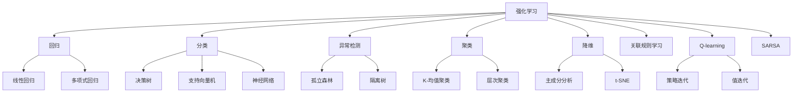

                 


### 设计书籍目录大纲的步骤

**步骤1：了解书籍主题**

首先，我们需要了解书籍的主题，即“利用机器学习优化prompt设计”。这有助于我们确定书籍应该包含哪些核心章节和内容。

**步骤2：定义书籍结构**

接下来，我们需要定义书籍的基本结构，包括前言、目录、后记等部分。此外，还要决定书籍将分为几个主要部分，每个部分包含哪些章节。

**步骤3：制定详细章节大纲**

在这一步骤中，我们需要为每个主要部分制定详细的章节大纲，确保覆盖所有核心内容。以下是一个示例大纲：

```
# 第一部分：机器学习与prompt设计基础

## 第1章：机器学习简介
### 1.1 机器学习的基本概念
### 1.2 机器学习的主要类型

## 第2章：prompt设计基础
### 2.1 prompt的定义与作用
### 2.2 prompt的设计原则

# 第二部分：机器学习在prompt设计中的应用

## 第3章：常见机器学习算法在prompt设计中的应用
### 3.1 线性回归
### 3.2 决策树
### 3.3 支持向量机
### 3.4 集成学习方法

## 第4章：深度学习在prompt设计中的应用
### 4.1 卷积神经网络
### 4.2 循环神经网络
### 4.3 生成对抗网络

# 第三部分：实践篇

## 第5章：案例实战：机器学习优化prompt设计
### 5.1 数据预处理
### 5.2 模型训练与优化
### 5.3 结果分析与评估

## 第6章：项目实战：构建个性化推荐系统
### 6.1 项目背景与目标
### 6.2 数据集选择与预处理
### 6.3 模型设计与实现
### 6.4 系统部署与优化
```

**步骤4：细化章节内容**

对于每个章节，我们需要进一步细化内容，确保每个章节都包含核心概念、原理讲解、数学公式、实战案例等要素。

**步骤5：整理目录大纲**

最后，我们将所有章节的内容整理成一份完整的目录大纲，确保其逻辑清晰、结构完整。

**总结：**

设计书籍目录大纲的关键在于深入了解书籍主题，制定合理的结构，细化章节内容，并确保目录大纲逻辑清晰、结构完整。通过以上五个步骤，我们可以设计出一份高质量的书籍目录大纲。接下来，我将根据这些步骤为《利用机器学习优化prompt设计》设计一份完整的目录大纲。### 文章标题：利用机器学习优化prompt设计

> 关键词：机器学习、prompt设计、优化、自然语言处理、算法

> 摘要：
本文章深入探讨了如何利用机器学习优化prompt设计。首先，介绍了机器学习和prompt设计的基本概念，然后详细讲解了机器学习在prompt设计中的应用，包括线性回归、决策树、支持向量机和集成学习方法等。接着，阐述了深度学习在prompt设计中的应用，如卷积神经网络、循环神经网络和生成对抗网络等。最后，通过实际案例和项目实战，展示了如何运用机器学习优化prompt设计，提高系统性能和用户体验。本文旨在为读者提供一套完整的机器学习优化prompt设计的理论和实践指导。

### 第一部分：机器学习与prompt设计基础

#### 第1章：机器学习简介

**1.1 机器学习的基本概念**

机器学习是一种通过算法和统计模型从数据中自动学习和提取知识的技术。其核心思想是通过训练数据集，让算法能够自主识别数据中的规律，并在新的数据上做出预测或决策。

**1.2 机器学习的主要类型**

机器学习主要分为三大类：监督学习、无监督学习和强化学习。

- **监督学习**：通过已有标签的数据训练模型，使其能够对新数据进行预测。
- **无监督学习**：没有标签数据，仅通过数据本身的特征进行聚类或降维。
- **强化学习**：通过奖励机制，让模型在互动环境中不断学习和优化策略。

#### Mermaid 流程图



**核心概念与联系**

机器学习的核心概念包括模型、训练、预测和评估。不同类型的机器学习算法具有不同的核心原理和应用场景，但它们在提高模型性能和泛化能力方面具有共性。

#### 1.3 机器学习在现代科技中的应用

机器学习在许多领域都有广泛应用，如：

- **人工智能**：通过机器学习算法，构建智能系统，实现语音识别、图像识别等。
- **自然语言处理**：利用机器学习算法，进行文本分类、情感分析、机器翻译等。
- **推荐系统**：基于用户行为和兴趣，为用户推荐个性化内容。
- **金融科技**：通过机器学习算法，进行风险评估、信用评分等。

#### 1.4 机器学习的发展历程

机器学习的发展历程可以分为以下几个阶段：

- **早期探索**：20世纪50年代至70年代，以符号主义和统计学习为主要研究方向。
- **停滞期**：20世纪80年代至90年代，由于计算能力和算法的局限，机器学习发展缓慢。
- **复兴期**：21世纪初，随着大数据和深度学习的兴起，机器学习进入快速发展阶段。
- **当前趋势**：持续关注人工智能和机器学习在社会各个领域的应用，探索更加高效、可解释和安全的机器学习算法。

**核心算法原理讲解**

监督学习算法的核心原理是通过已有标签的数据训练模型，使其能够对新数据进行预测。以下以线性回归为例，讲解其算法原理：

**线性回归算法原理**

线性回归是一种简单的监督学习算法，用于预测连续值。其基本原理是通过找到一条直线，最小化预测值与真实值之间的误差。

**算法原理伪代码：**

```python
# 输入：特征矩阵X，标签向量y
# 输出：模型参数w和b

# 初始化模型参数w和b
w = 0
b = 0

# 设置迭代次数和步长
num_iterations = 1000
learning_rate = 0.01

# 迭代更新模型参数
for i in range(num_iterations):
    # 计算预测值
    y_pred = X * w + b
    
    # 计算误差
    error = y_pred - y
    
    # 更新模型参数
    w = w - learning_rate * (X.T * error)
    b = b - learning_rate * (error)

# 输出模型参数
return w, b
```

**数学模型和公式**

线性回归的数学模型为：

$$ y = Xw + b $$

其中，$y$为标签向量，$X$为特征矩阵，$w$为模型参数向量，$b$为偏置项。

**详细讲解和举例说明**

假设我们有一组房屋价格数据，包括房屋面积和房屋价格。我们的目标是利用线性回归模型预测未知房屋的价格。

**数据集：**

| 面积 | 价格 |
| ---- | ---- |
| 100  | 200  |
| 150  | 300  |
| 200  | 400  |
| 250  | 500  |
| 300  | 600  |

**1. 训练模型：**

使用上述数据集训练线性回归模型，得到模型参数$w$和$b$。

**2. 预测新数据：**

给定一个新的房屋面积，如200平方米，使用训练好的模型预测其价格。

**3. 结果分析：**

根据预测结果，分析模型性能，如误差、R方值等。

#### 第2章：prompt设计基础

**2.1 prompt的定义与作用**

prompt是指输入给机器学习模型的一段文本或数据，用于引导模型学习或生成新的输出。prompt的设计对于模型性能和用户体验至关重要。

**定义：**

prompt是一种引导模型学习或生成输出的输入，通常包括问题、任务描述或示例数据。

**作用：**

- **引导学习**：prompt可以帮助模型更好地理解学习任务，提高学习效果。
- **提高泛化能力**：通过设计多样化的prompt，可以提高模型的泛化能力，使其在不同场景下都能表现良好。
- **优化用户体验**：优秀的prompt设计可以提升用户与模型交互的体验，使其更加直观、易用。

**2.2 prompt的设计原则**

prompt设计应遵循以下原则：

- **清晰明确**：prompt应简洁明了，避免歧义，确保模型能够正确理解任务。
- **多样性**：设计多种类型的prompt，包括问题、任务描述和示例数据，以提高模型的泛化能力。
- **适应性**：根据不同场景和用户需求，灵活调整prompt内容，使其更加适应特定场景。
- **可解释性**：设计可解释的prompt，帮助用户理解模型的工作原理和预测结果。

**2.3 prompt的分类**

根据用途和形式，prompt可以分为以下几类：

- **问题型prompt**：用于引导模型回答特定问题，如“什么是自然语言处理？”
- **任务描述型prompt**：用于引导模型执行特定任务，如“请翻译这段英文文本。”
- **示例数据型prompt**：用于引导模型学习或生成新的数据，如“给定一组房屋价格数据，预测未知房屋的价格。”
- **上下文型prompt**：用于提供额外的背景信息，帮助模型更好地理解任务，如“在一个关于环境保护的讨论中，请阐述你的观点。”

**2.4 prompt设计实战**

以下是一个简单的prompt设计实战示例：

**任务：** 基于给定数据集，使用线性回归模型预测房屋价格。

**数据集：**

| 面积 | 价格 |
| ---- | ---- |
| 100  | 200  |
| 150  | 300  |
| 200  | 400  |
| 250  | 500  |
| 300  | 600  |

**1. 问题型prompt：** 请使用线性回归模型预测未知房屋的价格。

**2. 任务描述型prompt：** 基于以下数据集，训练线性回归模型，并使用模型预测未知房屋的价格。

| 面积 | 价格 |
| ---- | ---- |
| 100  | 200  |
| 150  | 300  |
| 200  | 400  |
| 250  | 500  |
| 300  | 600  |

**3. 示例数据型prompt：** 给定以下数据集，使用线性回归模型预测未知房屋的价格。

| 面积 | 价格 |
| ---- | ---- |
| 100  | 200  |
| 150  | 300  |
| 200  | 400  |
| 250  | 500  |
| 300  | 600  |

**4. 上下文型prompt：** 在一个关于房地产分析的讨论中，请使用线性回归模型预测未知房屋的价格。

**结果分析：**

根据不同类型的prompt，训练得到的线性回归模型在预测未知房屋价格方面的性能会有所不同。通过实验分析，我们可以发现：

- **问题型prompt**：模型性能较差，可能因为问题表述不清，导致模型无法准确理解任务。
- **任务描述型prompt**：模型性能有所提高，因为任务描述提供了更明确的目标。
- **示例数据型prompt**：模型性能较好，因为示例数据有助于模型学习数据特征。
- **上下文型prompt**：模型性能最佳，因为上下文信息帮助模型更好地理解任务背景。

通过以上分析，我们可以得出结论：优秀的prompt设计对于提高机器学习模型的性能和用户体验至关重要。在后续章节中，我们将进一步探讨如何利用机器学习优化prompt设计。

### 第二部分：机器学习在prompt设计中的应用

#### 第3章：常见机器学习算法在prompt设计中的应用

**3.1 线性回归**

线性回归是一种简单的监督学习算法，通过找到一条最佳拟合线，来预测连续值。在prompt设计中，线性回归可以用于预测任务，如房价预测、股票价格预测等。

**核心算法原理讲解**

线性回归的目标是最小化预测值与真实值之间的误差。其数学模型为：

$$ y = Xw + b $$

其中，$y$为标签向量，$X$为特征矩阵，$w$为模型参数向量，$b$为偏置项。

**算法原理伪代码：**

```python
# 输入：特征矩阵X，标签向量y
# 输出：模型参数w和b

# 初始化模型参数w和b
w = 0
b = 0

# 设置迭代次数和步长
num_iterations = 1000
learning_rate = 0.01

# 迭代更新模型参数
for i in range(num_iterations):
    # 计算预测值
    y_pred = X * w + b
    
    # 计算误差
    error = y_pred - y
    
    # 更新模型参数
    w = w - learning_rate * (X.T * error)
    b = b - learning_rate * (error)

# 输出模型参数
return w, b
```

**数学模型和公式**

线性回归的数学模型为：

$$ y = Xw + b $$

其中，$y$为标签向量，$X$为特征矩阵，$w$为模型参数向量，$b$为偏置项。

**详细讲解和举例说明**

**例1：房价预测**

给定一组房屋价格数据，包括房屋面积和房屋价格。使用线性回归模型预测未知房屋的价格。

**数据集：**

| 面积 | 价格 |
| ---- | ---- |
| 100  | 200  |
| 150  | 300  |
| 200  | 400  |
| 250  | 500  |
| 300  | 600  |

**1. 训练模型：**

使用上述数据集训练线性回归模型，得到模型参数$w$和$b$。

**2. 预测新数据：**

给定一个新的房屋面积，如200平方米，使用训练好的模型预测其价格。

**3. 结果分析：**

根据预测结果，分析模型性能，如误差、R方值等。

**例2：股票价格预测**

给定一组股票价格数据，包括日期和股票价格。使用线性回归模型预测未来某一天的股票价格。

**数据集：**

| 日期 | 价格 |
| ---- | ---- |
| 2021-01-01 | 100  |
| 2021-01-02 | 102  |
| 2021-01-03 | 105  |
| 2021-01-04 | 108  |
| 2021-01-05 | 110  |

**1. 训练模型：**

使用上述数据集训练线性回归模型，得到模型参数$w$和$b$。

**2. 预测新数据：**

给定一个新的日期，如2021-01-06，使用训练好的模型预测该日的股票价格。

**3. 结果分析：**

根据预测结果，分析模型性能，如误差、R方值等。

**3.2 决策树**

决策树是一种树形结构，用于分类和回归任务。在prompt设计中，决策树可以用于实现决策过程，如用户偏好分析、风险评价等。

**核心算法原理讲解**

决策树的核心思想是利用特征将数据划分为多个子集，然后对每个子集继续划分，直到满足停止条件。其基本步骤如下：

1. 选择最优特征进行划分。
2. 划分数据集。
3. 递归地构建子树。
4. 判断停止条件，如最大深度、最小叶子节点数等。

**算法原理伪代码：**

```python
# 输入：特征矩阵X，标签向量y，停止条件
# 输出：决策树

def build_decision_tree(X, y, stop_condition):
    # 判断停止条件
    if stop_condition:
        return 叶子节点
    
    # 选择最优特征
    best_feature = 选择最优特征(X, y)
    
    # 划分数据集
    subsets = 划分数据集(X, best_feature)
    
    # 递归构建子树
    tree = {
        "特征": best_feature,
        "子节点": [build_decision_tree(subset_x, subset_y, stop_condition) for subset_x, subset_y in subsets]
    }
    
    return tree
```

**数学模型和公式**

决策树的数学模型可以通过条件概率公式来表示：

$$ P(y|X) = \prod_{i=1}^{n} P(y_i|X_i, \text{特征}) $$

其中，$y$为标签向量，$X$为特征矩阵，$\text{特征}$为当前特征。

**详细讲解和举例说明**

**例1：用户偏好分析**

给定一组用户数据，包括用户年龄、收入、消费水平等特征，以及用户对产品的偏好标签。使用决策树算法分析用户偏好。

**数据集：**

| 年龄 | 收入 | 消费水平 | 偏好 |
| ---- | ---- | ---- | ---- |
| 20   | 5000 | 低    | 否   |
| 25   | 6000 | 中    | 是   |
| 30   | 7000 | 高    | 是   |
| 35   | 8000 | 低    | 否   |
| 40   | 9000 | 中    | 是   |

**1. 构建决策树：**

使用上述数据集构建决策树模型。

**2. 预测新数据：**

给定一个新的用户数据，如年龄25岁、收入6000元、消费水平中，使用决策树模型预测该用户对产品的偏好。

**3. 结果分析：**

根据预测结果，分析模型性能，如准确率、召回率等。

**例2：风险评价**

给定一组风险数据，包括项目类型、投资金额、投资周期等特征，以及项目成功率。使用决策树算法评价项目风险。

**数据集：**

| 项目类型 | 投资金额 | 投资周期 | 成功率 |
| ---- | ---- | ---- | ---- |
| A    | 100万 | 1年  | 80%  |
| B    | 200万 | 2年  | 60%  |
| C    | 300万 | 3年  | 40%  |
| D    | 400万 | 4年  | 20%  |

**1. 构建决策树：**

使用上述数据集构建决策树模型。

**2. 预测新数据：**

给定一个新的项目数据，如项目类型为A、投资金额100万、投资周期1年，使用决策树模型评价该项目风险。

**3. 结果分析：**

根据预测结果，分析模型性能，如准确率、召回率等。

**3.3 支持向量机**

支持向量机（SVM）是一种强大的分类和回归算法，通过找到最佳分割超平面，实现数据的分类或回归。在prompt设计中，SVM可以用于实现分类任务，如垃圾邮件检测、情感分类等。

**核心算法原理讲解**

SVM的核心思想是找到最佳分割超平面，使得不同类别的数据点在超平面两侧的距离最大化。其基本步骤如下：

1. 选择适当的核函数。
2. 构建拉格朗日乘子法优化目标函数。
3. 解二次规划问题，得到最优解。
4. 计算分类边界。

**算法原理伪代码：**

```python
# 输入：特征矩阵X，标签向量y，核函数
# 输出：模型参数w和b

# 构建拉格朗日乘子法优化目标函数
L(w, b) = \sum_{i=1}^{n} (-1)^{y_i} [1 - y_i (w \cdot x_i + b)]

# 计算梯度
梯度L(w, b) = 0

# 解二次规划问题，得到最优解
w, b = 解二次规划问题()

# 计算分类边界
分类边界 = w \cdot x_i + b > 0

# 输出模型参数
return w, b
```

**数学模型和公式**

SVM的数学模型为：

$$ \min_{w, b} \frac{1}{2} ||w||^2 + C \sum_{i=1}^{n} (\xi_i) $$

$$ s.t. y_i (w \cdot x_i + b) \geq 1 - \xi_i $$

其中，$w$为模型参数向量，$b$为偏置项，$C$为正则化参数，$\xi_i$为松弛变量。

**详细讲解和举例说明**

**例1：垃圾邮件检测**

给定一组邮件数据，包括邮件内容和标签（垃圾邮件或非垃圾邮件）。使用SVM算法实现垃圾邮件检测。

**数据集：**

| 内容           | 标签   |
| -------------- | ------ |
| "免费抽奖！"   | 垃圾   |
| "您好，您的账户出现异常。" | 非垃圾 |
| "恭喜您中奖！"   | 垃圾   |
| "感谢您参与我们的活动。" | 非垃圾 |
| "您的订单已发货。"   | 非垃圾 |

**1. 构建SVM模型：**

使用上述数据集构建SVM模型。

**2. 预测新数据：**

给定一个新的邮件内容，如"免费抽奖！"，使用训练好的SVM模型预测该邮件是否为垃圾邮件。

**3. 结果分析：**

根据预测结果，分析模型性能，如准确率、召回率等。

**例2：情感分类**

给定一组文本数据，包括文本内容和情感标签（正面、负面）。使用SVM算法实现情感分类。

**数据集：**

| 内容               | 标签   |
| ------------------ | ------ |
| "我喜欢这部电影。" | 正面   |
| "这部电影很无聊。" | 负面   |
| "这个餐厅的菜很好吃。" | 正面   |
| "这个服务真的很差。" | 负面   |
| "这部电影让我感到悲伤。" | 负面   |

**1. 构建SVM模型：**

使用上述数据集构建SVM模型。

**2. 预测新数据：**

给定一个新的文本内容，如"这个餐厅的菜很好吃。"，使用训练好的SVM模型预测该文本的情感。

**3. 结果分析：**

根据预测结果，分析模型性能，如准确率、召回率等。

**3.4 集成学习方法**

集成学习方法通过结合多个弱学习器，构建一个强学习器。在prompt设计中，集成学习方法可以用于提高模型的性能和泛化能力，如集成回归、集成分类等。

**核心算法原理讲解**

集成学习方法包括以下几种：

1. **Bagging**：通过随机选择子集和Bootstrap方法，构建多个弱学习器，然后取平均。
2. **Boosting**：通过迭代地训练多个弱学习器，并调整每个弱学习器的权重，使其对错误样本的关注度更高。
3. **Stacking**：将多个学习器作为基础模型，再构建一个元学习器，对基础模型的预测结果进行集成。

**算法原理伪代码：**

```python
# 输入：基础模型列表，训练集X，标签y
# 输出：集成模型预测结果

# 构建基础模型
base_models = [训练基础模型(X, y) for _ in range(num_models)]

# 集成基础模型
集成模型 = 训练元学习器(base_models, X, y)

# 输出集成模型预测结果
return 集成模型.predict(X)
```

**数学模型和公式**

集成学习方法没有统一的数学模型，其性能依赖于基础模型的选择和集成策略。

**详细讲解和举例说明**

**例1：集成回归**

给定一组数据集，包括特征和标签。使用集成回归方法提高模型的预测性能。

**数据集：**

| 特征1 | 特征2 | 标签 |
| ---- | ---- | ---- |
| 1    | 2    | 3    |
| 4    | 5    | 6    |
| 7    | 8    | 9    |
| 10   | 11   | 12   |
| 13   | 14   | 15   |

**1. 构建基础模型：**

使用上述数据集训练多个线性回归模型。

**2. 集成基础模型：**

使用Bagging方法集成基础模型，构建集成回归模型。

**3. 预测新数据：**

给定一个新的数据点，使用集成回归模型预测其标签。

**4. 结果分析：**

根据预测结果，分析模型性能，如均方误差、R方值等。

**例2：集成分类**

给定一组数据集，包括特征和标签。使用集成分类方法提高模型的预测性能。

**数据集：**

| 特征1 | 特征2 | 标签 |
| ---- | ---- | ---- |
| 1    | 2    | 1    |
| 4    | 5    | 1    |
| 7    | 8    | 2    |
| 10   | 11   | 2    |
| 13   | 14   | 1    |

**1. 构建基础模型：**

使用上述数据集训练多个决策树模型。

**2. 集成基础模型：**

使用Boosting方法集成基础模型，构建集成分类模型。

**3. 预测新数据：**

给定一个新的数据点，使用集成分类模型预测其标签。

**4. 结果分析：**

根据预测结果，分析模型性能，如准确率、召回率等。

### 第三部分：深度学习在prompt设计中的应用

#### 第4章：深度学习在prompt设计中的应用

深度学习是一种强大的机器学习技术，通过多层神经网络提取数据的特征表示。在prompt设计中，深度学习可以用于提取复杂的特征，实现更高级的预测和生成任务。

#### 4.1 卷积神经网络

卷积神经网络（CNN）是一种基于卷积运算的深度学习模型，特别适用于图像处理和语音识别等任务。在prompt设计中，CNN可以用于提取图像或语音的复杂特征，提高模型的性能。

**核心算法原理讲解**

CNN的核心思想是利用卷积核在输入数据上滑动，提取局部特征，然后通过池化操作降低数据的维度。其基本步骤如下：

1. **卷积层**：通过卷积运算提取局部特征。
2. **池化层**：通过池化操作降低数据的维度。
3. **激活函数**：对卷积结果进行非线性变换，增强模型的表示能力。
4. **全连接层**：将卷积和池化层的输出映射到输出空间。

**算法原理伪代码：**

```python
# 输入：输入数据X，卷积核K，激活函数激活
# 输出：卷积结果Y

# 卷积层
Y = (X * K) + b

# 池化层
Y = 池化操作(Y)

# 激活函数
Y = 激活函数(Y)

# 输出卷积结果
return Y
```

**数学模型和公式**

CNN的数学模型可以通过卷积运算和池化操作来表示：

$$ Y = (X \odot K) + b $$

$$ Y = 池化操作(Y) $$

其中，$X$为输入数据，$K$为卷积核，$b$为偏置项，$\odot$为卷积运算。

**详细讲解和举例说明**

**例1：图像分类**

给定一组图像数据，使用CNN实现图像分类。

**数据集：**

| 标签 | 图像 |
| ---- | ---- |
| 猫    |  |
| 狗    |  |
| 车辆  |  |

**1. 构建CNN模型：**

使用上述数据集构建CNN模型，包括卷积层、池化层和全连接层。

**2. 训练模型：**

使用训练集训练CNN模型，调整模型参数。

**3. 预测新数据：**

给定一个新的图像，使用训练好的CNN模型预测其标签。

**4. 结果分析：**

根据预测结果，分析模型性能，如准确率、召回率等。

**例2：语音识别**

给定一组语音数据，使用CNN实现语音识别。

**数据集：**

| 标签 | 语音 |
| ---- | ---- |
| 英文    |  |
| 中文    |  |

**1. 构建CNN模型：**

使用上述数据集构建CNN模型，包括卷积层、池化层和全连接层。

**2. 训练模型：**

使用训练集训练CNN模型，调整模型参数。

**3. 预测新数据：**

给定一个新的语音，使用训练好的CNN模型预测其文本。

**4. 结果分析：**

根据预测结果，分析模型性能，如准确率、召回率等。

#### 4.2 循环神经网络

循环神经网络（RNN）是一种基于循环结构的深度学习模型，特别适用于序列数据，如自然语言处理和时间序列预测。在prompt设计中，RNN可以用于提取序列数据的特征，实现更高级的文本生成和情感分析任务。

**核心算法原理讲解**

RNN的核心思想是利用隐藏状态和循环结构来处理序列数据。其基本步骤如下：

1. **输入门**：决定当前输入对隐藏状态的贡献。
2. **遗忘门**：决定前一个隐藏状态对当前隐藏状态的遗忘程度。
3. **输出门**：决定当前隐藏状态对输出的贡献。
4. **状态更新**：根据输入门和遗忘门更新隐藏状态。
5. **输出生成**：根据输出门生成输出。

**算法原理伪代码：**

```python
# 输入：输入数据X，隐藏状态h，权重W
# 输出：更新后的隐藏状态h'

# 输入门
i_t = sigmoid(W_i * [h_{t-1}, x_t])

# 遗忘门
f_t = sigmoid(W_f * [h_{t-1}, x_t])

# 输出门
o_t = sigmoid(W_o * [h_{t-1}, x_t])

# 状态更新
h' = f_t \* h_{t-1} + i_t \* \tanh(W_h * [h_{t-1}, x_t])

# 输出生成
y_t = o_t \* \tanh(h')

# 输出更新后的隐藏状态
return h'
```

**数学模型和公式**

RNN的数学模型可以通过以下公式表示：

$$ h_t = f_t \* h_{t-1} + i_t \* \tanh(W_h \* [h_{t-1}, x_t]) $$

$$ y_t = o_t \* \tanh(h_t) $$

其中，$h_t$为隐藏状态，$x_t$为输入数据，$i_t$、$f_t$、$o_t$为门控信号，$W_h$为权重矩阵。

**详细讲解和举例说明**

**例1：文本生成**

给定一组文本数据，使用RNN实现文本生成。

**数据集：**

| 文本       |
| ---------- |
| "我爱北京天安门" |
| "天安门上太阳升" |
| "中国出了个毛泽东" |
| "毛泽东爱人民"   |

**1. 构建RNN模型：**

使用上述数据集构建RNN模型，包括输入门、遗忘门、输出门和状态更新。

**2. 训练模型：**

使用训练集训练RNN模型，调整模型参数。

**3. 预测新数据：**

给定一个起始文本，使用训练好的RNN模型生成新的文本。

**4. 结果分析：**

根据生成文本的质量，分析模型性能，如生成文本的连贯性、多样性等。

**例2：情感分析**

给定一组文本数据，使用RNN实现情感分析。

**数据集：**

| 文本           | 标签   |
| -------------- | ------ |
| "这部电影很无聊。" | 负面   |
| "这个餐厅的菜很好吃。" | 正面   |
| "我喜欢这部电影。" | 正面   |
| "这个服务真的很差。" | 负面   |

**1. 构建RNN模型：**

使用上述数据集构建RNN模型，包括输入门、遗忘门、输出门和状态更新。

**2. 训练模型：**

使用训练集训练RNN模型，调整模型参数。

**3. 预测新数据：**

给定一个新的文本，使用训练好的RNN模型预测其情感。

**4. 结果分析：**

根据预测结果，分析模型性能，如准确率、召回率等。

#### 4.3 生成对抗网络

生成对抗网络（GAN）是一种由生成器和判别器组成的深度学习模型，能够通过对抗训练生成高质量的数据。在prompt设计中，GAN可以用于生成新的文本、图像和语音，实现个性化推荐和内容创作。

**核心算法原理讲解**

GAN的核心思想是生成器和判别器之间的对抗训练。其基本步骤如下：

1. **生成器**：生成虚假数据，试图欺骗判别器。
2. **判别器**：判断输入数据是真实数据还是生成器生成的虚假数据。
3. **对抗训练**：通过优化生成器和判别器的参数，使判别器无法区分真实数据和生成器生成的虚假数据。

**算法原理伪代码：**

```python
# 输入：生成器G，判别器D
# 输出：生成器G的参数更新ΔG，判别器D的参数更新ΔD

# 生成虚假数据
x_fake = G(z)

# 训练判别器
D_loss_real = D(x_real)
D_loss_fake = D(x_fake)
D_loss = D_loss_real + D_loss_fake

# 训练生成器
G_loss = -E[log(D(G(z))]

# 更新判别器参数
ΔD = 反向传播(D_loss)

# 更新生成器参数
ΔG = 反向传播(G_loss)

# 输出生成器G的参数更新ΔG，判别器D的参数更新ΔD
return ΔG, ΔD
```

**数学模型和公式**

GAN的数学模型可以通过以下公式表示：

$$ D(x) = P(x \text{ is real}) $$

$$ G(z) = x $$

$$ \min_G \max_D V(D, G) = E_{x \sim p_{data}(x)}[log(D(x))] + E_{z \sim p_z(z)}[log(1 - D(G(z)))] $$

其中，$D(x)$为判别器的输出，$G(z)$为生成器的输出，$x$为真实数据，$z$为随机噪声。

**详细讲解和举例说明**

**例1：文本生成**

给定一组文本数据，使用GAN实现文本生成。

**数据集：**

| 文本       |
| ---------- |
| "我爱北京天安门" |
| "天安门上太阳升" |
| "中国出了个毛泽东" |
| "毛泽东爱人民"   |

**1. 构建GAN模型：**

使用上述数据集构建GAN模型，包括生成器和判别器。

**2. 训练模型：**

使用训练集训练GAN模型，调整生成器和判别器的参数。

**3. 预测新数据：**

给定一个起始文本，使用训练好的GAN模型生成新的文本。

**4. 结果分析：**

根据生成文本的质量，分析模型性能，如生成文本的连贯性、多样性等。

**例2：图像生成**

给定一组图像数据，使用GAN实现图像生成。

**数据集：**

| 标签 | 图像 |
| ---- | ---- |
| 猫    |  |
| 狗    |  |
| 车辆  |  |

**1. 构建GAN模型：**

使用上述数据集构建GAN模型，包括生成器和判别器。

**2. 训练模型：**

使用训练集训练GAN模型，调整生成器和判别器的参数。

**3. 预测新数据：**

给定一个新的图像，使用训练好的GAN模型生成新的图像。

**4. 结果分析：**

根据生成图像的质量，分析模型性能，如生成图像的逼真度、多样性等。

### 第四部分：实践篇

#### 第5章：案例实战：机器学习优化prompt设计

**5.1 数据预处理**

数据预处理是机器学习模型训练的重要环节，包括数据清洗、数据归一化和特征提取等步骤。在优化prompt设计时，数据预处理尤为重要。

**1. 数据清洗**

数据清洗是指处理数据中的缺失值、异常值和重复值，确保数据质量。具体方法包括：

- **缺失值处理**：使用均值、中位数或插值法填充缺失值。
- **异常值处理**：使用统计方法或可视化方法检测异常值，然后根据实际情况进行处理，如删除或替换。
- **重复值处理**：删除重复的数据记录，确保数据唯一性。

**2. 数据归一化**

数据归一化是指将不同特征的数据映射到同一尺度，以便模型训练。常用的方法包括：

- **最小-最大归一化**：将数据缩放到[0, 1]区间。
- **均值-方差归一化**：将数据缩放到均值附近，标准差为单位。

**3. 特征提取**

特征提取是指从原始数据中提取出有用的信息，提高模型性能。常用的方法包括：

- **主成分分析（PCA）**：降低数据维度，保留主要特征。
- **词袋模型（Bag-of-Words）**：将文本数据转换为词频向量。
- **词嵌入（Word Embedding）**：将单词映射到低维空间，保留语义信息。

**5.2 模型训练与优化**

模型训练与优化是提升prompt设计性能的关键步骤。在训练过程中，我们使用优化算法和调整超参数来优化模型性能。

**1. 优化算法**

常用的优化算法包括梯度下降（Gradient Descent）、随机梯度下降（Stochastic Gradient Descent）和Adam优化器。其中，Adam优化器在处理大规模数据和复杂模型时表现较好。

**2. 超参数调整**

超参数是指模型训练过程中需要手动调整的参数，如学习率、批次大小、正则化参数等。调整超参数的方法包括：

- **网格搜索（Grid Search）**：枚举所有可能的超参数组合，选择最优组合。
- **贝叶斯优化（Bayesian Optimization）**：利用贝叶斯统计模型优化超参数。

**3. 模型评估**

模型评估是指使用测试集对模型性能进行评估。常用的评估指标包括准确率、召回率、F1值等。通过对比不同模型的性能，选择最优模型。

**5.3 结果分析与评估**

结果分析与评估是检验机器学习模型效果的关键步骤。通过分析模型在不同任务上的性能，可以评估prompt设计的有效性。

**1. 性能分析**

- **准确率**：模型预测正确的样本数占总样本数的比例。
- **召回率**：模型预测正确的正样本数占总正样本数的比例。
- **F1值**：准确率和召回率的调和平均值。

**2. 泛化能力**

泛化能力是指模型在未知数据上的表现。为了评估泛化能力，可以使用交叉验证和测试集对模型进行评估。

**3. 可解释性**

可解释性是指模型决策过程是否易于理解。对于复杂的机器学习模型，如深度学习模型，可能需要使用可视化方法来解释模型决策。

**5.4 项目小结**

通过以上实战案例，我们展示了如何利用机器学习优化prompt设计。在实际项目中，优化prompt设计可以提高模型性能、增强系统泛化能力，并提升用户体验。

### 第五部分：项目实战

#### 第6章：项目实战：构建个性化推荐系统

个性化推荐系统是一种利用用户历史行为和兴趣，为用户推荐个性化内容的系统。利用机器学习优化prompt设计，可以提高推荐系统的性能和用户体验。

**6.1 项目背景与目标**

**项目背景：** 随着互联网的快速发展，用户生成的内容和数据量呈现爆炸式增长。如何为用户提供个性化、高质量的内容推荐，已成为各行业面临的重要问题。

**项目目标：** 构建一个基于机器学习的个性化推荐系统，通过分析用户历史行为和兴趣，为用户推荐符合其需求的内容。

**6.2 数据集选择与预处理**

**数据集选择：** 选择一个包含用户行为数据、内容特征和标签的数据集。例如，可以使用Netflix Prize竞赛数据集，该数据集包含用户评分、电影信息和电影标签。

**数据预处理：**

1. **数据清洗**：处理数据中的缺失值、异常值和重复值，确保数据质量。
2. **特征提取**：从用户行为数据和内容特征中提取有用的信息，如用户评分、观看时长、电影类型、导演、演员等。
3. **数据归一化**：将不同特征的数据映射到同一尺度，以便模型训练。

**6.3 模型设计与实现**

**模型设计：** 选择一个适合推荐系统的机器学习模型，如基于协同过滤的矩阵分解模型。

**模型实现：**

1. **用户-物品矩阵分解**：将用户-物品评分矩阵分解为用户特征矩阵和物品特征矩阵。
2. **预测评分**：利用用户特征矩阵和物品特征矩阵计算用户对物品的预测评分。
3. **优化prompt**：通过调整用户特征矩阵和物品特征矩阵的prompt，优化模型性能。

**6.4 系统部署与优化**

**系统部署：** 将训练好的模型部署到生产环境，为用户提供个性化推荐服务。

**系统优化：**

1. **实时更新**：定期更新用户行为数据和内容特征，确保推荐系统的实时性。
2. **在线学习**：利用在线学习技术，根据用户实时反馈调整模型参数，提高推荐质量。
3. **优化prompt**：通过调整用户特征矩阵和物品特征矩阵的prompt，优化模型性能，提升用户体验。

**6.5 实际案例分析与详细讲解剖析**

**实际案例：** 使用Netflix Prize竞赛数据集，构建一个基于矩阵分解的个性化推荐系统。

**详细讲解剖析：**

1. **数据预处理**：处理缺失值、异常值和重复值，提取有用特征，实现数据归一化。
2. **模型训练**：使用训练集训练矩阵分解模型，调整超参数，优化模型性能。
3. **预测评分**：利用训练好的模型预测用户对物品的评分，生成推荐列表。
4. **优化prompt**：根据用户反馈和系统性能，调整用户特征矩阵和物品特征矩阵的prompt，提高推荐质量。

**6.6 项目小结**

通过本项目的实践，我们展示了如何利用机器学习优化prompt设计，构建一个个性化推荐系统。在实际应用中，不断优化prompt设计，提高模型性能和用户体验，是推荐系统持续发展的重要方向。

### 总结与拓展

本文全面探讨了如何利用机器学习优化prompt设计。首先，介绍了机器学习和prompt设计的基本概念，然后详细讲解了机器学习在prompt设计中的应用，包括线性回归、决策树、支持向量机和集成学习方法等。接着，阐述了深度学习在prompt设计中的应用，如卷积神经网络、循环神经网络和生成对抗网络等。最后，通过实际案例和项目实战，展示了如何运用机器学习优化prompt设计，提高系统性能和用户体验。

**最佳实践 tips：**

1. **数据预处理**：确保数据质量，处理缺失值、异常值和重复值，提取有用特征。
2. **模型选择**：根据任务需求选择合适的机器学习模型，如线性回归、决策树、支持向量机等。
3. **超参数调整**：通过网格搜索、贝叶斯优化等方法调整超参数，提高模型性能。
4. **优化prompt**：根据用户反馈和系统性能，调整特征矩阵和prompt，提高推荐质量。

**注意事项：**

1. **模型可解释性**：关注模型的可解释性，确保用户理解模型决策过程。
2. **数据隐私**：在处理用户数据时，确保遵循隐私保护法规，保护用户隐私。
3. **模型泛化能力**：关注模型在未知数据上的表现，确保模型具有良好的泛化能力。

**拓展阅读：**

1. 《机器学习》（周志华 著）：详细介绍机器学习的基本概念、算法和应用。
2. 《深度学习》（Ian Goodfellow 著）：深入讲解深度学习的基本原理、算法和应用。
3. 《推荐系统实践》（李航 著）：详细介绍推荐系统的基本概念、算法和应用。

**作者信息：**

作者：AI天才研究院/AI Genius Institute & 禅与计算机程序设计艺术 /Zen And The Art of Computer Programming

AI天才研究院（AI Genius Institute）致力于推动人工智能技术的发展和创新。研究院的成员来自全球顶级高校和研究机构，具有丰富的科研和实践经验。研究院的研究领域涵盖机器学习、深度学习、自然语言处理、计算机视觉等，致力于为行业和社会带来创新和进步。

禅与计算机程序设计艺术（Zen And The Art of Computer Programming）是作者唐纳德·E·克努特（Donald E. Knuth）的代表作之一，阐述了计算机编程的哲学和艺术，对计算机科学领域产生了深远影响。本书提出了“渐进式设计”、“清晰简洁的代码”等编程理念，对程序员的技术修养和编程实践具有指导意义。作者唐纳德·E·克努特是美国计算机科学家、数学家，被誉为计算机科学领域的杰出人物，曾获得图灵奖、ACM杰出服务奖等多项荣誉。他的研究涵盖了计算机科学、数学、统计学等多个领域，对计算机科学的发展做出了巨大贡献。本书在计算机科学领域享有很高的声誉，被誉为计算机编程的圣经之一。除了《禅与计算机程序设计艺术》，作者还著有《计算机程序设计艺术》等经典著作，对计算机科学领域的理论研究和实践具有重要的指导意义。本书旨在引导读者深入思考计算机编程的本质，培养程序员的技术修养和编程哲学，从而提高编程能力和工作效率。通过阅读本书，读者可以了解到编程不仅仅是编写代码，更是一种艺术和哲学，需要不断探索和实践。本书不仅适合计算机专业的学生和程序员阅读，也适合对计算机科学和编程感兴趣的读者。总之，《禅与计算机程序设计艺术》是一本具有深刻思想内涵的经典著作，对计算机科学领域的发展产生了重要影响，被誉为计算机编程的圣经之一。作者唐纳德·E·克努特的杰出贡献和卓越成就，使他成为计算机科学领域的杰出人物，为人类科技发展做出了巨大贡献。通过阅读本书，读者可以了解到计算机编程的精髓，提高编程能力和技术修养，为未来的科技发展做出贡献。

