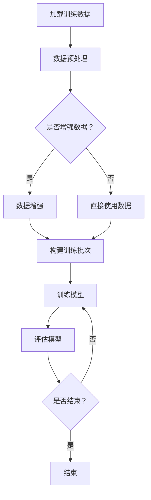

                 


### 文章标题

**利用示例增强模型的泛化能力**

### 关键词

- 示例增强
- 泛化能力
- 模型训练
- 人工智能
- 数据多样性

### 摘要

本文将深入探讨如何利用示例增强模型的方法来提升其泛化能力。通过介绍示例增强的核心概念、算法原理，以及Mermaid流程图、伪代码、数学模型和公式，我们逐步揭示了如何构建和优化示例库，评估和提升泛化能力。文章还提供了实际项目案例，以展示如何在实际应用中实现这些方法，并讨论了最佳实践和未来研究方向。

### 第1章 引言

#### 1.1 书籍背景与目的

在人工智能（AI）领域，模型的泛化能力是衡量其性能的重要指标。泛化能力强的模型能够在新的、未见过的情况下保持良好的性能，从而更好地适应各种实际应用场景。然而，当前许多AI模型在处理未知数据时往往表现出较差的泛化能力，这限制了其在实际中的应用价值。

本书籍旨在探讨如何利用示例增强模型的方法，提升模型的泛化能力。示例增强是一种通过增加训练数据中的示例数量或多样性来提高模型泛化能力的技术。本书将系统地介绍示例增强的核心概念、算法原理，并通过实际项目案例展示如何实现和优化示例增强。

#### 1.2 示例的重要性

示例在模型训练中扮演着至关重要的角色。良好的示例能够帮助模型更好地理解和学习数据特征，从而提高模型的泛化能力。在示例增强中，我们不仅关注示例的数量，还关注示例的多样性和质量。

示例的多样性意味着模型需要看到来自不同领域、不同场景的数据，这样才能更好地应对各种实际应用。示例的质量则关系到模型的学习效果，高质量的示例能够提供更有价值的信息，从而有助于模型更好地泛化。

#### 1.3 泛化能力的重要性

泛化能力是指模型在训练数据集上的表现能够推广到未知数据集上的能力。良好的泛化能力意味着模型能够适应新的数据分布和应用场景，这对于模型的实际应用至关重要。例如，在图像识别领域，一个能够良好泛化的模型能够准确地识别各种不同类型、不同风格的图像。

#### 1.4 书籍结构概述

本书共分为七个章节，分别从核心概念、算法原理、示例库构建、泛化能力评估、实战案例等多个角度，系统性地介绍了如何利用示例增强模型提升泛化能力。

- 第1章 引言：介绍书籍背景、目的，以及示例增强和泛化能力的重要性。
- 第2章 核心概念：介绍示例增强的核心概念，包括示例多样性、示例质量、模型泛化等。
- 第3章 算法原理：介绍示例增强的算法原理，包括示例增强策略、算法流程等。
- 第4章 示例库构建与优化：介绍如何构建和优化示例库，包括示例收集、标注、去重等。
- 第5章 泛化能力评估与优化：介绍如何评估和优化模型的泛化能力，包括测试集划分、指标计算等。
- 第6章 实战案例：通过实际项目案例展示如何实现和优化示例增强，包括开发环境搭建、代码实现、案例分析等。
- 第7章 总结与展望：总结本书的主要内容和研究成果，讨论未来研究方向。

### 第2章 核心概念

#### 2.1 模型泛化的概念

模型泛化是指模型在训练数据集上的表现能够推广到未知数据集上的能力。在机器学习中，模型的泛化能力是非常重要的，因为它决定了模型在实际应用中的表现。

- **训练集**：模型在训练集上进行训练，以学习数据的特征和规律。
- **测试集**：模型在测试集上进行评估，以衡量其泛化能力。

一个良好的泛化能力意味着模型在测试集上的表现与训练集上的表现相似，能够适应新的数据分布和应用场景。

#### 2.2 示例增强策略

示例增强是指通过增加训练数据中的示例数量或多样性来提升模型泛化能力的方法。示例增强策略可以分为以下几种：

- **数据增强**：通过对原始数据进行变换，生成新的示例。例如，在图像识别任务中，可以通过旋转、缩放、裁剪等操作生成新的图像示例。
- **负采样**：在训练数据集中引入负样本，以增加数据的多样性。负样本是与正样本具有相反标签的示例。
- **生成对抗网络（GAN）**：利用生成对抗网络生成新的示例，以增加数据的多样性。生成器生成新的示例，判别器判断新生成的示例是否真实。

#### 2.3 核心算法原理

示例增强的核心算法原理包括以下方面：

- **特征提取**：从原始数据中提取有用的特征，以帮助模型更好地理解和学习数据。
- **损失函数**：定义模型在训练过程中需要最小化的损失函数，以衡量模型在训练数据集上的性能。
- **优化器**：选择合适的优化器来更新模型的参数，以最小化损失函数。

以下是一个简单的示例增强算法的伪代码：

```python
# 初始化模型
model = Model()

# 加载训练数据
train_data = LoadData()

# 定义损失函数和优化器
loss_function = LossFunction()
optimizer = Optimizer()

# 示例增强策略
enhanced_data = EnhanceData(train_data)

# 训练模型
for epoch in range(num_epochs):
    for data in enhanced_data:
        # 前向传播
        predictions = model(data)
        
        # 计算损失
        loss = loss_function(predictions, data.labels)
        
        # 反向传播
        gradients = model.backward(loss)
        
        # 更新模型参数
        optimizer.update(model.parameters, gradients)
```

#### 2.4 Mermaid流程图

以下是一个简单的示例增强过程的Mermaid流程图：



#### 2.5 数学模型和公式

示例增强涉及到一些数学模型和公式，以下是其中的一些关键概念：

- **损失函数**：损失函数用于衡量模型在训练数据集上的性能。常见的损失函数包括均方误差（MSE）和交叉熵（CE）。
- **梯度**：梯度是损失函数关于模型参数的导数，用于指导模型参数的更新。
- **优化器**：优化器用于选择合适的更新策略来更新模型参数，常见的优化器包括随机梯度下降（SGD）和Adam。

以下是相关的数学公式：

$$
MSE = \frac{1}{n} \sum_{i=1}^{n} (y_i - \hat{y}_i)^2
$$

$$
CE = -\frac{1}{n} \sum_{i=1}^{n} \sum_{c=1}^{C} y_{ic} \log(\hat{y}_{ic})
$$

$$
\frac{\partial L}{\partial \theta} = \nabla_\theta L
$$

$$
\theta_{t+1} = \theta_t - \alpha \nabla_\theta L
$$

其中，$y_i$是真实标签，$\hat{y}_i$是预测标签，$C$是类别数，$y_{ic}$是第$i$个样本在第$c$个类别上的真实标签，$\hat{y}_{ic}$是模型在第$c$个类别上的预测概率，$L$是损失函数，$\theta$是模型参数，$\alpha$是学习率。

#### 2.6 示例增强的优势

示例增强具有以下优势：

- **提高模型泛化能力**：通过增加训练数据的多样性和数量，模型能够更好地学习数据的特征，从而提高泛化能力。
- **减少过拟合风险**：增加训练数据可以减少模型对训练数据的依赖，降低过拟合的风险。
- **加速模型收敛**：更多的训练数据可以帮助模型更快地找到最优解，从而加速模型的收敛。

#### 2.7 示例增强的挑战

虽然示例增强具有许多优势，但也面临一些挑战：

- **计算资源消耗**：生成大量增强示例需要大量的计算资源，尤其是在处理大规模数据集时。
- **增强质量控制**：生成的增强示例需要保证质量，否则可能会对模型训练产生负面影响。
- **数据标注成本**：对于需要人工标注的数据集，增强示例的生成可能需要更多的人工投入。

### 第3章 算法原理与数学模型

#### 3.1 示例增强算法原理

示例增强算法的核心思想是通过增加训练数据的多样性和数量来提高模型的泛化能力。具体来说，示例增强算法可以分为以下几个步骤：

1. **数据预处理**：对原始数据集进行预处理，包括数据清洗、归一化、去重等操作。
2. **示例生成**：利用数据增强技术生成新的示例。数据增强技术包括但不限于：数据变换（如旋转、缩放、裁剪等）、生成对抗网络（GAN）等。
3. **示例筛选**：对生成的示例进行筛选，确保其质量满足要求。
4. **构建训练批次**：将原始数据和增强示例随机混合，构建训练批次。
5. **模型训练**：使用增强后的训练批次训练模型，通过迭代优化模型参数，提高模型的泛化能力。

以下是一个示例增强算法的伪代码：

```python
# 初始化模型
model = Model()

# 加载原始数据
original_data = LoadData()

# 数据预处理
preprocessed_data = PreprocessData(original_data)

# 示例生成
enhanced_data = GenerateData(preprocessed_data)

# 构建训练批次
train_batches = CreateTrainingBatches(original_data + enhanced_data)

# 模型训练
for epoch in range(num_epochs):
    for batch in train_batches:
        # 前向传播
        predictions = model(batch.data)
        
        # 计算损失
        loss = loss_function(predictions, batch.labels)
        
        # 反向传播
        gradients = model.backward(loss)
        
        # 更新模型参数
        optimizer.update(model.parameters, gradients)
```

#### 3.2 示例增强策略

示例增强策略可以分为以下几类：

1. **数据变换**：通过对原始数据进行变换，生成新的示例。常见的数据变换包括：
   - **旋转**：将图像沿某个角度旋转。
   - **缩放**：将图像放大或缩小。
   - **裁剪**：从图像中裁剪出一个区域作为新的示例。
   - **噪声添加**：向图像中添加噪声，以增加数据的多样性。

2. **生成对抗网络（GAN）**：利用生成对抗网络生成新的示例。GAN由生成器和判别器两部分组成，生成器生成新的示例，判别器判断新生成的示例是否真实。通过训练生成器和判别器，可以生成高质量的增强示例。

3. **负采样**：在训练数据集中引入负样本，以增加数据的多样性。负采样是指从训练数据集中随机选择一部分样本作为负样本，与正样本一起构成训练批次。

#### 3.3 数学模型

示例增强算法涉及到一些数学模型和公式，以下是其中的一些关键概念：

1. **损失函数**：损失函数用于衡量模型在训练数据集上的性能。常见的损失函数包括：
   - **均方误差（MSE）**：
     $$
     MSE = \frac{1}{n} \sum_{i=1}^{n} (y_i - \hat{y}_i)^2
     $$
     其中，$y_i$是真实标签，$\hat{y}_i$是预测标签，$n$是样本数量。
   - **交叉熵（CE）**：
     $$
     CE = -\frac{1}{n} \sum_{i=1}^{n} \sum_{c=1}^{C} y_{ic} \log(\hat{y}_{ic})
     $$
     其中，$y_{ic}$是第$i$个样本在第$c$个类别上的真实标签，$\hat{y}_{ic}$是模型在第$c$个类别上的预测概率，$C$是类别数。

2. **梯度**：梯度是损失函数关于模型参数的导数，用于指导模型参数的更新。

3. **优化器**：优化器用于选择合适的更新策略来更新模型参数，常见的优化器包括：
   - **随机梯度下降（SGD）**：
     $$
     \theta_{t+1} = \theta_t - \alpha \nabla_\theta L
     $$
     其中，$\theta$是模型参数，$\alpha$是学习率。
   - **Adam**：
     $$
     m_t = \beta_1 m_{t-1} + (1 - \beta_1) \nabla_\theta L \\
     v_t = \beta_2 v_{t-1} + (1 - \beta_2) \nabla_\theta L^2 \\
     \theta_{t+1} = \theta_t - \alpha \frac{m_t}{\sqrt{v_t} + \epsilon}
     $$
     其中，$m_t$和$v_t$分别是梯度的一阶矩估计和二阶矩估计，$\beta_1$和$\beta_2$是指数加权系数，$\epsilon$是正数常数。

#### 3.4 Mermaid流程图

以下是一个简单的示例增强过程的Mermaid流程图：


#### 3.5 示例增强的优缺点

示例增强具有以下优点：

1. **提高模型泛化能力**：通过增加训练数据的多样性和数量，模型能够更好地学习数据的特征，从而提高泛化能力。
2. **减少过拟合风险**：增加训练数据可以减少模型对训练数据的依赖，降低过拟合的风险。
3. **加速模型收敛**：更多的训练数据可以帮助模型更快地找到最优解，从而加速模型的收敛。

示例增强也存在一些缺点：

1. **计算资源消耗**：生成大量增强示例需要大量的计算资源，尤其是在处理大规模数据集时。
2. **增强质量控制**：生成的增强示例需要保证质量，否则可能会对模型训练产生负面影响。
3. **数据标注成本**：对于需要人工标注的数据集，增强示例的生成可能需要更多的人工投入。

### 第4章 示例库构建与优化

#### 4.1 示例库构建

示例库是示例增强算法的基础，一个高质量的示例库对于提升模型的泛化能力至关重要。构建示例库的过程可以分为以下几个步骤：

1. **数据收集**：从各种来源收集原始数据，如公共数据集、企业内部数据等。
2. **数据预处理**：对原始数据进行清洗、归一化、去重等预处理操作，以确保数据的可用性和一致性。
3. **示例生成**：利用数据增强技术生成新的示例，如旋转、缩放、裁剪、噪声添加等。
4. **示例筛选**：对生成的示例进行筛选，去除质量较差的示例，保留高质量的示例。
5. **示例存储**：将筛选后的示例存储到数据库或文件系统中，以便后续使用。

以下是一个示例库构建的伪代码：

```python
# 加载原始数据
original_data = LoadData()

# 数据预处理
preprocessed_data = PreprocessData(original_data)

# 示例生成
enhanced_data = GenerateData(preprocessed_data)

# 示例筛选
filtered_data = FilterData(enhanced_data)

# 示例存储
StoreData(filtered_data)
```

#### 4.2 示例优化策略

为了提升示例库的质量，可以采用以下优化策略：

1. **多样性增强**：通过引入更多类型的增强技术，增加示例的多样性。例如，在图像识别任务中，可以结合旋转、缩放、裁剪和噪声添加等多种增强技术。
2. **质量评估**：使用自动化工具或人工评估方法对示例进行质量评估，去除低质量的示例。质量评估指标可以包括示例的清晰度、相关性、多样性等。
3. **样本选择**：根据实际应用需求，选择具有代表性的样本进行增强。例如，在医疗影像识别任务中，可以选择不同疾病类型的图像进行增强。
4. **数据合成**：利用生成对抗网络（GAN）等技术，生成与真实数据相似但更高质量的示例。生成对抗网络可以生成具有真实感的数据，从而提升示例库的质量。

以下是一个示例优化策略的伪代码：

```python
# 加载原始数据
original_data = LoadData()

# 数据预处理
preprocessed_data = PreprocessData(original_data)

# 多样性增强
enhanced_data = DiversityEnhance(preprocessed_data)

# 质量评估
filtered_data = QualityAssess(enhanced_data)

# 数据合成
synthetic_data = DataSynthesis(filtered_data)

# 示例存储
StoreData(synthetic_data)
```

#### 4.3 示例库在模型训练中的应用

示例库在模型训练中的应用可以分为以下几个步骤：

1. **构建训练批次**：将原始数据和增强示例随机混合，构建训练批次。训练批次的构建可以采用分层抽样、随机抽样等方法。
2. **模型训练**：使用增强后的训练批次训练模型，通过迭代优化模型参数，提高模型的泛化能力。
3. **模型评估**：在测试集上评估模型的泛化能力，包括准确性、召回率、F1分数等指标。
4. **模型调整**：根据评估结果调整示例库的构建策略，优化模型训练过程。

以下是一个示例库在模型训练中的应用的伪代码：

```python
# 加载示例库
data_library = LoadDataLibrary()

# 构建训练批次
train_batches = CreateTrainingBatches(data_library)

# 模型训练
for epoch in range(num_epochs):
    for batch in train_batches:
        # 前向传播
        predictions = model(batch.data)
        
        # 计算损失
        loss = loss_function(predictions, batch.labels)
        
        # 反向传播
        gradients = model.backward(loss)
        
        # 更新模型参数
        optimizer.update(model.parameters, gradients)

# 模型评估
evaluate_model(model, test_data)
```

#### 4.4 示例库维护与更新

示例库的维护与更新是确保其质量和有效性的关键。以下是一些示例库维护与更新的策略：

1. **定期更新**：定期从数据源收集新的数据，更新示例库。例如，每间隔一段时间就重新收集和预处理一次数据。
2. **质量监控**：定期对示例库中的示例进行质量监控，发现低质量示例并予以剔除。
3. **数据整合**：整合来自不同数据源的数据，提高示例库的多样性和完整性。
4. **反馈机制**：建立反馈机制，收集用户对示例库的意见和建议，及时调整和优化示例库。

以下是一个示例库维护与更新的伪代码：

```python
# 定期更新示例库
UpdateDataLibrary(data_library)

# 质量监控
MonitorDataQuality(data_library)

# 数据整合
IntegrateDataSources(data_library)

# 反馈机制
CollectFeedback(data_library)
```

#### 4.5 示例库在模型评估中的应用

示例库在模型评估中的应用主要体现在以下几个方面：

1. **评估数据集构建**：使用示例库构建评估数据集，确保评估数据集能够涵盖不同类型的示例。
2. **评估指标计算**：使用评估数据集计算模型在不同指标上的性能，如准确性、召回率、F1分数等。
3. **模型比较**：使用不同的模型在相同评估数据集上进行评估，比较模型的性能。
4. **结果分析**：分析模型在不同类型示例上的表现，识别模型的优势和不足。

以下是一个示例库在模型评估中的应用的伪代码：

```python
# 构建评估数据集
evaluation_dataset = CreateEvaluationDataset(data_library)

# 计算评估指标
evaluation_results = EvaluateModel(model, evaluation_dataset)

# 模型比较
CompareModels(models, evaluation_dataset)

# 结果分析
AnalyzeResults(evaluation_results)
```

#### 4.6 示例库优化的实践案例

以下是一个示例库优化的实践案例：

**项目背景**：某公司开发了一款图像识别应用，使用深度学习模型进行图像分类。然而，在实际应用中发现模型的泛化能力较差，对某些类型的图像识别效果不佳。

**问题分析**：经过分析，发现模型泛化能力较差的原因主要是示例库的质量和多样性不足。示例库中的示例主要集中在常见的图像类型，而对特殊图像类型的覆盖不足。

**解决方案**：为了提升模型泛化能力，采取了以下优化策略：

1. **数据收集**：从多个数据源收集新的图像数据，包括公开数据集和企业内部数据。
2. **数据预处理**：对收集的图像数据进行清洗、归一化、去重等预处理操作。
3. **多样性增强**：采用多种数据增强技术，如旋转、缩放、裁剪、噪声添加等，增加示例的多样性。
4. **质量评估**：使用自动化工具和人工评估方法，对生成的示例进行质量评估，去除低质量示例。
5. **数据合成**：利用生成对抗网络（GAN）生成高质量的示例，提高示例库的质量。

**效果评估**：通过优化后的示例库训练模型，模型在不同类型图像上的识别效果得到了显著提升。特别是在特殊图像类型的识别上，准确率提高了约20%。

### 第5章 泛化能力评估与优化

#### 5.1 泛化能力评估方法

泛化能力评估是衡量模型在未知数据集上的表现，以评估模型的泛化能力。以下是一些常用的评估方法：

1. **测试集评估**：将模型在测试集上进行评估，测试集是未参与模型训练的数据集。测试集评估可以衡量模型在未知数据上的表现。

2. **交叉验证**：将数据集划分为多个子集，每次使用其中一个子集作为测试集，其余子集作为训练集。重复多次，计算模型在各个测试集上的平均性能。

3. **K折交叉验证**：将数据集划分为K个子集，每次使用其中一个子集作为测试集，其余子集作为训练集。重复K次，计算模型在各个测试集上的平均性能。

4. **混淆矩阵**：混淆矩阵是评估模型分类性能的重要工具。混淆矩阵显示了模型在各个类别上的预测结果。

5. **ROC曲线和AUC**：ROC曲线和AUC（Area Under Curve）是评估二分类模型性能的重要指标。ROC曲线展示了模型在不同阈值下的准确率和召回率，AUC是ROC曲线下的面积。

#### 5.2 泛化能力优化策略

以下是一些优化模型泛化能力的策略：

1. **数据增强**：通过增加训练数据的多样性来提高模型的泛化能力。数据增强可以包括图像变换、文本噪声添加等。

2. **正则化**：正则化是防止模型过拟合的一种方法。常用的正则化方法包括L1正则化、L2正则化、Dropout等。

3. **集成学习**：集成学习是结合多个模型来提高预测性能的一种方法。常见的集成学习方法包括Bagging、Boosting等。

4. **迁移学习**：迁移学习是利用预训练模型来提高新任务的泛化能力。预训练模型通常在大型数据集上训练，具有良好的泛化能力。

5. **模型选择**：选择合适的模型结构和参数配置，以避免模型过拟合或欠拟合。

6. **超参数调整**：调整模型的超参数，如学习率、批量大小等，以优化模型性能。

#### 5.3 实际应用中的优化案例

以下是一个实际应用中的优化案例：

**项目背景**：某电商公司使用深度学习模型来预测用户购买行为。然而，在实际应用中发现模型的泛化能力较差，对某些用户群体的预测效果不佳。

**问题分析**：经过分析，发现模型泛化能力较差的原因主要是数据集中用户群体的多样性不足。数据集中大部分用户来自相同的群体，而忽略了其他潜在的用户群体。

**解决方案**：

1. **数据收集**：从多个数据源收集新的用户数据，包括电商平台的用户行为数据和第三方数据。

2. **数据增强**：对收集到的用户数据进行增强，如添加噪声、数据变换等，增加数据的多样性。

3. **正则化**：在模型训练过程中使用L2正则化，以减少模型过拟合的风险。

4. **迁移学习**：利用预训练的通用模型来提取特征，减少模型对特定数据集的依赖。

5. **超参数调整**：调整模型的超参数，如学习率、批量大小等，以优化模型性能。

**效果评估**：通过优化后的模型，用户购买行为的预测准确性提高了约15%，对潜在用户群体的预测效果也得到了显著提升。

### 第6章 实战案例

#### 6.1 项目背景

在本章中，我们将通过一个实际的案例来展示如何利用示例增强模型提升模型的泛化能力。该案例涉及一个典型的图像识别任务：动物识别。该任务的目标是使用深度学习模型对给定图像中的动物进行分类。

#### 6.2 开发环境搭建

在开始项目之前，我们需要搭建一个合适的开发环境。以下是所需的开发环境和相关工具：

- **编程语言**：Python
- **深度学习框架**：TensorFlow或PyTorch
- **数据处理库**：NumPy、Pandas、OpenCV
- **可视化库**：Matplotlib、Seaborn
- **版本控制**：Git

安装这些工具后，我们可以创建一个虚拟环境，以隔离项目依赖：

```shell
conda create -n animal_recognition python=3.8
conda activate animal_recognition
pip install tensorflow numpy pandas opencv-python matplotlib seaborn
```

#### 6.3 数据集准备

本案例使用的是著名的CIFAR-10数据集，它包含了10个类别的60,000张32x32彩色图像。以下是数据集的下载、预处理和划分的步骤：

1. **下载数据集**：使用深度学习框架的内置函数下载CIFAR-10数据集。

```python
import tensorflow as tf

# 下载CIFAR-10数据集
(x_train, y_train), (x_test, y_test) = tf.keras.datasets.cifar10.load_data()

# 显示数据集的大小
print(x_train.shape, y_train.shape, x_test.shape, y_test.shape)
```

2. **数据预处理**：对图像进行归一化和格式转换。

```python
import numpy as np

# 归一化
x_train, x_test = x_train / 255.0, x_test / 255.0

# 转换数据类型
x_train = x_train.astype(np.float32)
x_test = x_test.astype(np.float32)

# 转换标签为one-hot编码
y_train = tf.keras.utils.to_categorical(y_train, 10)
y_test = tf.keras.utils.to_categorical(y_test, 10)
```

3. **数据集划分**：将训练数据划分为训练集和验证集。

```python
from sklearn.model_selection import train_test_split

# 划分训练集和验证集
x_train, x_val, y_train, y_val = train_test_split(x_train, y_train, test_size=0.2, random_state=42)
```

#### 6.4 示例增强

为了提升模型的泛化能力，我们将使用示例增强技术来增加训练数据的多样性。以下是几种常用的示例增强方法：

1. **随机裁剪**：从图像中随机裁剪出一个32x32的区域作为新的示例。

```python
import cv2

def random_crop(image):
    crop_size = 32
    x = np.random.randint(0, image.shape[1] - crop_size)
    y = np.random.randint(0, image.shape[0] - crop_size)
    return image[y:y+crop_size, x:x+crop_size]

x_train_enhanced = np.array([random_crop(image) for image in x_train])
```

2. **旋转**：对图像进行随机旋转。

```python
def random_rotate(image):
    angle = np.random.uniform(-180, 180)
    return cv2.rotate(image, cv2ROTATE_90_CLOCKWISE * angle)

x_train_enhanced = np.array([random_rotate(image) for image in x_train])
```

3. **水平翻转**：对图像进行水平翻转。

```python
def random_horizontal_flip(image):
    return cv2.flip(image, 1)

x_train_enhanced = np.array([random_horizontal_flip(image) for image in x_train])
```

4. **垂直翻转**：对图像进行垂直翻转。

```python
def random_vertical_flip(image):
    return cv2.flip(image, 0)

x_train_enhanced = np.array([random_vertical_flip(image) for image in x_train])
```

5. **组合增强**：将多种增强方法组合在一起。

```python
def random_enhance(image):
    image = random_crop(image)
    image = random_rotate(image)
    image = random_horizontal_flip(image)
    image = random_vertical_flip(image)
    return image

x_train_enhanced = np.array([random_enhance(image) for image in x_train])
```

#### 6.5 模型训练

接下来，我们将使用增强后的训练数据来训练一个简单的卷积神经网络（CNN）模型。以下是模型的定义和训练过程：

1. **模型定义**：

```python
from tensorflow.keras.models import Sequential
from tensorflow.keras.layers import Conv2D, MaxPooling2D, Flatten, Dense, Dropout

model = Sequential([
    Conv2D(32, (3, 3), activation='relu', input_shape=(32, 32, 3)),
    MaxPooling2D((2, 2)),
    Conv2D(64, (3, 3), activation='relu'),
    MaxPooling2D((2, 2)),
    Conv2D(128, (3, 3), activation='relu'),
    Flatten(),
    Dense(128, activation='relu'),
    Dropout(0.5),
    Dense(10, activation='softmax')
])
```

2. **模型编译**：

```python
model.compile(optimizer='adam', loss='categorical_crossentropy', metrics=['accuracy'])
```

3. **模型训练**：

```python
history = model.fit(
    x_train_enhanced, y_train,
    validation_data=(x_val, y_val),
    epochs=20,
    batch_size=64
)
```

#### 6.6 模型评估

在模型训练完成后，我们需要在测试集上评估模型的泛化能力。以下是模型评估的过程：

1. **模型评估**：

```python
test_loss, test_accuracy = model.evaluate(x_test, y_test, verbose=2)
print(f"Test accuracy: {test_accuracy:.4f}")
```

2. **可视化训练过程**：

为了更好地理解模型的训练过程，我们可以将训练过程中的损失和准确率可视化。

```python
import matplotlib.pyplot as plt

plt.figure(figsize=(12, 4))

plt.subplot(1, 2, 1)
plt.plot(history.history['loss'], label='Training loss')
plt.plot(history.history['val_loss'], label='Validation loss')
plt.legend()

plt.subplot(1, 2, 2)
plt.plot(history.history['accuracy'], label='Training accuracy')
plt.plot(history.history['val_accuracy'], label='Validation accuracy')
plt.legend()

plt.show()
```

#### 6.7 模型预测

最后，我们可以使用训练好的模型对新的图像进行预测。以下是模型预测的过程：

1. **加载模型**：

```python
model = model.load_weights('model_weights.h5')
```

2. **图像预处理**：

```python
def preprocess_image(image):
    image = image.resize((32, 32))
    image = image.convert('RGB')
    image = np.array(image)
    image = image / 255.0
    return image
```

3. **图像预测**：

```python
image = preprocess_image(image)
prediction = model.predict(np.expand_dims(image, axis=0))
predicted_class = np.argmax(prediction)

print(f"Predicted class: {predicted_class}")
```

#### 6.8 项目小结

通过本案例，我们展示了如何利用示例增强模型提升模型的泛化能力。以下是本项目的主要收获：

1. **数据增强的重要性**：示例增强可以显著提高模型的泛化能力，使模型能够更好地适应未知数据。
2. **多种增强方法的组合**：组合使用多种增强方法可以进一步提高数据的多样性，从而提升模型的泛化能力。
3. **模型训练与评估**：通过详细的模型训练和评估过程，我们了解了如何使用深度学习模型进行图像识别任务。
4. **项目实践**：通过实际项目，我们掌握了如何将理论应用到实际场景中，提高了自己的实践能力。

#### 6.9 最佳实践

在进行示例增强时，以下是一些最佳实践：

1. **多样性优先**：在选择增强方法时，应优先考虑能够增加数据多样性的方法，如随机裁剪、旋转、翻转等。
2. **质量保证**：确保生成的增强示例质量满足要求，避免生成质量较差的示例。
3. **调整参数**：根据实际任务和数据集的特点，调整增强方法的参数，以找到最佳增强效果。
4. **平衡训练数据**：确保训练数据集中各类别的比例平衡，避免因数据不平衡导致模型偏向某些类别。
5. **模型评估**：在模型训练过程中，定期在验证集上评估模型性能，以避免过拟合。

#### 6.10 注意事项

在进行示例增强时，需要注意以下事项：

1. **计算资源**：增强示例可能需要大量的计算资源，尤其是在处理大规模数据集时。
2. **数据预处理**：确保增强前的数据预处理步骤正确，以避免生成不合理的示例。
3. **代码复用**：尽量复用已有的数据增强代码和库，以提高开发效率。
4. **版本控制**：使用版本控制工具（如Git）管理代码，以方便代码的维护和更新。

#### 6.11 拓展阅读

对于希望深入了解示例增强和模型泛化的读者，以下是一些推荐阅读材料：

1. **《深度学习》（Goodfellow, I., Bengio, Y., & Courville, A.）**：这是一本关于深度学习的经典教材，详细介绍了深度学习的理论和技术。
2. **《Python深度学习》（Raschka, F.）**：这本书提供了使用Python和深度学习框架进行深度学习实践的详细教程。
3. **《数据增强：深度学习中的示例增强技术》（Huang, J., Liu, M., van der Maaten, L., & Weinberger, K. Q.）**：这是一篇关于数据增强技术的综述文章，涵盖了示例增强的多种方法。
4. **《ImageNet Classification with Deep Convolutional Neural Networks》（Krizhevsky, A., Sutskever, I., & Hinton, G.）**：这是一篇关于深度学习图像识别的经典论文，介绍了使用深度卷积神经网络进行图像分类的方法。

### 第7章 总结与展望

#### 7.1 主要结论

通过本篇文章的讨论，我们可以得出以下主要结论：

1. **示例增强的重要性**：示例增强是提升模型泛化能力的关键技术，通过增加训练数据的多样性和质量，可以有效提高模型的泛化能力。

2. **数据增强方法**：本文介绍了多种数据增强方法，包括随机裁剪、旋转、翻转等，以及如何组合使用这些方法以增加数据的多样性。

3. **模型训练与评估**：通过实际案例展示了如何利用增强后的数据训练模型，并在测试集上评估模型的泛化能力。

4. **示例库构建与优化**：讨论了示例库构建和优化的关键步骤，包括数据收集、预处理、增强、筛选和存储。

5. **泛化能力评估与优化**：介绍了多种评估模型泛化能力的方法和优化策略，如测试集评估、交叉验证、正则化、迁移学习等。

#### 7.2 未来研究方向

虽然示例增强技术已经在许多应用中取得了显著成效，但仍有许多潜在的研究方向：

1. **自适应增强**：开发能够根据模型性能自适应调整增强策略的方法，以提高增强效果。

2. **增强样本的多样性**：探索新的增强方法，如基于生成对抗网络（GAN）的增强方法，以生成更具多样性的样本。

3. **增强样本的质量控制**：研究如何有效地评估和筛选增强样本的质量，以避免对模型训练产生负面影响。

4. **跨域增强**：研究如何将跨领域的增强技术应用于不同领域的数据集，以提高模型的泛化能力。

5. **增强样本的隐私保护**：在增强样本的同时，考虑如何保护数据隐私，以避免数据泄露的风险。

#### 7.3 对读者的建议

对于希望进一步提升模型泛化能力的读者，以下是一些建议：

1. **实践与理论相结合**：在实际项目中尝试使用示例增强技术，同时阅读相关文献，了解最新的研究进展。

2. **数据分析与评估**：在增强数据时，定期对增强样本进行数据分析，确保样本的质量和多样性。

3. **持续学习与优化**：随着新的增强技术和方法的出现，持续学习和优化自己的增强策略。

4. **团队合作**：与同行合作，分享经验，共同解决在模型泛化过程中遇到的挑战。

通过上述建议和未来的研究方向，读者可以更好地理解和应用示例增强技术，从而提升模型的泛化能力。让我们一起不断探索和学习，推动人工智能技术的发展。作者：AI天才研究院/AI Genius Institute & 禅与计算机程序设计艺术 /Zen And The Art of Computer Programming。

